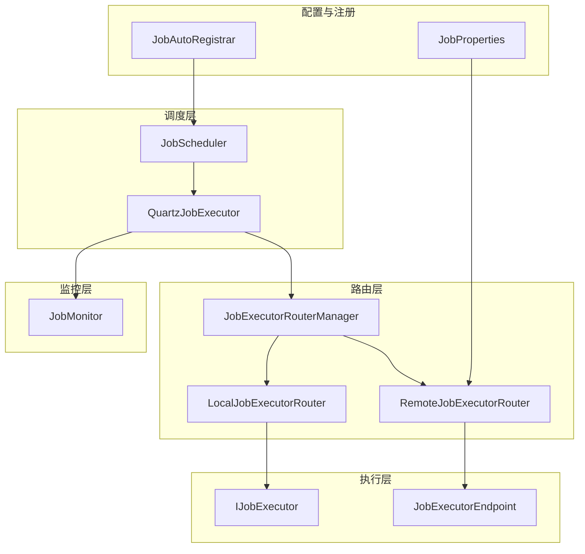
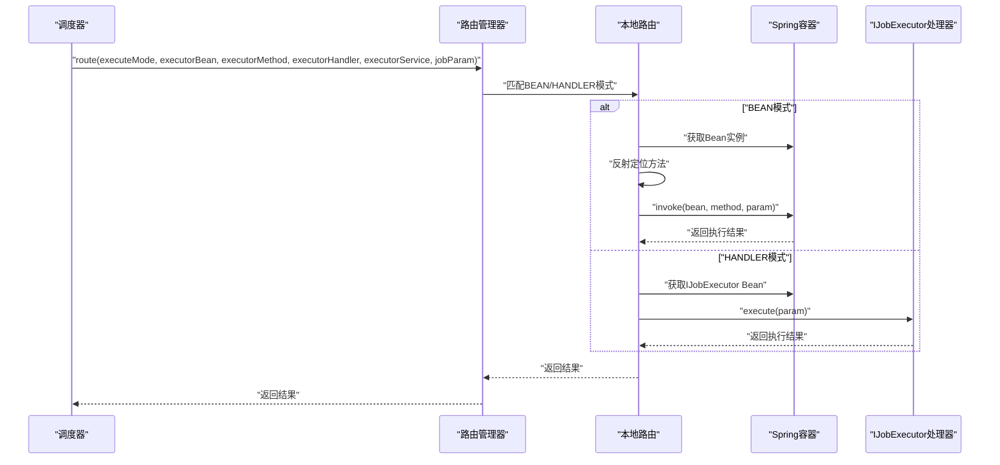
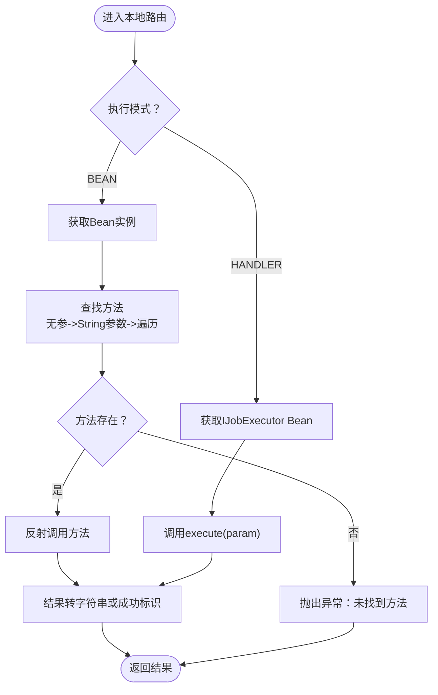
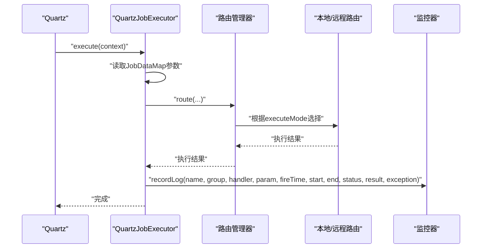
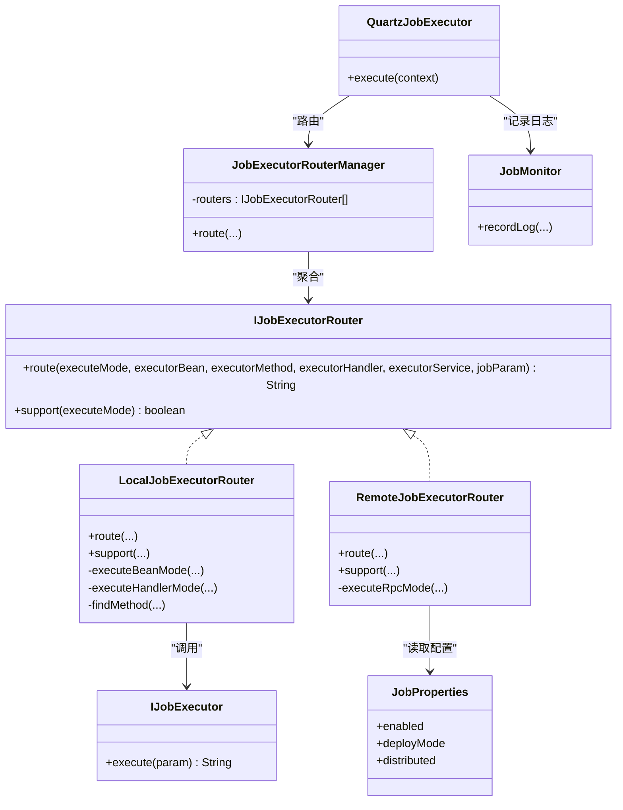

# 本地任务执行器

<cite>
**本文引用的文件**
- [LocalJobExecutorRouter.java](file://forge/forge-framework/forge-plugin-parent/forge-plugin-job/src/main/java/com/mdframe/forge/plugin/job/executor/impl/LocalJobExecutorRouter.java)
- [IJobExecutorRouter.java](file://forge/forge-framework/forge-plugin-parent/forge-plugin-job/src/main/java/com/mdframe/forge/plugin/job/executor/IJobExecutorRouter.java)
- [JobExecutorRouterManager.java](file://forge/forge-framework/forge-plugin-parent/forge-plugin-job/src/main/java/com/mdframe/forge/plugin/job/executor/JobExecutorRouterManager.java)
- [IJobExecutor.java](file://forge/forge-framework/forge-plugin-parent/forge-plugin-job/src/main/java/com/mdframe/forge/plugin/job/executor/IJobExecutor.java)
- [QuartzJobExecutor.java](file://forge/forge-framework/forge-plugin-parent/forge-plugin-job/src/main/java/com/mdframe/forge/plugin/job/scheduler/QuartzJobExecutor.java)
- [JobScheduler.java](file://forge/forge-framework/forge-plugin-parent/forge-plugin-job/src/main/java/com/mdframe/forge/plugin/job/scheduler/JobScheduler.java)
- [JobAutoRegistrar.java](file://forge/forge-framework/forge-plugin-parent/forge-plugin-job/src/main/java/com/mdframe/forge/plugin/job/registry/JobAutoRegistrar.java)
- [JobMonitor.java](file://forge/forge-framework/forge-plugin-parent/forge-plugin-job/src/main/java/com/mdframe/forge/plugin/job/monitor/JobMonitor.java)
- [JobProperties.java](file://forge/forge-framework/forge-plugin-parent/forge-plugin-job/src/main/java/com/mdframe/forge/plugin/job/config/JobProperties.java)
- [JobExecutorEndpoint.java](file://forge/forge-framework/forge-plugin-parent/forge-plugin-job/src/main/java/com/mdframe/forge/plugin/job/controller/JobExecutorEndpoint.java)
- [JobExamples.java](file://forge/forge-framework/forge-plugin-parent/forge-plugin-job/src/main/java/com/mdframe/forge/plugin/job/example/JobExamples.java)
- [application-job-example.yml](file://forge/forge-framework/forge-plugin-parent/forge-plugin-job/src/main/resources/application-job-example.yml)
</cite>

## 目录
1. [简介](#简介)
2. [项目结构](#项目结构)
3. [核心组件](#核心组件)
4. [架构总览](#架构总览)
5. [组件详解](#组件详解)
6. [依赖关系分析](#依赖关系分析)
7. [性能考量](#性能考量)
8. [故障排查指南](#故障排查指南)
9. [结论](#结论)
10. [附录](#附录)

## 简介
本文件面向“本地任务执行器”的技术文档，重点围绕 LocalJobExecutorRouter 的实现原理展开，涵盖以下主题：
- 本地任务执行器的注册机制与自动装配
- 任务调度策略与执行上下文管理
- 同步与异步任务的处理方式
- 任务执行生命周期、异常捕获与错误恢复
- 配置项、性能调优参数与最佳实践

## 项目结构
本地任务执行器位于插件模块中，围绕“调度器-路由-执行器”三层设计组织代码，关键目录与职责如下：
- 调度层：基于 Quartz 的任务调度器与执行入口
- 路由层：根据执行模式选择本地或远程执行路径
- 执行层：本地执行器（Bean 方法或 Handler）与远程执行端点
- 监控层：统一记录执行日志与失败告警
- 自动注册：扫描注解自动注册任务与 Handler

图表来源
- [JobScheduler.java](file://forge/forge-framework/forge-plugin-parent/forge-plugin-job/src/main/java/com/mdframe/forge/plugin/job/scheduler/JobScheduler.java#L1-L105)
- [QuartzJobExecutor.java](file://forge/forge-framework/forge-plugin-parent/forge-plugin-job/src/main/java/com/mdframe/forge/plugin/job/scheduler/QuartzJobExecutor.java#L13-L60)
- [JobExecutorRouterManager.java](file://forge/forge-framework/forge-plugin-parent/forge-plugin-job/src/main/java/com/mdframe/forge/plugin/job/executor/JobExecutorRouterManager.java#L1-L41)
- [LocalJobExecutorRouter.java](file://forge/forge-framework/forge-plugin-parent/forge-plugin-job/src/main/java/com/mdframe/forge/plugin/job/executor/impl/LocalJobExecutorRouter.java#L1-L102)
- [JobExecutorEndpoint.java](file://forge/forge-framework/forge-plugin-parent/forge-plugin-job/src/main/java/com/mdframe/forge/plugin/job/controller/JobExecutorEndpoint.java#L15-L57)
- [JobMonitor.java](file://forge/forge-framework/forge-plugin-parent/forge-plugin-job/src/main/java/com/mdframe/forge/plugin/job/monitor/JobMonitor.java#L1-L106)
- [JobProperties.java](file://forge/forge-framework/forge-plugin-parent/forge-plugin-job/src/main/java/com/mdframe/forge/plugin/job/config/JobProperties.java#L1-L66)
- [JobAutoRegistrar.java](file://forge/forge-framework/forge-plugin-parent/forge-plugin-job/src/main/java/com/mdframe/forge/plugin/job/registry/JobAutoRegistrar.java#L1-L105)

章节来源
- [JobScheduler.java](file://forge/forge-framework/forge-plugin-parent/forge-plugin-job/src/main/java/com/mdframe/forge/plugin/job/scheduler/JobScheduler.java#L1-L105)
- [JobExecutorRouterManager.java](file://forge/forge-framework/forge-plugin-parent/forge-plugin-job/src/main/java/com/mdframe/forge/plugin/job/executor/JobExecutorRouterManager.java#L1-L41)
- [LocalJobExecutorRouter.java](file://forge/forge-framework/forge-plugin-parent/forge-plugin-job/src/main/java/com/mdframe/forge/plugin/job/executor/impl/LocalJobExecutorRouter.java#L1-L102)
- [JobExecutorEndpoint.java](file://forge/forge-framework/forge-plugin-parent/forge-plugin-job/src/main/java/com/mdframe/forge/plugin/job/controller/JobExecutorEndpoint.java#L15-L57)
- [JobMonitor.java](file://forge/forge-framework/forge-plugin-parent/forge-plugin-job/src/main/java/com/mdframe/forge/plugin/job/monitor/JobMonitor.java#L1-L106)
- [JobProperties.java](file://forge/forge-framework/forge-plugin-parent/forge-plugin-job/src/main/java/com/mdframe/forge/plugin/job/config/JobProperties.java#L1-L66)
- [JobAutoRegistrar.java](file://forge/forge-framework/forge-plugin-parent/forge-plugin-job/src/main/java/com/mdframe/forge/plugin/job/registry/JobAutoRegistrar.java#L1-L105)

## 核心组件
- 本地执行器路由 LocalJobExecutorRouter：负责在单体模式下根据执行模式（BEAN/HANDLER）直接调用本地 Bean 或 Handler。
- 路由管理器 JobExecutorRouterManager：聚合多种路由器，按执行模式选择合适路由。
- 任务调度器 JobScheduler：封装 Quartz，负责任务的增删改查与触发。
- 执行入口 QuartzJobExecutor：从 JobDataMap 中读取任务参数，调用路由管理器执行，并记录日志。
- 监控器 JobMonitor：统一记录执行日志、计算耗时、失败告警。
- 配置 JobProperties：部署模式、分布式配置等。
- 注册器 JobAutoRegistrar：扫描注解自动注册任务与 Handler。
- 远程执行端点 JobExecutorEndpoint：在分布式模式下被调度中心调用。

章节来源
- [LocalJobExecutorRouter.java](file://forge/forge-framework/forge-plugin-parent/forge-plugin-job/src/main/java/com/mdframe/forge/plugin/job/executor/impl/LocalJobExecutorRouter.java#L1-L102)
- [JobExecutorRouterManager.java](file://forge/forge-framework/forge-plugin-parent/forge-plugin-job/src/main/java/com/mdframe/forge/plugin/job/executor/JobExecutorRouterManager.java#L1-L41)
- [QuartzJobExecutor.java](file://forge/forge-framework/forge-plugin-parent/forge-plugin-job/src/main/java/com/mdframe/forge/plugin/job/scheduler/QuartzJobExecutor.java#L13-L60)
- [JobScheduler.java](file://forge/forge-framework/forge-plugin-parent/forge-plugin-job/src/main/java/com/mdframe/forge/plugin/job/scheduler/JobScheduler.java#L1-L105)
- [JobMonitor.java](file://forge/forge-framework/forge-plugin-parent/forge-plugin-job/src/main/java/com/mdframe/forge/plugin/job/monitor/JobMonitor.java#L1-L106)
- [JobProperties.java](file://forge/forge-framework/forge-plugin-parent/forge-plugin-job/src/main/java/com/mdframe/forge/plugin/job/config/JobProperties.java#L1-L66)
- [JobAutoRegistrar.java](file://forge/forge-framework/forge-plugin-parent/forge-plugin-job/src/main/java/com/mdframe/forge/plugin/job/registry/JobAutoRegistrar.java#L1-L105)
- [JobExecutorEndpoint.java](file://forge/forge-framework/forge-plugin-parent/forge-plugin-job/src/main/java/com/mdframe/forge/plugin/job/controller/JobExecutorEndpoint.java#L15-L57)

## 架构总览
本地任务执行器采用“单体模式优先”的设计，BEAN 与 HANDLER 两种执行模式均在本地 JVM 内部完成；当部署模式切换为分布式时，路由会自动切换到远程执行路径。

图表来源
- [JobExecutorRouterManager.java](file://forge/forge-framework/forge-plugin-parent/forge-plugin-job/src/main/java/com/mdframe/forge/plugin/job/executor/JobExecutorRouterManager.java#L24-L40)
- [LocalJobExecutorRouter.java](file://forge/forge-framework/forge-plugin-parent/forge-plugin-job/src/main/java/com/mdframe/forge/plugin/job/executor/impl/LocalJobExecutorRouter.java#L19-L39)
- [IJobExecutor.java](file://forge/forge-framework/forge-plugin-parent/forge-plugin-job/src/main/java/com/mdframe/forge/plugin/job/executor/IJobExecutor.java#L7-L16)

## 组件详解

### 本地执行器路由 LocalJobExecutorRouter
- 支持模式：BEAN 与 HANDLER
- 执行流程：
  - BEAN 模式：通过 Spring 容器获取 Bean，反射定位方法（无参或带 String 参数），设置可访问后调用，返回值非空则转字符串，否则返回固定成功标识。
  - HANDLER 模式：通过 Spring 容器获取实现 IJobExecutor 接口的 Bean，调用其 execute 方法。
  - 方法查找策略：优先尝试无参方法，再尝试带 String 参数的方法，最后遍历所有方法匹配名称。
- 错误处理：对缺失 Bean、方法不可见、参数不匹配等情况抛出运行时异常。

图表来源
- [LocalJobExecutorRouter.java](file://forge/forge-framework/forge-plugin-parent/forge-plugin-job/src/main/java/com/mdframe/forge/plugin/job/executor/impl/LocalJobExecutorRouter.java#L44-L100)

章节来源
- [LocalJobExecutorRouter.java](file://forge/forge-framework/forge-plugin-parent/forge-plugin-job/src/main/java/com/mdframe/forge/plugin/job/executor/impl/LocalJobExecutorRouter.java#L1-L102)

### 路由管理器 JobExecutorRouterManager
- 职责：聚合多个 IJobExecutorRouter 实现，按执行模式选择可用路由。
- 行为：遍历已加载的路由器，调用其 support 判断是否支持当前模式，匹配成功即调用 route 执行并返回结果；若无匹配则抛出不支持的异常。

章节来源
- [JobExecutorRouterManager.java](file://forge/forge-framework/forge-plugin-parent/forge-plugin-job/src/main/java/com/mdframe/forge/plugin/job/executor/JobExecutorRouterManager.java#L1-L41)

### 任务调度与执行上下文 QuartzJobExecutor
- 上下文：从 JobExecutionContext 获取任务名称、分组、触发时间；从 JobDataMap 读取执行模式与参数。
- 生命周期：
  - 开始执行：记录开始时间，调用路由管理器执行任务。
  - 异常捕获：捕获异常，构造失败结果。
  - 结束执行：记录结束时间，调用监控器记录日志（含耗时、状态、异常信息）。
- 结果：无论成功或失败，都会持久化执行日志。

图表来源
- [QuartzJobExecutor.java](file://forge/forge-framework/forge-plugin-parent/forge-plugin-job/src/main/java/com/mdframe/forge/plugin/job/scheduler/QuartzJobExecutor.java#L20-L59)
- [JobMonitor.java](file://forge/forge-framework/forge-plugin-parent/forge-plugin-job/src/main/java/com/mdframe/forge/plugin/job/monitor/JobMonitor.java#L35-L75)

章节来源
- [QuartzJobExecutor.java](file://forge/forge-framework/forge-plugin-parent/forge-plugin-job/src/main/java/com/mdframe/forge/plugin/job/scheduler/QuartzJobExecutor.java#L13-L60)
- [JobMonitor.java](file://forge/forge-framework/forge-plugin-parent/forge-plugin-job/src/main/java/com/mdframe/forge/plugin/job/monitor/JobMonitor.java#L1-L106)

### 任务调度器 JobScheduler
- 功能：封装 Quartz，提供任务的新增、修改、删除、暂停、恢复等操作。
- 关键点：将执行器参数（如 executorHandler、executorBean、executorMethod、executorService、jobParam、executeMode）写入 JobDetail 的 JobDataMap，供执行入口读取。

章节来源
- [JobScheduler.java](file://forge/forge-framework/forge-plugin-parent/forge-plugin-job/src/main/java/com/mdframe/forge/plugin/job/scheduler/JobScheduler.java#L1-L105)

### 监控器 JobMonitor
- 日志字段：任务名、分组、Handler、参数、触发时间、开始/结束时间、耗时、状态、结果、异常信息。
- 告警：当状态为失败且存在告警通知器时，逐个发送告警。
- 存储：调用 IJobLogStorage 接口保存日志，建议在生产环境实现持久化存储。

章节来源
- [JobMonitor.java](file://forge/forge-framework/forge-plugin-parent/forge-plugin-job/src/main/java/com/mdframe/forge/plugin/job/monitor/JobMonitor.java#L1-L106)

### 自动注册 JobAutoRegistrar
- 扫描范围：类与方法上的注解。
- 注册行为：
  - 方法级 @JobHandler：记录 Handler 名称与 Bean 名称映射，用于后续动态任务绑定。
  - 方法级 @ScheduledJob：构建 JobConfig，去重后插入数据库并调用 JobScheduler.addJob 注册到 Quartz。
- 注意：@ScheduledJob.enabled=false 时跳过注册。

章节来源
- [JobAutoRegistrar.java](file://forge/forge-framework/forge-plugin-parent/forge-plugin-job/src/main/java/com/mdframe/forge/plugin/job/registry/JobAutoRegistrar.java#L1-L105)

### 远程执行端点 JobExecutorEndpoint
- 作用：在分布式模式下，作为远程执行器端点被调度中心调用，执行本地 Handler。
- 条件启用：受配置开关控制，默认开启。
- 请求体：包含 handlerName 与 param，执行后返回结果或错误信息。

章节来源
- [JobExecutorEndpoint.java](file://forge/forge-framework/forge-plugin-parent/forge-plugin-job/src/main/java/com/mdframe/forge/plugin/job/controller/JobExecutorEndpoint.java#L15-L57)

### 配置 JobProperties
- 关键配置：
  - enabled：是否启用任务调度
  - deployMode：部署模式（STANDALONE/DISTRIBUTED）
  - distributed.registryType：服务注册中心类型（默认 nacos）
  - distributed.executorServices：执行器服务名列表（逗号分隔）
  - distributed.timeout：RPC 调用超时（毫秒）
  - distributed.retryCount：失败重试次数
- 影响：决定路由是否走远程路径以及远程调用行为。

章节来源
- [JobProperties.java](file://forge/forge-framework/forge-plugin-parent/forge-plugin-job/src/main/java/com/mdframe/forge/plugin/job/config/JobProperties.java#L1-L66)

### 使用示例 JobExamples
- BEAN 模式：通过 @ScheduledJob 注解直接绑定本地 Bean 方法，支持无参与带 String 参数两种签名。
- HANDLER 模式：通过 @JobHandler 注解定义 Handler Bean，配合调度器动态创建任务。
- RPC 模式：在分布式部署场景下，通过 REST API 或数据库配置任务，指定 executorService 与 executorHandler，由调度中心远程调用。

章节来源
- [JobExamples.java](file://forge/forge-framework/forge-plugin-parent/forge-plugin-job/src/main/java/com/mdframe/forge/plugin/job/example/JobExamples.java#L1-L97)

## 依赖关系分析
- 路由层与执行层：
  - LocalJobExecutorRouter 依赖 Spring 容器获取 Bean 与 IJobExecutor 实现。
  - RemoteJobExecutorRouter 依赖 JobProperties 的分布式配置。
- 调度层与路由层：
  - QuartzJobExecutor 通过 JobExecutorRouterManager 路由到本地或远程执行。
- 监控层：
  - QuartzJobExecutor 在 finally 中调用 JobMonitor 记录日志。
- 自动注册：
  - JobAutoRegistrar 在 Bean 初始化后扫描注解并注册任务。

图表来源
- [IJobExecutorRouter.java](file://forge/forge-framework/forge-plugin-parent/forge-plugin-job/src/main/java/com/mdframe/forge/plugin/job/executor/IJobExecutorRouter.java#L1-L32)
- [LocalJobExecutorRouter.java](file://forge/forge-framework/forge-plugin-parent/forge-plugin-job/src/main/java/com/mdframe/forge/plugin/job/executor/impl/LocalJobExecutorRouter.java#L1-L102)
- [RemoteJobExecutorRouter.java](file://forge/forge-framework/forge-plugin-parent/forge-plugin-job/src/main/java/com/mdframe/forge/plugin/job/executor/impl/RemoteJobExecutorRouter.java#L16-L56)
- [JobExecutorRouterManager.java](file://forge/forge-framework/forge-plugin-parent/forge-plugin-job/src/main/java/com/mdframe/forge/plugin/job/executor/JobExecutorRouterManager.java#L1-L41)
- [IJobExecutor.java](file://forge/forge-framework/forge-plugin-parent/forge-plugin-job/src/main/java/com/mdframe/forge/plugin/job/executor/IJobExecutor.java#L1-L16)
- [QuartzJobExecutor.java](file://forge/forge-framework/forge-plugin-parent/forge-plugin-job/src/main/java/com/mdframe/forge/plugin/job/scheduler/QuartzJobExecutor.java#L13-L60)
- [JobMonitor.java](file://forge/forge-framework/forge-plugin-parent/forge-plugin-job/src/main/java/com/mdframe/forge/plugin/job/monitor/JobMonitor.java#L1-L106)
- [JobProperties.java](file://forge/forge-framework/forge-plugin-parent/forge-plugin-job/src/main/java/com/mdframe/forge/plugin/job/config/JobProperties.java#L1-L66)

## 性能考量
- 反射开销：LocalJobExecutorRouter 在 BEAN 模式下进行方法查找与反射调用，建议：
  - 优先使用无参方法签名，减少参数适配成本。
  - 对热点任务避免频繁创建临时对象，复用线程池与连接。
- 日志与告警：
  - JobMonitor 对异常堆栈与结果进行截断，避免日志过大；建议在高并发场景下限制日志级别或采样。
- 调度与触发：
  - Quartz 的 Cron 表达式应合理设置，避免过于频繁的短周期任务导致 CPU 峰值。
- 分布式远程调用：
  - 当 deployMode=DISTRIBUTED 时，合理设置 distributed.timeout 与 retryCount，避免阻塞与雪崩。

[本节为通用性能建议，无需特定文件引用]

## 故障排查指南
- 本地路由不支持的执行模式
  - 现象：抛出不支持的执行模式异常。
  - 排查：确认任务配置的 executeMode 是否为 BEAN 或 HANDLER。
  - 参考
    - [LocalJobExecutorRouter.java](file://forge/forge-framework/forge-plugin-parent/forge-plugin-job/src/main/java/com/mdframe/forge/plugin/job/executor/impl/LocalJobExecutorRouter.java#L31-L33)
- 未指定执行器 Bean 或方法
  - 现象：运行时异常提示未指定执行器 Bean 或方法。
  - 排查：检查任务配置中的 executorBean 与 executorMethod。
  - 参考
    - [LocalJobExecutorRouter.java](file://forge/forge-framework/forge-plugin-parent/forge-plugin-job/src/main/java/com/mdframe/forge/plugin/job/executor/impl/LocalJobExecutorRouter.java#L45-L47)
- 未找到执行方法
  - 现象：运行时异常提示未找到执行方法。
  - 排查：确认方法名与签名（无参或 String 参数），或检查方法是否可访问。
  - 参考
    - [LocalJobExecutorRouter.java](file://forge/forge-framework/forge-plugin-parent/forge-plugin-job/src/main/java/com/mdframe/forge/plugin/job/executor/impl/LocalJobExecutorRouter.java#L51-L53)
- Handler 执行失败
  - 现象：远程执行端点返回错误信息。
  - 排查：确认 Handler Bean 名称与实现，检查执行参数与内部异常。
  - 参考
    - [JobExecutorEndpoint.java](file://forge/forge-framework/forge-plugin-parent/forge-plugin-job/src/main/java/com/mdframe/forge/plugin/job/controller/JobExecutorEndpoint.java#L34-L50)
- 日志未落库
  - 现象：执行日志未持久化。
  - 排查：确认 IJobLogStorage 实现是否注入，数据库连接与表结构是否存在。
  - 参考
    - [JobMonitor.java](file://forge/forge-framework/forge-plugin-parent/forge-plugin-job/src/main/java/com/mdframe/forge/plugin/job/monitor/JobMonitor.java#L55-L60)

章节来源
- [LocalJobExecutorRouter.java](file://forge/forge-framework/forge-plugin-parent/forge-plugin-job/src/main/java/com/mdframe/forge/plugin/job/executor/impl/LocalJobExecutorRouter.java#L31-L53)
- [JobExecutorEndpoint.java](file://forge/forge-framework/forge-plugin-parent/forge-plugin-job/src/main/java/com/mdframe/forge/plugin/job/controller/JobExecutorEndpoint.java#L34-L50)
- [JobMonitor.java](file://forge/forge-framework/forge-plugin-parent/forge-plugin-job/src/main/java/com/mdframe/forge/plugin/job/monitor/JobMonitor.java#L55-L60)

## 结论
LocalJobExecutorRouter 提供了简洁高效的本地任务执行能力，结合 Quartz 调度、统一监控与自动注册机制，形成从“任务定义—注册—调度—执行—监控”的完整闭环。在单体模式下，BEAN 与 HANDLER 两种执行方式满足大多数本地任务场景；在分布式模式下，可通过远程端点与配置参数实现跨服务的任务执行与容错。

[本节为总结性内容，无需特定文件引用]

## 附录

### 配置项与最佳实践
- 配置项
  - forge.job.enabled：是否启用任务调度
  - forge.job.deploy-mode：部署模式（STANDALONE/DISTRIBUTED）
  - forge.job.distributed.registry-type：注册中心类型（默认 nacos）
  - forge.job.distributed.executor-services：执行器服务名列表（逗号分隔）
  - forge.job.distributed.timeout：RPC 调用超时（毫秒）
  - forge.job.distributed.retry-count：失败重试次数
  - 参考
    - [JobProperties.java](file://forge/forge-framework/forge-plugin-parent/forge-plugin-job/src/main/java/com/mdframe/forge/plugin/job/config/JobProperties.java#L1-L66)
    - [application-job-example.yml](file://forge/forge-framework/forge-plugin-parent/forge-plugin-job/src/main/resources/application-job-example.yml)
- 最佳实践
  - 本地任务优先使用 HANDLER 模式，便于动态配置与扩展。
  - BEAN 模式适合稳定、低频的本地方法直连。
  - 分布式模式下，合理设置超时与重试，避免远程调用拖垮本地服务。
  - 生产环境务必实现 IJobLogStorage 并接入持久化存储。
  - 对高频任务进行限流与降噪，避免日志风暴。

章节来源
- [JobProperties.java](file://forge/forge-framework/forge-plugin-parent/forge-plugin-job/src/main/java/com/mdframe/forge/plugin/job/config/JobProperties.java#L1-L66)
- [application-job-example.yml](file://forge/forge-framework/forge-plugin-parent/forge-plugin-job/src/main/resources/application-job-example.yml)