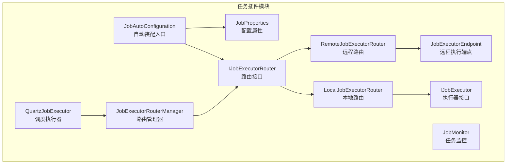
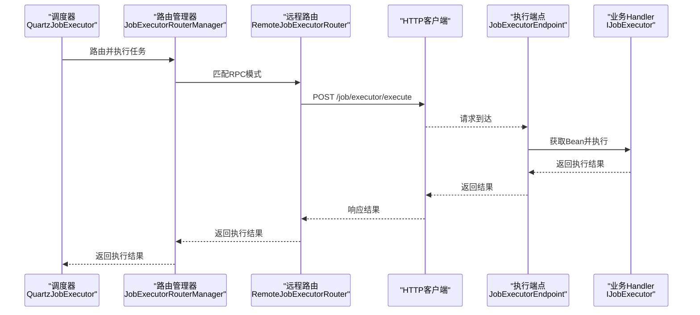
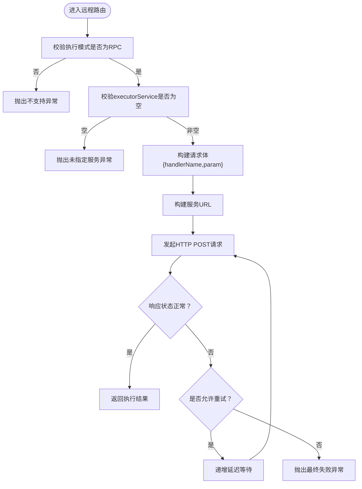
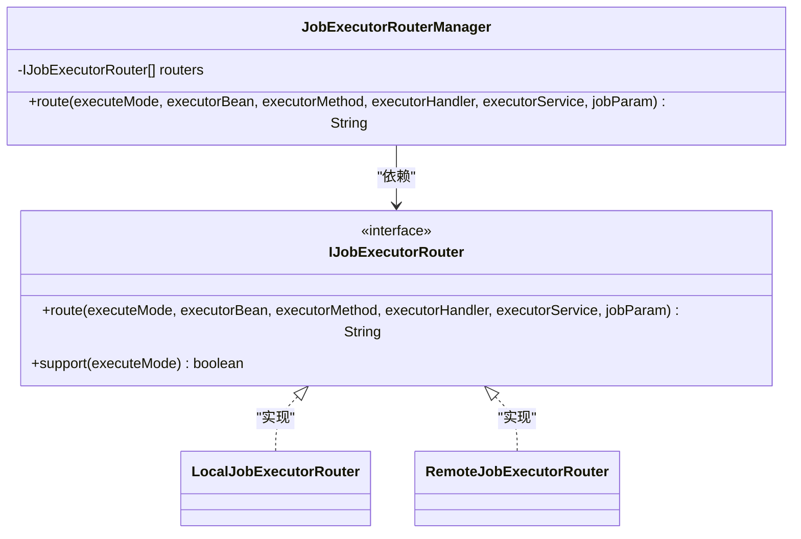
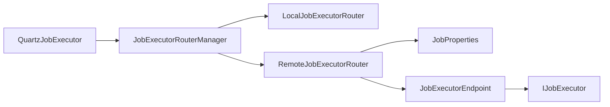

# 远程任务执行器

<cite>
**本文引用的文件**
- [RemoteJobExecutorRouter.java](file://forge/forge-framework/forge-plugin-parent/forge-plugin-job/src/main/java/com/mdframe/forge/plugin/job/executor/impl/RemoteJobExecutorRouter.java)
- [IJobExecutorRouter.java](file://forge/forge-framework/forge-plugin-parent/forge-plugin-job/src/main/java/com/mdframe/forge/plugin/job/executor/IJobExecutorRouter.java)
- [JobExecutorRouterManager.java](file://forge/forge-framework/forge-plugin-parent/forge-plugin-job/src/main/java/com/mdframe/forge/plugin/job/executor/JobExecutorRouterManager.java)
- [LocalJobExecutorRouter.java](file://forge/forge-framework/forge-plugin-parent/forge-plugin-job/src/main/java/com/mdframe/forge/plugin/job/executor/impl/LocalJobExecutorRouter.java)
- [JobExecutorEndpoint.java](file://forge/forge-framework/forge-plugin-parent/forge-plugin-job/src/main/java/com/mdframe/forge/plugin/job/controller/JobExecutorEndpoint.java)
- [IJobExecutor.java](file://forge/forge-framework/forge-plugin-parent/forge-plugin-job/src/main/java/com/mdframe/forge/plugin/job/executor/IJobExecutor.java)
- [JobProperties.java](file://forge/forge-framework/forge-plugin-parent/forge-plugin-job/src/main/java/com/mdframe/forge/plugin/job/config/JobProperties.java)
- [JobAutoConfiguration.java](file://forge/forge-framework/forge-plugin-parent/forge-plugin-job/src/main/java/com/mdframe/forge/plugin/job/config/JobAutoConfiguration.java)
- [QuartzJobExecutor.java](file://forge/forge-framework/forge-plugin-parent/forge-plugin-job/src/main/java/com/mdframe/forge/plugin/job/scheduler/QuartzJobExecutor.java)
- [JobExamples.java](file://forge/forge-framework/forge-plugin-parent/forge-plugin-job/src/main/java/com/mdframe/forge/plugin/job/example/JobExamples.java)
- [JobMonitor.java](file://forge/forge-framework/forge-plugin-parent/forge-plugin-job/src/main/java/com/mdframe/forge/plugin/job/monitor/JobMonitor.java)
- [SysJobLog.java](file://forge/forge-framework/forge-plugin-parent/forge-plugin-job/src/main/java/com/mdframe/forge/plugin/job/entity/SysJobLog.java)
- [JobLog.java](file://forge/forge-framework/forge-plugin-parent/forge-plugin-job/src/main/java/com/mdframe/forge/plugin/job/model/JobLog.java)
- [API.md](file://forge/forge-framework/forge-starter-parent/forge-starter-job/API.md)
</cite>

## 目录
1. [简介](#简介)
2. [项目结构](#项目结构)
3. [核心组件](#核心组件)
4. [架构总览](#架构总览)
5. [组件详解](#组件详解)
6. [依赖关系分析](#依赖关系分析)
7. [性能与可靠性](#性能与可靠性)
8. [故障排查指南](#故障排查指南)
9. [结论](#结论)
10. [附录](#附录)

## 简介
本文件面向“远程任务执行器”的技术实现，围绕 RemoteJobExecutorRouter 的设计与实现进行深入解析，涵盖远程任务执行器的发现机制、负载均衡策略与故障转移处理；同时阐述远程执行器与本地执行器的协调机制，包括网络通信协议、任务序列化与反序列化流程，并提供远程执行器集群配置、网络拓扑设计与容错机制的最佳实践，帮助开发者构建高可用的分布式任务执行系统。

## 项目结构
本项目采用模块化与插件化的组织方式，远程任务执行器相关的核心代码集中在任务插件模块中，配合自动装配与配置类，形成可扩展的执行器路由体系。

图表来源
- [JobAutoConfiguration.java](file://forge/forge-framework/forge-plugin-parent/forge-plugin-job/src/main/java/com/mdframe/forge/plugin/job/config/JobAutoConfiguration.java#L11-L26)
- [JobProperties.java](file://forge/forge-framework/forge-plugin-parent/forge-plugin-job/src/main/java/com/mdframe/forge/plugin/job/config/JobProperties.java#L9-L65)
- [IJobExecutorRouter.java](file://forge/forge-framework/forge-plugin-parent/forge-plugin-job/src/main/java/com/mdframe/forge/plugin/job/executor/IJobExecutorRouter.java#L7-L32)
- [LocalJobExecutorRouter.java](file://forge/forge-framework/forge-plugin-parent/forge-plugin-job/src/main/java/com/mdframe/forge/plugin/job/executor/impl/LocalJobExecutorRouter.java#L17-L102)
- [RemoteJobExecutorRouter.java](file://forge/forge-framework/forge-plugin-parent/forge-plugin-job/src/main/java/com/mdframe/forge/plugin/job/executor/impl/RemoteJobExecutorRouter.java#L24-L106)
- [JobExecutorRouterManager.java](file://forge/forge-framework/forge-plugin-parent/forge-plugin-job/src/main/java/com/mdframe/forge/plugin/job/executor/JobExecutorRouterManager.java#L16-L41)
- [JobExecutorEndpoint.java](file://forge/forge-framework/forge-plugin-parent/forge-plugin-job/src/main/java/com/mdframe/forge/plugin/job/controller/JobExecutorEndpoint.java#L24-L57)
- [IJobExecutor.java](file://forge/forge-framework/forge-plugin-parent/forge-plugin-job/src/main/java/com/mdframe/forge/plugin/job/executor/IJobExecutor.java#L7-L16)
- [QuartzJobExecutor.java](file://forge/forge-framework/forge-plugin-parent/forge-plugin-job/src/main/java/com/mdframe/forge/plugin/job/scheduler/QuartzJobExecutor.java#L40-L60)
- [JobMonitor.java](file://forge/forge-framework/forge-plugin-parent/forge-plugin-job/src/main/java/com/mdframe/forge/plugin/job/monitor/JobMonitor.java#L24-L60)

章节来源
- [JobAutoConfiguration.java](file://forge/forge-framework/forge-plugin-parent/forge-plugin-job/src/main/java/com/mdframe/forge/plugin/job/config/JobAutoConfiguration.java#L11-L26)
- [JobProperties.java](file://forge/forge-framework/forge-plugin-parent/forge-plugin-job/src/main/java/com/mdframe/forge/plugin/job/config/JobProperties.java#L9-L65)

## 核心组件
- 远程执行器路由（RemoteJobExecutorRouter）：负责在分布式模式下将任务以RPC方式转发至远程执行器服务，内置重试与超时控制。
- 路由管理器（JobExecutorRouterManager）：聚合多种路由实现，按执行模式选择具体路由策略。
- 本地执行器路由（LocalJobExecutorRouter）：支持BEAN与HANDLER两种本地执行模式。
- 远程执行端点（JobExecutorEndpoint）：被调度中心调用，执行本地Handler。
- 执行器接口（IJobExecutor）：业务Handler需实现的统一接口。
- 配置属性（JobProperties）：提供部署模式、分布式配置（超时、重试、注册中心类型等）。
- 调度执行器（QuartzJobExecutor）：触发任务并委托路由管理器执行。
- 任务监控（JobMonitor）：记录任务执行日志与异常信息。

章节来源
- [RemoteJobExecutorRouter.java](file://forge/forge-framework/forge-plugin-parent/forge-plugin-job/src/main/java/com/mdframe/forge/plugin/job/executor/impl/RemoteJobExecutorRouter.java#L24-L106)
- [JobExecutorRouterManager.java](file://forge/forge-framework/forge-plugin-parent/forge-plugin-job/src/main/java/com/mdframe/forge/plugin/job/executor/JobExecutorRouterManager.java#L16-L41)
- [LocalJobExecutorRouter.java](file://forge/forge-framework/forge-plugin-parent/forge-plugin-job/src/main/java/com/mdframe/forge/plugin/job/executor/impl/LocalJobExecutorRouter.java#L17-L102)
- [JobExecutorEndpoint.java](file://forge/forge-framework/forge-plugin-parent/forge-plugin-job/src/main/java/com/mdframe/forge/plugin/job/controller/JobExecutorEndpoint.java#L24-L57)
- [IJobExecutor.java](file://forge/forge-framework/forge-plugin-parent/forge-plugin-job/src/main/java/com/mdframe/forge/plugin/job/executor/IJobExecutor.java#L7-L16)
- [JobProperties.java](file://forge/forge-framework/forge-plugin-parent/forge-plugin-job/src/main/java/com/mdframe/forge/plugin/job/config/JobProperties.java#L9-L65)
- [QuartzJobExecutor.java](file://forge/forge-framework/forge-plugin-parent/forge-plugin-job/src/main/java/com/mdframe/forge/plugin/job/scheduler/QuartzJobExecutor.java#L40-L60)
- [JobMonitor.java](file://forge/forge-framework/forge-plugin-parent/forge-plugin-job/src/main/java/com/mdframe/forge/plugin/job/monitor/JobMonitor.java#L24-L60)

## 架构总览
远程任务执行器的整体工作流如下：

图表来源
- [QuartzJobExecutor.java](file://forge/forge-framework/forge-plugin-parent/forge-plugin-job/src/main/java/com/mdframe/forge/plugin/job/scheduler/QuartzJobExecutor.java#L40-L60)
- [JobExecutorRouterManager.java](file://forge/forge-framework/forge-plugin-parent/forge-plugin-job/src/main/java/com/mdframe/forge/plugin/job/executor/JobExecutorRouterManager.java#L24-L40)
- [RemoteJobExecutorRouter.java](file://forge/forge-framework/forge-plugin-parent/forge-plugin-job/src/main/java/com/mdframe/forge/plugin/job/executor/impl/RemoteJobExecutorRouter.java#L55-L93)
- [JobExecutorEndpoint.java](file://forge/forge-framework/forge-plugin-parent/forge-plugin-job/src/main/java/com/mdframe/forge/plugin/job/controller/JobExecutorEndpoint.java#L31-L50)
- [IJobExecutor.java](file://forge/forge-framework/forge-plugin-parent/forge-plugin-job/src/main/java/com/mdframe/forge/plugin/job/executor/IJobExecutor.java#L7-L16)

## 组件详解

### 远程执行器路由（RemoteJobExecutorRouter）
- 功能定位：在分布式模式下，将任务以RPC方式发送到远程执行器服务，支持超时与重试。
- 关键行为
  - 模式校验：仅支持RPC模式。
  - 服务名校验：必须提供有效的executorService。
  - 构建请求体：包含handlerName与jobParam。
  - 调用远程端点：POST /job/executor/execute。
  - 重试策略：基于配置的retryCount与递增延迟。
  - URL构建：当前为占位实现，预留服务发现集成（Nacos/Eureka/Consul）。
- 配置依赖：JobProperties.distributed（超时、重试、注册中心类型）。

图表来源
- [RemoteJobExecutorRouter.java](file://forge/forge-framework/forge-plugin-parent/forge-plugin-job/src/main/java/com/mdframe/forge/plugin/job/executor/impl/RemoteJobExecutorRouter.java#L34-L93)
- [JobProperties.java](file://forge/forge-framework/forge-plugin-parent/forge-plugin-job/src/main/java/com/mdframe/forge/plugin/job/config/JobProperties.java#L28-L49)

章节来源
- [RemoteJobExecutorRouter.java](file://forge/forge-framework/forge-plugin-parent/forge-plugin-job/src/main/java/com/mdframe/forge/plugin/job/executor/impl/RemoteJobExecutorRouter.java#L24-L106)
- [JobProperties.java](file://forge/forge-framework/forge-plugin-parent/forge-plugin-job/src/main/java/com/mdframe/forge/plugin/job/config/JobProperties.java#L28-L49)

### 路由管理器（JobExecutorRouterManager）
- 功能定位：聚合多种路由实现，按执行模式匹配并委派执行。
- 关键行为：遍历已加载的IJobExecutorRouter，调用其support判断，命中后执行route。

图表来源
- [JobExecutorRouterManager.java](file://forge/forge-framework/forge-plugin-parent/forge-plugin-job/src/main/java/com/mdframe/forge/plugin/job/executor/JobExecutorRouterManager.java#L16-L41)
- [IJobExecutorRouter.java](file://forge/forge-framework/forge-plugin-parent/forge-plugin-job/src/main/java/com/mdframe/forge/plugin/job/executor/IJobExecutorRouter.java#L7-L32)
- [LocalJobExecutorRouter.java](file://forge/forge-framework/forge-plugin-parent/forge-plugin-job/src/main/java/com/mdframe/forge/plugin/job/executor/impl/LocalJobExecutorRouter.java#L17-L102)
- [RemoteJobExecutorRouter.java](file://forge/forge-framework/forge-plugin-parent/forge-plugin-job/src/main/java/com/mdframe/forge/plugin/job/executor/impl/RemoteJobExecutorRouter.java#L24-L50)

章节来源
- [JobExecutorRouterManager.java](file://forge/forge-framework/forge-plugin-parent/forge-plugin-job/src/main/java/com/mdframe/forge/plugin/job/executor/JobExecutorRouterManager.java#L16-L41)
- [IJobExecutorRouter.java](file://forge/forge-framework/forge-plugin-parent/forge-plugin-job/src/main/java/com/mdframe/forge/plugin/job/executor/IJobExecutorRouter.java#L7-L32)

### 本地执行器路由（LocalJobExecutorRouter）
- 功能定位：在单体模式下直接执行本地Bean方法或Handler。
- 支持模式：BEAN（反射调用）、HANDLER（接口实现）。
- 方法解析：优先无参方法，再尝试带String参数的方法，最后全量扫描匹配。

章节来源
- [LocalJobExecutorRouter.java](file://forge/forge-framework/forge-plugin-parent/forge-plugin-job/src/main/java/com/mdframe/forge/plugin/job/executor/impl/LocalJobExecutorRouter.java#L17-L102)

### 远程执行端点（JobExecutorEndpoint）
- 功能定位：被调度中心调用，执行本地Handler。
- 接口定义：POST /job/executor/execute，请求体包含handlerName与param。
- 执行流程：从ApplicationContext获取IJobExecutor Bean并执行，返回结果或错误信息。

章节来源
- [JobExecutorEndpoint.java](file://forge/forge-framework/forge-plugin-parent/forge-plugin-job/src/main/java/com/mdframe/forge/plugin/job/controller/JobExecutorEndpoint.java#L24-L57)
- [IJobExecutor.java](file://forge/forge-framework/forge-plugin-parent/forge-plugin-job/src/main/java/com/mdframe/forge/plugin/job/executor/IJobExecutor.java#L7-L16)

### 执行器接口（IJobExecutor）
- 功能定位：业务Handler需实现的统一接口，提供execute方法。

章节来源
- [IJobExecutor.java](file://forge/forge-framework/forge-plugin-parent/forge-plugin-job/src/main/java/com/mdframe/forge/plugin/job/executor/IJobExecutor.java#L7-L16)

### 配置属性（JobProperties）
- 功能定位：集中管理任务调度配置，包括部署模式、分布式配置（超时、重试、注册中心类型、服务列表）。
- 关键字段：enabled、deployMode、distributed.timeout、distributed.retryCount、distributed.registryType、distributed.executorServices。

章节来源
- [JobProperties.java](file://forge/forge-framework/forge-plugin-parent/forge-plugin-job/src/main/java/com/mdframe/forge/plugin/job/config/JobProperties.java#L9-L65)

### 自动装配（JobAutoConfiguration）
- 功能定位：启用配置属性绑定与组件扫描，确保路由与监控组件生效。

章节来源
- [JobAutoConfiguration.java](file://forge/forge-framework/forge-plugin-parent/forge-plugin-job/src/main/java/com/mdframe/forge/plugin/job/config/JobAutoConfiguration.java#L11-L26)

### 调度执行器（QuartzJobExecutor）
- 功能定位：触发任务执行，委托路由管理器完成本地或远程执行，并记录执行日志。

章节来源
- [QuartzJobExecutor.java](file://forge/forge-framework/forge-plugin-parent/forge-plugin-job/src/main/java/com/mdframe/forge/plugin/job/scheduler/QuartzJobExecutor.java#L40-L60)

### 任务监控（JobMonitor）
- 功能定位：记录任务执行日志、异常信息与耗时，支持持久化与告警通知扩展。

章节来源
- [JobMonitor.java](file://forge/forge-framework/forge-plugin-parent/forge-plugin-job/src/main/java/com/mdframe/forge/plugin/job/monitor/JobMonitor.java#L24-L60)
- [SysJobLog.java](file://forge/forge-framework/forge-plugin-parent/forge-plugin-job/src/main/java/com/mdframe/forge/plugin/job/entity/SysJobLog.java#L14-L79)
- [JobLog.java](file://forge/forge-framework/forge-plugin-parent/forge-plugin-job/src/main/java/com/mdframe/forge/plugin/job/model/JobLog.java#L11-L77)

## 依赖关系分析
- 组件耦合
  - QuartzJobExecutor依赖JobExecutorRouterManager进行路由分发。
  - JobExecutorRouterManager聚合IJobExecutorRouter实现（本地与远程）。
  - RemoteJobExecutorRouter依赖JobProperties进行超时与重试配置。
  - RemoteJobExecutorRouter通过HTTP调用JobExecutorEndpoint。
  - JobExecutorEndpoint依赖IJobExecutor接口执行业务逻辑。
- 外部依赖
  - HTTP客户端用于远程调用（当前实现为占位，建议替换为Spring Web或RestTemplate）。
  - 服务发现（Nacos/Eureka/Consul）尚未集成，当前URL构建为占位实现。

图表来源
- [QuartzJobExecutor.java](file://forge/forge-framework/forge-plugin-parent/forge-plugin-job/src/main/java/com/mdframe/forge/plugin/job/scheduler/QuartzJobExecutor.java#L40-L60)
- [JobExecutorRouterManager.java](file://forge/forge-framework/forge-plugin-parent/forge-plugin-job/src/main/java/com/mdframe/forge/plugin/job/executor/JobExecutorRouterManager.java#L16-L41)
- [RemoteJobExecutorRouter.java](file://forge/forge-framework/forge-plugin-parent/forge-plugin-job/src/main/java/com/mdframe/forge/plugin/job/executor/impl/RemoteJobExecutorRouter.java#L24-L106)
- [JobExecutorEndpoint.java](file://forge/forge-framework/forge-plugin-parent/forge-plugin-job/src/main/java/com/mdframe/forge/plugin/job/controller/JobExecutorEndpoint.java#L24-L57)
- [IJobExecutor.java](file://forge/forge-framework/forge-plugin-parent/forge-plugin-job/src/main/java/com/mdframe/forge/plugin/job/executor/IJobExecutor.java#L7-L16)
- [JobProperties.java](file://forge/forge-framework/forge-plugin-parent/forge-plugin-job/src/main/java/com/mdframe/forge/plugin/job/config/JobProperties.java#L9-L65)

## 性能与可靠性
- 超时与重试
  - 远程调用超时与重试次数由JobProperties.distributed控制，避免因瞬时网络波动导致任务失败。
- 递增退避
  - 远程路由在每次重试前进行递增延迟等待，降低对远端服务的压力。
- 本地执行优化
  - 本地路由支持BEAN反射与HANDLER接口两种路径，建议优先使用Handler以减少反射开销。
- 日志与监控
  - JobMonitor记录任务开始/结束时间、耗时、状态与异常，便于性能分析与问题定位。

章节来源
- [RemoteJobExecutorRouter.java](file://forge/forge-framework/forge-plugin-parent/forge-plugin-job/src/main/java/com/mdframe/forge/plugin/job/executor/impl/RemoteJobExecutorRouter.java#L66-L93)
- [JobProperties.java](file://forge/forge-framework/forge-plugin-parent/forge-plugin-job/src/main/java/com/mdframe/forge/plugin/job/config/JobProperties.java#L28-L49)
- [JobMonitor.java](file://forge/forge-framework/forge-plugin-parent/forge-plugin-job/src/main/java/com/mdframe/forge/plugin/job/monitor/JobMonitor.java#L35-L60)

## 故障排查指南
- 常见问题与处理
  - 未指定执行器服务名：检查任务配置中的executorService字段。
  - 不支持的执行模式：确认executeMode为RPC。
  - 远程调用失败：查看重试日志与最后一次异常堆栈；检查目标服务是否启动且端点可用。
  - 本地方法未找到：确认BEAN模式下的方法签名（无参或带String参数）。
- 日志定位
  - 使用JobMonitor记录的异常信息与耗时，结合SysJobLog进行归档查询。
- API参考
  - 参考定时任务管理API文档，核对任务配置与日志查询接口。

章节来源
- [RemoteJobExecutorRouter.java](file://forge/forge-framework/forge-plugin-parent/forge-plugin-job/src/main/java/com/mdframe/forge/plugin/job/executor/impl/RemoteJobExecutorRouter.java#L36-L44)
- [LocalJobExecutorRouter.java](file://forge/forge-framework/forge-plugin-parent/forge-plugin-job/src/main/java/com/mdframe/forge/plugin/job/executor/impl/LocalJobExecutorRouter.java#L44-L72)
- [JobMonitor.java](file://forge/forge-framework/forge-plugin-parent/forge-plugin-job/src/main/java/com/mdframe/forge/plugin/job/monitor/JobMonitor.java#L35-L60)
- [API.md](file://forge/forge-framework/forge-starter-parent/forge-starter-job/API.md#L1-L195)

## 结论
RemoteJobExecutorRouter提供了在分布式模式下将任务以RPC方式转发至远程执行器的能力，并通过超时与重试机制提升可靠性。结合路由管理器、本地路由与远程端点，系统实现了灵活的执行策略切换。建议在生产环境中完善服务发现与负载均衡策略，进一步增强系统的可扩展性与高可用性。

## 附录

### 远程执行器集群配置与最佳实践
- 服务发现与负载均衡
  - 将buildServiceUrl替换为从注册中心（Nacos/Eureka/Consul）获取服务实例列表，并实现轮询/权重/健康检查等负载均衡策略。
- 网络拓扑设计
  - 调度中心与执行器服务通过内网或VPC隔离，仅开放必要的端口；执行器服务多副本部署，避免单点。
- 容错机制
  - 在RemoteJobExecutorRouter中引入熔断与快速失败策略；对异常进行分类统计，触发告警。
- 任务序列化与反序列化
  - 建议统一使用JSON或二进制序列化格式，确保跨语言与跨版本兼容；对敏感参数进行脱敏处理。
- 监控与告警
  - 通过JobMonitor与SysJobLog建立完善的可观测性体系，结合外部监控平台进行可视化展示与告警。

章节来源
- [RemoteJobExecutorRouter.java](file://forge/forge-framework/forge-plugin-parent/forge-plugin-job/src/main/java/com/mdframe/forge/plugin/job/executor/impl/RemoteJobExecutorRouter.java#L99-L106)
- [JobProperties.java](file://forge/forge-framework/forge-plugin-parent/forge-plugin-job/src/main/java/com/mdframe/forge/plugin/job/config/JobProperties.java#L28-L49)
- [JobMonitor.java](file://forge/forge-framework/forge-plugin-parent/forge-plugin-job/src/main/java/com/mdframe/forge/plugin/job/monitor/JobMonitor.java#L24-L60)