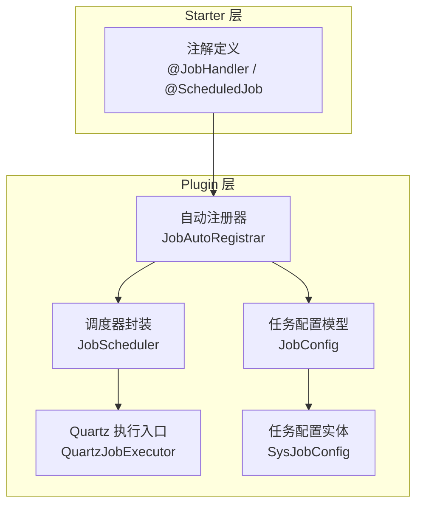
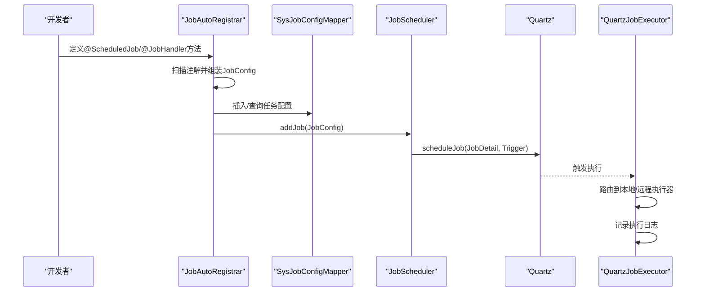
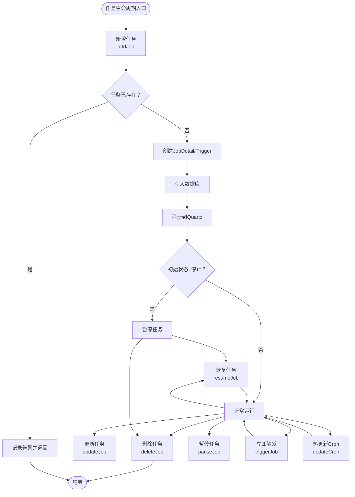
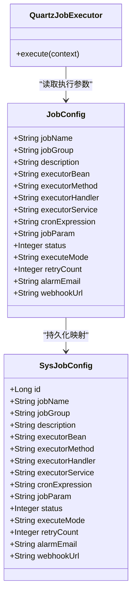
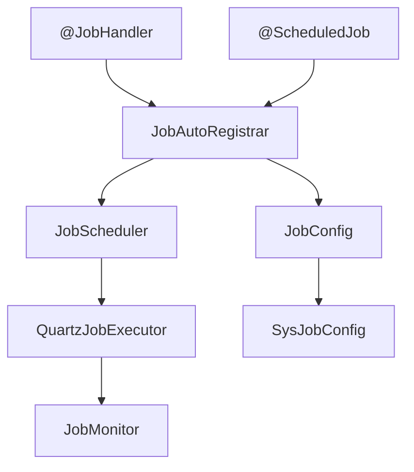

# 任务注解支持

<cite>
**本文引用的文件**
- [JobHandler.java](file://forge/forge-framework/forge-starter-parent/forge-starter-job/src/main/java/com/mdframe/forge/starter/job/annotation/JobHandler.java)
- [ScheduledJob.java](file://forge/forge-framework/forge-starter-parent/forge-starter-job/src/main/java/com/mdframe/forge/starter/job/annotation/ScheduledJob.java)
- [JobAutoRegistrar.java](file://forge/forge-framework/forge-plugin-parent/forge-plugin-job/src/main/java/com/mdframe/forge/plugin/job/registry/JobAutoRegistrar.java)
- [JobScheduler.java](file://forge/forge-framework/forge-plugin-parent/forge-plugin-job/src/main/java/com/mdframe/forge/plugin/job/scheduler/JobScheduler.java)
- [QuartzJobExecutor.java](file://forge/forge-framework/forge-plugin-parent/forge-plugin-job/src/main/java/com/mdframe/forge/plugin/job/scheduler/QuartzJobExecutor.java)
- [JobConfig.java](file://forge/forge-framework/forge-plugin-parent/forge-plugin-job/src/main/java/com/mdframe/forge/plugin/job/model/JobConfig.java)
- [SysJobConfig.java](file://forge/forge-framework/forge-plugin-parent/forge-plugin-job/src/main/java/com/mdframe/forge/plugin/job/entity/SysJobConfig.java)
- [JobExamples.java](file://forge/forge-framework/forge-plugin-parent/forge-plugin-job/src/main/java/com/mdframe/forge/plugin/job/example/JobExamples.java)
</cite>

## 目录
1. [简介](#简介)
2. [项目结构](#项目结构)
3. [核心组件](#核心组件)
4. [架构总览](#架构总览)
5. [组件详解](#组件详解)
6. [依赖关系分析](#依赖关系分析)
7. [性能与可靠性](#性能与可靠性)
8. [故障排查指南](#故障排查指南)
9. [结论](#结论)
10. [附录](#附录)

## 简介
本技术文档围绕“定时任务注解支持”模块，系统阐述注解式任务开发方式，包括：
- 注解使用：@JobHandler 与 @ScheduledJob 的语义、配置项与最佳实践
- 注册机制：基于 Spring BeanPostProcessor 的自动扫描与注册流程
- 参数绑定：任务参数、执行器路由与执行上下文传递
- 生命周期管理：任务的新增、更新、暂停、恢复、立即触发与热更新
- 异常处理：统一异常捕获、结果记录与监控上报
- 开发规范：Handler 接口实现、任务方法签名与执行模式选择
- 实战示例：Bean 直连、Handler 动态绑定与 RPC 分布式模式

## 项目结构
该模块由“starter 层注解定义”和“plugin 层调度实现”两部分组成：
- starter 层：提供注解定义与基础工具类，供业务侧使用
- plugin 层：提供自动注册器、调度器、Quartz 执行入口、任务配置模型与实体

图表来源
- [JobHandler.java](file://forge/forge-framework/forge-starter-parent/forge-starter-job/src/main/java/com/mdframe/forge/starter/job/annotation/JobHandler.java#L1-L29)
- [ScheduledJob.java](file://forge/forge-framework/forge-starter-parent/forge-starter-job/src/main/java/com/mdframe/forge/starter/job/annotation/ScheduledJob.java#L1-L39)
- [JobAutoRegistrar.java](file://forge/forge-framework/forge-plugin-parent/forge-plugin-job/src/main/java/com/mdframe/forge/plugin/job/registry/JobAutoRegistrar.java#L1-L105)
- [JobScheduler.java](file://forge/forge-framework/forge-plugin-parent/forge-plugin-job/src/main/java/com/mdframe/forge/plugin/job/scheduler/JobScheduler.java#L1-L220)
- [QuartzJobExecutor.java](file://forge/forge-framework/forge-plugin-parent/forge-plugin-job/src/main/java/com/mdframe/forge/plugin/job/scheduler/QuartzJobExecutor.java#L1-L61)
- [JobConfig.java](file://forge/forge-framework/forge-plugin-parent/forge-plugin-job/src/main/java/com/mdframe/forge/plugin/job/model/JobConfig.java#L1-L98)
- [SysJobConfig.java](file://forge/forge-framework/forge-plugin-parent/forge-plugin-job/src/main/java/com/mdframe/forge/plugin/job/entity/SysJobConfig.java#L1-L97)

章节来源
- [JobHandler.java](file://forge/forge-framework/forge-starter-parent/forge-starter-job/src/main/java/com/mdframe/forge/starter/job/annotation/JobHandler.java#L1-L29)
- [ScheduledJob.java](file://forge/forge-framework/forge-starter-parent/forge-starter-job/src/main/java/com/mdframe/forge/starter/job/annotation/ScheduledJob.java#L1-L39)
- [JobAutoRegistrar.java](file://forge/forge-framework/forge-plugin-parent/forge-plugin-job/src/main/java/com/mdframe/forge/plugin/job/registry/JobAutoRegistrar.java#L1-L105)
- [JobScheduler.java](file://forge/forge-framework/forge-plugin-parent/forge-plugin-job/src/main/java/com/mdframe/forge/plugin/job/scheduler/JobScheduler.java#L1-L220)
- [QuartzJobExecutor.java](file://forge/forge-framework/forge-plugin-parent/forge-plugin-job/src/main/java/com/mdframe/forge/plugin/job/scheduler/QuartzJobExecutor.java#L1-L61)
- [JobConfig.java](file://forge/forge-framework/forge-plugin-parent/forge-plugin-job/src/main/java/com/mdframe/forge/plugin/job/model/JobConfig.java#L1-L98)
- [SysJobConfig.java](file://forge/forge-framework/forge-plugin-parent/forge-plugin-job/src/main/java/com/mdframe/forge/plugin/job/entity/SysJobConfig.java#L1-L97)

## 核心组件
- 注解层
  - @JobHandler：用于声明“处理器型”任务，标注于类或方法上，提供任务唯一标识、描述与分组
  - @ScheduledJob：用于声明“Bean直连型”定时任务，标注于方法上，提供 Cron 表达式、任务名称、分组、描述与启用开关
- 自动注册层
  - JobAutoRegistrar：在 Bean 初始化后扫描注解，自动注册到调度器；对 @ScheduledJob 自动生成 SysJobConfig 并调用 JobScheduler.addJob
- 调度层
  - JobScheduler：封装 Quartz 的任务 CRUD、暂停/恢复、立即触发与 Cron 热更新，负责任务持久化与状态控制
- 执行层
  - QuartzJobExecutor：Quartz 触发后的统一执行入口，通过 JobExecutorRouterManager 路由至本地/远程执行器，并记录执行日志
- 数据模型层
  - JobConfig：内存任务配置对象，用于组装与传递任务元数据
  - SysJobConfig：持久化实体，对应数据库表 sys_job_config，存储任务配置与状态

章节来源
- [JobHandler.java](file://forge/forge-framework/forge-starter-parent/forge-starter-job/src/main/java/com/mdframe/forge/starter/job/annotation/JobHandler.java#L1-L29)
- [ScheduledJob.java](file://forge/forge-framework/forge-starter-parent/forge-starter-job/src/main/java/com/mdframe/forge/starter/job/annotation/ScheduledJob.java#L1-L39)
- [JobAutoRegistrar.java](file://forge/forge-framework/forge-plugin-parent/forge-plugin-job/src/main/java/com/mdframe/forge/plugin/job/registry/JobAutoRegistrar.java#L1-L105)
- [JobScheduler.java](file://forge/forge-framework/forge-plugin-parent/forge-plugin-job/src/main/java/com/mdframe/forge/plugin/job/scheduler/JobScheduler.java#L1-L220)
- [QuartzJobExecutor.java](file://forge/forge-framework/forge-plugin-parent/forge-plugin-job/src/main/java/com/mdframe/forge/plugin/job/scheduler/QuartzJobExecutor.java#L1-L61)
- [JobConfig.java](file://forge/forge-framework/forge-plugin-parent/forge-plugin-job/src/main/java/com/mdframe/forge/plugin/job/model/JobConfig.java#L1-L98)
- [SysJobConfig.java](file://forge/forge-framework/forge-plugin-parent/forge-plugin-job/src/main/java/com/mdframe/forge/plugin/job/entity/SysJobConfig.java#L1-L97)

## 架构总览
下图展示从注解到执行的完整链路：注解被自动注册器扫描，生成任务配置并写入数据库，再由调度器注册到 Quartz；Quartz 触发时，统一入口执行器根据执行模式路由到本地 Bean 或远程 Handler，并记录执行日志。

图表来源
- [JobAutoRegistrar.java](file://forge/forge-framework/forge-plugin-parent/forge-plugin-job/src/main/java/com/mdframe/forge/plugin/job/registry/JobAutoRegistrar.java#L34-L103)
- [JobScheduler.java](file://forge/forge-framework/forge-plugin-parent/forge-plugin-job/src/main/java/com/mdframe/forge/plugin/job/scheduler/JobScheduler.java#L23-L65)
- [QuartzJobExecutor.java](file://forge/forge-framework/forge-plugin-parent/forge-plugin-job/src/main/java/com/mdframe/forge/plugin/job/scheduler/QuartzJobExecutor.java#L20-L59)
- [SysJobConfig.java](file://forge/forge-framework/forge-plugin-parent/forge-plugin-job/src/main/java/com/mdframe/forge/plugin/job/entity/SysJobConfig.java#L14-L96)

## 组件详解

### 注解使用指南

- @JobHandler
  - 作用域：类或方法
  - 必填属性：value（任务唯一标识）
  - 可选属性：description（任务描述）、group（任务分组，默认 DEFAULT）
  - 使用建议：用于“处理器型”任务，需在管理界面或 API 中动态创建任务并绑定该 Handler

- @ScheduledJob
  - 作用域：方法
  - 必填属性：cron（Cron 表达式）
  - 可选属性：name（任务名称，默认使用 beanName.methodName）、group（任务分组，默认 DEFAULT）、description（任务描述）、enabled（是否启用，默认 true）
  - 使用建议：适用于 Bean 直连模式，自动注册到 Quartz；方法可带参数，返回值会被记录

章节来源
- [JobHandler.java](file://forge/forge-framework/forge-starter-parent/forge-starter-job/src/main/java/com/mdframe/forge/starter/job/annotation/JobHandler.java#L12-L28)
- [ScheduledJob.java](file://forge/forge-framework/forge-starter-parent/forge-starter-job/src/main/java/com/mdframe/forge/starter/job/annotation/ScheduledJob.java#L12-L38)

### 注册机制与生命周期

- 自动注册流程
  - 在 Bean 初始化完成后扫描所有方法，匹配 @JobHandler 与 @ScheduledJob
  - 对 @ScheduledJob：若未启用则跳过；否则组装 JobConfig，查询/插入 SysJobConfig，调用 JobScheduler.addJob
  - 对 @JobHandler：记录处理器标识，后续由管理端动态绑定与创建任务

- 生命周期管理
  - 新增：addJob → 写入数据库 → 注册到 Quartz → 可选暂停
  - 更新：updateJob → 更新 JobDetail 与 Trigger
  - 删除：deleteJob → 从 Quartz 移除
  - 暂停/恢复：pauseJob/resumeJob → 控制任务触发
  - 立即触发：triggerJob → 立刻执行一次
  - 热更新：updateCron → 重新构建 Trigger 并 reschedule

图表来源
- [JobAutoRegistrar.java](file://forge/forge-framework/forge-plugin-parent/forge-plugin-job/src/main/java/com/mdframe/forge/plugin/job/registry/JobAutoRegistrar.java#L68-L103)
- [JobScheduler.java](file://forge/forge-framework/forge-plugin-parent/forge-plugin-job/src/main/java/com/mdframe/forge/plugin/job/scheduler/JobScheduler.java#L23-L206)

章节来源
- [JobAutoRegistrar.java](file://forge/forge-framework/forge-plugin-parent/forge-plugin-job/src/main/java/com/mdframe/forge/plugin/job/registry/JobAutoRegistrar.java#L34-L103)
- [JobScheduler.java](file://forge/forge-framework/forge-plugin-parent/forge-plugin-job/src/main/java/com/mdframe/forge/plugin/job/scheduler/JobScheduler.java#L23-L206)

### 参数绑定与执行模式

- 参数绑定
  - JobConfig/ SysJobConfig 字段覆盖：任务名、分组、描述、执行器 Bean/方法、Handler、服务名、Cron、参数、状态、执行模式、重试、告警等
  - Quartz 通过 JobDataMap 传递执行器与参数信息，QuartzJobExecutor 提取并路由执行

- 执行模式
  - BEAN：直接调用本地 Bean 方法（单体模式）
  - HANDLER：调用本地 Handler（单体模式）
  - RPC：远程调用其他服务 Handler（分布式模式），需配置 executorService 与 executorHandler

图表来源
- [JobConfig.java](file://forge/forge-framework/forge-plugin-parent/forge-plugin-job/src/main/java/com/mdframe/forge/plugin/job/model/JobConfig.java#L11-L97)
- [SysJobConfig.java](file://forge/forge-framework/forge-plugin-parent/forge-plugin-job/src/main/java/com/mdframe/forge/plugin/job/entity/SysJobConfig.java#L15-L96)
- [QuartzJobExecutor.java](file://forge/forge-framework/forge-plugin-parent/forge-plugin-job/src/main/java/com/mdframe/forge/plugin/job/scheduler/QuartzJobExecutor.java#L18-L60)

章节来源
- [JobConfig.java](file://forge/forge-framework/forge-plugin-parent/forge-plugin-job/src/main/java/com/mdframe/forge/plugin/job/model/JobConfig.java#L11-L97)
- [SysJobConfig.java](file://forge/forge-framework/forge-plugin-parent/forge-plugin-job/src/main/java/com/mdframe/forge/plugin/job/entity/SysJobConfig.java#L15-L96)
- [QuartzJobExecutor.java](file://forge/forge-framework/forge-plugin-parent/forge-plugin-job/src/main/java/com/mdframe/forge/plugin/job/scheduler/QuartzJobExecutor.java#L20-L59)

### 异常处理与监控

- 异常处理策略
  - QuartzJobExecutor 在执行过程中捕获异常，记录错误信息与结果
  - 无论成功与否，均通过 JobMonitor 记录执行日志，包含开始/结束时间、结果状态、异常详情等

- 监控与日志
  - 执行日志字段：任务名/组、Handler、参数、触发时间、开始/结束时间、状态码、结果、异常
  - 支持告警邮箱与 WebHook 地址配置（在 JobConfig/SysJobConfig 中）

章节来源
- [QuartzJobExecutor.java](file://forge/forge-framework/forge-plugin-parent/forge-plugin-job/src/main/java/com/mdframe/forge/plugin/job/scheduler/QuartzJobExecutor.java#L37-L58)
- [JobConfig.java](file://forge/forge-framework/forge-plugin-parent/forge-plugin-job/src/main/java/com/mdframe/forge/plugin/job/model/JobConfig.java#L74-L86)
- [SysJobConfig.java](file://forge/forge-framework/forge-plugin-parent/forge-plugin-job/src/main/java/com/mdframe/forge/plugin/job/entity/SysJobConfig.java#L73-L85)

### 开发规范与最佳实践

- @JobHandler
  - 作为处理器型任务，需实现 IJobExecutor 接口并在管理端动态创建任务绑定
  - 建议为每个 Handler 提供清晰的描述与分组，便于运维管理

- @ScheduledJob
  - Cron 表达式应经过充分测试，避免过于频繁或冲突
  - 方法签名建议无参或明确参数绑定，返回值可用于记录执行结果
  - enabled=false 时跳过注册，适合临时禁用任务

- 通用规范
  - 任务名唯一且具有业务含义；分组用于归类不同业务域
  - 优先使用 Bean 直连模式进行本地任务；跨服务使用 RPC 模式
  - 对关键任务配置重试次数与告警策略

章节来源
- [JobHandler.java](file://forge/forge-framework/forge-starter-parent/forge-starter-job/src/main/java/com/mdframe/forge/starter/job/annotation/JobHandler.java#L14-L28)
- [ScheduledJob.java](file://forge/forge-framework/forge-starter-parent/forge-starter-job/src/main/java/com/mdframe/forge/starter/job/annotation/ScheduledJob.java#L14-L38)
- [JobAutoRegistrar.java](file://forge/forge-framework/forge-plugin-parent/forge-plugin-job/src/main/java/com/mdframe/forge/plugin/job/registry/JobAutoRegistrar.java#L69-L77)

### 实战示例与使用范式

- Bean 直连模式（@ScheduledJob）
  - 示例：每 5 秒执行一次的简单任务；每 10 分钟执行一次带参数的任务
  - 关键点：cron 表达式、name 与 description、返回值记录

- Handler 动态绑定模式（@JobHandler）
  - 示例：数据清理与报表生成两个 Handler，分别实现 IJobExecutor
  - 关键点：在管理端创建任务并绑定相应 Handler

- RPC 分布式模式
  - 示例：通过配置 executorService 与 executorHandler 实现跨服务调用
  - 关键点：目标服务需实现 IJobExecutor 并开启执行器端点

章节来源
- [JobExamples.java](file://forge/forge-framework/forge-plugin-parent/forge-plugin-job/src/main/java/com/mdframe/forge/plugin/job/example/JobExamples.java#L21-L96)

## 依赖关系分析

图表来源
- [JobHandler.java](file://forge/forge-framework/forge-starter-parent/forge-starter-job/src/main/java/com/mdframe/forge/starter/job/annotation/JobHandler.java#L12-L28)
- [ScheduledJob.java](file://forge/forge-framework/forge-starter-parent/forge-starter-job/src/main/java/com/mdframe/forge/starter/job/annotation/ScheduledJob.java#L12-L38)
- [JobAutoRegistrar.java](file://forge/forge-framework/forge-plugin-parent/forge-plugin-job/src/main/java/com/mdframe/forge/plugin/job/registry/JobAutoRegistrar.java#L34-L103)
- [JobScheduler.java](file://forge/forge-framework/forge-plugin-parent/forge-plugin-job/src/main/java/com/mdframe/forge/plugin/job/scheduler/JobScheduler.java#L18-L220)
- [QuartzJobExecutor.java](file://forge/forge-framework/forge-plugin-parent/forge-plugin-job/src/main/java/com/mdframe/forge/plugin/job/scheduler/QuartzJobExecutor.java#L18-L60)
- [JobConfig.java](file://forge/forge-framework/forge-plugin-parent/forge-plugin-job/src/main/java/com/mdframe/forge/plugin/job/model/JobConfig.java#L11-L97)
- [SysJobConfig.java](file://forge/forge-framework/forge-plugin-parent/forge-plugin-job/src/main/java/com/mdframe/forge/plugin/job/entity/SysJobConfig.java#L15-L96)

章节来源
- [JobAutoRegistrar.java](file://forge/forge-framework/forge-plugin-parent/forge-plugin-job/src/main/java/com/mdframe/forge/plugin/job/registry/JobAutoRegistrar.java#L34-L103)
- [JobScheduler.java](file://forge/forge-framework/forge-plugin-parent/forge-plugin-job/src/main/java/com/mdframe/forge/plugin/job/scheduler/JobScheduler.java#L18-L220)
- [QuartzJobExecutor.java](file://forge/forge-framework/forge-plugin-parent/forge-plugin-job/src/main/java/com/mdframe/forge/plugin/job/scheduler/QuartzJobExecutor.java#L18-L60)
- [JobConfig.java](file://forge/forge-framework/forge-plugin-parent/forge-plugin-job/src/main/java/com/mdframe/forge/plugin/job/model/JobConfig.java#L11-L97)
- [SysJobConfig.java](file://forge/forge-framework/forge-plugin-parent/forge-plugin-job/src/main/java/com/mdframe/forge/plugin/job/entity/SysJobConfig.java#L15-L96)

## 性能与可靠性
- 性能特性
  - 注解扫描发生在 Bean 初始化阶段，对启动时间有轻微影响；建议在生产环境合理规划任务数量
  - Quartz 采用持久化 Trigger，热更新仅重建 Trigger，避免全量重启
- 可靠性保障
  - 任务状态与 Cron 表达式变更均有幂等检查与日志记录
  - 执行失败自动记录异常与结果，便于回溯与告警
  - 支持重试次数与告警通道配置，提升故障恢复能力

## 故障排查指南
- 任务未注册
  - 检查 @ScheduledJob.enabled 是否为 true
  - 确认任务名唯一且未重复
- 任务无法触发
  - 校验 Cron 表达式是否正确
  - 检查任务状态是否为停止（需先恢复）
- 执行异常
  - 查看执行日志中的异常堆栈与结果
  - 确认执行器 Bean/Handler 是否存在且签名正确
- 热更新失败
  - 确认新旧 Cron 表达式不同
  - 检查 Quartz Trigger 是否存在

章节来源
- [JobAutoRegistrar.java](file://forge/forge-framework/forge-plugin-parent/forge-plugin-job/src/main/java/com/mdframe/forge/plugin/job/registry/JobAutoRegistrar.java#L69-L77)
- [JobScheduler.java](file://forge/forge-framework/forge-plugin-parent/forge-plugin-job/src/main/java/com/mdframe/forge/plugin/job/scheduler/JobScheduler.java#L178-L206)
- [QuartzJobExecutor.java](file://forge/forge-framework/forge-plugin-parent/forge-plugin-job/src/main/java/com/mdframe/forge/plugin/job/scheduler/QuartzJobExecutor.java#L37-L58)

## 结论
本模块以注解为核心，结合自动注册、Quartz 调度与统一执行入口，提供了从开发到运维的一体化任务开发体验。通过明确的注解语义、完善的生命周期管理与可观测性，开发者可以快速、安全地构建各类定时任务，满足本地直连、动态绑定与分布式调用等多场景需求。

## 附录

### 注解配置速查
- @JobHandler
  - value：任务唯一标识（必填）
  - description：任务描述（可选）
  - group：任务分组（可选，默认 DEFAULT）

- @ScheduledJob
  - cron：Cron 表达式（必填）
  - name：任务名称（可选，默认 beanName.methodName）
  - group：任务分组（可选，默认 DEFAULT）
  - description：任务描述（可选）
  - enabled：是否启用（可选，默认 true）

章节来源
- [JobHandler.java](file://forge/forge-framework/forge-starter-parent/forge-starter-job/src/main/java/com/mdframe/forge/starter/job/annotation/JobHandler.java#L14-L28)
- [ScheduledJob.java](file://forge/forge-framework/forge-starter-parent/forge-starter-job/src/main/java/com/mdframe/forge/starter/job/annotation/ScheduledJob.java#L14-L38)