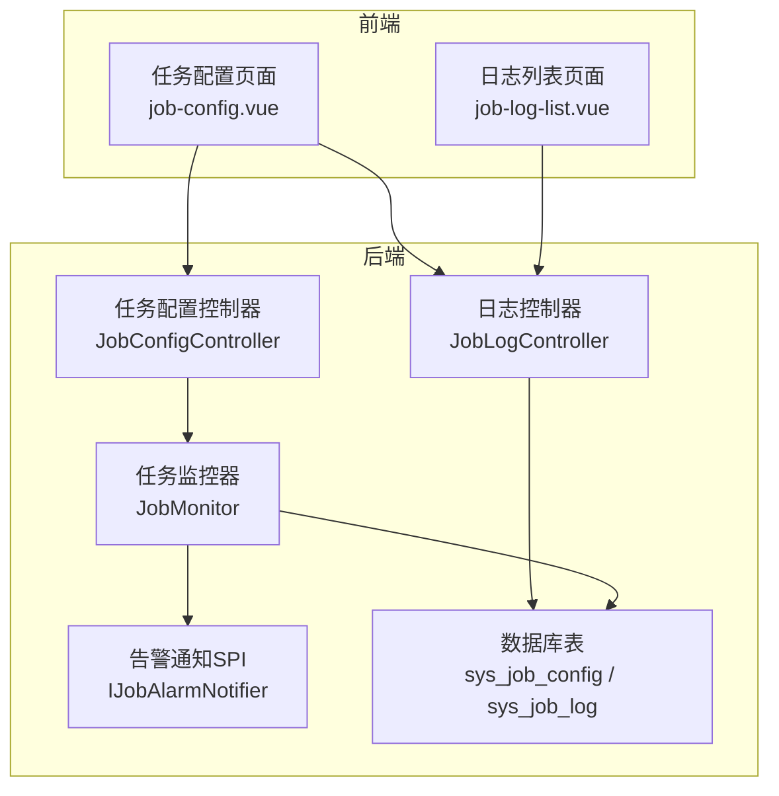
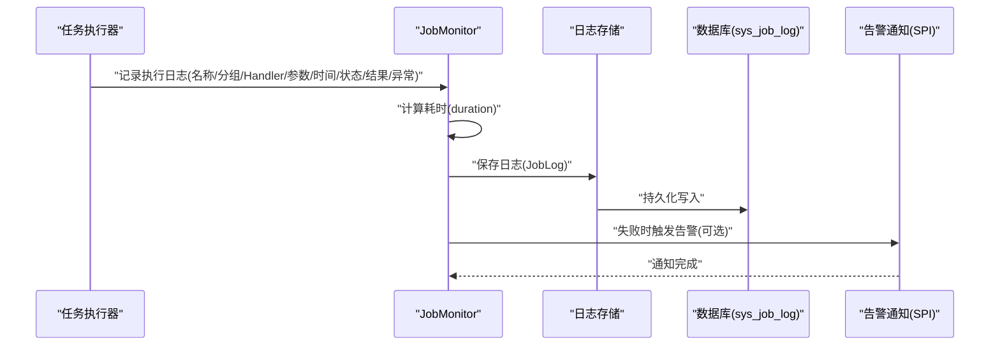
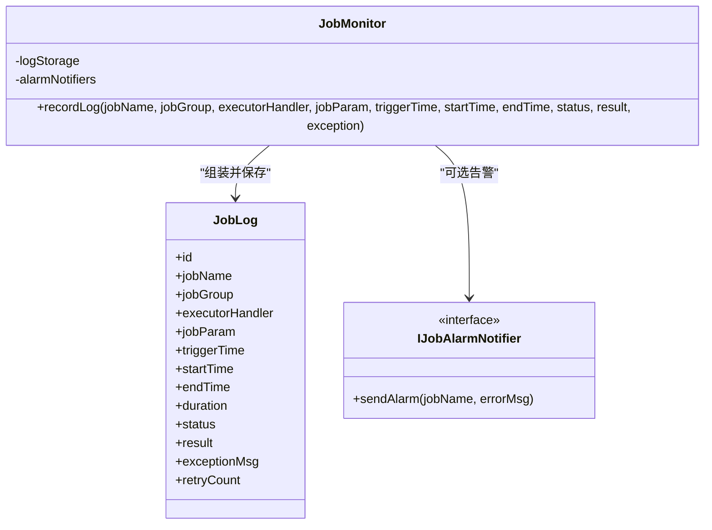
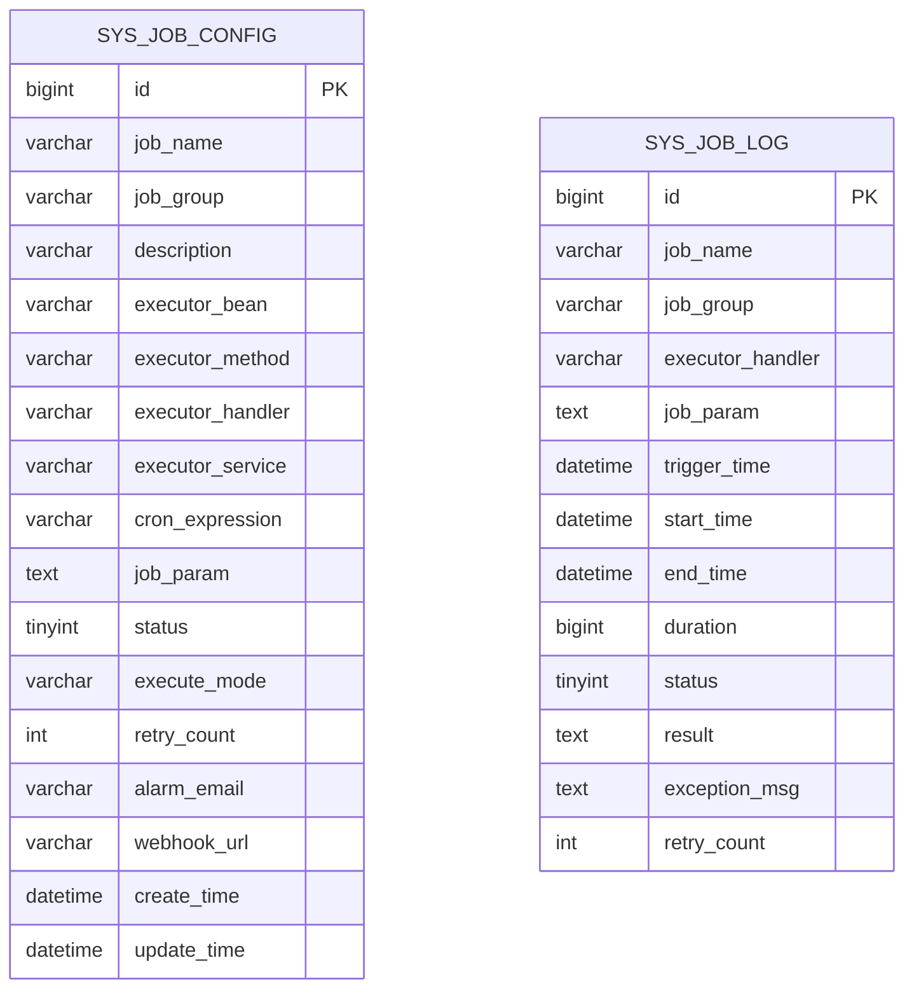
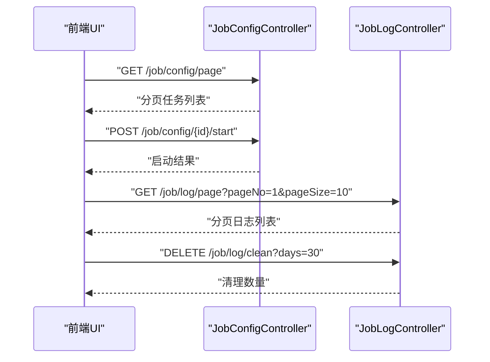
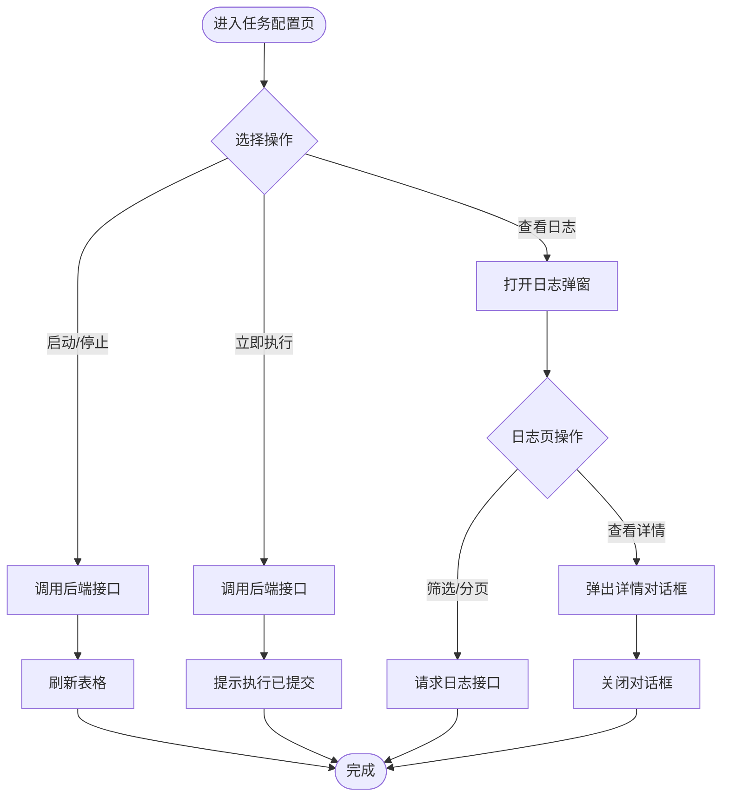
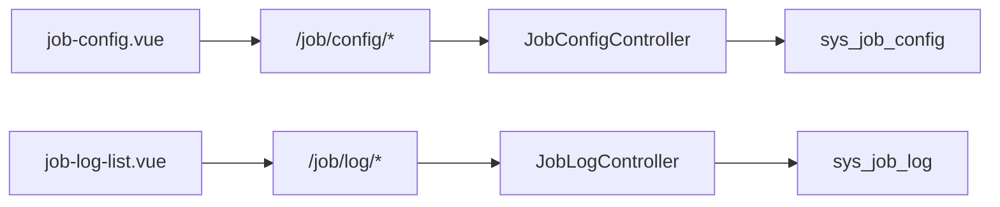

# 任务监控管理

<cite>
**本文引用的文件**   
- [JobMonitor.java](file://forge/forge-framework/forge-plugin-parent/forge-plugin-job/src/main/java/com/mdframe/forge/plugin/job/monitor/JobMonitor.java)
- [IJobAlarmNotifier.java](file://forge/forge-framework/forge-plugin-parent/forge-plugin-job/src/main/java/com/mdframe/forge/plugin/job/spi/IJobAlarmNotifier.java)
- [SysJobLog.java](file://forge/forge-framework/forge-plugin-parent/forge-plugin-job/src/main/java/com/mdframe/forge/plugin/job/entity/SysJobLog.java)
- [JobLog.java](file://forge/forge-framework/forge-plugin-parent/forge-plugin-job/src/main/java/com/mdframe/forge/plugin/job/model/JobLog.java)
- [JobLogController.java](file://forge/forge-framework/forge-plugin-parent/forge-plugin-job/src/main/java/com/mdframe/forge/plugin/job/controller/JobLogController.java)
- [JobConfigController.java](file://forge/forge-framework/forge-plugin-parent/forge-plugin-job/src/main/java/com/mdframe/forge/plugin/job/controller/JobConfigController.java)
- [job_tables.sql](file://forge/forge-framework/forge-starter-parent/forge-starter-job/sql/job_tables.sql)
- [API.md](file://forge/forge-framework/forge-starter-parent/forge-starter-job/API.md)
- [job-config.vue](file://forge-admin-ui/src/views/system/job-config.vue)
- [job-log-list.vue](file://forge-admin-ui/src/views/system/job-log-list.vue)
</cite>

## 目录
1. [简介](#简介)
2. [项目结构](#项目结构)
3. [核心组件](#核心组件)
4. [架构总览](#架构总览)
5. [详细组件分析](#详细组件分析)
6. [依赖关系分析](#依赖关系分析)
7. [性能考量](#性能考量)
8. [故障排查指南](#故障排查指南)
9. [结论](#结论)
10. [附录](#附录)

## 简介
本文件面向运维与开发人员，系统性阐述定时任务监控管理模块的设计与实现，覆盖任务执行日志的采集、存储、查询与分析；任务状态监控、执行时间统计、失败重试机制；监控面板使用、告警配置与性能指标展示；以及日志查询API、监控数据可视化与故障诊断方法。目标是帮助在生产环境中高效地监控与管理定时任务。

## 项目结构
该模块由“后端插件”和“前端UI”两部分组成：
- 后端插件负责任务配置、执行日志记录、告警通知、REST API暴露与数据库表结构定义。
- 前端UI提供任务配置与日志查询的可视化界面，并通过HTTP接口与后端交互。

图表来源
- [JobConfigController.java](file://forge/forge-framework/forge-plugin-parent/forge-plugin-job/src/main/java/com/mdframe/forge/plugin/job/controller/JobConfigController.java#L1-L110)
- [JobLogController.java](file://forge/forge-framework/forge-plugin-parent/forge-plugin-job/src/main/java/com/mdframe/forge/plugin/job/controller/JobLogController.java#L1-L56)
- [JobMonitor.java](file://forge/forge-framework/forge-plugin-parent/forge-plugin-job/src/main/java/com/mdframe/forge/plugin/job/monitor/JobMonitor.java#L1-L60)
- [IJobAlarmNotifier.java](file://forge/forge-framework/forge-plugin-parent/forge-plugin-job/src/main/java/com/mdframe/forge/plugin/job/spi/IJobAlarmNotifier.java#L1-L15)
- [job_tables.sql](file://forge/forge-framework/forge-starter-parent/forge-starter-job/sql/job_tables.sql#L1-L48)
- [job-config.vue](file://forge-admin-ui/src/views/system/job-config.vue#L1-L599)
- [job-log-list.vue](file://forge-admin-ui/src/views/system/job-log-list.vue#L1-L423)

章节来源
- [JobConfigController.java](file://forge/forge-framework/forge-plugin-parent/forge-plugin-job/src/main/java/com/mdframe/forge/plugin/job/controller/JobConfigController.java#L1-L110)
- [JobLogController.java](file://forge/forge-framework/forge-plugin-parent/forge-plugin-job/src/main/java/com/mdframe/forge/plugin/job/controller/JobLogController.java#L1-L56)
- [job_tables.sql](file://forge/forge-framework/forge-starter-parent/forge-starter-job/sql/job_tables.sql#L1-L48)
- [job-config.vue](file://forge-admin-ui/src/views/system/job-config.vue#L1-L599)
- [job-log-list.vue](file://forge-admin-ui/src/views/system/job-log-list.vue#L1-L423)

## 核心组件
- 任务监控器：负责生成日志对象、计算执行耗时、持久化日志并触发告警通知。
- 告警通知SPI：定义统一的告警发送接口，便于扩展至钉钉、企业微信、邮件或WebHook。
- 数据模型与实体：JobLog用于内存/传输层，SysJobLog映射数据库表结构。
- 控制器：对外提供任务配置与日志查询的REST API。
- 前端页面：提供任务配置CRUD、立即执行、启动/停止、日志查询与清理等操作。

章节来源
- [JobMonitor.java](file://forge/forge-framework/forge-plugin-parent/forge-plugin-job/src/main/java/com/mdframe/forge/plugin/job/monitor/JobMonitor.java#L1-L60)
- [IJobAlarmNotifier.java](file://forge/forge-framework/forge-plugin-parent/forge-plugin-job/src/main/java/com/mdframe/forge/plugin/job/spi/IJobAlarmNotifier.java#L1-L15)
- [JobLog.java](file://forge/forge-framework/forge-plugin-parent/forge-plugin-job/src/main/java/com/mdframe/forge/plugin/job/model/JobLog.java#L1-L78)
- [SysJobLog.java](file://forge/forge-framework/forge-plugin-parent/forge-plugin-job/src/main/java/com/mdframe/forge/plugin/job/entity/SysJobLog.java#L1-L79)
- [JobConfigController.java](file://forge/forge-framework/forge-plugin-parent/forge-plugin-job/src/main/java/com/mdframe/forge/plugin/job/controller/JobConfigController.java#L1-L110)
- [JobLogController.java](file://forge/forge-framework/forge-plugin-parent/forge-plugin-job/src/main/java/com/mdframe/forge/plugin/job/controller/JobLogController.java#L1-L56)

## 架构总览
下图展示了从任务执行到日志记录与告警通知的关键流程：

图表来源
- [JobMonitor.java](file://forge/forge-framework/forge-plugin-parent/forge-plugin-job/src/main/java/com/mdframe/forge/plugin/job/monitor/JobMonitor.java#L35-L60)
- [SysJobLog.java](file://forge/forge-framework/forge-plugin-parent/forge-plugin-job/src/main/java/com/mdframe/forge/plugin/job/entity/SysJobLog.java#L1-L79)

## 详细组件分析

### 任务监控器（JobMonitor）
职责与行为
- 接收任务执行上下文，组装JobLog对象，计算执行耗时。
- 将日志写入持久化存储；异常时记录异常信息并截断过长文本。
- 可选地调用告警通知SPI进行失败告警。

图表来源
- [JobMonitor.java](file://forge/forge-framework/forge-plugin-parent/forge-plugin-job/src/main/java/com/mdframe/forge/plugin/job/monitor/JobMonitor.java#L18-L60)
- [IJobAlarmNotifier.java](file://forge/forge-framework/forge-plugin-parent/forge-plugin-job/src/main/java/com/mdframe/forge/plugin/job/spi/IJobAlarmNotifier.java#L1-L15)
- [JobLog.java](file://forge/forge-framework/forge-plugin-parent/forge-plugin-job/src/main/java/com/mdframe/forge/plugin/job/model/JobLog.java#L1-L78)

章节来源
- [JobMonitor.java](file://forge/forge-framework/forge-plugin-parent/forge-plugin-job/src/main/java/com/mdframe/forge/plugin/job/monitor/JobMonitor.java#L1-L60)

### 告警通知SPI（IJobAlarmNotifier）
- 提供统一的告警发送接口，支持扩展多种通知渠道（如钉钉、企业微信、邮件、WebHook）。
- JobMonitor在检测到失败状态时，按需调用该SPI进行通知。

章节来源
- [IJobAlarmNotifier.java](file://forge/forge-framework/forge-plugin-parent/forge-plugin-job/src/main/java/com/mdframe/forge/plugin/job/spi/IJobAlarmNotifier.java#L1-L15)

### 数据模型与实体
- JobLog：用于日志记录的领域模型，包含任务元信息、执行时间、耗时、状态、结果与异常等字段。
- SysJobLog：与数据库表sys_job_log映射，用于MyBatis Plus的持久化操作。

图表来源
- [job_tables.sql](file://forge/forge-framework/forge-starter-parent/forge-starter-job/sql/job_tables.sql#L1-L48)
- [SysJobLog.java](file://forge/forge-framework/forge-plugin-parent/forge-plugin-job/src/main/java/com/mdframe/forge/plugin/job/entity/SysJobLog.java#L1-L79)

章节来源
- [JobLog.java](file://forge/forge-framework/forge-plugin-parent/forge-plugin-job/src/main/java/com/mdframe/forge/plugin/job/model/JobLog.java#L1-L78)
- [SysJobLog.java](file://forge/forge-framework/forge-plugin-parent/forge-plugin-job/src/main/java/com/mdframe/forge/plugin/job/entity/SysJobLog.java#L1-L79)
- [job_tables.sql](file://forge/forge-framework/forge-starter-parent/forge-starter-job/sql/job_tables.sql#L1-L48)

### 控制器：任务配置与日志管理
- 任务配置控制器：提供分页查询、详情、新增、修改、删除、启动、停止、立即触发、更新Cron表达式等接口。
- 日志控制器：提供分页查询、详情、清理历史日志接口。

图表来源
- [JobConfigController.java](file://forge/forge-framework/forge-plugin-parent/forge-plugin-job/src/main/java/com/mdframe/forge/plugin/job/controller/JobConfigController.java#L1-L110)
- [JobLogController.java](file://forge/forge-framework/forge-plugin-parent/forge-plugin-job/src/main/java/com/mdframe/forge/plugin/job/controller/JobLogController.java#L1-L56)
- [API.md](file://forge/forge-framework/forge-starter-parent/forge-starter-job/API.md#L91-L184)

章节来源
- [JobConfigController.java](file://forge/forge-framework/forge-plugin-parent/forge-plugin-job/src/main/java/com/mdframe/forge/plugin/job/controller/JobConfigController.java#L1-L110)
- [JobLogController.java](file://forge/forge-framework/forge-plugin-parent/forge-plugin-job/src/main/java/com/mdframe/forge/plugin/job/controller/JobLogController.java#L1-L56)
- [API.md](file://forge/forge-framework/forge-starter-parent/forge-starter-job/API.md#L91-L184)

### 前端监控面板与可视化
- 任务配置页面：支持任务增删改查、启动/停止、立即执行、查看日志、清理日志等操作；内置常用Cron表达式选择器。
- 日志列表页面：支持按状态、时间范围筛选，分页展示日志，点击“详情”查看执行结果与异常信息。

图表来源
- [job-config.vue](file://forge-admin-ui/src/views/system/job-config.vue#L1-L599)
- [job-log-list.vue](file://forge-admin-ui/src/views/system/job-log-list.vue#L1-L423)

章节来源
- [job-config.vue](file://forge-admin-ui/src/views/system/job-config.vue#L1-L599)
- [job-log-list.vue](file://forge-admin-ui/src/views/system/job-log-list.vue#L1-L423)

## 依赖关系分析
- 组件内聚与耦合
  - JobMonitor对日志存储与告警通知采用依赖注入，保持良好内聚与低耦合。
  - 控制器仅负责参数接收与响应封装，业务逻辑委托给服务层（未在本节展开），符合分层设计。
- 外部依赖
  - 数据库：sys_job_config、sys_job_log两张表，分别承载任务配置与执行日志。
  - 前端：通过HTTP接口与后端交互，使用分页与筛选参数完成日志查询。

图表来源
- [job-config.vue](file://forge-admin-ui/src/views/system/job-config.vue#L1-L599)
- [job-log-list.vue](file://forge-admin-ui/src/views/system/job-log-list.vue#L1-L423)
- [JobConfigController.java](file://forge/forge-framework/forge-plugin-parent/forge-plugin-job/src/main/java/com/mdframe/forge/plugin/job/controller/JobConfigController.java#L1-L110)
- [JobLogController.java](file://forge/forge-framework/forge-plugin-parent/forge-plugin-job/src/main/java/com/mdframe/forge/plugin/job/controller/JobLogController.java#L1-L56)
- [job_tables.sql](file://forge/forge-framework/forge-starter-parent/forge-starter-job/sql/job_tables.sql#L1-L48)

章节来源
- [job-config.vue](file://forge-admin-ui/src/views/system/job-config.vue#L1-L599)
- [job-log-list.vue](file://forge-admin-ui/src/views/system/job-log-list.vue#L1-L423)
- [job_tables.sql](file://forge/forge-framework/forge-starter-parent/forge-starter-job/sql/job_tables.sql#L1-L48)

## 性能考量
- 日志写入
  - JobMonitor在保存日志时捕获异常并记录错误日志，避免影响任务执行主流程。
- 字段截断
  - 对结果与异常信息进行长度截断，防止超长文本导致存储与传输开销过大。
- 查询优化
  - 日志表建立索引（任务名、触发时间、状态），建议在高并发场景下结合分页与条件筛选使用。
- 告警频率
  - 建议通过任务级重试与告警策略配合，避免频繁告警造成噪音。

章节来源
- [JobMonitor.java](file://forge/forge-framework/forge-plugin-parent/forge-plugin-job/src/main/java/com/mdframe/forge/plugin/job/monitor/JobMonitor.java#L55-L60)
- [job_tables.sql](file://forge/forge-framework/forge-starter-parent/forge-starter-job/sql/job_tables.sql#L40-L43)

## 故障排查指南
- 常见问题定位
  - 日志未入库：检查JobMonitor保存日志是否抛出异常；确认数据库连接与表结构是否存在。
  - 告警未触发：确认任务配置中是否填写了告警邮箱或WebHook地址；检查IJobAlarmNotifier实现是否可用。
  - 查询无结果：确认筛选条件（任务名、分组、状态、时间范围）是否正确；检查分页参数。
- 诊断步骤
  - 在任务配置页执行“立即执行一次”，观察日志弹窗是否出现新记录。
  - 使用日志列表页的时间范围与状态筛选，缩小问题区间。
  - 通过“清理日志”功能清理历史数据，验证接口可用性与数据库写入能力。
- 建议
  - 对高频失败任务开启重试与告警联动；对长时间任务关注执行耗时与异常堆栈。

章节来源
- [job-config.vue](file://forge-admin-ui/src/views/system/job-config.vue#L470-L517)
- [job-log-list.vue](file://forge-admin-ui/src/views/system/job-log-list.vue#L219-L253)
- [API.md](file://forge/forge-framework/forge-starter-parent/forge-starter-job/API.md#L111-L184)

## 结论
本模块以JobMonitor为核心，结合清晰的数据模型、完善的REST API与直观的前端界面，实现了定时任务的全生命周期监控与管理。通过日志记录、状态统计、失败重试与告警通知，能够有效支撑生产环境的稳定运行与快速排障。

## 附录

### 日志查询API清单
- 分页查询日志
  - 方法与路径：GET /job/log/page
  - 查询参数：pageNo、pageSize、jobName（模糊）、jobGroup、status
  - 返回：分页数据（records、total、current、size）
- 查询日志详情
  - 方法与路径：GET /job/log/{id}
- 清理日志
  - 方法与路径：DELETE /job/log/clean?days=N
  - 参数：days（默认30）

章节来源
- [API.md](file://forge/forge-framework/forge-starter-parent/forge-starter-job/API.md#L111-L184)

### 监控面板操作指引
- 任务配置页
  - 新增/编辑：填写任务名称、分组、执行模式、Cron表达式、参数、重试次数与告警配置。
  - 启动/停止/立即执行：对应接口调用后刷新表格状态。
  - 查看日志：打开日志弹窗，支持按任务名过滤与分页查看。
  - 清理日志：支持清理N天前或清空所有日志。
- 日志列表页
  - 筛选：按状态与时间范围筛选；分页切换与页大小调整。
  - 详情：查看执行结果与异常信息，便于快速定位问题。

章节来源
- [job-config.vue](file://forge-admin-ui/src/views/system/job-config.vue#L1-L599)
- [job-log-list.vue](file://forge-admin-ui/src/views/system/job-log-list.vue#L1-L423)