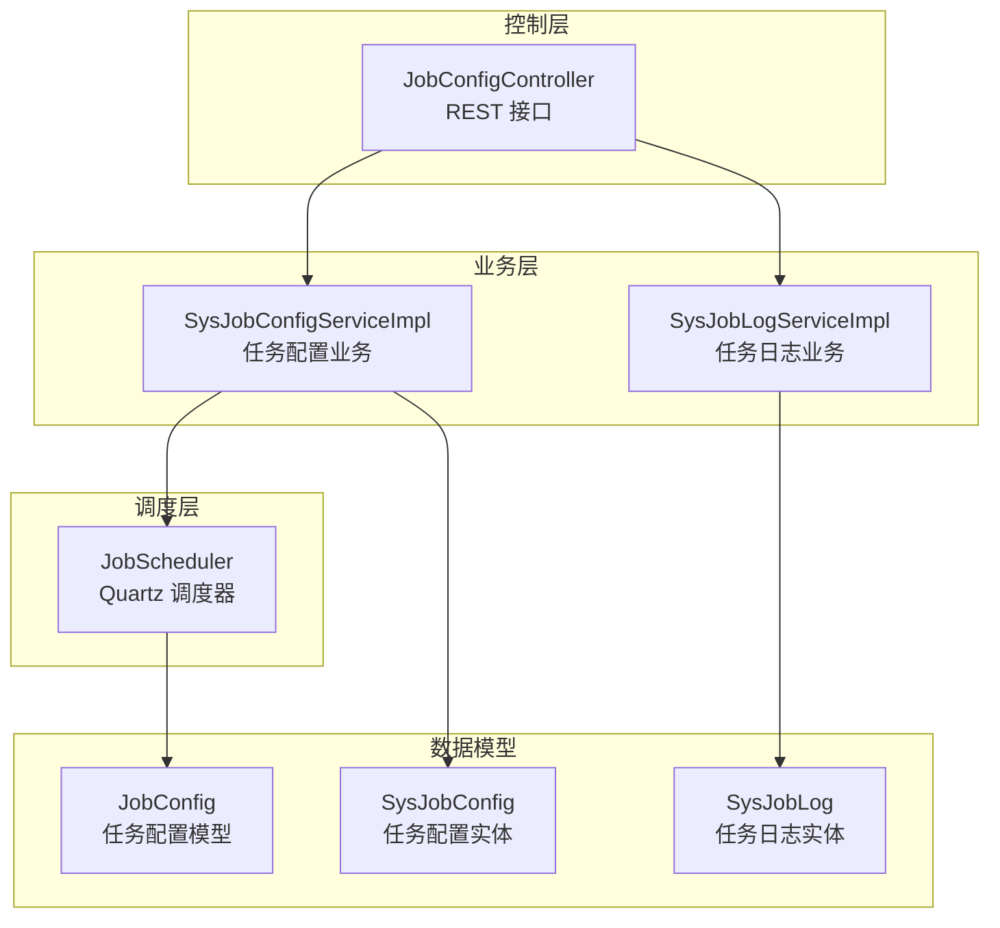
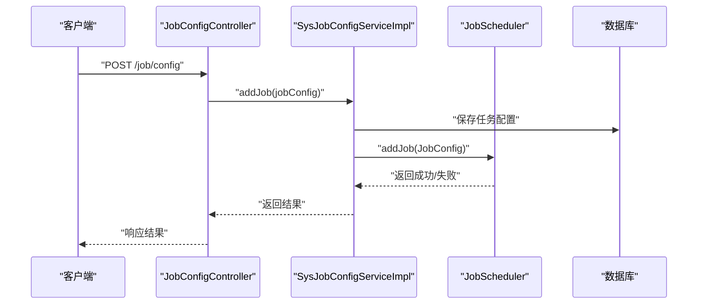
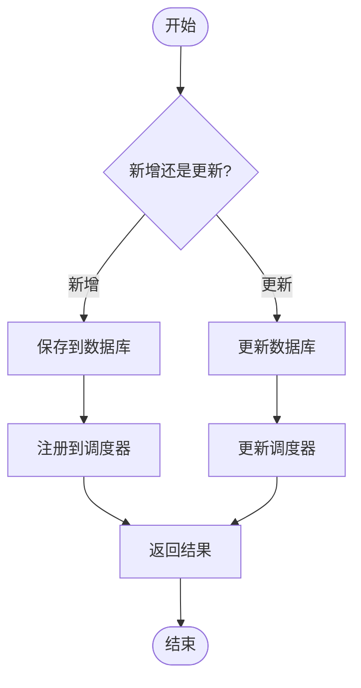
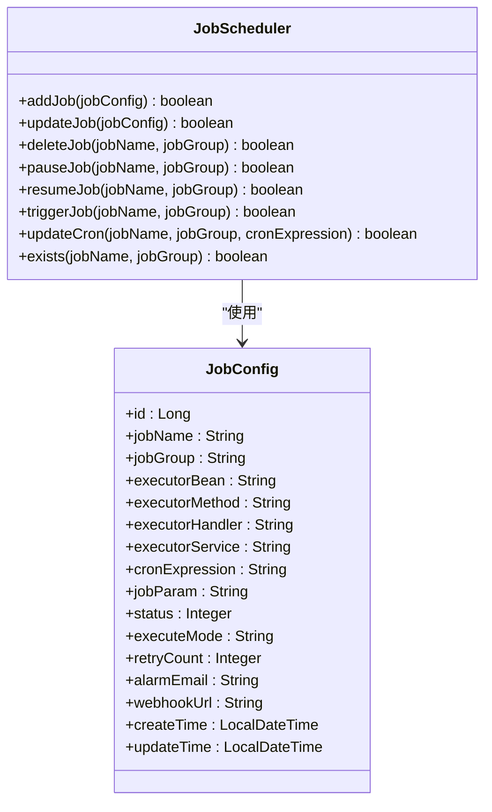
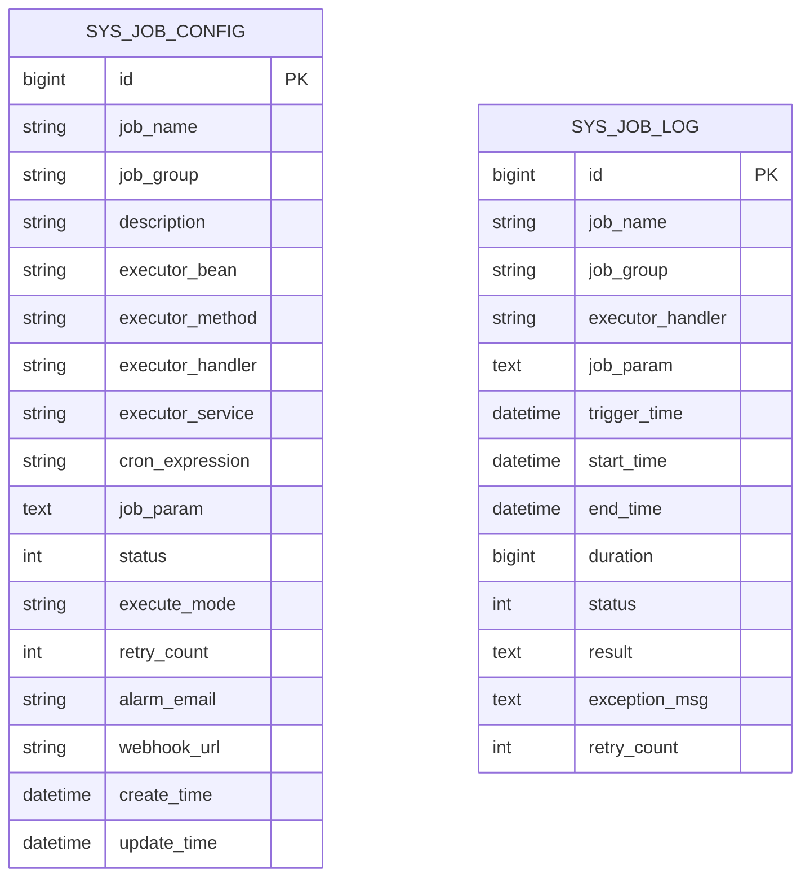
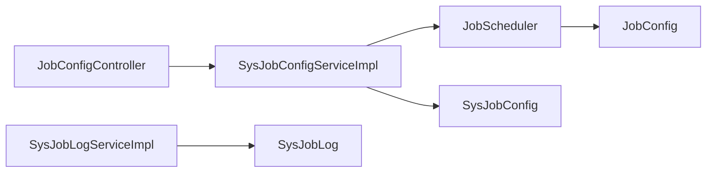

# 任务配置管理

<cite>
**本文引用的文件**
- [JobConfigController.java](file://forge/forge-framework/forge-plugin-parent/forge-plugin-job/src/main/java/com/mdframe/forge/plugin/job/controller/JobConfigController.java)
- [SysJobConfigServiceImpl.java](file://forge/forge-framework/forge-plugin-parent/forge-plugin-job/src/main/java/com/mdframe/forge/plugin/job/service/impl/SysJobConfigServiceImpl.java)
- [SysJobLogServiceImpl.java](file://forge/forge-framework/forge-plugin-parent/forge-plugin-job/src/main/java/com/mdframe/forge/plugin/job/service/impl/SysJobLogServiceImpl.java)
- [JobScheduler.java](file://forge/forge-framework/forge-plugin-parent/forge-plugin-job/src/main/java/com/mdframe/forge/plugin/job/scheduler/JobScheduler.java)
- [JobConfig.java](file://forge/forge-framework/forge-plugin-parent/forge-plugin-job/src/main/java/com/mdframe/forge/plugin/job/model/JobConfig.java)
- [SysJobConfig.java](file://forge/forge-framework/forge-plugin-parent/forge-plugin-job/src/main/java/com/mdframe/forge/plugin/job/entity/SysJobConfig.java)
- [SysJobLog.java](file://forge/forge-framework/forge-plugin-parent/forge-plugin-job/src/main/java/com/mdframe/forge/plugin/job/entity/SysJobLog.java)
- [API.md](file://forge/forge-framework/forge-starter-parent/forge-starter-job/API.md)
</cite>

## 目录
1. [简介](#简介)
2. [项目结构](#项目结构)
3. [核心组件](#核心组件)
4. [架构总览](#架构总览)
5. [详细组件分析](#详细组件分析)
6. [依赖关系分析](#依赖关系分析)
7. [性能考虑](#性能考虑)
8. [故障排查指南](#故障排查指南)
9. [结论](#结论)
10. [附录](#附录)

## 简介
本技术文档面向定时任务配置管理模块，系统性阐述任务配置的创建、编辑、删除等 CRUD 操作，Cron 表达式的语法与使用方法，任务参数配置与执行策略设置，任务状态管理、配置验证机制以及批量操作能力。文档同时提供完整的 API 接口定义、配置示例与最佳实践，帮助开发者正确配置与管理各类定时任务。

## 项目结构
定时任务配置管理模块位于 forge-plugin-job 插件中，采用典型的分层架构：
- 控制层：提供 REST API，负责请求接收与响应封装
- 业务层：实现任务配置与日志的增删改查、状态变更与 Cron 更新
- 调度层：基于 Quartz 的任务调度器，负责任务注册、暂停、恢复、立即触发与 Cron 热更新
- 数据模型：任务配置与日志实体，映射数据库表结构

图表来源
- [JobConfigController.java](file://forge/forge-framework/forge-plugin-parent/forge-plugin-job/src/main/java/com/mdframe/forge/plugin/job/controller/JobConfigController.java#L1-L110)
- [SysJobConfigServiceImpl.java](file://forge/forge-framework/forge-plugin-parent/forge-plugin-job/src/main/java/com/mdframe/forge/plugin/job/service/impl/SysJobConfigServiceImpl.java#L1-L155)
- [SysJobLogServiceImpl.java](file://forge/forge-framework/forge-plugin-parent/forge-plugin-job/src/main/java/com/mdframe/forge/plugin/job/service/impl/SysJobLogServiceImpl.java#L1-L42)
- [JobScheduler.java](file://forge/forge-framework/forge-plugin-parent/forge-plugin-job/src/main/java/com/mdframe/forge/plugin/job/scheduler/JobScheduler.java#L1-L220)
- [JobConfig.java](file://forge/forge-framework/forge-plugin-parent/forge-plugin-job/src/main/java/com/mdframe/forge/plugin/job/model/JobConfig.java#L1-L98)
- [SysJobConfig.java](file://forge/forge-framework/forge-plugin-parent/forge-plugin-job/src/main/java/com/mdframe/forge/plugin/job/entity/SysJobConfig.java#L1-L97)
- [SysJobLog.java](file://forge/forge-framework/forge-plugin-parent/forge-plugin-job/src/main/java/com/mdframe/forge/plugin/job/entity/SysJobLog.java#L1-L80)

章节来源
- [JobConfigController.java](file://forge/forge-framework/forge-plugin-parent/forge-plugin-job/src/main/java/com/mdframe/forge/plugin/job/controller/JobConfigController.java#L1-L110)
- [SysJobConfigServiceImpl.java](file://forge/forge-framework/forge-plugin-parent/forge-plugin-job/src/main/java/com/mdframe/forge/plugin/job/service/impl/SysJobConfigServiceImpl.java#L1-L155)
- [SysJobLogServiceImpl.java](file://forge/forge-framework/forge-plugin-parent/forge-plugin-job/src/main/java/com/mdframe/forge/plugin/job/service/impl/SysJobLogServiceImpl.java#L1-L42)
- [JobScheduler.java](file://forge/forge-framework/forge-plugin-parent/forge-plugin-job/src/main/java/com/mdframe/forge/plugin/job/scheduler/JobScheduler.java#L1-L220)
- [JobConfig.java](file://forge/forge-framework/forge-plugin-parent/forge-plugin-job/src/main/java/com/mdframe/forge/plugin/job/model/JobConfig.java#L1-L98)
- [SysJobConfig.java](file://forge/forge-framework/forge-plugin-parent/forge-plugin-job/src/main/java/com/mdframe/forge/plugin/job/entity/SysJobConfig.java#L1-L97)
- [SysJobLog.java](file://forge/forge-framework/forge-plugin-parent/forge-plugin-job/src/main/java/com/mdframe/forge/plugin/job/entity/SysJobLog.java#L1-L80)

## 核心组件
- 控制器：提供任务配置与日志的分页查询、详情、新增、修改、删除、启动、停止、立即触发、Cron 更新等接口
- 任务配置业务：封装数据库与调度器的协调，保证一致性与事务性
- 任务日志业务：提供日志分页查询与按时间清理能力
- 调度器：基于 Quartz 的任务生命周期管理与 Cron 热更新
- 数据模型：任务配置与日志的数据结构定义

章节来源
- [JobConfigController.java](file://forge/forge-framework/forge-plugin-parent/forge-plugin-job/src/main/java/com/mdframe/forge/plugin/job/controller/JobConfigController.java#L1-L110)
- [SysJobConfigServiceImpl.java](file://forge/forge-framework/forge-plugin-parent/forge-plugin-job/src/main/java/com/mdframe/forge/plugin/job/service/impl/SysJobConfigServiceImpl.java#L1-L155)
- [SysJobLogServiceImpl.java](file://forge/forge-framework/forge-plugin-parent/forge-plugin-job/src/main/java/com/mdframe/forge/plugin/job/service/impl/SysJobLogServiceImpl.java#L1-L42)
- [JobScheduler.java](file://forge/forge-framework/forge-plugin-parent/forge-plugin-job/src/main/java/com/mdframe/forge/plugin/job/scheduler/JobScheduler.java#L1-L220)
- [JobConfig.java](file://forge/forge-framework/forge-plugin-parent/forge-plugin-job/src/main/java/com/mdframe/forge/plugin/job/model/JobConfig.java#L1-L98)
- [SysJobConfig.java](file://forge/forge-framework/forge-plugin-parent/forge-plugin-job/src/main/java/com/mdframe/forge/plugin/job/entity/SysJobConfig.java#L1-L97)
- [SysJobLog.java](file://forge/forge-framework/forge-plugin-parent/forge-plugin-job/src/main/java/com/mdframe/forge/plugin/job/entity/SysJobLog.java#L1-L80)

## 架构总览
系统通过控制器接收请求，调用业务层完成数据库与调度器的协同操作；调度器基于 Quartz 进行任务的注册、暂停、恢复、立即触发与 Cron 热更新；日志模块记录每次任务执行的详细信息，支持按时间清理。

图表来源
- [JobConfigController.java](file://forge/forge-framework/forge-plugin-parent/forge-plugin-job/src/main/java/com/mdframe/forge/plugin/job/controller/JobConfigController.java#L47-L54)
- [SysJobConfigServiceImpl.java](file://forge/forge-framework/forge-plugin-parent/forge-plugin-job/src/main/java/com/mdframe/forge/plugin/job/service/impl/SysJobConfigServiceImpl.java#L39-L51)
- [JobScheduler.java](file://forge/forge-framework/forge-plugin-parent/forge-plugin-job/src/main/java/com/mdframe/forge/plugin/job/scheduler/JobScheduler.java#L23-L65)

## 详细组件分析

### 控制器层：JobConfigController
职责与功能
- 提供任务配置的分页查询、详情查询、新增、修改、删除
- 提供任务状态控制：启动、停止、立即触发
- 提供 Cron 表达式热更新接口
- 统一封装响应格式

关键接口
- GET /job/config/page：分页查询任务列表（支持按任务名、分组、执行模式、状态过滤）
- GET /job/config/{id}：查询任务详情
- POST /job/config：新增任务
- PUT /job/config：更新任务
- DELETE /job/config/{id}：删除任务
- POST /job/config/{id}/start：启动任务
- POST /job/config/{id}/stop：停止任务
- POST /job/config/{id}/trigger：立即触发一次
- POST /job/config/{id}/cron：更新 Cron 表达式

章节来源
- [JobConfigController.java](file://forge/forge-framework/forge-plugin-parent/forge-plugin-job/src/main/java/com/mdframe/forge/plugin/job/controller/JobConfigController.java#L1-L110)
- [API.md](file://forge/forge-framework/forge-starter-parent/forge-starter-job/API.md#L1-L184)

### 业务层：SysJobConfigServiceImpl
职责与功能
- 任务配置的分页查询、新增、更新、删除、启动、停止、立即触发、Cron 更新
- 与调度器协作，确保数据库与调度器状态一致
- 使用事务保障一致性

关键流程
- 新增任务：先持久化，再注册到调度器
- 更新任务：先更新数据库，再更新调度器
- 删除任务：先从调度器移除，再删除数据库记录
- 启动/停止：更新调度器状态并回写数据库
- 立即触发：直接触发一次
- Cron 更新：热更新调度器中的触发器

图表来源
- [SysJobConfigServiceImpl.java](file://forge/forge-framework/forge-plugin-parent/forge-plugin-job/src/main/java/com/mdframe/forge/plugin/job/service/impl/SysJobConfigServiceImpl.java#L39-L65)

章节来源
- [SysJobConfigServiceImpl.java](file://forge/forge-framework/forge-plugin-parent/forge-plugin-job/src/main/java/com/mdframe/forge/plugin/job/service/impl/SysJobConfigServiceImpl.java#L1-L155)

### 调度层：JobScheduler
职责与功能
- 基于 Quartz 的任务生命周期管理
- 支持任务新增、更新、删除、暂停、恢复、立即触发
- 支持 Cron 表达式的热更新

关键实现要点
- 使用 JobDetail 存储执行器信息（Bean 名称、方法名、Handler、服务名、任务参数、执行模式）
- 使用 CronTrigger 配置触发策略
- Misfire 策略设置为“不做任何处理”，避免错过触发
- 提供 exists 检查任务是否存在

图表来源
- [JobScheduler.java](file://forge/forge-framework/forge-plugin-parent/forge-plugin-job/src/main/java/com/mdframe/forge/plugin/job/scheduler/JobScheduler.java#L1-L220)
- [JobConfig.java](file://forge/forge-framework/forge-plugin-parent/forge-plugin-job/src/main/java/com/mdframe/forge/plugin/job/model/JobConfig.java#L1-L98)

章节来源
- [JobScheduler.java](file://forge/forge-framework/forge-plugin-parent/forge-plugin-job/src/main/java/com/mdframe/forge/plugin/job/scheduler/JobScheduler.java#L1-L220)
- [JobConfig.java](file://forge/forge-framework/forge-plugin-parent/forge-plugin-job/src/main/java/com/mdframe/forge/plugin/job/model/JobConfig.java#L1-L98)

### 数据模型：SysJobConfig 与 SysJobLog
- SysJobConfig：任务配置实体，包含任务标识、描述、执行器信息、Cron 表达式、参数、状态、执行模式、重试次数、告警与 WebHook 等字段
- SysJobLog：任务执行日志实体，包含任务名、分组、执行器 Handler、任务参数、触发/开始/结束时间、耗时、状态、结果、异常信息与重试次数

图表来源
- [SysJobConfig.java](file://forge/forge-framework/forge-plugin-parent/forge-plugin-job/src/main/java/com/mdframe/forge/plugin/job/entity/SysJobConfig.java#L1-L97)
- [SysJobLog.java](file://forge/forge-framework/forge-plugin-parent/forge-plugin-job/src/main/java/com/mdframe/forge/plugin/job/entity/SysJobLog.java#L1-L80)

章节来源
- [SysJobConfig.java](file://forge/forge-framework/forge-plugin-parent/forge-plugin-job/src/main/java/com/mdframe/forge/plugin/job/entity/SysJobConfig.java#L1-L97)
- [SysJobLog.java](file://forge/forge-framework/forge-plugin-parent/forge-plugin-job/src/main/java/com/mdframe/forge/plugin/job/entity/SysJobLog.java#L1-L80)

### Cron 表达式语法与使用
- 语法结构：通常由 6 或 7 个字段组成（秒、分、时、日、月、周、年），支持通配符、范围、步长、问号与字母缩写
- 常用示例：
  - 每5秒执行一次
  - 每分钟执行一次
  - 每5分钟执行一次
  - 每小时执行一次
  - 每天凌晨2点执行
  - 每周一凌晨2点执行
  - 每月1号凌晨2点执行
- 使用建议：
  - 明确业务需求后再设定触发频率，避免过于频繁导致资源压力
  - 对跨时区场景，统一使用 UTC 并在表达式中考虑夏令时影响
  - 使用“Misfire 不做任何处理”策略，确保任务不会因积压而连续触发

章节来源
- [API.md](file://forge/forge-framework/forge-starter-parent/forge-starter-job/API.md#L174-L184)

### 任务参数配置与执行策略
- 任务参数：以字符串形式传递，建议使用 JSON 格式，便于序列化与反序列化
- 执行策略：
  - 执行模式：支持 BEAN 与 HANDLER 两种模式，分别对应不同执行器类型
  - 失败重试：可配置重试次数，结合日志与告警机制进行监控
  - 告警与通知：支持邮箱与 WebHook，用于异常或执行结果通知

章节来源
- [JobConfig.java](file://forge/forge-framework/forge-plugin-parent/forge-plugin-job/src/main/java/com/mdframe/forge/plugin/job/model/JobConfig.java#L1-L98)
- [SysJobConfig.java](file://forge/forge-framework/forge-plugin-parent/forge-plugin-job/src/main/java/com/mdframe/forge/plugin/job/entity/SysJobConfig.java#L1-L97)

### 任务状态管理与配置验证
- 状态管理：0 表示停止，1 表示运行；启动/停止会同步更新调度器与数据库
- 配置验证：
  - 新增/更新时，调度器会检查任务是否存在并抛出异常
  - Cron 更新前会比较新旧表达式，避免无效更新
  - 控制器层对请求参数进行基本校验，业务层对任务存在性进行二次校验

章节来源
- [SysJobConfigServiceImpl.java](file://forge/forge-framework/forge-plugin-parent/forge-plugin-job/src/main/java/com/mdframe/forge/plugin/job/service/impl/SysJobConfigServiceImpl.java#L128-L144)
- [JobScheduler.java](file://forge/forge-framework/forge-plugin-parent/forge-plugin-job/src/main/java/com/mdframe/forge/plugin/job/scheduler/JobScheduler.java#L177-L206)

### 批量操作与日志管理
- 批量操作：当前控制器未提供批量删除/启停接口，可通过前端循环调用单个接口实现
- 日志管理：
  - 分页查询：支持按任务名、分组、状态过滤
  - 清理策略：按触发时间清理历史日志，支持保留最近 N 天

章节来源
- [SysJobLogServiceImpl.java](file://forge/forge-framework/forge-plugin-parent/forge-plugin-job/src/main/java/com/mdframe/forge/plugin/job/service/impl/SysJobLogServiceImpl.java#L24-L40)
- [API.md](file://forge/forge-framework/forge-starter-parent/forge-starter-job/API.md#L111-L172)

## 依赖关系分析
- 控制器依赖业务接口，业务实现依赖调度器与实体映射
- 调度器依赖 Quartz Scheduler 与 JobConfig 模型
- 实体与模型之间通过属性拷贝进行转换

图表来源
- [JobConfigController.java](file://forge/forge-framework/forge-plugin-parent/forge-plugin-job/src/main/java/com/mdframe/forge/plugin/job/controller/JobConfigController.java#L1-L110)
- [SysJobConfigServiceImpl.java](file://forge/forge-framework/forge-plugin-parent/forge-plugin-job/src/main/java/com/mdframe/forge/plugin/job/service/impl/SysJobConfigServiceImpl.java#L1-L155)
- [JobScheduler.java](file://forge/forge-framework/forge-plugin-parent/forge-plugin-job/src/main/java/com/mdframe/forge/plugin/job/scheduler/JobScheduler.java#L1-L220)
- [JobConfig.java](file://forge/forge-framework/forge-plugin-parent/forge-plugin-job/src/main/java/com/mdframe/forge/plugin/job/model/JobConfig.java#L1-L98)
- [SysJobConfig.java](file://forge/forge-framework/forge-plugin-parent/forge-plugin-job/src/main/java/com/mdframe/forge/plugin/job/entity/SysJobConfig.java#L1-L97)
- [SysJobLogServiceImpl.java](file://forge/forge-framework/forge-plugin-parent/forge-plugin-job/src/main/java/com/mdframe/forge/plugin/job/service/impl/SysJobLogServiceImpl.java#L1-L42)
- [SysJobLog.java](file://forge/forge-framework/forge-plugin-parent/forge-plugin-job/src/main/java/com/mdframe/forge/plugin/job/entity/SysJobLog.java#L1-L80)

## 性能考虑
- Cron 表达式复杂度：尽量使用简单且明确的表达式，避免过多组合导致调度器计算开销增大
- 任务粒度：合理拆分任务，避免单任务执行时间过长
- 日志清理：定期清理历史日志，避免日志表膨胀影响查询性能
- Misfire 策略：选择合适的 Misfire 处理策略，平衡“及时性”与“稳定性”

## 故障排查指南
常见问题与处理
- 任务无法启动/停止：检查任务是否存在、状态是否正确，确认调度器与数据库状态一致
- Cron 更新失败：确认表达式格式正确，避免与现有表达式相同导致跳过更新
- 立即触发无响应：确认任务已注册到调度器，且未被暂停
- 日志查询为空：确认过滤条件与时间范围，检查日志清理策略

章节来源
- [SysJobConfigServiceImpl.java](file://forge/forge-framework/forge-plugin-parent/forge-plugin-job/src/main/java/com/mdframe/forge/plugin/job/service/impl/SysJobConfigServiceImpl.java#L82-L126)
- [JobScheduler.java](file://forge/forge-framework/forge-plugin-parent/forge-plugin-job/src/main/java/com/mdframe/forge/plugin/job/scheduler/JobScheduler.java#L133-L173)
- [SysJobLogServiceImpl.java](file://forge/forge-framework/forge-plugin-parent/forge-plugin-job/src/main/java/com/mdframe/forge/plugin/job/service/impl/SysJobLogServiceImpl.java#L24-L40)

## 结论
该定时任务配置管理模块通过清晰的分层设计与 Quartz 集成，提供了完善的任务生命周期管理能力。配合 REST API、日志与清理策略，能够满足大多数定时任务场景的需求。建议在生产环境中结合监控与告警体系，持续优化 Cron 表达式与任务粒度，确保系统的稳定与高效。

## 附录
- API 接口文档：见 [API.md](file://forge/forge-framework/forge-starter-parent/forge-starter-job/API.md#L1-L184)
- Cron 示例：见 [API.md](file://forge/forge-framework/forge-starter-parent/forge-starter-job/API.md#L174-L184)