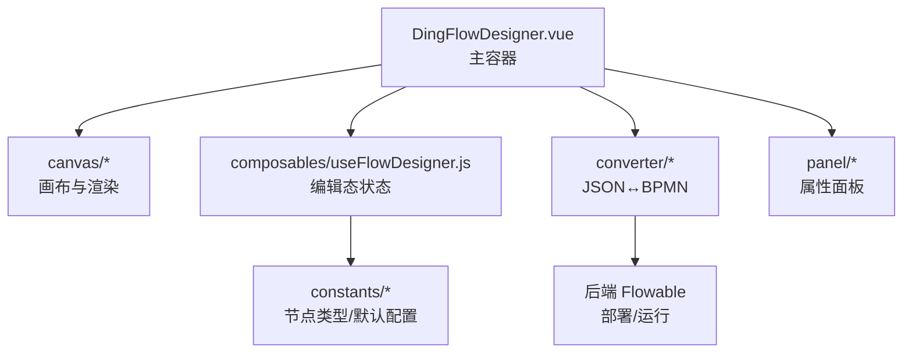
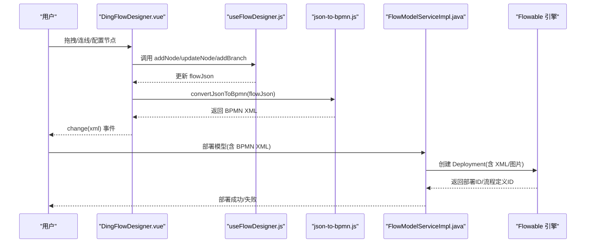
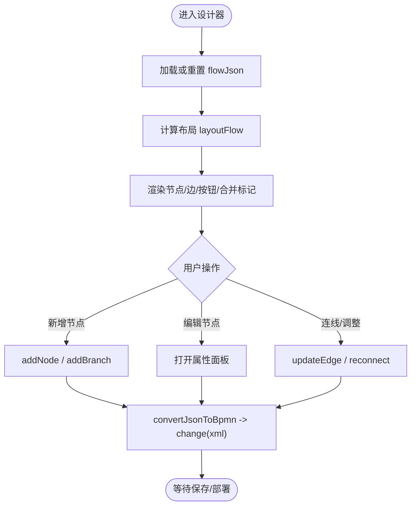
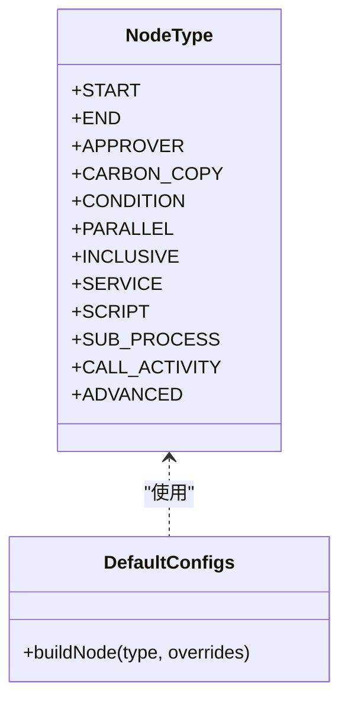
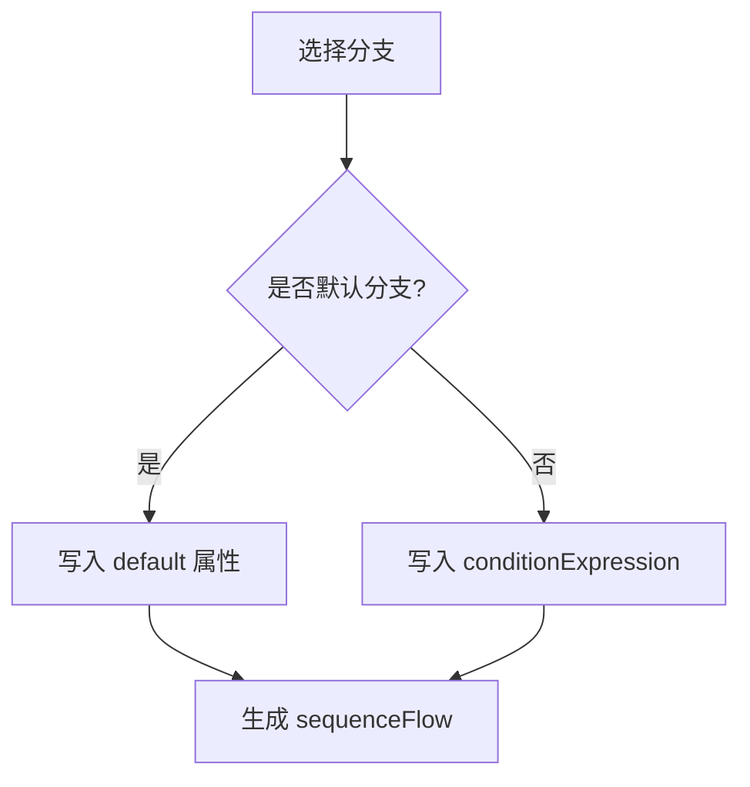
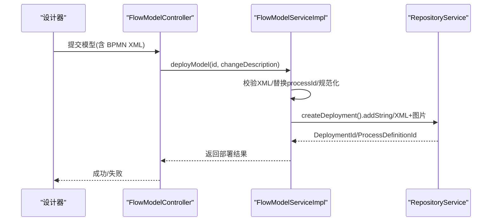
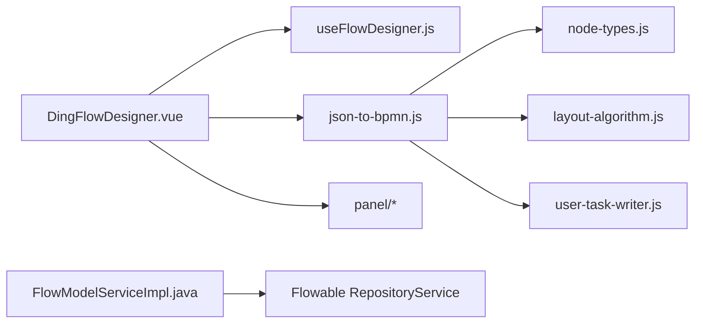

# BPMN流程设计器

<cite>
**本文引用的文件**
- [DingFlowDesigner.vue](file://forge-admin-ui/src/components/flow-designer/DingFlowDesigner.vue)
- [json-to-bpmn.js](file://forge-admin-ui/src/components/flow-designer/converter/json-to-bpmn.js)
- [node-types.js](file://forge-admin-ui/src/components/flow-designer/constants/node-types.js)
- [default-configs.js](file://forge-admin-ui/src/components/flow-designer/constants/default-configs.js)
- [useFlowDesigner.js](file://forge-admin-ui/src/components/flow-designer/composables/useFlowDesigner.js)
- [config-renderer-map.js](file://forge-admin-ui/src/components/flow-designer/panel/config-renderer-map.js)
- [ConditionConfig.vue](file://forge-admin-ui/src/components/flow-designer/panel/ConditionConfig.vue)
- [FlowModelServiceImpl.java](file://forge-server/forge-framework/forge-plugin-parent/forge-plugin-flow/src/main/java/com/mdframe/forge/starter/flow/service/impl/FlowModelServiceImpl.java)
- [FlowTaskServiceImpl.java](file://forge-server/forge-framework/forge-plugin-parent/forge-plugin-flow/src/main/java/com/mdframe/forge/starter/flow/service/impl/FlowTaskServiceImpl.java)
- [V1.0.95__fix_procurement_warehouse_runtime_closure.sql](file://forge-server/db/backup/V1.0.95__fix_procurement_warehouse_runtime_closure.sql)
- [tech-flow-version-db-design.md](file://code-copilot/knowledge/tech-flow-version-db-design.md)
</cite>

## 目录
1. [简介](#简介)
2. [项目结构](#项目结构)
3. [核心组件](#核心组件)
4. [架构总览](#架构总览)
5. [详细组件分析](#详细组件分析)
6. [依赖关系分析](#依赖关系分析)
7. [性能考虑](#性能考虑)
8. [故障排查指南](#故障排查指南)
9. [结论](#结论)
10. [附录](#附录)

## 简介
本文件为 Forge Admin 的 BPMN 流程设计器提供系统化、可操作的文档。内容覆盖可视化流程设计界面、节点类型（开始/结束/用户任务/服务任务/网关等）、连线与条件表达式配置、BPMN 2.0 标准支持、流程图绘制工具、属性面板配置、版本管理与发布、复杂流程编排模式、自定义节点开发指南、性能优化与故障排查，并提供完整示例与常见问题解决方案。

## 项目结构
前端设计器位于 forge-admin-ui 的 flow-designer 模块，采用“画布 + 节点渲染 + 边层 + 属性面板 + 转换器”的分层组织：
- 画布与交互：FlowCanvas、NodeRenderer、EdgeLayer、AddNodeButton、BranchHeader 等
- 编辑态状态管理：useFlowDesigner 提供节点/边的增删改查、分支添加、默认分支归一化等
- 转换器：bpmn-to-json 与 json-to-bpmn 负责 JSON 与 BPMN XML 的双向转换
- 常量与默认配置：node-types、default-configs 定义节点类型映射与默认字段
- 属性面板：按 nodeType 路由到具体配置组件（Start/End/Approver/Service/Script/Gateway/SubProcess/CallActivity/Advanced）
- 后端部署与运行：Flowable 引擎集成，模型部署、流程图生成、任务审批执行

**图表来源**
- [DingFlowDesigner.vue:1-120](file://forge-admin-ui/src/components/flow-designer/DingFlowDesigner.vue#L1-L120)
- [useFlowDesigner.js:25-158](file://forge-admin-ui/src/components/flow-designer/composables/useFlowDesigner.js#L25-L158)
- [json-to-bpmn.js:29-61](file://forge-admin-ui/src/components/flow-designer/converter/json-to-bpmn.js#L29-L61)
- [config-renderer-map.js:20-33](file://forge-admin-ui/src/components/flow-designer/panel/config-renderer-map.js#L20-L33)

**章节来源**
- [DingFlowDesigner.vue:1-120](file://forge-admin-ui/src/components/flow-designer/DingFlowDesigner.vue#L1-L120)
- [useFlowDesigner.js:25-158](file://forge-admin-ui/src/components/flow-designer/composables/useFlowDesigner.js#L25-L158)

## 核心组件
- 主设计器容器：DingFlowDesigner.vue
  - 负责导入/导出 BPMN XML、自动布局适配、属性面板联动、撤销/重做历史、业务表单自动绑定
- 编辑态 Composable：useFlowDesigner.js
  - 维护 flowJson，提供 addNode/addBranch/deleteNode/updateNode/moveNodeUp/Down/copyNode 等操作，并保证网关节点默认分支一致性
- 转换器：json-to-bpmn.js
  - 将内部 JSON 转换为 BPMN 2.0 XML，包含节点、连线、图形信息（BPMNDiagram），并处理 Flowable 扩展属性
- 节点类型与默认配置：node-types.js、default-configs.js
  - 统一映射钉钉样式 nodeType 到 BPMN 元素名，提供各节点默认 config 骨架
- 属性面板调度：config-renderer-map.js
  - 根据 nodeType 选择对应配置组件；网关三类共用 ConditionConfig 展示分支列表
- 条件表达式：ConditionConfig.vue
  - 提供可视化规则构建与表达式解析/生成，支持字段元数据注入

**章节来源**
- [DingFlowDesigner.vue:117-139](file://forge-admin-ui/src/components/flow-designer/DingFlowDesigner.vue#L117-L139)
- [useFlowDesigner.js:63-158](file://forge-admin-ui/src/components/flow-designer/composables/useFlowDesigner.js#L63-L158)
- [json-to-bpmn.js:29-61](file://forge-admin-ui/src/components/flow-designer/converter/json-to-bpmn.js#L29-L61)
- [node-types.js:19-48](file://forge-admin-ui/src/components/flow-designer/constants/node-types.js#L19-L48)
- [default-configs.js:120-171](file://forge-admin-ui/src/components/flow-designer/constants/default-configs.js#L120-L171)
- [config-renderer-map.js:20-33](file://forge-admin-ui/src/components/flow-designer/panel/config-renderer-map.js#L20-L33)
- [ConditionConfig.vue:317-359](file://forge-admin-ui/src/components/flow-designer/panel/ConditionConfig.vue#L317-L359)

## 架构总览
设计器以“JSON 中间态”为核心，前后端通过 BPMN 2.0 XML 进行交换。前端负责可视化编辑与双向转换，后端基于 Flowable 完成模型部署、流程图生成与运行时执行。

**图表来源**
- [DingFlowDesigner.vue:280-297](file://forge-admin-ui/src/components/flow-designer/DingFlowDesigner.vue#L280-L297)
- [json-to-bpmn.js:29-61](file://forge-admin-ui/src/components/flow-designer/converter/json-to-bpmn.js#L29-L61)
- [FlowModelServiceImpl.java:259-367](file://forge-server/forge-framework/forge-plugin-parent/forge-plugin-flow/src/main/java/com/mdframe/forge/starter/flow/service/impl/FlowModelServiceImpl.java#L259-L367)

## 详细组件分析

### 可视化流程设计界面
- 画布与渲染：FlowCanvas 承载 NodeRenderer、EdgeLayer、AddNodeButton、BranchHeader、MergeNode 等
- 布局计算：layoutFlow 计算节点位置与边路径，用于自动居中与分支标签定位
- 交互：点击节点打开属性面板；右键菜单支持复制/移动/删除；分支头点击聚焦网关
- 自动绑定业务表单：支持 formAssetOptions/formFieldCatalog/autoBindBusinessForm/defaultFormKey 自动初始化审批人节点的动态表单与字段权限

**图表来源**
- [DingFlowDesigner.vue:56-59](file://forge-admin-ui/src/components/flow-designer/DingFlowDesigner.vue#L56-L59)
- [DingFlowDesigner.vue:380-430](file://forge-admin-ui/src/components/flow-designer/DingFlowDesigner.vue#L380-L430)
- [DingFlowDesigner.vue:611-629](file://forge-admin-ui/src/components/flow-designer/DingFlowDesigner.vue#L611-L629)

**章节来源**
- [DingFlowDesigner.vue:56-139](file://forge-admin-ui/src/components/flow-designer/DingFlowDesigner.vue#L56-L139)
- [DingFlowDesigner.vue:380-430](file://forge-admin-ui/src/components/flow-designer/DingFlowDesigner.vue#L380-L430)
- [DingFlowDesigner.vue:611-629](file://forge-admin-ui/src/components/flow-designer/DingFlowDesigner.vue#L611-L629)

### 节点类型与 BPMN 映射
- 支持的钉钉 nodeType 与 BPMN 元素映射：start→StartEvent、end→EndEvent、approver→UserTask、carbonCopy→ServiceTask(flowable:type=cc)、service→ServiceTask、script→ScriptTask、condition→ExclusiveGateway、parallel→ParallelGateway、inclusive→InclusiveGateway、subProcess→SubProcess、callActivity→CallActivity、advanced→其他活动
- 默认配置：每种节点具备默认 config 骨架，确保新增节点字段完整
- 高级节点：rawXml 透传，便于保留未识别元素

**图表来源**
- [node-types.js:19-48](file://forge-admin-ui/src/components/flow-designer/constants/node-types.js#L19-L48)
- [default-configs.js:120-171](file://forge-admin-ui/src/components/flow-designer/constants/default-configs.js#L120-L171)

**章节来源**
- [node-types.js:19-160](file://forge-admin-ui/src/components/flow-designer/constants/node-types.js#L19-L160)
- [default-configs.js:1-64](file://forge-admin-ui/src/components/flow-designer/constants/default-configs.js#L1-L64)
- [default-configs.js:120-171](file://forge-admin-ui/src/components/flow-designer/constants/default-configs.js#L120-L171)

### 连线配置与条件表达式
- 连线：sourceRef/targetRef 由编辑器维护；非默认分支可设置 conditionExpression
- 默认分支：当某分支被标记为 isDefault=true 时，不写出 conditionExpression，避免 Flowable 部署失败
- 条件表达式：ConditionConfig 提供可视化规则构建，支持字段元数据与数据类型归一化

**图表来源**
- [json-to-bpmn.js:236-248](file://forge-admin-ui/src/components/flow-designer/converter/json-to-bpmn.js#L236-L248)
- [ConditionConfig.vue:317-359](file://forge-admin-ui/src/components/flow-designer/panel/ConditionConfig.vue#L317-L359)

**章节来源**
- [json-to-bpmn.js:236-248](file://forge-admin-ui/src/components/flow-designer/converter/json-to-bpmn.js#L236-L248)
- [ConditionConfig.vue:317-359](file://forge-admin-ui/src/components/flow-designer/panel/ConditionConfig.vue#L317-L359)

### 属性面板配置
- 路由表：config-renderer-map.js 将 nodeType 映射到具体配置组件
- 网关三类共用 ConditionConfig：仅 condition 实际写条件表达式，parallel/inclusive 仅展示分支列表
- 审批人节点：支持任务分配、会签、超时提醒、监听器、表单权限等丰富配置

**章节来源**
- [config-renderer-map.js:20-33](file://forge-admin-ui/src/components/flow-designer/panel/config-renderer-map.js#L20-L33)
- [default-configs.js:20-64](file://forge-admin-ui/src/components/flow-designer/constants/default-configs.js#L20-L64)

### 版本管理与发布
- 模型部署：FlowModelServiceImpl.deployModel 校验 BPMN XML 完整性（必须包含图形信息），替换 process id 为 modelKey，生成流程图资源并创建部署
- 版本记录：sys_flow_model_version 表记录业务版本、Flowable 版本、状态、BPMN XML、部署时间等，支持比较与回滚
- 流程图获取：优先从部署资源读取，若缺失则从 BPMN XML 重新生成

**图表来源**
- [FlowModelServiceImpl.java:259-367](file://forge-server/forge-framework/forge-plugin-parent/forge-plugin-flow/src/main/java/com/mdframe/forge/starter/flow/service/impl/FlowModelServiceImpl.java#L259-L367)
- [tech-flow-version-db-design.md:1-31](file://code-copilot/knowledge/tech-flow-version-db-design.md#L1-L31)

**章节来源**
- [FlowModelServiceImpl.java:259-367](file://forge-server/forge-framework/forge-plugin-parent/forge-plugin-flow/src/main/java/com/mdframe/forge/starter/flow/service/impl/FlowModelServiceImpl.java#L259-L367)
- [tech-flow-version-db-design.md:1-31](file://code-copilot/knowledge/tech-flow-version-db-design.md#L1-L31)

### 复杂流程编排模式
- 条件分支：ExclusiveGateway，支持多分支与默认分支
- 并行分支：ParallelGateway，无需条件，所有分支并发执行
- 包容分支：InclusiveGateway，部分满足即走，支持默认分支
- 子流程与调用活动：SubProcess/CallActivity，支持复用与组合
- 抄送任务：ServiceTask(flowable:type=cc)，支持用户/角色/表达式三种接收者模式
- 脚本与服务任务：ScriptTask/ServiceTask，支持异步执行与表达式/委托表达式

**章节来源**
- [node-types.js:19-48](file://forge-admin-ui/src/components/flow-designer/constants/node-types.js#L19-L48)
- [json-to-bpmn.js:107-163](file://forge-admin-ui/src/components/flow-designer/converter/json-to-bpmn.js#L107-L163)

### 自定义节点开发指南
- 新增节点类型：在 node-types.js 中补充映射，并在 default-configs.js 提供默认 config
- 转换器支持：在 json-to-bpmn.js 的 writeNode switch 中增加新类型的 XML 输出逻辑
- 属性面板：在 panel 下新增配置组件，并在 config-renderer-map.js 注册
- 高级节点：可通过 rawXml 直接写入任意 BPMN 元素，便于快速扩展

**章节来源**
- [node-types.js:19-48](file://forge-admin-ui/src/components/flow-designer/constants/node-types.js#L19-L48)
- [default-configs.js:120-171](file://forge-admin-ui/src/components/flow-designer/constants/default-configs.js#L120-L171)
- [json-to-bpmn.js:80-178](file://forge-admin-ui/src/components/flow-designer/converter/json-to-bpmn.js#L80-L178)
- [config-renderer-map.js:20-33](file://forge-admin-ui/src/components/flow-designer/panel/config-renderer-map.js#L20-L33)

## 依赖关系分析
- 前端依赖：DingFlowDesigner.vue 依赖 useFlowDesigner、converter、panel、canvas 等模块
- 转换器依赖：json-to-bpmn.js 依赖 node-types、layout-algorithm、user-task-writer、xml-escape
- 后端依赖：FlowModelServiceImpl 依赖 Flowable RepositoryService 与 ProcessEngineConfiguration
- 数据库：版本表 sys_flow_model_version 支撑版本对比与回滚

**图表来源**
- [DingFlowDesigner.vue:13-27](file://forge-admin-ui/src/components/flow-designer/DingFlowDesigner.vue#L13-L27)
- [json-to-bpmn.js:9-12](file://forge-admin-ui/src/components/flow-designer/converter/json-to-bpmn.js#L9-L12)
- [FlowModelServiceImpl.java:259-367](file://forge-server/forge-framework/forge-plugin-parent/forge-plugin-flow/src/main/java/com/mdframe/forge/starter/flow/service/impl/FlowModelServiceImpl.java#L259-L367)

**章节来源**
- [DingFlowDesigner.vue:13-27](file://forge-admin-ui/src/components/flow-designer/DingFlowDesigner.vue#L13-L27)
- [json-to-bpmn.js:9-12](file://forge-admin-ui/src/components/flow-designer/converter/json-to-bpmn.js#L9-L12)

## 性能考虑
- 前端布局与渲染
  - 使用 computed 同步求值布局结果，避免 ref+watch 时序导致的节点堆叠问题
  - 批量变更时使用 history.snapshot() 减少重复重绘
  - 分支头与添加按钮位置计算采用最近邻与碰撞避让策略，降低重叠
- 转换器
  - 仅在必要时生成 BPMNDiagram 图形信息，减少 XML 体积
  - 对默认分支不写 conditionExpression，避免后续部署失败重试
- 后端部署
  - 部署前校验 BPMN XML 完整性（包含图形信息），提前拦截错误
  - 流程图优先从部署资源读取，缺失时再生成，减少重复计算

[本节为通用性能建议，不直接分析具体文件]

## 故障排查指南
- 部署失败：提示“流程图数据不完整，缺少图形坐标信息”
  - 原因：BPMN XML 不包含 BPMNDiagram/bpmndi:BPMNDiagram
  - 解决：在设计器中重新设计并保存，确保 generate 图形信息后再部署
- 默认分支条件导致部署失败
  - 现象：默认分支写了 conditionExpression
  - 解决：确保 isDefault=true 的分支不写入 conditionExpression
- 流程图无法显示
  - 检查部署资源是否存在 diagramResourceName；若不存在，尝试从 BPMN XML 重新生成
- 任务审批异常
  - 检查任务是否存在、是否已处理、变量是否齐全、审批点是否通过

**章节来源**
- [FlowModelServiceImpl.java:259-278](file://forge-server/forge-framework/forge-plugin-parent/forge-plugin-flow/src/main/java/com/mdframe/forge/starter/flow/service/impl/FlowModelServiceImpl.java#L259-L278)
- [FlowTaskServiceImpl.java:1048-1107](file://forge-server/forge-framework/forge-plugin-parent/forge-plugin-flow/src/main/java/com/mdframe/forge/starter/flow/service/impl/FlowTaskServiceImpl.java#L1048-L1107)
- [FlowTaskServiceImpl.java:271-299](file://forge-server/forge-framework/forge-plugin-parent/forge-plugin-flow/src/main/java/com/mdframe/forge/starter/flow/service/impl/FlowTaskServiceImpl.java#L271-L299)

## 结论
Forge Admin 的 BPMN 流程设计器以 JSON 中间态为核心，结合完善的转换器与属性面板，实现了面向 Flowable 的可视化建模、条件编排与版本化管理。通过严格的 XML 校验与流程图生成机制，保障了部署稳定性与可观测性。推荐在复杂流程中使用网关组合、子流程与调用活动进行解耦，并结合条件表达式与监听器实现灵活的业务编排。

[本节为总结性内容，不直接分析具体文件]

## 附录

### 完整流程设计示例（采购单审批）
- 流程结构：发起人 → 条件分支（金额阈值） → 审批人A/审批人B → 结束
- 关键配置：
  - 条件分支：amount > 1000 走审批人A，否则走审批人B
  - 默认分支：isDefault=true 的分支不写 conditionExpression
  - 结束节点：可选 terminate 终止事件
- 参考种子数据中的 BPMN XML 片段，验证图形信息与连线 waypoint

**章节来源**
- [V1.0.95__fix_procurement_warehouse_runtime_closure.sql:122-136](file://forge-server/db/backup/V1.0.95__fix_procurement_warehouse_runtime_closure.sql#L122-L136)

### 最佳实践
- 使用网关明确分支语义：条件/并行/包容分别对应不同流转需求
- 合理拆分子流程与调用活动，提升复用性与可维护性
- 为审批人节点配置合适的表单与字段权限，保障数据安全
- 使用监听器与表达式实现跨系统通知与回调
- 部署前务必检查 BPMN XML 完整性与默认分支配置

[本节为通用实践建议，不直接分析具体文件]