# 任务管理

<cite>
**本文引用的文件**
- [FlowTaskController.java](file://forge-server/forge-flow/forge-flow-server/src/main/java/com/mdframe/forge/flow/controller/FlowTaskController.java)
- [FlowTaskService.java](file://forge-server/forge-framework/forge-plugin-parent/forge-plugin-flow/src/main/java/com/mdframe/forge/starter/flow/service/FlowTaskService.java)
- [FlowTask.java](file://forge-server/forge-framework/forge-plugin-parent/forge-plugin-flow/src/main/java/com/mdframe/forge/starter/flow/entity/FlowTask.java)
</cite>

## 目录
1. [简介](#简介)
2. [项目结构](#项目结构)
3. [核心组件](#核心组件)
4. [架构总览](#架构总览)
5. [详细组件分析](#详细组件分析)
6. [依赖关系分析](#依赖关系分析)
7. [性能考虑](#性能考虑)
8. [故障排查指南](#故障排查指南)
9. [结论](#结论)
10. [附录](#附录)

## 简介
本章节面向 Forge Admin 的任务管理模块，围绕待办、已办、发起、抄送四类任务场景，系统化说明任务列表查询、任务详情查看、审批操作（通过/驳回/退回）、转交委托与改派、撤回撤销、状态流转、优先级管理、超时处理、通知机制、最佳实践、批量操作、统计分析、性能优化与异常处理方案。文档以代码级实现为依据，结合控制器与服务接口，给出可落地的流程与排障指引。

## 项目结构
任务管理在“流程服务层”提供统一能力：
- 控制器层：暴露 REST 接口，负责参数校验、租户与身份解析、调用服务层。
- 服务层：定义任务相关能力边界（查询、审批、转办、退回、终结、撤回、催办、流程图、表单信息等）。
- 实体层：承载任务数据模型，供查询与展示使用。

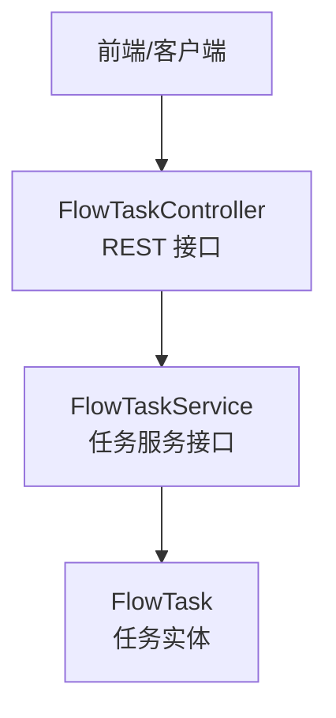

图表来源
- [FlowTaskController.java:32-44](file://forge-server/forge-flow/forge-flow-server/src/main/java/com/mdframe/forge/flow/controller/FlowTaskController.java#L32-L44)
- [FlowTaskService.java:13-213](file://forge-server/forge-framework/forge-plugin-parent/forge-plugin-flow/src/main/java/com/mdframe/forge/starter/flow/service/FlowTaskService.java#L13-L213)
- [FlowTask.java:1-200](file://forge-server/forge-framework/forge-plugin-parent/forge-plugin-flow/src/main/java/com/mdframe/forge/starter/flow/entity/FlowTask.java#L1-L200)

章节来源
- [FlowTaskController.java:32-44](file://forge-server/forge-flow/forge-flow-server/src/main/java/com/mdframe/forge/flow/controller/FlowTaskController.java#L32-L44)
- [FlowTaskService.java:13-213](file://forge-server/forge-framework/forge-plugin-parent/forge-plugin-flow/src/main/java/com/mdframe/forge/starter/flow/service/FlowTaskService.java#L13-L213)
- [FlowTask.java:1-200](file://forge-server/forge-framework/forge-plugin-parent/forge-plugin-flow/src/main/java/com/mdframe/forge/starter/flow/entity/FlowTask.java#L1-L200)

## 核心组件
- FlowTaskController：对外暴露任务相关 API，包括我的待办、已办、我发起的、候选任务、签收、审批通过/驳回/退回、改派、终结、撤回、催办、逾期提醒扫描、流程图与表单信息获取等。
- FlowTaskService：定义任务管理能力契约，涵盖查询、审批、转办、退回、改派、终结、撤回、催办、流程图与表单信息获取等。
- FlowTask：任务数据载体，用于列表与详情展示。

章节来源
- [FlowTaskController.java:46-371](file://forge-server/forge-flow/forge-flow-server/src/main/java/com/mdframe/forge/flow/controller/FlowTaskController.java#L46-L371)
- [FlowTaskService.java:18-213](file://forge-server/forge-framework/forge-plugin-parent/forge-plugin-flow/src/main/java/com/mdframe/forge/starter/flow/service/FlowTaskService.java#L18-L213)
- [FlowTask.java:1-200](file://forge-server/forge-framework/forge-plugin-parent/forge-plugin-flow/src/main/java/com/mdframe/forge/starter/flow/entity/FlowTask.java#L1-L200)

## 架构总览
任务管理采用“控制器-服务-实体”分层设计。控制器专注请求接入与基础校验；服务层封装业务规则与跨域能力；实体层承载数据模型。

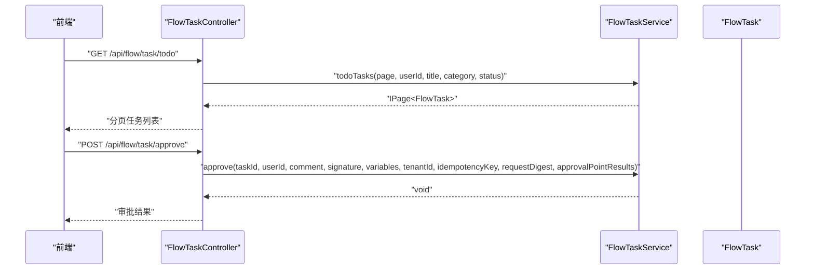

图表来源
- [FlowTaskController.java:46-136](file://forge-server/forge-flow/forge-flow-server/src/main/java/com/mdframe/forge/flow/controller/FlowTaskController.java#L46-L136)
- [FlowTaskService.java:18-77](file://forge-server/forge-framework/forge-plugin-parent/forge-plugin-flow/src/main/java/com/mdframe/forge/starter/flow/service/FlowTaskService.java#L18-L77)

## 详细组件分析

### 任务列表与筛选
- 我的待办：支持分页、用户上下文、标题/分类/状态过滤。
- 我的已办：同上。
- 我发起的流程：同上。
- 候选任务（未签收）：支持按用户或组筛选。

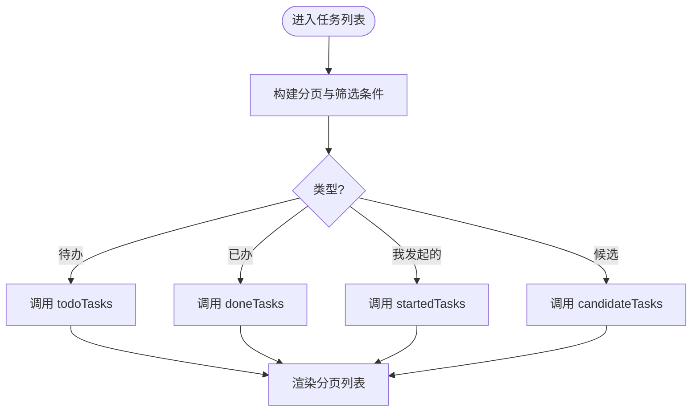

图表来源
- [FlowTaskController.java:46-111](file://forge-server/forge-flow/forge-flow-server/src/main/java/com/mdframe/forge/flow/controller/FlowTaskController.java#L46-L111)
- [FlowTaskService.java:18-43](file://forge-server/forge-framework/forge-plugin-parent/forge-plugin-flow/src/main/java/com/mdframe/forge/starter/flow/service/FlowTaskService.java#L18-L43)

章节来源
- [FlowTaskController.java:46-111](file://forge-server/forge-flow/forge-flow-server/src/main/java/com/mdframe/forge/flow/controller/FlowTaskController.java#L46-L111)
- [FlowTaskService.java:18-43](file://forge-server/forge-framework/forge-plugin-parent/forge-plugin-flow/src/main/java/com/mdframe/forge/starter/flow/service/FlowTaskService.java#L18-L43)

### 任务详情与表单
- 任务详情：根据 taskId 获取任务详情。
- 流程图：支持返回 PNG 图片与结构化节点信息（含是否包含图片）。
- 表单信息：支持任务维度与流程维度（仅读）两种场景。

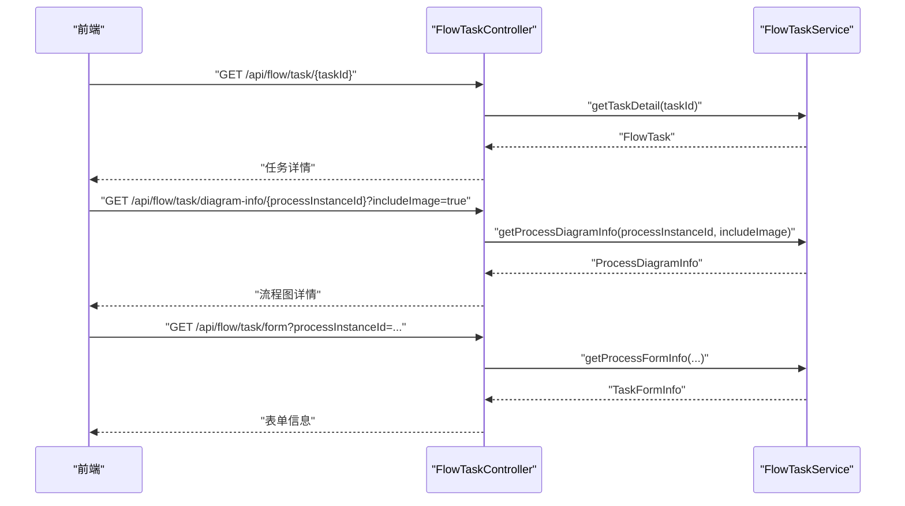

图表来源
- [FlowTaskController.java:272-371](file://forge-server/forge-flow/forge-flow-server/src/main/java/com/mdframe/forge/flow/controller/FlowTaskController.java#L272-L371)
- [FlowTaskService.java:147-213](file://forge-server/forge-framework/forge-plugin-parent/forge-plugin-flow/src/main/java/com/mdframe/forge/starter/flow/service/FlowTaskService.java#L147-L213)

章节来源
- [FlowTaskController.java:272-371](file://forge-server/forge-flow/forge-flow-server/src/main/java/com/mdframe/forge/flow/controller/FlowTaskController.java#L272-L371)
- [FlowTaskService.java:147-213](file://forge-server/forge-framework/forge-plugin-parent/forge-plugin-flow/src/main/java/com/mdframe/forge/starter/flow/service/FlowTaskService.java#L147-L213)

### 审批操作（通过/驳回/退回）
- 审批通过：支持评论、签名、变量、可信租户、幂等键、请求摘要与审批要点勾选结果。
- 审批驳回：支持评论、签名、可信租户、幂等键、请求摘要。
- 退回上一节点：支持指定目标活动 ID 进行历史节点退回。

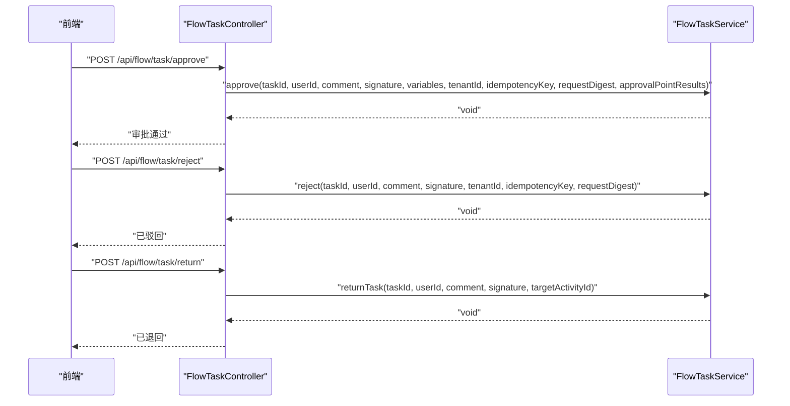

图表来源
- [FlowTaskController.java:123-223](file://forge-server/forge-flow/forge-flow-server/src/main/java/com/mdframe/forge/flow/controller/FlowTaskController.java#L123-L223)
- [FlowTaskService.java:50-125](file://forge-server/forge-framework/forge-plugin-parent/forge-plugin-flow/src/main/java/com/mdframe/forge/starter/flow/service/FlowTaskService.java#L50-L125)

章节来源
- [FlowTaskController.java:123-223](file://forge-server/forge-flow/forge-flow-server/src/main/java/com/mdframe/forge/flow/controller/FlowTaskController.java#L123-L223)
- [FlowTaskService.java:50-125](file://forge-server/forge-framework/forge-plugin-parent/forge-plugin-flow/src/main/java/com/mdframe/forge/starter/flow/service/FlowTaskService.java#L50-L125)

### 转交委托与改派
- 转办：将当前任务转交给其他用户，支持评论与签名。
- 改派：由发起人、当前处理人或任务拥有人改派至新处理人。

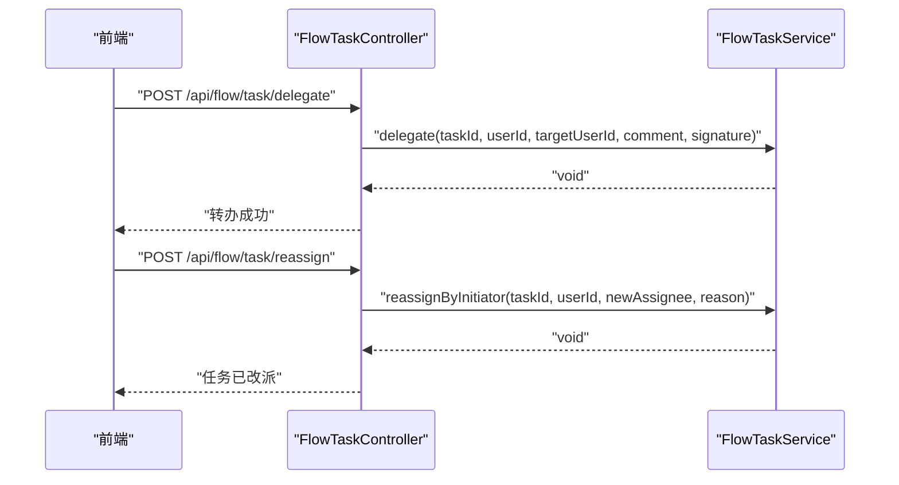

图表来源
- [FlowTaskController.java:190-241](file://forge-server/forge-flow/forge-flow-server/src/main/java/com/mdframe/forge/flow/controller/FlowTaskController.java#L190-L241)
- [FlowTaskService.java:104-130](file://forge-server/forge-framework/forge-plugin-parent/forge-plugin-flow/src/main/java/com/mdframe/forge/starter/flow/service/FlowTaskService.java#L104-L130)

章节来源
- [FlowTaskController.java:190-241](file://forge-server/forge-flow/forge-flow-server/src/main/java/com/mdframe/forge/flow/controller/FlowTaskController.java#L190-L241)
- [FlowTaskService.java:104-130](file://forge-server/forge-framework/forge-plugin-parent/forge-plugin-flow/src/main/java/com/mdframe/forge/starter/flow/service/FlowTaskService.java#L104-L130)

### 撤回与撤销
- 撤回：流程发起人可在一定条件下撤回流程实例。

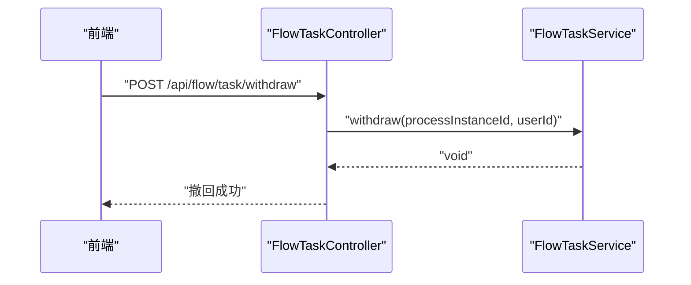

图表来源
- [FlowTaskController.java:258-270](file://forge-server/forge-flow/forge-flow-server/src/main/java/com/mdframe/forge/flow/controller/FlowTaskController.java#L258-L270)
- [FlowTaskService.java:142-145](file://forge-server/forge-framework/forge-plugin-parent/forge-plugin-flow/src/main/java/com/mdframe/forge/starter/flow/service/FlowTaskService.java#L142-L145)

章节来源
- [FlowTaskController.java:258-270](file://forge-server/forge-flow/forge-flow-server/src/main/java/com/mdframe/forge/flow/controller/FlowTaskController.java#L258-L270)
- [FlowTaskService.java:142-145](file://forge-server/forge-framework/forge-plugin-parent/forge-plugin-flow/src/main/java/com/mdframe/forge/starter/flow/service/FlowTaskService.java#L142-L145)

### 签收与候选任务
- 候选任务：查询未签收任务，支持按用户或组筛选。
- 签收：将候选任务转为个人待办。

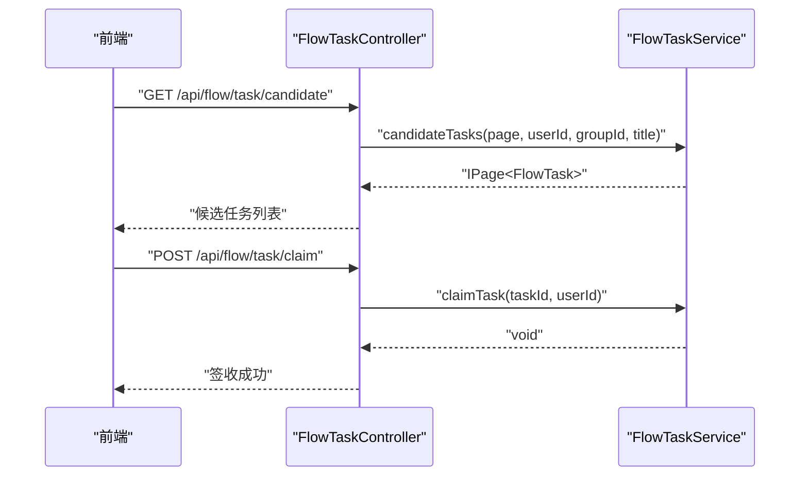

图表来源
- [FlowTaskController.java:97-121](file://forge-server/forge-flow/forge-flow-server/src/main/java/com/mdframe/forge/flow/controller/FlowTaskController.java#L97-L121)
- [FlowTaskService.java:33-48](file://forge-server/forge-framework/forge-plugin-parent/forge-plugin-flow/src/main/java/com/mdframe/forge/starter/flow/service/FlowTaskService.java#L33-L48)

章节来源
- [FlowTaskController.java:97-121](file://forge-server/forge-flow/forge-flow-server/src/main/java/com/mdframe/forge/flow/controller/FlowTaskController.java#L97-L121)
- [FlowTaskService.java:33-48](file://forge-server/forge-framework/forge-plugin-parent/forge-plugin-flow/src/main/java/com/mdframe/forge/starter/flow/service/FlowTaskService.java#L33-L48)

### 终结与催办
- 终结：终止流程运行。
- 催办：对当前任务进行催办提醒。

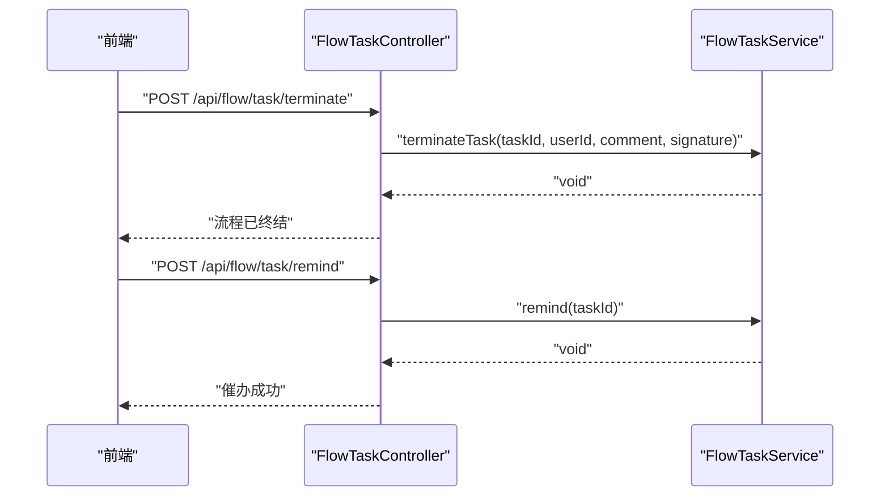

图表来源
- [FlowTaskController.java:243-324](file://forge-server/forge-flow/forge-flow-server/src/main/java/com/mdframe/forge/flow/controller/FlowTaskController.java#L243-L324)
- [FlowTaskService.java:132-180](file://forge-server/forge-framework/forge-plugin-parent/forge-plugin-flow/src/main/java/com/mdframe/forge/starter/flow/service/FlowTaskService.java#L132-L180)

章节来源
- [FlowTaskController.java:243-324](file://forge-server/forge-flow/forge-flow-server/src/main/java/com/mdframe/forge/flow/controller/FlowTaskController.java#L243-L324)
- [FlowTaskService.java:132-180](file://forge-server/forge-framework/forge-plugin-parent/forge-plugin-flow/src/main/java/com/mdframe/forge/starter/flow/service/FlowTaskService.java#L132-L180)

### 任务状态流转
- 典型流转：候选 -> 待办 -> 已办；或通过/驳回/退回/改派/终结/撤回等动作驱动状态变化。
- 关键控制点：
  - 签收：候选转待办。
  - 审批通过/驳回：推进或回退到上游节点。
  - 退回：回到上一或指定历史节点。
  - 改派：变更当前处理人。
  - 终结：终止流程。
  - 撤回：发起人撤回流程。

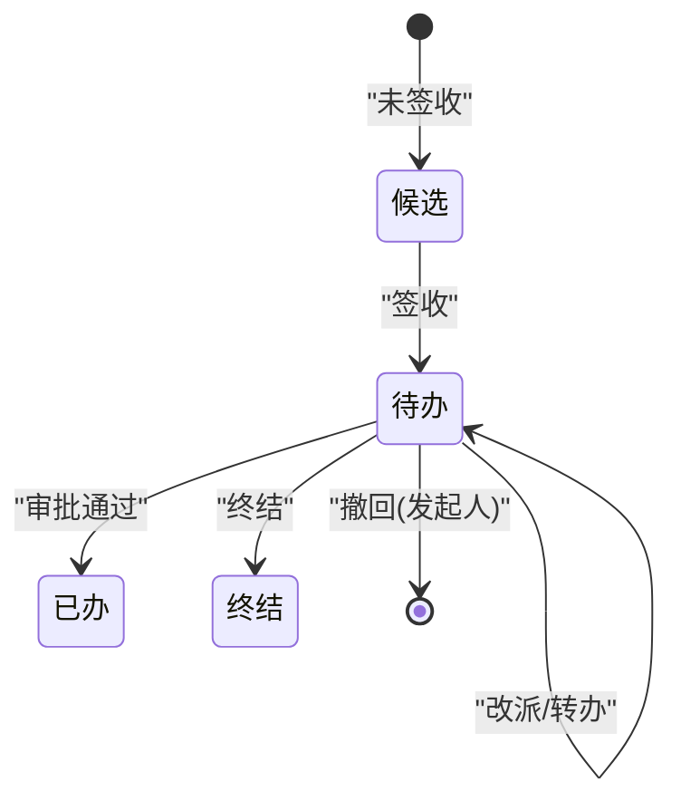

[此图为概念性状态图，不直接映射具体源码文件]

### 任务优先级管理
- 列表查询支持按状态过滤，便于结合优先级策略进行排序与展示（如高优先任务置顶）。
- 建议在业务侧结合任务属性（如紧急程度、SLA）与排序字段进行组合展示。

[本节为通用建议，不直接分析具体文件]

### 任务超时处理与通知
- 逾期提醒：提供手动触发扫描接口，用于扫描并发送逾期提醒。
- 催办：对单个任务进行催办。
- 建议配合定时任务与消息通道实现自动化逾期检测与通知。

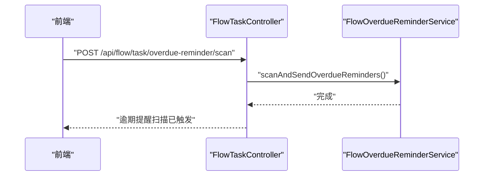

图表来源
- [FlowTaskController.java:326-333](file://forge-server/forge-flow/forge-flow-server/src/main/java/com/mdframe/forge/flow/controller/FlowTaskController.java#L326-L333)

章节来源
- [FlowTaskController.java:326-333](file://forge-server/forge-flow/forge-flow-server/src/main/java/com/mdframe/forge/flow/controller/FlowTaskController.java#L326-L333)

### 任务处理最佳实践
- 幂等与防重：审批与驳回接口支持幂等键与请求摘要，避免重复提交导致的状态不一致。
- 租户隔离：接口强制校验会话租户与请求租户一致性，防止越权。
- 安全访问：敏感接口启用加密传输注解，保障数据传输安全。
- 审计留痕：所有审批、转办、退回等操作均记录评论与签名，便于追溯。

章节来源
- [FlowTaskController.java:123-176](file://forge-server/forge-flow/forge-flow-server/src/main/java/com/mdframe/forge/flow/controller/FlowTaskController.java#L123-L176)

### 批量任务操作
- 当前接口以单任务为主，批量操作可通过循环调用现有接口实现。
- 建议在前端增加批量选择与并发控制，后端结合幂等键保证一致性。

[本节为通用建议，不直接分析具体文件]

### 任务统计分析
- 列表接口支持分页与筛选，可用于统计待办/已办数量、趋势与分布。
- 流程图与历史接口可用于分析节点耗时与瓶颈。

章节来源
- [FlowTaskController.java:46-111](file://forge-server/forge-flow/forge-flow-server/src/main/java/com/mdframe/forge/flow/controller/FlowTaskController.java#L46-L111)
- [FlowTaskController.java:335-344](file://forge-server/forge-flow/forge-flow-server/src/main/java/com/mdframe/forge/flow/controller/FlowTaskController.java#L335-L344)

### 任务性能优化
- 分页查询：所有列表接口默认分页，避免一次性加载大量数据。
- 按需图片：流程图详情支持可选 Base64 图片，减少不必要的数据传输。
- 缓存与索引：建议在数据库层对常用筛选字段建立索引，提升查询性能。

章节来源
- [FlowTaskController.java:46-111](file://forge-server/forge-flow/forge-flow-server/src/main/java/com/mdframe/forge/flow/controller/FlowTaskController.java#L46-L111)
- [FlowTaskController.java:302-315](file://forge-server/forge-flow/forge-flow-server/src/main/java/com/mdframe/forge/flow/controller/FlowTaskController.java#L302-L315)

### 异常处理方案
- 租户校验失败：当会话租户缺失或与请求租户不一致时抛出非法参数异常。
- 必填项校验：任务ID、目标用户等必填字段为空时返回错误提示。
- 资源不存在：流程图不存在时返回 404。

章节来源
- [FlowTaskController.java:167-176](file://forge-server/forge-flow/forge-flow-server/src/main/java/com/mdframe/forge/flow/controller/FlowTaskController.java#L167-L176)
- [FlowTaskController.java:190-207](file://forge-server/forge-flow/forge-flow-server/src/main/java/com/mdframe/forge/flow/controller/FlowTaskController.java#L190-L207)
- [FlowTaskController.java:282-300](file://forge-server/forge-flow/forge-flow-server/src/main/java/com/mdframe/forge/flow/controller/FlowTaskController.java#L282-L300)

## 依赖关系分析
- FlowTaskController 依赖 FlowTaskService 提供的任务能力。
- FlowTaskService 定义任务操作的抽象契约，具体实现由框架插件提供。
- FlowTask 作为数据载体贯穿查询与详情展示。

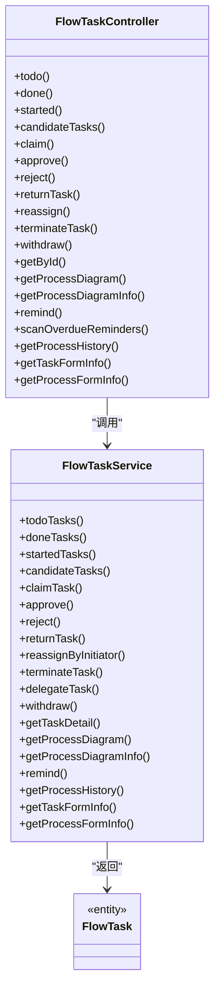

图表来源
- [FlowTaskController.java:32-371](file://forge-server/forge-flow/forge-flow-server/src/main/java/com/mdframe/forge/flow/controller/FlowTaskController.java#L32-L371)
- [FlowTaskService.java:13-213](file://forge-server/forge-framework/forge-plugin-parent/forge-plugin-flow/src/main/java/com/mdframe/forge/starter/flow/service/FlowTaskService.java#L13-L213)
- [FlowTask.java:1-200](file://forge-server/forge-framework/forge-plugin-parent/forge-plugin-flow/src/main/java/com/mdframe/forge/starter/flow/entity/FlowTask.java#L1-L200)

章节来源
- [FlowTaskController.java:32-371](file://forge-server/forge-flow/forge-flow-server/src/main/java/com/mdframe/forge/flow/controller/FlowTaskController.java#L32-L371)
- [FlowTaskService.java:13-213](file://forge-server/forge-framework/forge-plugin-parent/forge-plugin-flow/src/main/java/com/mdframe/forge/starter/flow/service/FlowTaskService.java#L13-L213)
- [FlowTask.java:1-200](file://forge-server/forge-framework/forge-plugin-parent/forge-plugin-flow/src/main/java/com/mdframe/forge/starter/flow/entity/FlowTask.java#L1-L200)

## 性能考虑
- 分页与筛选：充分利用分页与筛选条件，降低单次查询压力。
- 图片按需：流程图详情支持可选图片，减少带宽占用。
- 索引优化：对常用筛选字段建立数据库索引，提升查询效率。
- 幂等与去重：利用幂等键避免重复处理，提高吞吐稳定性。

[本节为通用建议，不直接分析具体文件]

## 故障排查指南
- 租户校验失败：检查会话租户与请求租户是否一致。
- 必填字段为空：确保任务ID、目标用户等必填参数已正确传入。
- 流程图不存在：确认流程实例是否存在且可生成流程图。
- 审批失败：检查幂等键、请求摘要与审批要点是否正确配置。

章节来源
- [FlowTaskController.java:167-176](file://forge-server/forge-flow/forge-flow-server/src/main/java/com/mdframe/forge/flow/controller/FlowTaskController.java#L167-L176)
- [FlowTaskController.java:190-207](file://forge-server/forge-flow/forge-flow-server/src/main/java/com/mdframe/forge/flow/controller/FlowTaskController.java#L190-L207)
- [FlowTaskController.java:282-300](file://forge-server/forge-flow/forge-flow-server/src/main/java/com/mdframe/forge/flow/controller/FlowTaskController.java#L282-L300)

## 结论
本模块提供了完整的任务管理能力，覆盖待办、已办、发起、抄送等常见场景，并通过审批、转办、退回、改派、终结、撤回等操作满足复杂业务流程需求。结合分页、筛选、流程图与表单信息，可实现高效的任务管理与可视化追踪。建议在生产环境结合定时任务与通知通道完善超时与提醒机制，并通过索引与幂等策略保障性能与一致性。

## 附录
- 接口清单概览：
  - 列表：待办、已办、我发起的、候选任务
  - 操作：签收、审批通过、审批驳回、退回、改派、终结、撤回、催办、逾期提醒扫描
  - 详情：任务详情、流程图、流程图详情、表单信息、审批历史

[本节为汇总性内容，不直接分析具体文件]