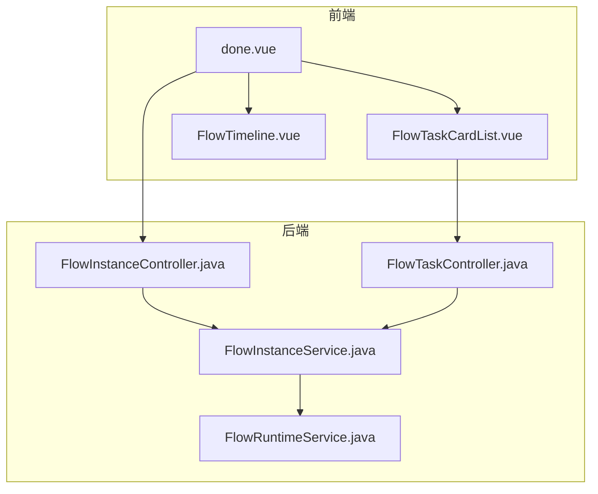
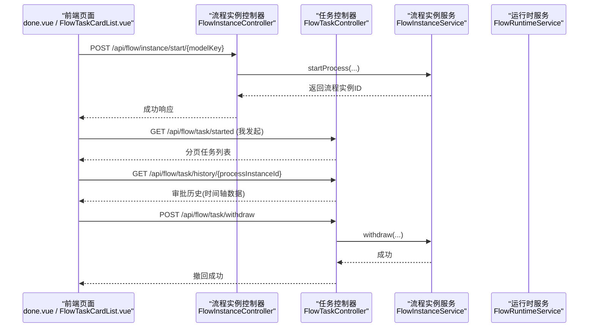
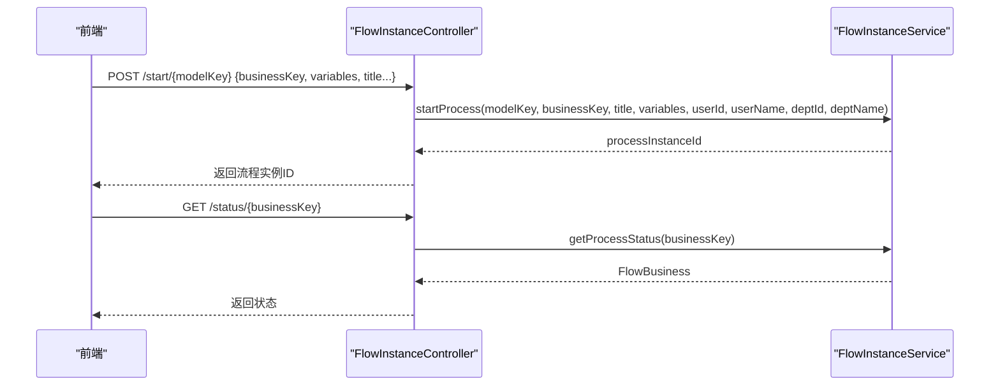
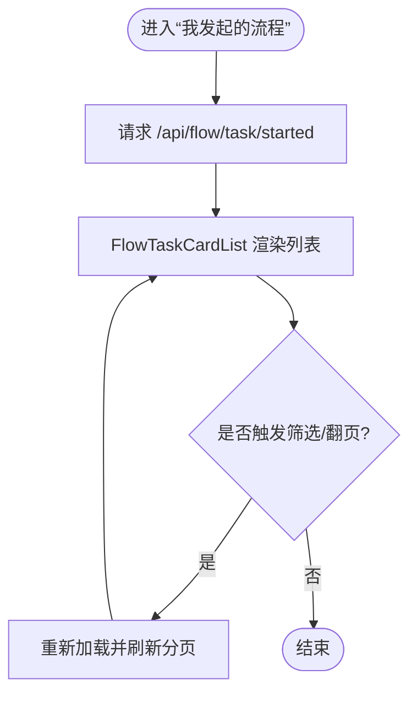
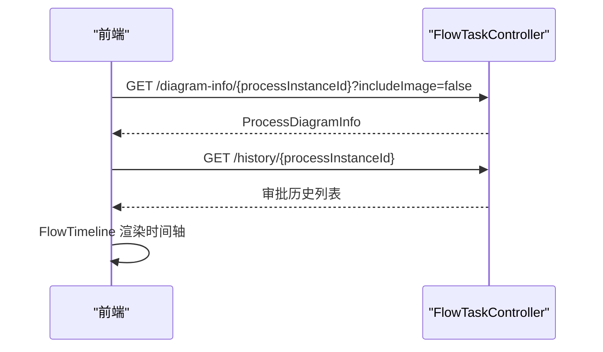
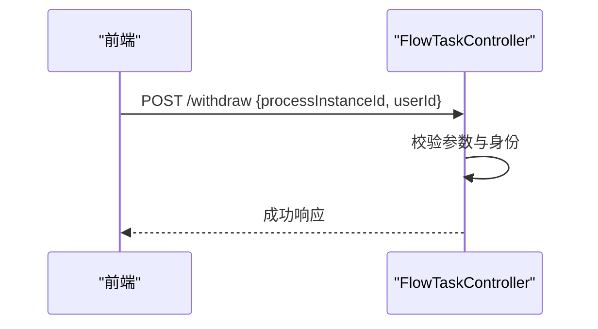
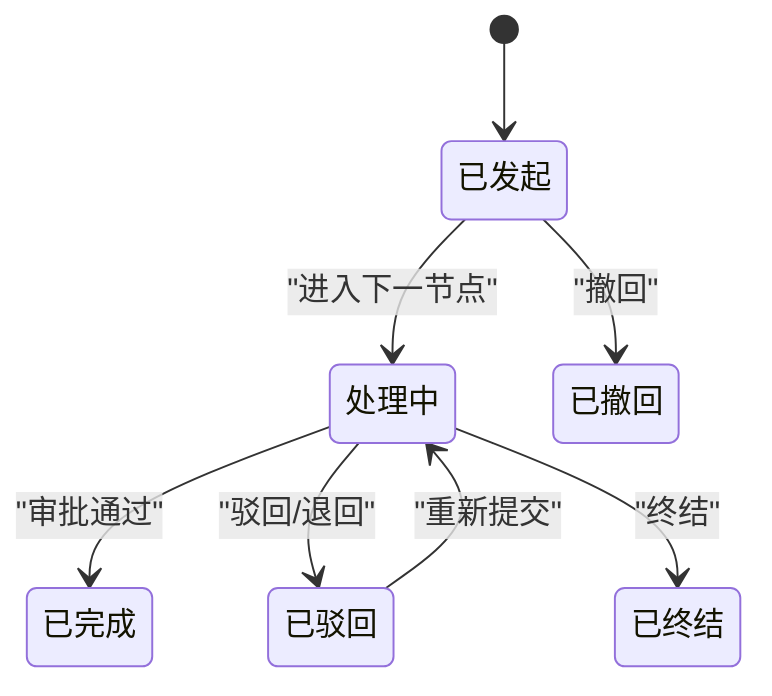
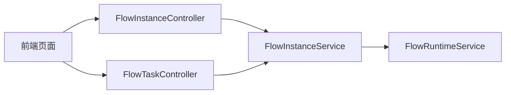

# 发起任务管理

<cite>
**本文引用的文件**
- [FlowTaskController.java](file://forge-server/forge-flow/forge-flow-server/src/main/java/com/mdframe/forge/flow/controller/FlowTaskController.java)
- [FlowInstanceController.java](file://forge-server/forge-flow/forge-flow-server/src/main/java/com/mdframe/forge/flow/controller/FlowInstanceController.java)
- [FlowInstanceService.java](file://forge-server/forge-framework/forge-plugin-parent/forge-plugin-flow/src/main/java/com/mdframe/forge/starter/flow/service/FlowInstanceService.java)
- [FlowRuntimeService.java](file://forge-server/forge-framework/forge-plugin-parent/forge-plugin-flow/src/main/java/com/mdframe/forge/starter/flow/service/FlowRuntimeService.java)
- [FlowTaskCardList.vue](file://forge-admin-ui/src/components/flow/FlowTaskCardList.vue)
- [FlowTimeline.vue](file://forge-admin-ui/src/components/flow/FlowTimeline.vue)
- [done.vue](file://forge-admin-ui/src/views/flow/done.vue)
</cite>

## 目录
1. [简介](#简介)
2. [项目结构](#项目结构)
3. [核心组件](#核心组件)
4. [架构总览](#架构总览)
5. [详细组件分析](#详细组件分析)
6. [依赖关系分析](#依赖关系分析)
7. [性能考虑](#性能考虑)
8. [故障排查指南](#故障排查指南)
9. [结论](#结论)
10. [附录](#附录)

## 简介
本章节面向“Forge Admin”的发起任务管理功能，聚焦用户发起流程后的任务跟踪、进度监控、撤回撤销等能力。文档从后端接口与前端组件两个维度，系统说明：
- 发起任务列表展示（我发起的流程）
- 流程实例查询与状态查看
- 节点执行状态与审批历史时间轴
- 撤回操作处理与生命周期管理
- 异常处理机制、最佳实践、性能优化策略与用户操作指导

## 项目结构
围绕“发起任务管理”，代码主要分布在以下位置：
- 后端控制器：提供流程实例启动、任务操作、流程图与历史等接口
- 服务层接口：定义流程实例与运行时相关能力
- 前端页面与组件：负责任务列表渲染、筛选分页、详情抽屉、流程图与时间轴展示

图表来源
- [FlowTaskController.java:32-44](file://forge-server/forge-flow/forge-flow-server/src/main/java/com/mdframe/forge/flow/controller/FlowTaskController.java#L32-L44)
- [FlowInstanceController.java:27-42](file://forge-server/forge-flow/forge-flow-server/src/main/java/com/mdframe/forge/flow/controller/FlowInstanceController.java#L27-L42)
- [FlowInstanceService.java:7-27](file://forge-server/forge-framework/forge-plugin-parent/forge-plugin-flow/src/main/java/com/mdframe/forge/starter/flow/service/FlowInstanceService.java#L7-L27)
- [FlowRuntimeService.java:8-18](file://forge-server/forge-framework/forge-plugin-parent/forge-plugin-flow/src/main/java/com/mdframe/forge/starter/flow/service/FlowRuntimeService.java#L8-L18)
- [FlowTaskCardList.vue:1-146](file://forge-admin-ui/src/components/flow/FlowTaskCardList.vue#L1-L146)
- [FlowTimeline.vue:1-39](file://forge-admin-ui/src/components/flow/FlowTimeline.vue#L1-L39)
- [done.vue:1-149](file://forge-admin-ui/src/views/flow/done.vue#L1-L149)

章节来源
- [FlowTaskController.java:32-44](file://forge-server/forge-flow/forge-flow-server/src/main/java/com/mdframe/forge/flow/controller/FlowTaskController.java#L32-L44)
- [FlowInstanceController.java:27-42](file://forge-server/forge-flow/forge-flow-server/src/main/java/com/mdframe/forge/flow/controller/FlowInstanceController.java#L27-L42)
- [FlowTaskCardList.vue:1-146](file://forge-admin-ui/src/components/flow/FlowTaskCardList.vue#L1-L146)
- [FlowTimeline.vue:1-39](file://forge-admin-ui/src/components/flow/FlowTimeline.vue#L1-L39)
- [done.vue:1-149](file://forge-admin-ui/src/views/flow/done.vue#L1-L149)

## 核心组件
- 流程实例控制器：负责流程启动、状态查询、变量读写、分页与删除等
- 任务控制器：提供我的待办/已办/我发起、签收、审批、驳回、退回、转办、改派、终结、撤回、催办、流程图与历史等
- 服务接口：封装流程实例与运行时的关键能力
- 前端组件：
  - FlowTaskCardList：通用任务卡片列表，支持搜索、分页、批量选择、插槽扩展
  - FlowTimeline：按时间顺序展示审批历史（发起、同意、驳回、转办、退回、终结、撤回等）
  - done.vue：已办任务页，组合列表、详情抽屉、流程图与只读表单

章节来源
- [FlowInstanceController.java:44-145](file://forge-server/forge-flow/forge-flow-server/src/main/java/com/mdframe/forge/flow/controller/FlowInstanceController.java#L44-L145)
- [FlowTaskController.java:46-371](file://forge-server/forge-flow/forge-flow-server/src/main/java/com/mdframe/forge/flow/controller/FlowTaskController.java#L46-L371)
- [FlowInstanceService.java:10-89](file://forge-server/forge-framework/forge-plugin-parent/forge-plugin-flow/src/main/java/com/mdframe/forge/starter/flow/service/FlowInstanceService.java#L10-L89)
- [FlowRuntimeService.java:8-18](file://forge-server/forge-framework/forge-plugin-parent/forge-plugin-flow/src/main/java/com/mdframe/forge/starter/flow/service/FlowRuntimeService.java#L8-L18)
- [FlowTaskCardList.vue:1-227](file://forge-admin-ui/src/components/flow/FlowTaskCardList.vue#L1-L227)
- [FlowTimeline.vue:41-107](file://forge-admin-ui/src/components/flow/FlowTimeline.vue#L41-L107)
- [done.vue:151-297](file://forge-admin-ui/src/views/flow/done.vue#L151-L297)

## 架构总览
下图展示了“发起任务管理”的前后端交互路径：前端通过 API 调用后端控制器，控制器委托服务层完成流程实例与任务操作；同时提供流程图与历史数据用于可视化展示。

图表来源
- [FlowInstanceController.java:44-145](file://forge-server/forge-flow/forge-flow-server/src/main/java/com/mdframe/forge/flow/controller/FlowInstanceController.java#L44-L145)
- [FlowTaskController.java:80-95](file://forge-server/forge-flow/forge-flow-server/src/main/java/com/mdframe/forge/flow/controller/FlowTaskController.java#L80-L95)
- [FlowTaskController.java:335-344](file://forge-server/forge-flow/forge-flow-server/src/main/java/com/mdframe/forge/flow/controller/FlowTaskController.java#L335-L344)
- [FlowTaskController.java:258-270](file://forge-server/forge-flow/forge-flow-server/src/main/java/com/mdframe/forge/flow/controller/FlowTaskController.java#L258-L270)
- [FlowInstanceService.java:10-27](file://forge-server/forge-framework/forge-plugin-parent/forge-plugin-flow/src/main/java/com/mdframe/forge/starter/flow/service/FlowInstanceService.java#L10-L27)

## 详细组件分析

### 流程实例启动与状态查询
- 启动流程：支持普通入口与委托入口，自动填充发起人信息、部门信息与标题，必要时生成业务键
- 状态查询：根据业务键获取流程实例状态
- 变量读写：支持读取与更新流程变量
- 分页与详情：支持按流程定义键、状态、标题、申请人分页查询，以及按流程实例ID查询详情

图表来源
- [FlowInstanceController.java:44-145](file://forge-server/forge-flow/forge-flow-server/src/main/java/com/mdframe/forge/flow/controller/FlowInstanceController.java#L44-L145)
- [FlowInstanceService.java:10-39](file://forge-server/forge-framework/forge-plugin-parent/forge-plugin-flow/src/main/java/com/mdframe/forge/starter/flow/service/FlowInstanceService.java#L10-L39)

章节来源
- [FlowInstanceController.java:44-145](file://forge-server/forge-flow/forge-flow-server/src/main/java/com/mdframe/forge/flow/controller/FlowInstanceController.java#L44-L145)
- [FlowInstanceService.java:10-39](file://forge-server/forge-framework/forge-plugin-parent/forge-plugin-flow/src/main/java/com/mdframe/forge/starter/flow/service/FlowInstanceService.java#L10-L39)

### 任务列表与“我发起的流程”
- 列表能力：支持分页、搜索、分类与状态过滤
- 视图组合：使用 FlowTaskCardList 统一渲染任务行，包含标题、当前节点、处理人、时间与操作区
- 数据来源：后端提供“我发起的流程”接口，返回分页任务数据

图表来源
- [FlowTaskController.java:80-95](file://forge-server/forge-flow/forge-flow-server/src/main/java/com/mdframe/forge/flow/controller/FlowTaskController.java#L80-L95)
- [FlowTaskCardList.vue:1-146](file://forge-admin-ui/src/components/flow/FlowTaskCardList.vue#L1-L146)

章节来源
- [FlowTaskController.java:80-95](file://forge-server/forge-flow/forge-flow-server/src/main/java/com/mdframe/forge/flow/controller/FlowTaskController.java#L80-L95)
- [FlowTaskCardList.vue:1-146](file://forge-admin-ui/src/components/flow/FlowTaskCardList.vue#L1-L146)

### 流程进度查看与时间轴
- 流程图：提供图片与结构化信息两种接口，便于高亮当前节点或交互式展示
- 时间轴：按时间顺序展示审批记录，包括发起、同意、驳回、转办、退回、终结、撤回等动作，附带评论与签名
- 已办详情：在详情抽屉中集成流程图与只读表单面板

图表来源
- [FlowTaskController.java:282-315](file://forge-server/forge-flow/forge-flow-server/src/main/java/com/mdframe/forge/flow/controller/FlowTaskController.java#L282-L315)
- [FlowTaskController.java:335-344](file://forge-server/forge-flow/forge-flow-server/src/main/java/com/mdframe/forge/flow/controller/FlowTaskController.java#L335-L344)
- [FlowTimeline.vue:41-107](file://forge-admin-ui/src/components/flow/FlowTimeline.vue#L41-L107)

章节来源
- [FlowTaskController.java:282-315](file://forge-server/forge-flow/forge-flow-server/src/main/java/com/mdframe/forge/flow/controller/FlowTaskController.java#L282-L315)
- [FlowTaskController.java:335-344](file://forge-server/forge-flow/forge-flow-server/src/main/java/com/mdframe/forge/flow/controller/FlowTaskController.java#L335-L344)
- [FlowTimeline.vue:41-107](file://forge-admin-ui/src/components/flow/FlowTimeline.vue#L41-L107)

### 撤回操作处理
- 撤回入口：POST /api/flow/task/withdraw，传入流程实例ID与操作人
- 服务端校验：校验流程实例ID非空，解析可信用户身份后执行撤回
- 前端反馈：成功后提示“撤回成功”，并可刷新列表或时间轴

图表来源
- [FlowTaskController.java:258-270](file://forge-server/forge-flow/forge-flow-server/src/main/java/com/mdframe/forge/flow/controller/FlowTaskController.java#L258-L270)

章节来源
- [FlowTaskController.java:258-270](file://forge-server/forge-flow/forge-flow-server/src/main/java/com/mdframe/forge/flow/controller/FlowTaskController.java#L258-L270)

### 任务状态跟踪与生命周期
- 生命周期阶段：发起 -> 流转（多节点）-> 完成/驳回/终结/撤回
- 状态跟踪：通过“我发起的流程”列表、流程图高亮、时间轴记录进行综合跟踪
- 节点执行状态：流程图信息接口可获取当前节点与执行上下文，结合时间轴判断节点推进情况

图表来源
- [FlowTaskController.java:80-95](file://forge-server/forge-flow/forge-flow-server/src/main/java/com/mdframe/forge/flow/controller/FlowTaskController.java#L80-L95)
- [FlowTaskController.java:258-270](file://forge-server/forge-flow/forge-flow-server/src/main/java/com/mdframe/forge/flow/controller/FlowTaskController.java#L258-L270)
- [FlowTaskController.java:243-256](file://forge-server/forge-flow/forge-flow-server/src/main/java/com/mdframe/forge/flow/controller/FlowTaskController.java#L243-L256)

章节来源
- [FlowTaskController.java:80-95](file://forge-server/forge-flow/forge-flow-server/src/main/java/com/mdframe/forge/flow/controller/FlowTaskController.java#L80-L95)
- [FlowTaskController.java:243-270](file://forge-server/forge-flow/forge-flow-server/src/main/java/com/mdframe/forge/flow/controller/FlowTaskController.java#L243-L270)

### 前端组件职责与交互
- FlowTaskCardList：提供统一的列表骨架，支持搜索、分页、批量选择、插槽定制（标题、状态、节点、用户、操作）
- FlowTimeline：将后端历史数据渲染为时间轴，区分不同动作类型并显示评论与签名
- done.vue：组合列表、详情抽屉、流程图与只读表单，实现“已办”场景下的完整查看体验

章节来源
- [FlowTaskCardList.vue:1-227](file://forge-admin-ui/src/components/flow/FlowTaskCardList.vue#L1-L227)
- [FlowTimeline.vue:41-107](file://forge-admin-ui/src/components/flow/FlowTimeline.vue#L41-L107)
- [done.vue:151-297](file://forge-admin-ui/src/views/flow/done.vue#L151-L297)

## 依赖关系分析
- 控制器到服务：FlowInstanceController 与 FlowTaskController 均依赖 FlowInstanceService 完成流程实例与任务的核心逻辑
- 运行时能力：FlowRuntimeService 提供流程入口与表单实例的运行时查询能力
- 前端到后端：前端通过 REST 接口获取任务列表、流程图、历史与状态，驱动界面渲染与交互

图表来源
- [FlowInstanceController.java:27-42](file://forge-server/forge-flow/forge-flow-server/src/main/java/com/mdframe/forge/flow/controller/FlowInstanceController.java#L27-L42)
- [FlowTaskController.java:32-44](file://forge-server/forge-flow/forge-flow-server/src/main/java/com/mdframe/forge/flow/controller/FlowTaskController.java#L32-L44)
- [FlowInstanceService.java:10-89](file://forge-server/forge-framework/forge-plugin-parent/forge-plugin-flow/src/main/java/com/mdframe/forge/starter/flow/service/FlowInstanceService.java#L10-L89)
- [FlowRuntimeService.java:8-18](file://forge-server/forge-framework/forge-plugin-parent/forge-plugin-flow/src/main/java/com/mdframe/forge/starter/flow/service/FlowRuntimeService.java#L8-L18)

章节来源
- [FlowInstanceController.java:27-42](file://forge-server/forge-flow/forge-flow-server/src/main/java/com/mdframe/forge/flow/controller/FlowInstanceController.java#L27-L42)
- [FlowTaskController.java:32-44](file://forge-server/forge-flow/forge-flow-server/src/main/java/com/mdframe/forge/flow/controller/FlowTaskController.java#L32-L44)
- [FlowInstanceService.java:10-89](file://forge-server/forge-framework/forge-plugin-parent/forge-plugin-flow/src/main/java/com/mdframe/forge/starter/flow/service/FlowInstanceService.java#L10-L89)
- [FlowRuntimeService.java:8-18](file://forge-server/forge-framework/forge-plugin-parent/forge-plugin-flow/src/main/java/com/mdframe/forge/starter/flow/service/FlowRuntimeService.java#L8-L18)

## 性能考虑
- 分页与筛选：充分利用后端分页接口（如“我发起的流程”），避免一次性拉取全量数据
- 列表渲染：使用 FlowTaskCardList 的插槽与最小化重绘，减少不必要的 DOM 更新
- 流程图与历史：按需加载流程图信息（是否包含图片），避免大对象传输；历史数据仅在打开详情时请求
- 缓存与去抖：对分类树、字典等静态数据做本地缓存；搜索输入防抖以减少频繁请求
- 并发控制：对撤回、审批等写操作增加幂等键与请求摘要，防止重复提交

[本节为通用性能建议，不直接分析具体文件]

## 故障排查指南
- 参数校验失败：检查必填字段（如流程实例ID、任务ID、租户ID）是否为空或不匹配
- 权限与租户隔离：确认会话中的租户与请求体中的租户一致，避免跨租户访问
- 流程图缺失：当流程图信息为空时，检查流程定义是否存在、是否已发布
- 历史为空：若时间轴无数据，检查流程实例ID是否正确，以及是否已产生审批记录
- 撤回失败：确认流程是否允许撤回、当前用户是否为发起人或具备相应权限

章节来源
- [FlowTaskController.java:167-176](file://forge-server/forge-flow/forge-flow-server/src/main/java/com/mdframe/forge/flow/controller/FlowTaskController.java#L167-L176)
- [FlowTaskController.java:258-270](file://forge-server/forge-flow/forge-flow-server/src/main/java/com/mdframe/forge/flow/controller/FlowTaskController.java#L258-L270)
- [FlowTaskController.java:282-315](file://forge-server/forge-flow/forge-flow-server/src/main/java/com/mdframe/forge/flow/controller/FlowTaskController.java#L282-L315)

## 结论
“发起任务管理”通过清晰的后端接口与可复用的前端组件，实现了从流程启动、任务跟踪、进度查看到撤回撤销的全链路能力。借助分页列表、流程图与时间轴，用户可以直观掌握流程状态与节点执行情况。配合合理的性能优化与错误处理策略，可在复杂业务场景中提供稳定、易用的体验。

[本节为总结性内容，不直接分析具体文件]

## 附录
- 常用接口速查
  - 启动流程：POST /api/flow/instance/start/{modelKey}
  - 我发起的流程：GET /api/flow/task/started
  - 流程图信息：GET /api/flow/task/diagram-info/{processInstanceId}
  - 审批历史：GET /api/flow/task/history/{processInstanceId}
  - 撤回：POST /api/flow/task/withdraw
- 最佳实践
  - 明确业务键与标题，便于后续追踪
  - 使用委托入口时确保会话可信
  - 在列表中合理设置筛选条件，提升检索效率
  - 对敏感操作（撤回、终结）增加二次确认与审计日志
- 用户操作指导
  - 发起流程：填写必要信息并提交，等待任务流转
  - 查看进度：通过“我发起的流程”列表与流程图查看当前节点
  - 撤回申请：在允许撤回的阶段，点击撤回并确认
  - 查看详情：打开详情抽屉，查看基本信息、表单内容与审批历史

[本节为补充信息，不直接分析具体文件]