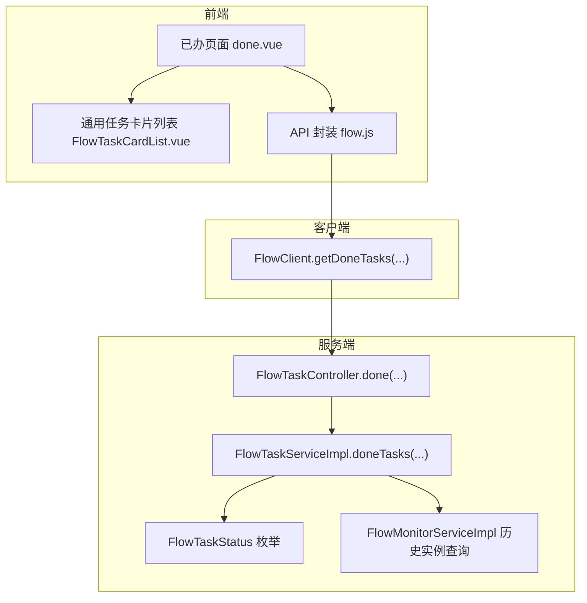
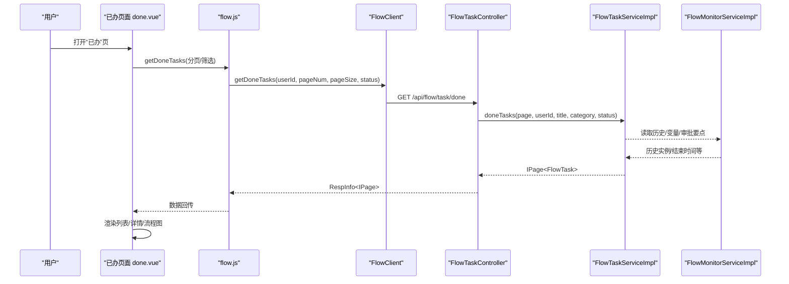
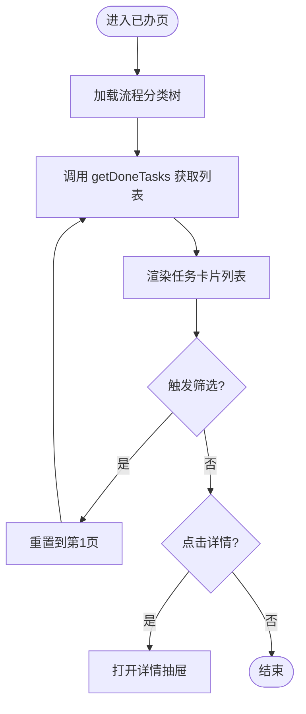
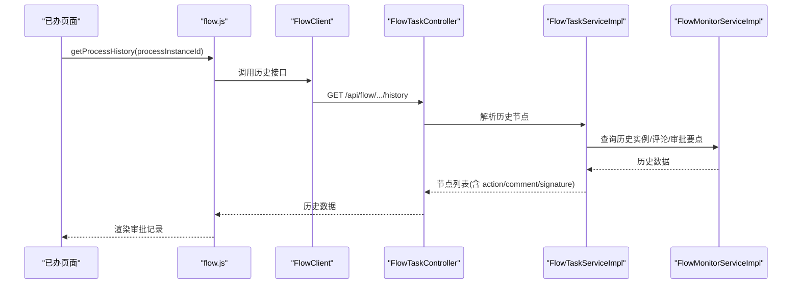
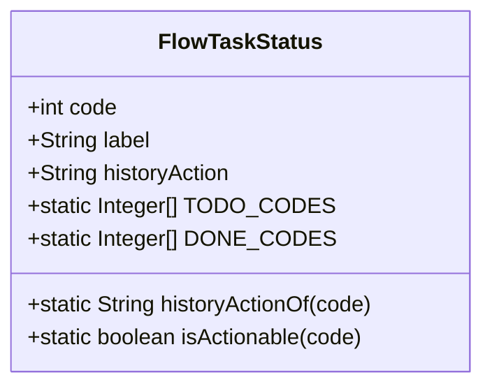
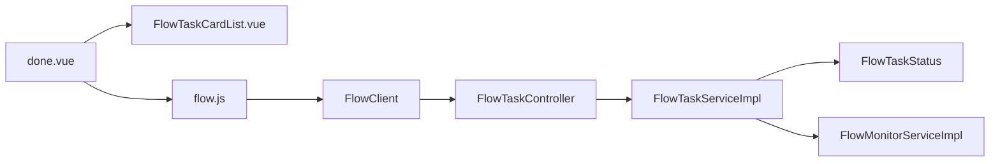
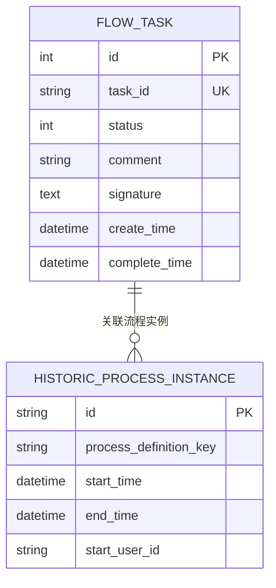

# 已完成任务管理

<cite>
**本文引用的文件**
- [done.vue](file://forge-admin-ui/src/views/flow/done.vue)
- [FlowTaskCardList.vue](file://forge-admin-ui/src/components/flow/FlowTaskCardList.vue)
- [flow.js](file://forge-admin-ui/src/api/flow.js)
- [FlowClient.java](file://forge-server/forge-flow/forge-flow-client/src/main/java/com/mdframe/forge/flow/client/FlowClient.java)
- [FlowTaskController.java](file://forge-server/forge-flow/forge-flow-server/src/main/java/com/mdframe/forge/flow/controller/FlowTaskController.java)
- [FlowTaskServiceImpl.java](file://forge-server/forge-framework/forge-plugin-parent/forge-plugin-flow/src/main/java/com/mdframe/forge/starter/flow/service/impl/FlowTaskServiceImpl.java)
- [FlowTaskStatus.java](file://forge-server/forge-framework/forge-plugin-parent/forge-plugin-flow/src/main/java/com/mdframe/forge/starter/flow/enums/FlowTaskStatus.java)
- [FlowMonitorServiceImpl.java](file://forge-server/forge-framework/forge-plugin-parent/forge-plugin-flow/src/main/java/com/mdframe/forge/starter/flow/service/impl/FlowMonitorServiceImpl.java)
- [FlowActionExecutionLogService.java](file://forge-server/forge-framework/forge-plugin-parent/forge-plugin-capability-parent/forge-plugin-capability-actions/src/main/java/com/mdframe/forge/plugin/capability/flowaction/service/FlowActionExecutionLogService.java)
</cite>

## 目录
1. [简介](#简介)
2. [项目结构](#项目结构)
3. [核心组件](#核心组件)
4. [架构总览](#架构总览)
5. [详细组件分析](#详细组件分析)
6. [依赖关系分析](#依赖关系分析)
7. [性能考虑](#性能考虑)
8. [故障排查指南](#故障排查指南)
9. [结论](#结论)
10. [附录](#附录)

## 简介
本章节面向 Forge Admin 的“已完成任务”管理功能，围绕已完成任务的查询、统计、历史追溯与归档展开。文档覆盖：
- 已完成任务列表展示、筛选与分页
- 任务历史记录查看（审批轨迹）
- 审批结果分析与签名、意见展示
- 业务数据关联与只读表单查看
- 状态分类、时间范围筛选、审计日志追踪
- 数据分析、报表导出建议与性能优化方案
- 用户体验改进建议

## 项目结构
已完成任务的前端入口位于流程视图模块，后端通过 Flow 服务暴露任务查询接口，并基于流程引擎的历史数据进行聚合与展示。

**图表来源**
- [done.vue:1-149](file://forge-admin-ui/src/views/flow/done.vue#L1-L149)
- [FlowTaskCardList.vue:1-40](file://forge-admin-ui/src/components/flow/FlowTaskCardList.vue#L1-L40)
- [FlowClient.java:237-252](file://forge-server/forge-flow/forge-flow-client/src/main/java/com/mdframe/forge/flow/client/FlowClient.java#L237-L252)
- [FlowTaskController.java:63-78](file://forge-server/forge-flow/forge-flow-server/src/main/java/com/mdframe/forge/flow/controller/FlowTaskController.java#L63-L78)
- [FlowTaskServiceImpl.java:2713-2732](file://forge-server/forge-framework/forge-plugin-parent/forge-plugin-flow/src/main/java/com/mdframe/forge/starter/flow/service/impl/FlowTaskServiceImpl.java#L2713-L2732)
- [FlowTaskStatus.java:15-34](file://forge-server/forge-framework/forge-plugin-parent/forge-plugin-flow/src/main/java/com/mdframe/forge/starter/flow/enums/FlowTaskStatus.java#L15-L34)
- [FlowMonitorServiceImpl.java:192-224](file://forge-server/forge-framework/forge-plugin-parent/forge-plugin-flow/src/main/java/com/mdframe/forge/starter/flow/service/impl/FlowMonitorServiceImpl.java#L192-L224)

**章节来源**
- [done.vue:1-149](file://forge-admin-ui/src/views/flow/done.vue#L1-L149)
- [FlowTaskCardList.vue:1-40](file://forge-admin-ui/src/components/flow/FlowTaskCardList.vue#L1-L40)
- [FlowClient.java:237-252](file://forge-server/forge-flow/forge-flow-client/src/main/java/com/mdframe/forge/flow/client/FlowClient.java#L237-L252)
- [FlowTaskController.java:63-78](file://forge-server/forge-flow/forge-flow-server/src/main/java/com/mdframe/forge/flow/controller/FlowTaskController.java#L63-L78)

## 核心组件
- 前端已办页面：提供搜索、分类树筛选、审批结果筛选、分页加载、详情抽屉与流程图查看。
- 通用任务卡片列表：统一的任务列表渲染、工具栏、批量操作扩展点。
- 后端任务控制器：接收分页与筛选参数，调用服务层完成已办任务查询。
- 任务服务实现：组装节点信息、审批要点结果、时间字段等，供前端展示。
- 任务状态枚举：定义已完成任务的状态集合与历史动作映射。
- 监控服务：提供历史流程实例查询能力，支撑历史追溯与统计。

**章节来源**
- [done.vue:151-298](file://forge-admin-ui/src/views/flow/done.vue#L151-L298)
- [FlowTaskCardList.vue:1-40](file://forge-admin-ui/src/components/flow/FlowTaskCardList.vue#L1-L40)
- [FlowTaskController.java:63-78](file://forge-server/forge-flow/forge-flow-server/src/main/java/com/mdframe/forge/flow/controller/FlowTaskController.java#L63-L78)
- [FlowTaskServiceImpl.java:2713-2732](file://forge-server/forge-framework/forge-plugin-parent/forge-plugin-flow/src/main/java/com/mdframe/forge/starter/flow/service/impl/FlowTaskServiceImpl.java#L2713-L2732)
- [FlowTaskStatus.java:15-34](file://forge-server/forge-framework/forge-plugin-parent/forge-plugin-flow/src/main/java/com/mdframe/forge/starter/flow/enums/FlowTaskStatus.java#L15-L34)
- [FlowMonitorServiceImpl.java:192-224](file://forge-server/forge-framework/forge-plugin-parent/forge-plugin-flow/src/main/java/com/mdframe/forge/starter/flow/service/impl/FlowMonitorServiceImpl.java#L192-L224)

## 架构总览
已完成任务的数据流从前端发起请求开始，经 API 封装、客户端调用、服务端控制器与服务实现，最终返回结构化任务数据与历史轨迹。

**图表来源**
- [FlowClient.java:237-252](file://forge-server/forge-flow/forge-flow-client/src/main/java/com/mdframe/forge/flow/client/FlowClient.java#L237-L252)
- [FlowTaskController.java:63-78](file://forge-server/forge-flow/forge-flow-server/src/main/java/com/mdframe/forge/flow/controller/FlowTaskController.java#L63-L78)
- [FlowTaskServiceImpl.java:2713-2732](file://forge-server/forge-framework/forge-plugin-parent/forge-plugin-flow/src/main/java/com/mdframe/forge/starter/flow/service/impl/FlowTaskServiceImpl.java#L2713-L2732)
- [FlowMonitorServiceImpl.java:192-224](file://forge-server/forge-framework/forge-plugin-parent/forge-plugin-flow/src/main/java/com/mdframe/forge/starter/flow/service/impl/FlowMonitorServiceImpl.java#L192-L224)

## 详细组件分析

### 已完成任务列表与筛选
- 列表展示：使用通用任务卡片列表组件，支持标题搜索、分类树筛选、审批结果筛选、分页与刷新。
- 筛选参数：title、category、status；前端将空值转为 undefined 以精简请求。
- 详情抽屉：点击行或“详情”按钮打开抽屉，展示基本信息、处理结果、表单内容、流程图。

**图表来源**
- [done.vue:188-298](file://forge-admin-ui/src/views/flow/done.vue#L188-L298)
- [FlowTaskCardList.vue:1-40](file://forge-admin-ui/src/components/flow/FlowTaskCardList.vue#L1-L40)

**章节来源**
- [done.vue:1-149](file://forge-admin-ui/src/views/flow/done.vue#L1-L149)
- [done.vue:151-298](file://forge-admin-ui/src/views/flow/done.vue#L151-L298)

### 任务历史记录查看与审批结果分析
- 历史轨迹：打开详情时根据 processInstanceId 拉取流程历史，用于展示审批记录。
- 审批要点：后端在任务节点上保存审批要点结果（JSON），并在历史节点中一并返回。
- 审批结果：前端通过字典 flow_done_status 将状态码映射为可读文本，并提供图标与样式。

**图表来源**
- [FlowTaskServiceImpl.java:2713-2732](file://forge-server/forge-framework/forge-plugin-parent/forge-plugin-flow/src/main/java/com/mdframe/forge/starter/flow/service/impl/FlowTaskServiceImpl.java#L2713-L2732)
- [FlowMonitorServiceImpl.java:192-224](file://forge-server/forge-framework/forge-plugin-parent/forge-plugin-flow/src/main/java/com/mdframe/forge/starter/flow/service/impl/FlowMonitorServiceImpl.java#L192-L224)

**章节来源**
- [FlowTaskServiceImpl.java:2713-2732](file://forge-server/forge-framework/forge-plugin-parent/forge-plugin-flow/src/main/java/com/mdframe/forge/starter/flow/service/impl/FlowTaskServiceImpl.java#L2713-L2732)
- [FlowMonitorServiceImpl.java:192-224](file://forge-server/forge-framework/forge-plugin-parent/forge-plugin-flow/src/main/java/com/mdframe/forge/starter/flow/service/impl/FlowMonitorServiceImpl.java#L192-L224)

### 任务状态分类与时间范围筛选
- 状态分类：已完成任务包含已通过、已驳回、已转办、已取消、已退回、已终结等；前端过滤掉“已撤回”等不适用的状态选项。
- 时间范围：当前已办列表未直接暴露时间范围筛选；可在后端扩展 startTime/endTime 参数，结合历史实例结束时间进行过滤。

**图表来源**
- [FlowTaskStatus.java:15-34](file://forge-server/forge-framework/forge-plugin-parent/forge-plugin-flow/src/main/java/com/mdframe/forge/starter/flow/enums/FlowTaskStatus.java#L15-L34)
- [FlowTaskStatus.java:58-73](file://forge-server/forge-framework/forge-plugin-parent/forge-plugin-flow/src/main/java/com/mdframe/forge/starter/flow/enums/FlowTaskStatus.java#L58-L73)

**章节来源**
- [FlowTaskStatus.java:15-34](file://forge-server/forge-framework/forge-plugin-parent/forge-plugin-flow/src/main/java/com/mdframe/forge/starter/flow/enums/FlowTaskStatus.java#L15-L34)
- [FlowTaskStatus.java:58-73](file://forge-server/forge-framework/forge-plugin-parent/forge-plugin-flow/src/main/java/com/mdframe/forge/starter/flow/enums/FlowTaskStatus.java#L58-L73)

### 业务数据关联与只读表单
- 业务摘要：列表项通过业务摘要组件展示关键业务字段，便于快速识别。
- 只读表单：详情抽屉内以只读模式渲染流程表单，支持 formKey/formJson/formUrl 多种来源。

**章节来源**
- [done.vue:128-145](file://forge-admin-ui/src/views/flow/done.vue#L128-L145)

### 审计日志追踪
- 能力执行日志：对关键能力操作（如审批）进行幂等与审计记录，支持失败恢复与重复请求保护。
- 审批要点：任务节点上的审批要点结果以评论形式持久化，供历史追溯与分析。

**章节来源**
- [FlowActionExecutionLogService.java:29-372](file://forge-server/forge-framework/forge-plugin-parent/forge-plugin-capability-parent/forge-plugin-capability-actions/src/main/java/com/mdframe/forge/plugin/capability/flowaction/service/FlowActionExecutionLogService.java#L29-L372)
- [FlowTaskServiceImpl.java:1595-1624](file://forge-server/forge-framework/forge-plugin-parent/forge-plugin-flow/src/main/java/com/mdframe/forge/starter/flow/service/impl/FlowTaskServiceImpl.java#L1595-L1624)

## 依赖关系分析
- 前端依赖：已办页面依赖通用任务卡片列表与只读表单面板；通过 flow.js 调用 FlowClient。
- 客户端依赖：FlowClient 负责拼接 URL 与参数，调用 FlowTaskController。
- 服务端依赖：控制器委托服务实现；服务实现依赖状态枚举与监控服务以获取历史数据。

**图表来源**
- [done.vue:151-298](file://forge-admin-ui/src/views/flow/done.vue#L151-L298)
- [FlowTaskCardList.vue:1-40](file://forge-admin-ui/src/components/flow/FlowTaskCardList.vue#L1-L40)
- [FlowClient.java:237-252](file://forge-server/forge-flow/forge-flow-client/src/main/java/com/mdframe/forge/flow/client/FlowClient.java#L237-L252)
- [FlowTaskController.java:63-78](file://forge-server/forge-flow/forge-flow-server/src/main/java/com/mdframe/forge/flow/controller/FlowTaskController.java#L63-L78)
- [FlowTaskServiceImpl.java:2713-2732](file://forge-server/forge-framework/forge-plugin-parent/forge-plugin-flow/src/main/java/com/mdframe/forge/starter/flow/service/impl/FlowTaskServiceImpl.java#L2713-L2732)
- [FlowTaskStatus.java:15-34](file://forge-server/forge-framework/forge-plugin-parent/forge-plugin-flow/src/main/java/com/mdframe/forge/starter/flow/enums/FlowTaskStatus.java#L15-L34)
- [FlowMonitorServiceImpl.java:192-224](file://forge-server/forge-framework/forge-plugin-parent/forge-plugin-flow/src/main/java/com/mdframe/forge/starter/flow/service/impl/FlowMonitorServiceImpl.java#L192-L224)

**章节来源**
- [FlowClient.java:237-252](file://forge-server/forge-flow/forge-flow-client/src/main/java/com/mdframe/forge/flow/client/FlowClient.java#L237-L252)
- [FlowTaskController.java:63-78](file://forge-server/forge-flow/forge-flow-server/src/main/java/com/mdframe/forge/flow/controller/FlowTaskController.java#L63-L78)

## 性能考虑
- 分页与筛选：前端默认分页大小合理，建议在大数据量场景下限制最大 pageSize，避免一次性加载过多数据。
- 历史查询优化：历史实例查询按结束时间排序，建议在数据库层增加合适索引（如 processDefinitionKey、end_time）。
- 缓存策略：对流程分类树、字典数据可引入前端缓存或后端短缓存，减少重复请求。
- 懒加载：流程图与只读表单按需加载，避免首屏过重。
- 并发控制：对审批等写操作启用幂等键，防止重复提交导致额外开销。

[本节为通用性能建议，不直接分析具体文件]

## 故障排查指南
- 列表为空：检查 userId 是否正确传入；确认分类与状态筛选是否过严；查看后端返回的 total 是否为 0。
- 详情无历史：确认 processInstanceId 是否存在；检查历史接口是否被调用成功；查看审批要点评论是否写入。
- 状态显示异常：核对 flow_done_status 字典配置；检查后端返回的 status 是否在预期范围内。
- 签名/意见缺失：确认任务节点是否填写了 comment 与 signature；检查审批要点结果是否成功持久化。

**章节来源**
- [FlowActionExecutionLogService.java:159-189](file://forge-server/forge-framework/forge-plugin-parent/forge-plugin-capability-parent/forge-plugin-capability-actions/src/main/java/com/mdframe/forge/plugin/capability/flowaction/service/FlowActionExecutionLogService.java#L159-L189)
- [FlowTaskServiceImpl.java:1595-1624](file://forge-server/forge-framework/forge-plugin-parent/forge-plugin-flow/src/main/java/com/mdframe/forge/starter/flow/service/impl/FlowTaskServiceImpl.java#L1595-L1624)

## 结论
已完成任务管理功能在前端提供了直观的列表与详情体验，在后端通过稳定的任务状态与历史数据支撑，满足查询、统计、历史追溯与归档的基本需求。后续可通过时间范围筛选、统计分析、报表导出与更多性能优化进一步提升使用体验与管理效率。

[本节为总结性内容，不直接分析具体文件]

## 附录

### 已完成任务状态分类
- 已通过、已驳回、已转办、已取消、已退回、已终结属于已完成任务集合；待办与已签收不属于已完成任务；已撤回不在已完成任务列表中显示。

**章节来源**
- [FlowTaskStatus.java:15-34](file://forge-server/forge-framework/forge-plugin-parent/forge-plugin-flow/src/main/java/com/mdframe/forge/starter/flow/enums/FlowTaskStatus.java#L15-L34)

### 数据模型概览

[本节为概念性数据模型图，不直接映射具体代码文件]