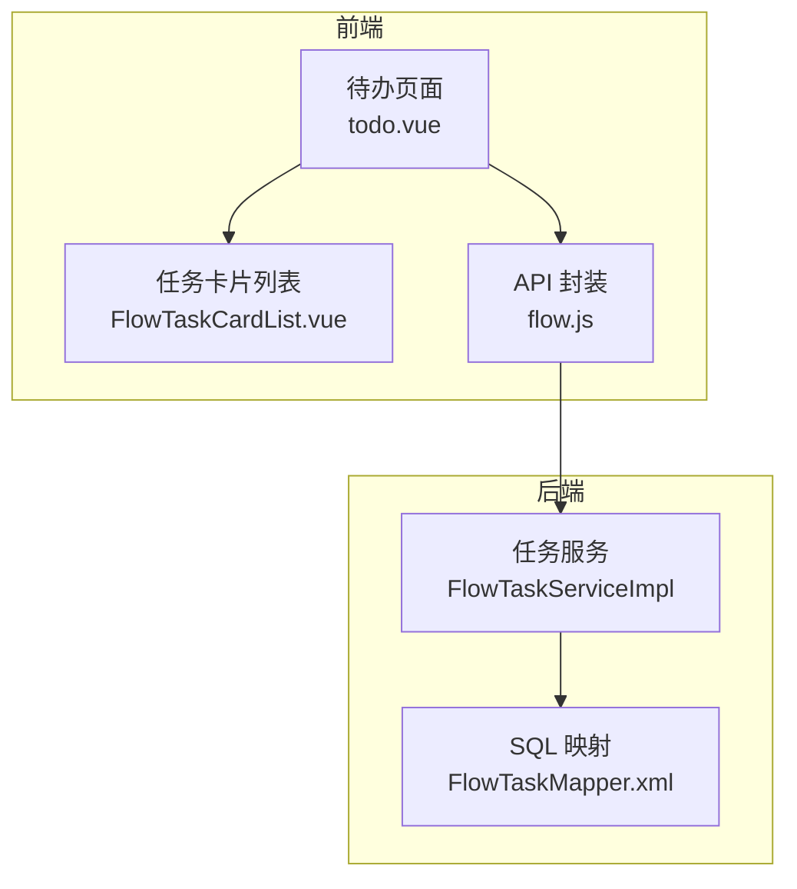
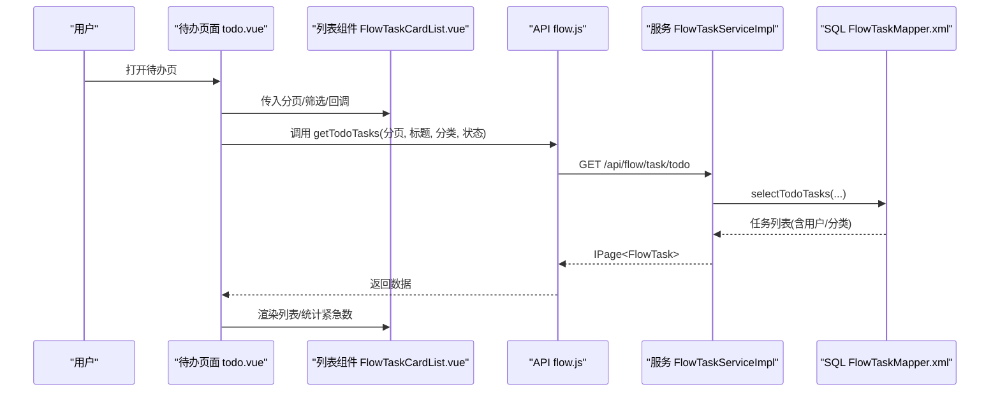
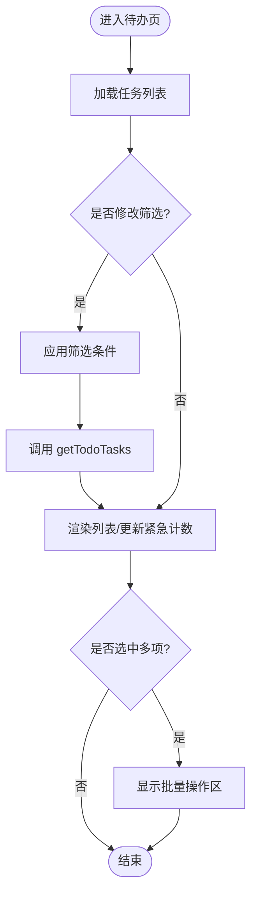
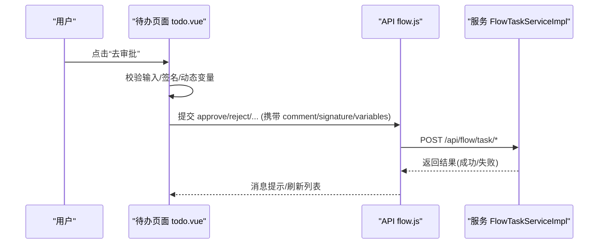
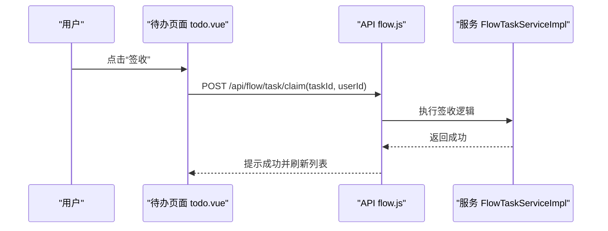
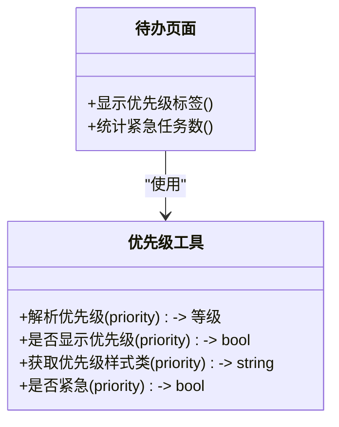
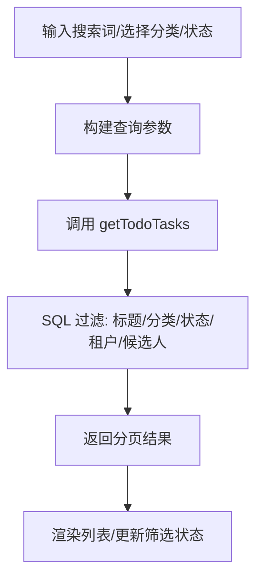
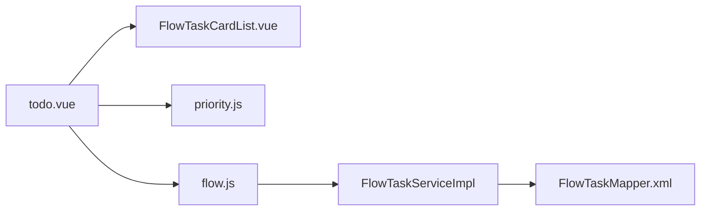

# 待办任务管理

<cite>
**本文引用的文件**
- [forge-admin-ui/src/views/flow/todo.vue](file://forge-admin-ui/src/views/flow/todo.vue)
- [forge-admin-ui/src/components/flow/FlowTaskCardList.vue](file://forge-admin-ui/src/components/flow/FlowTaskCardList.vue)
- [forge-admin-ui/src/api/flow.js](file://forge-admin-ui/src/api/flow.js)
- [forge-admin-ui/src/utils/flow-task-layout.js](file://forge-admin-ui/src/utils/flow-task-layout.js)
- [forge-admin-ui/src/views/flow/utils/priority.js](file://forge-admin-ui/src/views/flow/utils/priority.js)
- [forge-server/forge-framework/forge-plugin-parent/forge-plugin-flow/src/main/java/com/mdframe/forge/starter/flow/service/impl/FlowTaskServiceImpl.java](file://forge-server/forge-framework/forge-plugin-parent/forge-plugin-flow/src/main/java/com/mdframe/forge/starter/flow/service/impl/FlowTaskServiceImpl.java)
- [forge-server/forge-framework/forge-plugin-parent/forge-plugin-flow/src/main/resources/mapper/FlowTaskMapper.xml](file://forge-server/forge-framework/forge-plugin-parent/forge-plugin-flow/src/main/resources/mapper/FlowTaskMapper.xml)
- [forge-server/db/migration/V1.0.19__align_flow_task_query_api_resources.sql](file://forge-server/db/migration/V1.0.19__align_flow_task_query_api_resources.sql)
- [docs/superpowers/plans/2026-08-30-flow-task-list-performance.md](file://docs/superpowers/plans/2026-08-30-flow-task-list-performance.md)
</cite>

## 目录
1. [简介](#简介)
2. [项目结构](#项目结构)
3. [核心组件](#核心组件)
4. [架构总览](#架构总览)
5. [详细组件分析](#详细组件分析)
6. [依赖关系分析](#依赖关系分析)
7. [性能考虑](#性能考虑)
8. [故障排查指南](#故障排查指南)
9. [结论](#结论)
10. [附录](#附录)

## 简介
本章节面向 Forge Admin 的“待办任务管理”能力，围绕任务查询、筛选、批量操作、列表展示、详情查看、审批处理流程、签收机制、状态与优先级显示、紧急标识、搜索过滤等主题进行系统化说明。文档同时给出最佳实践、性能优化方案、异常处理策略以及用户交互体验优化建议，帮助读者快速理解并高效使用或扩展该功能。

## 项目结构
待办任务管理由前端页面、通用列表组件、API 封装与后端服务共同构成：
- 前端页面：负责列表渲染、筛选条件、批量操作、抽屉详情与审批交互。
- 通用列表组件：提供统一的卡片式任务列表、分页、选择与工具栏。
- API 层：统一封装任务查询、签收、审批、驳回、转办、退回、终止、撤回、流程图与历史等接口。
- 后端服务：实现任务分页查询、业务摘要补齐、审批动作执行、数据持久化与权限控制。
- SQL 映射：通过 MyBatis XML 完成多表关联、租户隔离、候选人与角色匹配、分类树过滤等复杂查询。

图表来源
- [forge-admin-ui/src/views/flow/todo.vue:1-200](file://forge-admin-ui/src/views/flow/todo.vue#L1-L200)
- [forge-admin-ui/src/components/flow/FlowTaskCardList.vue:1-200](file://forge-admin-ui/src/components/flow/FlowTaskCardList.vue#L1-L200)
- [forge-admin-ui/src/api/flow.js:1-200](file://forge-admin-ui/src/api/flow.js#L1-L200)
- [forge-server/forge-framework/forge-plugin-parent/forge-plugin-flow/src/main/java/com/mdframe/forge/starter/flow/service/impl/FlowTaskServiceImpl.java:154-178](file://forge-server/forge-framework/forge-plugin-parent/forge-plugin-flow/src/main/java/com/mdframe/forge/starter/flow/service/impl/FlowTaskServiceImpl.java#L154-L178)
- [forge-server/forge-framework/forge-plugin-parent/forge-plugin-flow/src/main/resources/mapper/FlowTaskMapper.xml:180-200](file://forge-server/forge-framework/forge-plugin-parent/forge-plugin-flow/src/main/resources/mapper/FlowTaskMapper.xml#L180-L200)

章节来源
- [forge-admin-ui/src/views/flow/todo.vue:1-200](file://forge-admin-ui/src/views/flow/todo.vue#L1-L200)
- [forge-admin-ui/src/components/flow/FlowTaskCardList.vue:1-200](file://forge-admin-ui/src/components/flow/FlowTaskCardList.vue#L1-L200)
- [forge-admin-ui/src/api/flow.js:1-200](file://forge-admin-ui/src/api/flow.js#L1-L200)
- [forge-server/forge-framework/forge-plugin-parent/forge-plugin-flow/src/main/java/com/mdframe/forge/starter/flow/service/impl/FlowTaskServiceImpl.java:154-178](file://forge-server/forge-framework/forge-plugin-parent/forge-plugin-flow/src/main/java/com/mdframe/forge/starter/flow/service/impl/FlowTaskServiceImpl.java#L154-L178)
- [forge-server/forge-framework/forge-plugin-parent/forge-plugin-flow/src/main/resources/mapper/FlowTaskMapper.xml:180-200](file://forge-server/forge-framework/forge-plugin-parent/forge-plugin-flow/src/main/resources/mapper/FlowTaskMapper.xml#L180-L200)

## 核心组件
- 待办任务页面（todo.vue）
  - 提供任务列表、筛选（标题、流程分类、状态）、批量同意/驳回、紧急任务计数、抽屉详情与审批表单。
  - 支持签收按钮在任务未分配且状态为待处理时出现。
- 任务卡片列表（FlowTaskCardList.vue）
  - 统一的任务卡片容器，包含搜索、筛选插槽、批量选择、分页、空态与加载态。
- API 封装（flow.js）
  - 暴露待办/已办/我发起/候选任务、签收、审批、驳回、转办、退回、终止、撤回、详情、流程图、历史、表单信息等接口。
- 后端任务服务（FlowTaskServiceImpl）
  - 实现分页查询、业务摘要补齐、审批动作执行、幂等键与请求摘要记录、错误日志记录。
- SQL 映射（FlowTaskMapper.xml）
  - 定义任务列表字段、用户关联、分类树过滤、候选人匹配、租户隔离等关键查询片段。

章节来源
- [forge-admin-ui/src/views/flow/todo.vue:1-200](file://forge-admin-ui/src/views/flow/todo.vue#L1-L200)
- [forge-admin-ui/src/components/flow/FlowTaskCardList.vue:1-200](file://forge-admin-ui/src/components/flow/FlowTaskCardList.vue#L1-L200)
- [forge-admin-ui/src/api/flow.js:1-200](file://forge-admin-ui/src/api/flow.js#L1-L200)
- [forge-server/forge-framework/forge-plugin-parent/forge-plugin-flow/src/main/java/com/mdframe/forge/starter/flow/service/impl/FlowTaskServiceImpl.java:154-178](file://forge-server/forge-framework/forge-plugin-parent/forge-plugin-flow/src/main/java/com/mdframe/forge/starter/flow/service/impl/FlowTaskServiceImpl.java#L154-L178)
- [forge-server/forge-framework/forge-plugin-parent/forge-plugin-flow/src/main/resources/mapper/FlowTaskMapper.xml:35-112](file://forge-server/forge-framework/forge-plugin-parent/forge-plugin-flow/src/main/resources/mapper/FlowTaskMapper.xml#L35-L112)

## 架构总览
待办任务从前端到后端的调用链路如下：
- 前端页面通过 FlowTaskCardList 渲染列表，监听搜索、筛选、分页事件，调用 flow.js 中的 getTodoTasks 获取数据。
- 后端 FlowTaskServiceImpl 接收分页参数与筛选条件，调用 Mapper 执行 selectTodoTasks，并在结果基础上进行业务摘要补齐。
- SQL 中通过 TaskListColumns 与 TaskListUserJoins 一次性关联用户与分类信息，避免 N+1 查询；TodoCandidateCondition 精确匹配当前用户的候选人范围。

图表来源
- [forge-admin-ui/src/views/flow/todo.vue:1-200](file://forge-admin-ui/src/views/flow/todo.vue#L1-L200)
- [forge-admin-ui/src/components/flow/FlowTaskCardList.vue:1-200](file://forge-admin-ui/src/components/flow/FlowTaskCardList.vue#L1-L200)
- [forge-admin-ui/src/api/flow.js:1-200](file://forge-admin-ui/src/api/flow.js#L1-L200)
- [forge-server/forge-framework/forge-plugin-parent/forge-plugin-flow/src/main/java/com/mdframe/forge/starter/flow/service/impl/FlowTaskServiceImpl.java:154-178](file://forge-server/forge-framework/forge-plugin-parent/forge-plugin-flow/src/main/java/com/mdframe/forge/starter/flow/service/impl/FlowTaskServiceImpl.java#L154-L178)
- [forge-server/forge-framework/forge-plugin-parent/forge-plugin-flow/src/main/resources/mapper/FlowTaskMapper.xml:180-200](file://forge-server/forge-framework/forge-plugin-parent/forge-plugin-flow/src/main/resources/mapper/FlowTaskMapper.xml#L180-L200)

## 详细组件分析

### 任务列表与筛选
- 列表展示
  - 使用 FlowTaskCardList 统一渲染，支持行点击查看详情、批量选择、分页切换。
  - 列表头包含实体名称、状态、节点、申请人/时间、操作列。
- 筛选条件
  - 标题模糊搜索、流程分类树选择、任务状态下拉筛选，均触发重新加载。
- 批量操作
  - 选中多条任务后可一键“同意”或“驳回”，并提示需填表或签名的任务会跳过。
- 紧急任务标识
  - 基于优先级计算，当优先级达到“紧急”级别时，列表顶部显示紧急计数提示。

图表来源
- [forge-admin-ui/src/views/flow/todo.vue:1-200](file://forge-admin-ui/src/views/flow/todo.vue#L1-L200)
- [forge-admin-ui/src/components/flow/FlowTaskCardList.vue:1-200](file://forge-admin-ui/src/components/flow/FlowTaskCardList.vue#L1-L200)
- [forge-admin-ui/src/views/flow/utils/priority.js:1-45](file://forge-admin-ui/src/views/flow/utils/priority.js#L1-L45)

章节来源
- [forge-admin-ui/src/views/flow/todo.vue:1-200](file://forge-admin-ui/src/views/flow/todo.vue#L1-L200)
- [forge-admin-ui/src/components/flow/FlowTaskCardList.vue:1-200](file://forge-admin-ui/src/components/flow/FlowTaskCardList.vue#L1-L200)
- [forge-admin-ui/src/views/flow/utils/priority.js:1-45](file://forge-admin-ui/src/views/flow/utils/priority.js#L1-L45)

### 任务详情查看与审批处理
- 详情抽屉
  - 行点击打开抽屉，展示任务基本信息、业务摘要、审批历史与流程图。
- 审批动作
  - 支持同意、驳回（可配置驳回到指定节点）、转办、退回、终止、撤回等。
  - 提交前校验意见与签名，必要时收集动态表单变量，再调用后端接口。
- 快捷操作
  - 列表行内提供“同意/驳回/去审批”快捷入口，提升高频操作效率。

图表来源
- [forge-admin-ui/src/views/flow/todo.vue:1423-1461](file://forge-admin-ui/src/views/flow/todo.vue#L1423-L1461)
- [forge-admin-ui/src/api/flow.js:1-200](file://forge-admin-ui/src/api/flow.js#L1-L200)
- [forge-server/forge-framework/forge-plugin-parent/forge-plugin-flow/src/main/java/com/mdframe/forge/starter/flow/service/impl/FlowTaskServiceImpl.java:301-331](file://forge-server/forge-framework/forge-plugin-parent/forge-plugin-flow/src/main/java/com/mdframe/forge/starter/flow/service/impl/FlowTaskServiceImpl.java#L301-L331)

章节来源
- [forge-admin-ui/src/views/flow/todo.vue:1423-1461](file://forge-admin-ui/src/views/flow/todo.vue#L1423-L1461)
- [forge-admin-ui/src/api/flow.js:1-200](file://forge-admin-ui/src/api/flow.js#L1-L200)
- [forge-server/forge-framework/forge-plugin-parent/forge-plugin-flow/src/main/java/com/mdframe/forge/starter/flow/service/impl/FlowTaskServiceImpl.java:301-331](file://forge-server/forge-framework/forge-plugin-parent/forge-plugin-flow/src/main/java/com/mdframe/forge/starter/flow/service/impl/FlowTaskServiceImpl.java#L301-L331)

### 任务签收机制
- 签收入口
  - 当任务状态为待处理且未分配处理人时，列表行显示“签收”按钮。
- 签收流程
  - 点击“签收”调用 claimTask 接口，将任务分配给当前用户，随后列表刷新。
- 状态反馈
  - 签收成功后，任务状态变为已分配，签收时间写入，后续可直接审批。

图表来源
- [forge-admin-ui/src/views/flow/todo.vue:97-102](file://forge-admin-ui/src/views/flow/todo.vue#L97-L102)
- [forge-admin-ui/src/api/flow.js:24-35](file://forge-admin-ui/src/api/flow.js#L24-L35)

章节来源
- [forge-admin-ui/src/views/flow/todo.vue:97-102](file://forge-admin-ui/src/views/flow/todo.vue#L97-L102)
- [forge-admin-ui/src/api/flow.js:24-35](file://forge-admin-ui/src/api/flow.js#L24-L35)

### 任务状态管理与优先级显示
- 状态管理
  - 列表展示“当前状态”，支持按状态筛选；抽屉内展示更丰富的状态与时间信息。
- 优先级显示
  - 根据优先级数值映射为低/普通/高/紧急等级，非普通等级显示标签；紧急等级以醒目样式标识。
- 紧急任务标识
  - 当优先级达到“紧急”时，列表顶部显示紧急计数，便于快速定位。

图表来源
- [forge-admin-ui/src/views/flow/utils/priority.js:1-45](file://forge-admin-ui/src/views/flow/utils/priority.js#L1-L45)
- [forge-admin-ui/src/views/flow/todo.vue:596-634](file://forge-admin-ui/src/views/flow/todo.vue#L596-L634)

章节来源
- [forge-admin-ui/src/views/flow/utils/priority.js:1-45](file://forge-admin-ui/src/views/flow/utils/priority.js#L1-L45)
- [forge-admin-ui/src/views/flow/todo.vue:596-634](file://forge-admin-ui/src/views/flow/todo.vue#L596-L634)

### 任务搜索与过滤
- 搜索
  - 支持标题模糊搜索，回车或点击搜索触发查询。
- 过滤
  - 流程分类树选择支持多级联动；任务状态下拉筛选；支持重置。
- 权限与租户
  - 后端 SQL 强制租户隔离，并按当前用户有效组织与角色匹配候选人范围。

图表来源
- [forge-admin-ui/src/views/flow/todo.vue:1-200](file://forge-admin-ui/src/views/flow/todo.vue#L1-L200)
- [forge-server/forge-framework/forge-plugin-parent/forge-plugin-flow/src/main/resources/mapper/FlowTaskMapper.xml:114-178](file://forge-server/forge-framework/forge-plugin-parent/forge-plugin-flow/src/main/resources/mapper/FlowTaskMapper.xml#L114-L178)
- [forge-server/forge-framework/forge-plugin-parent/forge-plugin-flow/src/main/resources/mapper/FlowTaskMapper.xml:180-200](file://forge-server/forge-framework/forge-plugin-parent/forge-plugin-flow/src/main/resources/mapper/FlowTaskMapper.xml#L180-L200)

章节来源
- [forge-admin-ui/src/views/flow/todo.vue:1-200](file://forge-admin-ui/src/views/flow/todo.vue#L1-L200)
- [forge-server/forge-framework/forge-plugin-parent/forge-plugin-flow/src/main/resources/mapper/FlowTaskMapper.xml:114-178](file://forge-server/forge-framework/forge-plugin-parent/forge-plugin-flow/src/main/resources/mapper/FlowTaskMapper.xml#L114-L178)
- [forge-server/forge-framework/forge-plugin-parent/forge-plugin-flow/src/main/resources/mapper/FlowTaskMapper.xml:180-200](file://forge-server/forge-framework/forge-plugin-parent/forge-plugin-flow/src/main/resources/mapper/FlowTaskMapper.xml#L180-L200)

## 依赖关系分析
- 前端依赖
  - todo.vue 依赖 FlowTaskCardList 组件与 priority 工具，用于列表渲染与优先级计算。
  - flow.js 作为统一 API 入口，被页面与组件调用。
- 后端依赖
  - FlowTaskServiceImpl 依赖 FlowTaskMapper 执行 SQL，并通过业务摘要适配器增强列表展示。
  - SQL 依赖系统用户、租户、角色、组织、流程模型与分类表进行关联与过滤。

图表来源
- [forge-admin-ui/src/views/flow/todo.vue:1-200](file://forge-admin-ui/src/views/flow/todo.vue#L1-L200)
- [forge-admin-ui/src/components/flow/FlowTaskCardList.vue:1-200](file://forge-admin-ui/src/components/flow/FlowTaskCardList.vue#L1-L200)
- [forge-admin-ui/src/views/flow/utils/priority.js:1-45](file://forge-admin-ui/src/views/flow/utils/priority.js#L1-L45)
- [forge-admin-ui/src/api/flow.js:1-200](file://forge-admin-ui/src/api/flow.js#L1-L200)
- [forge-server/forge-framework/forge-plugin-parent/forge-plugin-flow/src/main/java/com/mdframe/forge/starter/flow/service/impl/FlowTaskServiceImpl.java:154-178](file://forge-server/forge-framework/forge-plugin-parent/forge-plugin-flow/src/main/java/com/mdframe/forge/starter/flow/service/impl/FlowTaskServiceImpl.java#L154-L178)
- [forge-server/forge-framework/forge-plugin-parent/forge-plugin-flow/src/main/resources/mapper/FlowTaskMapper.xml:35-112](file://forge-server/forge-framework/forge-plugin-parent/forge-plugin-flow/src/main/resources/mapper/FlowTaskMapper.xml#L35-L112)

章节来源
- [forge-admin-ui/src/views/flow/todo.vue:1-200](file://forge-admin-ui/src/views/flow/todo.vue#L1-L200)
- [forge-admin-ui/src/components/flow/FlowTaskCardList.vue:1-200](file://forge-admin-ui/src/components/flow/FlowTaskCardList.vue#L1-L200)
- [forge-admin-ui/src/views/flow/utils/priority.js:1-45](file://forge-admin-ui/src/views/flow/utils/priority.js#L1-L45)
- [forge-admin-ui/src/api/flow.js:1-200](file://forge-admin-ui/src/api/flow.js#L1-L200)
- [forge-server/forge-framework/forge-plugin-parent/forge-plugin-flow/src/main/java/com/mdframe/forge/starter/flow/service/impl/FlowTaskServiceImpl.java:154-178](file://forge-server/forge-framework/forge-plugin-parent/forge-plugin-flow/src/main/java/com/mdframe/forge/starter/flow/service/impl/FlowTaskServiceImpl.java#L154-L178)
- [forge-server/forge-framework/forge-plugin-parent/forge-plugin-flow/src/main/resources/mapper/FlowTaskMapper.xml:35-112](file://forge-server/forge-framework/forge-plugin-parent/forge-plugin-flow/src/main/resources/mapper/FlowTaskMapper.xml#L35-L112)

## 性能考虑
- 列表查询优化
  - 通过 SQL 一次性关联用户与分类信息，避免逐条反查导致的 N+1 问题。
  - 使用分页查询与明确的字段选择，减少数据传输量。
- 业务摘要补齐
  - 在服务层对任务列表进行批量业务摘要增强，失败时降级返回基础信息，保证可用性。
- 权限与租户隔离
  - SQL 中强制租户与组织过滤，确保数据隔离与查询安全。
- 资源与菜单对齐
  - 通过迁移脚本将任务查询 API 与菜单权限对齐，避免越权访问。

章节来源
- [forge-server/forge-framework/forge-plugin-parent/forge-plugin-flow/src/main/resources/mapper/FlowTaskMapper.xml:35-112](file://forge-server/forge-framework/forge-plugin-parent/forge-plugin-flow/src/main/resources/mapper/FlowTaskMapper.xml#L35-L112)
- [forge-server/forge-framework/forge-plugin-parent/forge-plugin-flow/src/main/java/com/mdframe/forge/starter/flow/service/impl/FlowTaskServiceImpl.java:180-197](file://forge-server/forge-framework/forge-plugin-parent/forge-plugin-flow/src/main/java/com/mdframe/forge/starter/flow/service/impl/FlowTaskServiceImpl.java#L180-L197)
- [forge-server/db/migration/V1.0.19__align_flow_task_query_api_resources.sql:1-77](file://forge-server/db/migration/V1.0.19__align_flow_task_query_api_resources.sql#L1-L77)
- [docs/superpowers/plans/2026-08-30-flow-task-list-performance.md:1-51](file://docs/superpowers/plans/2026-08-30-flow-task-list-performance.md#L1-L51)

## 故障排查指南
- 列表为空或数据不全
  - 检查筛选条件是否正确，确认租户与组织上下文；核对 SQL 中的租户与候选人匹配条件。
- 审批失败
  - 检查必填项（意见、签名）是否满足；确认动态表单变量收集是否完整；查看后端错误日志记录。
- 签收无效
  - 确认任务状态是否为待处理且未分配处理人；检查 claim 接口参数是否正确。
- 权限问题
  - 核对菜单与 API 权限对齐情况；确认当前用户角色与组织范围是否满足候选人条件。

章节来源
- [forge-server/forge-framework/forge-plugin-parent/forge-plugin-flow/src/main/resources/mapper/FlowTaskMapper.xml:114-178](file://forge-server/forge-framework/forge-plugin-parent/forge-plugin-flow/src/main/resources/mapper/FlowTaskMapper.xml#L114-L178)
- [forge-server/forge-framework/forge-plugin-parent/forge-plugin-flow/src/main/java/com/mdframe/forge/starter/flow/service/impl/FlowTaskServiceImpl.java:301-331](file://forge-server/forge-framework/forge-plugin-parent/forge-plugin-flow/src/main/java/com/mdframe/forge/starter/flow/service/impl/FlowTaskServiceImpl.java#L301-L331)
- [forge-admin-ui/src/api/flow.js:24-35](file://forge-admin-ui/src/api/flow.js#L24-L35)
- [forge-server/db/migration/V1.0.19__align_flow_task_query_api_resources.sql:1-77](file://forge-server/db/migration/V1.0.19__align_flow_task_query_api_resources.sql#L1-L77)

## 结论
Forge Admin 的待办任务管理提供了完整的任务查询、筛选、批量操作、详情查看、审批处理与签收机制。通过前后端协同优化，实现了高效的列表展示与稳定的审批流程。结合优先级与紧急标识，帮助用户快速聚焦重要任务。建议在大规模数据场景下继续推进 SQL 索引与批量化查询优化，同时在交互层面强化错误提示与操作引导，以提升用户体验与系统可靠性。

## 附录
- 常用路径与布局
  - 任务列表路径集合用于统一布局识别，便于在不同任务视图复用相同交互模式。
- 参考计划
  - 任务列表性能优化计划明确了移除逐行数据库/引擎查询、批量补齐业务参数、修正候选人组过滤与添加索引等改进点。

章节来源
- [forge-admin-ui/src/utils/flow-task-layout.js:1-5](file://forge-admin-ui/src/utils/flow-task-layout.js#L1-L5)
- [docs/superpowers/plans/2026-08-30-flow-task-list-performance.md:1-51](file://docs/superpowers/plans/2026-08-30-flow-task-list-performance.md#L1-L51)