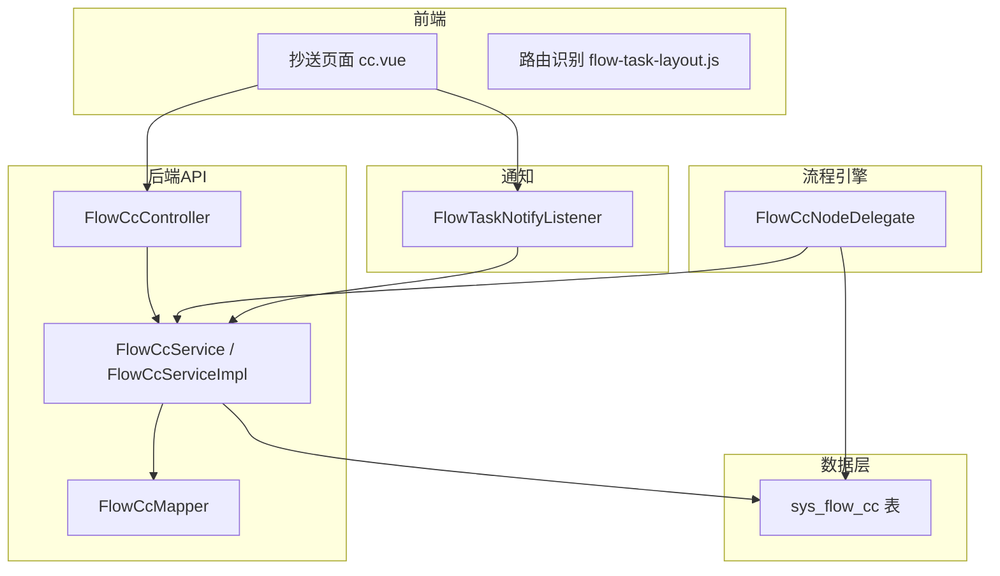
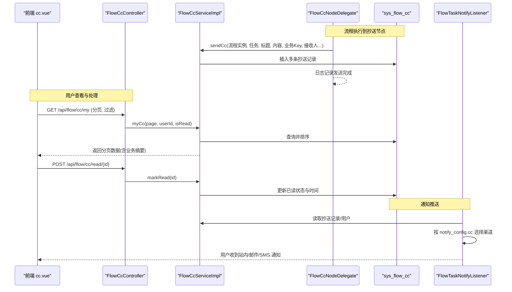
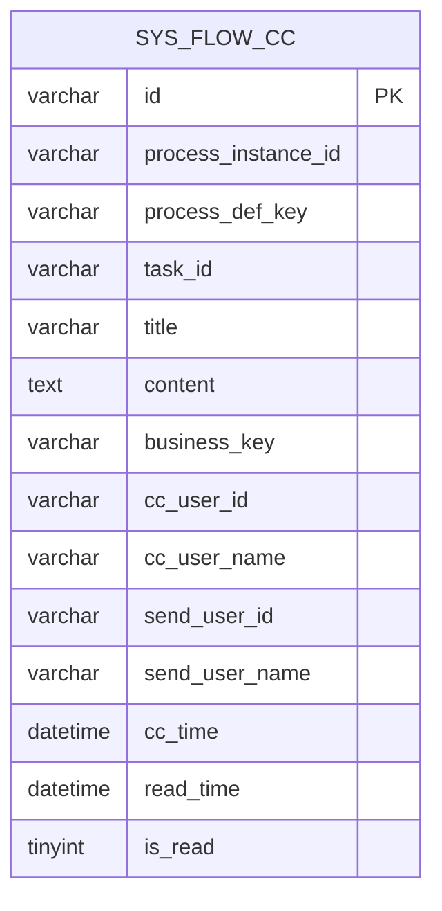
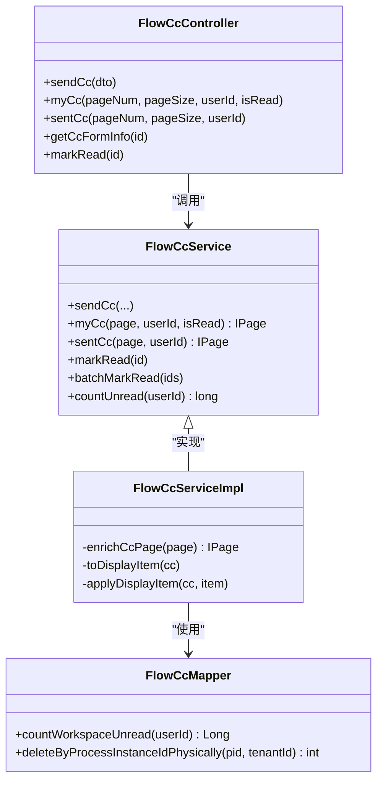
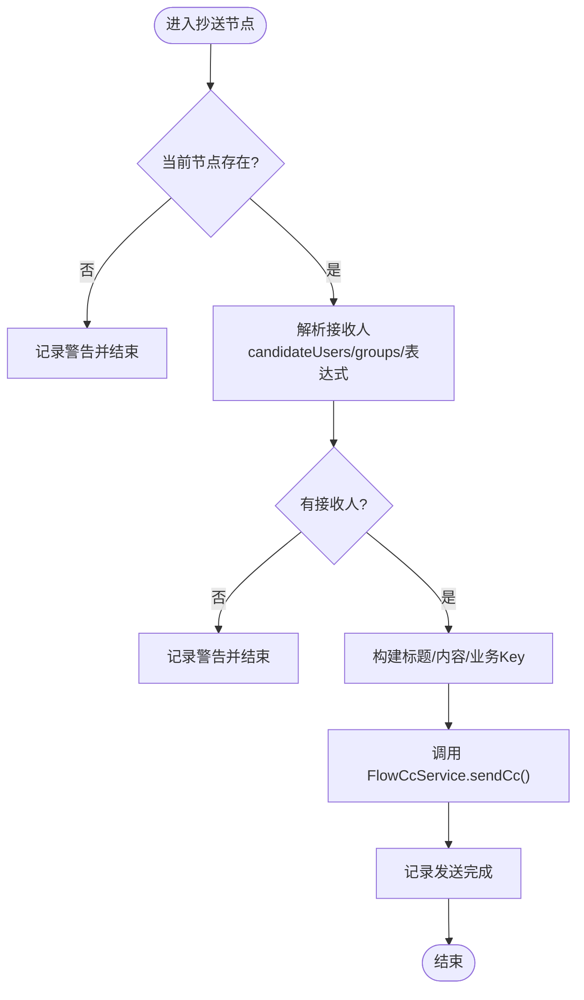
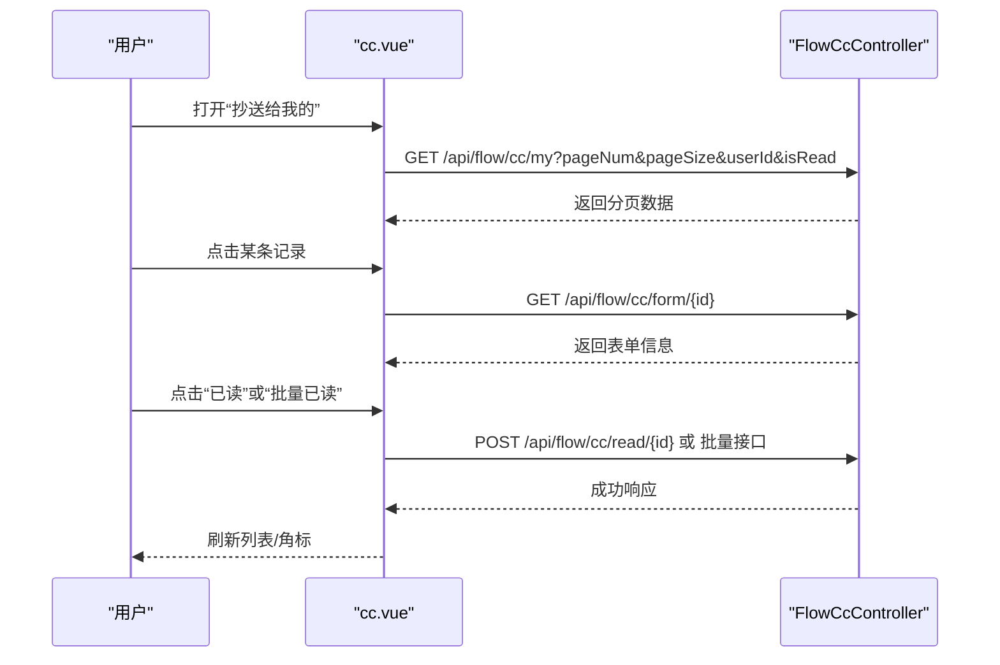
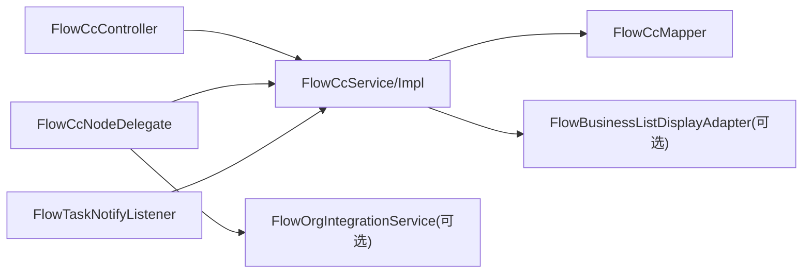

# 抄送任务管理

<cite>
**本文引用的文件**
- [FlowCcController.java](file://forge-server/forge-flow/forge-flow-server/src/main/java/com/mdframe/forge/flow/controller/FlowCcController.java)
- [FlowCcService.java](file://forge-server/forge-framework/forge-plugin-parent/forge-plugin-flow/src/main/java/com/mdframe/forge/starter/flow/service/FlowCcService.java)
- [FlowCcServiceImpl.java](file://forge-server/forge-framework/forge-plugin-parent/forge-plugin-flow/src/main/java/com/mdframe/forge/starter/flow/service/impl/FlowCcServiceImpl.java)
- [FlowCcNodeDelegate.java](file://forge-server/forge-framework/forge-plugin-parent/forge-plugin-flow/src/main/java/com/mdframe/forge/starter/flow/delegate/FlowCcNodeDelegate.java)
- [FlowCcMapper.java](file://forge-server/forge-framework/forge-plugin-parent/forge-plugin-flow/src/main/java/com/mdframe/forge/starter/flow/mapper/FlowCcMapper.java)
- [FlowCc.java](file://forge-server/forge-framework/forge-plugin-parent/forge-plugin-flow/src/main/java/com/mdframe/forge/starter/flow/entity/FlowCc.java)
- [flow_tables_v2.sql](file://forge-server/forge-framework/forge-plugin-parent/forge-plugin-flow/sql/flow_tables_v2.sql)
- [cc.vue](file://forge-admin-ui/src/views/flow/cc.vue)
- [workspace/cc.vue](file://forge-admin-ui/src/views/workspace/cc.vue)
- [flow-task-layout.js](file://forge-admin-ui/src/utils/flow-task-layout.js)
- [FlowTaskNotifyListener.java](file://forge-server/forge-framework/forge-plugin-parent/forge-plugin-flow/src/main/java/com/mdframe/forge/starter/flow/listener/FlowTaskNotifyListener.java)
</cite>

## 目录
1. [简介](#简介)
2. [项目结构](#项目结构)
3. [核心组件](#核心组件)
4. [架构总览](#架构总览)
5. [详细组件分析](#详细组件分析)
6. [依赖关系分析](#依赖关系分析)
7. [性能考虑](#性能考虑)
8. [故障排查指南](#故障排查指南)
9. [结论](#结论)
10. [附录](#附录)

## 简介
本文件面向 Forge Admin 的“抄送任务管理”能力，系统性说明抄送任务的接收、查看与处理闭环：包括抄送任务列表展示、任务内容查看、处理反馈（已读标记）、通知管理与工作流集成。文档同时覆盖业务场景、权限控制、消息通知、处理记录、处理规范、性能优化方案、用户体验设计与与流程引擎的集成方式，帮助读者快速理解并高效使用或扩展该功能。

## 项目结构
抄送任务管理由前后端协同实现：
- 后端提供 REST 接口与服务层逻辑，负责发送、查询、标记已读、统计未读等；
- 前端提供“抄送给我的/我发送的”双标签页视图，支持分页、筛选、批量操作与详情弹窗；
- 流程引擎通过自定义委托节点在流程执行时自动创建抄送记录；
- 通知系统根据流程模型的通知矩阵向抄送人推送消息。

**图表来源**
- [FlowCcController.java:25-104](file://forge-server/forge-flow/forge-flow-server/src/main/java/com/mdframe/forge/flow/controller/FlowCcController.java#L25-L104)
- [FlowCcServiceImpl.java:27-179](file://forge-server/forge-framework/forge-plugin-parent/forge-plugin-flow/src/main/java/com/mdframe/forge/starter/flow/service/impl/FlowCcServiceImpl.java#L27-L179)
- [FlowCcNodeDelegate.java:51-88](file://forge-server/forge-framework/forge-plugin-parent/forge-plugin-flow/src/main/java/com/mdframe/forge/starter/flow/delegate/FlowCcNodeDelegate.java#L51-L88)
- [FlowCcMapper.java:11-21](file://forge-server/forge-framework/forge-plugin-parent/forge-plugin-flow/src/main/java/com/mdframe/forge/starter/flow/mapper/FlowCcMapper.java#L11-L21)
- [flow_tables_v2.sql:112-130](file://forge-server/forge-framework/forge-plugin-parent/forge-plugin-flow/sql/flow_tables_v2.sql#L112-L130)
- [cc.vue:1-653](file://forge-admin-ui/src/views/flow/cc.vue#L1-L653)
- [flow-task-layout.js:1-5](file://forge-admin-ui/src/utils/flow-task-layout.js#L1-L5)
- [FlowTaskNotifyListener.java:758-799](file://forge-server/forge-framework/forge-plugin-parent/forge-plugin-flow/src/main/java/com/mdframe/forge/starter/flow/listener/FlowTaskNotifyListener.java#L758-L799)

**章节来源**
- [FlowCcController.java:25-104](file://forge-server/forge-flow/forge-flow-server/src/main/java/com/mdframe/forge/flow/controller/FlowCcController.java#L25-L104)
- [FlowCcServiceImpl.java:27-179](file://forge-server/forge-framework/forge-plugin-parent/forge-plugin-flow/src/main/java/com/mdframe/forge/starter/flow/service/impl/FlowCcServiceImpl.java#L27-L179)
- [FlowCcNodeDelegate.java:51-88](file://forge-server/forge-framework/forge-plugin-parent/forge-plugin-flow/src/main/java/com/mdframe/forge/starter/flow/delegate/FlowCcNodeDelegate.java#L51-L88)
- [flow_tables_v2.sql:112-130](file://forge-server/forge-framework/forge-plugin-parent/forge-plugin-flow/sql/flow_tables_v2.sql#L112-L130)
- [cc.vue:1-653](file://forge-admin-ui/src/views/flow/cc.vue#L1-L653)
- [flow-task-layout.js:1-5](file://forge-admin-ui/src/utils/flow-task-layout.js#L1-L5)
- [FlowTaskNotifyListener.java:758-799](file://forge-server/forge-framework/forge-plugin-parent/forge-plugin-flow/src/main/java/com/mdframe/forge/starter/flow/listener/FlowTaskNotifyListener.java#L758-L799)

## 核心组件
- 控制器层：提供发送抄送、我的抄送、我发送的、获取关联业务表单信息、标记已读、未读数量等接口。
- 服务层：封装发送、分页查询、已读标记、批量已读、未读计数等业务逻辑，并在列表查询时通过扩展点补齐业务摘要。
- 流程委托：BPMN 中的抄送节点执行时解析接收人、标题、内容并持久化抄送记录。
- 数据模型：基于 sys_flow_cc 表，包含流程实例、任务、标题、内容、业务键、抄送人/发送人、时间戳与已读状态。
- 通知监听：按流程模型的通知矩阵向抄送人推送 Web/邮件/SMS 等渠道消息。
- 前端页面：双标签页（抄送给我的/我发送的），支持搜索、筛选、分页、批量已读、全部已读、详情弹窗与业务表单只读预览。

**章节来源**
- [FlowCcController.java:36-104](file://forge-server/forge-flow/forge-flow-server/src/main/java/com/mdframe/forge/flow/controller/FlowCcController.java#L36-L104)
- [FlowCcService.java:15-73](file://forge-server/forge-framework/forge-plugin-parent/forge-plugin-flow/src/main/java/com/mdframe/forge/starter/flow/service/FlowCcService.java#L15-L73)
- [FlowCcServiceImpl.java:32-179](file://forge-server/forge-framework/forge-plugin-parent/forge-plugin-flow/src/main/java/com/mdframe/forge/starter/flow/service/impl/FlowCcServiceImpl.java#L32-L179)
- [FlowCcNodeDelegate.java:51-88](file://forge-server/forge-framework/forge-plugin-parent/forge-plugin-flow/src/main/java/com/mdframe/forge/starter/flow/delegate/FlowCcNodeDelegate.java#L51-L88)
- [FlowCc.java:8-124](file://forge-server/forge-framework/forge-plugin-parent/forge-plugin-flow/src/main/java/com/mdframe/forge/starter/flow/entity/FlowCc.java#L8-L124)
- [flow_tables_v2.sql:112-130](file://forge-server/forge-framework/forge-plugin-parent/forge-plugin-flow/sql/flow_tables_v2.sql#L112-L130)
- [cc.vue:1-653](file://forge-admin-ui/src/views/flow/cc.vue#L1-L653)
- [FlowTaskNotifyListener.java:758-799](file://forge-server/forge-framework/forge-plugin-parent/forge-plugin-flow/src/main/java/com/mdframe/forge/starter/flow/listener/FlowTaskNotifyListener.java#L758-L799)

## 架构总览
抄送任务的生命周期贯穿“流程执行 -> 记录生成 -> 用户查看 -> 处理反馈 -> 通知触达”。

**图表来源**
- [FlowCcNodeDelegate.java:51-88](file://forge-server/forge-framework/forge-plugin-parent/forge-plugin-flow/src/main/java/com/mdframe/forge/starter/flow/delegate/FlowCcNodeDelegate.java#L51-L88)
- [FlowCcServiceImpl.java:32-64](file://forge-server/forge-framework/forge-plugin-parent/forge-plugin-flow/src/main/java/com/mdframe/forge/starter/flow/service/impl/FlowCcServiceImpl.java#L32-L64)
- [FlowCcController.java:50-104](file://forge-server/forge-flow/forge-flow-server/src/main/java/com/mdframe/forge/flow/controller/FlowCcController.java#L50-L104)
- [FlowTaskNotifyListener.java:758-799](file://forge-server/forge-framework/forge-plugin-parent/forge-plugin-flow/src/main/java/com/mdframe/forge/starter/flow/listener/FlowTaskNotifyListener.java#L758-L799)

## 详细组件分析

### 数据模型与存储
- 实体 FlowCc 映射至 sys_flow_cc 表，字段涵盖流程实例、流程定义、来源任务、标题、内容、业务键、抄送人/发送人、抄送时间、阅读时间与是否已读。
- 数据库索引：按流程实例ID与抄送人ID建立索引，提升查询效率。
- 非持久化字段：processName、processDefinitionName、objectCode、recordId、businessObjectName、businessSummary 用于列表展示增强，由业务侧扩展点回填。

**图表来源**
- [FlowCc.java:8-124](file://forge-server/forge-framework/forge-plugin-parent/forge-plugin-flow/src/main/java/com/mdframe/forge/starter/flow/entity/FlowCc.java#L8-L124)
- [flow_tables_v2.sql:112-130](file://forge-server/forge-framework/forge-plugin-parent/forge-plugin-flow/sql/flow_tables_v2.sql#L112-L130)

**章节来源**
- [FlowCc.java:8-124](file://forge-server/forge-framework/forge-plugin-parent/forge-plugin-flow/src/main/java/com/mdframe/forge/starter/flow/entity/FlowCc.java#L8-L124)
- [flow_tables_v2.sql:112-130](file://forge-server/forge-framework/forge-plugin-parent/forge-plugin-flow/sql/flow_tables_v2.sql#L112-L130)

### 后端接口与服务
- 发送抄送：POST /api/flow/cc/send，校验发送人身份后调用服务层写入抄送记录。
- 我的抄送：GET /api/flow/cc/my，支持分页、按是否已读过滤。
- 我发送的：GET /api/flow/cc/sent，支持分页。
- 获取业务表单信息：GET /api/flow/cc/form/{id}，返回只读的业务表单渲染信息。
- 标记已读：POST /api/flow/cc/read/{id}，更新已读状态与阅读时间。
- 未读数量：接口暴露 countUnread 能力，供前端角标显示。

服务层关键行为：
- sendCc：循环为每个接收人生成一条抄送记录，设置默认未读与时间。
- myCc/sentCc：分页查询并按抄送时间倒序；通过扩展点 FlowBusinessListDisplayAdapter 补齐业务摘要与名称。
- markRead/batchMarkRead：原子更新已读状态与时间。
- countUnread：按用户统计未读数。

**图表来源**
- [FlowCcController.java:25-104](file://forge-server/forge-flow/forge-flow-server/src/main/java/com/mdframe/forge/flow/controller/FlowCcController.java#L25-L104)
- [FlowCcService.java:13-73](file://forge-server/forge-framework/forge-plugin-parent/forge-plugin-flow/src/main/java/com/mdframe/forge/starter/flow/service/FlowCcService.java#L13-L73)
- [FlowCcServiceImpl.java:27-179](file://forge-server/forge-framework/forge-plugin-parent/forge-plugin-flow/src/main/java/com/mdframe/forge/starter/flow/service/impl/FlowCcServiceImpl.java#L27-L179)
- [FlowCcMapper.java:11-21](file://forge-server/forge-framework/forge-plugin-parent/forge-plugin-flow/src/main/java/com/mdframe/forge/starter/flow/mapper/FlowCcMapper.java#L11-L21)

**章节来源**
- [FlowCcController.java:36-104](file://forge-server/forge-flow/forge-flow-server/src/main/java/com/mdframe/forge/flow/controller/FlowCcController.java#L36-L104)
- [FlowCcService.java:15-73](file://forge-server/forge-framework/forge-plugin-parent/forge-plugin-flow/src/main/java/com/mdframe/forge/starter/flow/service/FlowCcService.java#L15-L73)
- [FlowCcServiceImpl.java:32-179](file://forge-server/forge-framework/forge-plugin-parent/forge-plugin-flow/src/main/java/com/mdframe/forge/starter/flow/service/impl/FlowCcServiceImpl.java#L32-L179)
- [FlowCcMapper.java:11-21](file://forge-server/forge-framework/forge-plugin-parent/forge-plugin-flow/src/main/java/com/mdframe/forge/starter/flow/mapper/FlowCcMapper.java#L11-L21)

### 流程引擎集成（抄送节点）
- BPMN 中配置 serviceTask 且 type=cc，节点属性可配置 candidateUsers/candidateGroups、title/content 等。
- 执行时解析接收人（支持表达式、变量、用户组/角色/部门），计算标题与内容，调用服务层发送抄送。
- 若未配置接收人或当前节点为空，记录警告并安全退出。

**图表来源**
- [FlowCcNodeDelegate.java:51-88](file://forge-server/forge-framework/forge-plugin-parent/forge-plugin-flow/src/main/java/com/mdframe/forge/starter/flow/delegate/FlowCcNodeDelegate.java#L51-L88)
- [FlowCcNodeDelegate.java:90-211](file://forge-server/forge-framework/forge-plugin-parent/forge-plugin-flow/src/main/java/com/mdframe/forge/starter/flow/delegate/FlowCcNodeDelegate.java#L90-L211)
- [FlowCcNodeDelegate.java:213-233](file://forge-server/forge-framework/forge-plugin-parent/forge-plugin-flow/src/main/java/com/mdframe/forge/starter/flow/delegate/FlowCcNodeDelegate.java#L213-L233)

**章节来源**
- [FlowCcNodeDelegate.java:51-88](file://forge-server/forge-framework/forge-plugin-parent/forge-plugin-flow/src/main/java/com/mdframe/forge/starter/flow/delegate/FlowCcNodeDelegate.java#L51-L88)
- [FlowCcNodeDelegate.java:90-211](file://forge-server/forge-framework/forge-plugin-parent/forge-plugin-flow/src/main/java/com/mdframe/forge/starter/flow/delegate/FlowCcNodeDelegate.java#L90-L211)
- [FlowCcNodeDelegate.java:213-233](file://forge-server/forge-framework/forge-plugin-parent/forge-plugin-flow/src/main/java/com/mdframe/forge/starter/flow/delegate/FlowCcNodeDelegate.java#L213-L233)

### 前端交互与体验
- 双标签页：抄送给我的（支持未读角标、筛选、批量已读、全部已读）、我发送的。
- 列表项：显示标题、内容摘要、阅读状态、发送人/抄送人与时间；点击行打开详情弹窗。
- 详情弹窗：展示基本信息、内容与只读业务表单（外部表单或内置表单）。
- 路由识别：将 /flow/cc 纳入流程任务列表路径集合，复用统一布局与样式。

**图表来源**
- [cc.vue:1-653](file://forge-admin-ui/src/views/flow/cc.vue#L1-L653)
- [FlowCcController.java:50-104](file://forge-server/forge-flow/forge-flow-server/src/main/java/com/mdframe/forge/flow/controller/FlowCcController.java#L50-L104)

**章节来源**
- [cc.vue:1-653](file://forge-admin-ui/src/views/flow/cc.vue#L1-L653)
- [flow-task-layout.js:1-5](file://forge-admin-ui/src/utils/flow-task-layout.js#L1-L5)

### 通知管理
- 流程模型可配置通知矩阵，针对 todo/result/cc 事件选择渠道（Web/邮件/SMS）。
- 对于 cc 事件，系统会按配置的模板与参数向抄送人推送消息，避免重复发送。
- 前端设计器对 cc 事件屏蔽 SMS 渠道（依据策略），并提供模板选择与默认模板回退。

**章节来源**
- [FlowTaskNotifyListener.java:758-799](file://forge-server/forge-framework/forge-plugin-parent/forge-plugin-flow/src/main/java/com/mdframe/forge/starter/flow/listener/FlowTaskNotifyListener.java#L758-L799)

## 依赖关系分析
- 控制器依赖服务层，服务层依赖 MyBatis-Plus 的 ServiceImpl 与 Mapper；
- 流程委托依赖服务层与组织集成服务（可选）以解析用户与姓名；
- 列表查询通过扩展点 FlowBusinessListDisplayAdapter 注入业务摘要，降低耦合；
- 通知监听依赖消息服务与流程模型配置，按事件矩阵推送。

**图表来源**
- [FlowCcController.java:25-104](file://forge-server/forge-flow/forge-flow-server/src/main/java/com/mdframe/forge/flow/controller/FlowCcController.java#L25-L104)
- [FlowCcServiceImpl.java:27-179](file://forge-server/forge-framework/forge-plugin-parent/forge-plugin-flow/src/main/java/com/mdframe/forge/starter/flow/service/impl/FlowCcServiceImpl.java#L27-L179)
- [FlowCcNodeDelegate.java:37-49](file://forge-server/forge-framework/forge-plugin-parent/forge-plugin-flow/src/main/java/com/mdframe/forge/starter/flow/delegate/FlowCcNodeDelegate.java#L37-L49)
- [FlowTaskNotifyListener.java:758-799](file://forge-server/forge-framework/forge-plugin-parent/forge-plugin-flow/src/main/java/com/mdframe/forge/starter/flow/listener/FlowTaskNotifyListener.java#L758-L799)

**章节来源**
- [FlowCcServiceImpl.java:27-179](file://forge-server/forge-framework/forge-plugin-parent/forge-plugin-flow/src/main/java/com/mdframe/forge/starter/flow/service/impl/FlowCcServiceImpl.java#L27-L179)
- [FlowCcNodeDelegate.java:37-49](file://forge-server/forge-framework/forge-plugin-parent/forge-plugin-flow/src/main/java/com/mdframe/forge/starter/flow/delegate/FlowCcNodeDelegate.java#L37-L49)

## 性能考虑
- 列表查询：
  - 使用分页与排序（按抄送时间倒序），减少首屏数据量；
  - 数据库层面已有 idx_cc_user_id 与 idx_process_instance_id 索引，建议查询条件尽量命中这些列；
  - 列表增强通过扩展点异步补齐，异常被捕获不影响基础数据返回。
- 写操作：
  - 发送抄送为逐条插入，单事务内批量写入；如并发较高，可评估分批提交或批量插入优化；
  - 标记已读/批量已读采用条件更新，避免全表扫描。
- 通知：
  - 通知发送去重（按 bizKey+channel），避免重复推送；
  - 模板与渠道配置集中管理，减少运行时计算开销。
- 前端：
  - 详情页按需加载业务表单，避免首屏阻塞；
  - 未读角标与批量操作减少不必要的全量刷新。

[本节为通用性能建议，不直接分析具体代码]

## 故障排查指南
- 抄送节点未生效：
  - 检查 BPMN 节点是否配置了 candidateUsers/candidateGroups 或表达式；
  - 查看日志中“未配置接收人/表达式解析失败”的警告信息。
- 列表无数据：
  - 确认 userId 是否正确传递；
  - 检查数据库索引与查询条件是否命中；
  - 若启用业务摘要增强，确认扩展点是否可用。
- 标记已读无效：
  - 确认请求路径与 ID 正确；
  - 检查事务与更新语句是否执行成功。
- 通知未送达：
  - 检查流程模型通知矩阵中 cc 事件是否勾选对应渠道；
  - 核对模板是否存在且启用；
  - 查看消息服务是否返回成功。

**章节来源**
- [FlowCcNodeDelegate.java:51-88](file://forge-server/forge-framework/forge-plugin-parent/forge-plugin-flow/src/main/java/com/mdframe/forge/starter/flow/delegate/FlowCcNodeDelegate.java#L51-L88)
- [FlowCcNodeDelegate.java:130-149](file://forge-server/forge-framework/forge-plugin-parent/forge-plugin-flow/src/main/java/com/mdframe/forge/starter/flow/delegate/FlowCcNodeDelegate.java#L130-L149)
- [FlowCcServiceImpl.java:83-100](file://forge-server/forge-framework/forge-plugin-parent/forge-plugin-flow/src/main/java/com/mdframe/forge/starter/flow/service/impl/FlowCcServiceImpl.java#L83-L100)
- [FlowTaskNotifyListener.java:758-799](file://forge-server/forge-framework/forge-plugin-parent/forge-plugin-flow/src/main/java/com/mdframe/forge/starter/flow/listener/FlowTaskNotifyListener.java#L758-L799)

## 结论
抄送任务管理以“流程驱动、记录可查、处理便捷、通知可达”为核心目标，通过清晰的职责分层与可扩展的增强机制，既满足日常协作需求，又便于在不同业务场景中定制展示与通知策略。结合合理的索引与分页、异步增强与去重通知，整体具备良好性能与可维护性。

[本节为总结性内容，不直接分析具体代码]

## 附录

### 业务场景与处理规范
- 典型场景：审批通过后向相关干系人同步结果；跨部门协作时共享关键信息；合规审计要求留痕知悉。
- 处理规范：
  - 抄送为“知悉型”任务，无需审批动作，但需保留已读记录；
  - 建议在流程设计中明确标题与内容模板，确保可读性与一致性；
  - 对高价值抄送，可在通知矩阵中开启多通道提醒。

[本节为概念性内容，不直接分析具体代码]

### 权限控制
- 接口均受会话身份保护，发送与查询均基于当前登录用户上下文；
- 列表仅返回当前用户的抄送记录，保障数据隔离；
- 如需管理员视角，可通过额外接口或角色权限扩展。

**章节来源**
- [FlowCcController.java:36-77](file://forge-server/forge-flow/forge-flow-server/src/main/java/com/mdframe/forge/flow/controller/FlowCcController.java#L36-L77)

### 与工作台/导航集成
- 路由识别：/flow/cc 被识别为流程任务列表路径，复用统一布局；
- 工作台入口：workspace/cc.vue 作为独立入口承载抄送页面。

**章节来源**
- [flow-task-layout.js:1-5](file://forge-admin-ui/src/utils/flow-task-layout.js#L1-L5)
- [workspace/cc.vue:1-8](file://forge-admin-ui/src/views/workspace/cc.vue#L1-L8)