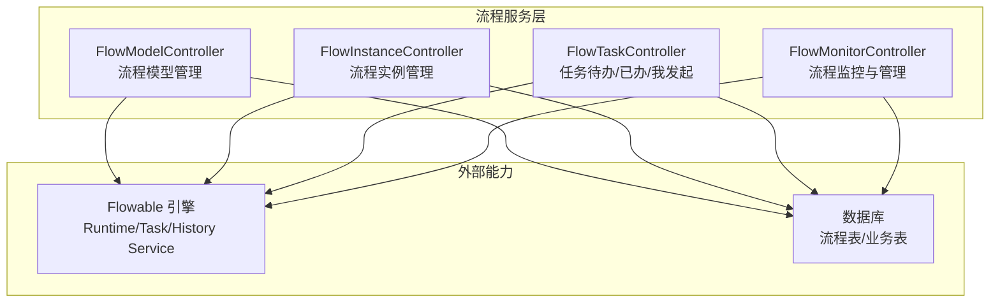
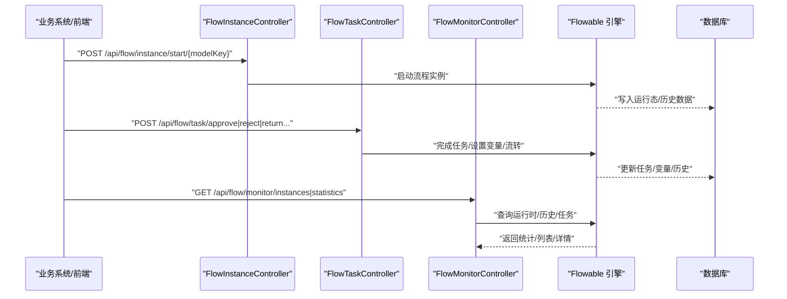
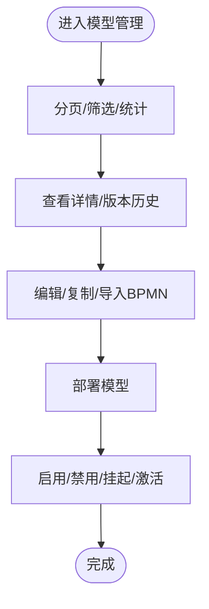
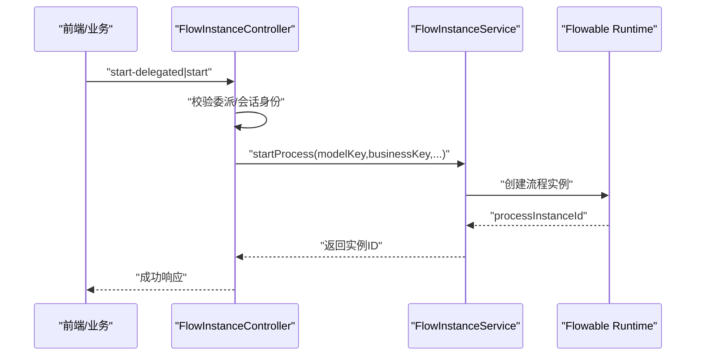
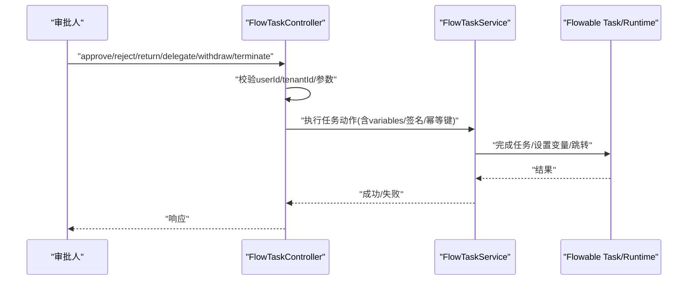
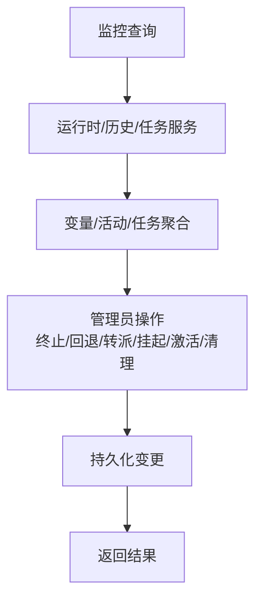
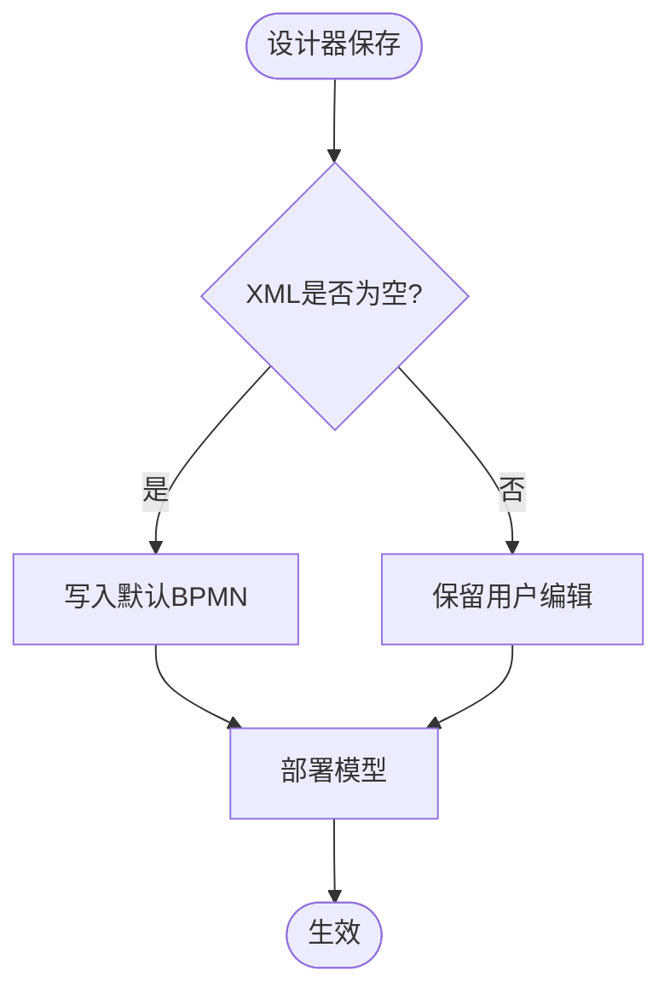
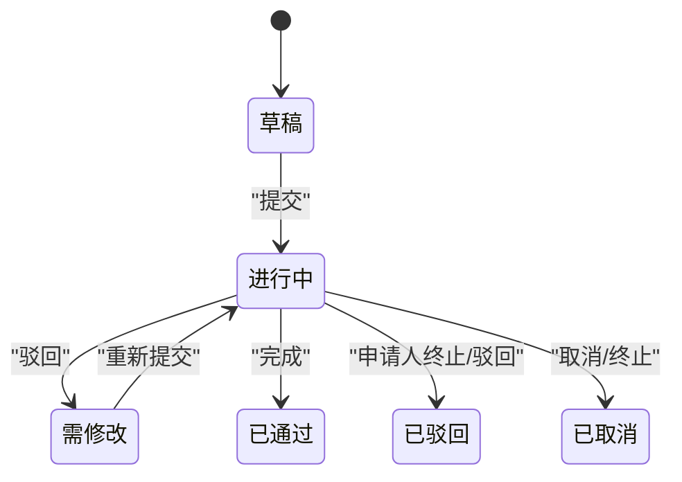
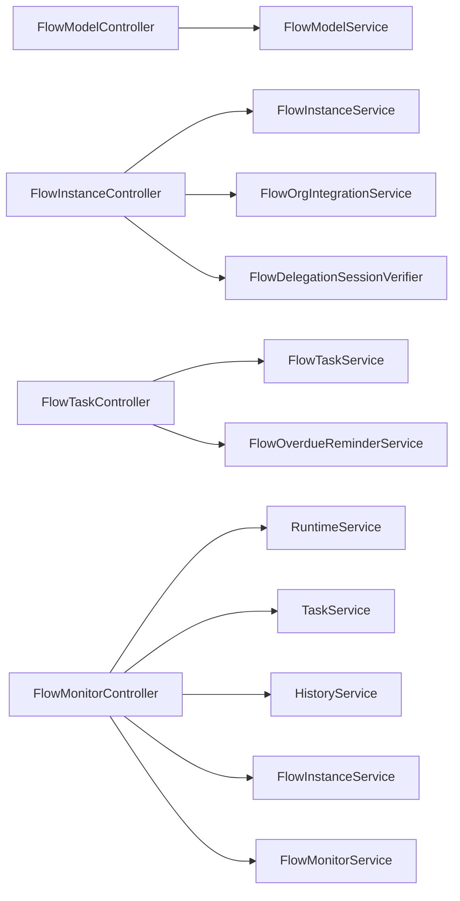

# 工作流引擎

<cite>
**本文引用的文件**
- [SKILL.md](file://.agents/skills/forge-business-flow-development/SKILL.md)
- [bpmn-configuration.md](file://.agents/skills/forge-business-flow-development/references/bpmn-configuration.md)
- [code-first-workflow.md](file://.agents/skills/forge-business-flow-development/references/code-first-workflow.md)
- [lowcode-workflow.md](file://.agents/skills/forge-business-flow-development/references/lowcode-workflow.md)
- [purchase-order-reference.md](file://.agents/skills/forge-business-flow-development/references/purchase-order-reference.md)
- [status-and-callbacks.md](file://.agents/skills/forge-business-flow-development/references/status-and-callbacks.md)
- [FlowModelController.java](file://forge-server/forge-flow/forge-flow-server/src/main/java/com/mdframe/forge/flow/controller/FlowModelController.java)
- [FlowTaskController.java](file://forge-server/forge-flow/forge-flow-server/src/main/java/com/mdframe/forge/flow/controller/FlowTaskController.java)
- [FlowInstanceController.java](file://forge-server/forge-flow/forge-flow-server/src/main/java/com/mdframe/forge/flow/controller/FlowInstanceController.java)
- [FlowMonitorController.java](file://forge-server/forge-flow/forge-flow-server/src/main/java/com/mdframe/forge/flow/controller/FlowMonitorController.java)
</cite>

## 目录
1. [简介](#简介)
2. [项目结构](#项目结构)
3. [核心组件](#核心组件)
4. [架构总览](#架构总览)
5. [详细组件分析](#详细组件分析)
6. [依赖关系分析](#依赖关系分析)
7. [性能考虑](#性能考虑)
8. [故障排查指南](#故障排查指南)
9. [结论](#结论)
10. [附录](#附录)

## 简介
本文件为 Forge Admin 工作流引擎的综合文档，面向流程设计者、业务开发者与运维人员。内容覆盖 BPMN 流程设计器使用、流程审批管理、任务待办处理、流程监控追踪、流程模板管理等核心能力；说明 Flowable 引擎集成方式、流程定义管理、任务调度机制、状态流转控制；并提供流程编排指南、审批流配置方法、监控分析方法、性能调优与故障排查策略。

## 项目结构
Forge 的工作流能力集中在 forge-flow 模块中，后端以控制器为入口，分别负责模型管理、实例启动、任务操作与监控治理；前端通过统一 API 调用完成设计、审批与监控。

**图表来源**
- [FlowModelController.java:20-232](file://forge-server/forge-flow/forge-flow-server/src/main/java/com/mdframe/forge/flow/controller/FlowModelController.java#L20-L232)
- [FlowInstanceController.java:27-239](file://forge-server/forge-flow/forge-flow-server/src/main/java/com/mdframe/forge/flow/controller/FlowInstanceController.java#L27-L239)
- [FlowTaskController.java:32-372](file://forge-server/forge-flow/forge-flow-server/src/main/java/com/mdframe/forge/flow/controller/FlowTaskController.java#L32-L372)
- [FlowMonitorController.java:31-402](file://forge-server/forge-flow/forge-flow-server/src/main/java/com/mdframe/forge/flow/controller/FlowMonitorController.java#L31-L402)

**章节来源**
- [FlowModelController.java:20-232](file://forge-server/forge-flow/forge-flow-server/src/main/java/com/mdframe/forge/flow/controller/FlowModelController.java#L20-L232)
- [FlowInstanceController.java:27-239](file://forge-server/forge-flow/forge-flow-server/src/main/java/com/mdframe/forge/flow/controller/FlowInstanceController.java#L27-L239)
- [FlowTaskController.java:32-372](file://forge-server/forge-flow/forge-flow-server/src/main/java/com/mdframe/forge/flow/controller/FlowTaskController.java#L32-L372)
- [FlowMonitorController.java:31-402](file://forge-server/forge-flow/forge-flow-server/src/main/java/com/mdframe/forge/flow/controller/FlowMonitorController.java#L31-L402)

## 核心组件
- 流程模型管理：提供模型的创建、导入导出、部署、启用/禁用、版本历史等能力，支撑流程设计器与发布流程。
- 流程实例管理：封装流程启动、终止、变量读写、分页查询与详情获取，支持普通与委托场景的受控启动。
- 任务待办处理：提供我的待办/已办/我发起、候选任务、签收、审批、驳回、退回、转办、改派、撤回、终结、催办、流程图与表单上下文等接口。
- 流程监控追踪：提供统计、实例列表、趋势分布、活动节点、当前任务、变量查看、管理员终止/回退/转派/挂起/激活/清理等操作。

**章节来源**
- [FlowModelController.java:33-232](file://forge-server/forge-flow/forge-flow-server/src/main/java/com/mdframe/forge/flow/controller/FlowModelController.java#L33-L232)
- [FlowInstanceController.java:44-239](file://forge-server/forge-flow/forge-flow-server/src/main/java/com/mdframe/forge/flow/controller/FlowInstanceController.java#L44-L239)
- [FlowTaskController.java:46-372](file://forge-server/forge-flow/forge-flow-server/src/main/java/com/mdframe/forge/flow/controller/FlowTaskController.java#L46-L372)
- [FlowMonitorController.java:48-402](file://forge-server/forge-flow/forge-flow-server/src/main/java/com/mdframe/forge/flow/controller/FlowMonitorController.java#L48-L402)

## 架构总览
下图展示从业务侧到 Flowable 引擎的关键交互路径：业务通过控制器发起或操作流程，控制器调用服务层与 Flowable 的 Runtime/Task/History 服务，最终落库并驱动状态流转。

**图表来源**
- [FlowInstanceController.java:44-145](file://forge-server/forge-flow/forge-flow-server/src/main/java/com/mdframe/forge/flow/controller/FlowInstanceController.java#L44-L145)
- [FlowTaskController.java:123-270](file://forge-server/forge-flow/forge-flow-server/src/main/java/com/mdframe/forge/flow/controller/FlowTaskController.java#L123-L270)
- [FlowMonitorController.java:48-110](file://forge-server/forge-flow/forge-flow-server/src/main/java/com/mdframe/forge/flow/controller/FlowMonitorController.java#L48-L110)

## 详细组件分析

### 流程模型管理（FlowModelController）
- 功能要点
  - 分页查询、启用列表、状态统计、详情与按 Key 查询。
  - 创建、更新、删除、复制、导入/导出 BPMN XML。
  - 部署、挂起/激活、启用/禁用模型。
  - 获取模型版本历史与启动配置。
- 关键路径
  - 导入/导出用于与设计器联动；部署后供实例启动使用。
  - 启用/禁用控制新实例是否可基于该模型启动。

**图表来源**
- [FlowModelController.java:33-232](file://forge-server/forge-flow/forge-flow-server/src/main/java/com/mdframe/forge/flow/controller/FlowModelController.java#L33-L232)

**章节来源**
- [FlowModelController.java:33-232](file://forge-server/forge-flow/forge-flow-server/src/main/java/com/mdframe/forge/flow/controller/FlowModelController.java#L33-L232)

### 流程实例管理（FlowInstanceController）
- 功能要点
  - 普通启动与受委托启动（含高风险审批专用入口）。
  - 终止、删除、变量读取与更新。
  - 分页查询与按实例ID详情查询。
- 安全与身份
  - 受委托入口要求可信委派会话，用户/租户/组织信息从会话解析，不接受请求体中的代办身份。
  - 未提供 businessKey/businessType/title 时采用默认值生成。

**图表来源**
- [FlowInstanceController.java:44-145](file://forge-server/forge-flow/forge-flow-server/src/main/java/com/mdframe/forge/flow/controller/FlowInstanceController.java#L44-L145)

**章节来源**
- [FlowInstanceController.java:44-239](file://forge-server/forge-flow/forge-flow-server/src/main/java/com/mdframe/forge/flow/controller/FlowInstanceController.java#L44-L239)

### 任务待办处理（FlowTaskController）
- 功能要点
  - 我的待办/已办/我发起、候选任务、签收。
  - 审批通过、驳回、驳回至发起人修改路径。
  - 退回上一节点、转办、改派、撤回、终结。
  - 流程图与流程图详情（高亮当前节点）、任务表单上下文、流程关联表单上下文。
  - 催办与逾期提醒扫描。
- 多租户与幂等
  - 任务操作强制校验租户一致性，拒绝跨租户操作。
  - 支持幂等键与请求摘要，避免重复提交。

**图表来源**
- [FlowTaskController.java:123-270](file://forge-server/forge-flow/forge-flow-server/src/main/java/com/mdframe/forge/flow/controller/FlowTaskController.java#L123-L270)

**章节来源**
- [FlowTaskController.java:46-372](file://forge-server/forge-flow/forge-flow-server/src/main/java/com/mdframe/forge/flow/controller/FlowTaskController.java#L46-L372)

### 流程监控追踪（FlowMonitorController）
- 功能要点
  - 统计、实例列表、趋势与分布。
  - 实例详情、变量查看、活动节点与当前任务。
  - 管理员终止、回退、转派、挂起/激活、批量清理。
- 数据来源
  - 运行时服务、任务服务、历史服务组合查询，兼顾运行中与已完成流程。

**图表来源**
- [FlowMonitorController.java:48-402](file://forge-server/forge-flow/forge-flow-server/src/main/java/com/mdframe/forge/flow/controller/FlowMonitorController.java#L48-L402)

**章节来源**
- [FlowMonitorController.java:48-402](file://forge-server/forge-flow/forge-flow-server/src/main/java/com/mdframe/forge/flow/controller/FlowMonitorController.java#L48-L402)

### BPMN 设计与节点属性
- 运行时优先级：BPMN 节点 formKey/formUrl/formJson/formFieldPermissions > 兼容回退 nodeForms > 流程默认表单。
- 用户任务属性：assignee 表达式、表单绑定、字段权限矩阵、允许的操作按钮（审批/驳回/转交/退回/终止）、是否必填评论。
- 条件分支与网关：在网关处设置默认流向，不在默认连线附加条件表达式；条件分支使用表达式判断。
- 并行会签：使用 multiInstanceLoopCharacteristics 配置集合与完成条件。
- 初始化规则：模型不存在或 XML 为空时写入默认 BPMN 并部署；若已有非空 XML，则保留用户编辑的配置，不覆盖。

**图表来源**
- [bpmn-configuration.md:82-90](file://.agents/skills/forge-business-flow-development/references/bpmn-configuration.md#L82-L90)

**章节来源**
- [bpmn-configuration.md:1-106](file://.agents/skills/forge-business-flow-development/references/bpmn-configuration.md#L1-106)

### 代码优先与低代码两种实现路径
- 代码优先：适用于复杂业务、自定义表/表单/状态修复；需维护实体、Mapper、Service、Provider、FlowDefinition、BPMN 构建脚本、Flyway 脚本与 App Center 种子数据。
- 低代码：适用于动态 CRUD 对象；通过对象运行时页面与流程绑定配置，使用平台内置 START_FLOW 路径，节点表单在真实流程设计器中配置。

**章节来源**
- [code-first-workflow.md:1-95](file://.agents/skills/forge-business-flow-development/references/code-first-workflow.md#L1-L95)
- [lowcode-workflow.md:1-43](file://.agents/skills/forge-business-flow-development/references/lowcode-workflow.md#L1-L43)

### 采购订单参考示例
- 对象编码、模型 Key、Provider Key、表单 Key、业务 Key 格式约定。
- 节点 Key 与变量约定：审批结果、布尔标志、会签用户列表等。
- 状态行为与漂移修复：TASK_CREATED 回调修复、任务保存前修复、详情页查询修复。
- 表单集成：BusinessCodeFormProvider 注册表单资产、上下文构建与保存。
- BPMN 模式：assignee 表达式、表单绑定、字段权限、网关条件、并行会签完成条件。

**章节来源**
- [purchase-order-reference.md:1-118](file://.agents/skills/forge-business-flow-development/references/purchase-order-reference.md#L1-L118)

### 状态机与回调契约
- 推荐状态集：草稿、进行中、需修改、已通过、已驳回、已取消。
- 业务表字段：至少包含状态、业务 Key、流程实例 ID。
- 回调契约：任务创建、任务完成、流程完成、驳回、取消等事件需幂等更新业务状态。
- 修复规则：在回调、任务保存、查询三处进行状态修复，保证一致性与可恢复性。
- 变量安全：写审批变量后再完成任务；终端事件合并运行时与历史变量；保持 ID 为字符串。

**图表来源**
- [status-and-callbacks.md:7-18](file://.agents/skills/forge-business-flow-development/references/status-and-callbacks.md#L7-L18)

**章节来源**
- [status-and-callbacks.md:1-92](file://.agents/skills/forge-business-flow-development/references/status-and-callbacks.md#L1-L92)

## 依赖关系分析
- 控制器依赖
  - FlowModelController 依赖 FlowModelService（由 starter 提供），对外暴露模型生命周期管理。
  - FlowInstanceController 依赖 FlowInstanceService、FlowMonitorService、FlowOrgIntegrationService 及委派会话校验器。
  - FlowTaskController 依赖 FlowTaskService、FlowOverdueReminderService，并通过 FlowSessionIdentity 解析可信用户。
  - FlowMonitorController 直接注入 Flowable 的 RuntimeService、TaskService、HistoryService，以及 FlowInstanceService、FlowMonitorService。
- 外部依赖
  - Flowable 引擎：流程运行、任务处理、历史记录。
  - 数据库：流程表与业务表，承载实例、任务、变量与业务状态。

**图表来源**
- [FlowModelController.java:20-232](file://forge-server/forge-flow/forge-flow-server/src/main/java/com/mdframe/forge/flow/controller/FlowModelController.java#L20-L232)
- [FlowInstanceController.java:27-239](file://forge-server/forge-flow/forge-flow-server/src/main/java/com/mdframe/forge/flow/controller/FlowInstanceController.java#L27-L239)
- [FlowTaskController.java:32-372](file://forge-server/forge-flow/forge-flow-server/src/main/java/com/mdframe/forge/flow/controller/FlowTaskController.java#L32-L372)
- [FlowMonitorController.java:31-402](file://forge-server/forge-flow/forge-flow-server/src/main/java/com/mdframe/forge/flow/controller/FlowMonitorController.java#L31-L402)

**章节来源**
- [FlowModelController.java:20-232](file://forge-server/forge-flow/forge-flow-server/src/main/java/com/mdframe/forge/flow/controller/FlowModelController.java#L20-L232)
- [FlowInstanceController.java:27-239](file://forge-server/forge-flow/forge-flow-server/src/main/java/com/mdframe/forge/flow/controller/FlowInstanceController.java#L27-L239)
- [FlowTaskController.java:32-372](file://forge-server/forge-flow/forge-flow-server/src/main/java/com/mdframe/forge/flow/controller/FlowTaskController.java#L32-L372)
- [FlowMonitorController.java:31-402](file://forge-server/forge-flow/forge-flow-server/src/main/java/com/mdframe/forge/flow/controller/FlowMonitorController.java#L31-L402)

## 性能考虑
- 分页与筛选：所有列表接口均支持分页与多维度筛选，建议在前端合理设置 pageSize 与索引字段。
- 只读场景优化：已办/历史/抄送等只读场景通过“流程关联表单上下文”接口获取，避免冗余加载。
- 变量读取：监控变量接口对运行中与已完成流程分别走运行时与历史服务，减少不必要的全量扫描。
- 任务列表：待办/已办/我发起/候选任务均通过服务层分页查询，注意按 userId、title、category、status 等常用维度建立索引。
- 流程图渲染：提供图片与结构化信息两种返回，按需选择以减少传输开销。
- 幂等与重试：任务操作支持幂等键与请求摘要，避免重复提交导致的额外计算与锁竞争。

[本节为通用指导，无需特定文件引用]

## 故障排查指南
- 常见失败点
  - BPMN 引用了未在开始变量映射中的变量，导致赋值失败。
  - BPMN XML 中存在重复连线，造成重复任务。
  - formUrl/formKey 存在首尾空格导致匹配失败。
  - 仅在种子数据中配置 nodeForms，但已部署 BPMN 节点属性陈旧。
  - 设计器保存将网关默认连线上误加条件表达式。
- 状态不一致
  - 仅依赖 PROCESS_COMPLETED 变量不足以维护最终状态，需在任务创建/完成回调中同步业务状态。
  - 通过 TASK_CREATED 回调修复“需修改/进行中”的状态漂移。
- 租户与安全
  - 任务操作必须校验租户一致性，拒绝跨租户操作。
  - 受委托启动必须通过可信委派会话验证，禁止从请求体传入代办身份。
- 调试建议
  - 使用监控接口的“变量查看”“活动节点”“当前任务”定位卡点。
  - 结合流程图详情与历史时间轴核对流转路径。
  - 检查 BPMN 节点表单与字段权限是否与业务表字段一致。

**章节来源**
- [bpmn-configuration.md:99-106](file://.agents/skills/forge-business-flow-development/references/bpmn-configuration.md#L99-L106)
- [status-and-callbacks.md:62-92](file://.agents/skills/forge-business-flow-development/references/status-and-callbacks.md#L62-L92)
- [FlowTaskController.java:167-176](file://forge-server/forge-flow/forge-flow-server/src/main/java/com/mdframe/forge/flow/controller/FlowTaskController.java#L167-L176)
- [FlowInstanceController.java:54-77](file://forge-server/forge-flow/forge-flow-server/src/main/java/com/mdframe/forge/flow/controller/FlowInstanceController.java#L54-L77)

## 结论
Forge Admin 工作流引擎以 Flowable 为核心，围绕模型管理、实例启动、任务操作与监控治理形成完整闭环。通过 BPMN 节点级表单与权限配置、严格的租户与委派安全控制、完善的状态修复与回调契约，既满足复杂业务的定制需求，也支持低代码快速落地。配合监控与诊断能力，可实现端到端的流程编排、审批与运维保障。

[本节为总结性内容，无需特定文件引用]

## 附录
- 流程编排指南
  - 明确业务对象编码、模型 Key、Provider Key、表单 Key、业务 Key 格式。
  - 在 BPMN 中配置 assignee 表达式、表单绑定、字段权限、允许操作与条件分支。
  - 使用并行会签与完成条件实现多角色协同。
  - 初始化时遵循“无模型建默认、空 XML 写默认、非空 XML 不覆盖”的规则。
- 审批流配置
  - 节点表单优先来自 BPMN 节点属性；nodeForms 仅作兼容回退。
  - 网关默认流向不要附加条件表达式；条件分支使用表达式判断。
- 监控分析方法
  - 使用统计、趋势、分布接口观察瓶颈与热点。
  - 通过变量、活动节点、当前任务定位卡点。
  - 管理员可终止、回退、转派、挂起/激活、清理数据。
- 性能调优
  - 合理使用分页与筛选；只读场景使用关联表单上下文。
  - 利用幂等键与请求摘要避免重复提交。
- 故障排查
  - 对照 BPMN 变量映射与表单字段；检查租户与安全校验；利用监控接口定位问题。

[本节为补充说明，无需特定文件引用]