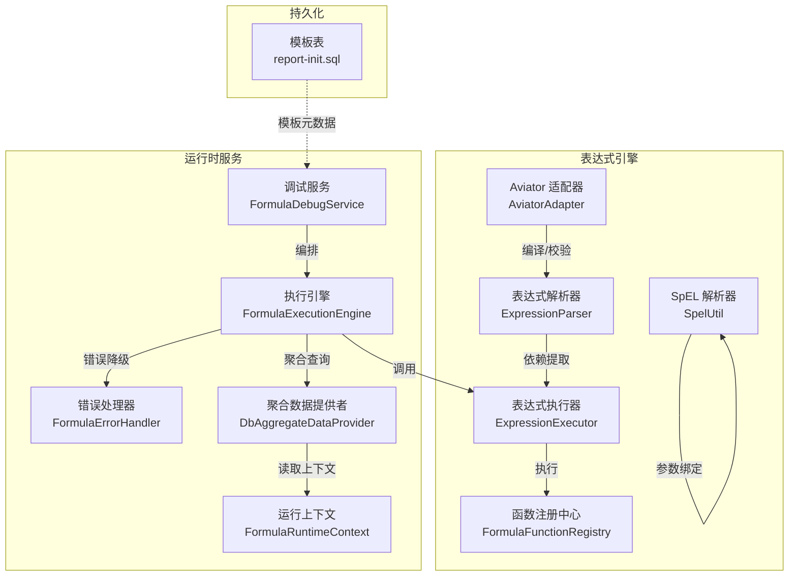
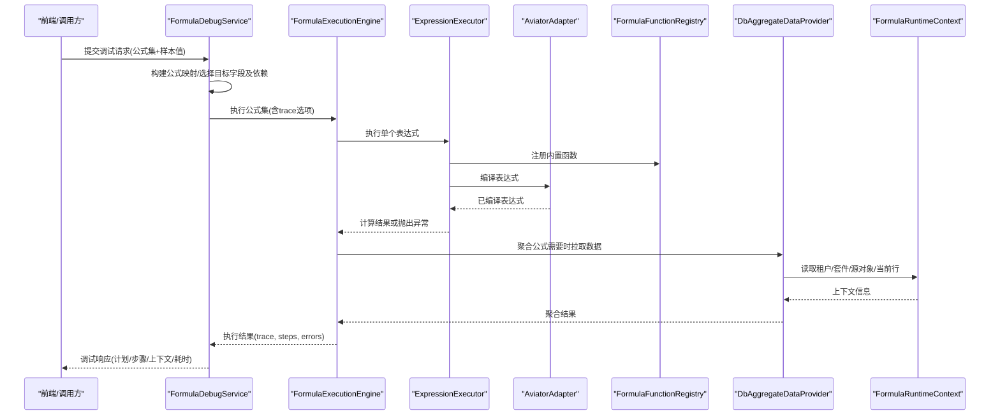
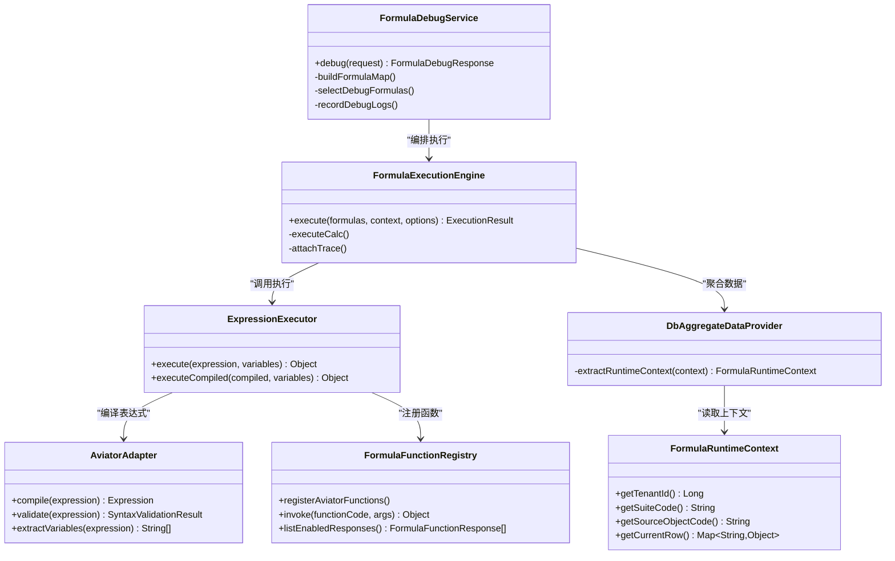

# SpEL表达式模板

<cite>
**本文引用的文件**
- [SpelUtil.java](file://forge-server/forge-framework/forge-starter-parent/forge-starter-idempotent/src/main/java/com/mdframe/forge/starter/idempotent/util/SpelUtil.java)
- [tech-spel-expression.md](file://code-copilot/knowledge/tech-spel-expression.md)
- [AviatorAdapter.java](file://forge-server/forge-framework/forge-plugin-parent/forge-plugin-generator/src/main/java/com/mdframe/forge/plugin/generator/domain/formula/AviatorAdapter.java)
- [ExpressionParser.java](file://forge-server/forge-framework/forge-plugin-parent/forge-plugin-generator/src/main/java/com/mdframe/forge/plugin/generator/domain/formula/ExpressionParser.java)
- [ExpressionExecutor.java](file://forge-server/forge-framework/forge-plugin-parent/forge-plugin-generator/src/main/java/com/mdframe/forge/plugin/generator/domain/formula/ExpressionExecutor.java)
- [FormulaFunctionRegistry.java](file://forge-server/forge-framework/forge-plugin-parent/forge-plugin-generator/src/main/java/com/mdframe/forge/plugin/generator/service/formula/FormulaFunctionRegistry.java)
- [FormulaDebugService.java](file://forge-server/forge-framework/forge-plugin-parent/forge-plugin-generator/src/main/java/com/mdframe/forge/plugin/generator/service/formula/FormulaDebugService.java)
- [FormulaExecutionEngine.java](file://forge-server/forge-framework/forge-plugin-parent/forge-plugin-generator/src/main/java/com/mdframe/forge/plugin/generator/service/formula/FormulaExecutionEngine.java)
- [FormulaErrorHandler.java](file://forge-server/forge-framework/forge-plugin-parent/forge-plugin-generator/src/main/java/com/mdframe/forge/plugin/generator/domain/formula/FormulaErrorHandler.java)
- [FormulaRuntimeContext.java](file://forge-server/forge-framework/forge-plugin-parent/forge-plugin-generator/src/main/java/com/mdframe/forge/plugin/generator/domain/formula/FormulaRuntimeContext.java)
- [DbAggregateDataProvider.java](file://forge-server/forge-framework/forge-plugin-parent/forge-plugin-generator/src/main/java/com/mdframe/forge/plugin/generator/service/formula/DbAggregateDataProvider.java)
- [FormulaDebugResponse.java](file://forge-server/forge-framework/forge-plugin-parent/forge-plugin-generator/src/main/java/com/mdframe/forge/plugin/generator/dto/formula/FormulaDebugResponse.java)
- [report-init.sql](file://forge-server/forge-report-server/sql/report-init.sql)
- [tech-formula-engine-aviator-dag.md](file://code-copilot/knowledge/tech-formula-engine-aviator-dag.md)
</cite>

## 目录
1. [简介](#简介)
2. [项目结构](#项目结构)
3. [核心组件](#核心组件)
4. [架构总览](#架构总览)
5. [详细组件分析](#详细组件分析)
6. [依赖关系分析](#依赖关系分析)
7. [性能考虑](#性能考虑)
8. [故障排查指南](#故障排查指南)
9. [结论](#结论)
10. [附录](#附录)

## 简介
本文件面向Forge Admin的“表达式模板管理”能力，聚焦两类表达式引擎：
- Spring Expression Language（SpEL）：用于幂等键等场景的动态解析与参数绑定。
- Aviator公式引擎：用于低代码字段级公式计算、聚合、条件赋值、跨对象查找等，提供编译期校验、执行期调试、错误降级与可观测性。

文档覆盖语法要点、变量定义、函数调用、内置方法、模板创建编辑、版本控制与复用、调试工具、常用模式、性能优化、错误处理、安全策略、测试环境、最佳实践以及与工作流引擎的集成方式。

## 项目结构
围绕表达式模板的核心实现分布在以下模块：
- 幂等与SpEL：使用Spring Expression Language进行动态解析，结合方法参数名发现机制，支持#paramName形式的表达式。
- 公式引擎（Aviator）：封装编译、变量提取、函数注册、执行、调试、日志与聚合数据获取。
- 报告模板表：提供模板存储、发布状态、范围、复制次数等元数据，支撑模板的版本化与复用。

图表来源
- [SpelUtil.java:1-29](file://forge-server/forge-framework/forge-starter-parent/forge-starter-idempotent/src/main/java/com/mdframe/forge/starter/idempotent/util/SpelUtil.java#L1-L29)
- [AviatorAdapter.java:1-158](file://forge-server/forge-framework/forge-plugin-parent/forge-plugin-generator/src/main/java/com/mdframe/forge/plugin/generator/domain/formula/AviatorAdapter.java#L1-L158)
- [ExpressionParser.java:1-44](file://forge-server/forge-framework/forge-plugin-parent/forge-plugin-generator/src/main/java/com/mdframe/forge/plugin/generator/domain/formula/ExpressionParser.java#L1-L44)
- [ExpressionExecutor.java:1-90](file://forge-server/forge-framework/forge-plugin-parent/forge-plugin-generator/src/main/java/com/mdframe/forge/plugin/generator/domain/formula/ExpressionExecutor.java#L1-L90)
- [FormulaFunctionRegistry.java:1-316](file://forge-server/forge-framework/forge-plugin-parent/forge-plugin-generator/src/main/java/com/mdframe/forge/plugin/generator/service/formula/FormulaFunctionRegistry.java#L1-L316)
- [FormulaDebugService.java:1-348](file://forge-server/forge-framework/forge-plugin-parent/forge-plugin-generator/src/main/java/com/mdframe/forge/plugin/generator/service/formula/FormulaDebugService.java#L1-L348)
- [FormulaExecutionEngine.java:206-358](file://forge-server/forge-framework/forge-plugin-parent/forge-plugin-generator/src/main/java/com/mdframe/forge/plugin/generator/service/formula/FormulaExecutionEngine.java#L206-L358)
- [FormulaErrorHandler.java:55-91](file://forge-server/forge-framework/forge-plugin-parent/forge-plugin-generator/src/main/java/com/mdframe/forge/plugin/generator/domain/formula/FormulaErrorHandler.java#L55-L91)
- [DbAggregateDataProvider.java:237-280](file://forge-server/forge-framework/forge-plugin-parent/forge-plugin-generator/src/main/java/com/mdframe/forge/plugin/generator/service/formula/DbAggregateDataProvider.java#L237-L280)
- [FormulaRuntimeContext.java:1-43](file://forge-server/forge-framework/forge-plugin-parent/forge-plugin-generator/src/main/java/com/mdframe/forge/plugin/generator/domain/formula/FormulaRuntimeContext.java#L1-L43)
- [report-init.sql:157-175](file://forge-server/forge-report-server/sql/report-init.sql#L157-L175)

章节来源
- [SpelUtil.java:1-29](file://forge-server/forge-framework/forge-starter-parent/forge-starter-idempotent/src/main/java/com/mdframe/forge/starter/idempotent/util/SpelUtil.java#L1-L29)
- [tech-spel-expression.md:1-6](file://code-copilot/knowledge/tech-spel-expression.md#L1-L6)
- [AviatorAdapter.java:1-158](file://forge-server/forge-framework/forge-plugin-parent/forge-plugin-generator/src/main/java/com/mdframe/forge/plugin/generator/domain/formula/AviatorAdapter.java#L1-L158)
- [ExpressionParser.java:1-44](file://forge-server/forge-framework/forge-plugin-parent/forge-plugin-generator/src/main/java/com/mdframe/forge/plugin/generator/domain/formula/ExpressionParser.java#L1-L44)
- [ExpressionExecutor.java:1-90](file://forge-server/forge-framework/forge-plugin-parent/forge-plugin-generator/src/main/java/com/mdframe/forge/plugin/generator/domain/formula/ExpressionExecutor.java#L1-L90)
- [FormulaFunctionRegistry.java:1-316](file://forge-server/forge-framework/forge-plugin-parent/forge-plugin-generator/src/main/java/com/mdframe/forge/plugin/generator/service/formula/FormulaFunctionRegistry.java#L1-L316)
- [FormulaDebugService.java:1-348](file://forge-server/forge-framework/forge-plugin-parent/forge-plugin-generator/src/main/java/com/mdframe/forge/plugin/generator/service/formula/FormulaDebugService.java#L1-L348)
- [FormulaExecutionEngine.java:206-358](file://forge-server/forge-framework/forge-plugin-parent/forge-plugin-generator/src/main/java/com/mdframe/forge/plugin/generator/service/formula/FormulaExecutionEngine.java#L206-L358)
- [FormulaErrorHandler.java:55-91](file://forge-server/forge-framework/forge-plugin-parent/forge-plugin-generator/src/main/java/com/mdframe/forge/plugin/generator/domain/formula/FormulaErrorHandler.java#L55-L91)
- [DbAggregateDataProvider.java:237-280](file://forge-server/forge-framework/forge-plugin-parent/forge-plugin-generator/src/main/java/com/mdframe/forge/plugin/generator/service/formula/DbAggregateDataProvider.java#L237-L280)
- [FormulaRuntimeContext.java:1-43](file://forge-server/forge-framework/forge-plugin-parent/forge-plugin-generator/src/main/java/com/mdframe/forge/plugin/generator/domain/formula/FormulaRuntimeContext.java#L1-L43)
- [report-init.sql:157-175](file://forge-server/forge-report-server/sql/report-init.sql#L157-L175)

## 核心组件
- SpEL解析器：提供线程安全的表达式解析与参数绑定，异常时记录警告并返回空值，避免影响主流程。
- Aviator适配器：负责表达式编译、语法校验、变量提取与错误位置解析；开发/测试阶段禁用内部缓存以保证每次编译新鲜。
- 表达式解析器：桥接Aviator编译与依赖提取，校验声明依赖与实际变量的一致性。
- 表达式执行器：统一注册内置函数、编译并执行表达式，将编译/执行异常包装为领域异常。
- 函数注册中心：集中管理公式函数定义、启用状态、参数Schema、示例与调用；支持Java Bean实现并通过Aviator桥接。
- 调试服务：构建调试请求、选择目标字段及其依赖、执行并输出步骤级trace、输入输出快照与耗时。
- 执行引擎：按拓扑顺序执行多个公式，收集结果与错误，支持错误降级与追踪附加。
- 错误处理器：支持严格/宽松两种模式，聚合多字段错误摘要，便于上报与展示。
- 聚合数据提供者：从上下文提取租户、套件、源对象等信息，按需拉取从表数据进行SUM/COUNT/AVG/MAX/MIN等聚合。
- 运行上下文：承载租户、套件、源对象、当前行等运行时信息，供聚合与跨对象计算使用。
- 模板表：存储模板元数据（发布状态、范围、发布时间、复制次数等），支撑版本化与复用。

章节来源
- [SpelUtil.java:1-29](file://forge-server/forge-framework/forge-starter-parent/forge-starter-idempotent/src/main/java/com/mdframe/forge/starter/idempotent/util/SpelUtil.java#L1-L29)
- [AviatorAdapter.java:1-158](file://forge-server/forge-framework/forge-plugin-parent/forge-plugin-generator/src/main/java/com/mdframe/forge/plugin/generator/domain/formula/AviatorAdapter.java#L1-L158)
- [ExpressionParser.java:1-44](file://forge-server/forge-framework/forge-plugin-parent/forge-plugin-generator/src/main/java/com/mdframe/forge/plugin/generator/domain/formula/ExpressionParser.java#L1-L44)
- [ExpressionExecutor.java:1-90](file://forge-server/forge-framework/forge-plugin-parent/forge-plugin-generator/src/main/java/com/mdframe/forge/plugin/generator/domain/formula/ExpressionExecutor.java#L1-L90)
- [FormulaFunctionRegistry.java:1-316](file://forge-server/forge-framework/forge-plugin-parent/forge-plugin-generator/src/main/java/com/mdframe/forge/plugin/generator/service/formula/FormulaFunctionRegistry.java#L1-L316)
- [FormulaDebugService.java:1-348](file://forge-server/forge-framework/forge-plugin-parent/forge-plugin-generator/src/main/java/com/mdframe/forge/plugin/generator/service/formula/FormulaDebugService.java#L1-L348)
- [FormulaExecutionEngine.java:206-358](file://forge-server/forge-framework/forge-plugin-parent/forge-plugin-generator/src/main/java/com/mdframe/forge/plugin/generator/service/formula/FormulaExecutionEngine.java#L206-L358)
- [FormulaErrorHandler.java:55-91](file://forge-server/forge-framework/forge-plugin-parent/forge-plugin-generator/src/main/java/com/mdframe/forge/plugin/generator/domain/formula/FormulaErrorHandler.java#L55-L91)
- [DbAggregateDataProvider.java:237-280](file://forge-server/forge-framework/forge-plugin-parent/forge-plugin-generator/src/main/java/com/mdframe/forge/plugin/generator/service/formula/DbAggregateDataProvider.java#L237-L280)
- [FormulaRuntimeContext.java:1-43](file://forge-server/forge-framework/forge-plugin-parent/forge-plugin-generator/src/main/java/com/mdframe/forge/plugin/generator/domain/formula/FormulaRuntimeContext.java#L1-L43)
- [report-init.sql:157-175](file://forge-server/forge-report-server/sql/report-init.sql#L157-L175)

## 架构总览
下图展示了从调试入口到表达式执行、函数调用、聚合数据获取与错误处理的完整链路。

图表来源
- [FormulaDebugService.java:65-108](file://forge-server/forge-framework/forge-plugin-parent/forge-plugin-generator/src/main/java/com/mdframe/forge/plugin/generator/service/formula/FormulaDebugService.java#L65-L108)
- [FormulaExecutionEngine.java:206-358](file://forge-server/forge-framework/forge-plugin-parent/forge-plugin-generator/src/main/java/com/mdframe/forge/plugin/generator/service/formula/FormulaExecutionEngine.java#L206-L358)
- [ExpressionExecutor.java:51-88](file://forge-server/forge-framework/forge-plugin-parent/forge-plugin-generator/src/main/java/com/mdframe/forge/plugin/generator/domain/formula/ExpressionExecutor.java#L51-L88)
- [AviatorAdapter.java:46-113](file://forge-server/forge-framework/forge-plugin-parent/forge-plugin-generator/src/main/java/com/mdframe/forge/plugin/generator/domain/formula/AviatorAdapter.java#L46-L113)
- [FormulaFunctionRegistry.java:53-63](file://forge-server/forge-framework/forge-plugin-parent/forge-plugin-generator/src/main/java/com/mdframe/forge/plugin/generator/service/formula/FormulaFunctionRegistry.java#L53-L63)
- [DbAggregateDataProvider.java:250-263](file://forge-server/forge-framework/forge-plugin-parent/forge-plugin-generator/src/main/java/com/mdframe/forge/plugin/generator/service/formula/DbAggregateDataProvider.java#L250-L263)
- [FormulaRuntimeContext.java:11-35](file://forge-server/forge-framework/forge-plugin-parent/forge-plugin-generator/src/main/java/com/mdframe/forge/plugin/generator/domain/formula/FormulaRuntimeContext.java#L11-L35)

## 详细组件分析

### SpEL表达式与幂等键
- 用途：在幂等场景中通过SpEL动态解析键表达式，结合方法参数名发现机制，支持#paramName形式。
- 行为：解析失败记录警告并返回空值，确保不影响主业务。
- 建议：
  - 始终提供参数名数组与对应值，保证#paramName能正确绑定。
  - 对复杂表达式做前置校验，减少运行时异常。
  - 将SpEL表达式作为配置项管理，配合版本控制与灰度发布。

章节来源
- [SpelUtil.java:14-27](file://forge-server/forge-framework/forge-starter-parent/forge-starter-idempotent/src/main/java/com/mdframe/forge/starter/idempotent/util/SpelUtil.java#L14-L27)
- [tech-spel-expression.md:1-6](file://code-copilot/knowledge/tech-spel-expression.md#L1-L6)

### Aviator表达式编译与校验
- 编译：将字符串表达式编译为可执行对象，失败时抛出包含行列位置的领域异常。
- 校验：返回结构化结果，包含是否有效、变量列表、错误信息与位置。
- 变量提取：基于编译后的表达式获取变量名集合，作为依赖分析依据。
- 建议：
  - 发布前进行语法校验与依赖一致性检查。
  - 生产环境可开启缓存以提升热路径性能。

章节来源
- [AviatorAdapter.java:46-113](file://forge-server/forge-framework/forge-plugin-parent/forge-plugin-generator/src/main/java/com/mdframe/forge/plugin/generator/domain/formula/AviatorAdapter.java#L46-L113)
- [ExpressionParser.java:36-44](file://forge-server/forge-framework/forge-plugin-parent/forge-plugin-generator/src/main/java/com/mdframe/forge/plugin/generator/domain/formula/ExpressionParser.java#L36-L44)

### 表达式执行与函数注册
- 执行：先注册内置函数，再编译并执行表达式；将编译/执行异常包装为领域异常。
- 函数注册：集中维护函数定义、启用状态、参数Schema、示例；通过Aviator桥接调用。
- 建议：
  - 使用内置函数完成常见数学、字符串、集合与日期格式化操作。
  - 自定义函数需遵循Java Bean规范并登记到注册中心。
  - 对函数调用进行白名单校验，防止未注册函数执行。

章节来源
- [ExpressionExecutor.java:51-88](file://forge-server/forge-framework/forge-plugin-parent/forge-plugin-generator/src/main/java/com/mdframe/forge/plugin/generator/domain/formula/ExpressionExecutor.java#L51-L88)
- [FormulaFunctionRegistry.java:53-63](file://forge-server/forge-framework/forge-plugin-parent/forge-plugin-generator/src/main/java/com/mdframe/forge/plugin/generator/service/formula/FormulaFunctionRegistry.java#L53-L63)
- [FormulaFunctionRegistry.java:175-218](file://forge-server/forge-framework/forge-plugin-parent/forge-plugin-generator/src/main/java/com/mdframe/forge/plugin/generator/service/formula/FormulaFunctionRegistry.java#L175-L218)

### 调试服务与执行跟踪
- 调试入口：接收公式集与样本值，构建调试上下文，选择目标字段及其依赖，执行并输出trace。
- 执行计划：返回步骤级执行计划、每步输入输出快照、成功/失败状态与耗时。
- 日志记录：可选记录执行日志，便于问题定位与审计。
- 建议：
  - 调试时仅选择相关字段以减少执行范围。
  - 开启输入/输出快照以辅助排错。
  - 结合traceId关联上下游日志。

章节来源
- [FormulaDebugService.java:65-108](file://forge-server/forge-framework/forge-plugin-parent/forge-plugin-generator/src/main/java/com/mdframe/forge/plugin/generator/service/formula/FormulaDebugService.java#L65-L108)
- [FormulaDebugService.java:269-302](file://forge-server/forge-framework/forge-plugin-parent/forge-plugin-generator/src/main/java/com/mdframe/forge/plugin/generator/service/formula/FormulaDebugService.java#L269-L302)
- [FormulaDebugResponse.java:1-34](file://forge-server/forge-framework/forge-plugin-parent/forge-plugin-generator/src/main/java/com/mdframe/forge/plugin/generator/dto/formula/FormulaDebugResponse.java#L1-L34)

### 执行引擎与错误降级
- 执行流程：按依赖顺序执行多个公式，收集结果与错误，支持部分失败继续执行。
- 错误处理：根据模式决定立即抛出或降级为默认值，并记录错误摘要。
- 建议：
  - 生产环境采用宽松模式，保障整体流程不中断。
  - 关键计算可采用严格模式，快速失败以便及时修复。
  - 对聚合公式缺失关系/字段必须抛错，避免脏数据。

章节来源
- [FormulaExecutionEngine.java:206-232](file://forge-server/forge-framework/forge-plugin-parent/forge-plugin-generator/src/main/java/com/mdframe/forge/plugin/generator/service/formula/FormulaExecutionEngine.java#L206-L232)
- [FormulaErrorHandler.java:55-91](file://forge-server/forge-framework/forge-plugin-parent/forge-plugin-generator/src/main/java/com/mdframe/forge/plugin/generator/domain/formula/FormulaErrorHandler.java#L55-L91)

### 聚合数据与运行上下文
- 上下文提取：从上下文映射中读取租户、套件、源对象与当前行，用于聚合与跨对象计算。
- 聚合数据：通过关系与目标字段拉取从表数据，执行SUM/COUNT/AVG/MAX/MIN等聚合。
- 建议：
  - 明确关系编码与目标对象编码的映射，避免假设相等。
  - 批量预取以避免N+1查询。
  - 对缺关系/缺字段进行强校验并抛错。

章节来源
- [DbAggregateDataProvider.java:250-263](file://forge-server/forge-framework/forge-plugin-parent/forge-plugin-generator/src/main/java/com/mdframe/forge/plugin/generator/service/formula/DbAggregateDataProvider.java#L250-L263)
- [FormulaRuntimeContext.java:11-35](file://forge-server/forge-framework/forge-plugin-parent/forge-plugin-generator/src/main/java/com/mdframe/forge/plugin/generator/domain/formula/FormulaRuntimeContext.java#L11-L35)

### 模板管理与版本控制
- 模板表字段：包含发布状态、范围、发布地址、发布时间、复制次数、创建/更新信息等索引。
- 版本控制：通过发布状态与时间戳区分版本，支持私有/公开范围与复制复用。
- 建议：
  - 模板变更走评审与灰度发布流程。
  - 使用复制功能快速生成新分支版本。
  - 结合索引优化模板检索与筛选。

章节来源
- [report-init.sql:157-175](file://forge-server/forge-report-server/sql/report-init.sql#L157-L175)

## 依赖关系分析
下图展示核心组件之间的依赖与协作关系。

图表来源
- [FormulaDebugService.java:65-108](file://forge-server/forge-framework/forge-plugin-parent/forge-plugin-generator/src/main/java/com/mdframe/forge/plugin/generator/service/formula/FormulaDebugService.java#L65-L108)
- [FormulaExecutionEngine.java:206-358](file://forge-server/forge-framework/forge-plugin-parent/forge-plugin-generator/src/main/java/com/mdframe/forge/plugin/generator/service/formula/FormulaExecutionEngine.java#L206-L358)
- [ExpressionExecutor.java:51-88](file://forge-server/forge-framework/forge-plugin-parent/forge-plugin-generator/src/main/java/com/mdframe/forge/plugin/generator/domain/formula/ExpressionExecutor.java#L51-L88)
- [AviatorAdapter.java:46-113](file://forge-server/forge-framework/forge-plugin-parent/forge-plugin-generator/src/main/java/com/mdframe/forge/plugin/generator/domain/formula/AviatorAdapter.java#L46-L113)
- [FormulaFunctionRegistry.java:53-63](file://forge-server/forge-framework/forge-plugin-parent/forge-plugin-generator/src/main/java/com/mdframe/forge/plugin/generator/service/formula/FormulaFunctionRegistry.java#L53-L63)
- [DbAggregateDataProvider.java:250-263](file://forge-server/forge-framework/forge-plugin-parent/forge-plugin-generator/src/main/java/com/mdframe/forge/plugin/generator/service/formula/DbAggregateDataProvider.java#L250-L263)
- [FormulaRuntimeContext.java:11-35](file://forge-server/forge-framework/forge-plugin-parent/forge-plugin-generator/src/main/java/com/mdframe/forge/plugin/generator/domain/formula/FormulaRuntimeContext.java#L11-L35)

## 性能考虑
- 编译缓存：开发/测试阶段禁用Aviator内部缓存以保证每次编译新鲜；生产环境可开启LRU缓存提升热路径性能。
- 依赖裁剪：调试时仅选择目标字段及其直接依赖，减少不必要的计算。
- 聚合优化：跨对象公式优先批量预取，避免N+1查询；STORED模式异步重算以降低同步阻塞。
- 函数调用：尽量使用内置函数，减少自定义函数开销；对高频函数进行参数校验与类型转换优化。
- 日志开关：调试日志与输入/输出快照可按配置开关，避免生产环境额外I/O。

章节来源
- [AviatorAdapter.java:32-36](file://forge-server/forge-framework/forge-plugin-parent/forge-plugin-generator/src/main/java/com/mdframe/forge/plugin/generator/domain/formula/AviatorAdapter.java#L32-L36)
- [FormulaDebugService.java:320-327](file://forge-server/forge-framework/forge-plugin-parent/forge-plugin-generator/src/main/java/com/mdframe/forge/plugin/generator/service/formula/FormulaDebugService.java#L320-L327)
- [tech-formula-engine-aviator-dag.md:25-33](file://code-copilot/knowledge/tech-formula-engine-aviator-dag.md#L25-L33)

## 故障排查指南
- 表达式语法错误：查看编译异常中的行列位置，修正语法后重试。
- 变量缺失：确认样本值或上下文包含所有依赖变量；调试响应中的steps可查看每步输入。
- 函数未注册：检查函数是否在注册中心启用并正确实现；使用白名单校验避免非法调用。
- 聚合数据缺失：核对关系编码与目标对象编码映射；确保关系与字段存在。
- 错误模式：严格模式下立即抛错；宽松模式下返回降级值并记录错误摘要。
- 日志定位：结合traceId与执行日志表，定位具体字段与表达式执行轨迹。

章节来源
- [AviatorAdapter.java:46-113](file://forge-server/forge-framework/forge-plugin-parent/forge-plugin-generator/src/main/java/com/mdframe/forge/plugin/generator/domain/formula/AviatorAdapter.java#L46-L113)
- [FormulaDebugService.java:269-302](file://forge-server/forge-framework/forge-plugin-parent/forge-plugin-generator/src/main/java/com/mdframe/forge/plugin/generator/service/formula/FormulaDebugService.java#L269-L302)
- [FormulaErrorHandler.java:55-91](file://forge-server/forge-framework/forge-plugin-parent/forge-plugin-generator/src/main/java/com/mdframe/forge/plugin/generator/domain/formula/FormulaErrorHandler.java#L55-L91)

## 结论
Forge Admin的表达式模板管理以SpEL与Aviator双引擎为核心，提供从编译期校验、执行期调试到错误降级与可观测性的完整闭环。通过函数注册中心与聚合数据提供者，满足复杂业务场景下的字段计算需求；借助模板表与版本控制，实现模板的复用与治理。建议在生产环境中启用缓存、严格函数白名单、合理配置错误模式与日志开关，以获得稳定高效的运行体验。

## 附录

### 常用表达式模式
- 算术与比较：加减乘除、取整、绝对值、最大值/最小值、幂运算、平方根。
- 字符串处理：长度判断、包含/前缀/后缀判断、子串位置、替换。
- 集合构造：列表、集合、映射的快速构造。
- 日期格式化：将日期对象格式化为指定模式的字符串。
- 条件赋值：基于条件表达式返回不同值。
- 聚合计算：对从表字段进行求和、计数、平均、最大/最小值。

章节来源
- [FormulaFunctionRegistry.java:175-218](file://forge-server/forge-framework/forge-plugin-parent/forge-plugin-generator/src/main/java/com/mdframe/forge/plugin/generator/service/formula/FormulaFunctionRegistry.java#L175-L218)

### 模板创建编辑与版本控制
- 创建：定义模板名称、范围（私有/公开）、初始表达式与依赖。
- 编辑：修改表达式、函数引用与依赖关系，重新进行语法与依赖校验。
- 版本：通过发布状态与时间戳区分版本，支持复制生成新分支。
- 复用：通过公开范围与复制次数统计，评估模板复用效果。

章节来源
- [report-init.sql:157-175](file://forge-server/forge-report-server/sql/report-init.sql#L157-L175)

### 调试工具与测试环境
- 调试接口：提交公式集与样本值，获取执行计划、步骤、上下文快照与耗时。
- 依赖选择：自动收集目标字段及其依赖，缩小执行范围。
- 日志记录：可选记录执行日志，便于问题定位与审计。
- 单元测试：针对编译器、执行器、错误处理器与调试服务编写用例，覆盖正常与异常路径。

章节来源
- [FormulaDebugService.java:65-108](file://forge-server/forge-framework/forge-plugin-parent/forge-plugin-generator/src/main/java/com/mdframe/forge/plugin/generator/service/formula/FormulaDebugService.java#L65-L108)
- [FormulaDebugResponse.java:1-34](file://forge-server/forge-framework/forge-plugin-parent/forge-plugin-generator/src/main/java/com/mdframe/forge/plugin/generator/dto/formula/FormulaDebugResponse.java#L1-L34)

### 安全考虑
- 函数白名单：仅允许已注册且启用的函数执行，防止任意代码执行。
- 输入校验：对表达式与参数进行合法性校验，避免注入与越界访问。
- 敏感数据脱敏：执行日志中的输入/输出快照应脱敏后再持久化。
- 权限控制：模板的创建、编辑、发布与复制需受角色与权限约束。

章节来源
- [FormulaFunctionRegistry.java:102-125](file://forge-server/forge-framework/forge-plugin-parent/forge-plugin-generator/src/main/java/com/mdframe/forge/plugin/generator/service/formula/FormulaFunctionRegistry.java#L102-L125)
- [FormulaDebugService.java:269-302](file://forge-server/forge-framework/forge-plugin-parent/forge-plugin-generator/src/main/java/com/mdframe/forge/plugin/generator/service/formula/FormulaDebugService.java#L269-L302)

### 与工作流引擎的集成
- 节点公式：在工作流节点中使用公式引擎进行字段计算、条件判断与数据回填。
- 事件触发：在任务开始/完成事件处触发公式执行，更新业务对象字段。
- 异步重算：STORED模式跨对象公式默认异步重算，避免阻塞主流程。
- 监控与告警：结合执行日志与traceId，对工作流中的公式执行进行监控与告警。

章节来源
- [tech-formula-engine-aviator-dag.md:25-33](file://code-copilot/knowledge/tech-formula-engine-aviator-dag.md#L25-L33)