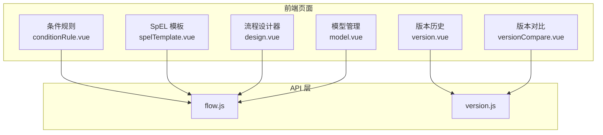
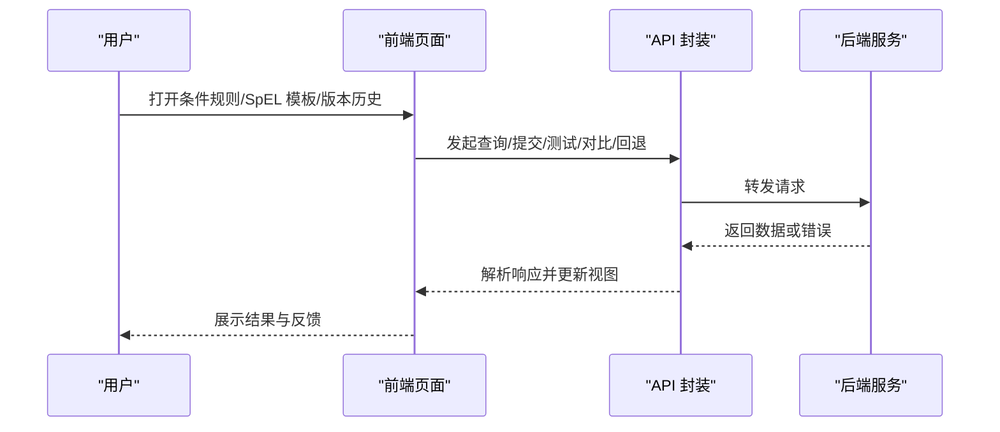
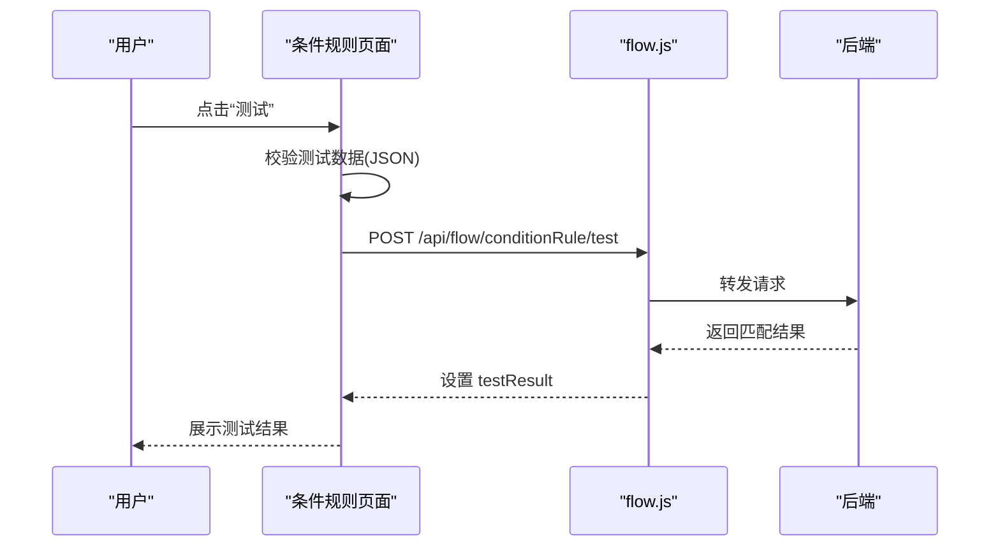
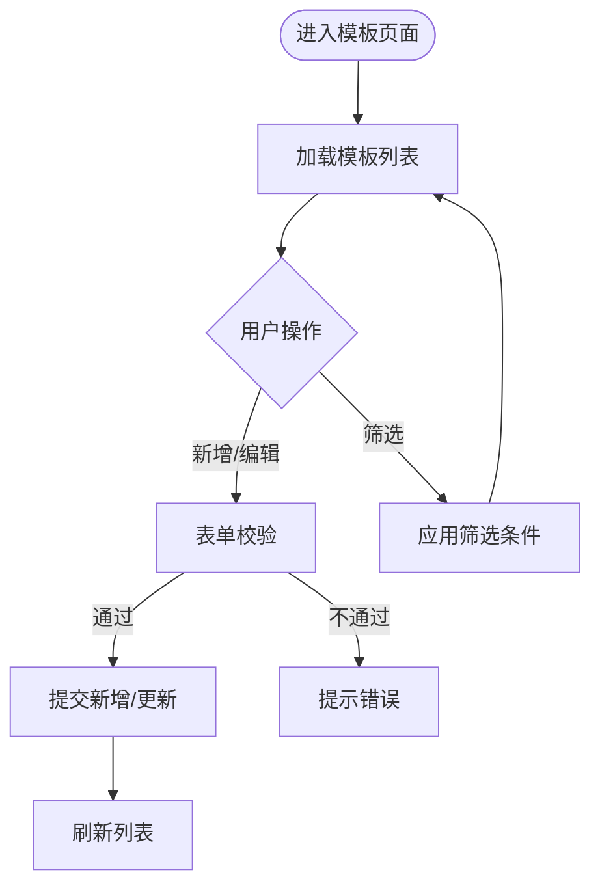
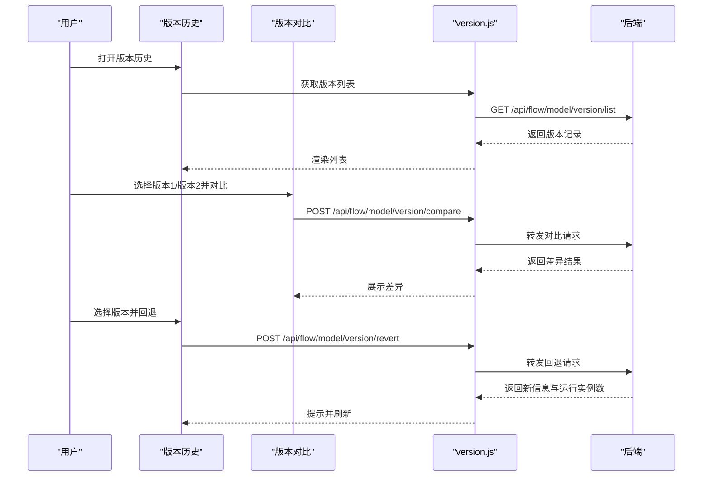
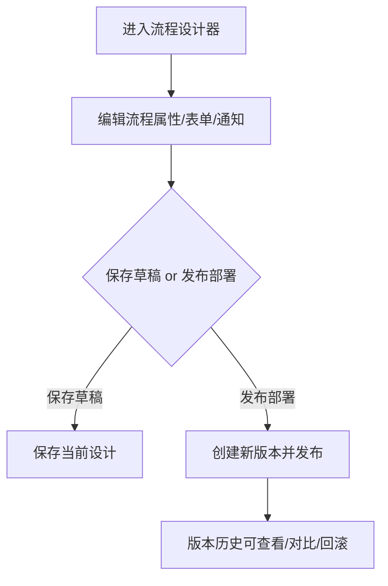
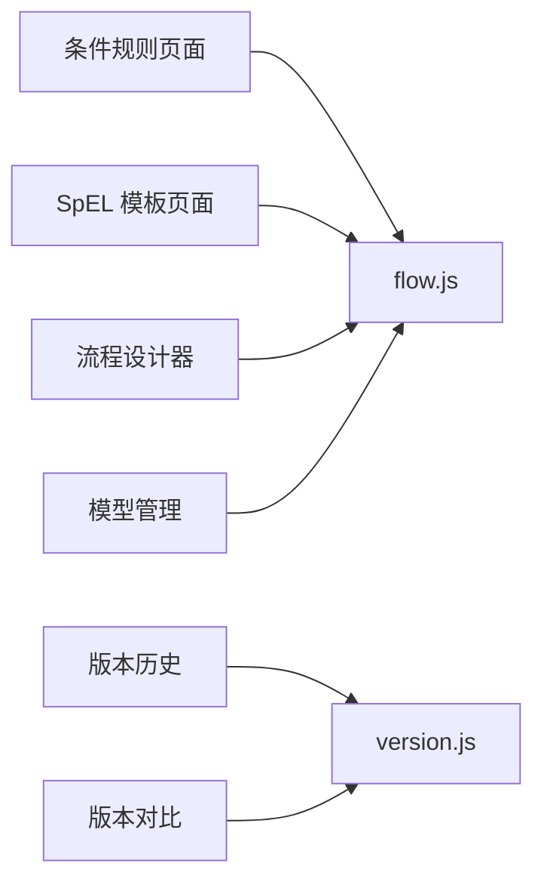

# 工作流配置

<cite>
**本文引用的文件**
- [conditionRule.vue](file://forge-admin-ui/src/views/flow/conditionRule.vue)
- [spelTemplate.vue](file://forge-admin-ui/src/views/flow/spelTemplate.vue)
- [versionCompare.vue](file://forge-admin-ui/src/views/flow/versionCompare.vue)
- [version.vue](file://forge-admin-ui/src/views/flow/version.vue)
- [design.vue](file://forge-admin-ui/src/views/flow/design.vue)
- [model.vue](file://forge-admin-ui/src/views/flow/model.vue)
- [flow.js](file://forge-admin-ui/src/api/flow.js)
- [version.js](file://forge-admin-ui/src/api/version.js)
</cite>

## 目录
1. [简介](#简介)
2. [项目结构](#项目结构)
3. [核心组件](#核心组件)
4. [架构总览](#架构总览)
5. [详细组件分析](#详细组件分析)
6. [依赖关系分析](#依赖关系分析)
7. [性能考虑](#性能考虑)
8. [故障排查指南](#故障排查指南)
9. [结论](#结论)
10. [附录](#附录)

## 简介
本文件面向 Forge Admin 的工作流配置模块，聚焦条件规则配置、SpEL 表达式模板、流程版本比较与回滚等能力。文档从前端页面、API 调用、数据流转到最佳实践与排错方法，提供循序渐进的说明，帮助读者快速掌握复杂条件处理、表达式调试、版本差异对比、配置变更管理与回滚策略。

## 项目结构
工作流配置相关的前端能力主要分布在以下页面与 API 层：
- 条件规则管理：条件规则列表、新增/编辑、测试执行
- SpEL 模板管理：模板增删改查、分类与状态管理
- 版本管理：版本历史、详情查看、版本对比、版本回退、标记与下载
- 流程设计与发布：流程设计器、表单配置、通知矩阵、发布部署入口
- API 封装：统一请求封装与接口定义

图表来源
- [conditionRule.vue:1-544](file://forge-admin-ui/src/views/flow/conditionRule.vue#L1-L544)
- [spelTemplate.vue:1-169](file://forge-admin-ui/src/views/flow/spelTemplate.vue#L1-L169)
- [version.vue:1-645](file://forge-admin-ui/src/views/flow/version.vue#L1-L645)
- [versionCompare.vue:1-158](file://forge-admin-ui/src/views/flow/versionCompare.vue#L1-L158)
- [design.vue:1-800](file://forge-admin-ui/src/views/flow/design.vue#L1-L800)
- [model.vue:1-800](file://forge-admin-ui/src/views/flow/model.vue#L1-L800)
- [flow.js:1-600](file://forge-admin-ui/src/api/flow.js#L1-L600)
- [version.js:1-25](file://forge-admin-ui/src/api/version.js#L1-L25)

章节来源
- [conditionRule.vue:1-544](file://forge-admin-ui/src/views/flow/conditionRule.vue#L1-L544)
- [spelTemplate.vue:1-169](file://forge-admin-ui/src/views/flow/spelTemplate.vue#L1-L169)
- [version.vue:1-645](file://forge-admin-ui/src/views/flow/version.vue#L1-L645)
- [versionCompare.vue:1-158](file://forge-admin-ui/src/views/flow/versionCompare.vue#L1-L158)
- [design.vue:1-800](file://forge-admin-ui/src/views/flow/design.vue#L1-L800)
- [model.vue:1-800](file://forge-admin-ui/src/views/flow/model.vue#L1-L800)
- [flow.js:1-600](file://forge-admin-ui/src/api/flow.js#L1-L600)
- [version.js:1-25](file://forge-admin-ui/src/api/version.js#L1-L25)

## 核心组件
- 条件规则（Condition Rule）
  - 功能：按规则名称、类型、状态检索；支持新增/编辑/删除；内置可视化条件项（字段、操作符、值）与自由 SpEL 表达式；提供在线测试能力。
  - 关键交互：表单校验、分页查询、模型下拉选择、条件项动态增删、测试弹窗与结果展示。
- SpEL 模板（SpEL Template）
  - 功能：以“模板编码 + 表达式”为核心，支持分类、排序、状态与示例参数；通过通用 AI CRUD 页面进行维护。
  - 关键交互：搜索、表格列渲染、编辑表单、字典联动。
- 版本管理（Version History & Compare）
  - 功能：版本列表、详情查看（BPMN XML、表单 JSON、流程图）、版本对比（节点/连线差异）、版本回退（生成新版本并保留运行实例）、版本标记与下载。
  - 关键交互：版本选择、对比按钮、回退确认、标签修改、XML 复制与下载。
- 流程设计与发布（Designer & Publish）
  - 功能：流程画布、属性面板、表单配置、通知矩阵、AI 辅助生成、保存草稿与发布部署。
  - 关键交互：工作区切换、模型信息编辑、表单资产绑定、通知事件×渠道矩阵配置、发布按钮触发。

章节来源
- [conditionRule.vue:1-544](file://forge-admin-ui/src/views/flow/conditionRule.vue#L1-L544)
- [spelTemplate.vue:1-169](file://forge-admin-ui/src/views/flow/spelTemplate.vue#L1-L169)
- [version.vue:1-645](file://forge-admin-ui/src/views/flow/version.vue#L1-L645)
- [versionCompare.vue:1-158](file://forge-admin-ui/src/views/flow/versionCompare.vue#L1-L158)
- [design.vue:1-800](file://forge-admin-ui/src/views/flow/design.vue#L1-L800)
- [model.vue:1-800](file://forge-admin-ui/src/views/flow/model.vue#L1-L800)

## 架构总览
工作流配置在前端以页面为入口，通过统一的 request 封装调用后端 REST 接口。条件规则与 SpEL 模板属于“可配置化”资源，版本管理贯穿“设计→发布→运行→回滚”的全生命周期。

图表来源
- [conditionRule.vue:336-373](file://forge-admin-ui/src/views/flow/conditionRule.vue#L336-L373)
- [spelTemplate.vue:1-169](file://forge-admin-ui/src/views/flow/spelTemplate.vue#L1-L169)
- [version.vue:362-375](file://forge-admin-ui/src/views/flow/version.vue#L362-L375)
- [versionCompare.vue:119-152](file://forge-admin-ui/src/views/flow/versionCompare.vue#L119-L152)
- [flow.js:1-600](file://forge-admin-ui/src/api/flow.js#L1-L600)
- [version.js:1-25](file://forge-admin-ui/src/api/version.js#L1-L25)

## 详细组件分析

### 条件规则配置
- 页面职责
  - 列表页：支持按规则名称、类型、状态筛选；分页加载；行内操作（编辑、测试、删除）。
  - 新增/编辑：规则名称、编码、类型、关联流程/节点、条件表达式、条件项数组、优先级、状态、备注。
  - 测试：输入 JSON 变量，调用测试接口，返回布尔匹配结果。
- 数据流
  - 列表加载：调用分页接口获取数据，填充表格与分页控件。
  - 提交：表单校验通过后，根据是否编辑决定 POST/PUT，成功后刷新列表。
  - 测试：构造 variables 对象，调用测试接口，显示成功/失败提示。
- 关键交互点
  - 条件项：支持动态添加/删除，便于组合多条件。
  - 模型下拉：加载可用流程模型供规则绑定。
  - 字典：规则类型、操作符、启用禁用状态来自字典。

图表来源
- [conditionRule.vue:484-516](file://forge-admin-ui/src/views/flow/conditionRule.vue#L484-L516)
- [flow.js:1-600](file://forge-admin-ui/src/api/flow.js#L1-L600)

章节来源
- [conditionRule.vue:1-544](file://forge-admin-ui/src/views/flow/conditionRule.vue#L1-L544)

### SpEL 表达式模板
- 页面职责
  - 使用通用 AI CRUD 页面维护模板，包含模板名称、编码、表达式、描述、分类、示例参数、状态、排序等。
  - 列表支持按名称、分类、状态筛选；表格展示表达式片段与分类、状态标签。
- 数据流
  - 列表：调用分页接口获取模板数据。
  - 编辑：表单校验后提交新增/更新。
- 关键点
  - 表达式字段用于存储 SpEL 表达式，示例参数用于演示入参结构。
  - 分类与状态由字典驱动，便于统一管理。

图表来源
- [spelTemplate.vue:1-169](file://forge-admin-ui/src/views/flow/spelTemplate.vue#L1-L169)

章节来源
- [spelTemplate.vue:1-169](file://forge-admin-ui/src/views/flow/spelTemplate.vue#L1-L169)

### 版本比较与回滚
- 版本历史
  - 列表：展示版本号、名称、标记、变更说明、发布人、发布时间；当前版本高亮。
  - 详情：查看 BPMN XML、表单 JSON、流程图预览；支持复制 XML。
  - 操作：回退、更多（对比、标记、下载、删除）。
- 版本对比
  - 选择两个版本，调用对比接口，展示新增/修改/删除的节点与连线。
- 版本回滚
  - 填写变更说明，调用回退接口，系统基于目标版本发布新版本；运行中的实例继续按旧版本执行。
  - 支持版本标记更新与 BPMN 文件下载。

图表来源
- [version.vue:362-444](file://forge-admin-ui/src/views/flow/version.vue#L362-L444)
- [versionCompare.vue:119-152](file://forge-admin-ui/src/views/flow/versionCompare.vue#L119-L152)
- [version.js:1-25](file://forge-admin-ui/src/api/version.js#L1-L25)

章节来源
- [version.vue:1-645](file://forge-admin-ui/src/views/flow/version.vue#L1-L645)
- [versionCompare.vue:1-158](file://forge-admin-ui/src/views/flow/versionCompare.vue#L1-L158)
- [version.js:1-25](file://forge-admin-ui/src/api/version.js#L1-L25)

### 流程设计与发布
- 设计器与工作区
  - 顶部工具栏：返回、更改记录、AI 生成、保存草稿、发布部署。
  - 工作区：流程设计、更多设置（流程属性、表单配置、审批与待办、通知与推送、说明）。
- 表单配置
  - 支持业务应用表单资产选择、外置表单 URL、动态表单选择；字段目录用于属性面板绑定。
- 通知矩阵
  - 事件 × 渠道矩阵，支持选择渠道、选择消息模板、预览模板；短信渠道有成本警告。
- 发布部署
  - 设计完成后通过发布按钮创建新版本并发布，后续可在版本历史中查看与回滚。

图表来源
- [design.vue:1-800](file://forge-admin-ui/src/views/flow/design.vue#L1-L800)
- [model.vue:1-800](file://forge-admin-ui/src/views/flow/model.vue#L1-L800)
- [flow.js:1-600](file://forge-admin-ui/src/api/flow.js#L1-L600)

章节来源
- [design.vue:1-800](file://forge-admin-ui/src/views/flow/design.vue#L1-L800)
- [model.vue:1-800](file://forge-admin-ui/src/views/flow/model.vue#L1-L800)

## 依赖关系分析
- 页面与 API 的耦合
  - 条件规则页面依赖 flow.js 中的通用请求封装，调用条件规则相关接口（列表、测试、CRUD）。
  - SpEL 模板页面通过通用 AI CRUD 页面与 flow.js 对接。
  - 版本历史与对比依赖 version.js 提供的版本接口（列表、详情、对比、回退、标记、下载）。
- 外部依赖
  - Naive UI 组件库用于表格、表单、弹窗、标签等。
  - 字典系统用于枚举值渲染（规则类型、操作符、状态、分类、版本标记等）。
  - 流程设计器与查看器（DingFlowDesigner/DingFlowViewer）用于 BPMN 渲染。

图表来源
- [conditionRule.vue:1-544](file://forge-admin-ui/src/views/flow/conditionRule.vue#L1-L544)
- [spelTemplate.vue:1-169](file://forge-admin-ui/src/views/flow/spelTemplate.vue#L1-L169)
- [version.vue:1-645](file://forge-admin-ui/src/views/flow/version.vue#L1-L645)
- [versionCompare.vue:1-158](file://forge-admin-ui/src/views/flow/versionCompare.vue#L1-L158)
- [design.vue:1-800](file://forge-admin-ui/src/views/flow/design.vue#L1-L800)
- [model.vue:1-800](file://forge-admin-ui/src/views/flow/model.vue#L1-L800)
- [flow.js:1-600](file://forge-admin-ui/src/api/flow.js#L1-L600)
- [version.js:1-25](file://forge-admin-ui/src/api/version.js#L1-L25)

章节来源
- [flow.js:1-600](file://forge-admin-ui/src/api/flow.js#L1-L600)
- [version.js:1-25](file://forge-admin-ui/src/api/version.js#L1-L25)

## 性能考虑
- 列表分页与懒加载
  - 条件规则与版本历史均使用分页，避免一次性加载大量数据。
  - 首次打开设计器/表单渲染时采用异步加载与占位提示，提升首屏体验。
- 字典与选项缓存
  - 字典数据在页面初始化时加载，减少重复请求。
- 网络请求优化
  - 使用统一 request 封装，集中处理错误与加载状态。
- 大对象渲染
  - BPMN XML 与表单 JSON 在详情中以代码块展示，必要时限制高度与滚动，避免卡顿。

[本节为通用指导，无需特定文件引用]

## 故障排查指南
- 条件规则测试失败
  - 检查测试数据是否为合法 JSON；确保变量名与流程变量一致。
  - 若表达式语法错误，优先在表达式编辑器中验证基础语法。
  - 参考接口路径：POST /api/flow/conditionRule/test。
- 版本对比无差异
  - 确认选择的两个版本不同；若确实无差异，将显示空差异提示。
  - 参考接口路径：POST /api/flow/model/version/compare。
- 版本回退异常
  - 变更说明需满足长度要求；回退会生成新版本，注意运行实例将继续按旧版本执行。
  - 参考接口路径：POST /api/flow/model/version/revert。
- 下载版本文件失败
  - 检查浏览器权限与跨域配置；下载过程使用 Blob 与文件名解析，失败时查看响应头与错误信息。
  - 参考接口路径：GET /api/flow/model/version/download/:id。
- 设计器加载缓慢
  - 首次加载需要异步准备资源，等待占位提示；检查网络与依赖脚本加载情况。
  - 参考页面：design.vue 中的异步加载与占位逻辑。

章节来源
- [conditionRule.vue:484-516](file://forge-admin-ui/src/views/flow/conditionRule.vue#L484-L516)
- [versionCompare.vue:119-152](file://forge-admin-ui/src/views/flow/versionCompare.vue#L119-L152)
- [version.vue:420-444](file://forge-admin-ui/src/views/flow/version.vue#L420-L444)
- [version.vue:470-506](file://forge-admin-ui/src/views/flow/version.vue#L470-L506)
- [design.vue:1-800](file://forge-admin-ui/src/views/flow/design.vue#L1-L800)

## 结论
Forge Admin 的工作流配置模块提供了完善的条件规则、SpEL 模板与版本管理能力。通过可视化的条件项与表达式、在线测试、版本对比与回滚，能够有效支撑复杂流程的配置与维护。建议在实际使用中遵循最佳实践：明确规则优先级、规范表达式命名与注释、谨慎发布与回滚、完善通知矩阵与审计记录。

[本节为总结性内容，无需特定文件引用]

## 附录
- 条件规则编写指南
  - 优先使用结构化条件项（字段+操作符+值），复杂逻辑再引入 SpEL 表达式。
  - 为每条规则设置合理优先级，避免冲突；启用/禁用状态用于灰度与回滚。
- 表达式调试方法
  - 使用测试弹窗输入最小可复现的 JSON 变量集，逐步缩小问题范围。
  - 结合流程变量与业务对象字段，确保变量名一致。
- 版本回滚策略
  - 回滚会生成新版本，不影响正在运行的实例；建议在低峰期执行并记录变更说明。
  - 对重要版本打标签，便于追溯与对比。
- 配置变更管理
  - 所有变更通过版本历史留痕；详情页支持 BPMN XML 与表单 JSON 查看与复制。
  - 发布前进行充分测试，利用设计器的 AI 辅助与预览能力降低风险。

[本节为补充说明，无需特定文件引用]