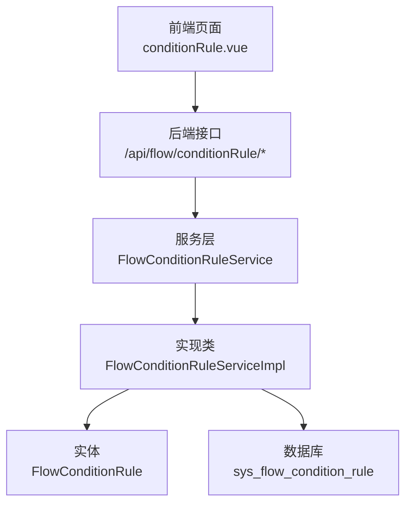
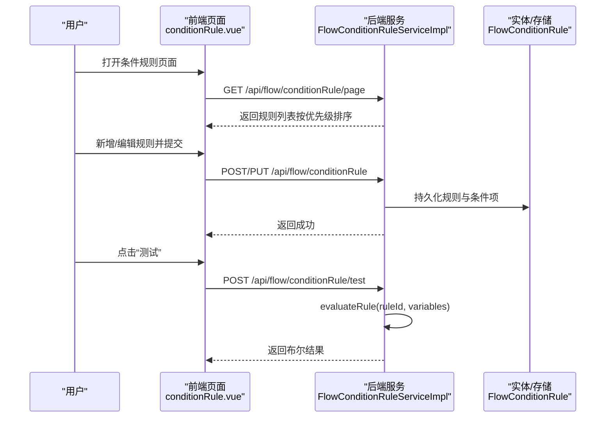
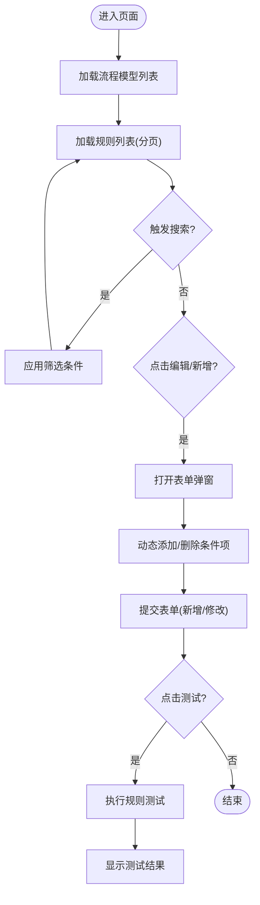
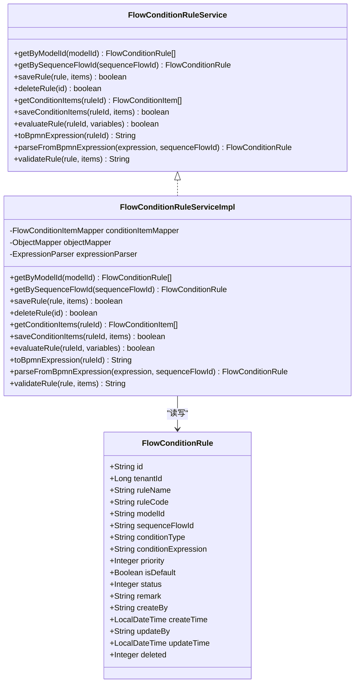
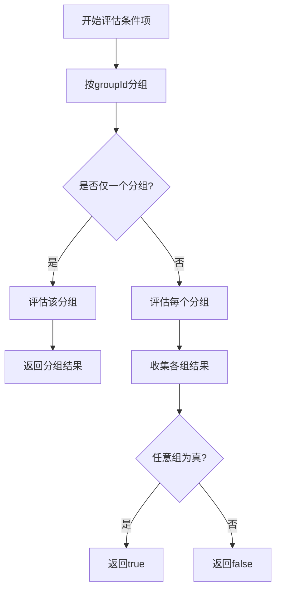
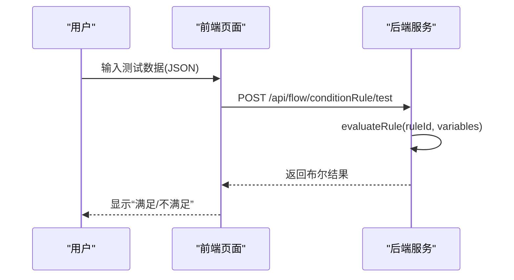
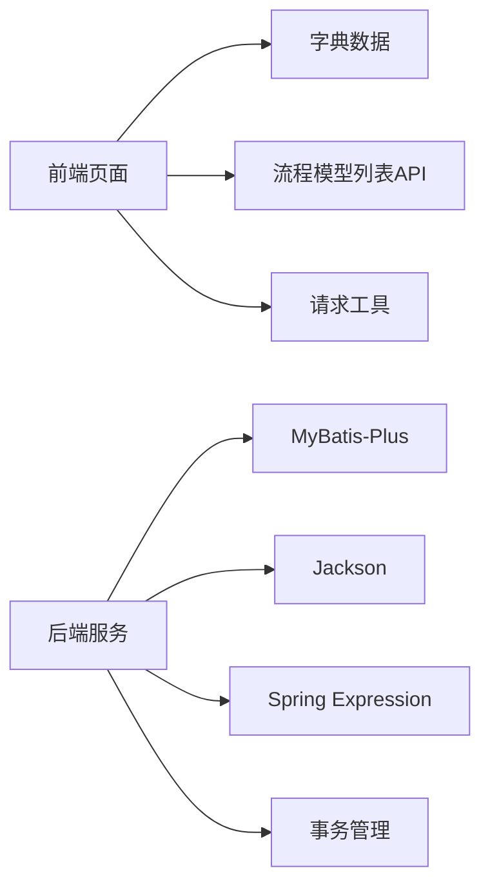

# 条件规则管理

<cite>
**本文引用的文件**
- [conditionRule.vue](file://forge-admin-ui/src/views/flow/conditionRule.vue)
- [FlowConditionRule.java](file://forge-server/forge-framework/forge-plugin-parent/forge-plugin-flow/src/main/java/com/mdframe/forge/starter/flow/entity/FlowConditionRule.java)
- [FlowConditionRuleService.java](file://forge-server/forge-framework/forge-plugin-parent/forge-plugin-flow/src/main/java/com/mdframe/forge/starter/flow/service/FlowConditionRuleService.java)
- [FlowConditionRuleServiceImpl.java](file://forge-server/forge-framework/forge-plugin-parent/forge-plugin-flow/src/main/java/com/mdframe/forge/starter/flow/service/impl/FlowConditionRuleServiceImpl.java)
</cite>

## 目录
1. [简介](#简介)
2. [项目结构](#项目结构)
3. [核心组件](#核心组件)
4. [架构总览](#架构总览)
5. [详细组件分析](#详细组件分析)
6. [依赖关系分析](#依赖关系分析)
7. [性能考虑](#性能考虑)
8. [故障排查指南](#故障排查指南)
9. [结论](#结论)
10. [附录](#附录)

## 简介
本章节面向 Forge Admin 的条件规则管理能力，围绕“条件规则的增删改查、规则类型配置、关联流程与节点绑定、节点条件设置、优先级机制、状态管理、批量操作、条件项动态添加删除、字段选择器使用、操作符配置、测试规则执行”等主题进行系统化说明。文档同时给出条件表达式编写规范、复杂条件组合方案、规则验证机制、冲突检测建议与性能优化策略，帮助使用者高效、安全地构建与维护流程分支条件。

## 项目结构
条件规则功能由前端页面与后端服务共同实现：
- 前端：提供规则列表、搜索筛选、新增/编辑弹窗、条件项动态维护、规则测试等交互能力。
- 后端：提供规则实体定义、CRUD、条件评估、BPMN 表达式转换、解析与校验等核心逻辑。

图表来源
- [conditionRule.vue:1-544](file://forge-admin-ui/src/views/flow/conditionRule.vue#L1-L544)
- [FlowConditionRuleService.java:1-91](file://forge-server/forge-framework/forge-plugin-parent/forge-plugin-flow/src/main/java/com/mdframe/forge/starter/flow/service/FlowConditionRuleService.java#L1-L91)
- [FlowConditionRuleServiceImpl.java:1-460](file://forge-server/forge-framework/forge-plugin-parent/forge-plugin-flow/src/main/java/com/mdframe/forge/starter/flow/service/impl/FlowConditionRuleServiceImpl.java#L1-L460)
- [FlowConditionRule.java:1-113](file://forge-server/forge-framework/forge-plugin-parent/forge-plugin-flow/src/main/java/com/mdframe/forge/starter/flow/entity/FlowConditionRule.java#L1-L113)

章节来源
- [conditionRule.vue:1-544](file://forge-admin-ui/src/views/flow/conditionRule.vue#L1-L544)
- [FlowConditionRule.java:1-113](file://forge-server/forge-framework/forge-plugin-parent/forge-plugin-flow/src/main/java/com/mdframe/forge/starter/flow/entity/FlowConditionRule.java#L1-L113)
- [FlowConditionRuleService.java:1-91](file://forge-server/forge-framework/forge-plugin-parent/forge-plugin-flow/src/main/java/com/mdframe/forge/starter/flow/service/FlowConditionRuleService.java#L1-L91)
- [FlowConditionRuleServiceImpl.java:1-460](file://forge-server/forge-framework/forge-plugin-parent/forge-plugin-flow/src/main/java/com/mdframe/forge/starter/flow/service/impl/FlowConditionRuleServiceImpl.java#L1-L460)

## 核心组件
- 前端页面（条件规则管理）
  - 列表查询与分页：支持按规则名称、类型、状态筛选，分页展示。
  - 新增/编辑弹窗：包含规则名称、编码、类型、关联流程模型、关联节点、条件表达式、条件项、优先级、状态、备注等字段。
  - 条件项动态维护：支持动态添加/删除条件项，每项包含字段、操作符、值。
  - 规则测试：输入 JSON 变量数据，调用测试接口返回匹配结果。
- 后端服务（条件规则）
  - 实体定义：规则主键、租户、名称、编码、模型ID、序列流ID、条件类型、表达式、优先级、是否默认路径、状态、备注、审计字段、逻辑删除标志。
  - 服务接口：按模型获取规则、按序列流获取规则、保存规则及条件项、删除规则、获取/保存条件项、评估规则、转换为 BPMN 表达式、从 BPMN 表达式解析规则、验证规则配置。
  - 服务实现：基于优先级排序加载；支持简单/组合/脚本三类条件；分组与连接符评估；SPeL 表达式执行；值类型解析与比较；BPMN 表达式生成与解析；规则校验。

章节来源
- [conditionRule.vue:1-544](file://forge-admin-ui/src/views/flow/conditionRule.vue#L1-L544)
- [FlowConditionRule.java:1-113](file://forge-server/forge-framework/forge-plugin-parent/forge-plugin-flow/src/main/java/com/mdframe/forge/starter/flow/entity/FlowConditionRule.java#L1-L113)
- [FlowConditionRuleService.java:1-91](file://forge-server/forge-framework/forge-plugin-parent/forge-plugin-flow/src/main/java/com/mdframe/forge/starter/flow/service/FlowConditionRuleService.java#L1-L91)
- [FlowConditionRuleServiceImpl.java:1-460](file://forge-server/forge-framework/forge-plugin-parent/forge-plugin-flow/src/main/java/com/mdframe/forge/starter/flow/service/impl/FlowConditionRuleServiceImpl.java#L1-L460)

## 架构总览
条件规则在前后端之间的交互流程如下：
- 前端通过 REST 接口完成规则的分页查询、新增/修改、删除、测试等操作。
- 后端根据规则类型与条件项，采用 SPeL 或可视化条件项进行求值，并支持将可视化配置转换为 BPMN 表达式以驱动流程引擎。

图表来源
- [conditionRule.vue:336-521](file://forge-admin-ui/src/views/flow/conditionRule.vue#L336-L521)
- [FlowConditionRuleServiceImpl.java:111-133](file://forge-server/forge-framework/forge-plugin-parent/forge-plugin-flow/src/main/java/com/mdframe/forge/starter/flow/service/impl/FlowConditionRuleServiceImpl.java#L111-L133)

## 详细组件分析

### 前端：条件规则管理页面
- 列表与筛选
  - 支持规则名称模糊查询、规则类型下拉筛选、启用/禁用状态筛选。
  - 分页参数包括当前页、每页条数、总数。
- 表单与校验
  - 必填项：规则名称、规则编码、规则类型。
  - 可选：关联流程模型、关联节点、条件表达式、条件项、优先级、状态、备注。
- 条件项动态维护
  - 动态添加/删除条件项，每项包含字段、操作符、值。
  - 字段选项可来源于字典或业务字段目录；操作符来自字典。
- 规则测试
  - 输入 JSON 格式的变量数据，调用测试接口，返回布尔结果提示是否满足条件。

图表来源
- [conditionRule.vue:336-521](file://forge-admin-ui/src/views/flow/conditionRule.vue#L336-L521)

章节来源
- [conditionRule.vue:1-544](file://forge-admin-ui/src/views/flow/conditionRule.vue#L1-L544)

### 后端：条件规则服务与实现
- 实体模型
  - 关键字段：规则名称、编码、模型ID、序列流ID、条件类型（simple/composite/script）、条件表达式、优先级、是否默认路径、状态、备注、审计字段、逻辑删除。
- 服务接口能力
  - 按模型ID获取规则列表（按优先级升序）。
  - 按序列流ID获取规则。
  - 保存规则与条件项（事务性）。
  - 删除规则（级联删除条件项）。
  - 获取/保存条件项。
  - 评估规则（支持默认路径直接通过）。
  - 转换为 BPMN 表达式（非默认路径且非脚本时由条件项构建）。
  - 从 BPMN 表达式解析为规则（空表达式视为默认路径）。
  - 验证规则配置（非默认路径需满足相应条件）。
- 实现要点
  - 条件项分组与连接符：同一组内按连接符（AND/OR）顺序求值，多组之间以 OR 连接。
  - 操作符支持：等于、不等于、大于、小于、大于等于、小于等于、包含、前缀、后缀、IN、NOT IN、为空、非空。
  - 值类型解析：数字、布尔、日期、字符串；列表值以 JSON 解析。
  - 表达式执行：脚本类型直接使用 SPeL 表达式；可视化类型由条件项构建表达式后执行。
  - 默认路径：标记为默认路径的规则在评估时直接返回 true，不参与条件项计算。

图表来源
- [FlowConditionRule.java:1-113](file://forge-server/forge-framework/forge-plugin-parent/forge-plugin-flow/src/main/java/com/mdframe/forge/starter/flow/entity/FlowConditionRule.java#L1-L113)
- [FlowConditionRuleService.java:1-91](file://forge-server/forge-framework/forge-plugin-parent/forge-plugin-flow/src/main/java/com/mdframe/forge/starter/flow/service/FlowConditionRuleService.java#L1-L91)
- [FlowConditionRuleServiceImpl.java:1-460](file://forge-server/forge-framework/forge-plugin-parent/forge-plugin-flow/src/main/java/com/mdframe/forge/starter/flow/service/impl/FlowConditionRuleServiceImpl.java#L1-L460)

章节来源
- [FlowConditionRule.java:1-113](file://forge-server/forge-framework/forge-plugin-parent/forge-plugin-flow/src/main/java/com/mdframe/forge/starter/flow/entity/FlowConditionRule.java#L1-L113)
- [FlowConditionRuleService.java:1-91](file://forge-server/forge-framework/forge-plugin-parent/forge-plugin-flow/src/main/java/com/mdframe/forge/starter/flow/service/FlowConditionRuleService.java#L1-L91)
- [FlowConditionRuleServiceImpl.java:1-460](file://forge-server/forge-framework/forge-plugin-parent/forge-plugin-flow/src/main/java/com/mdframe/forge/starter/flow/service/impl/FlowConditionRuleServiceImpl.java#L1-L460)

### 条件项评估流程（可视化条件）
- 分组组织：按 groupId 分组，未指定则归入默认组。
- 组内求值：按顺序遍历条件项，使用逻辑连接符（AND/OR）累积结果。
- 多组合并：多个组之间以 OR 连接，任一组为真即整体为真。
- 单条件求值：根据字段名取值、操作符与值类型解析进行比较。

图表来源
- [FlowConditionRuleServiceImpl.java:215-242](file://forge-server/forge-framework/forge-plugin-parent/forge-plugin-flow/src/main/java/com/mdframe/forge/starter/flow/service/impl/FlowConditionRuleServiceImpl.java#L215-L242)

章节来源
- [FlowConditionRuleServiceImpl.java:215-242](file://forge-server/forge-framework/forge-plugin-parent/forge-plugin-flow/src/main/java/com/mdframe/forge/starter/flow/service/impl/FlowConditionRuleServiceImpl.java#L215-L242)

### 规则测试流程
- 前端接收用户输入的 JSON 变量数据。
- 调用测试接口，传入规则ID与变量。
- 后端评估规则并返回布尔结果，前端以提示方式展示。

图表来源
- [conditionRule.vue:484-516](file://forge-admin-ui/src/views/flow/conditionRule.vue#L484-L516)
- [FlowConditionRuleServiceImpl.java:111-133](file://forge-server/forge-framework/forge-plugin-parent/forge-plugin-flow/src/main/java/com/mdframe/forge/starter/flow/service/impl/FlowConditionRuleServiceImpl.java#L111-L133)

章节来源
- [conditionRule.vue:484-516](file://forge-admin-ui/src/views/flow/conditionRule.vue#L484-L516)
- [FlowConditionRuleServiceImpl.java:111-133](file://forge-server/forge-framework/forge-plugin-parent/forge-plugin-flow/src/main/java/com/mdframe/forge/starter/flow/service/impl/FlowConditionRuleServiceImpl.java#L111-L133)

## 依赖关系分析
- 前端依赖
  - 字典数据：规则类型、操作符、启用/禁用状态。
  - 流程模型列表：用于关联流程模型选择。
  - 请求工具：统一封装的 request 方法。
- 后端依赖
  - MyBatis-Plus：实体映射与查询。
  - Jackson：JSON 序列化/反序列化（列表值解析）。
  - Spring Expression：SPeL 表达式解析与执行。
  - 事务管理：保存规则与条件项、删除规则时的原子性。

图表来源
- [conditionRule.vue:193-227](file://forge-admin-ui/src/views/flow/conditionRule.vue#L193-L227)
- [FlowConditionRuleServiceImpl.java:1-460](file://forge-server/forge-framework/forge-plugin-parent/forge-plugin-flow/src/main/java/com/mdframe/forge/starter/flow/service/impl/FlowConditionRuleServiceImpl.java#L1-L460)

章节来源
- [conditionRule.vue:193-227](file://forge-admin-ui/src/views/flow/conditionRule.vue#L193-L227)
- [FlowConditionRuleServiceImpl.java:1-460](file://forge-server/forge-framework/forge-plugin-parent/forge-plugin-flow/src/main/java/com/mdframe/forge/starter/flow/service/impl/FlowConditionRuleServiceImpl.java#L1-L460)

## 性能考虑
- 列表加载
  - 后端按优先级升序排序，避免前端二次排序开销。
  - 分页查询减少数据传输量。
- 条件评估
  - 默认路径直接返回 true，跳过条件项计算。
  - 可视化条件项分组评估，减少不必要的表达式构建。
  - 数值比较优先使用 Comparable，失败时回退到 BigDecimal 比较，兼顾精度与性能。
- 表达式执行
  - 脚本类型直接使用 SPeL，注意表达式复杂度与变量数量对性能的影响。
  - 列表值解析异常时记录日志并返回空列表，避免阻塞。
- 建议
  - 控制条件项数量与分组层级，避免过深嵌套。
  - 对高频使用的规则进行缓存（如规则元数据与表达式编译结果），降低重复解析成本。
  - 对大对象变量进行裁剪，仅传递必要字段参与评估。

[本节为通用性能指导，不直接分析具体文件]

## 故障排查指南
- 常见问题
  - 规则未生效：检查是否为默认路径；确认状态为启用；优先级是否正确。
  - 条件项无效：确保字段名存在、操作符合法、值类型正确；列表值需为合法 JSON。
  - 表达式错误：脚本类型表达式语法错误或变量缺失会导致评估失败，查看后端日志定位。
- 排查步骤
  - 使用“测试规则”功能，输入最小化变量集逐步缩小问题范围。
  - 检查规则验证结果，非默认路径必须满足对应条件配置。
  - 查看后端日志中的表达式评估错误信息，修正表达式或变量。
- 相关实现参考
  - 规则验证：非默认路径下对条件项与表达式进行必填校验。
  - 表达式评估：捕获异常并记录错误日志，返回 false。

章节来源
- [FlowConditionRuleServiceImpl.java:177-210](file://forge-server/forge-framework/forge-plugin-parent/forge-plugin-flow/src/main/java/com/mdframe/forge/starter/flow/service/impl/FlowConditionRuleServiceImpl.java#L177-L210)
- [FlowConditionRuleServiceImpl.java:321-333](file://forge-server/forge-framework/forge-plugin-parent/forge-plugin-flow/src/main/java/com/mdframe/forge/starter/flow/service/impl/FlowConditionRuleServiceImpl.java#L321-L333)

## 结论
条件规则管理提供了灵活的可视化与脚本双模式条件配置能力，结合优先级、分组与连接符机制，能够覆盖大多数流程分支场景。通过完善的验证、测试与日志能力，便于快速定位与修复问题。建议在复杂场景中合理拆分规则、控制表达式复杂度，并结合缓存策略提升运行时性能。

[本节为总结性内容，不直接分析具体文件]

## 附录

### 条件表达式编写规范
- 脚本类型
  - 使用 SPeL 表达式，变量名需与流程变量一致。
  - 避免复杂计算与外部调用，保持表达式简洁可读。
- 可视化类型
  - 字段名需与流程变量或表单字段一致。
  - 操作符选择应与字段类型匹配（数值、字符串、日期、布尔、列表）。
  - 列表值使用 JSON 数组格式。

章节来源
- [FlowConditionRuleServiceImpl.java:274-316](file://forge-server/forge-framework/forge-plugin-parent/forge-plugin-flow/src/main/java/com/mdframe/forge/starter/flow/service/impl/FlowConditionRuleServiceImpl.java#L274-L316)
- [FlowConditionRuleServiceImpl.java:396-431](file://forge-server/forge-framework/forge-plugin-parent/forge-plugin-flow/src/main/java/com/mdframe/forge/starter/flow/service/impl/FlowConditionRuleServiceImpl.java#L396-L431)

### 复杂条件组合方案
- 分组设计：将语义相关的条件放入同一组，组内使用 AND/OR 连接；多组之间以 OR 连接。
- 默认路径：将兜底分支标记为默认路径，简化其他规则配置。
- 优先级：通过优先级控制规则匹配顺序，避免歧义。

章节来源
- [FlowConditionRuleServiceImpl.java:215-242](file://forge-server/forge-framework/forge-plugin-parent/forge-plugin-flow/src/main/java/com/mdframe/forge/starter/flow/service/impl/FlowConditionRuleServiceImpl.java#L215-L242)
- [FlowConditionRuleServiceImpl.java:39-44](file://forge-server/forge-framework/forge-plugin-parent/forge-plugin-flow/src/main/java/com/mdframe/forge/starter/flow/service/impl/FlowConditionRuleServiceImpl.java#L39-L44)

### 规则验证机制
- 必填校验：规则名称、编码、类型必填。
- 条件项校验：非默认路径下，简单/组合类型需至少一个有效条件项；字段名与操作符必填。
- 表达式校验：脚本类型需非空表达式。

章节来源
- [FlowConditionRuleServiceImpl.java:177-210](file://forge-server/forge-framework/forge-plugin-parent/forge-plugin-flow/src/main/java/com/mdframe/forge/starter/flow/service/impl/FlowConditionRuleServiceImpl.java#L177-L210)

### 规则冲突检测建议
- 同模型下多条规则可能匹配相同变量集，建议：
  - 明确优先级，避免歧义。
  - 使用互斥条件（如不同枚举值）减少重叠。
  - 通过测试用例覆盖边界场景，发现潜在冲突。

[本节为通用建议，不直接分析具体文件]

### 批量操作功能
- 当前前端页面提供单条规则的增删改与测试。
- 如需批量操作（如批量启用/禁用、批量删除），可在前端增加多选与批量按钮，并在后端扩展对应接口。

[本节为扩展建议，不直接分析具体文件]