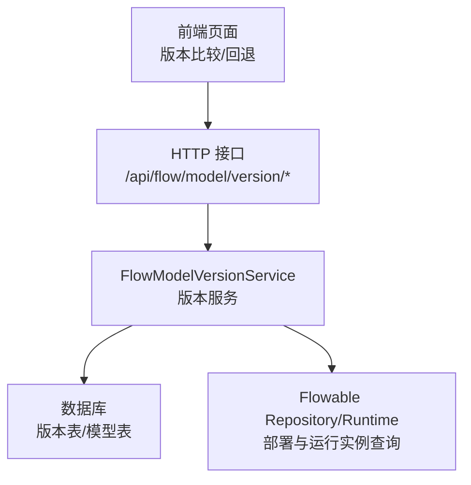
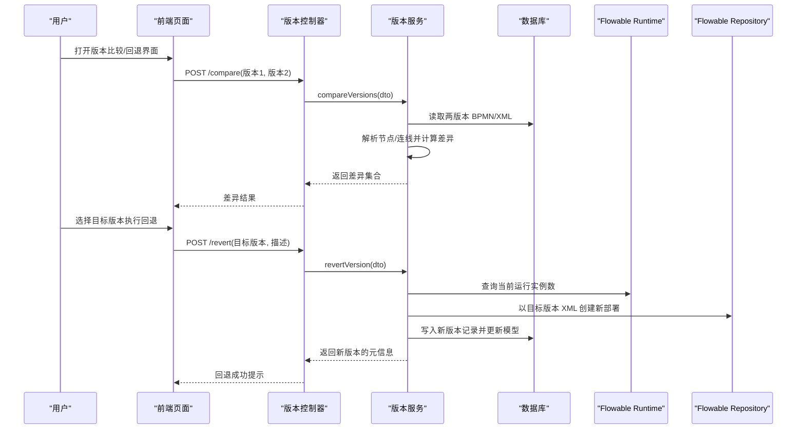
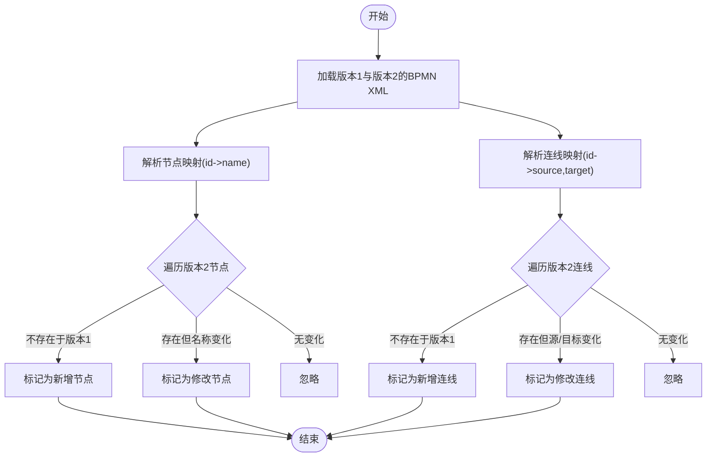
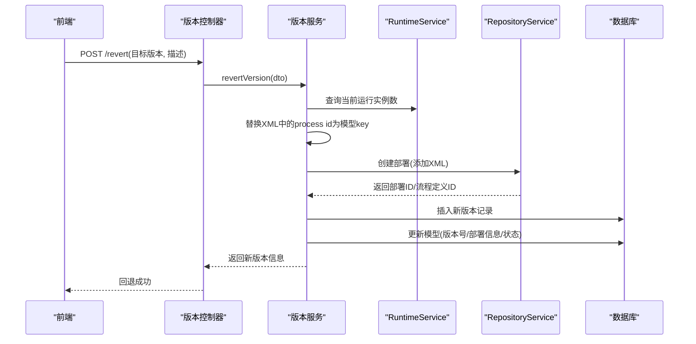
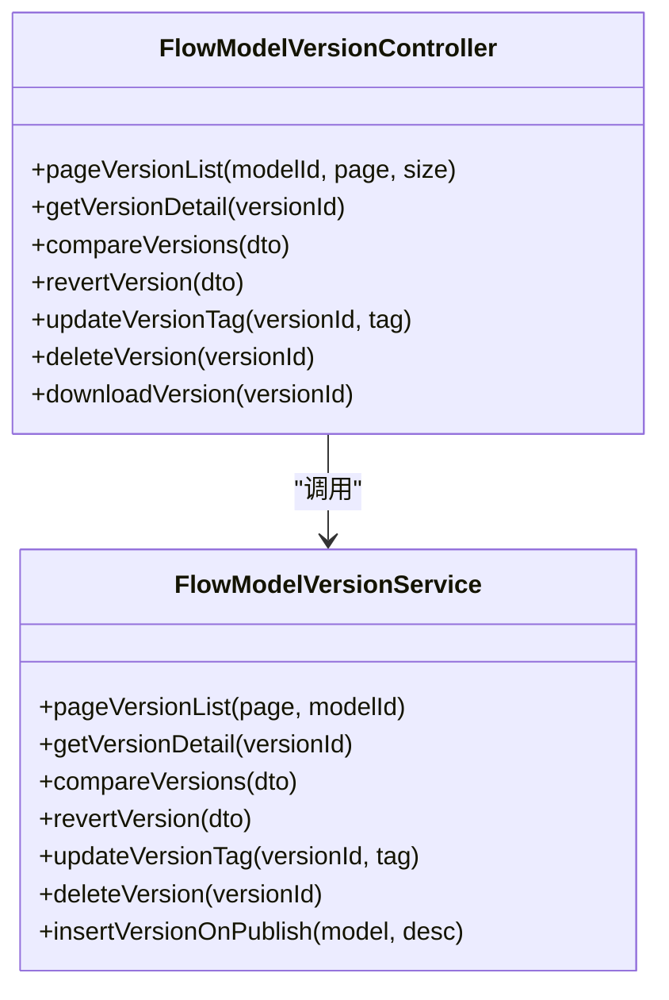
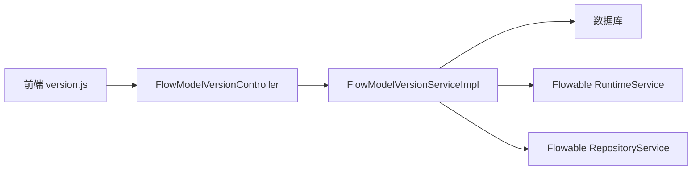

# 流程版本比较

<cite>
**本文引用的文件**
- [FlowModelVersionController.java](file://forge-server/forge-flow/forge-flow-server/src/main/java/com/mdframe/forge/flow/controller/FlowModelVersionController.java)
- [FlowModelVersionService.java](file://forge-server/forge-framework/forge-plugin-parent/forge-plugin-flow/src/main/java/com/mdframe/forge/starter/flow/service/FlowModelVersionService.java)
- [FlowModelVersionServiceImpl.java](file://forge-server/forge-framework/forge-plugin-parent/forge-plugin-flow/src/main/java/com/mdframe/forge/starter/flow/service/impl/FlowModelVersionServiceImpl.java)
- [VersionCompareDTO.java](file://forge-server/forge-framework/forge-plugin-parent/forge-plugin-flow/src/main/java/com/mdframe/forge/starter/flow/dto/VersionCompareDTO.java)
- [VersionRevertDTO.java](file://forge-server/forge-framework/forge-plugin-parent/forge-plugin-flow/src/main/java/com/mdframe/forge/starter/flow/dto/VersionRevertDTO.java)
- [VersionCompareVO.java](file://forge-server/forge-framework/forge-plugin-parent/forge-plugin-flow/src/main/java/com/mdframe/forge/starter/flow/vo/VersionCompareVO.java)
- [VersionRevertVO.java](file://forge-server/forge-framework/forge-plugin-parent/forge-plugin-flow/src/main/java/com/mdframe/forge/starter/flow/vo/VersionRevertVO.java)
- [version.js](file://forge-admin-ui/src/api/version.js)
</cite>

## 目录
1. [简介](#简介)
2. [项目结构](#项目结构)
3. [核心组件](#核心组件)
4. [架构总览](#架构总览)
5. [详细组件分析](#详细组件分析)
6. [依赖关系分析](#依赖关系分析)
7. [性能考虑](#性能考虑)
8. [故障排查指南](#故障排查指南)
9. [结论](#结论)
10. [附录](#附录)

## 简介
本文件面向 Forge Admin 的流程版本比较功能，系统性说明版本差异检测、变更对比展示、回滚机制与发布管理。文档覆盖版本树结构、分支与合并策略建议、冲突解决思路、可视化对比界面与差异高亮、影响范围分析、审批流程集成、最佳实践、回滚风险评估、发布策略制定以及版本审计与合规性检查。内容基于仓库中流程版本管理的后端实现与前端 API 调用进行梳理，帮助读者快速理解并正确使用该能力。

## 项目结构
围绕“流程版本比较”的核心代码位于以下模块：
- 控制器层：提供版本列表、详情、比较、回退、标签更新、删除、下载等 HTTP 接口
- 服务层：封装版本比较算法、回滚逻辑、发布时记录版本历史、XML 解析与规范化
- DTO/VO：定义比较请求参数、回退请求参数、比较结果与回退结果的数据结构
- 前端：通过统一 API 模块调用版本比较与回退接口

**图表来源**
- [FlowModelVersionController.java:27-98](file://forge-server/forge-flow/forge-flow-server/src/main/java/com/mdframe/forge/flow/controller/FlowModelVersionController.java#L27-L98)
- [FlowModelVersionServiceImpl.java:41-503](file://forge-server/forge-framework/forge-plugin-parent/forge-plugin-flow/src/main/java/com/mdframe/forge/starter/flow/service/impl/FlowModelVersionServiceImpl.java#L41-L503)

**章节来源**
- [FlowModelVersionController.java:27-98](file://forge-server/forge-flow/forge-flow-server/src/main/java/com/mdframe/forge/flow/controller/FlowModelVersionController.java#L27-L98)
- [FlowModelVersionService.java:14-29](file://forge-server/forge-framework/forge-plugin-parent/forge-plugin-flow/src/main/java/com/mdframe/forge/starter/flow/service/FlowModelVersionService.java#L14-L29)
- [FlowModelVersionServiceImpl.java:41-503](file://forge-server/forge-framework/forge-plugin-parent/forge-plugin-flow/src/main/java/com/mdframe/forge/starter/flow/service/impl/FlowModelVersionServiceImpl.java#L41-L503)

## 核心组件
- 版本控制器：暴露版本分页、详情、比较、回退、标签更新、删除、BPMN XML 下载等接口
- 版本服务：实现版本比较（节点/连线差异）、回退（生成新版本并部署）、发布时写入版本历史、XML 解析与规范化
- 数据契约：比较请求/结果、回退请求/结果的结构化定义
- 前端 API：封装 compareVersions 与 revertVersion 的调用

关键职责划分：
- 控制器负责入参校验、路由与响应包装
- 服务负责业务编排、数据访问与外部系统集成（Flowable）
- DTO/VO 明确前后端交互契约
- 前端仅负责发起请求与渲染差异结果

**章节来源**
- [FlowModelVersionController.java:37-98](file://forge-server/forge-flow/forge-flow-server/src/main/java/com/mdframe/forge/flow/controller/FlowModelVersionController.java#L37-L98)
- [FlowModelVersionService.java:14-29](file://forge-server/forge-framework/forge-plugin-parent/forge-plugin-flow/src/main/java/com/mdframe/forge/starter/flow/service/FlowModelVersionService.java#L14-L29)
- [FlowModelVersionServiceImpl.java:54-317](file://forge-server/forge-framework/forge-plugin-parent/forge-plugin-flow/src/main/java/com/mdframe/forge/starter/flow/service/impl/FlowModelVersionServiceImpl.java#L54-L317)
- [VersionCompareDTO.java](file://forge-server/forge-framework/forge-plugin-parent/forge-plugin-flow/src/main/java/com/mdframe/forge/starter/flow/dto/VersionCompareDTO.java)
- [VersionRevertDTO.java](file://forge-server/forge-framework/forge-plugin-parent/forge-plugin-flow/src/main/java/com/mdframe/forge/starter/flow/dto/VersionRevertDTO.java)
- [VersionCompareVO.java](file://forge-server/forge-framework/forge-plugin-parent/forge-plugin-flow/src/main/java/com/mdframe/forge/starter/flow/vo/VersionCompareVO.java)
- [VersionRevertVO.java](file://forge-server/forge-framework/forge-plugin-parent/forge-plugin-flow/src/main/java/com/mdframe/forge/starter/flow/vo/VersionRevertVO.java)
- [version.js:10-13](file://forge-admin-ui/src/api/version.js#L10-L13)

## 架构总览
版本比较与回退的整体调用链如下：

**图表来源**
- [FlowModelVersionController.java:51-65](file://forge-server/forge-flow/forge-flow-server/src/main/java/com/mdframe/forge/flow/controller/FlowModelVersionController.java#L51-L65)
- [FlowModelVersionServiceImpl.java:83-257](file://forge-server/forge-framework/forge-plugin-parent/forge-plugin-flow/src/main/java/com/mdframe/forge/starter/flow/service/impl/FlowModelVersionServiceImpl.java#L83-L257)

## 详细组件分析

### 版本比较（差异检测与展示）
- 输入：模型 ID、两个版本号
- 处理：
  - 从存储中获取两个版本的 BPMN XML
  - 解析节点（跳过无关标签），提取 id/name
  - 解析连线（sequenceFlow），提取 sourceRef/targetRef
  - 计算新增、修改、删除的节点与连线
- 输出：差异集合（节点/连线的新增、修改、删除）

**图表来源**
- [FlowModelVersionServiceImpl.java:83-164](file://forge-server/forge-framework/forge-plugin-parent/forge-plugin-flow/src/main/java/com/mdframe/forge/starter/flow/service/impl/FlowModelVersionServiceImpl.java#L83-L164)
- [FlowModelVersionServiceImpl.java:363-423](file://forge-server/forge-framework/forge-plugin-parent/forge-plugin-flow/src/main/java/com/mdframe/forge/starter/flow/service/impl/FlowModelVersionServiceImpl.java#L363-L423)

**章节来源**
- [FlowModelVersionController.java:51-54](file://forge-server/forge-flow/forge-flow-server/src/main/java/com/mdframe/forge/flow/controller/FlowModelVersionController.java#L51-L54)
- [FlowModelVersionServiceImpl.java:83-164](file://forge-server/forge-framework/forge-plugin-parent/forge-plugin-flow/src/main/java/com/mdframe/forge/starter/flow/service/impl/FlowModelVersionServiceImpl.java#L83-L164)
- [VersionCompareDTO.java](file://forge-server/forge-framework/forge-plugin-parent/forge-plugin-flow/src/main/java/com/mdframe/forge/starter/flow/dto/VersionCompareDTO.java)
- [VersionCompareVO.java](file://forge-server/forge-framework/forge-plugin-parent/forge-plugin-flow/src/main/java/com/mdframe/forge/starter/flow/vo/VersionCompareVO.java)
- [version.js:10-11](file://forge-admin-ui/src/api/version.js#L10-L11)

### 回滚机制（版本回退）
- 输入：模型 ID、目标版本号、变更描述
- 处理：
  - 校验目标版本存在且包含 BPMN XML
  - 查询当前运行实例数量（用于风险提示）
  - 将目标版本 XML 中的 process id 替换为模型 key，确保可重复部署
  - 使用 Flowable Repository 创建新部署，获得新的部署 ID 与流程定义 ID
  - 写入新版本记录（版本号为原模型版本号+1），并更新模型状态与部署信息
- 输出：新版本 ID、版本号、部署 ID、运行实例数

**图表来源**
- [FlowModelVersionController.java:56-60](file://forge-server/forge-flow/forge-flow-server/src/main/java/com/mdframe/forge/flow/controller/FlowModelVersionController.java#L56-L60)
- [FlowModelVersionServiceImpl.java:166-257](file://forge-server/forge-framework/forge-plugin-parent/forge-plugin-flow/src/main/java/com/mdframe/forge/starter/flow/service/impl/FlowModelVersionServiceImpl.java#L166-L257)

**章节来源**
- [FlowModelVersionController.java:56-60](file://forge-server/forge-flow/forge-flow-server/src/main/java/com/mdframe/forge/flow/controller/FlowModelVersionController.java#L56-L60)
- [FlowModelVersionServiceImpl.java:166-257](file://forge-server/forge-framework/forge-plugin-parent/forge-plugin-flow/src/main/java/com/mdframe/forge/starter/flow/service/impl/FlowModelVersionServiceImpl.java#L166-L257)
- [VersionRevertDTO.java](file://forge-server/forge-framework/forge-plugin-parent/forge-plugin-flow/src/main/java/com/mdframe/forge/starter/flow/dto/VersionRevertDTO.java)
- [VersionRevertVO.java](file://forge-server/forge-framework/forge-plugin-parent/forge-plugin-flow/src/main/java/com/mdframe/forge/starter/flow/vo/VersionRevertVO.java)
- [version.js:13-13](file://forge-admin-ui/src/api/version.js#L13-L13)

### 发布管理与版本历史
- 发布时自动插入版本历史记录，记录 BPMN XML、表单 JSON、变更描述、部署信息等
- 支持对版本打标签（如 release），限制已发布或已废弃版本被修改或删除
- 支持按模型分页列出所有版本，查看版本详情与下载 BPMN XML

**图表来源**
- [FlowModelVersionController.java:27-98](file://forge-server/forge-flow/forge-flow-server/src/main/java/com/mdframe/forge/flow/controller/FlowModelVersionController.java#L27-L98)
- [FlowModelVersionService.java:14-29](file://forge-server/forge-framework/forge-plugin-parent/forge-plugin-flow/src/main/java/com/mdframe/forge/starter/flow/service/FlowModelVersionService.java#L14-L29)

**章节来源**
- [FlowModelVersionController.java:37-98](file://forge-server/forge-flow/forge-flow-server/src/main/java/com/mdframe/forge/flow/controller/FlowModelVersionController.java#L37-L98)
- [FlowModelVersionServiceImpl.java:259-317](file://forge-server/forge-framework/forge-plugin-parent/forge-plugin-flow/src/main/java/com/mdframe/forge/starter/flow/service/impl/FlowModelVersionServiceImpl.java#L259-L317)

### 可视化对比界面与差异高亮
- 前端通过 version.js 调用 compareVersions 接口，接收差异集合
- 建议在界面中以左右分栏展示两个版本的 BPMN 图，并对新增/修改/删除的节点与连线进行高亮
- 差异项包括：
  - 节点：新增、修改（名称变化）、删除
  - 连线：新增、修改（源/目标变化）、删除
- 建议提供筛选与跳转能力，便于快速定位变更位置

[本节为概念性说明，不直接分析具体文件]

### 影响范围分析与审批流程集成
- 影响范围：
  - 回退会生成新版本并部署，可能影响正在运行的实例；服务层会统计当前运行实例数并在返回中体现
  - 差异分析可用于评估变更的影响面（新增/删除节点、连线变化）
- 审批集成建议：
  - 在触发回退前增加审批环节，结合差异报告与运行实例数进行风险评估
  - 审批通过后执行回退，并记录审计日志（操作人、时间、原因、目标版本、新版本号）

[本节为概念性说明，不直接分析具体文件]

### 版本树结构、分支管理与合并策略
- 版本树：以模型为单位，版本按递增顺序排列；每次回退会生成新的版本号（原版本号+1）
- 分支管理（建议）：
  - 开发分支：频繁提交草稿版本，不直接发布
  - 测试分支：验证后打标签（如 test）
  - 发布分支：经审批后打 release 标签并发布
- 合并策略（建议）：
  - 采用线性发布策略，避免多分支并行导致版本混乱
  - 若需并行，应在合并前进行差异比对与冲突检测，必要时人工介入

[本节为概念性说明，不直接分析具体文件]

### 冲突解决
- 差异检测已覆盖节点与连线的增删改，可在合并前进行预检
- 若出现冲突（例如多人同时修改同一节点），建议：
  - 锁定编辑（乐观锁或分布式锁）
  - 强制走审批与回归测试
  - 保留冲突版本的历史记录，便于回溯

[本节为概念性说明，不直接分析具体文件]

## 依赖关系分析
- 控制器依赖服务接口，服务实现依赖数据库与 Flowable 运行时/仓库服务
- 前端依赖统一的 API 模块，调用版本比较与回退接口

**图表来源**
- [version.js:10-13](file://forge-admin-ui/src/api/version.js#L10-L13)
- [FlowModelVersionController.java:27-98](file://forge-server/forge-flow/forge-flow-server/src/main/java/com/mdframe/forge/flow/controller/FlowModelVersionController.java#L27-L98)
- [FlowModelVersionServiceImpl.java:41-503](file://forge-server/forge-framework/forge-plugin-parent/forge-plugin-flow/src/main/java/com/mdframe/forge/starter/flow/service/impl/FlowModelVersionServiceImpl.java#L41-L503)

**章节来源**
- [FlowModelVersionController.java:27-98](file://forge-server/forge-flow/forge-flow-server/src/main/java/com/mdframe/forge/flow/controller/FlowModelVersionController.java#L27-L98)
- [FlowModelVersionServiceImpl.java:41-503](file://forge-server/forge-framework/forge-plugin-parent/forge-plugin-flow/src/main/java/com/mdframe/forge/starter/flow/service/impl/FlowModelVersionServiceImpl.java#L41-L503)
- [version.js:10-13](file://forge-admin-ui/src/api/version.js#L10-L13)

## 性能考虑
- 差异比较涉及 XML 解析与遍历，建议在大数据量 BPMN 下：
  - 控制比较的版本跨度，避免一次性比较过大的差异集
  - 对解析过程进行缓存（如按版本 ID 缓存解析结果）
- 回退操作会创建新部署并更新模型，属于写操作，应：
  - 在低峰期执行
  - 记录耗时与失败重试策略
- 下载 BPMN XML 时注意大文件传输与压缩

[本节为通用性能建议，不直接分析具体文件]

## 故障排查指南
- 版本不存在：
  - 现象：比较或回退时报错
  - 排查：确认模型 ID 与版本号是否正确
- 目标版本没有 BPMN XML：
  - 现象：回退失败
  - 排查：检查版本是否包含 BPMN XML 字段
- Flowable 未初始化：
  - 现象：回退时报错
  - 排查：确认 Flowable 服务可用
- 已发布/已废弃版本不可修改或删除：
  - 现象：标签更新或删除失败
  - 排查：检查版本标签是否为 release 或 deprecated

**章节来源**
- [FlowModelVersionServiceImpl.java:83-176](file://forge-server/forge-framework/forge-plugin-parent/forge-plugin-flow/src/main/java/com/mdframe/forge/starter/flow/service/impl/FlowModelVersionServiceImpl.java#L83-L176)
- [FlowModelVersionServiceImpl.java:259-290](file://forge-server/forge-framework/forge-plugin-parent/forge-plugin-flow/src/main/java/com/mdframe/forge/starter/flow/service/impl/FlowModelVersionServiceImpl.java#L259-L290)

## 结论
Forge Admin 的流程版本比较功能提供了完善的差异检测与回滚能力，支持版本历史管理、标签管控与 BPMN XML 下载。通过差异分析可辅助影响范围评估与审批决策，结合运行实例数统计可实现安全的回滚策略。建议在生产环境遵循严格的分支与发布规范，配合审批与审计，确保版本变更的可控与可追溯。

[本节为总结性内容，不直接分析具体文件]

## 附录
- 版本比较 API
  - 路径：POST /api/flow/model/version/compare
  - 请求体：VersionCompareDTO（模型 ID、版本1、版本2）
  - 响应体：VersionCompareVO（新增/修改/删除的节点与连线）
- 版本回退 API
  - 路径：POST /api/flow/model/version/revert
  - 请求体：VersionRevertDTO（模型 ID、目标版本、变更描述）
  - 响应体：VersionRevertVO（新版本 ID、版本号、部署 ID、运行实例数）
- 其他常用接口
  - 版本列表：GET /api/flow/model/version/list
  - 版本详情：GET /api/flow/model/version/{versionId}
  - 更新标签：PUT /api/flow/model/version/{versionId}/tag
  - 删除版本：DELETE /api/flow/model/version/{versionId}
  - 下载 BPMN：GET /api/flow/model/version/download/{versionId}

**章节来源**
- [FlowModelVersionController.java:37-98](file://forge-server/forge-flow/forge-flow-server/src/main/java/com/mdframe/forge/flow/controller/FlowModelVersionController.java#L37-L98)
- [version.js:10-13](file://forge-admin-ui/src/api/version.js#L10-L13)