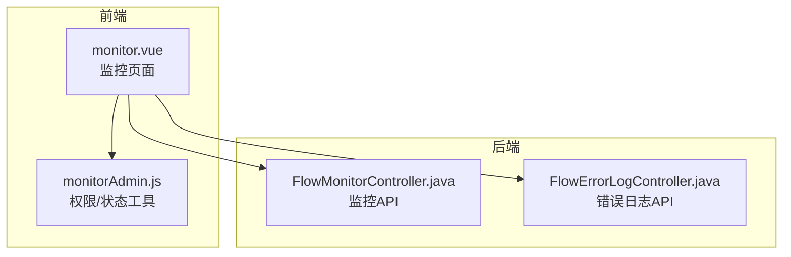
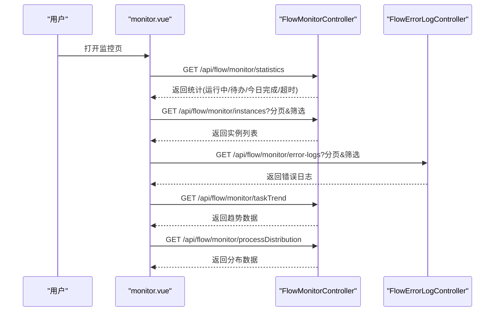
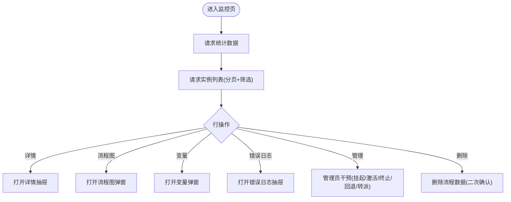
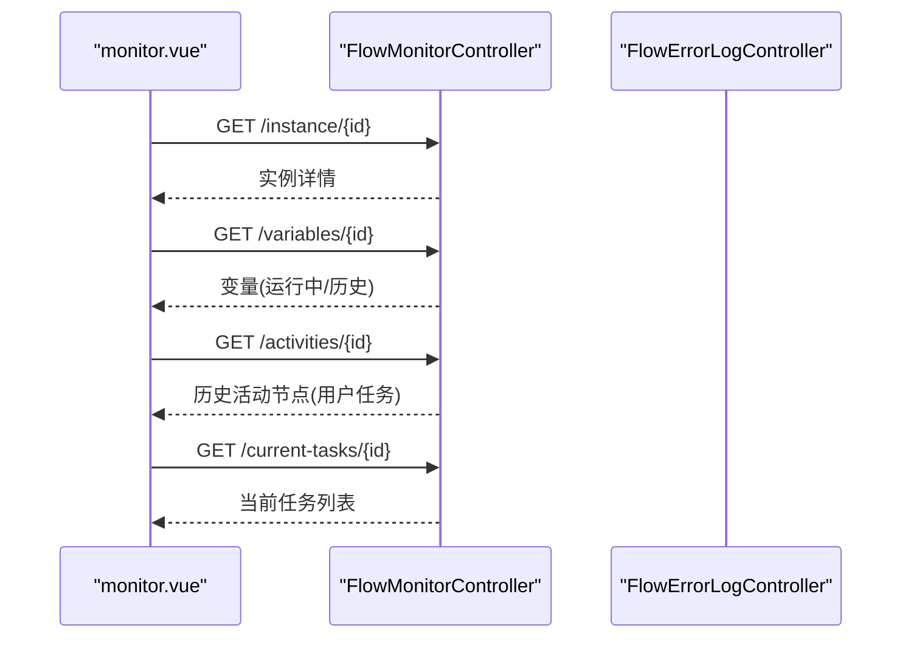
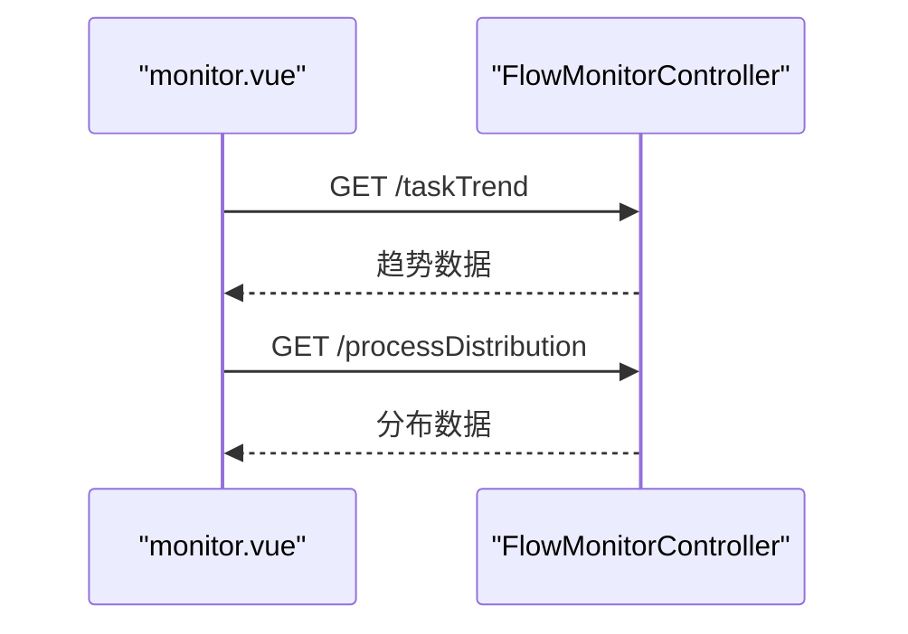
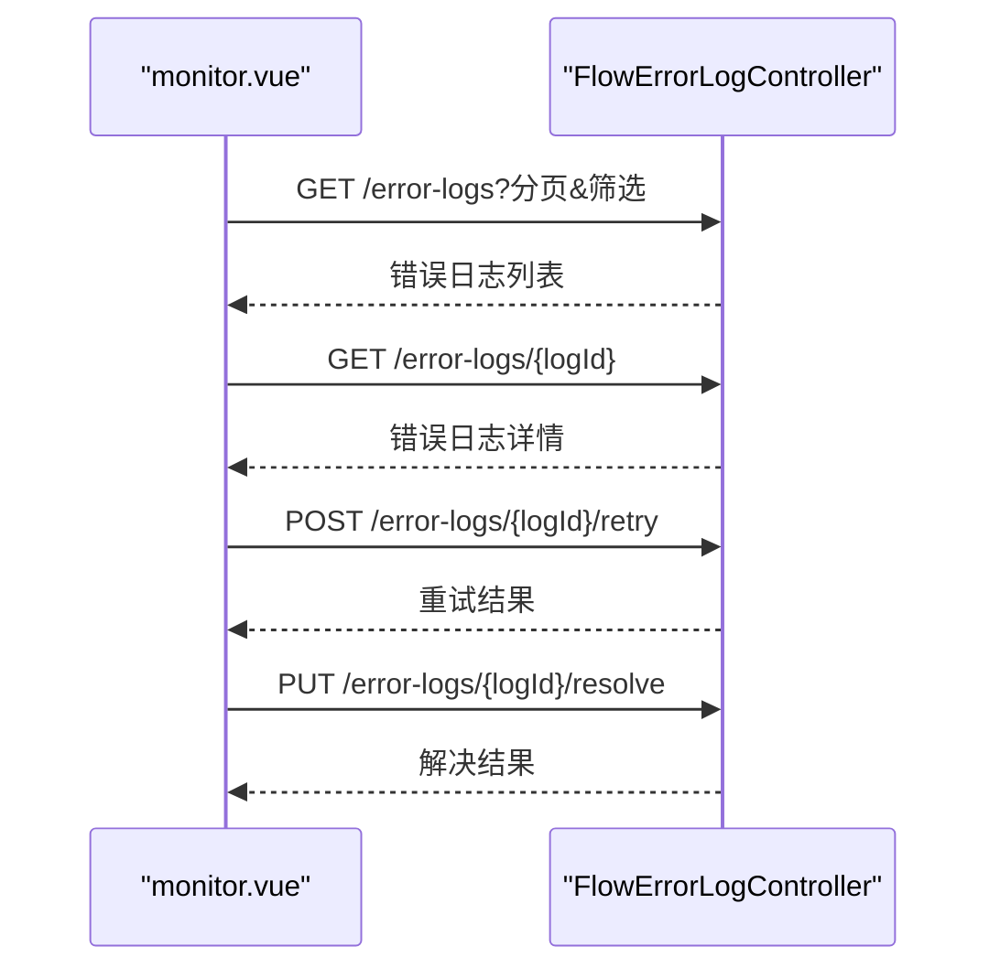
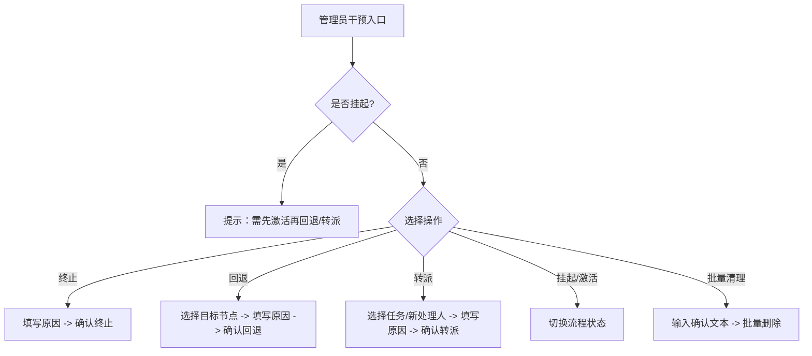
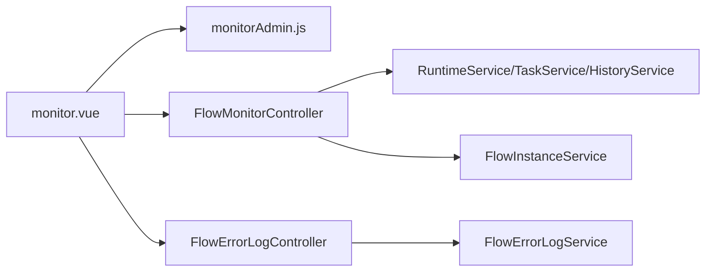

# 流程监控

<cite>
**本文引用的文件**
- [monitor.vue](file://forge-admin-ui/src/views/flow/monitor.vue)
- [FlowMonitorController.java](file://forge-server/forge-flow/forge-flow-server/src/main/java/com/mdframe/forge/flow/controller/FlowMonitorController.java)
- [FlowErrorLogController.java](file://forge-server/forge-flow/forge-flow-server/src/main/java/com/mdframe/forge/flow/controller/FlowErrorLogController.java)
- [monitorAdmin.js](file://forge-admin-ui/src/views/flow/utils/monitorAdmin.js)
</cite>

## 目录
1. [简介](#简介)
2. [项目结构](#项目结构)
3. [核心组件](#核心组件)
4. [架构总览](#架构总览)
5. [详细组件分析](#详细组件分析)
6. [依赖关系分析](#依赖关系分析)
7. [性能考虑](#性能考虑)
8. [故障排查指南](#故障排查指南)
9. [结论](#结论)
10. [附录](#附录)

## 简介
本文件面向 Forge Admin 的流程监控模块，系统性说明流程实例监控、执行追踪、性能分析与异常告警等能力。内容覆盖运行状态查看、节点进度跟踪、耗时统计、阻塞检测、监控仪表盘、实时图表、历史数据分析与指标配置，并提供最佳实践、性能调优策略、异常诊断方法以及监控数据导出与分析报告生成建议。

## 项目结构
前端以 Vue 页面集中承载监控能力，后端通过控制器暴露 REST API，统一封装权限校验、参数解析与业务服务调用。关键文件职责如下：
- 前端监控页面：负责统计卡片、搜索过滤、实例列表、错误日志抽屉、流程图展示、管理员干预操作、图表渲染等。
- 后端监控控制器：提供统计数据、实例分页查询、详情、趋势与分布、变量与活动节点、挂起/激活、终止/回退/转派、删除实例数据等接口。
- 错误日志控制器：提供错误日志分页、详情、统计、重试与解决接口。
- 前端工具函数：封装权限判断、状态归一化、表单查询构建、任务选项构建等。

**图示来源**
- [monitor.vue:1-800](file://forge-admin-ui/src/views/flow/monitor.vue#L1-L800)
- [FlowMonitorController.java:1-403](file://forge-server/forge-flow/forge-flow-server/src/main/java/com/mdframe/forge/flow/controller/FlowMonitorController.java#L1-L403)
- [FlowErrorLogController.java:1-147](file://forge-server/forge-flow/forge-flow-server/src/main/java/com/mdframe/forge/flow/controller/FlowErrorLogController.java#L1-L147)
- [monitorAdmin.js:1-76](file://forge-admin-ui/src/views/flow/utils/monitorAdmin.js#L1-L76)

**章节来源**
- [monitor.vue:1-800](file://forge-admin-ui/src/views/flow/monitor.vue#L1-L800)
- [FlowMonitorController.java:1-403](file://forge-server/forge-flow/forge-flow-server/src/main/java/com/mdframe/forge/flow/controller/FlowMonitorController.java#L1-L403)
- [FlowErrorLogController.java:1-147](file://forge-server/forge-flow/forge-flow-server/src/main/java/com/mdframe/forge/flow/controller/FlowErrorLogController.java#L1-L147)
- [monitorAdmin.js:1-76](file://forge-admin-ui/src/views/flow/utils/monitorAdmin.js#L1-L76)

## 核心组件
- 监控仪表盘与统计卡片
  - 运行中流程、待办任务、今日完成、超时任务（点击可快速筛选）。
  - 数据来源：后端统计接口。
- 流程实例列表与搜索
  - 支持按流程名称、发起人、状态、时间范围筛选；分页加载。
  - 行内操作：查看详情、查看流程图、查看变量、查看错误日志、管理员干预（需权限）、删除流程数据（需权限）。
- 错误日志管理
  - 抽屉式列表，支持按状态过滤；详情弹窗包含错误环节、类型、堆栈、重试次数等；支持重试与标记已解决。
- 管理员干预
  - 挂起/激活、终止、回退到历史节点、任务转派；对挂起状态有明确提示与约束。
- 图表与可视化
  - 任务处理趋势（近7天/近30天切换）；流程分布统计（按模型分组）。
  - 流程图查看：集成流程图查看器，支持在详情页与独立弹窗中查看。

**章节来源**
- [monitor.vue:1-800](file://forge-admin-ui/src/views/flow/monitor.vue#L1-L800)
- [FlowMonitorController.java:48-110](file://forge-server/forge-flow/forge-flow-server/src/main/java/com/mdframe/forge/flow/controller/FlowMonitorController.java#L48-L110)
- [FlowErrorLogController.java:35-95](file://forge-server/forge-flow/forge-flow-server/src/main/java/com/mdframe/forge/flow/controller/FlowErrorLogController.java#L35-L95)

## 架构总览
前后端通过 REST API 交互，前端页面发起请求获取统计数据、实例列表、图表数据、变量与活动节点等；后端控制器进行权限校验与参数解析后调用服务层完成业务逻辑。

**图示来源**
- [FlowMonitorController.java:48-110](file://forge-server/forge-flow/forge-flow-server/src/main/java/com/mdframe/forge/flow/controller/FlowMonitorController.java#L48-L110)
- [FlowErrorLogController.java:35-95](file://forge-server/forge-flow/forge-flow-server/src/main/java/com/mdframe/forge/flow/controller/FlowErrorLogController.java#L35-L95)
- [monitor.vue:232-258](file://forge-admin-ui/src/views/flow/monitor.vue#L232-L258)

## 详细组件分析

### 流程实例监控与列表
- 功能要点
  - 统计卡片：运行中、待办、今日完成、超时任务（点击跳转筛选）。
  - 搜索区：流程名称、发起人、状态、时间范围；支持重置。
  - 列表：分页、远程数据、列定义含状态、时长、操作等。
  - 行操作：详情、流程图、变量、错误日志、管理（权限控制）、删除（权限控制）。
- 权限控制
  - 基于路由按钮码与用户权限集合判定“查看”“管理”“清理”三类权限。
- 数据流
  - 列表与统计均通过后端监控控制器接口获取；错误日志通过错误日志控制器获取。

**图示来源**
- [monitor.vue:1-128](file://forge-admin-ui/src/views/flow/monitor.vue#L1-L128)
- [FlowMonitorController.java:57-92](file://forge-server/forge-flow/forge-flow-server/src/main/java/com/mdframe/forge/flow/controller/FlowMonitorController.java#L57-L92)
- [FlowErrorLogController.java:35-63](file://forge-server/forge-flow/forge-flow-server/src/main/java/com/mdframe/forge/flow/controller/FlowErrorLogController.java#L35-L63)

**章节来源**
- [monitor.vue:1-128](file://forge-admin-ui/src/views/flow/monitor.vue#L1-L128)
- [FlowMonitorController.java:57-92](file://forge-server/forge-flow/forge-flow-server/src/main/java/com/mdframe/forge/flow/controller/FlowMonitorController.java#L57-L92)
- [FlowErrorLogController.java:35-63](file://forge-server/forge-flow/forge-flow-server/src/main/java/com/mdframe/forge/flow/controller/FlowErrorLogController.java#L35-L63)
- [monitorAdmin.js:51-76](file://forge-admin-ui/src/views/flow/utils/monitorAdmin.js#L51-L76)

### 流程执行追踪与详情
- 详情抽屉
  - 基本信息：流程名称、状态、发起人、发起时间、当前节点、处理人。
  - 表单内容：只读表单面板，依据实例上下文动态构建查询参数。
  - 流程图：在折叠项中嵌入流程图查看器。
- 变量查看
  - 运行时优先读取变量；若已完成则从历史变量中聚合。
- 活动节点与当前任务
  - 用于管理员回退时选择目标节点；用于转派时选择当前任务。

**图示来源**
- [FlowMonitorController.java:85-110](file://forge-server/forge-flow/forge-flow-server/src/main/java/com/mdframe/forge/flow/controller/FlowMonitorController.java#L85-L110)
- [FlowMonitorController.java:238-346](file://forge-server/forge-flow/forge-flow-server/src/main/java/com/mdframe/forge/flow/controller/FlowMonitorController.java#L238-L346)
- [monitor.vue:268-354](file://forge-admin-ui/src/views/flow/monitor.vue#L268-L354)

**章节来源**
- [FlowMonitorController.java:85-110](file://forge-server/forge-flow/forge-flow-server/src/main/java/com/mdframe/forge/flow/controller/FlowMonitorController.java#L85-L110)
- [FlowMonitorController.java:238-346](file://forge-server/forge-flow/forge-flow-server/src/main/java/com/mdframe/forge/flow/controller/FlowMonitorController.java#L238-L346)
- [monitor.vue:268-354](file://forge-admin-ui/src/views/flow/monitor.vue#L268-L354)

### 流程性能分析与图表
- 任务处理趋势
  - 支持近7天/近30天切换；前端使用图表库渲染。
- 流程分布统计
  - 按流程模型分组统计，辅助识别热点流程。
- 运行时长
  - 列表展示运行时长字段，便于快速定位长耗时实例。

**图示来源**
- [FlowMonitorController.java:94-110](file://forge-server/forge-flow/forge-flow-server/src/main/java/com/mdframe/forge/flow/controller/FlowMonitorController.java#L94-L110)
- [monitor.vue:232-258](file://forge-admin-ui/src/views/flow/monitor.vue#L232-L258)

**章节来源**
- [FlowMonitorController.java:94-110](file://forge-server/forge-flow/forge-flow-server/src/main/java/com/mdframe/forge/flow/controller/FlowMonitorController.java#L94-L110)
- [monitor.vue:232-258](file://forge-admin-ui/src/views/flow/monitor.vue#L232-L258)

### 流程异常告警与错误日志
- 错误日志列表
  - 支持按流程实例ID、活动节点、状态筛选；分页展示。
- 错误详情
  - 展示错误环节、类型、信息、堆栈、重试次数、状态等。
- 重试与解决
  - 管理员可对符合条件的错误日志进行重试或标记为已解决。

**图示来源**
- [FlowErrorLogController.java:35-147](file://forge-server/forge-flow/forge-flow-server/src/main/java/com/mdframe/forge/flow/controller/FlowErrorLogController.java#L35-L147)
- [monitor.vue:130-230](file://forge-admin-ui/src/views/flow/monitor.vue#L130-L230)

**章节来源**
- [FlowErrorLogController.java:35-147](file://forge-server/forge-flow/forge-flow-server/src/main/java/com/mdframe/forge/flow/controller/FlowErrorLogController.java#L35-L147)
- [monitor.vue:130-230](file://forge-admin-ui/src/views/flow/monitor.vue#L130-L230)

### 管理员干预与流程治理
- 能力清单
  - 挂起/激活：对运行中或挂起的流程进行状态切换。
  - 终止：危险操作，需填写原因并二次确认。
  - 回退：选择历史用户任务节点回退，需填写原因。
  - 转派：选择当前任务与新处理人进行转派，需填写原因。
  - 批量清理：根据当前筛选条件批量删除流程数据，需输入确认文本。
- 权限与约束
  - 仅具备“管理”权限可见管理入口；挂起状态下部分操作需先激活。

**图示来源**
- [FlowMonitorController.java:112-236](file://forge-server/forge-flow/forge-flow-server/src/main/java/com/mdframe/forge/flow/controller/FlowMonitorController.java#L112-L236)
- [FlowMonitorController.java:348-382](file://forge-server/forge-flow/forge-flow-server/src/main/java/com/mdframe/forge/flow/controller/FlowMonitorController.java#L348-L382)
- [monitor.vue:356-452](file://forge-admin-ui/src/views/flow/monitor.vue#L356-L452)

**章节来源**
- [FlowMonitorController.java:112-236](file://forge-server/forge-flow/forge-flow-server/src/main/java/com/mdframe/forge/flow/controller/FlowMonitorController.java#L112-L236)
- [FlowMonitorController.java:348-382](file://forge-server/forge-flow/forge-flow-server/src/main/java/com/mdframe/forge/flow/controller/FlowMonitorController.java#L348-L382)
- [monitor.vue:356-452](file://forge-admin-ui/src/views/flow/monitor.vue#L356-L452)

## 依赖关系分析
- 前端依赖
  - monitor.vue 依赖 monitorAdmin.js 的权限与状态工具；依赖图表库渲染趋势与分布图；依赖流程图查看器与只读表单面板。
- 后端依赖
  - FlowMonitorController 依赖运行时服务、任务服务、历史服务与流程实例服务；FlowErrorLogController 依赖错误日志服务。
- 权限边界
  - 所有监控相关接口均受权限注解保护；前端通过权限工具函数控制菜单与按钮可见性。

**图示来源**
- [FlowMonitorController.java:1-47](file://forge-server/forge-flow/forge-flow-server/src/main/java/com/mdframe/forge/flow/controller/FlowMonitorController.java#L1-L47)
- [FlowErrorLogController.java:1-34](file://forge-server/forge-flow/forge-flow-server/src/main/java/com/mdframe/forge/flow/controller/FlowErrorLogController.java#L1-L34)
- [monitor.vue:464-487](file://forge-admin-ui/src/views/flow/monitor.vue#L464-L487)
- [monitorAdmin.js:51-76](file://forge-admin-ui/src/views/flow/utils/monitorAdmin.js#L51-L76)

**章节来源**
- [FlowMonitorController.java:1-47](file://forge-server/forge-flow/forge-flow-server/src/main/java/com/mdframe/forge/flow/controller/FlowMonitorController.java#L1-L47)
- [FlowErrorLogController.java:1-34](file://forge-server/forge-flow/forge-flow-server/src/main/java/com/mdframe/forge/flow/controller/FlowErrorLogController.java#L1-L34)
- [monitor.vue:464-487](file://forge-admin-ui/src/views/flow/monitor.vue#L464-L487)
- [monitorAdmin.js:51-76](file://forge-admin-ui/src/views/flow/utils/monitorAdmin.js#L51-L76)

## 性能考虑
- 列表与图表
  - 使用分页与远程数据加载，避免一次性拉取大量数据；合理设置每页大小。
  - 图表周期可选（7天/30天），减少大数据量渲染压力。
- 变量与活动节点
  - 变量读取优先运行时，失败或完成后回退至历史变量；活动节点仅返回用户任务，降低数据量。
- 错误日志
  - 错误日志分页查询，避免全表扫描；统计接口异常时降级返回默认值。
- 管理员操作
  - 批量清理需确认文本，防止误删；危险操作二次确认。

[本节为通用性能建议，不直接分析具体文件]

## 故障排查指南
- 常见问题定位
  - 无法查看统计/列表：检查权限是否包含“flow:monitor:view”。
  - 错误日志为空：确认筛选条件与租户隔离；查看后端日志输出。
  - 变量为空：流程可能已完成且无历史变量；或运行时不可用。
  - 管理员操作被拒绝：检查流程状态（挂起/非运行）与权限。
- 调试建议
  - 使用浏览器开发者工具查看网络请求与响应。
  - 关注后端日志中的错误堆栈与提示信息。
  - 对重试与解决操作，记录原因以便审计。

**章节来源**
- [FlowErrorLogController.java:57-63](file://forge-server/forge-flow/forge-flow-server/src/main/java/com/mdframe/forge/flow/controller/FlowErrorLogController.java#L57-L63)
- [FlowErrorLogController.java:84-95](file://forge-server/forge-flow/forge-flow-server/src/main/java/com/mdframe/forge/flow/controller/FlowErrorLogController.java#L84-L95)
- [FlowMonitorController.java:271-274](file://forge-server/forge-flow/forge-flow-server/src/main/java/com/mdframe/forge/flow/controller/FlowMonitorController.java#L271-L274)
- [FlowMonitorController.java:357-381](file://forge-server/forge-flow/forge-flow-server/src/main/java/com/mdframe/forge/flow/controller/FlowMonitorController.java#L357-L381)

## 结论
Forge Admin 流程监控模块提供了完整的实例监控、执行追踪、性能分析与异常处理能力。通过清晰的权限边界、友好的交互设计与稳健的后端接口，满足日常运维与治理需求。建议结合分页与图表优化体验，配合错误日志与管理员干预提升问题处置效率。

[本节为总结性内容，不直接分析具体文件]

## 附录

### 监控指标与配置建议
- 指标采集
  - 运行中实例数、待办任务数、今日完成数、超时任务数。
  - 任务处理趋势（日粒度）、流程分布（按模型）。
- 配置建议
  - 图表周期默认7天，可按需要扩展至30天或自定义区间。
  - 列表默认每页10条，可根据数据量调整。
  - 错误日志分页默认10条，建议结合筛选条件缩小范围。

[本节为概念性配置建议，不直接分析具体文件]

### 最佳实践
- 实时监控
  - 定期刷新统计与列表；对超时任务快速定位与处理。
- 性能调优
  - 合理使用分页与筛选；避免频繁拉取大图或大变量。
  - 对热点流程进行专项监控与容量评估。
- 异常诊断
  - 优先查看错误日志详情与堆栈；必要时重试并记录原因。
  - 对反复失败的节点进行根因分析与流程优化。
- 数据导出与报告
  - 基于列表与图表数据进行人工导出；结合报表系统生成周期性分析报告。
  - 将关键指标纳入运营看板，持续跟踪改进效果。

[本节为通用实践建议，不直接分析具体文件]