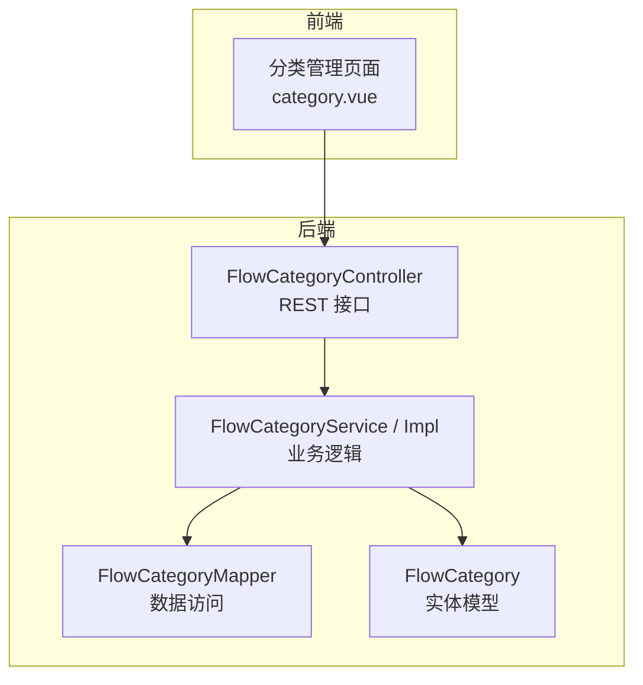
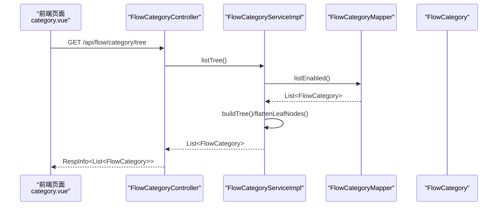
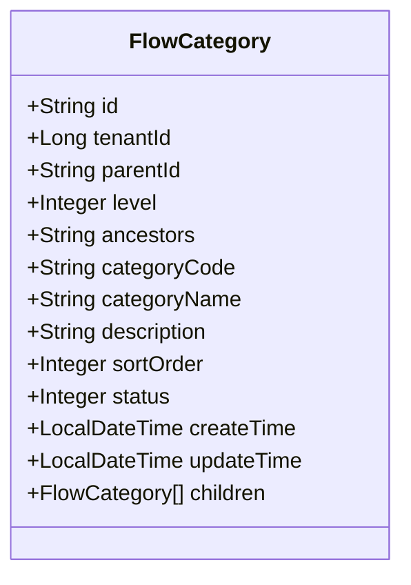
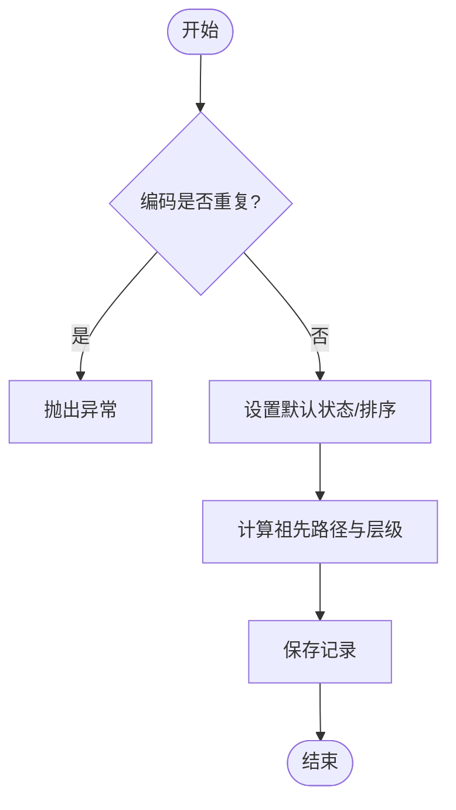
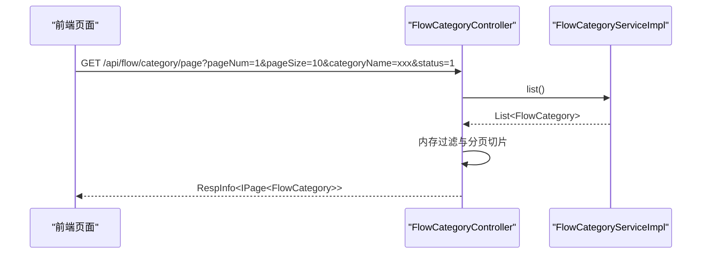
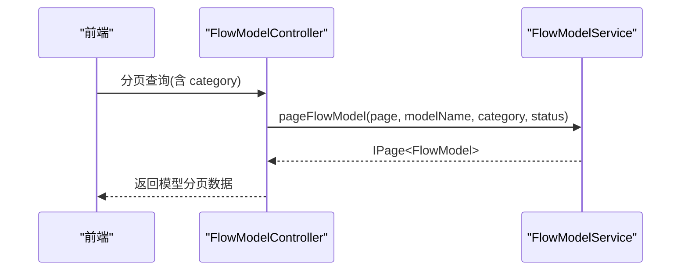
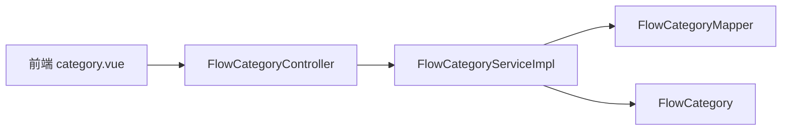

# 流程分类管理

<cite>
**本文引用的文件**
- [FlowCategoryController.java](file://forge-server/forge-flow/forge-flow-server/src/main/java/com/mdframe/forge/flow/controller/FlowCategoryController.java)
- [FlowCategoryService.java](file://forge-server/forge-framework/forge-plugin-parent/forge-plugin-flow/src/main/java/com/mdframe/forge/starter/flow/service/FlowCategoryService.java)
- [FlowCategoryServiceImpl.java](file://forge-server/forge-framework/forge-plugin-parent/forge-plugin-flow/src/main/java/com/mdframe/forge/starter/flow/service/impl/FlowCategoryServiceImpl.java)
- [FlowCategory.java](file://forge-server/forge-framework/forge-plugin-parent/forge-plugin-flow/src/main/java/com/mdframe/forge/starter/flow/entity/FlowCategory.java)
- [FlowCategoryMapper.java](file://forge-server/forge-framework/forge-plugin-parent/forge-plugin-flow/src/main/java/com/mdframe/forge/starter/flow/mapper/FlowCategoryMapper.java)
- [category.vue](file://forge-admin-ui/src/views/flow/category.vue)
- [FlowModelController.java](file://forge-server/forge-flow/forge-flow-server/src/main/java/com/mdframe/forge/flow/controller/FlowModelController.java)
</cite>

## 目录
1. [简介](#简介)
2. [项目结构](#项目结构)
3. [核心组件](#核心组件)
4. [架构总览](#架构总览)
5. [详细组件分析](#详细组件分析)
6. [依赖关系分析](#依赖关系分析)
7. [性能考虑](#性能考虑)
8. [故障排查指南](#故障排查指南)
9. [结论](#结论)
10. [附录](#附录)

## 简介
本文件面向 Forge Admin 的流程分类管理功能，系统性说明分类的树形结构设计、CRUD 操作、与流程模型的关联、权限控制要点、数据迁移注意事项，以及最佳实践、命名规范、治理策略和性能优化建议。文档以代码为依据，结合前后端实现进行讲解，帮助读者快速掌握并正确使用该能力。

## 项目结构
流程分类管理由后端控制器、服务层、实体与 Mapper，以及前端页面共同组成：
- 后端控制器暴露 REST 接口，提供分类的树形列表、分页查询、创建/更新/删除、启用/禁用等能力。
- 服务层封装业务逻辑，包括树构建、祖先路径维护、状态切换、子节点检查等。
- 实体定义数据库表结构与字段语义（含层级、祖先路径、排序、状态等）。
- Mapper 为 MyBatis-Plus 的基础映射接口。
- 前端页面提供分类树展示、搜索过滤、新增/编辑/删除、状态切换等操作界面。

图表来源
- [FlowCategoryController.java:19-149](file://forge-server/forge-flow/forge-flow-server/src/main/java/com/mdframe/forge/flow/controller/FlowCategoryController.java#L19-L149)
- [FlowCategoryService.java:11-63](file://forge-server/forge-framework/forge-plugin-parent/forge-plugin-flow/src/main/java/com/mdframe/forge/starter/flow/service/FlowCategoryService.java#L11-L63)
- [FlowCategoryServiceImpl.java:21-190](file://forge-server/forge-framework/forge-plugin-parent/forge-plugin-flow/src/main/java/com/mdframe/forge/starter/flow/service/impl/FlowCategoryServiceImpl.java#L21-L190)
- [FlowCategory.java:12-82](file://forge-server/forge-framework/forge-plugin-parent/forge-plugin-flow/src/main/java/com/mdframe/forge/starter/flow/entity/FlowCategory.java#L12-L82)
- [FlowCategoryMapper.java:1-12](file://forge-server/forge-framework/forge-plugin-parent/forge-plugin-flow/src/main/java/com/mdframe/forge/starter/flow/mapper/FlowCategoryMapper.java#L1-L12)
- [category.vue:1-640](file://forge-admin-ui/src/views/flow/category.vue#L1-L640)

章节来源
- [FlowCategoryController.java:19-149](file://forge-server/forge-flow/forge-flow-server/src/main/java/com/mdframe/forge/flow/controller/FlowCategoryController.java#L19-L149)
- [FlowCategoryService.java:11-63](file://forge-server/forge-framework/forge-plugin-parent/forge-plugin-flow/src/main/java/com/mdframe/forge/starter/flow/service/FlowCategoryService.java#L11-L63)
- [FlowCategoryServiceImpl.java:21-190](file://forge-server/forge-framework/forge-plugin-parent/forge-plugin-flow/src/main/java/com/mdframe/forge/starter/flow/service/impl/FlowCategoryServiceImpl.java#L21-L190)
- [FlowCategory.java:12-82](file://forge-server/forge-framework/forge-plugin-parent/forge-plugin-flow/src/main/java/com/mdframe/forge/starter/flow/entity/FlowCategory.java#L12-L82)
- [FlowCategoryMapper.java:1-12](file://forge-server/forge-framework/forge-plugin-parent/forge-plugin-flow/src/main/java/com/mdframe/forge/starter/flow/mapper/FlowCategoryMapper.java#L1-L12)
- [category.vue:1-640](file://forge-admin-ui/src/views/flow/category.vue#L1-L640)

## 核心组件
- 控制器 FlowCategoryController：对外暴露分类管理的 REST API，包含获取启用列表、树形列表、下拉树、分页查询、详情、按编码查询、创建、更新、删除、启用/禁用等接口。
- 服务 FlowCategoryService/Impl：实现分类的树构建、叶子节点扁平化、祖先路径与层级维护、状态切换、子节点存在性检查、创建/更新/删除等业务逻辑。
- 实体 FlowCategory：描述分类的数据结构，包含租户、父ID、层级、祖先路径、编码、名称、描述、排序、状态、时间戳及子节点集合。
- Mapper FlowCategoryMapper：基于 MyBatis-Plus 的基础数据访问接口。
- 前端 category.vue：提供分类树展示、搜索过滤、新增/编辑/删除、状态切换、父级选择等交互。

章节来源
- [FlowCategoryController.java:19-149](file://forge-server/forge-flow/forge-flow-server/src/main/java/com/mdframe/forge/flow/controller/FlowCategoryController.java#L19-L149)
- [FlowCategoryService.java:11-63](file://forge-server/forge-framework/forge-plugin-parent/forge-plugin-flow/src/main/java/com/mdframe/forge/starter/flow/service/FlowCategoryService.java#L11-L63)
- [FlowCategoryServiceImpl.java:21-190](file://forge-server/forge-framework/forge-plugin-parent/forge-plugin-flow/src/main/java/com/mdframe/forge/starter/flow/service/impl/FlowCategoryServiceImpl.java#L21-L190)
- [FlowCategory.java:12-82](file://forge-server/forge-framework/forge-plugin-parent/forge-plugin-flow/src/main/java/com/mdframe/forge/starter/flow/entity/FlowCategory.java#L12-L82)
- [FlowCategoryMapper.java:1-12](file://forge-server/forge-framework/forge-plugin-parent/forge-plugin-flow/src/main/java/com/mdframe/forge/starter/flow/mapper/FlowCategoryMapper.java#L1-L12)
- [category.vue:1-640](file://forge-admin-ui/src/views/flow/category.vue#L1-L640)

## 架构总览
以下序列图展示了“获取分类树”的典型调用链路：前端请求控制器，控制器调用服务层构建树并返回。

图表来源
- [FlowCategoryController.java:41-45](file://forge-server/forge-flow/forge-flow-server/src/main/java/com/mdframe/forge/flow/controller/FlowCategoryController.java#L41-L45)
- [FlowCategoryServiceImpl.java:41-56](file://forge-server/forge-framework/forge-plugin-parent/forge-plugin-flow/src/main/java/com/mdframe/forge/starter/flow/service/impl/FlowCategoryServiceImpl.java#L41-L56)
- [FlowCategoryServiceImpl.java:61-89](file://forge-server/forge-framework/forge-plugin-parent/forge-plugin-flow/src/main/java/com/mdframe/forge/starter/flow/service/impl/FlowCategoryServiceImpl.java#L61-L89)
- [FlowCategory.java:12-82](file://forge-server/forge-framework/forge-plugin-parent/forge-plugin-flow/src/main/java/com/mdframe/forge/starter/flow/entity/FlowCategory.java#L12-L82)

## 详细组件分析

### 分类数据模型与树形结构
- 字段设计：
  - 父子关系：parentId 表示父分类，根节点为空或空字符串。
  - 层级：level 表示深度，便于展示与限制。
  - 祖先路径：ancestors 用于快速定位祖先链，支持范围查询与排序。
  - 唯一标识：id 使用 UUID；categoryCode 作为业务编码。
  - 状态：status 表示启用/禁用。
  - 排序：sortOrder 用于同级排序。
  - 子节点：children 用于树形展示（非持久化字段）。
- 树构建：
  - 通过递归将扁平列表组装为树结构。
  - 支持仅返回叶子节点的扁平化结果，用于选择器场景。

图表来源
- [FlowCategory.java:12-82](file://forge-server/forge-framework/forge-plugin-parent/forge-plugin-flow/src/main/java/com/mdframe/forge/starter/flow/entity/FlowCategory.java#L12-L82)

章节来源
- [FlowCategory.java:12-82](file://forge-server/forge-framework/forge-plugin-parent/forge-plugin-flow/src/main/java/com/mdframe/forge/starter/flow/entity/FlowCategory.java#L12-L82)
- [FlowCategoryServiceImpl.java:61-89](file://forge-server/forge-framework/forge-plugin-parent/forge-plugin-flow/src/main/java/com/mdframe/forge/starter/flow/service/impl/FlowCategoryServiceImpl.java#L61-L89)

### CRUD 与状态管理
- 创建：
  - 校验编码唯一性。
  - 默认状态为启用，默认排序为 0。
  - 计算 ancestors 与 level，保存后返回。
- 更新：
  - 若父分类变更，重新计算 ancestors 与 level。
- 删除：
  - 若存在子分类则拒绝删除，保证树完整性。
- 启用/禁用：
  - 直接更新状态字段。

图表来源
- [FlowCategoryServiceImpl.java:123-145](file://forge-server/forge-framework/forge-plugin-parent/forge-plugin-flow/src/main/java/com/mdframe/forge/starter/flow/service/impl/FlowCategoryServiceImpl.java#L123-L145)
- [FlowCategoryServiceImpl.java:147-156](file://forge-server/forge-framework/forge-plugin-parent/forge-plugin-flow/src/main/java/com/mdframe/forge/starter/flow/service/impl/FlowCategoryServiceImpl.java#L147-L156)
- [FlowCategoryServiceImpl.java:158-167](file://forge-server/forge-framework/forge-plugin-parent/forge-plugin-flow/src/main/java/com/mdframe/forge/starter/flow/service/impl/FlowCategoryServiceImpl.java#L158-L167)

章节来源
- [FlowCategoryServiceImpl.java:123-190](file://forge-server/forge-framework/forge-plugin-parent/forge-plugin-flow/src/main/java/com/mdframe/forge/starter/flow/service/impl/FlowCategoryServiceImpl.java#L123-L190)

### 分页与搜索过滤
- 分页接口：
  - 接收 pageNum、pageSize、categoryName、status 参数。
  - 先全量查询再在内存中过滤与切片，返回 IPage。
- 前端筛选：
  - 支持按分类名称、编码、状态进行筛选。
  - 点击搜索/重置触发刷新。

图表来源
- [FlowCategoryController.java:61-84](file://forge-server/forge-flow/forge-flow-server/src/main/java/com/mdframe/forge/flow/controller/FlowCategoryController.java#L61-L84)
- [category.vue:25-66](file://forge-admin-ui/src/views/flow/category.vue#L25-L66)
- [category.vue:304-323](file://forge-admin-ui/src/views/flow/category.vue#L304-L323)

章节来源
- [FlowCategoryController.java:61-84](file://forge-server/forge-flow/forge-flow-server/src/main/java/com/mdframe/forge/flow/controller/FlowCategoryController.java#L61-L84)
- [category.vue:25-66](file://forge-admin-ui/src/views/flow/category.vue#L25-L66)
- [category.vue:304-323](file://forge-admin-ui/src/views/flow/category.vue#L304-L323)

### 分类与流程模型的关联
- 流程模型控制器支持按分类查询模型列表，体现分类对流程模型的归类作用。
- 典型用法：
  - 分页查询时传入 category 参数。
  - 获取启用模型时可按分类过滤。

图表来源
- [FlowModelController.java:45-55](file://forge-server/forge-flow/forge-flow-server/src/main/java/com/mdframe/forge/flow/controller/FlowModelController.java#L45-L55)

章节来源
- [FlowModelController.java:45-55](file://forge-server/forge-flow/forge-flow-server/src/main/java/com/mdframe/forge/flow/controller/FlowModelController.java#L45-L55)

### 权限控制要点
- 控制器标注了忽略租户注解，表明分类接口在当前实现中不强制租户隔离。
- 实际生产环境建议结合统一鉴权机制，对分类的增删改查与状态切换进行细粒度权限控制。

章节来源
- [FlowCategoryController.java:19-25](file://forge-server/forge-flow/forge-flow-server/src/main/java/com/mdframe/forge/flow/controller/FlowCategoryController.java#L19-L25)

### 数据迁移与初始化
- 实体映射到表 sys_flow_category，包含 id、tenant_id、parent_id、level、ancestors、category_code、category_name、description、sort_order、status、create_time、update_time 等字段。
- 建议在部署脚本或迁移工具中确保表结构一致，并为常用查询字段建立索引（如 parent_id、status、category_code、sort_order）。

章节来源
- [FlowCategory.java:12-82](file://forge-server/forge-framework/forge-plugin-parent/forge-plugin-flow/src/main/java/com/mdframe/forge/starter/flow/entity/FlowCategory.java#L12-L82)

## 依赖关系分析
- 控制器依赖服务层，服务层依赖 Mapper 与实体。
- 前端页面通过 REST 接口与后端交互，使用树形数据结构进行展示与选择。

图表来源
- [FlowCategoryController.java:19-149](file://forge-server/forge-flow/forge-flow-server/src/main/java/com/mdframe/forge/flow/controller/FlowCategoryController.java#L19-L149)
- [FlowCategoryServiceImpl.java:21-190](file://forge-server/forge-framework/forge-plugin-parent/forge-plugin-flow/src/main/java/com/mdframe/forge/starter/flow/service/impl/FlowCategoryServiceImpl.java#L21-L190)
- [FlowCategoryMapper.java:1-12](file://forge-server/forge-framework/forge-plugin-parent/forge-plugin-flow/src/main/java/com/mdframe/forge/starter/flow/mapper/FlowCategoryMapper.java#L1-L12)
- [FlowCategory.java:12-82](file://forge-server/forge-framework/forge-plugin-parent/forge-plugin-flow/src/main/java/com/mdframe/forge/starter/flow/entity/FlowCategory.java#L12-L82)
- [category.vue:1-640](file://forge-admin-ui/src/views/flow/category.vue#L1-L640)

章节来源
- [FlowCategoryController.java:19-149](file://forge-server/forge-flow/forge-flow-server/src/main/java/com/mdframe/forge/flow/controller/FlowCategoryController.java#L19-L149)
- [FlowCategoryServiceImpl.java:21-190](file://forge-server/forge-framework/forge-plugin-parent/forge-plugin-flow/src/main/java/com/mdframe/forge/starter/flow/service/impl/FlowCategoryServiceImpl.java#L21-L190)
- [FlowCategoryMapper.java:1-12](file://forge-server/forge-framework/forge-plugin-parent/forge-plugin-flow/src/main/java/com/mdframe/forge/starter/flow/mapper/FlowCategoryMapper.java#L1-L12)
- [FlowCategory.java:12-82](file://forge-server/forge-framework/forge-plugin-parent/forge-plugin-flow/src/main/java/com/mdframe/forge/starter/flow/entity/FlowCategory.java#L12-L82)
- [category.vue:1-640](file://forge-admin-ui/src/views/flow/category.vue#L1-L640)

## 性能考虑
- 树构建复杂度：
  - 当前实现采用递归构建，时间复杂度近似 O(n^2)，在分类数量较大时可能成为瓶颈。
  - 建议优化为一次遍历+哈希表聚合，将复杂度降至 O(n)。
- 分页与过滤：
  - 当前分页在内存中进行，适合中小规模数据；大数据量建议改为数据库层分页与过滤。
- 祖先路径与层级：
  - 利用 ancestors 字段可加速祖先链查询与排序，但需保证写入时的正确性与一致性。
- 缓存建议：
  - 对频繁读取的分类树可进行短期缓存，减少数据库压力。
- 索引建议：
  - 为 parent_id、status、category_code、sort_order 建立合适索引以提升查询效率。

[本节为通用性能讨论，无需具体文件引用]

## 故障排查指南
- 删除失败：
  - 现象：提示存在子分类无法删除。
  - 原因：hasChildren 检测到子节点。
  - 处理：先删除或移动子分类后再执行删除。
- 编码冲突：
  - 现象：创建时报错编码已存在。
  - 原因：全局唯一性校验未通过。
  - 处理：更换唯一编码或清理重复数据。
- 分页结果异常：
  - 现象：分页总数与实际不符。
  - 原因：内存过滤与切片逻辑可能导致边界问题。
  - 处理：确认过滤条件与分页参数；必要时改为数据库层分页。
- 树显示不正确：
  - 现象：层级或父子关系错误。
  - 原因：祖先路径或层级未正确计算。
  - 处理：检查创建/更新时对 ancestors 与 level 的计算逻辑。

章节来源
- [FlowCategoryServiceImpl.java:158-167](file://forge-server/forge-framework/forge-plugin-parent/forge-plugin-flow/src/main/java/com/mdframe/forge/starter/flow/service/impl/FlowCategoryServiceImpl.java#L158-L167)
- [FlowCategoryServiceImpl.java:123-145](file://forge-server/forge-framework/forge-plugin-parent/forge-plugin-flow/src/main/java/com/mdframe/forge/starter/flow/service/impl/FlowCategoryServiceImpl.java#L123-L145)
- [FlowCategoryController.java:61-84](file://forge-server/forge-flow/forge-flow-server/src/main/java/com/mdframe/forge/flow/controller/FlowCategoryController.java#L61-L84)

## 结论
流程分类管理提供了完整的树形结构管理能力，涵盖分类的创建、更新、删除、启用/禁用、树形展示与选择、分页与搜索等功能。通过合理的字段设计与服务层逻辑，保证了分类数据的层次性与一致性。在生产环境中，建议结合权限体系与性能优化策略，进一步提升系统的可用性与扩展性。

[本节为总结性内容，无需具体文件引用]

## 附录

### 分类最佳实践
- 合理划分层级：一般不超过 3-4 层，避免过深导致维护困难。
- 使用编码作为稳定标识：categoryCode 应稳定且具业务含义，便于跨系统引用。
- 明确状态管理：启用/禁用用于控制可见性与可用性，避免误用。
- 排序与展示：通过 sortOrder 控制同级顺序，提升用户体验。

[本节为通用指导，无需具体文件引用]

### 分类命名规范
- 编码规范：建议使用英文小写与下划线，避免特殊字符。
- 名称规范：简洁明了，体现业务含义，避免过长。
- 层级规范：根节点代表大领域，子节点逐步细化。

[本节为通用指导，无需具体文件引用]

### 分类治理策略
- 定期审计：清理无用分类，合并重复分类。
- 权限治理：按角色分配分类管理权限，最小化授权。
- 变更管控：重要分类变更需评审与记录，避免影响下游流程。

[本节为通用指导，无需具体文件引用]

### 分类性能优化建议
- 树构建优化：从递归改为一次遍历+哈希聚合。
- 分页优化：将过滤与分页下沉至数据库层。
- 缓存策略：对热点分类树进行缓存，降低数据库压力。
- 索引优化：为高频查询字段建立索引。

[本节为通用指导，无需具体文件引用]