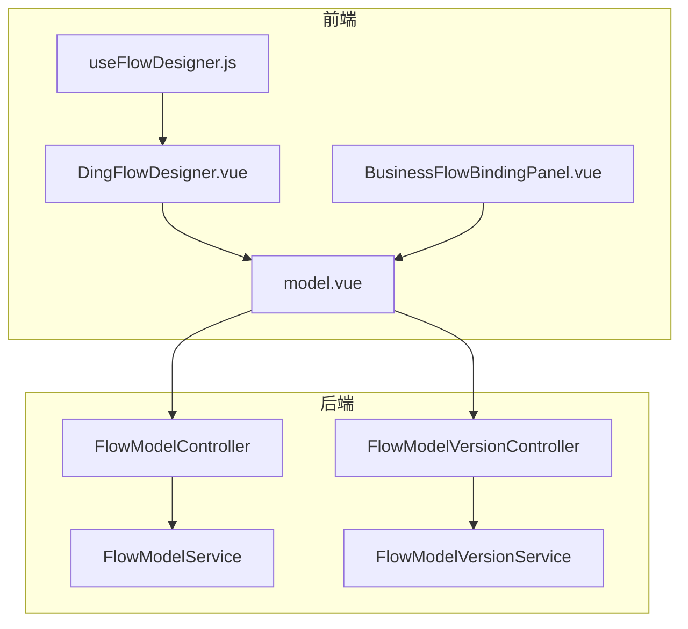
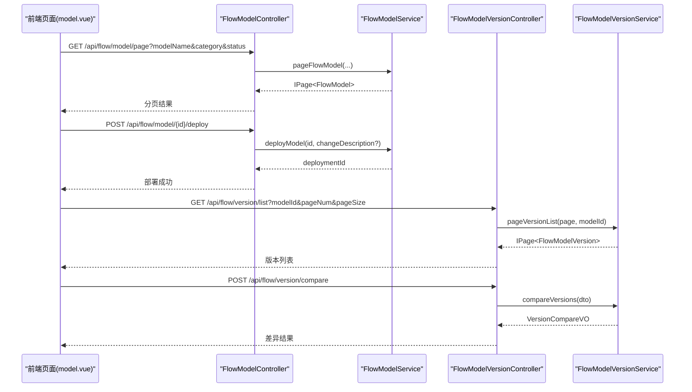
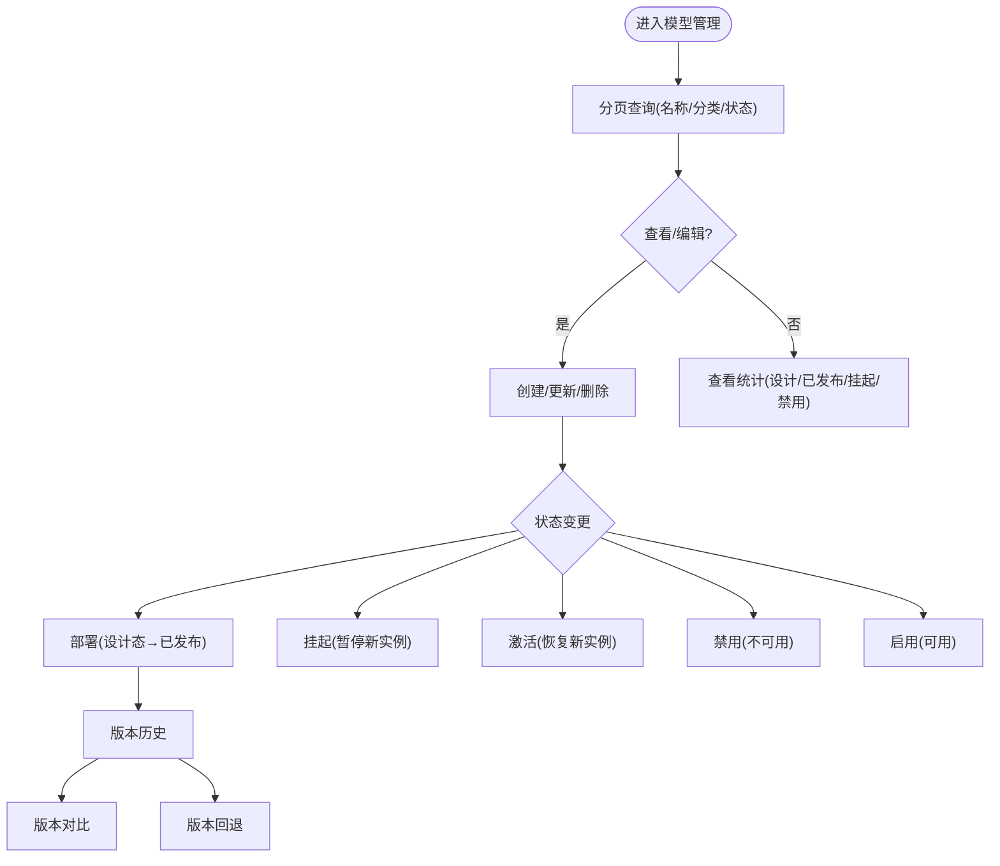
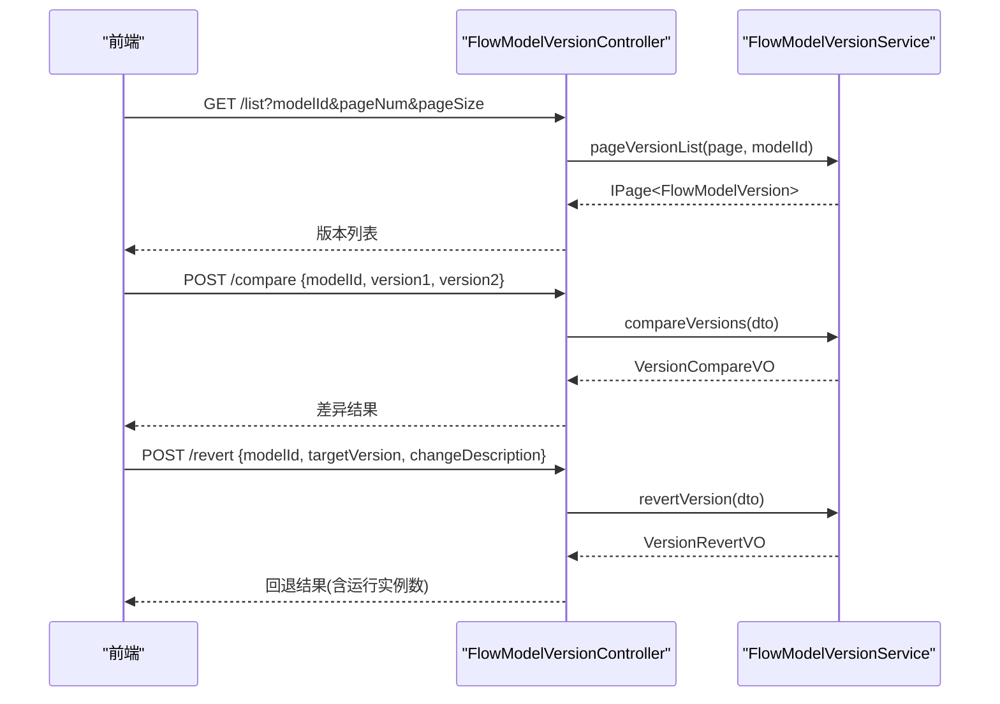
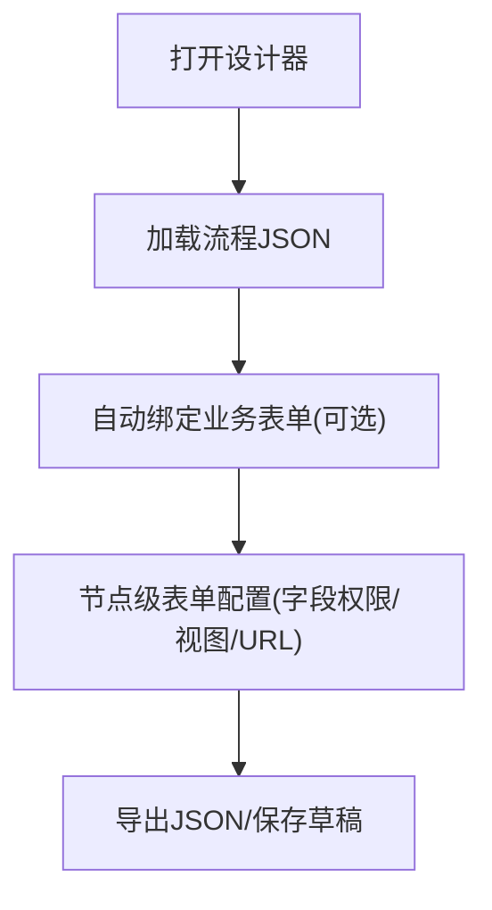
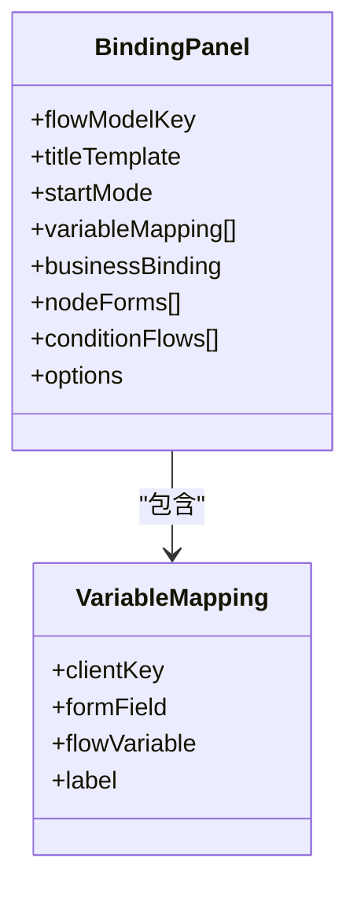
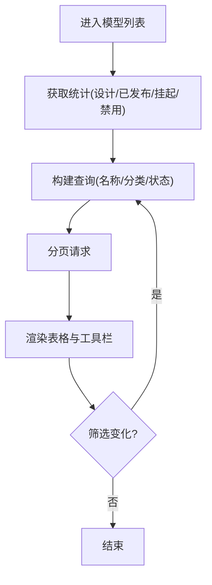
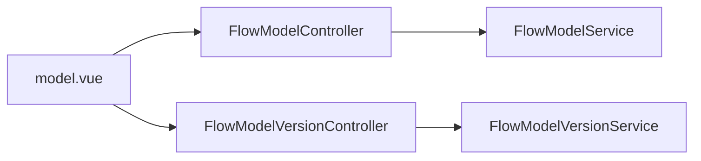

# 流程模型管理

<cite>
**本文引用的文件**
- [FlowModelController.java](file://forge-server/forge-flow/forge-flow-server/src/main/java/com/mdframe/forge/flow/controller/FlowModelController.java)
- [FlowModelService.java](file://forge-server/forge-framework/forge-plugin-parent/forge-plugin-flow/src/main/java/com/mdframe/forge/starter/flow/service/FlowModelService.java)
- [FlowModelVersionController.java](file://forge-server/forge-flow/forge-flow-server/src/main/java/com/mdframe/forge/flow/controller/FlowModelVersionController.java)
- [FlowModelVersionService.java](file://forge-server/forge-framework/forge-plugin-parent/forge-plugin-flow/src/main/java/com/mdframe/forge/starter/flow/service/FlowModelVersionService.java)
- [model.vue](file://forge-admin-ui/src/views/flow/model.vue)
- [DingFlowDesigner.vue](file://forge-admin-ui/src/components/flow-designer/DingFlowDesigner.vue)
- [BusinessFlowBindingPanel.vue](file://forge-admin-ui/src/views/app-center/components/designer/BusinessFlowBindingPanel.vue)
- [useFlowDesigner.js](file://forge-admin-ui/src/components/flow-designer/composables/useFlowDesigner.js)
- [tasks.md](file://code-copilot/changes/archive/2026-05-09-flow-model-version-management/tasks.md)
</cite>

## 目录
1. [简介](#简介)
2. [项目结构](#项目结构)
3. [核心组件](#核心组件)
4. [架构总览](#架构总览)
5. [详细组件分析](#详细组件分析)
6. [依赖关系分析](#依赖关系分析)
7. [性能考虑](#性能考虑)
8. [故障排查指南](#故障排查指南)
9. [结论](#结论)
10. [附录](#附录)

## 简介
本章节面向Forge Admin的流程模型管理功能，系统性说明以下能力：
- 流程模型的CRUD操作、状态管理（设计态、已发布、挂起、禁用）、版本控制机制
- 与设计器集成、业务对象绑定、表单配置、分类标签管理
- 模型统计信息展示、批量操作、搜索过滤、分页查询
- 模型导入导出、复制、删除等高级操作
- 权限控制与最佳实践建议

## 项目结构
后端以控制器-服务分层组织，前端以视图与组件解耦。关键路径如下：
- 后端控制器：流程模型与版本管理的REST接口
- 后端服务：模型生命周期、状态切换、版本对比与回退
- 前端页面：模型列表、统计、搜索、分页、版本历史入口
- 设计器与绑定面板：流程节点与业务表单的绑定配置

图表来源
- [FlowModelController.java:20-232](file://forge-server/forge-flow/forge-flow-server/src/main/java/com/mdframe/forge/flow/controller/FlowModelController.java#L20-L232)
- [FlowModelVersionController.java:35-60](file://forge-server/forge-flow/forge-flow-server/src/main/java/com/mdframe/forge/flow/controller/FlowModelVersionController.java#L35-L60)
- [FlowModelService.java:15-112](file://forge-server/forge-framework/forge-plugin-parent/forge-plugin-flow/src/main/java/com/mdframe/forge/starter/flow/service/FlowModelService.java#L15-L112)
- [FlowModelVersionService.java:14-29](file://forge-server/forge-framework/forge-plugin-parent/forge-plugin-flow/src/main/java/com/mdframe/forge/starter/flow/service/FlowModelVersionService.java#L14-L29)
- [model.vue:698-742](file://forge-admin-ui/src/views/flow/model.vue#L698-L742)

章节来源
- [FlowModelController.java:20-232](file://forge-server/forge-flow/forge-flow-server/src/main/java/com/mdframe/forge/flow/controller/FlowModelController.java#L20-L232)
- [FlowModelService.java:15-112](file://forge-server/forge-framework/forge-plugin-parent/forge-plugin-flow/src/main/java/com/mdframe/forge/starter/flow/service/FlowModelService.java#L15-L112)
- [FlowModelVersionController.java:35-60](file://forge-server/forge-flow/forge-flow-server/src/main/java/com/mdframe/forge/flow/controller/FlowModelVersionController.java#L35-L60)
- [FlowModelVersionService.java:14-29](file://forge-server/forge-framework/forge-plugin-parent/forge-plugin-flow/src/main/java/com/mdframe/forge/starter/flow/service/FlowModelVersionService.java#L14-L29)
- [model.vue:698-742](file://forge-admin-ui/src/views/flow/model.vue#L698-L742)

## 核心组件
- FlowModelController：提供模型分页、详情、创建/更新/删除、部署、启用/禁用/激活/挂起、导入/导出、复制、Key校验、版本历史等REST接口
- FlowModelService：封装模型CRUD、状态流转、统计、导入导出、复制、版本历史聚合等核心业务
- FlowModelVersionController：提供版本列表、详情、对比、回退、标签更新、删除等接口
- FlowModelVersionService：实现版本对比、回退、标签管理、发布时插入版本记录等逻辑
- model.vue：模型列表页，负责统计展示、搜索过滤、分页、状态筛选、跳转设计器与版本历史
- DingFlowDesigner.vue：流程设计器，支持自动绑定业务表单、节点级表单配置
- BusinessFlowBindingPanel.vue：应用中心内的流程绑定面板，维护变量映射、业务绑定、条件分支、回调动作等
- useFlowDesigner.js：设计器内部数据操作与JSON序列化/反序列化工具

章节来源
- [FlowModelController.java:20-232](file://forge-server/forge-flow/forge-flow-server/src/main/java/com/mdframe/forge/flow/controller/FlowModelController.java#L20-L232)
- [FlowModelService.java:15-112](file://forge-server/forge-framework/forge-plugin-parent/forge-plugin-flow/src/main/java/com/mdframe/forge/starter/flow/service/FlowModelService.java#L15-L112)
- [FlowModelVersionController.java:35-60](file://forge-server/forge-flow/forge-flow-server/src/main/java/com/mdframe/forge/flow/controller/FlowModelVersionController.java#L35-L60)
- [FlowModelVersionService.java:14-29](file://forge-server/forge-framework/forge-plugin-parent/forge-plugin-flow/src/main/java/com/mdframe/forge/starter/flow/service/FlowModelVersionService.java#L14-L29)
- [model.vue:698-742](file://forge-admin-ui/src/views/flow/model.vue#L698-L742)
- [DingFlowDesigner.vue:141-174](file://forge-admin-ui/src/components/flow-designer/DingFlowDesigner.vue#L141-L174)
- [BusinessFlowBindingPanel.vue:655-709](file://forge-admin-ui/src/views/app-center/components/designer/BusinessFlowBindingPanel.vue#L655-L709)
- [useFlowDesigner.js:356-386](file://forge-admin-ui/src/components/flow-designer/composables/useFlowDesigner.js#L356-L386)

## 架构总览
前后端通过REST交互，控制器暴露API，服务层承载业务；前端页面负责数据获取与用户交互，设计器与绑定面板协同完成建模与表单配置。

图表来源
- [FlowModelController.java:33-127](file://forge-server/forge-flow/forge-flow-server/src/main/java/com/mdframe/forge/flow/controller/FlowModelController.java#L33-L127)
- [FlowModelService.java:17-52](file://forge-server/forge-framework/forge-plugin-parent/forge-plugin-flow/src/main/java/com/mdframe/forge/starter/flow/service/FlowModelService.java#L17-L52)
- [FlowModelVersionController.java:37-60](file://forge-server/forge-flow/forge-flow-server/src/main/java/com/mdframe/forge/flow/controller/FlowModelVersionController.java#L37-L60)
- [FlowModelVersionService.java:14-29](file://forge-server/forge-framework/forge-plugin-parent/forge-plugin-flow/src/main/java/com/mdframe/forge/starter/flow/service/FlowModelVersionService.java#L14-L29)

## 详细组件分析

### 流程模型CRUD与状态管理
- 分页查询：支持按名称、分类、状态过滤，返回分页结果
- 详情与Key查询：支持按ID或Key获取模型
- 创建/更新/删除：基础实体管理
- 状态管理：
  - 部署：将设计态模型发布为可运行版本
  - 挂起/激活：控制模型是否接受新实例
  - 禁用/启用：控制模型是否可见/可用
- 统计：返回各状态数量，便于前端仪表盘展示
- 导入/导出：BPMN XML导入导出，便于迁移与备份
- 复制：基于现有模型快速克隆
- Key存在性检查：避免重复Key冲突

图表来源
- [FlowModelController.java:33-163](file://forge-server/forge-flow/forge-flow-server/src/main/java/com/mdframe/forge/flow/controller/FlowModelController.java#L33-L163)
- [FlowModelService.java:17-112](file://forge-server/forge-framework/forge-plugin-parent/forge-plugin-flow/src/main/java/com/mdframe/forge/starter/flow/service/FlowModelService.java#L17-L112)
- [FlowModelVersionController.java:37-60](file://forge-server/forge-flow/forge-flow-server/src/main/java/com/mdframe/forge/flow/controller/FlowModelVersionController.java#L37-L60)
- [FlowModelVersionService.java:14-29](file://forge-server/forge-framework/forge-plugin-parent/forge-plugin-flow/src/main/java/com/mdframe/forge/starter/flow/service/FlowModelVersionService.java#L14-L29)

章节来源
- [FlowModelController.java:33-163](file://forge-server/forge-flow/forge-flow-server/src/main/java/com/mdframe/forge/flow/controller/FlowModelController.java#L33-L163)
- [FlowModelService.java:17-112](file://forge-server/forge-framework/forge-plugin-parent/forge-plugin-flow/src/main/java/com/mdframe/forge/starter/flow/service/FlowModelService.java#L17-L112)

### 版本控制机制
- 版本列表：按模型维度分页展示所有版本
- 版本详情：查看某版本的元信息与快照
- 版本对比：对比两个版本的节点与连线差异
- 版本回退：基于目标版本生成新版本并提示运行中实例数
- 版本标签：对版本进行标记管理
- 发布即版本：发布成功后自动插入版本历史记录

图表来源
- [FlowModelVersionController.java:37-60](file://forge-server/forge-flow/forge-flow-server/src/main/java/com/mdframe/forge/flow/controller/FlowModelVersionController.java#L37-L60)
- [FlowModelVersionService.java:14-29](file://forge-server/forge-framework/forge-plugin-parent/forge-plugin-flow/src/main/java/com/mdframe/forge/starter/flow/service/FlowModelVersionService.java#L14-L29)
- [tasks.md:292-329](file://code-copilot/changes/archive/2026-05-09-flow-model-version-management/tasks.md#L292-L329)

章节来源
- [FlowModelVersionController.java:37-60](file://forge-server/forge-flow/forge-flow-server/src/main/java/com/mdframe/forge/flow/controller/FlowModelVersionController.java#L37-L60)
- [FlowModelVersionService.java:14-29](file://forge-server/forge-framework/forge-plugin-parent/forge-plugin-flow/src/main/java/com/mdframe/forge/starter/flow/service/FlowModelVersionService.java#L14-L29)
- [tasks.md:292-329](file://code-copilot/changes/archive/2026-05-09-flow-model-version-management/tasks.md#L292-L329)

### 模型设计器集成与表单配置
- 设计器数据操作：提供新增/删除/移动/复制节点、连线重连、导出JSON、重置等能力
- 自动绑定业务表单：根据资产目录为审批节点自动填充表单配置，支持默认表单选择与权限初始化
- 表单类型识别：动态表单、业务对象表单等模式统一处理

图表来源
- [useFlowDesigner.js:356-386](file://forge-admin-ui/src/components/flow-designer/composables/useFlowDesigner.js#L356-L386)
- [DingFlowDesigner.vue:141-174](file://forge-admin-ui/src/components/flow-designer/DingFlowDesigner.vue#L141-L174)

章节来源
- [useFlowDesigner.js:356-386](file://forge-admin-ui/src/components/flow-designer/composables/useFlowDesigner.js#L356-L386)
- [DingFlowDesigner.vue:141-174](file://forge-admin-ui/src/components/flow-designer/DingFlowDesigner.vue#L141-L174)

### 业务对象绑定与变量映射
- 绑定面板：维护流程模型Key、标题模板、启动模式、变量映射、业务绑定、节点表单、条件分支、回调动作等
- 变量映射：将表单字段与流程变量建立映射关系，支持标签化显示
- 默认配置：提供默认绑定结构与选项，降低配置成本

图表来源
- [BusinessFlowBindingPanel.vue:655-709](file://forge-admin-ui/src/views/app-center/components/designer/BusinessFlowBindingPanel.vue#L655-L709)

章节来源
- [BusinessFlowBindingPanel.vue:655-709](file://forge-admin-ui/src/views/app-center/components/designer/BusinessFlowBindingPanel.vue#L655-L709)

### 模型统计、搜索过滤与分页
- 统计：返回总数、设计态、已发布、挂起、禁用数量
- 搜索：支持按名称、分类、状态过滤
- 分页：支持页码与每页条数切换，重置查询条件

图表来源
- [model.vue:698-742](file://forge-admin-ui/src/views/flow/model.vue#L698-L742)

章节来源
- [model.vue:698-742](file://forge-admin-ui/src/views/flow/model.vue#L698-L742)

### 导入导出、复制与删除
- 导入：上传BPMN XML，解析后创建模型，支持指定名称与分类
- 导出：按模型ID导出BPMN XML文本
- 复制：基于现有模型克隆，支持自定义新名称
- 删除：按ID删除模型

章节来源
- [FlowModelController.java:174-209](file://forge-server/forge-flow/forge-flow-server/src/main/java/com/mdframe/forge/flow/controller/FlowModelController.java#L174-L209)
- [FlowModelService.java:92-112](file://forge-server/forge-framework/forge-plugin-parent/forge-plugin-flow/src/main/java/com/mdframe/forge/starter/flow/service/FlowModelService.java#L92-L112)

### 权限控制与最佳实践
- 权限控制：控制器使用加密注解与租户忽略注解，结合平台权限体系控制访问
- 最佳实践：
  - 发布前务必进行版本对比，确保变更可控
  - 对重要版本打标签，便于追溯
  - 大模型分批发布，先灰度再全量
  - 使用复制功能快速迭代，保留基线版本
  - 定期导出BPMN备份，防止数据丢失

[本节为通用指导，不直接分析具体文件]

## 依赖关系分析
- 控制器与服务强耦合：每个Controller对应一个Service，职责清晰
- 版本管理与模型管理解耦：版本相关接口独立于模型CRUD，便于扩展
- 前端与后端通过REST契约交互，页面仅关注数据展示与交互

图表来源
- [FlowModelController.java:20-232](file://forge-server/forge-flow/forge-flow-server/src/main/java/com/mdframe/forge/flow/controller/FlowModelController.java#L20-L232)
- [FlowModelService.java:15-112](file://forge-server/forge-framework/forge-plugin-parent/forge-plugin-flow/src/main/java/com/mdframe/forge/starter/flow/service/FlowModelService.java#L15-L112)
- [FlowModelVersionController.java:35-60](file://forge-server/forge-flow/forge-flow-server/src/main/java/com/mdframe/forge/flow/controller/FlowModelVersionController.java#L35-L60)
- [FlowModelVersionService.java:14-29](file://forge-server/forge-framework/forge-plugin-parent/forge-plugin-flow/src/main/java/com/mdframe/forge/starter/flow/service/FlowModelVersionService.java#L14-L29)
- [model.vue:698-742](file://forge-admin-ui/src/views/flow/model.vue#L698-L742)

章节来源
- [FlowModelController.java:20-232](file://forge-server/forge-flow/forge-flow-server/src/main/java/com/mdframe/forge/flow/controller/FlowModelController.java#L20-L232)
- [FlowModelService.java:15-112](file://forge-server/forge-framework/forge-plugin-parent/forge-plugin-flow/src/main/java/com/mdframe/forge/starter/flow/service/FlowModelService.java#L15-L112)
- [FlowModelVersionController.java:35-60](file://forge-server/forge-flow/forge-flow-server/src/main/java/com/mdframe/forge/flow/controller/FlowModelVersionController.java#L35-L60)
- [FlowModelVersionService.java:14-29](file://forge-server/forge-framework/forge-plugin-parent/forge-plugin-flow/src/main/java/com/mdframe/forge/starter/flow/service/FlowModelVersionService.java#L14-L29)
- [model.vue:698-742](file://forge-admin-ui/src/views/flow/model.vue#L698-L742)

## 性能考虑
- 分页查询：合理设置pageSize，避免一次性加载过多数据
- 版本对比：对比大模型时注意前端渲染性能，必要时异步计算
- 导入导出：大文件导入建议分片或后台任务处理
- 缓存策略：对“启用模型列表”等高频读场景考虑缓存
- 数据库索引：对常用查询字段（如modelKey、category、status）建立索引

[本节为通用指导，不直接分析具体文件]

## 故障排查指南
- 版本回退失败：检查目标版本是否存在、是否有运行中实例、权限是否足够
- 导入失败：确认BPMN XML格式正确、编码UTF-8、必填字段完整
- 部署失败：检查流程定义合法性、节点配置完整性、依赖资源可用性
- 统计异常：核对状态枚举值、数据一致性
- 前端绑定错误：确认表单资产目录可用、formKey匹配、字段权限配置正确

章节来源
- [FlowModelVersionController.java:51-60](file://forge-server/forge-flow/forge-flow-server/src/main/java/com/mdframe/forge/flow/controller/FlowModelVersionController.java#L51-L60)
- [FlowModelController.java:174-198](file://forge-server/forge-flow/forge-flow-server/src/main/java/com/mdframe/forge/flow/controller/FlowModelController.java#L174-L198)
- [DingFlowDesigner.vue:141-174](file://forge-admin-ui/src/components/flow-designer/DingFlowDesigner.vue#L141-L174)

## 结论
本方案通过清晰的控制器-服务分层、完善的版本管理机制、友好的设计器与绑定面板，实现了流程模型从设计到发布的全生命周期管理。配合统计、搜索、分页、导入导出与复制等能力，满足企业级流程治理需求。建议在生产环境严格遵循版本对比、标签化管理与灰度发布策略，保障流程稳定演进。

[本节为总结性内容，不直接分析具体文件]

## 附录
- API清单（示例）
  - 分页查询：GET /api/flow/model/page
  - 详情：GET /api/flow/model/{id}
  - 创建：POST /api/flow/model
  - 更新：PUT /api/flow/model
  - 删除：DELETE /api/flow/model/{id}
  - 部署：POST /api/flow/model/{id}/deploy
  - 挂起/激活/禁用/启用：POST /api/flow/model/{id}/{action}
  - 导入：POST /api/flow/model/import
  - 导出：GET /api/flow/model/{id}/export
  - 复制：POST /api/flow/model/{id}/copy
  - 版本列表：GET /api/flow/version/list
  - 版本详情：GET /api/flow/version/{versionId}
  - 版本对比：POST /api/flow/version/compare
  - 版本回退：POST /api/flow/version/revert

章节来源
- [FlowModelController.java:33-209](file://forge-server/forge-flow/forge-flow-server/src/main/java/com/mdframe/forge/flow/controller/FlowModelController.java#L33-L209)
- [FlowModelVersionController.java:37-60](file://forge-server/forge-flow/forge-flow-server/src/main/java/com/mdframe/forge/flow/controller/FlowModelVersionController.java#L37-L60)