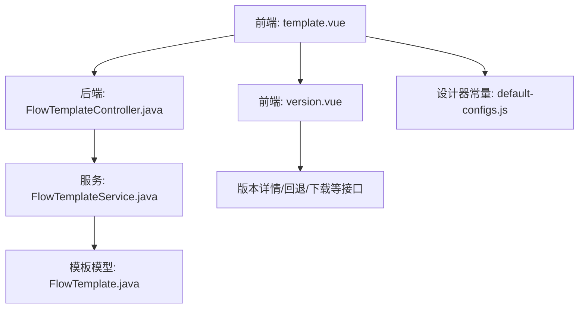
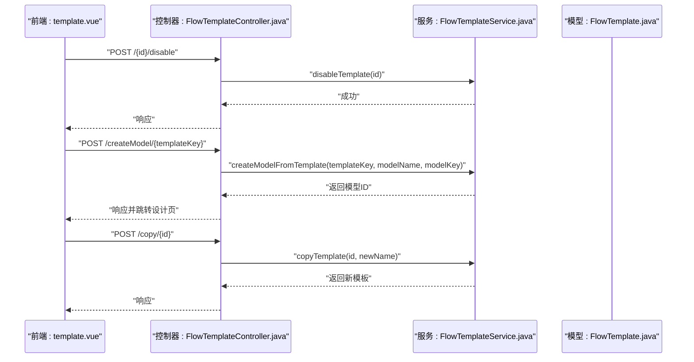
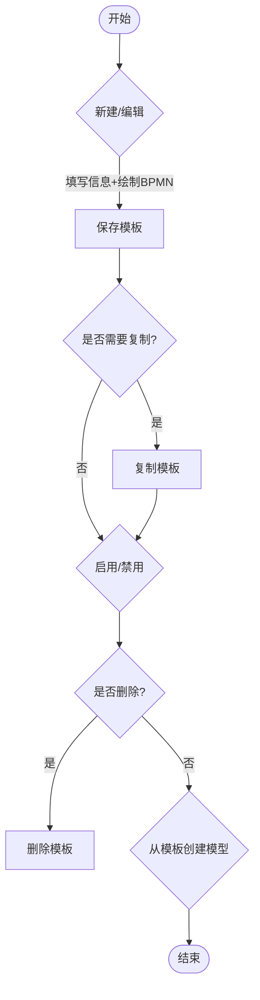
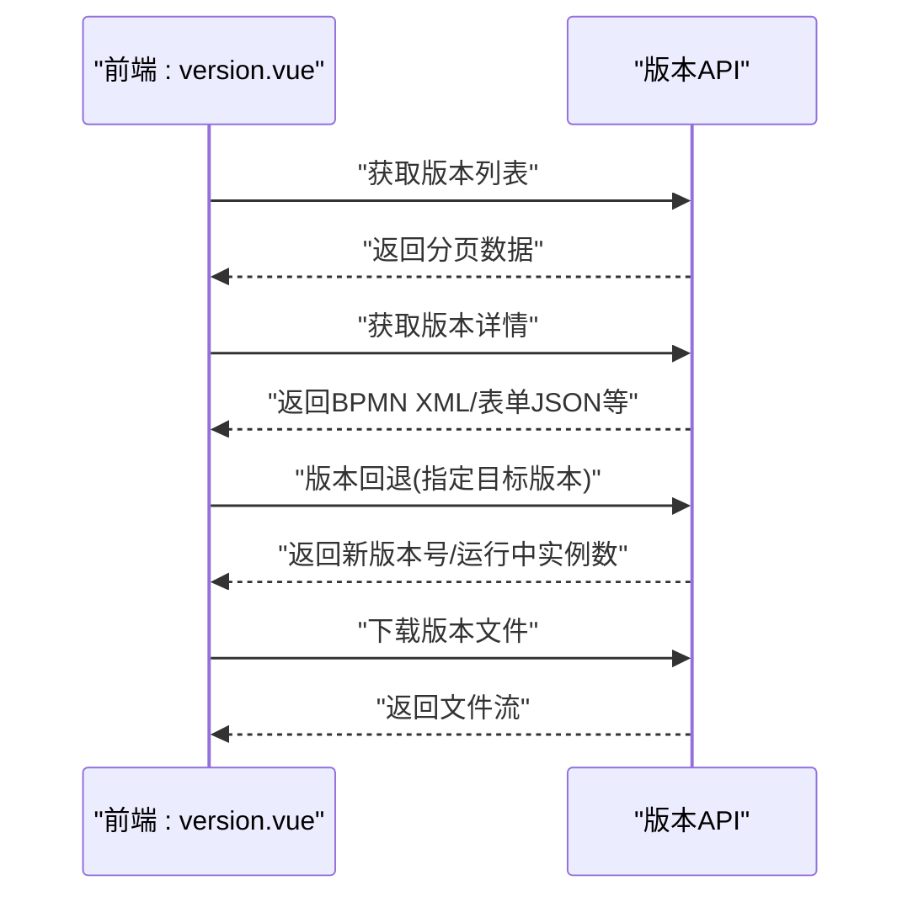
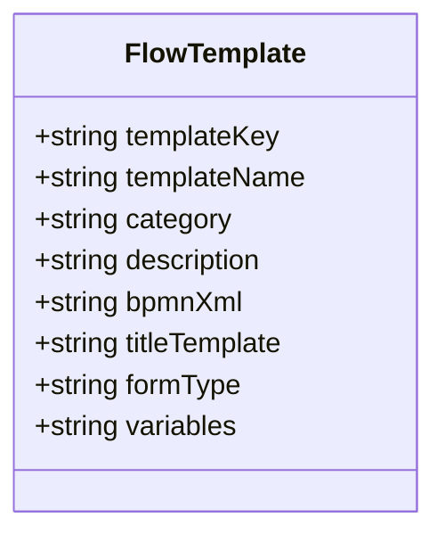
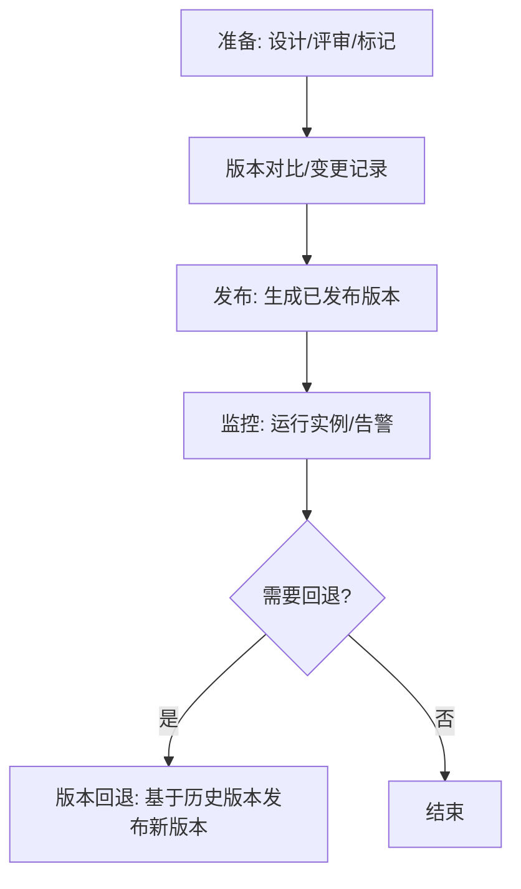
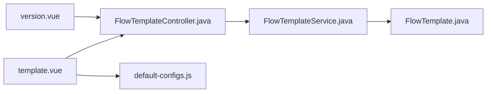

# 流程模板管理

<cite>
**本文引用的文件**
- [template.vue](file://forge-admin-ui/src/views/flow/template.vue)
- [version.vue](file://forge-admin-ui/src/views/flow/version.vue)
- [FlowTemplateController.java](file://forge-server/forge-flow/forge-flow-server/src/main/java/com/mdframe/forge/flow/controller/FlowTemplateController.java)
- [FlowTemplateService.java](file://forge-server/forge-framework/forge-plugin-parent/forge-plugin-flow/src/main/java/com/mdframe/forge/starter/flow/service/FlowTemplateService.java)
- [FlowTemplate.java（模板定义）](file://forge-server/forge-framework/forge-plugin-parent/forge-plugin-flow/src/main/java/com/mdframe/forge/starter/flow/template/FlowTemplate.java)
- [default-configs.js](file://forge-admin-ui/src/components/flow-designer/constants/default-configs.js)
- [tech-flow-version-db-design.md](file://code-copilot/knowledge/tech-flow-version-db-design.md)
</cite>

## 目录
1. [简介](#简介)
2. [项目结构](#项目结构)
3. [核心组件](#核心组件)
4. [架构总览](#架构总览)
5. [详细组件分析](#详细组件分析)
6. [依赖关系分析](#依赖关系分析)
7. [性能考虑](#性能考虑)
8. [故障排查指南](#故障排查指南)
9. [结论](#结论)
10. [附录](#附录)

## 简介
本文件面向 Forge Admin 的流程模板管理能力，覆盖模板的创建、编辑、复制、删除、启用/禁用、从模板创建流程模型、版本管理与回退、预览与对比、以及共享与迁移策略。文档以“前端页面 + 后端接口 + 服务层”为主线，结合流程图与时序图帮助读者快速理解端到端流程。

## 项目结构
- 前端：流程模板列表与编辑在 views/flow/template.vue；版本历史与回退在 views/flow/version.vue；流程设计器默认节点配置在 components/flow-designer/constants/default-configs.js。
- 后端：模板控制器 FlowTemplateController.java 暴露 REST 接口；服务接口 FlowTemplateService.java 定义模板能力；模板数据模型 FlowTemplate.java 描述模板元信息与 BPMN XML。
- 知识文档：流程版本数据库设计参考 tech-flow-version-db-design.md。

**图表来源**
- [template.vue:1-615](file://forge-admin-ui/src/views/flow/template.vue#L1-L615)
- [version.vue:1-645](file://forge-admin-ui/src/views/flow/version.vue#L1-L645)
- [FlowTemplateController.java:109-140](file://forge-server/forge-flow/forge-flow-server/src/main/java/com/mdframe/forge/flow/controller/FlowTemplateController.java#L109-L140)
- [FlowTemplateService.java:58-112](file://forge-server/forge-framework/forge-plugin-parent/forge-plugin-flow/src/main/java/com/mdframe/forge/starter/flow/service/FlowTemplateService.java#L58-L112)
- [FlowTemplate.java:1-52](file://forge-server/forge-framework/forge-plugin-parent/forge-plugin-flow/src/main/java/com/mdframe/forge/starter/flow/template/FlowTemplate.java#L1-L52)
- [default-configs.js:60-118](file://forge-admin-ui/src/components/flow-designer/constants/default-configs.js#L60-L118)

**章节来源**
- [template.vue:1-615](file://forge-admin-ui/src/views/flow/template.vue#L1-L615)
- [version.vue:1-645](file://forge-admin-ui/src/views/flow/version.vue#L1-L645)
- [FlowTemplateController.java:109-140](file://forge-server/forge-flow/forge-flow-server/src/main/java/com/mdframe/forge/flow/controller/FlowTemplateController.java#L109-L140)
- [FlowTemplateService.java:58-112](file://forge-server/forge-framework/forge-plugin-parent/forge-plugin-flow/src/main/java/com/mdframe/forge/starter/flow/service/FlowTemplateService.java#L58-L112)
- [FlowTemplate.java:1-52](file://forge-server/forge-framework/forge-plugin-parent/forge-plugin-flow/src/main/java/com/mdframe/forge/starter/flow/template/FlowTemplate.java#L1-L52)
- [default-configs.js:60-118](file://forge-admin-ui/src/components/flow-designer/constants/default-configs.js#L60-L118)

## 核心组件
- 模板管理页（template.vue）
  - 提供模板分页查询、分类筛选、状态筛选、新增/编辑弹窗、BPMN 设计器集成、从模板创建流程模型、复制/启用/禁用/删除等操作。
  - 表单字段包含模板名称、模板 Key、分类、表单类型、描述、图标、排序、BPMN XML、表单 JSON、变量定义等。
- 版本管理页（version.vue）
  - 展示版本列表、版本详情（设计图/BPMN XML/表单配置）、版本对比、版本标记、版本回退、版本文件下载、删除版本等。
- 后端控制器（FlowTemplateController.java）
  - 暴露禁用模板、从模板创建流程模型、复制模板等接口。
- 服务接口（FlowTemplateService.java）
  - 定义更新、删除、启用/禁用、从模板创建模型、增加使用次数、复制模板等方法。
- 模板模型（FlowTemplate.java）
  - 描述模板标识、名称、分类、描述、BPMN XML、标题模板、表单类型、变量定义等。
- 设计器默认配置（default-configs.js）
  - 提供抄送、条件、并行、包容、服务、脚本、子流程、调用活动等节点的默认属性，支撑模板构建时的可视化配置。

**章节来源**
- [template.vue:1-615](file://forge-admin-ui/src/views/flow/template.vue#L1-L615)
- [version.vue:1-645](file://forge-admin-ui/src/views/flow/version.vue#L1-L645)
- [FlowTemplateController.java:109-140](file://forge-server/forge-flow/forge-flow-server/src/main/java/com/mdframe/forge/flow/controller/FlowTemplateController.java#L109-L140)
- [FlowTemplateService.java:58-112](file://forge-server/forge-framework/forge-plugin-parent/forge-plugin-flow/src/main/java/com/mdframe/forge/starter/flow/service/FlowTemplateService.java#L58-L112)
- [FlowTemplate.java:1-52](file://forge-server/forge-framework/forge-plugin-parent/forge-plugin-flow/src/main/java/com/mdframe/forge/starter/flow/template/FlowTemplate.java#L1-L52)
- [default-configs.js:60-118](file://forge-admin-ui/src/components/flow-designer/constants/default-configs.js#L60-L118)

## 架构总览
下图展示了“模板管理”的前后端交互与关键能力边界：前端通过 API 调用控制器，控制器委托服务完成模板 CRUD、启用/禁用、复制、从模板创建模型等操作；版本管理页则负责版本列表、详情、回退、下载等。

**图表来源**
- [FlowTemplateController.java:109-140](file://forge-server/forge-flow/forge-flow-server/src/main/java/com/mdframe/forge/flow/controller/FlowTemplateController.java#L109-L140)
- [FlowTemplateService.java:58-112](file://forge-server/forge-framework/forge-plugin-parent/forge-plugin-flow/src/main/java/com/mdframe/forge/starter/flow/service/FlowTemplateService.java#L58-L112)
- [FlowTemplate.java:1-52](file://forge-server/forge-framework/forge-plugin-parent/forge-plugin-flow/src/main/java/com/mdframe/forge/starter/flow/template/FlowTemplate.java#L1-L52)
- [template.vue:1-615](file://forge-admin-ui/src/views/flow/template.vue#L1-L615)

## 详细组件分析

### 模板生命周期与操作流
- 创建/编辑
  - 在模板列表点击“新增模板/编辑”，打开弹窗，填写基本信息并进入 BPMN 设计器绘制流程。提交时获取最新 XML 并保存。
- 复制
  - 支持一键复制模板并自动追加副本名，便于复用与二次定制。
- 启用/禁用
  - 根据当前状态切换启用或禁用，控制是否可被用于创建流程模型。
- 删除
  - 非系统模板允许删除，避免误删受控模板。
- 从模板创建流程模型
  - 选择模板后输入流程名称与可选 Key，创建成功后跳转到流程设计页继续完善。

**图表来源**
- [template.vue:1-615](file://forge-admin-ui/src/views/flow/template.vue#L1-L615)
- [FlowTemplateController.java:109-140](file://forge-server/forge-flow/forge-flow-server/src/main/java/com/mdframe/forge/flow/controller/FlowTemplateController.java#L109-L140)
- [FlowTemplateService.java:58-112](file://forge-server/forge-framework/forge-plugin-parent/forge-plugin-flow/src/main/java/com/mdframe/forge/starter/flow/service/FlowTemplateService.java#L58-L112)

**章节来源**
- [template.vue:1-615](file://forge-admin-ui/src/views/flow/template.vue#L1-L615)
- [FlowTemplateController.java:109-140](file://forge-server/forge-flow/forge-flow-server/src/main/java/com/mdframe/forge/flow/controller/FlowTemplateController.java#L109-L140)
- [FlowTemplateService.java:58-112](file://forge-server/forge-framework/forge-plugin-parent/forge-plugin-flow/src/main/java/com/mdframe/forge/starter/flow/service/FlowTemplateService.java#L58-L112)

### 版本管理与发布回退
- 版本列表与详情
  - 展示版本号、版本名称、版本标记、变更说明、发布人、发布时间、Deployment ID、流程定义 ID 等；支持查看设计图、BPMN XML、表单配置。
- 版本对比
  - 支持对两个版本进行差异对比，辅助发布评审。
- 版本标记
  - 为版本打上测试/预发/生产等标记，便于追踪与审计。
- 版本回退
  - 基于目标历史版本发布新版本，已运行实例继续按旧版本执行，降低回滚风险。
- 版本下载
  - 支持下载版本文件（BPMN），便于离线归档或迁移。

**图表来源**
- [version.vue:1-645](file://forge-admin-ui/src/views/flow/version.vue#L1-L645)

**章节来源**
- [version.vue:1-645](file://forge-admin-ui/src/views/flow/version.vue#L1-L645)
- [tech-flow-version-db-design.md:1-31](file://code-copilot/knowledge/tech-flow-version-db-design.md#L1-L31)

### 模板复用与分类组织
- 模板复用机制
  - 通过“复制模板”快速生成新模板，保留原有流程结构与配置，仅修改必要部分，提升复用效率。
  - “从模板创建流程模型”将模板直接转化为可运行的流程模型，便于在不同业务场景下复用流程骨架。
- 分类组织
  - 模板支持分类字段，前端提供树形分类选择与扁平化选项，便于按业务域或部门维度组织模板。
  - 列表支持按分类筛选，提高检索效率。

**图表来源**
- [FlowTemplate.java:1-52](file://forge-server/forge-framework/forge-plugin-parent/forge-plugin-flow/src/main/java/com/mdframe/forge/starter/flow/template/FlowTemplate.java#L1-L52)

**章节来源**
- [template.vue:1-615](file://forge-admin-ui/src/views/flow/template.vue#L1-L615)
- [FlowTemplate.java:1-52](file://forge-server/forge-framework/forge-plugin-parent/forge-plugin-flow/src/main/java/com/mdframe/forge/starter/flow/template/FlowTemplate.java#L1-L52)

### 模板预览与测试验证
- 预览
  - 版本详情支持“设计图”标签，渲染对应版本的 BPMN 图形，便于直观审查。
  - 支持“BPMN XML”标签，查看原始 XML，必要时可复制导出。
- 测试验证建议
  - 在版本管理中先打“测试”标记，基于该版本发起试运行流程，观察节点行为与分支逻辑。
  - 利用“版本对比”功能核对变更点，确保无破坏性改动。
  - 对复杂节点（如条件、并行、脚本、服务任务）进行单测或集成测试，确保表达式与服务实现正确。

**章节来源**
- [version.vue:1-645](file://forge-admin-ui/src/views/flow/version.vue#L1-L645)
- [default-configs.js:60-118](file://forge-admin-ui/src/components/flow-designer/constants/default-configs.js#L60-L118)

### 模板发布流程
- 发布前准备
  - 完成模板设计与内部评审，确认版本标记为“测试/预发”。
  - 通过版本对比确认变更范围，记录变更说明。
- 发布动作
  - 在版本管理中执行发布（由平台发布流程触发），形成已发布版本。
  - 发布后可通过“从模板创建流程模型”或直接使用该模板启动流程。
- 发布后治理
  - 监控运行中的流程实例，关注异常与超时。
  - 如需回退，使用版本回退功能，系统会基于目标版本发布新版本，已运行实例不受影响。

**图表来源**
- [version.vue:1-645](file://forge-admin-ui/src/views/flow/version.vue#L1-L645)

**章节来源**
- [version.vue:1-645](file://forge-admin-ui/src/views/flow/version.vue#L1-L645)

### 模板共享策略与模板市场概念
- 共享策略
  - 通过分类与命名规范实现团队内共享；结合启用/禁用控制可见性与可用性。
  - 借助“复制模板”在各业务线间快速复制，减少重复建设。
- 模板市场（概念）
  - 可在现有模板管理基础上扩展“市场”视图，提供模板搜索、评分、下载与安装能力，促进跨团队复用。
  - 引入权限与审计，确保模板来源可信、变更可追溯。

[本节为概念性内容，不直接分析具体文件]

### 模板迁移方案
- 导出与归档
  - 使用版本管理中的“下载版本文件”功能，导出 BPMN 文件进行归档或跨环境迁移。
- 导入与复用
  - 在新环境中通过“从模板创建流程模型”或直接导入 BPMN 的方式重建流程。
- 一致性保障
  - 迁移前后进行版本对比与回归测试，确保节点配置、表单与变量一致。
  - 对涉及外部服务的节点，检查环境变量与连接配置。

**章节来源**
- [version.vue:1-645](file://forge-admin-ui/src/views/flow/version.vue#L1-L645)

## 依赖关系分析
- 前端依赖
  - template.vue 依赖流程设计器组件与字典能力，用于渲染与表单校验。
  - version.vue 依赖版本 API 与设计器查看器，用于版本详情与图形渲染。
- 后端依赖
  - FlowTemplateController 依赖 FlowTemplateService 提供的业务能力。
  - FlowTemplateService 定义模板相关方法，供控制器调用。
  - FlowTemplate 作为模板数据载体，贯穿前后端交互。

**图表来源**
- [template.vue:1-615](file://forge-admin-ui/src/views/flow/template.vue#L1-L615)
- [version.vue:1-645](file://forge-admin-ui/src/views/flow/version.vue#L1-L645)
- [FlowTemplateController.java:109-140](file://forge-server/forge-flow/forge-flow-server/src/main/java/com/mdframe/forge/flow/controller/FlowTemplateController.java#L109-L140)
- [FlowTemplateService.java:58-112](file://forge-server/forge-framework/forge-plugin-parent/forge-plugin-flow/src/main/java/com/mdframe/forge/starter/flow/service/FlowTemplateService.java#L58-L112)
- [FlowTemplate.java:1-52](file://forge-server/forge-framework/forge-plugin-parent/forge-plugin-flow/src/main/java/com/mdframe/forge/starter/flow/template/FlowTemplate.java#L1-L52)
- [default-configs.js:60-118](file://forge-admin-ui/src/components/flow-designer/constants/default-configs.js#L60-L118)

**章节来源**
- [template.vue:1-615](file://forge-admin-ui/src/views/flow/template.vue#L1-L615)
- [version.vue:1-645](file://forge-admin-ui/src/views/flow/version.vue#L1-L645)
- [FlowTemplateController.java:109-140](file://forge-server/forge-flow/forge-flow-server/src/main/java/com/mdframe/forge/flow/controller/FlowTemplateController.java#L109-L140)
- [FlowTemplateService.java:58-112](file://forge-server/forge-framework/forge-plugin-parent/forge-plugin-flow/src/main/java/com/mdframe/forge/starter/flow/service/FlowTemplateService.java#L58-L112)
- [FlowTemplate.java:1-52](file://forge-server/forge-framework/forge-plugin-parent/forge-plugin-flow/src/main/java/com/mdframe/forge/starter/flow/template/FlowTemplate.java#L1-L52)
- [default-configs.js:60-118](file://forge-admin-ui/src/components/flow-designer/constants/default-configs.js#L60-L118)

## 性能考虑
- 列表与分页
  - 模板列表与版本列表均采用分页加载，避免一次性加载大量数据导致卡顿。
- 大对象处理
  - BPMN XML 与表单 JSON 可能较大，建议在详情中按需加载，并在下载时使用流式传输。
- 缓存与索引
  - 对高频查询的分类、状态等字段建立合适索引；对模板元数据可考虑缓存以提升查询性能。
- 并发与幂等
  - 复制、启用/禁用、回退等写操作应保证幂等，避免重复提交导致的数据不一致。

[本节为通用性能建议，不直接分析具体文件]

## 故障排查指南
- 常见问题定位
  - 模板保存失败：检查必填字段（模板名称、分类）与 BPMN XML 合法性。
  - 无法从模板创建模型：确认模板处于启用状态且模板 Key 有效。
  - 版本回退失败：检查目标版本是否存在、是否为可回退状态，并关注变更说明长度限制。
  - 版本下载失败：检查网络与鉴权头，确认服务端返回的文件流是否正常。
- 日志与调试
  - 在前端控制台查看错误堆栈；在后端服务日志中检索对应请求的异常信息。
  - 对复杂节点（条件、脚本、服务任务）单独验证表达式与实现类。
- 恢复策略
  - 若出现误发布，优先使用版本回退功能恢复到稳定版本；必要时重新发布新版本。

**章节来源**
- [template.vue:1-615](file://forge-admin-ui/src/views/flow/template.vue#L1-L615)
- [version.vue:1-645](file://forge-admin-ui/src/views/flow/version.vue#L1-L645)

## 结论
Forge Admin 的流程模板管理提供了完整的模板生命周期能力：从创建、编辑、复制到启用/禁用与删除，再到从模板创建流程模型；版本管理支持预览、对比、标记、回退与下载，满足多版本治理与回滚需求。结合分类组织与复用机制，可有效提升流程资产沉淀与复用效率。建议在生产环境中配合严格的发布流程、监控与审计，确保流程的稳定与安全。

## 附录
- 术语
  - 模板：可复用的流程定义集合，包含 BPMN XML 与元数据。
  - 模型：由模板创建的、可运行的流程定义实例。
  - 版本：模型的多次发布快照，支持回退与对比。
- 最佳实践
  - 为每个重要版本添加清晰的变更说明与标记。
  - 使用分类与命名规范组织模板，便于检索与治理。
  - 在发布前进行版本对比与回归测试，降低上线风险。

[本节为补充信息，不直接分析具体文件]