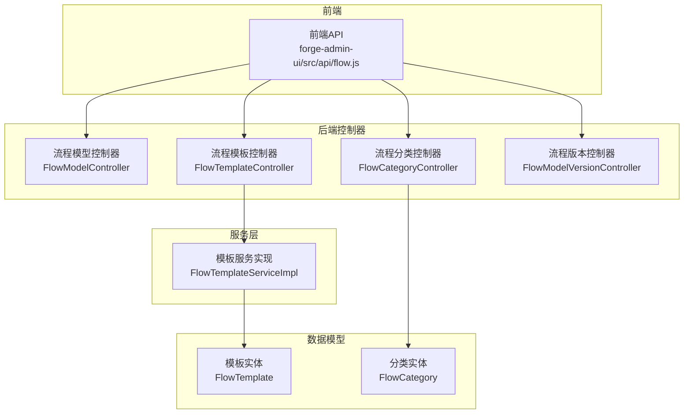
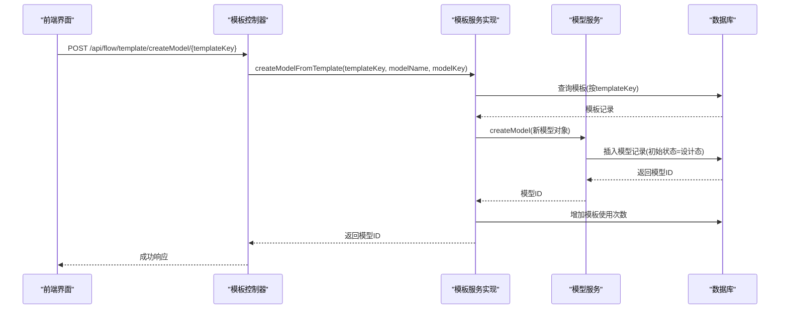
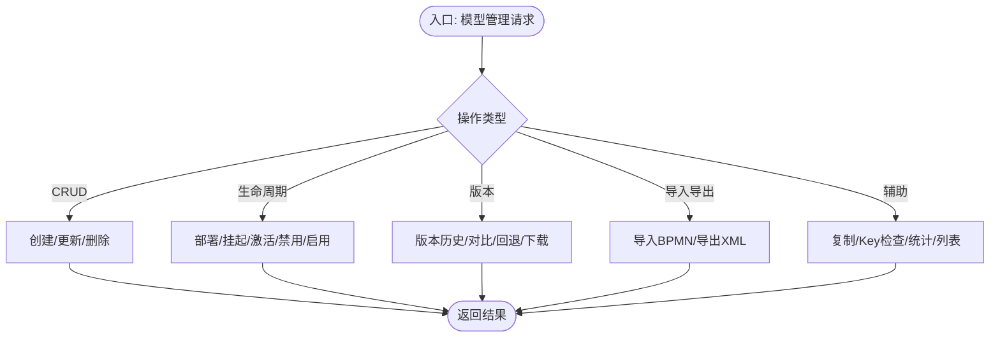
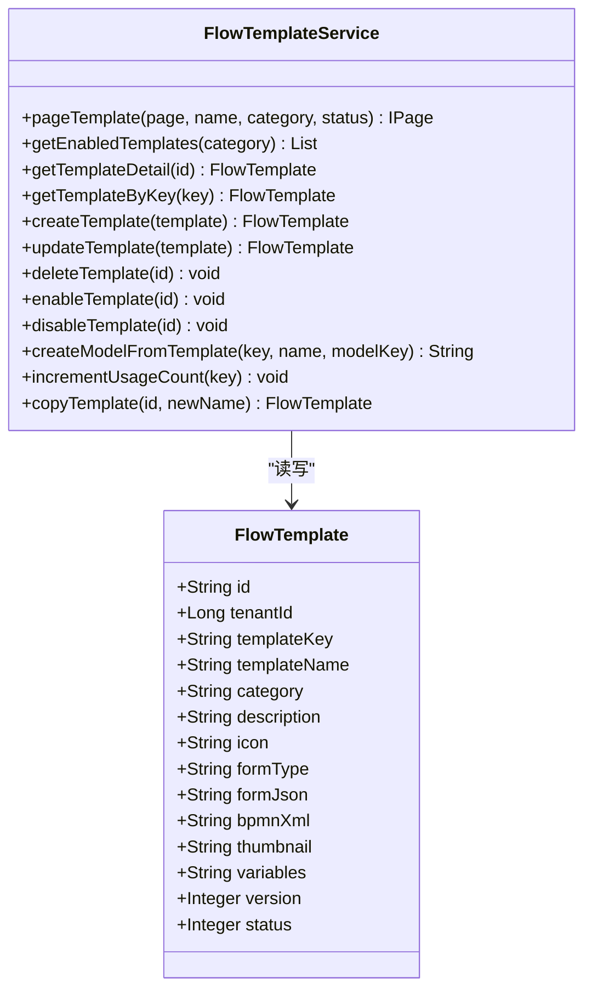
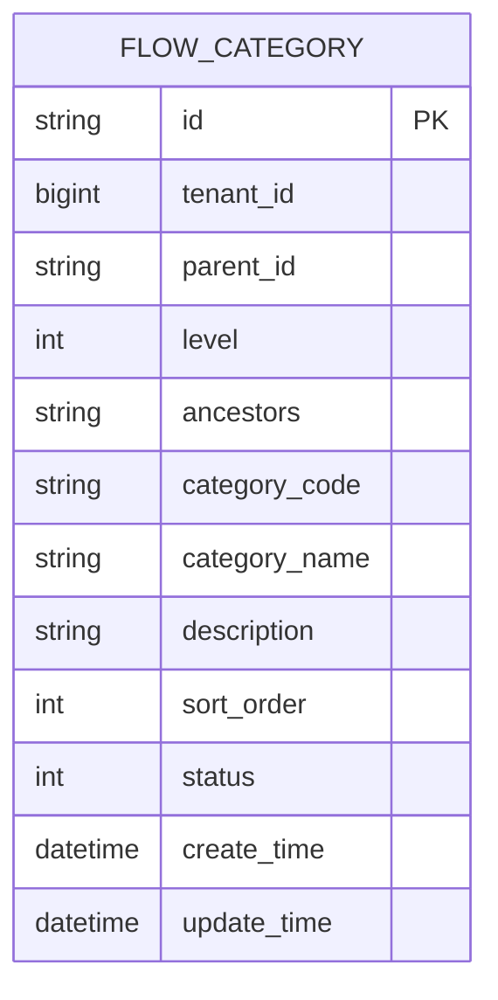
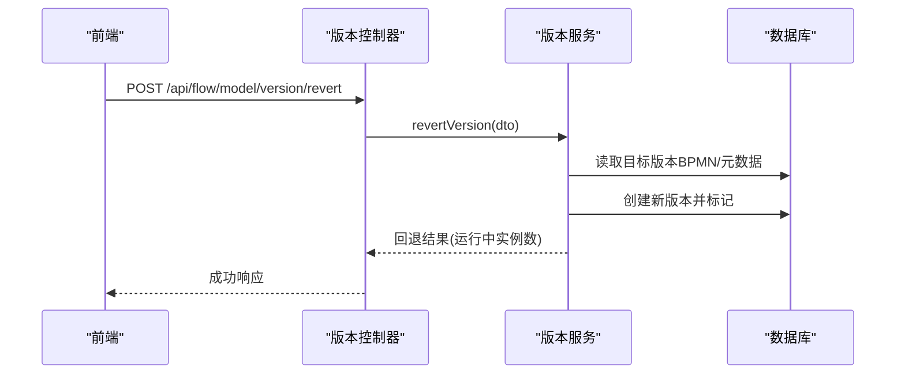
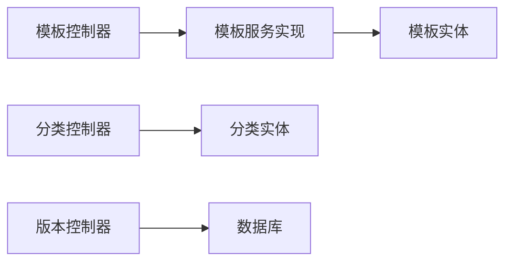

# 流程管理

<cite>
**本文引用的文件**
- [FlowModelController.java](file://forge-server/forge-flow/forge-flow-server/src/main/java/com/mdframe/forge/flow/controller/FlowModelController.java)
- [FlowTemplateController.java](file://forge-server/forge-flow/forge-flow-server/src/main/java/com/mdframe/forge/flow/controller/FlowTemplateController.java)
- [FlowCategoryController.java](file://forge-server/forge-flow/forge-flow-server/src/main/java/com/mdframe/forge/flow/controller/FlowCategoryController.java)
- [FlowModelVersionController.java](file://forge-server/forge-flow/forge-flow-server/src/main/java/com/mdframe/forge/flow/controller/FlowModelVersionController.java)
- [FlowTemplateServiceImpl.java](file://forge-server/forge-framework/forge-plugin-parent/forge-plugin-flow/src/main/java/com/mdframe/forge/starter/flow/service/impl/FlowTemplateServiceImpl.java)
- [FlowTemplateService.java](file://forge-server/forge-framework/forge-plugin-parent/forge-plugin-flow/src/main/java/com/mdframe/forge/starter/flow/service/FlowTemplateService.java)
- [FlowTemplate.java](file://forge-server/forge-framework/forge-plugin-parent/forge-plugin-flow/src/main/java/com/mdframe/forge/starter/flow/entity/FlowTemplate.java)
- [FlowCategory.java](file://forge-server/forge-framework/forge-plugin-parent/forge-plugin-flow/src/main/java/com/mdframe/forge/starter/flow/entity/FlowCategory.java)
- [flow.js](file://forge-admin-ui/src/api/flow.js)
</cite>

## 目录
1. [简介](#简介)
2. [项目结构](#项目结构)
3. [核心组件](#核心组件)
4. [架构总览](#架构总览)
5. [详细组件分析](#详细组件分析)
6. [依赖关系分析](#依赖关系分析)
7. [性能考虑](#性能考虑)
8. [故障排查指南](#故障排查指南)
9. [结论](#结论)
10. [附录](#附录)

## 简介
本文件为 Forge Admin 流程管理模块的综合文档，覆盖流程模型管理、流程模板管理、流程分类管理等核心能力。重点说明：
- 流程定义的增删改查、版本控制、发布与启停控制
- 流程模型的导入导出、流程模板复用机制
- 分类标签管理与权限控制策略
- 批量操作流程、流程迁移方案
- 流程治理与监控分析方法

## 项目结构
流程管理相关后端以控制器（Controller）暴露 REST API，服务层（Service）封装业务逻辑，实体（Entity）定义数据模型；前端通过统一的 API 客户端调用后端接口。

图表来源
- [FlowModelController.java:20-233](file://forge-server/forge-flow/forge-flow-server/src/main/java/com/mdframe/forge/flow/controller/FlowModelController.java#L20-L233)
- [FlowTemplateController.java:16-141](file://forge-server/forge-flow/forge-flow-server/src/main/java/com/mdframe/forge/flow/controller/FlowTemplateController.java#L16-L141)
- [FlowCategoryController.java:16-149](file://forge-server/forge-flow/forge-flow-server/src/main/java/com/mdframe/forge/flow/controller/FlowCategoryController.java#L16-L149)
- [FlowModelVersionController.java:27-98](file://forge-server/forge-flow/forge-flow-server/src/main/java/com/mdframe/forge/flow/controller/FlowModelVersionController.java#L27-L98)
- [FlowTemplateServiceImpl.java:1-200](file://forge-server/forge-framework/forge-plugin-parent/forge-plugin-flow/src/main/java/com/mdframe/forge/starter/flow/service/impl/FlowTemplateServiceImpl.java#L1-L200)
- [FlowTemplate.java:1-82](file://forge-server/forge-framework/forge-plugin-parent/forge-plugin-flow/src/main/java/com/mdframe/forge/starter/flow/entity/FlowTemplate.java#L1-L82)
- [FlowCategory.java:1-81](file://forge-server/forge-framework/forge-plugin-parent/forge-plugin-flow/src/main/java/com/mdframe/forge/starter/flow/entity/FlowCategory.java#L1-L81)
- [flow.js:245-308](file://forge-admin-ui/src/api/flow.js#L245-L308)

章节来源
- [FlowModelController.java:20-233](file://forge-server/forge-flow/forge-flow-server/src/main/java/com/mdframe/forge/flow/controller/FlowModelController.java#L20-L233)
- [FlowTemplateController.java:16-141](file://forge-server/forge-flow/forge-flow-server/src/main/java/com/mdframe/forge/flow/controller/FlowTemplateController.java#L16-L141)
- [FlowCategoryController.java:16-149](file://forge-server/forge-flow/forge-flow-server/src/main/java/com/mdframe/forge/flow/controller/FlowCategoryController.java#L16-L149)
- [FlowModelVersionController.java:27-98](file://forge-server/forge-flow/forge-flow-server/src/main/java/com/mdframe/forge/flow/controller/FlowModelVersionController.java#L27-L98)
- [FlowTemplateServiceImpl.java:1-200](file://forge-server/forge-framework/forge-plugin-parent/forge-plugin-flow/src/main/java/com/mdframe/forge/starter/flow/service/impl/FlowTemplateServiceImpl.java#L1-L200)
- [FlowTemplate.java:1-82](file://forge-server/forge-framework/forge-plugin-parent/forge-plugin-flow/src/main/java/com/mdframe/forge/starter/flow/entity/FlowTemplate.java#L1-L82)
- [FlowCategory.java:1-81](file://forge-server/forge-framework/forge-plugin-parent/forge-plugin-flow/src/main/java/com/mdframe/forge/starter/flow/entity/FlowCategory.java#L1-L81)
- [flow.js:245-308](file://forge-admin-ui/src/api/flow.js#L245-L308)

## 核心组件
- 流程模型管理：提供分页查询、启用列表、统计、详情、Key 查询、创建/更新/删除、部署、挂起/激活/禁用、启用/禁用、版本历史、导入/导出、复制、Key 存在性检查等能力。
- 流程模板管理：提供分页查询、启用列表、详情、Key 查询、创建/更新/删除、启用/禁用、从模板创建模型、复制模板等能力。
- 流程分类管理：提供启用列表、树形列表、下拉树、分页查询、详情、按编码查询、创建/更新/删除、启用/禁用等能力。
- 流程版本管理：提供版本分页、详情、对比、回退、标签更新、删除、下载 BPMN XML 等能力。

章节来源
- [FlowModelController.java:33-231](file://forge-server/forge-flow/forge-flow-server/src/main/java/com/mdframe/forge/flow/controller/FlowModelController.java#L33-L231)
- [FlowTemplateController.java:29-140](file://forge-server/forge-flow/forge-flow-server/src/main/java/com/mdframe/forge/flow/controller/FlowTemplateController.java#L29-L140)
- [FlowCategoryController.java:29-148](file://forge-server/forge-flow/forge-flow-server/src/main/java/com/mdframe/forge/flow/controller/FlowCategoryController.java#L29-L148)
- [FlowModelVersionController.java:37-96](file://forge-server/forge-flow/forge-flow-server/src/main/java/com/mdframe/forge/flow/controller/FlowModelVersionController.java#L37-L96)

## 架构总览
前后端通过 RESTful API 交互，控制器负责参数校验与响应包装，服务层实现具体业务逻辑，实体映射数据库表结构。模板服务在“从模板创建模型”时依赖模型服务完成持久化与状态初始化。

图表来源
- [FlowTemplateController.java:118-128](file://forge-server/forge-flow/forge-flow-server/src/main/java/com/mdframe/forge/flow/controller/FlowTemplateController.java#L118-L128)
- [FlowTemplateServiceImpl.java:151-183](file://forge-server/forge-framework/forge-plugin-parent/forge-plugin-flow/src/main/java/com/mdframe/forge/starter/flow/service/impl/FlowTemplateServiceImpl.java#L151-L183)

## 详细组件分析

### 流程模型管理
- 能力概览
  - 分页查询、启用列表、状态统计、详情、Key 查询、启动配置获取
  - 创建/更新/删除、部署、挂起/激活/禁用、启用/禁用
  - 版本历史、导入BPMN、导出XML、复制、Key 存在性检查
- 关键接口路径
  - GET /api/flow/model/page
  - GET /api/flow/model/enabled
  - GET /api/flow/model/statistics
  - GET /api/flow/model/{id}
  - GET /api/flow/model/key/{modelKey}
  - GET /api/flow/model/key/{modelKey}/start-config
  - POST /api/flow/model
  - PUT /api/flow/model
  - DELETE /api/flow/model/{id}
  - POST /api/flow/model/{id}/deploy
  - POST /api/flow/model/{id}/suspend
  - POST /api/flow/model/{id}/activate
  - POST /api/flow/model/{id}/disable
  - POST /api/flow/model/{id}/enable
  - GET /api/flow/model/{modelKey}/versions
  - POST /api/flow/model/import
  - GET /api/flow/model/{id}/export
  - POST /api/flow/model/{id}/copy
  - GET /api/flow/model/checkKey
  - GET /api/flow/model/list

图表来源
- [FlowModelController.java:33-231](file://forge-server/forge-flow/forge-flow-server/src/main/java/com/mdframe/forge/flow/controller/FlowModelController.java#L33-L231)

章节来源
- [FlowModelController.java:33-231](file://forge-server/forge-flow/forge-flow-server/src/main/java/com/mdframe/forge/flow/controller/FlowModelController.java#L33-L231)

### 流程模板管理
- 能力概览
  - 分页查询、启用列表、详情、Key 查询
  - 创建/更新/删除、启用/禁用
  - 从模板创建流程模型（复用机制）、复制模板
- 关键接口路径
  - GET /api/flow/template/page
  - GET /api/flow/template/enabled
  - GET /api/flow/template/{id}
  - GET /api/flow/template/key/{templateKey}
  - POST /api/flow/template
  - PUT /api/flow/template
  - DELETE /api/flow/template/{id}
  - POST /api/flow/template/{id}/enable
  - POST /api/flow/template/{id}/disable
  - POST /api/flow/template/createModel/{templateKey}
  - POST /api/flow/template/copy/{id}

图表来源
- [FlowTemplate.java:1-82](file://forge-server/forge-framework/forge-plugin-parent/forge-plugin-flow/src/main/java/com/mdframe/forge/starter/flow/entity/FlowTemplate.java#L1-L82)
- [FlowTemplateService.java:58-112](file://forge-server/forge-framework/forge-plugin-parent/forge-plugin-flow/src/main/java/com/mdframe/forge/starter/flow/service/FlowTemplateService.java#L58-L112)

章节来源
- [FlowTemplateController.java:29-140](file://forge-server/forge-flow/forge-flow-server/src/main/java/com/mdframe/forge/flow/controller/FlowTemplateController.java#L29-L140)
- [FlowTemplateServiceImpl.java:36-200](file://forge-server/forge-framework/forge-plugin-parent/forge-plugin-flow/src/main/java/com/mdframe/forge/starter/flow/service/impl/FlowTemplateServiceImpl.java#L36-L200)
- [FlowTemplateService.java:58-112](file://forge-server/forge-framework/forge-plugin-parent/forge-plugin-flow/src/main/java/com/mdframe/forge/starter/flow/service/FlowTemplateService.java#L58-L112)

### 流程分类管理
- 能力概览
  - 启用列表、树形列表、下拉树（仅叶子）、分页查询
  - 详情、按编码查询
  - 创建/更新/删除、启用/禁用
- 关键接口路径
  - GET /api/flow/category/enabled
  - GET /api/flow/category/tree
  - GET /api/flow/category/tree-select?onlyLeaf=true
  - GET /api/flow/category/page
  - GET /api/flow/category/{id}
  - GET /api/flow/category/code/{code}
  - POST /api/flow/category
  - PUT /api/flow/category
  - DELETE /api/flow/category/{id}
  - POST /api/flow/category/{id}/enable
  - POST /api/flow/category/{id}/disable

图表来源
- [FlowCategory.java:1-81](file://forge-server/forge-framework/forge-plugin-parent/forge-plugin-flow/src/main/java/com/mdframe/forge/starter/flow/entity/FlowCategory.java#L1-L81)

章节来源
- [FlowCategoryController.java:29-148](file://forge-server/forge-flow/forge-flow-server/src/main/java/com/mdframe/forge/flow/controller/FlowCategoryController.java#L29-L148)
- [FlowCategory.java:1-81](file://forge-server/forge-framework/forge-plugin-parent/forge-plugin-flow/src/main/java/com/mdframe/forge/starter/flow/entity/FlowCategory.java#L1-L81)

### 流程版本管理
- 能力概览
  - 版本分页、详情、对比、回退、标签更新、删除、下载 BPMN XML
- 关键接口路径
  - GET /api/flow/model/version/list?modelId=...
  - GET /api/flow/model/version/{versionId}
  - POST /api/flow/model/version/compare
  - POST /api/flow/model/version/revert
  - PUT /api/flow/model/version/{versionId}/tag
  - DELETE /api/flow/model/version/{versionId}
  - GET /api/flow/model/version/download/{versionId}

图表来源
- [FlowModelVersionController.java:56-60](file://forge-server/forge-flow/forge-flow-server/src/main/java/com/mdframe/forge/flow/controller/FlowModelVersionController.java#L56-L60)

章节来源
- [FlowModelVersionController.java:37-96](file://forge-server/forge-flow/forge-flow-server/src/main/java/com/mdframe/forge/flow/controller/FlowModelVersionController.java#L37-L96)

### 前端集成要点
- 模板与分类的常用前端调用集中在统一 API 文件中，便于集中维护与扩展。
- 模板创建模型、分类树选择等接口在前端有明确封装，便于页面复用。

章节来源
- [flow.js:245-308](file://forge-admin-ui/src/api/flow.js#L245-L308)

## 依赖关系分析
- 控制器与服务解耦：控制器仅做参数接收与响应包装，业务逻辑下沉至服务层。
- 模板服务依赖模型服务：从模板创建模型时，模板服务调用模型服务完成新模型的持久化与状态初始化。
- 实体与表映射：模板与分类实体通过注解映射到系统表，字段完整覆盖业务所需信息。

图表来源
- [FlowTemplateController.java:29-140](file://forge-server/forge-flow/forge-flow-server/src/main/java/com/mdframe/forge/flow/controller/FlowTemplateController.java#L29-L140)
- [FlowTemplateServiceImpl.java:36-200](file://forge-server/forge-framework/forge-plugin-parent/forge-plugin-flow/src/main/java/com/mdframe/forge/starter/flow/service/impl/FlowTemplateServiceImpl.java#L36-L200)
- [FlowCategoryController.java:29-148](file://forge-server/forge-flow/forge-flow-server/src/main/java/com/mdframe/forge/flow/controller/FlowCategoryController.java#L29-L148)
- [FlowModelVersionController.java:37-96](file://forge-server/forge-flow/forge-flow-server/src/main/java/com/mdframe/forge/flow/controller/FlowModelVersionController.java#L37-L96)

章节来源
- [FlowTemplateController.java:29-140](file://forge-server/forge-flow/forge-flow-server/src/main/java/com/mdframe/forge/flow/controller/FlowTemplateController.java#L29-L140)
- [FlowTemplateServiceImpl.java:36-200](file://forge-server/forge-framework/forge-plugin-parent/forge-plugin-flow/src/main/java/com/mdframe/forge/starter/flow/service/impl/FlowTemplateServiceImpl.java#L36-L200)
- [FlowCategoryController.java:29-148](file://forge-server/forge-flow/forge-flow-server/src/main/java/com/mdframe/forge/flow/controller/FlowCategoryController.java#L29-L148)
- [FlowModelVersionController.java:37-96](file://forge-server/forge-flow/forge-flow-server/src/main/java/com/mdframe/forge/flow/controller/FlowModelVersionController.java#L37-L96)

## 性能考虑
- 分页与过滤：模板与分类的分页接口支持名称、分类、状态等过滤条件，建议结合索引优化查询性能。
- 树形结构：分类树查询需避免全表扫描，建议在祖先路径或层级字段建立合适索引。
- 版本对比与回退：大体积 BPMN XML 的对比与回退可能带来内存与IO压力，建议对大文件进行流式处理与异步任务化。
- 导入导出：导入BPMN时注意异常捕获与错误提示，避免阻塞主线程。

[本节为通用性能建议，不直接分析具体文件]

## 故障排查指南
- 模板不可用：从模板创建模型前会校验模板状态，若模板已禁用将抛出异常。请确认模板状态为启用。
- 版本下载失败：若指定版本无 BPMN XML，下载接口将抛出业务异常。请检查该版本是否包含 BPMN 内容。
- 导入失败：导入接口捕获异常并返回错误信息，可根据返回消息定位问题（如格式错误、解析失败）。

章节来源
- [FlowTemplateServiceImpl.java:151-183](file://forge-server/forge-framework/forge-plugin-parent/forge-plugin-flow/src/main/java/com/mdframe/forge/starter/flow/service/impl/FlowTemplateServiceImpl.java#L151-L183)
- [FlowModelVersionController.java:74-96](file://forge-server/forge-flow/forge-flow-server/src/main/java/com/mdframe/forge/flow/controller/FlowModelVersionController.java#L74-L96)
- [FlowModelController.java:175-189](file://forge-server/forge-flow/forge-flow-server/src/main/java/com/mdframe/forge/flow/controller/FlowModelController.java#L175-L189)

## 结论
Forge Admin 的流程管理模块提供了完整的模型、模板、分类与版本管理能力，支持流程的导入导出、复用与生命周期控制。通过清晰的控制器-服务-实体分层，以及完善的前端 API 封装，能够满足企业级流程治理与运维需求。建议在生产环境中结合索引优化、异步任务与监控告警，进一步提升稳定性与可观测性。

[本节为总结性内容，不直接分析具体文件]

## 附录

### 最佳实践
- 命名规范：模型 Key 与模板 Key 应唯一且具语义，便于检索与审计。
- 版本策略：每次发布生成新版本，保留历史版本以便回退与对比。
- 分类组织：使用树形分类对流程进行归类，便于管理与展示。
- 权限控制：基于平台权限体系对流程操作进行细粒度授权，确保最小权限原则。

[本节为通用实践建议，不直接分析具体文件]

### 批量操作流程
- 批量启用/禁用：可通过循环调用启用/禁用接口实现批量操作，建议在前端增加确认与进度反馈。
- 批量复制：对模板或模型进行批量复制时，注意并发控制与冲突检测（如 Key 重复）。

[本节为通用操作建议，不直接分析具体文件]

### 流程迁移方案
- 导出-导入：利用导出接口获取 BPMN XML，再在新环境通过导入接口恢复模型。
- 版本迁移：通过版本对比与回退能力，确保跨环境一致性。
- 数据迁移：配合数据库迁移脚本，确保分类、模板、模型等基础数据同步。

[本节为通用迁移建议，不直接分析具体文件]

### 治理与监控分析
- 指标采集：关注模型状态分布、版本数量、模板使用次数等指标。
- 日志审计：记录关键操作（创建、发布、回退、导入导出）的审计日志。
- 告警策略：对导入失败、版本下载失败、模板禁用等异常场景设置告警。

[本节为通用治理建议，不直接分析具体文件]