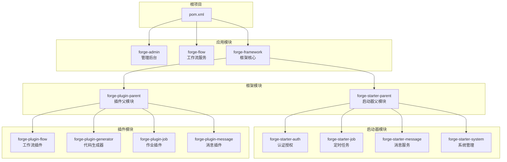
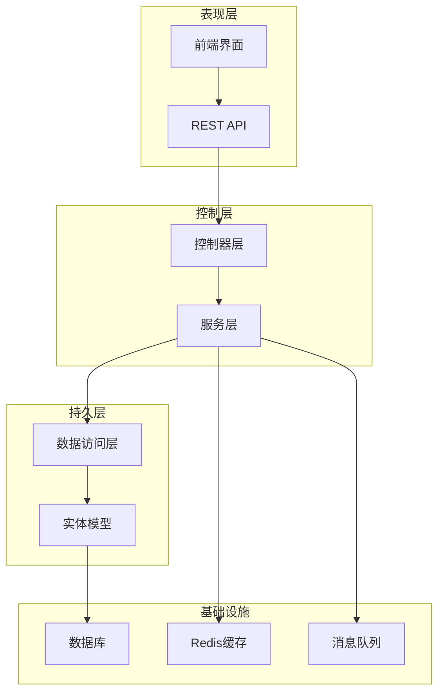
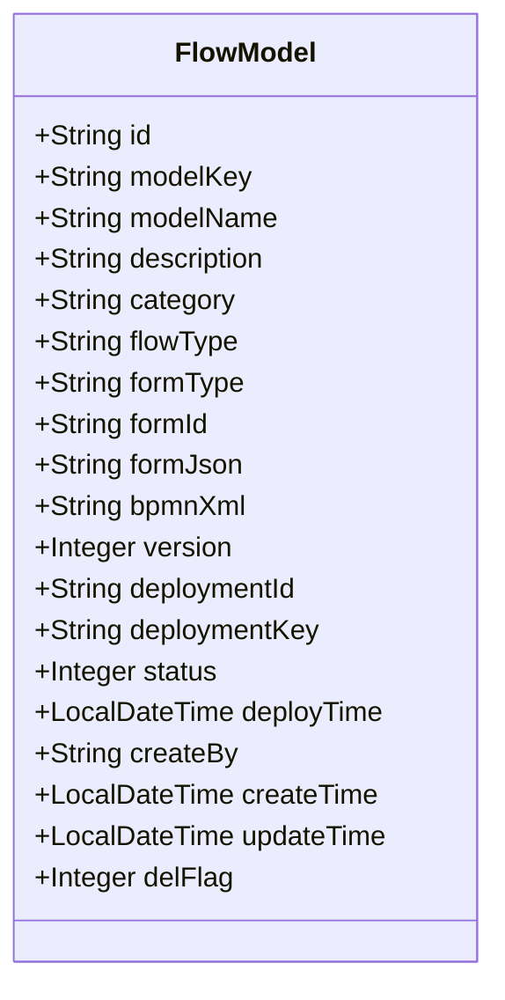
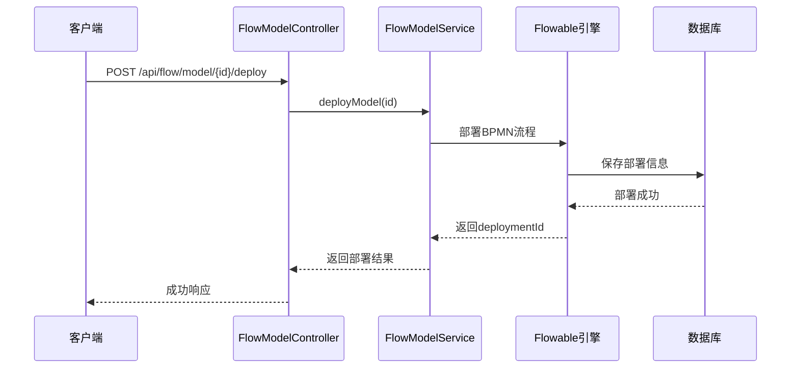
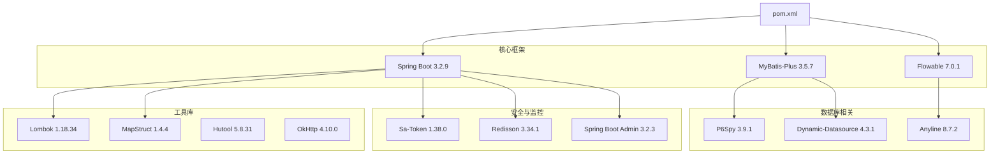
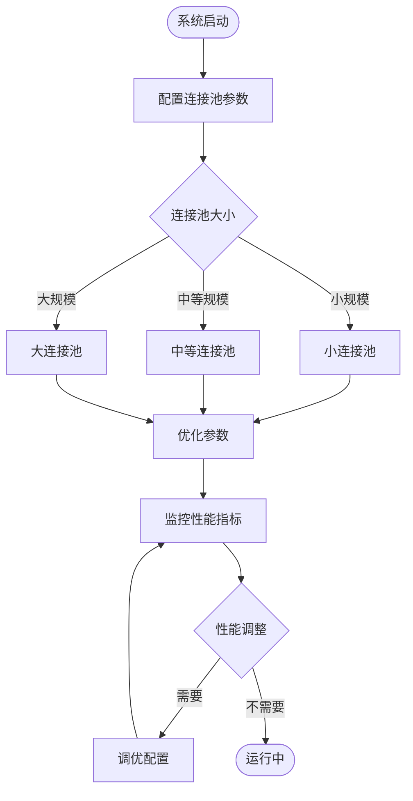

# 工作流管理系统

<cite>
**本文档引用的文件**
- [ForgeFlowApplication.java](file://forge/forge-flow/src/main/java/com/mdframe/forge/flow/ForgeFlowApplication.java)
- [ForgeAdminApplication.java](file://forge/forge-admin/src/main/java/com/mdframe/forge/admin/ForgeAdminApplication.java)
- [pom.xml](file://forge/pom.xml)
- [forge-framework/pom.xml](file://forge/forge-framework/pom.xml)
- [application.yml](file://forge/forge-flow/src/main/resources/application.yml)
- [FlowInstanceController.java](file://forge/forge-flow/src/main/java/com/mdframe/forge/flow/controller/FlowInstanceController.java)
- [FlowModelController.java](file://forge/forge-flow/src/main/java/com/mdframe/forge/flow/controller/FlowModelController.java)
- [FlowModel.java](file://forge/forge-framework/forge-plugin-parent/forge-plugin-flow/src/main/java/com/mdframe/forge/starter/flow/entity/FlowModel.java)
- [FlowInstanceService.java](file://forge/forge-framework/forge-plugin-parent/forge-plugin-flow/src/main/java/com/mdframe/forge/starter/flow/service/FlowInstanceService.java)
</cite>

## 目录
1. [简介](#简介)
2. [项目结构](#项目结构)
3. [核心组件](#核心组件)
4. [架构概览](#架构概览)
5. [详细组件分析](#详细组件分析)
6. [依赖关系分析](#依赖关系分析)
7. [性能考虑](#性能考虑)
8. [故障排除指南](#故障排除指南)
9. [结论](#结论)

## 简介

工作流管理系统是一个基于Spring Boot和Flowable的工作流引擎解决方案。该系统提供了完整的业务流程管理能力，包括流程建模、实例管理、任务处理等功能。系统采用模块化架构设计，通过Maven多模块管理，支持分布式部署和扩展。

该系统集成了多种企业级特性，如多租户支持、权限控制、缓存管理、消息通知等，为企业提供了一套完整的工作流解决方案。

## 项目结构

项目采用Maven多模块架构，主要包含以下核心模块：

**图表来源**
- [pom.xml:114-118](file://forge/pom.xml#L114-L118)
- [forge-framework/pom.xml:30-34](file://forge/forge-framework/pom.xml#L30-L34)

**章节来源**
- [pom.xml:114-118](file://forge/pom.xml#L114-L118)
- [forge-framework/pom.xml:30-34](file://forge/forge-framework/pom.xml#L30-L34)

## 核心组件

### 应用启动类

系统包含两个主要的应用启动类，分别负责不同的服务模块：

**ForgeAdminApplication** - 管理后台应用启动类
- 扫描基础包：com.mdframe.forge
- 启用MyBatis Mapper扫描
- 启用AspectJ代理支持

**ForgeFlowApplication** - 工作流服务启动类  
- 扫描基础包：com.mdframe.forge
- 启用MyBatis Mapper扫描
- 配置Flowable工作流引擎

### 配置管理

系统采用多环境配置管理，支持local、dev、prod三种环境：

**核心配置特性**：
- Undertow Web服务器配置
- MyBatis-Plus ORM框架配置
- Sa-Token认证集成
- 多租户支持配置
- 日志级别动态配置

**章节来源**
- [ForgeAdminApplication.java:8-10](file://forge/forge-admin/src/main/java/com/mdframe/forge/admin/ForgeAdminApplication.java#L8-L10)
- [ForgeFlowApplication.java:12-13](file://forge/forge-flow/src/main/java/com/mdframe/forge/flow/ForgeFlowApplication.java#L12-L13)
- [application.yml:1-69](file://forge/forge-flow/src/main/resources/application.yml#L1-L69)

## 架构概览

系统采用分层架构设计，结合微服务理念，实现了高内聚低耦合的模块化结构：

**图表来源**
- [FlowInstanceController.java:14-17](file://forge/forge-flow/src/main/java/com/mdframe/forge/flow/controller/FlowInstanceController.java#L14-L17)
- [FlowModelController.java:14-17](file://forge/forge-flow/src/main/java/com/mdframe/forge/flow/controller/FlowModelController.java#L14-L17)

## 详细组件分析

### 流程实例管理

流程实例管理是工作流系统的核心功能模块，提供了完整的流程生命周期管理能力。

#### 控制器层

**FlowInstanceController** - 流程实例控制器
- 提供RESTful API接口
- 支持流程发起、状态查询、终止、删除等操作
- 处理流程变量的增删改查

主要接口包括：
- `POST /api/flow/instance/start/{modelKey}` - 发起流程
- `GET /api/flow/instance/status/{businessKey}` - 查询流程状态
- `POST /api/flow/instance/terminate/{businessKey}` - 终止流程
- `DELETE /api/flow/instance/{businessKey}` - 删除流程实例
- `GET /api/flow/instance/variables/{businessKey}` - 获取流程变量
- `PUT /api/flow/instance/variables/{businessKey}` - 更新流程变量

#### 服务层接口

**FlowInstanceService** - 流程实例服务接口
定义了流程实例管理的核心业务方法：
- 发起流程（支持带业务类型和不带业务类型的两种重载）
- 获取流程状态
- 终止流程
- 删除流程实例
- 管理流程变量

#### 数据模型

**FlowModel** - 流程模型实体
流程模型是工作流的基础配置，包含以下关键字段：

**图表来源**
- [FlowModel.java:11-110](file://forge/forge-framework/forge-plugin-parent/forge-plugin-flow/src/main/java/com/mdframe/forge/starter/flow/entity/FlowModel.java#L11-L110)

**章节来源**
- [FlowInstanceController.java:11-105](file://forge/forge-flow/src/main/java/com/mdframe/forge/flow/controller/FlowInstanceController.java#L11-L105)
- [FlowInstanceService.java:7-60](file://forge/forge-framework/forge-plugin-parent/forge-plugin-flow/src/main/java/com/mdframe/forge/starter/flow/service/FlowInstanceService.java#L7-L60)
- [FlowModel.java:8-110](file://forge/forge-framework/forge-plugin-parent/forge-plugin-flow/src/main/java/com/mdframe/forge/starter/flow/entity/FlowModel.java#L8-L110)

### 流程模型管理

流程模型管理模块提供了流程设计和发布的完整功能。

#### 控制器实现

**FlowModelController** - 流程模型控制器
提供完整的CRUD操作和流程发布功能：
- 分页查询流程模型
- 获取模型详情
- 创建和更新流程模型
- 删除流程模型
- 部署、启用、禁用流程模型

#### 流程发布流程

**图表来源**
- [FlowModelController.java:74-80](file://forge/forge-flow/src/main/java/com/mdframe/forge/flow/controller/FlowModelController.java#L74-L80)

**章节来源**
- [FlowModelController.java:11-112](file://forge/forge-flow/src/main/java/com/mdframe/forge/flow/controller/FlowModelController.java#L11-L112)

### 工作流引擎集成

系统基于Flowable工作流引擎构建，提供了强大的流程自动化能力。

#### 核心特性

**流程建模**：
- 支持BPMN 2.0标准
- 可视化流程设计器
- 支持各种流程元素（任务、网关、事件等）

**流程执行**：
- 实时流程监控
- 任务自动分配
- 条件分支处理
- 并行和串行流程

**流程管理**：
- 流程版本控制
- 流程状态跟踪
- 历史记录管理
- 性能统计分析

## 依赖关系分析

系统采用Maven进行依赖管理，核心依赖包括：

**图表来源**
- [pom.xml:94-112](file://forge/pom.xml#L94-L112)

**章节来源**
- [pom.xml:52-53](file://forge/pom.xml#L52-L53)
- [pom.xml:94-112](file://forge/pom.xml#L94-L112)

## 性能考虑

### 缓存策略

系统实现了多层次的缓存机制：
- Redis分布式缓存
- 本地缓存优化
- 数据库查询缓存
- 静态资源缓存

### 连接池配置

### 异步处理

系统支持异步任务处理：
- 定时任务调度
- 消息异步发送
- 大数据量批处理
- 异常情况下的降级处理

## 故障排除指南

### 常见问题诊断

**启动失败排查**：
1. 检查数据库连接配置
2. 验证Redis连接状态
3. 确认端口占用情况
4. 查看日志文件错误信息

**流程执行异常**：
1. 检查流程模型是否正确部署
2. 验证用户权限配置
3. 确认流程变量设置
4. 查看历史执行记录

**性能问题排查**：
1. 监控数据库连接池使用率
2. 检查Redis缓存命中率
3. 分析系统CPU和内存使用
4. 优化慢查询SQL语句

### 日志分析

系统采用结构化日志记录：
- 请求日志：记录API调用详情
- 业务日志：记录关键业务操作
- 错误日志：记录异常和错误信息
- 性能日志：记录性能指标数据

**章节来源**
- [application.yml:13-18](file://forge/forge-flow/src/main/resources/application.yml#L13-L18)

## 结论

工作流管理系统是一个功能完善、架构清晰的企业级解决方案。系统通过模块化设计实现了高度的可扩展性和可维护性，同时集成了丰富的企业级特性。

**主要优势**：
- 基于Flowable的成熟工作流引擎
- 完整的流程生命周期管理
- 多租户和权限控制支持
- 良好的性能和扩展性
- 丰富的插件生态系统

**适用场景**：
- 企业内部审批流程
- 业务流程自动化
- 多部门协作平台
- 复杂业务逻辑处理

系统为企业的数字化转型提供了强有力的技术支撑，能够有效提升业务效率和管理水平。