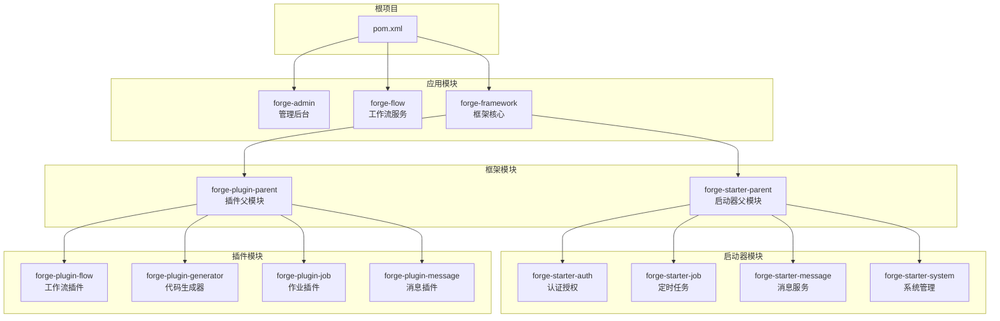
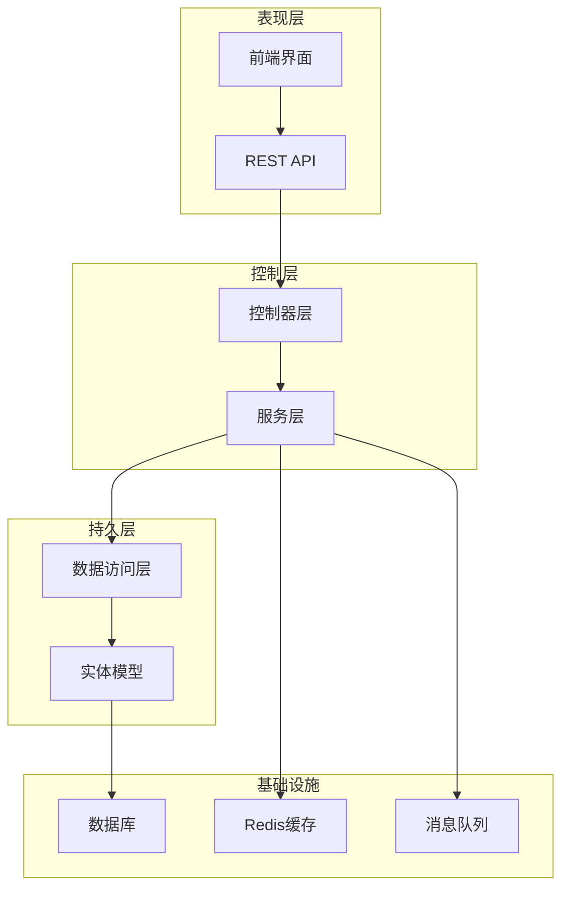
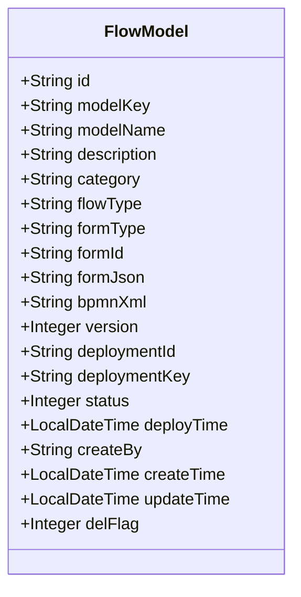
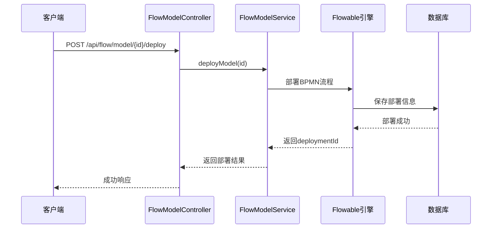
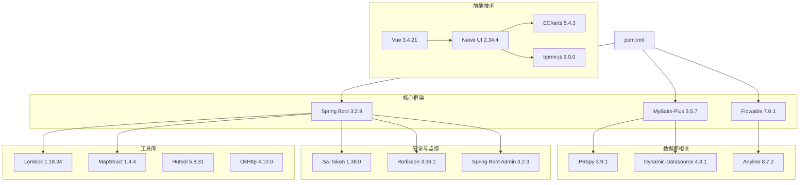

# 工作流管理系统

<cite>
**本文档引用的文件**
- [ForgeFlowApplication.java](file://forge/forge-flow/src/main/java/com/mdframe/forge/flow/ForgeFlowApplication.java)
- [ForgeAdminApplication.java](file://forge/forge-admin/src/main/java/com/mdframe/forge/admin/ForgeAdminApplication.java)
- [pom.xml](file://forge/pom.xml)
- [forge-framework/pom.xml](file://forge/forge-framework/pom.xml)
- [application.yml](file://forge/forge-flow/src/main/resources/application.yml)
- [FlowInstanceController.java](file://forge/forge-flow/src/main/java/com/mdframe/forge/flow/controller/FlowInstanceController.java)
- [FlowModelController.java](file://forge/forge-flow/src/main/java/com/mdframe/forge/flow/controller/FlowModelController.java)
- [FlowModel.java](file://forge/forge-framework/forge-plugin-parent/forge-plugin-flow/src/main/java/com/mdframe/forge/starter/flow/entity/FlowModel.java)
- [FlowInstanceService.java](file://forge/forge-framework/forge-plugin-parent/forge-plugin-flow/src/main/java/com/mdframe/forge/starter/flow/service/FlowInstanceService.java)
- [FlowTemplateController.java](file://forge/forge-flow/src/main/java/com/mdframe/forge/flow/controller/FlowTemplateController.java)
- [FlowTemplate.java](file://forge/forge-framework/forge-plugin-parent/forge-plugin-flow/src/main/java/com/mdframe/forge/starter/flow/template/FlowTemplate.java)
- [FlowConditionRule.java](file://forge/forge-framework/forge-plugin-parent/forge-plugin-flow/src/main/java/com/mdframe/forge/starter/flow/entity/FlowConditionRule.java)
- [FlowMonitorController.java](file://forge/forge-flow/src/main/java/com/mdframe/forge/flow/controller/FlowMonitorController.java)
- [BpmnModeler.vue](file://forge-admin-ui/src/components/bpmn/BpmnModeler.vue)
- [FormDesigner.vue](file://forge-admin-ui/src/components/form-designer/FormDesigner.vue)
- [monitor.vue](file://forge-admin-ui/src/views/flow/monitor.vue)
- [conditionRule.vue](file://forge-admin-ui/src/views/flow/conditionRule.vue)
- [template.vue](file://forge-admin-ui/src/views/flow/template.vue)
- [flow.js](file://forge-admin-ui/src/api/flow.js)
- [flow_tables.sql](file://forge/forge-framework/forge-plugin-parent/forge-plugin-flow/sql/flow_tables.sql)
- [LeaveRequestController.java](file://forge/forge-admin/src/main/java/com/mdframe/forge/leave/controller/LeaveRequestController.java)
- [LeaveRequest.java](file://forge/forge-admin/src/main/java/com/mdframe/forge/leave/entity/LeaveRequest.java)
- [LeaveRequestService.java](file://forge/forge-admin/src/main/java/com/mdframe/forge/leave/service/LeaveRequestService.java)
- [LeaveTaskListener.java](file://forge/forge-admin/src/main/java/com/mdframe/forge/leave/listener/LeaveTaskListener.java)
- [LeaveRequestMapper.java](file://forge/forge-admin/src/main/java/com/mdframe/forge/leave/mapper/LeaveRequestMapper.java)
- [apply.vue](file://forge-admin-ui/src/views/leave/apply.vue)
- [list.vue](file://forge-admin-ui/src/views/leave/list.vue)
- [leave.js](file://forge-admin-ui/src/api/leave.js)
- [leave_request.sql](file://forge/forge-admin/sql/leave_request.sql)
- [leave_process.bpmn20.xml](file://forge/forge-admin/sql/leave_process.bpmn20.xml)
- [FlowTemplateFactory.java](file://forge/forge-framework/forge-plugin-parent/forge-plugin-flow/src/main/java/com/mdframe/forge/starter/flow/template/FlowTemplateFactory.java)
</cite>

## 更新摘要
**变更内容**
- 新增完整的流程模板管理功能模块
- 新增BPMN流程设计器组件
- 新增表单设计器组件
- 新增工作流监控中心
- 新增条件规则管理功能
- 新增请假管理系统
- 新增流程模板数据库表结构
- 更新前端工作流管理界面

## 目录
1. [简介](#简介)
2. [项目结构](#项目结构)
3. [核心组件](#核心组件)
4. [架构概览](#架构概览)
5. [详细组件分析](#详细组件分析)
6. [新增功能模块](#新增功能模块)
7. [依赖关系分析](#依赖关系分析)
8. [性能考虑](#性能考虑)
9. [故障排除指南](#故障排除指南)
10. [结论](#结论)

## 简介

工作流管理系统是一个基于Spring Boot和Flowable的工作流引擎解决方案。该系统提供了完整的业务流程管理能力，包括流程建模、实例管理、任务处理、模板管理、条件规则管理等功能。系统采用模块化架构设计，通过Maven多模块管理，支持分布式部署和扩展。

**更新** 新增了完整的流程模板管理、BPMN流程设计器、表单设计器、工作流监控中心、条件规则管理、请假管理系统等核心功能模块，为企业提供了一套更加完善的工作流解决方案。

该系统集成了多种企业级特性，如多租户支持、权限控制、缓存管理、消息通知等，为企业提供了一套完整的工作流解决方案。

## 项目结构

项目采用Maven多模块架构，主要包含以下核心模块：

**图表来源**
- [pom.xml:114-118](file://forge/pom.xml#L114-L118)
- [forge-framework/pom.xml:30-34](file://forge/forge-framework/pom.xml#L30-L34)

**章节来源**
- [pom.xml:114-118](file://forge/pom.xml#L114-L118)
- [forge-framework/pom.xml:30-34](file://forge/forge-framework/pom.xml#L30-L34)

## 核心组件

### 应用启动类

系统包含两个主要的应用启动类，分别负责不同的服务模块：

**ForgeAdminApplication** - 管理后台应用启动类
- 扫描基础包：com.mdframe.forge
- 启用MyBatis Mapper扫描
- 启用AspectJ代理支持

**ForgeFlowApplication** - 工作流服务启动类  
- 扫描基础包：com.mdframe.forge
- 启用MyBatis Mapper扫描
- 配置Flowable工作流引擎

### 配置管理

系统采用多环境配置管理，支持local、dev、prod三种环境：

**核心配置特性**：
- Undertow Web服务器配置
- MyBatis-Plus ORM框架配置
- Sa-Token认证集成
- 多租户支持配置
- 日志级别动态配置

**章节来源**
- [ForgeAdminApplication.java:8-10](file://forge/forge-admin/src/main/java/com/mdframe/forge/admin/ForgeAdminApplication.java#L8-L10)
- [ForgeFlowApplication.java:12-13](file://forge/forge-flow/src/main/java/com/mdframe/forge/flow/ForgeFlowApplication.java#L12-L13)
- [application.yml:1-69](file://forge/forge-flow/src/main/resources/application.yml#L1-L69)

## 架构概览

系统采用分层架构设计，结合微服务理念，实现了高内聚低耦合的模块化结构：

**图表来源**
- [FlowInstanceController.java:14-17](file://forge/forge-flow/src/main/java/com/mdframe/forge/flow/controller/FlowInstanceController.java#L14-L17)
- [FlowModelController.java:14-17](file://forge/forge-flow/src/main/java/com/mdframe/forge/flow/controller/FlowModelController.java#L14-L17)

## 详细组件分析

### 流程实例管理

流程实例管理是工作流系统的核心功能模块，提供了完整的流程生命周期管理能力。

#### 控制器层

**FlowInstanceController** - 流程实例控制器
- 提供RESTful API接口
- 支持流程发起、状态查询、终止、删除等操作
- 处理流程变量的增删改查

主要接口包括：
- `POST /api/flow/instance/start/{modelKey}` - 发起流程
- `GET /api/flow/instance/status/{businessKey}` - 查询流程状态
- `POST /api/flow/instance/terminate/{businessKey}` - 终止流程
- `DELETE /api/flow/instance/{businessKey}` - 删除流程实例
- `GET /api/flow/instance/variables/{businessKey}` - 获取流程变量
- `PUT /api/flow/instance/variables/{businessKey}` - 更新流程变量

#### 服务层接口

**FlowInstanceService** - 流程实例服务接口
定义了流程实例管理的核心业务方法：
- 发起流程（支持带业务类型和不带业务类型的两种重载）
- 获取流程状态
- 终止流程
- 删除流程实例
- 管理流程变量

#### 数据模型

**FlowModel** - 流程模型实体
流程模型是工作流的基础配置，包含以下关键字段：

**图表来源**
- [FlowModel.java:11-110](file://forge/forge-framework/forge-plugin-parent/forge-plugin-flow/src/main/java/com/mdframe/forge/starter/flow/entity/FlowModel.java#L11-L110)

**章节来源**
- [FlowInstanceController.java:11-105](file://forge/forge-flow/src/main/java/com/mdframe/forge/flow/controller/FlowInstanceController.java#L11-L105)
- [FlowInstanceService.java:7-60](file://forge/forge-framework/forge-plugin-parent/forge-plugin-flow/src/main/java/com/mdframe/forge/starter/flow/service/FlowInstanceService.java#L7-L60)
- [FlowModel.java:8-110](file://forge/forge-framework/forge-plugin-parent/forge-plugin-flow/src/main/java/com/mdframe/forge/starter/flow/entity/FlowModel.java#L8-L110)

### 流程模型管理

流程模型管理模块提供了流程设计和发布的完整功能。

#### 控制器实现

**FlowModelController** - 流程模型控制器
提供完整的CRUD操作和流程发布功能：
- 分页查询流程模型
- 获取模型详情
- 创建和更新流程模型
- 删除流程模型
- 部署、启用、禁用流程模型

#### 流程发布流程

**图表来源**
- [FlowModelController.java:74-80](file://forge/forge-flow/src/main/java/com/mdframe/forge/flow/controller/FlowModelController.java#L74-L80)

**章节来源**
- [FlowModelController.java:11-112](file://forge/forge-flow/src/main/java/com/mdframe/forge/flow/controller/FlowModelController.java#L11-L112)

### 工作流引擎集成

系统基于Flowable工作流引擎构建，提供了强大的流程自动化能力。

#### 核心特性

**流程建模**：
- 支持BPMN 2.0标准
- 可视化流程设计器
- 支持各种流程元素（任务、网关、事件等）

**流程执行**：
- 实时流程监控
- 任务自动分配
- 条件分支处理
- 并行和串行流程

**流程管理**：
- 流程版本控制
- 流程状态跟踪
- 历史记录管理
- 性能统计分析

## 新增功能模块

### 流程模板管理

**更新** 新增了完整的流程模板管理功能，支持模板的创建、编辑、启用、禁用和复制操作。

#### 后端实现

**FlowTemplateController** - 流程模板控制器
提供模板管理的完整API：
- 分页查询模板列表
- 获取启用的模板
- 获取模板详情
- 创建、更新、删除模板
- 启用、禁用模板
- 从模板创建流程模型
- 复制模板

#### 前端实现

**template.vue** - 模板管理页面
提供可视化的模板管理界面：
- 模板列表展示
- 搜索和筛选功能
- BPMN流程设计器
- 模板状态管理
- 从模板创建流程

#### 数据库结构

**sys_flow_template** - 流程模板表
包含模板的基本信息、BPMN流程XML、表单配置等字段。

**章节来源**
- [FlowTemplateController.java:1-141](file://forge/forge-flow/src/main/java/com/mdframe/forge/flow/controller/FlowTemplateController.java#L1-L141)
- [FlowTemplate.java:1-52](file://forge/forge-framework/forge-plugin-parent/forge-plugin-flow/src/main/java/com/mdframe/forge/starter/flow/template/FlowTemplate.java#L1-L52)
- [template.vue:1-594](file://forge-admin-ui/src/views/flow/template.vue#L1-L594)
- [flow_tables.sql:152-173](file://forge/forge-framework/forge-plugin-parent/forge-plugin-flow/sql/flow_tables.sql#L152-L173)

### BPMN流程设计器

**更新** 新增了专业的BPMN流程设计器组件，提供可视化的流程设计体验。

#### 组件功能

**BpmnModeler.vue** - BPMN流程设计器
- 支持流程元素的拖拽和编辑
- 实时属性配置面板
- 撤销/重做操作
- 流程图导出功能
- 交互式流程图查看

#### 设计器特性

- **工具栏**：撤销、重做、放大缩小、导出功能
- **画布区域**：支持各种BPMN元素的绘制
- **属性面板**：实时编辑流程元素属性
- **元素类型**：用户任务、服务任务、序列流等
- **条件配置**：支持流转条件的可视化配置

**章节来源**
- [BpmnModeler.vue:1-606](file://forge-admin-ui/src/components/bpmn/BpmnModeler.vue#L1-L606)
- [template.vue:114-122](file://forge-admin-ui/src/views/flow/template.vue#L114-L122)

### 表单设计器

**更新** 新增了灵活的表单设计器组件，支持拖拽式的表单设计。

#### 组件功能

**FormDesigner.vue** - 表单设计器
- 组件面板：基础字段、高级字段、布局组件
- 设计区域：拖拽式表单设计
- 属性配置：组件属性的可视化配置
- 预览功能：实时表单预览
- 导出功能：表单配置导出

#### 支持的组件类型

- **基础字段**：输入框、文本域、数字输入、下拉选择等
- **高级字段**：文件上传、富文本、级联选择等
- **布局组件**：分割线、标题、描述文本等

**章节来源**
- [FormDesigner.vue:1-743](file://forge-admin-ui/src/components/form-designer/FormDesigner.vue#L1-L743)

### 工作流监控中心

**更新** 新增了全面的工作流监控功能，提供实时的流程状态监控和统计分析。

#### 监控功能

**FlowMonitorController** - 流程监控控制器
- 实时统计：运行中流程、待办任务、今日完成、超时任务
- 流程实例监控：分页查询、状态筛选、时间范围查询
- 流程详情：处理历史、当前节点、处理人信息
- 流程图查看：交互式流程图展示
- 操作控制：挂起、激活、终止流程

#### 前端实现

**monitor.vue** - 监控页面
- 统计卡片：关键指标实时展示
- 搜索区域：多维度查询条件
- 数据表格：流程实例列表
- 图表展示：任务处理趋势、流程分布统计
- 抽屉详情：流程实例详细信息

**章节来源**
- [FlowMonitorController.java:1-250](file://forge/forge-flow/src/main/java/com/mdframe/forge/flow/controller/FlowMonitorController.java#L1-L250)
- [monitor.vue:1-525](file://forge-admin-ui/src/views/flow/monitor.vue#L1-L525)

### 条件规则管理

**更新** 新增了条件规则管理功能，支持流程流转条件的可视化配置。

#### 规则功能

**FlowConditionRule.java** - 条件规则实体
- 规则名称和编码管理
- 规则类型：处理条件、流转条件、通知条件
- 条件表达式：支持SpEL表达式
- 条件项：字段、操作符、值的组合
- 优先级控制：规则执行顺序
- 测试功能：规则验证和测试

#### 管理界面

**conditionRule.vue** - 条件规则管理页面
- 规则列表：分页展示、状态管理
- 规则编辑：可视化条件配置
- 表达式编辑：SpEL表达式编写
- 条件项：动态添加删除条件
- 测试功能：在线规则测试

**章节来源**
- [FlowConditionRule.java:1-107](file://forge/forge-framework/forge-plugin-parent/forge-plugin-flow/src/main/java/com/mdframe/forge/starter/flow/entity/FlowConditionRule.java#L1-L107)
- [conditionRule.vue:1-526](file://forge-admin-ui/src/views/flow/conditionRule.vue#L1-L526)

### 请假管理系统

**更新** 新增了完整的请假管理系统，基于工作流引擎实现请假申请的全流程管理。

#### 后端实现

**LeaveRequestController** - 请假申请控制器
提供请假管理的完整API：
- 提交请假申请（启动流程）
- 保存草稿
- 更新草稿
- 获取请假详情
- 分页查询我的请假列表
- 撤销申请
- 删除草稿

#### 业务实体

**LeaveRequest** - 请假申请实体
包含请假申请的完整业务信息：
- 申请人信息：用户ID、姓名、部门
- 请假信息：类型、开始时间、结束时间、天数、原因、附件
- 审批信息：状态、审批人、审批时间、审批意见、审批附件
- 系统字段：创建时间、更新时间、租户ID、删除标记

#### 工作流集成

**LeaveTaskListener** - 请假任务监听器
- 监听审批任务完成事件
- 自动更新业务数据状态
- 处理审批结果和附件

#### 数据库设计

**biz_leave_request** - 请假业务表
- 主键ID和业务Key关联
- 完整的请假信息存储
- 审批状态跟踪
- 附件JSON存储

**章节来源**
- [LeaveRequestController.java:1-100](file://forge/forge-admin/src/main/java/com/mdframe/forge/leave/controller/LeaveRequestController.java#L1-L100)
- [LeaveRequest.java:1-148](file://forge/forge-admin/src/main/java/com/mdframe/forge/leave/entity/LeaveRequest.java#L1-L148)
- [LeaveRequestService.java:1-76](file://forge/forge-admin/src/main/java/com/mdframe/forge/leave/service/LeaveRequestService.java#L1-L76)
- [LeaveTaskListener.java:1-71](file://forge/forge-admin/src/main/java/com/mdframe/forge/leave/listener/LeaveTaskListener.java#L1-L71)
- [LeaveRequestMapper.java:1-16](file://forge/forge-admin/src/main/java/com/mdframe/forge/leave/mapper/LeaveRequestMapper.java#L1-L16)
- [leave_request.sql:1-113](file://forge/forge-admin/sql/leave_request.sql#L1-L113)
- [leave_process.bpmn20.xml:1-128](file://forge/forge-admin/sql/leave_process.bpmn20.xml#L1-L128)

### 前端请假管理界面

**更新** 新增了完整的前端请假管理界面，提供用户友好的请假申请和管理体验。

#### 请假申请页面

**apply.vue** - 请假申请页面
- 表单验证：必填字段、时间范围验证
- 附件上传：支持多文件上传
- 实时计算：请假天数自动计算
- 提交流程：草稿保存和正式提交

#### 请假列表页面

**list.vue** - 请假列表页面
- 状态筛选：草稿、审批中、已通过、已驳回、已取消
- 操作按钮：查看详情、编辑草稿、删除草稿、撤销申请
- 详情弹窗：完整的请假信息展示
- 分页查询：支持分页和搜索

#### API接口

**leave.js** - 请假API接口
- 提交请假申请
- 保存草稿
- 更新草稿
- 获取请假详情
- 分页查询请假列表
- 撤销申请
- 删除草稿

**章节来源**
- [apply.vue:1-252](file://forge-admin-ui/src/views/leave/apply.vue#L1-L252)
- [list.vue:1-357](file://forge-admin-ui/src/views/leave/list.vue#L1-L357)
- [leave.js:1-55](file://forge-admin-ui/src/api/leave.js#L1-L55)

### API接口集成

**更新** 新增了完整的前端API接口，支持所有新增功能的前后端交互。

#### 接口功能

**flow.js** - 工作流API接口
- 流程模板管理：CRUD操作、启用禁用、复制功能
- 流程模型管理：创建、部署、启用禁用
- 流程监控：统计数据、实例查询、详情获取
- 条件规则：规则管理、测试功能
- 表单管理：表单定义查询

**章节来源**
- [flow.js:130-404](file://forge-admin-ui/src/api/flow.js#L130-L404)

## 依赖关系分析

系统采用Maven进行依赖管理，核心依赖包括：

**图表来源**
- [pom.xml:94-112](file://forge/pom.xml#L94-L112)

**章节来源**
- [pom.xml:52-53](file://forge/pom.xml#L52-L53)
- [pom.xml:94-112](file://forge/pom.xml#L94-L112)

## 性能考虑

### 缓存策略

系统实现了多层次的缓存机制：
- Redis分布式缓存
- 本地缓存优化
- 数据库查询缓存
- 静态资源缓存

### 连接池配置

### 异步处理

系统支持异步任务处理：
- 定时任务调度
- 消息异步发送
- 大数据量批处理
- 异常情况下的降级处理

### 前端性能优化

**更新** 新增了前端性能优化措施：
- 组件懒加载
- 图表按需渲染
- 大数据分页处理
- 缓存策略优化

## 故障排除指南

### 常见问题诊断

**启动失败排查**：
1. 检查数据库连接配置
2. 验证Redis连接状态
3. 确认端口占用情况
4. 查看日志文件错误信息

**流程执行异常**：
1. 检查流程模型是否正确部署
2. 验证用户权限配置
3. 确认流程变量设置
4. 查看历史执行记录

**性能问题排查**：
1. 监控数据库连接池使用率
2. 检查Redis缓存命中率
3. 分析系统CPU和内存使用
4. 优化慢查询SQL语句

**新增功能故障排查**：
1. **模板管理**：检查模板表结构和数据完整性
2. **BPMN设计器**：验证bpmn-js依赖和XML格式
3. **表单设计器**：确认组件配置和表单JSON格式
4. **监控中心**：检查Flowable引擎状态和统计数据
5. **条件规则**：验证SpEL表达式语法和规则优先级
6. **请假管理**：验证流程部署和业务数据一致性

### 日志分析

系统采用结构化日志记录：
- 请求日志：记录API调用详情
- 业务日志：记录关键业务操作
- 错误日志：记录异常和错误信息
- 性能日志：记录性能指标数据

**章节来源**
- [application.yml:13-18](file://forge/forge-flow/src/main/resources/application.yml#L13-L18)

## 结论

工作流管理系统是一个功能完善、架构清晰的企业级解决方案。系统通过模块化设计实现了高度的可扩展性和可维护性，同时集成了丰富的企业级特性。

**更新后的主要优势**：
- 基于Flowable的成熟工作流引擎
- 完整的流程生命周期管理
- 多租户和权限控制支持
- 良好的性能和扩展性
- 丰富的插件生态系统
- **新增的流程模板管理功能**
- **专业的BPMN流程设计器**
- **灵活的表单设计器**
- **全面的工作流监控中心**
- **可视化的条件规则管理**
- **完整的请假管理系统**

**适用场景**：
- 企业内部审批流程
- 业务流程自动化
- 多部门协作平台
- 复杂业务逻辑处理
- **标准化流程模板管理**
- **可视化流程设计**
- **实时流程监控分析**
- **员工请假管理**

系统为企业的数字化转型提供了强有力的技术支撑，能够有效提升业务效率和管理水平。新增的功能模块进一步增强了系统的实用性和易用性，为企业提供了更加完善的流程管理解决方案。