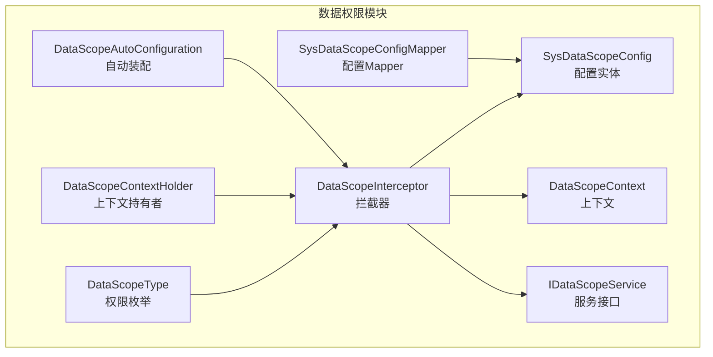
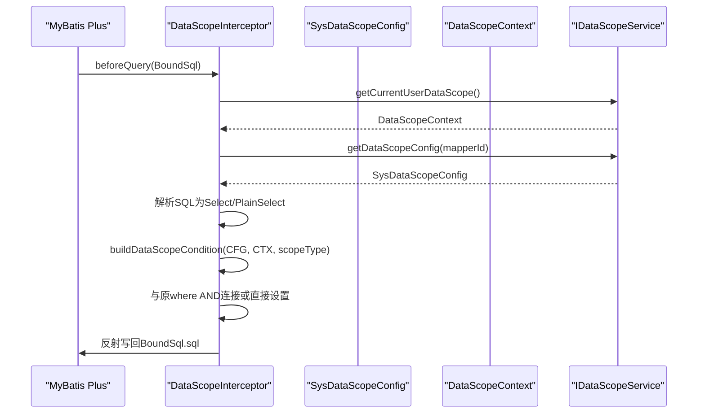
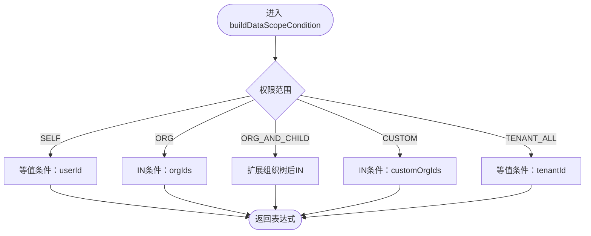
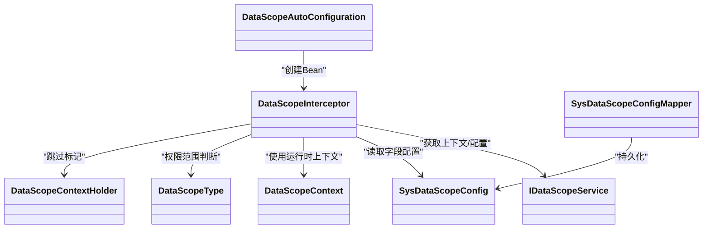

# SQL条件生成

<cite>
**本文引用的文件**
- [DataScopeInterceptor.java](file://forge/forge-framework/forge-starter-parent/forge-starter-datascope/src/main/java/com/mdframe/forge/starter/datascope/handler/DataScopeInterceptor.java)
- [DataScopeType.java](file://forge/forge-framework/forge-starter-parent/forge-starter-datascope/src/main/java/com/mdframe/forge/starter/datascope/enums/DataScopeType.java)
- [SysDataScopeConfig.java](file://forge/forge-framework/forge-starter-parent/forge-starter-datascope/src/main/java/com/mdframe/forge/starter/datascope/entity/SysDataScopeConfig.java)
- [DataScopeContext.java](file://forge/forge-framework/forge-starter-parent/forge-starter-datascope/src/main/java/com/mdframe/forge/starter/datascope/context/DataScopeContext.java)
- [IDataScopeService.java](file://forge/forge-framework/forge-starter-parent/forge-starter-datascope/src/main/java/com/mdframe/forge/starter/datascope/service/IDataScopeService.java)
- [DATA_SCOPE_CONFIG_GUIDE.md](file://forge/forge-framework/forge-starter-parent/forge-starter-datascope/DATA_SCOPE_CONFIG_GUIDE.md)
- [DataScopeAutoConfiguration.java](file://forge/forge-framework/forge-starter-parent/forge-starter-datascope/src/main/java/com/mdframe/forge/starter/datascope/config/DataScopeAutoConfiguration.java)
- [DataScopeContextHolder.java](file://forge/forge-framework/forge-starter-parent/forge-starter-datascope/src/main/java/com/mdframe/forge/starter/datascope/context/DataScopeContextHolder.java)
- [SysDataScopeConfigMapper.java](file://forge/forge-framework/forge-starter-parent/forge-starter-datascope/src/main/java/com/mdframe/forge/starter/datascope/mapper/SysDataScopeConfigMapper.java)
</cite>

## 目录
1. [简介](#简介)
2. [项目结构](#项目结构)
3. [核心组件](#核心组件)
4. [架构总览](#架构总览)
5. [详细组件分析](#详细组件分析)
6. [依赖关系分析](#依赖关系分析)
7. [性能考量](#性能考量)
8. [故障排查指南](#故障排查指南)
9. [结论](#结论)
10. [附录](#附录)

## 简介
本文件聚焦Forge框架中“数据权限拦截器”的SQL条件生成能力，系统化解析DataScopeInterceptor如何在MyBatis查询执行前，依据配置与上下文动态构建WHERE条件，覆盖等值条件、IN条件以及复杂SQL表达式（含占位符替换与表达式解析）。文档同时给出不同权限类型的生成策略、安全与性能注意事项，并提供可复用的实践范式。

## 项目结构
围绕数据权限的SQL条件生成，相关代码主要分布在以下模块与文件：
- handler层：拦截器实现，负责解析SQL、构建条件、改写BoundSql
- entity与enums：配置与权限范围模型
- context：运行时上下文（用户ID、组织ID、租户ID等）
- service：数据权限服务接口（提供上下文、配置、组织树扩展等）
- config：自动装配与注册
- mapper：配置持久化接口

图表来源
- [DataScopeInterceptor.java](file://forge/forge-framework/forge-starter-parent/forge-starter-datascope/src/main/java/com/mdframe/forge/starter/datascope/handler/DataScopeInterceptor.java#L39-L117)
- [SysDataScopeConfig.java](file://forge/forge-framework/forge-starter-parent/forge-starter-datascope/src/main/java/com/mdframe/forge/starter/datascope/entity/SysDataScopeConfig.java#L16-L84)
- [DataScopeContext.java](file://forge/forge-framework/forge-starter-parent/forge-starter-datascope/src/main/java/com/mdframe/forge/starter/datascope/context/DataScopeContext.java#L16-L47)
- [IDataScopeService.java](file://forge/forge-framework/forge-starter-parent/forge-starter-datascope/src/main/java/com/mdframe/forge/starter/datascope/service/IDataScopeService.java#L12-L41)
- [DataScopeType.java](file://forge/forge-framework/forge-starter-parent/forge-starter-datascope/src/main/java/com/mdframe/forge/starter/datascope/enums/DataScopeType.java#L11-L60)
- [DataScopeContextHolder.java](file://forge/forge-framework/forge-starter-parent/forge-starter-datascope/src/main/java/com/mdframe/forge/starter/datascope/context/DataScopeContextHolder.java#L7-L61)
- [DataScopeAutoConfiguration.java](file://forge/forge-framework/forge-starter-parent/forge-starter-datascope/src/main/java/com/mdframe/forge/starter/datascope/config/DataScopeAutoConfiguration.java#L20-L37)
- [SysDataScopeConfigMapper.java](file://forge/forge-framework/forge-starter-parent/forge-starter-datascope/src/main/java/com/mdframe/forge/starter/datascope/mapper/SysDataScopeConfigMapper.java#L10-L12)

章节来源
- [DataScopeInterceptor.java](file://forge/forge-framework/forge-starter-parent/forge-starter-datascope/src/main/java/com/mdframe/forge/starter/datascope/handler/DataScopeInterceptor.java#L39-L117)
- [DataScopeAutoConfiguration.java](file://forge/forge-framework/forge-starter-parent/forge-starter-datascope/src/main/java/com/mdframe/forge/starter/datascope/config/DataScopeAutoConfiguration.java#L20-L37)

## 核心组件
- DataScopeInterceptor：MyBatis Plus内部拦截器，负责在查询执行前解析SQL、构建数据权限条件并改写BoundSql。
- SysDataScopeConfig：数据权限配置实体，包含表别名、用户ID字段、组织ID字段、租户ID字段等。
- DataScopeContext：运行时上下文，包含userId、orgIds、customOrgIds、tenantId、minDataScope等。
- IDataScopeService：数据权限服务接口，提供上下文获取、配置查询、组织树扩展等。
- DataScopeType：权限范围枚举，涵盖全部、本人、本组织、本组织及子组织、自定义、租户全部。
- DataScopeContextHolder：线程本地的“跳过数据权限”标记工具。
- DataScopeAutoConfiguration：自动装配，注册拦截器Bean供MyBatis Plus统一注册。

章节来源
- [DataScopeInterceptor.java](file://forge/forge-framework/forge-starter-parent/forge-starter-datascope/src/main/java/com/mdframe/forge/starter/datascope/handler/DataScopeInterceptor.java#L39-L117)
- [SysDataScopeConfig.java](file://forge/forge-framework/forge-starter-parent/forge-starter-datascope/src/main/java/com/mdframe/forge/starter/datascope/entity/SysDataScopeConfig.java#L16-L84)
- [DataScopeContext.java](file://forge/forge-framework/forge-starter-parent/forge-starter-datascope/src/main/java/com/mdframe/forge/starter/datascope/context/DataScopeContext.java#L16-L47)
- [IDataScopeService.java](file://forge/forge-framework/forge-starter-parent/forge-starter-datascope/src/main/java/com/mdframe/forge/starter/datascope/service/IDataScopeService.java#L12-L41)
- [DataScopeType.java](file://forge/forge-framework/forge-starter-parent/forge-starter-datascope/src/main/java/com/mdframe/forge/starter/datascope/enums/DataScopeType.java#L11-L60)
- [DataScopeContextHolder.java](file://forge/forge-framework/forge-starter-parent/forge-starter-datascope/src/main/java/com/mdframe/forge/starter/datascope/context/DataScopeContextHolder.java#L7-L61)
- [DataScopeAutoConfiguration.java](file://forge/forge-framework/forge-starter-parent/forge-starter-datascope/src/main/java/com/mdframe/forge/starter/datascope/config/DataScopeAutoConfiguration.java#L20-L37)

## 架构总览
拦截器在查询执行前介入，按如下流程工作：
- 读取Mapper方法ID，定位数据权限配置
- 获取当前用户上下文（含最小权限范围）
- 解析SQL为抽象语法树，定位PlainSelect与where
- 根据权限范围与配置生成条件表达式
- 将新条件与原where进行AND连接或直接设置
- 反射写回BoundSql，完成SQL改写

图表来源
- [DataScopeInterceptor.java](file://forge/forge-framework/forge-starter-parent/forge-starter-datascope/src/main/java/com/mdframe/forge/starter/datascope/handler/DataScopeInterceptor.java#L41-L117)
- [IDataScopeService.java](file://forge/forge-framework/forge-starter-parent/forge-starter-datascope/src/main/java/com/mdframe/forge/starter/datascope/service/IDataScopeService.java#L12-L41)
- [SysDataScopeConfig.java](file://forge/forge-framework/forge-starter-parent/forge-starter-datascope/src/main/java/com/mdframe/forge/starter/datascope/entity/SysDataScopeConfig.java#L16-L84)
- [DataScopeContext.java](file://forge/forge-framework/forge-starter-parent/forge-starter-datascope/src/main/java/com/mdframe/forge/starter/datascope/context/DataScopeContext.java#L16-L47)

## 详细组件分析

### DataScopeInterceptor：SQL条件构建核心算法
- SQL解析与改写
  - 使用JSQParser解析原始SQL，仅对SELECT语句进行处理；PlainSelect中提取/设置where。
  - 若已有where，则以AND连接；否则直接设置。
- 条件生成入口
  - buildDataScopeCondition根据权限范围选择不同分支，分别调用buildColumnCondition生成具体表达式。
- 字段条件生成策略
  - 简单字段：等值条件（SELF/TENANT_ALL）或IN条件（ORG/ORG_AND_CHILD/CUSTOM）。
  - 复杂SQL：以“<sql>”开头，先进行占位符替换，再解析为表达式。
- 占位符替换
  - 支持#{userId}、#{tenantId}、#{orgIds}、#{customOrgIds}，分别替换为上下文中的数值或逗号分隔的列表字符串。
- 表达式构造
  - 等值条件：Column = LongValue
  - IN条件：Column IN (LongValue,...)

图表来源
- [DataScopeInterceptor.java](file://forge/forge-framework/forge-starter-parent/forge-starter-datascope/src/main/java/com/mdframe/forge/starter/datascope/handler/DataScopeInterceptor.java#L161-L209)

章节来源
- [DataScopeInterceptor.java](file://forge/forge-framework/forge-starter-parent/forge-starter-datascope/src/main/java/com/mdframe/forge/starter/datascope/handler/DataScopeInterceptor.java#L122-L156)
- [DataScopeInterceptor.java](file://forge/forge-framework/forge-starter-parent/forge-starter-datascope/src/main/java/com/mdframe/forge/starter/datascope/handler/DataScopeInterceptor.java#L161-L209)
- [DataScopeInterceptor.java](file://forge/forge-framework/forge-starter-parent/forge-starter-datascope/src/main/java/com/mdframe/forge/starter/datascope/handler/DataScopeInterceptor.java#L221-L260)
- [DataScopeInterceptor.java](file://forge/forge-framework/forge-starter-parent/forge-starter-datascope/src/main/java/com/mdframe/forge/starter/datascope/handler/DataScopeInterceptor.java#L265-L281)
- [DataScopeInterceptor.java](file://forge/forge-framework/forge-starter-parent/forge-starter-datascope/src/main/java/com/mdframe/forge/starter/datascope/handler/DataScopeInterceptor.java#L286-L314)
- [DataScopeInterceptor.java](file://forge/forge-framework/forge-starter-parent/forge-starter-datascope/src/main/java/com/mdframe/forge/starter/datascope/handler/DataScopeInterceptor.java#L319-L348)

### buildDataScopeCondition：按权限类型构建WHERE条件
- SELF：生成“字段 = userId”的等值条件
- ORG：若上下文提供orgIds，生成“字段 IN (orgIds)”
- ORG_AND_CHILD：通过服务扩展为“字段 IN (orgIds ∪ 子组织)”
- CUSTOM：若提供customOrgIds，生成“字段 IN (customOrgIds)”
- TENANT_ALL：若配置了租户字段，生成“字段 = tenantId”的等值条件

章节来源
- [DataScopeInterceptor.java](file://forge/forge-framework/forge-starter-parent/forge-starter-datascope/src/main/java/com/mdframe/forge/starter/datascope/handler/DataScopeInterceptor.java#L170-L209)
- [IDataScopeService.java](file://forge/forge-framework/forge-starter-parent/forge-starter-datascope/src/main/java/com/mdframe/forge/starter/datascope/service/IDataScopeService.java#L29-L35)

### buildColumnCondition：简单字段与复杂SQL表达式
- 简单字段：优先走IN（当提供orgIds/customOrgIds），否则走等值
- 复杂SQL：以“<sql>”开头，去除标签后进行占位符替换，再解析为表达式

章节来源
- [DataScopeInterceptor.java](file://forge/forge-framework/forge-starter-parent/forge-starter-datascope/src/main/java/com/mdframe/forge/starter/datascope/handler/DataScopeInterceptor.java#L221-L260)

### buildCustomSqlCondition：复杂SQL表达式解析与占位符替换
- 占位符替换：userId、tenantId、orgIds、customOrgIds
- 表达式解析：使用CCJSqlParserUtil.parseCondExpression解析为Expression
- 异常处理：解析失败记录错误日志并返回null

章节来源
- [DataScopeInterceptor.java](file://forge/forge-framework/forge-starter-parent/forge-starter-datascope/src/main/java/com/mdframe/forge/starter/datascope/handler/DataScopeInterceptor.java#L265-L281)
- [DataScopeInterceptor.java](file://forge/forge-framework/forge-starter-parent/forge-starter-datascope/src/main/java/com/mdframe/forge/starter/datascope/handler/DataScopeInterceptor.java#L286-L314)

### 等值与IN条件构造
- 等值条件：Column = LongValue
- IN条件：Column IN (LongValue,...)，值列表来自orgIds或customOrgIds

章节来源
- [DataScopeInterceptor.java](file://forge/forge-framework/forge-starter-parent/forge-starter-datascope/src/main/java/com/mdframe/forge/starter/datascope/handler/DataScopeInterceptor.java#L319-L348)

### 权限类型与上下文
- DataScopeType：ALL、SELF、ORG、ORG_AND_CHILD、CUSTOM、TENANT_ALL
- DataScopeContext：userId、orgIds、roleIds、minDataScope、customOrgIds、tenantId

章节来源
- [DataScopeType.java](file://forge/forge-framework/forge-starter-parent/forge-starter-datascope/src/main/java/com/mdframe/forge/starter/datascope/enums/DataScopeType.java#L11-L60)
- [DataScopeContext.java](file://forge/forge-framework/forge-starter-parent/forge-starter-datascope/src/main/java/com/mdframe/forge/starter/datascope/context/DataScopeContext.java#L16-L47)

### 配置实体与字段含义
- SysDataScopeConfig：包含表别名、userIdColumn、orgIdColumn、tenantIdColumn等
- 字段支持两种模式：简单字段名或以“<sql>”开头的复杂表达式

章节来源
- [SysDataScopeConfig.java](file://forge/forge-framework/forge-starter-parent/forge-starter-datascope/src/main/java/com/mdframe/forge/starter/datascope/entity/SysDataScopeConfig.java#L16-L84)
- [DATA_SCOPE_CONFIG_GUIDE.md](file://forge/forge-framework/forge-starter-parent/forge-starter-datascope/DATA_SCOPE_CONFIG_GUIDE.md#L82-L142)

### 运行时控制与注册
- DataScopeContextHolder：提供skipDataScope/clearSkip/isSkip/executeWithoutDataScope等静态方法
- DataScopeAutoConfiguration：创建并暴露DataScopeInterceptor Bean，交由MyBatis Plus统一注册

章节来源
- [DataScopeContextHolder.java](file://forge/forge-framework/forge-starter-parent/forge-starter-datascope/src/main/java/com/mdframe/forge/starter/datascope/context/DataScopeContextHolder.java#L7-L61)
- [DataScopeAutoConfiguration.java](file://forge/forge-framework/forge-starter-parent/forge-starter-datascope/src/main/java/com/mdframe/forge/starter/datascope/config/DataScopeAutoConfiguration.java#L20-L37)

## 依赖关系分析
- 拦截器依赖服务接口获取上下文与配置
- 配置实体与Mapper用于持久化与查询
- 自动装配负责将拦截器注册到MyBatis Plus

图表来源
- [DataScopeInterceptor.java](file://forge/forge-framework/forge-starter-parent/forge-starter-datascope/src/main/java/com/mdframe/forge/starter/datascope/handler/DataScopeInterceptor.java#L39-L117)
- [IDataScopeService.java](file://forge/forge-framework/forge-starter-parent/forge-starter-datascope/src/main/java/com/mdframe/forge/starter/datascope/service/IDataScopeService.java#L12-L41)
- [SysDataScopeConfig.java](file://forge/forge-framework/forge-starter-parent/forge-starter-datascope/src/main/java/com/mdframe/forge/starter/datascope/entity/SysDataScopeConfig.java#L16-L84)
- [DataScopeContext.java](file://forge/forge-framework/forge-starter-parent/forge-starter-datascope/src/main/java/com/mdframe/forge/starter/datascope/context/DataScopeContext.java#L16-L47)
- [DataScopeType.java](file://forge/forge-framework/forge-starter-parent/forge-starter-datascope/src/main/java/com/mdframe/forge/starter/datascope/enums/DataScopeType.java#L11-L60)
- [DataScopeContextHolder.java](file://forge/forge-framework/forge-starter-parent/forge-starter-datascope/src/main/java/com/mdframe/forge/starter/datascope/context/DataScopeContextHolder.java#L7-L61)
- [DataScopeAutoConfiguration.java](file://forge/forge-framework/forge-starter-parent/forge-starter-datascope/src/main/java/com/mdframe/forge/starter/datascope/config/DataScopeAutoConfiguration.java#L20-L37)
- [SysDataScopeConfigMapper.java](file://forge/forge-framework/forge-starter-parent/forge-starter-datascope/src/main/java/com/mdframe/forge/starter/datascope/mapper/SysDataScopeConfigMapper.java#L10-L12)

## 性能考量
- 解析成本：每次查询都会解析SQL并构造表达式，建议合理拆分查询、避免过度复杂的自定义SQL。
- IN列表规模：组织树扩展后的IN列表可能较大，需评估数据库索引与执行计划。
- 缓存策略：配置读取与组织树扩展建议结合缓存，减少重复计算。
- 日志开销：调试日志包含原始与改写SQL，生产环境建议降低日志级别。

## 故障排查指南
- 未生效
  - 检查配置是否启用、Mapper方法路径是否正确、表别名是否与XML一致、是否刷新缓存。
- SQL语法错误
  - 复杂SQL需以“<sql>”开头，占位符格式正确，SQL语法合法。
- 查询结果为空
  - 检查字段名、表别名、当前用户是否有符合条件的数据。
- 临时禁用
  - 在配置页面将“是否启用”设为“禁用”。

章节来源
- [DATA_SCOPE_CONFIG_GUIDE.md](file://forge/forge-framework/forge-starter-parent/forge-starter-datascope/DATA_SCOPE_CONFIG_GUIDE.md#L237-L259)

## 结论
DataScopeInterceptor通过“配置驱动 + 上下文感知 + AST解析 + 表达式构造”的方式，在查询执行前动态生成数据权限条件，覆盖简单字段与复杂SQL两大模式。其设计兼顾灵活性与安全性，通过占位符替换与表达式解析避免硬编码，同时提供跳过标记与异常兜底，满足生产环境的可用性与可观测性需求。

## 附录

### 实战示例（基于配置与上下文）
- 简单字段匹配
  - SELF：生成“字段 = userId”的等值条件
  - TENANT_ALL：生成“字段 = tenantId”的等值条件
- 多值IN查询
  - ORG：生成“字段 IN (orgIds)”
  - ORG_AND_CHILD：先扩展组织树，再生成“字段 IN (orgIds ∪ 子组织)”
  - CUSTOM：生成“字段 IN (customOrgIds)”
- 复杂嵌套条件
  - 以“<sql>”开头的表达式，支持占位符替换后解析为复杂表达式

章节来源
- [DATA_SCOPE_CONFIG_GUIDE.md](file://forge/forge-framework/forge-starter-parent/forge-starter-datascope/DATA_SCOPE_CONFIG_GUIDE.md#L143-L200)
- [DataScopeInterceptor.java](file://forge/forge-framework/forge-starter-parent/forge-starter-datascope/src/main/java/com/mdframe/forge/starter/datascope/handler/DataScopeInterceptor.java#L221-L260)
- [DataScopeInterceptor.java](file://forge/forge-framework/forge-starter-parent/forge-starter-datascope/src/main/java/com/mdframe/forge/starter/datascope/handler/DataScopeInterceptor.java#L265-L281)

### 安全性与防注入策略
- 占位符替换采用字符串替换，确保数值型字段以数字形式注入，避免拼接注入风险。
- 复杂SQL表达式通过JSQParser解析为表达式，避免直接拼接SQL字符串。
- 对解析异常进行捕获与日志记录，保证系统稳定性。

章节来源
- [DataScopeInterceptor.java](file://forge/forge-framework/forge-starter-parent/forge-starter-datascope/src/main/java/com/mdframe/forge/starter/datascope/handler/DataScopeInterceptor.java#L265-L281)
- [DataScopeInterceptor.java](file://forge/forge-framework/forge-starter-parent/forge-starter-datascope/src/main/java/com/mdframe/forge/starter/datascope/handler/DataScopeInterceptor.java#L286-L314)