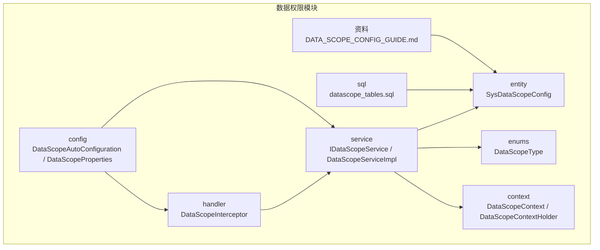
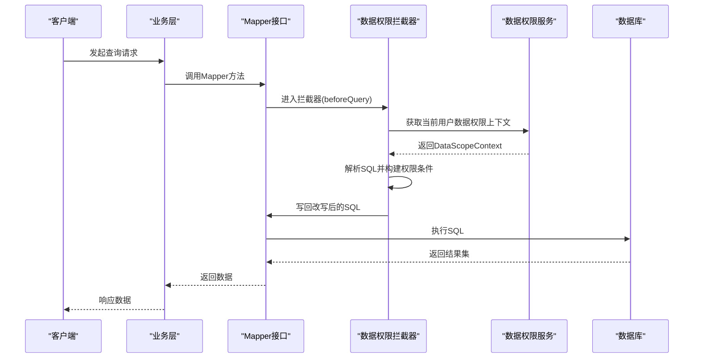
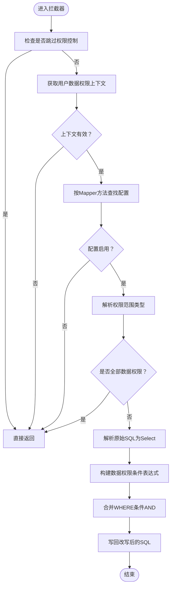
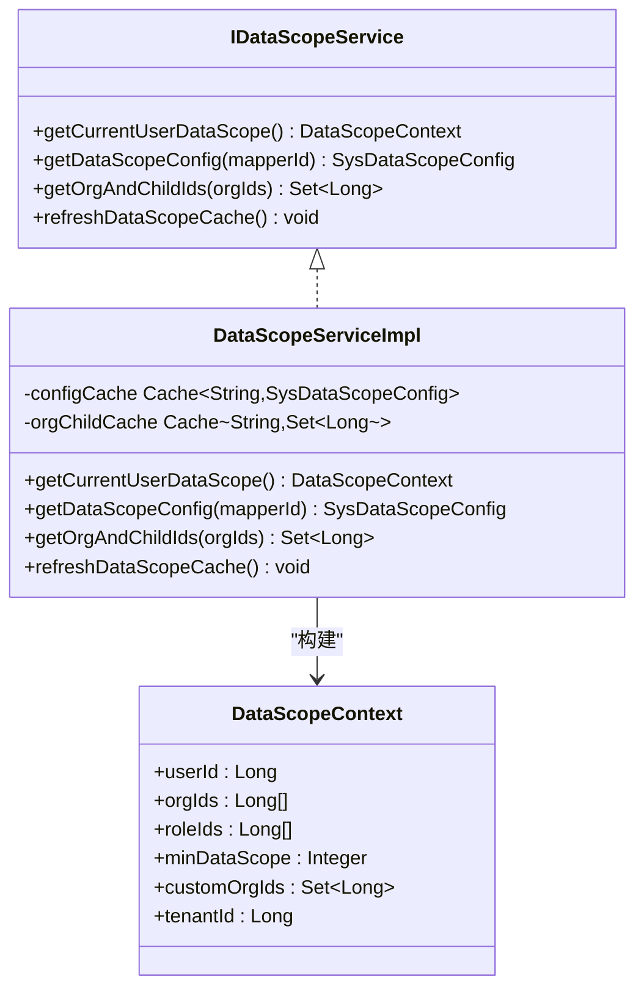
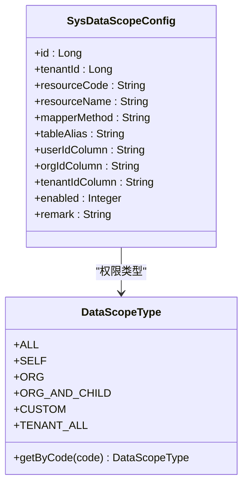
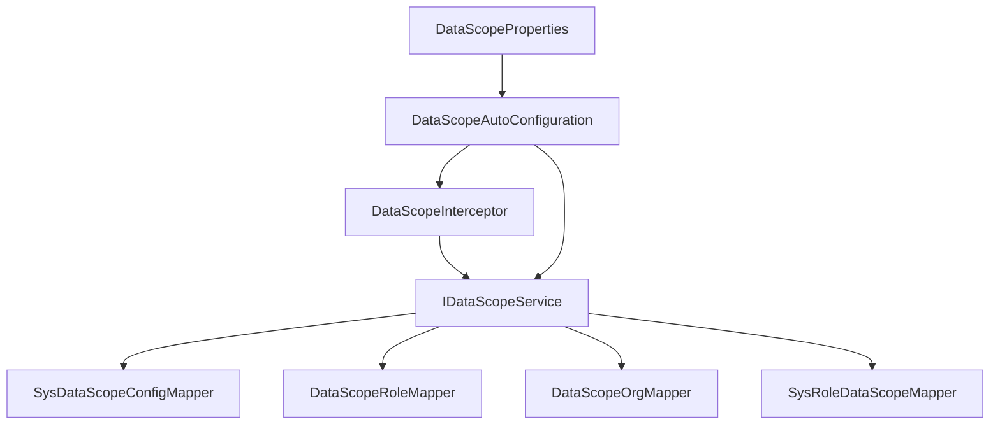

# 数据权限管理

<cite>
**本文引用的文件**
- [DataScopeInterceptor.java](file://forge/forge-framework/forge-starter-parent/forge-starter-datascope/src/main/java/com/mdframe/forge/starter/datascope/handler/DataScopeInterceptor.java)
- [IDataScopeService.java](file://forge/forge-framework/forge-starter-parent/forge-starter-datascope/src/main/java/com/mdframe/forge/starter/datascope/service/IDataScopeService.java)
- [DataScopeServiceImpl.java](file://forge/forge-framework/forge-starter-parent/forge-starter-datascope/src/main/java/com/mdframe/forge/starter/datascope/service/impl/DataScopeServiceImpl.java)
- [SysDataScopeConfig.java](file://forge/forge-framework/forge-starter-parent/forge-starter-datascope/src/main/java/com/mdframe/forge/starter/datascope/entity/SysDataScopeConfig.java)
- [DataScopeType.java](file://forge/forge-framework/forge-starter-parent/forge-starter-datascope/src/main/java/com/mdframe/forge/starter/datascope/enums/DataScopeType.java)
- [DataScopeContext.java](file://forge/forge-framework/forge-starter-parent/forge-starter-datascope/src/main/java/com/mdframe/forge/starter/datascope/context/DataScopeContext.java)
- [DataScopeContextHolder.java](file://forge/forge-framework/forge-starter-parent/forge-starter-datascope/src/main/java/com/mdframe/forge/starter/datascope/context/DataScopeContextHolder.java)
- [DataScopeAutoConfiguration.java](file://forge/forge-framework/forge-starter-parent/forge-starter-datascope/src/main/java/com/mdframe/forge/starter/datascope/config/DataScopeAutoConfiguration.java)
- [DataScopeProperties.java](file://forge/forge-framework/forge-starter-parent/forge-starter-datascope/src/main/java/com/mdframe/forge/starter/datascope/config/DataScopeProperties.java)
- [DATA_SCOPE_CONFIG_GUIDE.md](file://forge/forge-framework/forge-starter-parent/forge-starter-datascope/DATA_SCOPE_CONFIG_GUIDE.md)
- [datascope_tables.sql](file://forge/forge-framework/forge-starter-parent/forge-starter-datascope/sql/datascope_tables.sql)
</cite>

## 目录
1. [简介](#简介)
2. [项目结构](#项目结构)
3. [核心组件](#核心组件)
4. [架构总览](#架构总览)
5. [详细组件分析](#详细组件分析)
6. [依赖分析](#依赖分析)
7. [性能考量](#性能考量)
8. [故障排查指南](#故障排查指南)
9. [结论](#结论)
10. [附录](#附录)

## 简介
本技术文档面向Forge框架的数据权限管理能力，系统化阐述基于角色的数据范围控制与权限过滤机制。文档覆盖数据权限配置、权限拦截器、数据范围计算、动态SQL拼接等核心技术，并提供部门数据权限、岗位数据权限、自定义数据范围等多种权限模式的实现方案。同时给出完整的权限配置指南、SQL权限注解使用方法以及性能优化建议，帮助开发者构建灵活可靠的权限控制系统。

## 项目结构
数据权限模块位于 forge/forge-framework/forge-starter-parent/forge-starter-datascope 下，采用“starter”形式提供自动装配与运行时拦截能力。主要结构包括：
- handler：MyBatis拦截器实现，负责在SQL执行前注入权限条件
- service：数据权限服务接口与实现，负责上下文构建、配置加载与缓存
- entity/enums/context：数据权限配置实体、权限类型枚举、上下文对象
- config：自动装配与属性配置
- sql：数据库表结构与初始化示例
- 资料：配置使用指南文档

图表来源
- [DataScopeInterceptor.java](file://forge/forge-framework/forge-starter-parent/forge-starter-datascope/src/main/java/com/mdframe/forge/starter/datascope/handler/DataScopeInterceptor.java#L1-L350)
- [IDataScopeService.java](file://forge/forge-framework/forge-starter-parent/forge-starter-datascope/src/main/java/com/mdframe/forge/starter/datascope/service/IDataScopeService.java#L1-L42)
- [DataScopeServiceImpl.java](file://forge/forge-framework/forge-starter-parent/forge-starter-datascope/src/main/java/com/mdframe/forge/starter/datascope/service/impl/DataScopeServiceImpl.java#L1-L177)
- [SysDataScopeConfig.java](file://forge/forge-framework/forge-starter-parent/forge-starter-datascope/src/main/java/com/mdframe/forge/starter/datascope/entity/SysDataScopeConfig.java#L1-L85)
- [DataScopeType.java](file://forge/forge-framework/forge-starter-parent/forge-starter-datascope/src/main/java/com/mdframe/forge/starter/datascope/enums/DataScopeType.java#L1-L61)
- [DataScopeContext.java](file://forge/forge-framework/forge-starter-parent/forge-starter-datascope/src/main/java/com/mdframe/forge/starter/datascope/context/DataScopeContext.java#L1-L48)
- [DataScopeContextHolder.java](file://forge/forge-framework/forge-starter-parent/forge-starter-datascope/src/main/java/com/mdframe/forge/starter/datascope/context/DataScopeContextHolder.java#L1-L62)
- [DataScopeAutoConfiguration.java](file://forge/forge-framework/forge-starter-parent/forge-starter-datascope/src/main/java/com/mdframe/forge/starter/datascope/config/DataScopeAutoConfiguration.java#L1-L39)
- [DataScopeProperties.java](file://forge/forge-framework/forge-starter-parent/forge-starter-datascope/src/main/java/com/mdframe/forge/starter/datascope/config/DataScopeProperties.java#L1-L23)
- [datascope_tables.sql](file://forge/forge-framework/forge-starter-parent/forge-starter-datascope/sql/datascope_tables.sql#L1-L100)
- [DATA_SCOPE_CONFIG_GUIDE.md](file://forge/forge-framework/forge-starter-parent/forge-starter-datascope/DATA_SCOPE_CONFIG_GUIDE.md#L1-L291)

章节来源
- [DataScopeAutoConfiguration.java](file://forge/forge-framework/forge-starter-parent/forge-starter-datascope/src/main/java/com/mdframe/forge/starter/datascope/config/DataScopeAutoConfiguration.java#L1-L39)
- [DATA_SCOPE_CONFIG_GUIDE.md](file://forge/forge-framework/forge-starter-parent/forge-starter-datascope/DATA_SCOPE_CONFIG_GUIDE.md#L1-L291)

## 核心组件
- 数据权限拦截器：基于MyBatis Plus InnerInterceptor，在SQL执行前解析并改写WHERE条件，注入数据范围过滤逻辑
- 数据权限服务：负责构建用户数据权限上下文、加载配置、计算组织树、缓存管理
- 配置实体与枚举：描述数据权限配置项与权限范围类型
- 上下文与持有者：封装当前用户、组织、角色、租户等信息，并支持临时跳过权限控制
- 自动装配与属性：提供开关与日志打印等配置项

章节来源
- [DataScopeInterceptor.java](file://forge/forge-framework/forge-starter-parent/forge-starter-datascope/src/main/java/com/mdframe/forge/starter/datascope/handler/DataScopeInterceptor.java#L35-L350)
- [IDataScopeService.java](file://forge/forge-framework/forge-starter-parent/forge-starter-datascope/src/main/java/com/mdframe/forge/starter/datascope/service/IDataScopeService.java#L1-L42)
- [DataScopeServiceImpl.java](file://forge/forge-framework/forge-starter-parent/forge-starter-datascope/src/main/java/com/mdframe/forge/starter/datascope/service/impl/DataScopeServiceImpl.java#L1-L177)
- [SysDataScopeConfig.java](file://forge/forge-framework/forge-starter-parent/forge-starter-datascope/src/main/java/com/mdframe/forge/starter/datascope/entity/SysDataScopeConfig.java#L1-L85)
- [DataScopeType.java](file://forge/forge-framework/forge-starter-parent/forge-starter-datascope/src/main/java/com/mdframe/forge/starter/datascope/enums/DataScopeType.java#L1-L61)
- [DataScopeContext.java](file://forge/forge-framework/forge-starter-parent/forge-starter-datascope/src/main/java/com/mdframe/forge/starter/datascope/context/DataScopeContext.java#L1-L48)
- [DataScopeContextHolder.java](file://forge/forge-framework/forge-starter-parent/forge-starter-datascope/src/main/java/com/mdframe/forge/starter/datascope/context/DataScopeContextHolder.java#L1-L62)

## 架构总览
数据权限在请求生命周期中的作用链如下：
- 请求进入业务层，调用Mapper方法
- MyBatis执行前触发拦截器
- 拦截器根据Mapper方法定位配置，结合用户上下文与权限类型，动态改写SQL
- 执行改写后的SQL，返回受控数据集

图表来源
- [DataScopeInterceptor.java](file://forge/forge-framework/forge-starter-parent/forge-starter-datascope/src/main/java/com/mdframe/forge/starter/datascope/handler/DataScopeInterceptor.java#L41-L117)
- [DataScopeServiceImpl.java](file://forge/forge-framework/forge-starter-parent/forge-starter-datascope/src/main/java/com/mdframe/forge/starter/datascope/service/impl/DataScopeServiceImpl.java#L50-L115)

## 详细组件分析

### 数据权限拦截器（SQL改写核心）
职责与流程：
- 跳过标记检查：支持后台任务等场景临时跳过权限控制
- Mapper方法识别：兼容分页count方法名后缀
- 配置加载：按方法名查询启用的权限配置
- 权限类型判定：根据用户最小数据权限范围选择策略
- SQL解析与改写：基于jsqlparser解析Select语句，构造并合并WHERE条件
- 动态条件生成：支持简单字段与复杂SQL两种模式，内置占位符替换

图表来源
- [DataScopeInterceptor.java](file://forge/forge-framework/forge-starter-parent/forge-starter-datascope/src/main/java/com/mdframe/forge/starter/datascope/handler/DataScopeInterceptor.java#L41-L156)

章节来源
- [DataScopeInterceptor.java](file://forge/forge-framework/forge-starter-parent/forge-starter-datascope/src/main/java/com/mdframe/forge/starter/datascope/handler/DataScopeInterceptor.java#L35-L350)

### 数据权限服务（上下文与缓存）
职责与特性：
- 上下文构建：根据登录用户身份、角色、组织、租户等信息，确定最小数据权限范围
- 配置缓存：基于Caffeine缓存Mapper方法到配置的映射，降低查询开销
- 组织树缓存：缓存组织及其子组织ID集合，提升层级权限计算效率
- 特殊用户处理：超级管理员与租户管理员拥有特殊权限范围
- 自定义权限：当权限类型为CUSTOM时，加载角色绑定的自定义组织集合

图表来源
- [IDataScopeService.java](file://forge/forge-framework/forge-starter-parent/forge-starter-datascope/src/main/java/com/mdframe/forge/starter/datascope/service/IDataScopeService.java#L1-L42)
- [DataScopeServiceImpl.java](file://forge/forge-framework/forge-starter-parent/forge-starter-datascope/src/main/java/com/mdframe/forge/starter/datascope/service/impl/DataScopeServiceImpl.java#L24-L177)
- [DataScopeContext.java](file://forge/forge-framework/forge-starter-parent/forge-starter-datascope/src/main/java/com/mdframe/forge/starter/datascope/context/DataScopeContext.java#L1-L48)

章节来源
- [IDataScopeService.java](file://forge/forge-framework/forge-starter-parent/forge-starter-datascope/src/main/java/com/mdframe/forge/starter/datascope/service/IDataScopeService.java#L1-L42)
- [DataScopeServiceImpl.java](file://forge/forge-framework/forge-starter-parent/forge-starter-datascope/src/main/java/com/mdframe/forge/starter/datascope/service/impl/DataScopeServiceImpl.java#L1-L177)

### 数据权限配置与模式
- 配置实体：描述资源编码、Mapper方法、表别名、三类字段配置（用户ID、组织ID、租户ID）、启用状态等
- 权限类型：全部、本人、本组织、本组织及子组织、自定义、租户全部
- 字段配置模式：
  - 简单模式：直接填写字段名
  - 复杂模式：以<sql>开头，支持占位符#{userId}、#{tenantId}、#{orgIds}、#{customOrgIds}

图表来源
- [SysDataScopeConfig.java](file://forge/forge-framework/forge-starter-parent/forge-starter-datascope/src/main/java/com/mdframe/forge/starter/datascope/entity/SysDataScopeConfig.java#L1-L85)
- [DataScopeType.java](file://forge/forge-framework/forge-starter-parent/forge-starter-datascope/src/main/java/com/mdframe/forge/starter/datascope/enums/DataScopeType.java#L1-L61)

章节来源
- [SysDataScopeConfig.java](file://forge/forge-framework/forge-starter-parent/forge-starter-datascope/src/main/java/com/mdframe/forge/starter/datascope/entity/SysDataScopeConfig.java#L1-L85)
- [DataScopeType.java](file://forge/forge-framework/forge-starter-parent/forge-starter-datascope/src/main/java/com/mdframe/forge/starter/datascope/enums/DataScopeType.java#L1-L61)
- [DATA_SCOPE_CONFIG_GUIDE.md](file://forge/forge-framework/forge-starter-parent/forge-starter-datascope/DATA_SCOPE_CONFIG_GUIDE.md#L58-L236)

### 权限模式与实现要点
- 本人数据权限：对用户ID字段进行等值匹配
- 本组织数据权限：对组织ID字段进行IN匹配，使用用户当前组织ID
- 本组织及子组织数据权限：递归展开组织树，再进行IN匹配
- 自定义数据权限：按角色绑定的自定义组织集合进行IN匹配
- 租户全部数据权限：对租户ID字段进行等值匹配
- 复杂SQL模式：支持多条件组合、子查询、函数等，通过占位符注入上下文

章节来源
- [DataScopeInterceptor.java](file://forge/forge-framework/forge-starter-parent/forge-starter-datascope/src/main/java/com/mdframe/forge/starter/datascope/handler/DataScopeInterceptor.java#L160-L209)
- [DataScopeServiceImpl.java](file://forge/forge-framework/forge-starter-parent/forge-starter-datascope/src/main/java/com/mdframe/forge/starter/datascope/service/impl/DataScopeServiceImpl.java#L99-L113)

### 数据库表与初始化
- sys_data_scope_config：数据权限配置表，含唯一索引约束
- sys_role_data_scope：角色-自定义数据权限关联表
- 提供多条初始化示例，涵盖简单字段与复杂SQL模式

章节来源
- [datascope_tables.sql](file://forge/forge-framework/forge-starter-parent/forge-starter-datascope/sql/datascope_tables.sql#L1-L100)

## 依赖分析
- 拦截器依赖服务：通过Spring工具获取服务实例，避免硬编码依赖
- 服务依赖映射：依赖配置Mapper、角色Mapper、组织Mapper、角色自定义权限Mapper
- 自动装配：通过条件注解与属性开关控制启用，最高优先级注册

图表来源
- [DataScopeInterceptor.java](file://forge/forge-framework/forge-starter-parent/forge-starter-datascope/src/main/java/com/mdframe/forge/starter/datascope/handler/DataScopeInterceptor.java#L56-L66)
- [DataScopeServiceImpl.java](file://forge/forge-framework/forge-starter-parent/forge-starter-datascope/src/main/java/com/mdframe/forge/starter/datascope/service/impl/DataScopeServiceImpl.java#L29-L32)
- [DataScopeAutoConfiguration.java](file://forge/forge-framework/forge-starter-parent/forge-starter-datascope/src/main/java/com/mdframe/forge/starter/datascope/config/DataScopeAutoConfiguration.java#L23-L37)
- [DataScopeProperties.java](file://forge/forge-framework/forge-starter-parent/forge-starter-datascope/src/main/java/com/mdframe/forge/starter/datascope/config/DataScopeProperties.java#L1-L23)

章节来源
- [DataScopeAutoConfiguration.java](file://forge/forge-framework/forge-starter-parent/forge-starter-datascope/src/main/java/com/mdframe/forge/starter/datascope/config/DataScopeAutoConfiguration.java#L1-L39)
- [DataScopeProperties.java](file://forge/forge-framework/forge-starter-parent/forge-starter-datascope/src/main/java/com/mdframe/forge/starter/datascope/config/DataScopeProperties.java#L1-L23)

## 性能考量
- 缓存策略
  - 配置缓存：按Mapper方法缓存配置，减少数据库查询
  - 组织树缓存：按排序后的组织ID串作为键，缓存展开结果
- 日志与可观测性
  - 可通过属性开关控制SQL改写日志输出，避免生产环境过度日志
- SQL复杂度
  - 复杂SQL模式灵活但需谨慎，建议使用EXPLAIN分析执行计划
- 分页场景
  - 对分页count方法名进行兼容处理，避免重复权限过滤

章节来源
- [DataScopeServiceImpl.java](file://forge/forge-framework/forge-starter-parent/forge-starter-datascope/src/main/java/com/mdframe/forge/starter/datascope/service/impl/DataScopeServiceImpl.java#L34-L48)
- [DataScopeProperties.java](file://forge/forge-framework/forge-starter-parent/forge-starter-datascope/src/main/java/com/mdframe/forge/starter/datascope/config/DataScopeProperties.java#L14-L22)
- [DataScopeInterceptor.java](file://forge/forge-framework/forge-starter-parent/forge-starter-datascope/src/main/java/com/mdframe/forge/starter/datascope/handler/DataScopeInterceptor.java#L73-L80)

## 故障排查指南
- 配置不生效
  - 检查配置是否启用、Mapper方法路径是否正确、表别名是否与XML一致
  - 修改配置后会自动刷新缓存，需重新发起查询验证
- SQL语法错误
  - 复杂SQL模式需以<sql>开头，占位符格式正确，SQL语法合法
- 查询结果为空
  - 检查字段名与表别名、确认当前用户是否存在符合条件的数据
- 临时禁用配置
  - 将“是否启用”改为禁用即可快速回滚

章节来源
- [DATA_SCOPE_CONFIG_GUIDE.md](file://forge/forge-framework/forge-starter-parent/forge-starter-datascope/DATA_SCOPE_CONFIG_GUIDE.md#L228-L259)

## 结论
Forge框架的数据权限模块通过“配置驱动 + 拦截器改写 + 缓存加速”的方式，实现了灵活可控的数据范围过滤。其支持多种权限模式与复杂SQL表达式，既满足常规的部门/岗位/自定义范围需求，又兼顾扩展性与性能。配合完善的配置指南与缓存刷新机制，能够帮助团队快速落地稳定的数据权限体系。

## 附录

### 权限配置指南（摘要）
- 资源编码与名称：唯一标识资源，建议模块:功能:操作格式
- Mapper方法：完整限定名，对应需要控制的查询方法
- 表别名：与Mapper XML中一致
- 字段配置：
  - 简单模式：直接填写字段名
  - 复杂模式：以<sql>开头，支持#{userId}、#{tenantId}、#{orgIds}、#{customOrgIds}
- 启用状态：0禁用，1启用
- 初始化示例：提供简单字段与复杂SQL的多场景示例

章节来源
- [DATA_SCOPE_CONFIG_GUIDE.md](file://forge/forge-framework/forge-starter-parent/forge-starter-datascope/DATA_SCOPE_CONFIG_GUIDE.md#L58-L236)
- [datascope_tables.sql](file://forge/forge-framework/forge-starter-parent/forge-starter-datascope/sql/datascope_tables.sql#L37-L100)