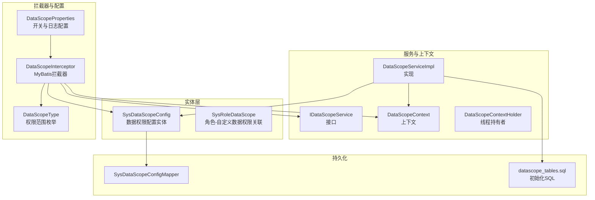
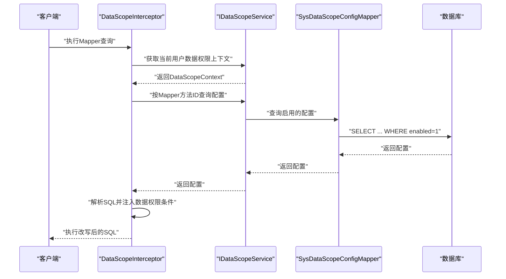
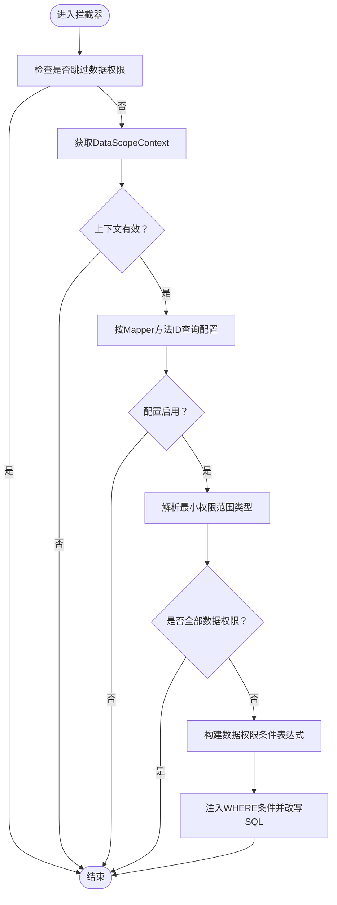
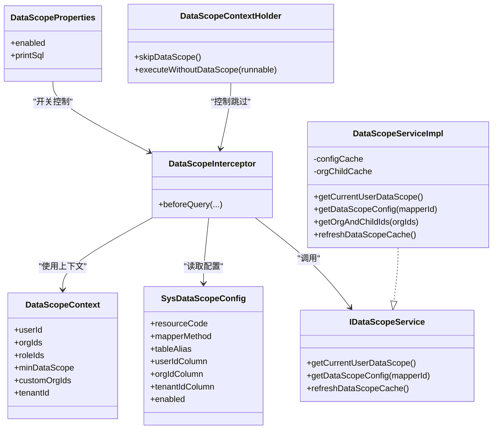

# 数据权限配置

<cite>
**本文引用的文件**
- [SysDataScopeConfig.java](file://forge/forge-framework/forge-starter-parent/forge-starter-datascope/src/main/java/com/mdframe/forge/starter/datascope/entity/SysDataScopeConfig.java)
- [SysRoleDataScope.java](file://forge/forge-framework/forge-starter-parent/forge-starter-datascope/src/main/java/com/mdframe/forge/starter/datascope/entity/SysRoleDataScope.java)
- [DATA_SCOPE_CONFIG_GUIDE.md](file://forge/forge-framework/forge-starter-parent/forge-starter-datascope/DATA_SCOPE_CONFIG_GUIDE.md)
- [datascope_tables.sql](file://forge/forge-framework/forge-starter-parent/forge-starter-datascope/sql/datascope_tables.sql)
- [DataScopeInterceptor.java](file://forge/forge-framework/forge-starter-parent/forge-starter-datascope/src/main/java/com/mdframe/forge/starter/datascope/handler/DataScopeInterceptor.java)
- [IDataScopeService.java](file://forge/forge-framework/forge-starter-parent/forge-starter-datascope/src/main/java/com/mdframe/forge/starter/datascope/service/IDataScopeService.java)
- [DataScopeServiceImpl.java](file://forge/forge-framework/forge-starter-parent/forge-starter-datascope/src/main/java/com/mdframe/forge/starter/datascope/service/impl/DataScopeServiceImpl.java)
- [DataScopeContext.java](file://forge/forge-framework/forge-starter-parent/forge-starter-datascope/src/main/java/com/mdframe/forge/starter/datascope/context/DataScopeContext.java)
- [DataScopeContextHolder.java](file://forge/forge-framework/forge-starter-parent/forge-starter-datascope/src/main/java/com/mdframe/forge/starter/datascope/context/DataScopeContextHolder.java)
- [DataScopeProperties.java](file://forge/forge-framework/forge-starter-parent/forge-starter-datascope/src/main/java/com/mdframe/forge/starter/datascope/config/DataScopeProperties.java)
- [DataScopeType.java](file://forge/forge-framework/forge-starter-parent/forge-starter-datascope/src/main/java/com/mdframe/forge/starter/datascope/enums/DataScopeType.java)
- [SysDataScopeConfigMapper.java](file://forge/forge-framework/forge-starter-parent/forge-starter-datascope/src/main/java/com/mdframe/forge/starter/datascope/mapper/SysDataScopeConfigMapper.java)
</cite>

## 目录
1. [简介](#简介)
2. [项目结构](#项目结构)
3. [核心组件](#核心组件)
4. [架构总览](#架构总览)
5. [组件详解](#组件详解)
6. [依赖关系分析](#依赖关系分析)
7. [性能考量](#性能考量)
8. [故障排查指南](#故障排查指南)
9. [结论](#结论)
10. [附录](#附录)

## 简介
本技术文档围绕Forge框架的数据权限配置能力，系统阐述其核心概念、配置项定义与管理方式，重点解析SysDataScopeConfig实体类的字段语义（表别名、用户ID字段、组织ID字段、租户ID字段、启用状态等），并说明配置项的启用/禁用管理、验证规则与默认值策略。文档还提供了两类典型配置示例（简单字段与复杂SQL表达式），解释不同权限模式下的作用机制与实现原理，并给出最佳实践与排障建议。

## 项目结构
数据权限配置相关代码主要集中在forge-starter-datascope模块，涉及实体、拦截器、服务、上下文、配置属性与SQL脚本等。下图展示与数据权限配置直接相关的文件与职责划分：

图表来源
- [SysDataScopeConfig.java](file://forge/forge-framework/forge-starter-parent/forge-starter-datascope/src/main/java/com/mdframe/forge/starter/datascope/entity/SysDataScopeConfig.java#L1-L85)
- [SysRoleDataScope.java](file://forge/forge-framework/forge-starter-parent/forge-starter-datascope/src/main/java/com/mdframe/forge/starter/datascope/entity/SysRoleDataScope.java#L1-L46)
- [DataScopeInterceptor.java](file://forge/forge-framework/forge-starter-parent/forge-starter-datascope/src/main/java/com/mdframe/forge/starter/datascope/handler/DataScopeInterceptor.java#L1-L350)
- [IDataScopeService.java](file://forge/forge-framework/forge-starter-parent/forge-starter-datascope/src/main/java/com/mdframe/forge/starter/datascope/service/IDataScopeService.java#L1-L42)
- [DataScopeServiceImpl.java](file://forge/forge-framework/forge-starter-parent/forge-starter-datascope/src/main/java/com/mdframe/forge/starter/datascope/service/impl/DataScopeServiceImpl.java#L1-L177)
- [DataScopeContext.java](file://forge/forge-framework/forge-starter-parent/forge-starter-datascope/src/main/java/com/mdframe/forge/starter/datascope/context/DataScopeContext.java#L1-L48)
- [DataScopeContextHolder.java](file://forge/forge-framework/forge-starter-parent/forge-starter-datascope/src/main/java/com/mdframe/forge/starter/datascope/context/DataScopeContextHolder.java#L1-L62)
- [DataScopeProperties.java](file://forge/forge-framework/forge-starter-parent/forge-starter-datascope/src/main/java/com/mdframe/forge/starter/datascope/config/DataScopeProperties.java#L1-L23)
- [DataScopeType.java](file://forge/forge-framework/forge-starter-parent/forge-starter-datascope/src/main/java/com/mdframe/forge/starter/datascope/enums/DataScopeType.java#L1-L61)
- [SysDataScopeConfigMapper.java](file://forge/forge-framework/forge-starter-parent/forge-starter-datascope/src/main/java/com/mdframe/forge/starter/datascope/mapper/SysDataScopeConfigMapper.java#L1-L13)
- [datascope_tables.sql](file://forge/forge-framework/forge-starter-parent/forge-starter-datascope/sql/datascope_tables.sql#L1-L100)

章节来源
- [DATA_SCOPE_CONFIG_GUIDE.md](file://forge/forge-framework/forge-starter-parent/forge-starter-datascope/DATA_SCOPE_CONFIG_GUIDE.md#L1-L291)
- [datascope_tables.sql](file://forge/forge-framework/forge-starter-parent/forge-starter-datascope/sql/datascope_tables.sql#L1-L100)

## 核心组件
- SysDataScopeConfig：数据权限配置实体，承载资源编码、Mapper方法、表别名、用户/组织/租户字段配置、启用状态等关键信息。
- DataScopeInterceptor：MyBatis拦截器，负责在SQL执行前解析并注入数据权限条件。
- IDataScopeService/DataScopeServiceImpl：数据权限服务，负责上下文构建、配置查询与缓存管理。
- DataScopeContext：数据权限上下文，封装用户ID、组织ID列表、角色ID列表、最小权限范围、自定义组织ID集合与租户ID。
- DataScopeType：权限范围枚举，定义“全部/本人/本组织/本组织及子组织/自定义/租户全部”等权限类型。
- DataScopeProperties：数据权限全局配置，含开关与SQL改写日志开关。
- SysRoleDataScope：角色-自定义数据权限关联实体，支撑“自定义数据权限”场景。

章节来源
- [SysDataScopeConfig.java](file://forge/forge-framework/forge-starter-parent/forge-starter-datascope/src/main/java/com/mdframe/forge/starter/datascope/entity/SysDataScopeConfig.java#L1-L85)
- [DataScopeInterceptor.java](file://forge/forge-framework/forge-starter-parent/forge-starter-datascope/src/main/java/com/mdframe/forge/starter/datascope/handler/DataScopeInterceptor.java#L1-L350)
- [IDataScopeService.java](file://forge/forge-framework/forge-starter-parent/forge-starter-datascope/src/main/java/com/mdframe/forge/starter/datascope/service/IDataScopeService.java#L1-L42)
- [DataScopeServiceImpl.java](file://forge/forge-framework/forge-starter-parent/forge-starter-datascope/src/main/java/com/mdframe/forge/starter/datascope/service/impl/DataScopeServiceImpl.java#L1-L177)
- [DataScopeContext.java](file://forge/forge-framework/forge-starter-parent/forge-starter-datascope/src/main/java/com/mdframe/forge/starter/datascope/context/DataScopeContext.java#L1-L48)
- [DataScopeType.java](file://forge/forge-framework/forge-starter-parent/forge-starter-datascope/src/main/java/com/mdframe/forge/starter/datascope/enums/DataScopeType.java#L1-L61)
- [DataScopeProperties.java](file://forge/forge-framework/forge-starter-parent/forge-starter-datascope/src/main/java/com/mdframe/forge/starter/datascope/config/DataScopeProperties.java#L1-L23)
- [SysRoleDataScope.java](file://forge/forge-framework/forge-starter-parent/forge-starter-datascope/src/main/java/com/mdframe/forge/starter/datascope/entity/SysRoleDataScope.java#L1-L46)

## 架构总览
数据权限在请求生命周期内的工作流如下：

图表来源
- [DataScopeInterceptor.java](file://forge/forge-framework/forge-starter-parent/forge-starter-datascope/src/main/java/com/mdframe/forge/starter/datascope/handler/DataScopeInterceptor.java#L41-L117)
- [IDataScopeService.java](file://forge/forge-framework/forge-starter-parent/forge-starter-datascope/src/main/java/com/mdframe/forge/starter/datascope/service/IDataScopeService.java#L19-L27)
- [DataScopeServiceImpl.java](file://forge/forge-framework/forge-starter-parent/forge-starter-datascope/src/main/java/com/mdframe/forge/starter/datascope/service/impl/DataScopeServiceImpl.java#L117-L138)
- [SysDataScopeConfigMapper.java](file://forge/forge-framework/forge-starter-parent/forge-starter-datascope/src/main/java/com/mdframe/forge/starter/datascope/mapper/SysDataScopeConfigMapper.java#L1-L13)

## 组件详解

### SysDataScopeConfig 实体类字段详解
- 主键ID：唯一标识一条配置记录。
- 租户编号：用于多租户隔离，支持按租户维度配置。
- 资源编码：唯一标识一个资源（建议采用“模块:功能:操作”的规范）。
- 资源名称：对资源的描述性名称，便于识别与管理。
- Mapper方法：目标Mapper方法的全限定名，用于定位需要注入权限条件的SQL。
- 主表别名：SQL中主表的别名，用于正确拼接字段条件。
- 用户ID字段：支持简单字段名或复杂SQL表达式（以“<sql>”开头），可使用占位符#{userId}、#{tenantId}、#{orgIds}、#{customOrgIds}。
- 组织ID字段：支持简单字段名或复杂SQL表达式，常用于组织/子组织/自定义组织权限。
- 租户ID字段：支持简单字段名或复杂SQL表达式，常用于租户隔离或公开数据场景。
- 是否启用：0表示禁用，1表示启用；系统仅对启用的配置生效。
- 备注：对配置用途的补充说明。
- 创建者/创建时间/更新者/更新时间：通用审计字段。

章节来源
- [SysDataScopeConfig.java](file://forge/forge-framework/forge-starter-parent/forge-starter-datascope/src/main/java/com/mdframe/forge/starter/datascope/entity/SysDataScopeConfig.java#L10-L84)
- [datascope_tables.sql](file://forge/forge-framework/forge-starter-parent/forge-starter-datascope/sql/datascope_tables.sql#L2-L22)

### 数据权限配置启用/禁用与缓存
- 启用/禁用：通过enabled字段控制，系统仅加载enabled=1的配置。
- 缓存策略：DataScopeServiceImpl对配置与“组织及其子组织”结果进行缓存，提升查询性能并减少数据库压力。
- 缓存刷新：当配置变更（新增/修改/删除/启停）后，服务会主动失效缓存，保证新配置立即生效。

章节来源
- [DataScopeServiceImpl.java](file://forge/forge-framework/forge-starter-parent/forge-starter-datascope/src/main/java/com/mdframe/forge/starter/datascope/service/impl/DataScopeServiceImpl.java#L34-L48)
- [DataScopeServiceImpl.java](file://forge/forge-framework/forge-starter-parent/forge-starter-datascope/src/main/java/com/mdframe/forge/starter/datascope/service/impl/DataScopeServiceImpl.java#L170-L176)

### 配置项验证规则与默认值
- 默认值（来自数据库脚本）：
  - 表别名默认“t”
  - 用户ID字段默认“user_id”
  - 组织ID字段默认“org_id”
  - 租户ID字段默认“tenant_id”
  - 是否启用默认“1”
- 验证规则（基于使用指南）：
  - 表别名需与Mapper XML中一致
  - 字段名需存在于目标表
  - 复杂SQL模式需以“<sql>”开头，占位符格式正确
  - 启用状态需为1才生效

章节来源
- [datascope_tables.sql](file://forge/forge-framework/forge-starter-parent/forge-starter-datascope/sql/datascope_tables.sql#L8-L12)
- [DATA_SCOPE_CONFIG_GUIDE.md](file://forge/forge-framework/forge-starter-parent/forge-starter-datascope/DATA_SCOPE_CONFIG_GUIDE.md#L228-L235)

### 配置示例（简单字段与复杂SQL）
- 简单字段配置：适用于常规场景，如“仅本人数据+本组织+租户隔离”。系统将根据权限范围类型生成等值或IN条件。
- 复杂SQL表达式：以“<sql>”开头，支持多角色OR关系、子查询、公开数据等复杂逻辑。占位符包括#{userId}、#{tenantId}、#{orgIds}、#{customOrgIds}。

章节来源
- [DATA_SCOPE_CONFIG_GUIDE.md](file://forge/forge-framework/forge-starter-parent/forge-starter-datascope/DATA_SCOPE_CONFIG_GUIDE.md#L143-L200)
- [datascope_tables.sql](file://forge/forge-framework/forge-starter-parent/forge-starter-datascope/sql/datascope_tables.sql#L39-L99)

### 不同权限模式的作用机制
- 全部数据权限：直接放行，不注入任何条件。
- 本人数据权限：将用户ID作为等值条件注入。
- 本组织/本组织及子组织：将组织ID列表转换为IN条件注入；子组织ID通过缓存查询获得。
- 自定义数据权限：从角色-自定义数据权限关联表中读取指定组织集合，再注入IN条件。
- 租户全部数据权限：将租户ID作为等值条件注入。

章节来源
- [DataScopeType.java](file://forge/forge-framework/forge-starter-parent/forge-starter-datascope/src/main/java/com/mdframe/forge/starter/datascope/enums/DataScopeType.java#L11-L41)
- [DataScopeInterceptor.java](file://forge/forge-framework/forge-starter-parent/forge-starter-datascope/src/main/java/com/mdframe/forge/starter/datascope/handler/DataScopeInterceptor.java#L170-L209)
- [DataScopeServiceImpl.java](file://forge/forge-framework/forge-starter-parent/forge-starter-datascope/src/main/java/com/mdframe/forge/starter/datascope/service/impl/DataScopeServiceImpl.java#L99-L103)

### 配置项在拦截器中的应用流程

图表来源
- [DataScopeInterceptor.java](file://forge/forge-framework/forge-starter-parent/forge-starter-datascope/src/main/java/com/mdframe/forge/starter/datascope/handler/DataScopeInterceptor.java#L41-L117)
- [DataScopeInterceptor.java](file://forge/forge-framework/forge-starter-parent/forge-starter-datascope/src/main/java/com/mdframe/forge/starter/datascope/handler/DataScopeInterceptor.java#L119-L156)
- [DataScopeInterceptor.java](file://forge/forge-framework/forge-starter-parent/forge-starter-datascope/src/main/java/com/mdframe/forge/starter/datascope/handler/DataScopeInterceptor.java#L158-L209)

## 依赖关系分析
- 拦截器依赖服务接口与实体配置，运行时通过Spring上下文获取服务实例。
- 服务实现依赖Mapper与缓存，负责上下文构建、配置查询与缓存管理。
- 上下文持有者提供线程级开关，支持在特定场景临时跳过数据权限控制。
- 配置属性提供全局开关与日志开关，便于生产环境调试与性能控制。

图表来源
- [DataScopeInterceptor.java](file://forge/forge-framework/forge-starter-parent/forge-starter-datascope/src/main/java/com/mdframe/forge/starter/datascope/handler/DataScopeInterceptor.java#L1-L350)
- [IDataScopeService.java](file://forge/forge-framework/forge-starter-parent/forge-starter-datascope/src/main/java/com/mdframe/forge/starter/datascope/service/IDataScopeService.java#L1-L42)
- [DataScopeServiceImpl.java](file://forge/forge-framework/forge-starter-parent/forge-starter-datascope/src/main/java/com/mdframe/forge/starter/datascope/service/impl/DataScopeServiceImpl.java#L1-L177)
- [SysDataScopeConfig.java](file://forge/forge-framework/forge-starter-parent/forge-starter-datascope/src/main/java/com/mdframe/forge/starter/datascope/entity/SysDataScopeConfig.java#L1-L85)
- [DataScopeContext.java](file://forge/forge-framework/forge-starter-parent/forge-starter-datascope/src/main/java/com/mdframe/forge/starter/datascope/context/DataScopeContext.java#L1-L48)
- [DataScopeContextHolder.java](file://forge/forge-framework/forge-starter-parent/forge-starter-datascope/src/main/java/com/mdframe/forge/starter/datascope/context/DataScopeContextHolder.java#L1-L62)
- [DataScopeProperties.java](file://forge/forge-framework/forge-starter-parent/forge-starter-datascope/src/main/java/com/mdframe/forge/starter/datascope/config/DataScopeProperties.java#L1-L23)

章节来源
- [DataScopeInterceptor.java](file://forge/forge-framework/forge-starter-parent/forge-starter-datascope/src/main/java/com/mdframe/forge/starter/datascope/handler/DataScopeInterceptor.java#L1-L350)
- [DataScopeServiceImpl.java](file://forge/forge-framework/forge-starter-parent/forge-starter-datascope/src/main/java/com/mdframe/forge/starter/datascope/service/impl/DataScopeServiceImpl.java#L1-L177)

## 性能考量
- 缓存策略：配置与“组织及其子组织”结果均采用本地缓存，降低数据库压力；缓存具备超时与容量限制。
- SQL改写：仅在命中配置且非全部权限时进行改写，避免对无关查询造成额外开销。
- 日志控制：可通过配置属性关闭SQL改写日志，减少生产环境日志噪声。
- 复杂SQL风险：复杂表达式可能影响查询计划与性能，建议结合数据库EXPLAIN进行评估与优化。

章节来源
- [DataScopeServiceImpl.java](file://forge/forge-framework/forge-starter-parent/forge-starter-datascope/src/main/java/com/mdframe/forge/starter/datascope/service/impl/DataScopeServiceImpl.java#L34-L48)
- [DataScopeProperties.java](file://forge/forge-framework/forge-starter-parent/forge-starter-datascope/src/main/java/com/mdframe/forge/starter/datascope/config/DataScopeProperties.java#L14-L21)
- [DATA_SCOPE_CONFIG_GUIDE.md](file://forge/forge-framework/forge-starter-parent/forge-starter-datascope/DATA_SCOPE_CONFIG_GUIDE.md#L232-L233)

## 故障排查指南
- 配置后未生效
  - 检查enabled是否为1
  - 检查Mapper方法路径是否与实际一致
  - 检查表别名是否与XML中一致
  - 确认缓存已刷新（修改配置会自动刷新，但需重新查询）
- SQL语法错误
  - 复杂SQL需以“<sql>”开头
  - 占位符格式应为#{userId}、#{tenantId}、#{orgIds}、#{customOrgIds}
  - 确保SQL语法合法
- 查询结果为空
  - 检查字段名是否存在
  - 检查表别名是否正确
  - 确认当前用户是否具备符合条件的数据
- 临时禁用配置
  - 将“是否启用”改为“禁用”即可快速回滚

章节来源
- [DATA_SCOPE_CONFIG_GUIDE.md](file://forge/forge-framework/forge-starter-parent/forge-starter-datascope/DATA_SCOPE_CONFIG_GUIDE.md#L237-L259)

## 结论
Forge框架的数据权限配置通过SysDataScopeConfig实体与DataScopeInterceptor实现“声明式”的数据访问控制。系统提供简单字段与复杂SQL两种配置模式，覆盖“本人/组织/租户”等常见权限场景，并通过缓存与上下文机制保障性能与灵活性。配合完善的验证规则、默认值与故障排查指引，可在不侵入业务代码的前提下实现灵活而安全的数据访问控制。

## 附录
- 关键配置项与默认值参考
  - 表别名默认“t”
  - 用户ID字段默认“user_id”
  - 组织ID字段默认“org_id”
  - 租户ID字段默认“tenant_id”
  - 是否启用默认“1”
- 常用占位符
  - #{userId}：当前用户ID
  - #{tenantId}：当前租户ID
  - #{orgIds}：当前用户所属组织及子组织ID列表
  - #{customOrgIds}：自定义组织ID列表（需在前端传入）

章节来源
- [datascope_tables.sql](file://forge/forge-framework/forge-starter-parent/forge-starter-datascope/sql/datascope_tables.sql#L8-L12)
- [DATA_SCOPE_CONFIG_GUIDE.md](file://forge/forge-framework/forge-starter-parent/forge-starter-datascope/DATA_SCOPE_CONFIG_GUIDE.md#L96-L101)