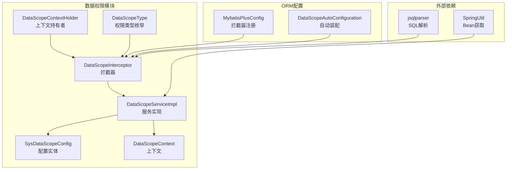
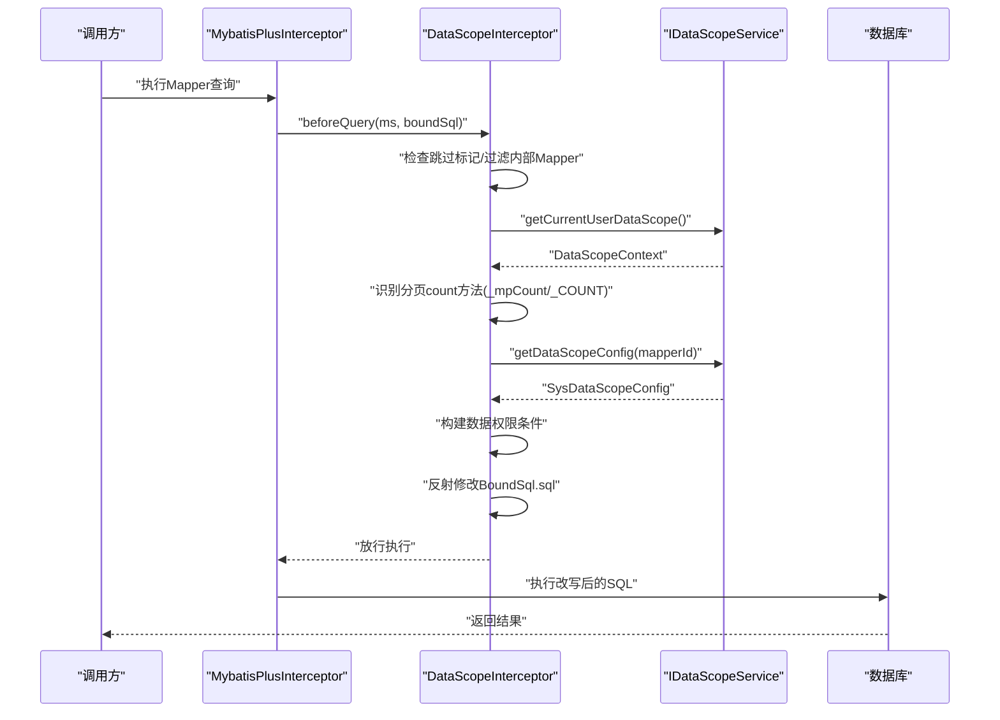
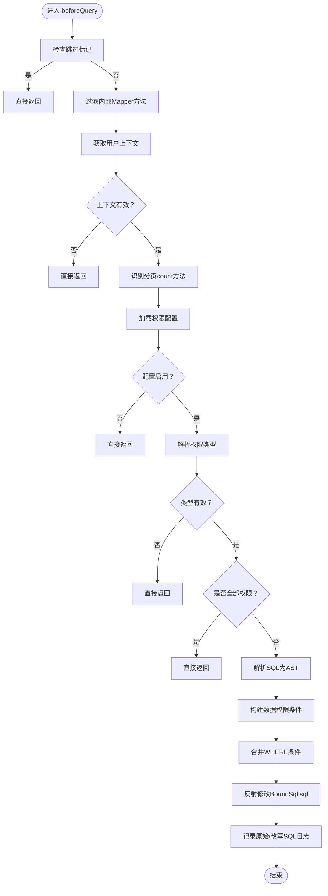
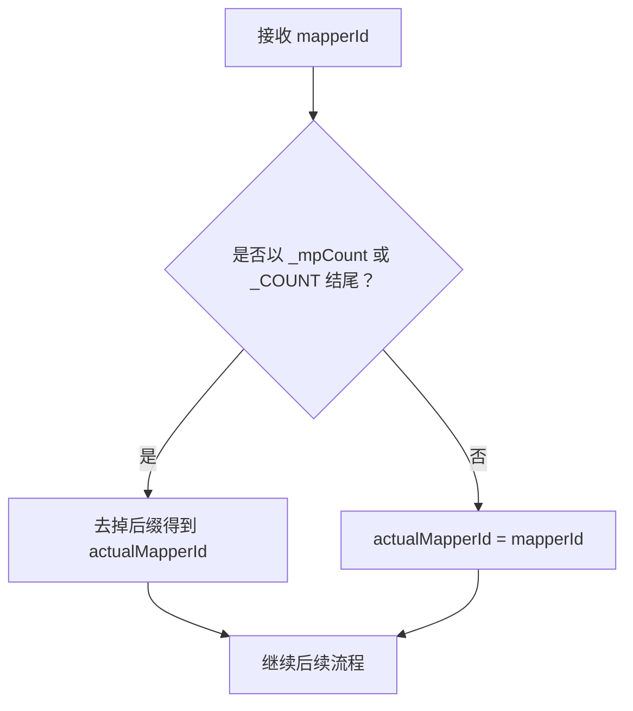
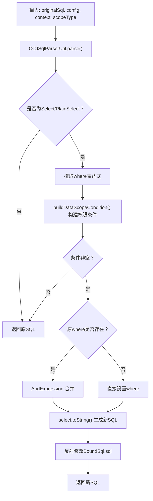
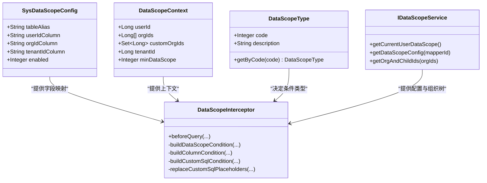
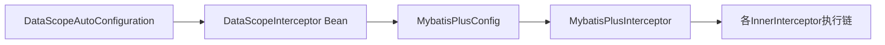
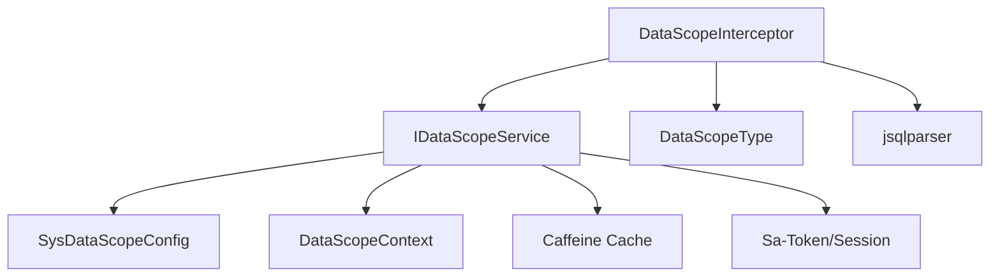

# SQL修改处理流程

<cite>
**本文引用的文件**
- [DataScopeInterceptor.java](file://forge/forge-framework/forge-starter-parent/forge-starter-datascope/src/main/java/com/mdframe/forge/starter/datascope/handler/DataScopeInterceptor.java)
- [DataScopeContextHolder.java](file://forge/forge-framework/forge-starter-parent/forge-starter-datascope/src/main/java/com/mdframe/forge/starter/datascope/context/DataScopeContextHolder.java)
- [DataScopeContext.java](file://forge/forge-framework/forge-starter-parent/forge-starter-datascope/src/main/java/com/mdframe/forge/starter/datascope/context/DataScopeContext.java)
- [IDataScopeService.java](file://forge/forge-framework/forge-starter-parent/forge-starter-datascope/src/main/java/com/mdframe/forge/starter/datascope/service/IDataScopeService.java)
- [DataScopeServiceImpl.java](file://forge/forge-framework/forge-starter-parent/forge-starter-datascope/src/main/java/com/mdframe/forge/starter/datascope/service/impl/DataScopeServiceImpl.java)
- [SysDataScopeConfig.java](file://forge/forge-framework/forge-starter-parent/forge-starter-datascope/src/main/java/com/mdframe/forge/starter/datascope/entity/SysDataScopeConfig.java)
- [DataScopeType.java](file://forge/forge-framework/forge-starter-parent/forge-starter-datascope/src/main/java/com/mdframe/forge/starter/datascope/enums/DataScopeType.java)
- [DataScopeAutoConfiguration.java](file://forge/forge-framework/forge-starter-parent/forge-starter-datascope/src/main/java/com/mdframe/forge/starter/datascope/config/DataScopeAutoConfiguration.java)
- [MybatisPlusConfig.java](file://forge/forge-framework/forge-starter-parent/forge-starter-orm/src/main/java/com/mdframe/forge/starter/orm/config/MybatisPlusConfig.java)
- [DATA_SCOPE_CONFIG_GUIDE.md](file://forge/forge-framework/forge-starter-parent/forge-starter-datascope/DATA_SCOPE_CONFIG_GUIDE.md)
</cite>

## 目录
1. [简介](#简介)
2. [项目结构](#项目结构)
3. [核心组件](#核心组件)
4. [架构总览](#架构总览)
5. [详细组件分析](#详细组件分析)
6. [依赖关系分析](#依赖关系分析)
7. [性能考量](#性能考量)
8. [故障排查指南](#故障排查指南)
9. [结论](#结论)
10. [附录](#附录)

## 简介
本文聚焦Forge框架数据权限拦截器在MyBatis执行链中的SQL修改处理流程，围绕DataScopeInterceptor的beforeQuery方法展开，系统阐述以下关键点：
- 跳过检查机制与适用场景
- Mapper方法识别与分页count查询的特殊处理策略
- 用户上下文获取与权限配置查询
- SQL改写算法与BoundSql反射修改技术
- 日志记录与异常处理、容错机制
- 在MyBatis-Plus拦截器链中的注册与执行顺序

## 项目结构
数据权限相关代码主要集中在forge-starter-datascope模块，配合ORM配置与自动装配，形成“配置-拦截-改写-执行”的闭环。

**图表来源**
- [DataScopeInterceptor.java](file://forge/forge-framework/forge-starter-parent/forge-starter-datascope/src/main/java/com/mdframe/forge/starter/datascope/handler/DataScopeInterceptor.java#L35-L117)
- [DataScopeServiceImpl.java](file://forge/forge-framework/forge-starter-parent/forge-starter-datascope/src/main/java/com/mdframe/forge/starter/datascope/service/impl/DataScopeServiceImpl.java#L24-L115)
- [MybatisPlusConfig.java](file://forge/forge-framework/forge-starter-parent/forge-starter-orm/src/main/java/com/mdframe/forge/starter/orm/config/MybatisPlusConfig.java#L30-L59)
- [DataScopeAutoConfiguration.java](file://forge/forge-framework/forge-starter-parent/forge-starter-datascope/src/main/java/com/mdframe/forge/starter/datascope/config/DataScopeAutoConfiguration.java#L20-L37)

**章节来源**
- [DataScopeInterceptor.java](file://forge/forge-framework/forge-starter-parent/forge-starter-datascope/src/main/java/com/mdframe/forge/starter/datascope/handler/DataScopeInterceptor.java#L35-L117)
- [MybatisPlusConfig.java](file://forge/forge-framework/forge-starter-parent/forge-starter-orm/src/main/java/com/mdframe/forge/starter/orm/config/MybatisPlusConfig.java#L30-L59)
- [DataScopeAutoConfiguration.java](file://forge/forge-framework/forge-starter-parent/forge-starter-datascope/src/main/java/com/mdframe/forge/starter/datascope/config/DataScopeAutoConfiguration.java#L20-L37)

## 核心组件
- DataScopeInterceptor：基于MyBatis-Plus的InnerInterceptor，在查询执行前进行数据权限控制与SQL改写。
- DataScopeServiceImpl：负责用户上下文构建、权限配置查询、组织树缓存与权限计算。
- DataScopeContext/DataScopeContextHolder：封装用户权限上下文与跳过标记。
- SysDataScopeConfig：数据权限配置实体，定义字段映射与启用状态。
- DataScopeType：权限范围枚举，决定SQL条件构建策略。
- MybatisPlusConfig：统一注册拦截器链，保证数据权限拦截器的最高优先级。

**章节来源**
- [DataScopeInterceptor.java](file://forge/forge-framework/forge-starter-parent/forge-starter-datascope/src/main/java/com/mdframe/forge/starter/datascope/handler/DataScopeInterceptor.java#L35-L117)
- [DataScopeServiceImpl.java](file://forge/forge-framework/forge-starter-parent/forge-starter-datascope/src/main/java/com/mdframe/forge/starter/datascope/service/impl/DataScopeServiceImpl.java#L24-L115)
- [DataScopeContext.java](file://forge/forge-framework/forge-starter-parent/forge-starter-datascope/src/main/java/com/mdframe/forge/starter/datascope/context/DataScopeContext.java#L10-L47)
- [DataScopeContextHolder.java](file://forge/forge-framework/forge-starter-parent/forge-starter-datascope/src/main/java/com/mdframe/forge/starter/datascope/context/DataScopeContextHolder.java#L7-L61)
- [SysDataScopeConfig.java](file://forge/forge-framework/forge-starter-parent/forge-starter-datascope/src/main/java/com/mdframe/forge/starter/datascope/entity/SysDataScopeConfig.java#L10-L84)
- [DataScopeType.java](file://forge/forge-framework/forge-starter-parent/forge-starter-datascope/src/main/java/com/mdframe/forge/starter/datascope/enums/DataScopeType.java#L6-L60)
- [MybatisPlusConfig.java](file://forge/forge-framework/forge-starter-parent/forge-starter-orm/src/main/java/com/mdframe/forge/starter/orm/config/MybatisPlusConfig.java#L30-L59)

## 架构总览
数据权限拦截器在MyBatis-Plus执行链中的位置与职责如下：

**图表来源**
- [DataScopeInterceptor.java](file://forge/forge-framework/forge-starter-parent/forge-starter-datascope/src/main/java/com/mdframe/forge/starter/datascope/handler/DataScopeInterceptor.java#L41-L117)
- [DataScopeServiceImpl.java](file://forge/forge-framework/forge-starter-parent/forge-starter-datascope/src/main/java/com/mdframe/forge/starter/datascope/service/impl/DataScopeServiceImpl.java#L50-L138)
- [MybatisPlusConfig.java](file://forge/forge-framework/forge-starter-parent/forge-starter-orm/src/main/java/com/mdframe/forge/starter/orm/config/MybatisPlusConfig.java#L38-L59)

## 详细组件分析

### DataScopeInterceptor.beforeQuery处理流程
- 跳过检查：若上下文持有者标记跳过，则直接返回，不进行任何改写。
- Mapper过滤：内部Mapper方法（特定包名）直接放行，避免循环或自检。
- 用户上下文获取：通过IDataScopeService获取DataScopeContext；失败或空则跳过。
- 分页count识别：对以“_mpCount”或“_COUNT”结尾的方法名，去掉后缀后查询配置，确保分页统计与列表查询共享同一权限规则。
- 权限配置查询：根据实际mapperId查询SysDataScopeConfig，未启用则跳过。
- 权限类型判定：根据DataScopeContext.minDataScope获取DataScopeType，未知类型则跳过。
- 全权限短路：ALL类型直接放行。
- SQL改写：解析原SQL为AST，构建数据权限条件并合并到WHERE子句，最后通过反射修改BoundSql的sql字段。
- 日志记录：记录原始SQL与改写SQL，便于审计与排障。

**图表来源**
- [DataScopeInterceptor.java](file://forge/forge-framework/forge-starter-parent/forge-starter-datascope/src/main/java/com/mdframe/forge/starter/datascope/handler/DataScopeInterceptor.java#L41-L117)

**章节来源**
- [DataScopeInterceptor.java](file://forge/forge-framework/forge-starter-parent/forge-starter-datascope/src/main/java/com/mdframe/forge/starter/datascope/handler/DataScopeInterceptor.java#L41-L117)

### 分页查询特殊处理机制
- 后缀识别：当mapperId以“_mpCount”或“_COUNT”结尾时，视为分页count查询。
- 方法名还原：去除后缀后得到原列表查询的mapperId，从而复用同一份权限配置。
- 策略依据：分页count与列表查询应保持一致的权限边界，避免统计结果被过度裁剪或泄露。

**图表来源**
- [DataScopeInterceptor.java](file://forge/forge-framework/forge-starter-parent/forge-starter-datascope/src/main/java/com/mdframe/forge/starter/datascope/handler/DataScopeInterceptor.java#L73-L80)

**章节来源**
- [DataScopeInterceptor.java](file://forge/forge-framework/forge-starter-parent/forge-starter-datascope/src/main/java/com/mdframe/forge/starter/datascope/handler/DataScopeInterceptor.java#L73-L80)

### SQL改写核心算法
- AST解析：使用jsqlparser将原SQL解析为Statement/Select/PlainSelect结构。
- 条件构建：根据DataScopeType与配置字段，构造Expression（等值/IN/自定义SQL表达式）。
- 合并策略：若原SQL已有WHERE，则使用AND连接；否则直接设置WHERE。
- 反射修改：通过PluginUtils.MPBoundSql的sql()方法反射替换SQL字符串，确保后续执行使用改写后的SQL。
- 输出回写：将改写后的Select.toString()作为新SQL写回BoundSql。

**图表来源**
- [DataScopeInterceptor.java](file://forge/forge-framework/forge-starter-parent/forge-starter-datascope/src/main/java/com/mdframe/forge/starter/datascope/handler/DataScopeInterceptor.java#L119-L156)

**章节来源**
- [DataScopeInterceptor.java](file://forge/forge-framework/forge-starter-parent/forge-starter-datascope/src/main/java/com/mdframe/forge/starter/datascope/handler/DataScopeInterceptor.java#L119-L156)

### 权限条件构建与字段映射
- 字段来源：SysDataScopeConfig.userIdColumn/orgIdColumn/tenantIdColumn支持简单字段或以“<sql>”开头的复杂SQL。
- 占位符替换：复杂SQL中支持#{userId}、#{tenantId}、#{orgIds}、#{customOrgIds}，由拦截器在运行时替换。
- 条件类型：
  - SELF：等值条件（用户ID）
  - ORG/ORG_AND_CHILD/CUSTOM：IN条件（组织ID集合）
  - TENANT_ALL：等值条件（租户ID）
- 组织树扩展：对于“本组织及子组织”，通过服务层缓存查询组织树并展开为ID列表。

**图表来源**
- [SysDataScopeConfig.java](file://forge/forge-framework/forge-starter-parent/forge-starter-datascope/src/main/java/com/mdframe/forge/starter/datascope/entity/SysDataScopeConfig.java#L10-L84)
- [DataScopeContext.java](file://forge/forge-framework/forge-starter-parent/forge-starter-datascope/src/main/java/com/mdframe/forge/starter/datascope/context/DataScopeContext.java#L10-L47)
- [DataScopeType.java](file://forge/forge-framework/forge-starter-parent/forge-starter-datascope/src/main/java/com/mdframe/forge/starter/datascope/enums/DataScopeType.java#L6-L60)
- [DataScopeInterceptor.java](file://forge/forge-framework/forge-starter-parent/forge-starter-datascope/src/main/java/com/mdframe/forge/starter/datascope/handler/DataScopeInterceptor.java#L158-L314)
- [IDataScopeService.java](file://forge/forge-framework/forge-starter-parent/forge-starter-datascope/src/main/java/com/mdframe/forge/starter/datascope/service/IDataScopeService.java#L9-L41)

**章节来源**
- [SysDataScopeConfig.java](file://forge/forge-framework/forge-starter-parent/forge-starter-datascope/src/main/java/com/mdframe/forge/starter/datascope/entity/SysDataScopeConfig.java#L10-L84)
- [DataScopeInterceptor.java](file://forge/forge-framework/forge-starter-parent/forge-starter-datascope/src/main/java/com/mdframe/forge/starter/datascope/handler/DataScopeInterceptor.java#L158-L314)
- [IDataScopeService.java](file://forge/forge-framework/forge-starter-parent/forge-starter-datascope/src/main/java/com/mdframe/forge/starter/datascope/service/IDataScopeService.java#L9-L41)

### 异常处理与容错机制
- 用户上下文获取失败：捕获异常并直接返回，避免影响正常业务（常见于后台任务或匿名场景）。
- 权限配置缺失：若配置未启用或不存在，直接返回，不改写SQL。
- SQL解析异常：捕获异常并记录错误日志，不中断查询执行。
- 未知权限类型：记录告警并跳过改写，确保系统稳定。
- 组织树为空：当组织ID集合为空时，条件构建返回null，不附加WHERE，避免误过滤。

**章节来源**
- [DataScopeInterceptor.java](file://forge/forge-framework/forge-starter-parent/forge-starter-datascope/src/main/java/com/mdframe/forge/starter/datascope/handler/DataScopeInterceptor.java#L60-L116)
- [DataScopeServiceImpl.java](file://forge/forge-framework/forge-starter-parent/forge-starter-datascope/src/main/java/com/mdframe/forge/starter/datascope/service/impl/DataScopeServiceImpl.java#L50-L115)

### 在MyBatis-Plus拦截器链中的注册与影响
- 自动装配：DataScopeAutoConfiguration在属性开关开启时暴露DataScopeInterceptor Bean。
- 统一注册：MybatisPlusConfig扫描List<InnerInterceptor>并逐一addInnerInterceptor，保证拦截器顺序可控。
- 优先级：数据权限拦截器设置最高优先级，确保在分页、乐观锁等插件之前执行，从而对分页count与列表查询均生效。

**图表来源**
- [DataScopeAutoConfiguration.java](file://forge/forge-framework/forge-starter-parent/forge-starter-datascope/src/main/java/com/mdframe/forge/starter/datascope/config/DataScopeAutoConfiguration.java#L20-L37)
- [MybatisPlusConfig.java](file://forge/forge-framework/forge-starter-parent/forge-starter-orm/src/main/java/com/mdframe/forge/starter/orm/config/MybatisPlusConfig.java#L35-L59)

**章节来源**
- [DataScopeAutoConfiguration.java](file://forge/forge-framework/forge-starter-parent/forge-starter-datascope/src/main/java/com/mdframe/forge/starter/datascope/config/DataScopeAutoConfiguration.java#L20-L37)
- [MybatisPlusConfig.java](file://forge/forge-framework/forge-starter-parent/forge-starter-orm/src/main/java/com/mdframe/forge/starter/orm/config/MybatisPlusConfig.java#L35-L59)

## 依赖关系分析
- 内聚性：DataScopeInterceptor高度内聚于权限判定与SQL改写，职责清晰。
- 耦合性：与IDataScopeService耦合用于上下文与配置查询；与jsqlparser耦合用于SQL解析；与SpringUtil耦合用于Bean获取。
- 外部依赖：jsqlparser用于AST解析；Caffeine缓存用于配置与组织树查询；Sa-Token用于会话与管理员判定。
- 循环依赖：未发现直接循环依赖；拦截器通过服务层间接访问配置与缓存。

**图表来源**
- [DataScopeInterceptor.java](file://forge/forge-framework/forge-starter-parent/forge-starter-datascope/src/main/java/com/mdframe/forge/starter/datascope/handler/DataScopeInterceptor.java#L35-L117)
- [DataScopeServiceImpl.java](file://forge/forge-framework/forge-starter-parent/forge-starter-datascope/src/main/java/com/mdframe/forge/starter/datascope/service/impl/DataScopeServiceImpl.java#L24-L115)

**章节来源**
- [DataScopeInterceptor.java](file://forge/forge-framework/forge-starter-parent/forge-starter-datascope/src/main/java/com/mdframe/forge/starter/datascope/handler/DataScopeInterceptor.java#L35-L117)
- [DataScopeServiceImpl.java](file://forge/forge-framework/forge-starter-parent/forge-starter-datascope/src/main/java/com/mdframe/forge/starter/datascope/service/impl/DataScopeServiceImpl.java#L24-L115)

## 性能考量
- 缓存策略：配置与组织树采用Caffeine本地缓存，减少数据库压力；支持显式刷新。
- 解析成本：SQL解析与AST构建有一定开销，建议对复杂SQL进行EXPLAIN与优化。
- 反射修改：BoundSql反射修改为轻量级操作，注意与MyBatis版本兼容性。
- 分页count：通过去除后缀复用配置，避免重复查询与缓存穿透。

[本节为通用指导，不直接分析具体文件]

## 故障排查指南
- 配置未生效
  - 检查SysDataScopeConfig.enabled是否为启用状态
  - 确认mapperMethod路径与实际Mapper方法一致
  - 核对表别名与XML中定义一致
- SQL语法错误
  - 复杂SQL需以“<sql>”开头
  - 占位符格式需正确（#{userId}、#{tenantId}、#{orgIds}、#{customOrgIds}）
  - 使用EXPLAIN验证SQL合法性
- 查询结果为空
  - 检查字段名与表结构一致性
  - 确认当前用户是否具备匹配数据
- 日志定位
  - 关注拦截器日志：原始SQL与改写SQL对比
  - 关注服务层日志：上下文构建与缓存命中情况

**章节来源**
- [DATA_SCOPE_CONFIG_GUIDE.md](file://forge/forge-framework/forge-starter-parent/forge-starter-datascope/DATA_SCOPE_CONFIG_GUIDE.md#L228-L259)
- [DataScopeInterceptor.java](file://forge/forge-framework/forge-starter-parent/forge-starter-datascope/src/main/java/com/mdframe/forge/starter/datascope/handler/DataScopeInterceptor.java#L111-L112)

## 结论
DataScopeInterceptor通过“上下文-配置-AST-反射”的组合，在MyBatis-Plus执行链的早期阶段实现了细粒度的数据权限控制。其设计兼顾灵活性（支持简单字段与复杂SQL）、稳定性（完善的异常与容错）与性能（缓存与优先级）。结合分页count的特殊处理与日志记录机制，能够满足生产环境对数据安全与可观测性的双重需求。

[本节为总结性内容，不直接分析具体文件]

## 附录
- 配置指南与使用示例可参考模块内的配置文档，涵盖字段配置、占位符使用与常见问题解答。

**章节来源**
- [DATA_SCOPE_CONFIG_GUIDE.md](file://forge/forge-framework/forge-starter-parent/forge-starter-datascope/DATA_SCOPE_CONFIG_GUIDE.md#L1-L291)