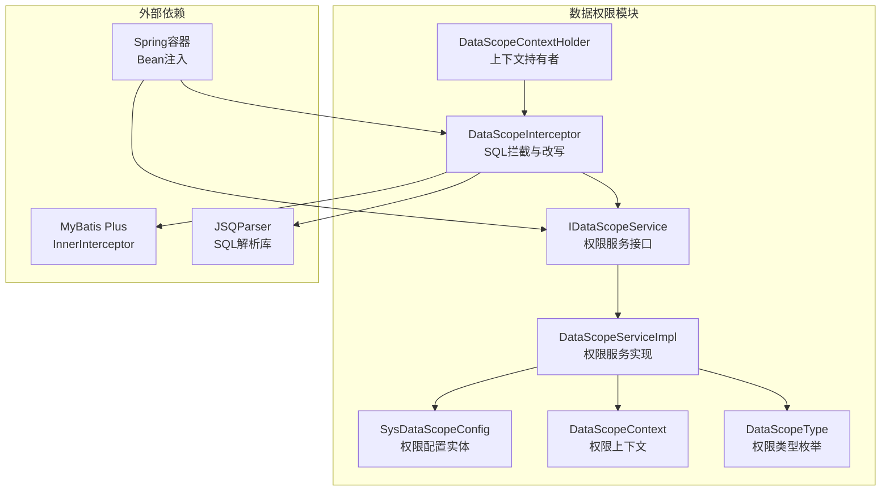
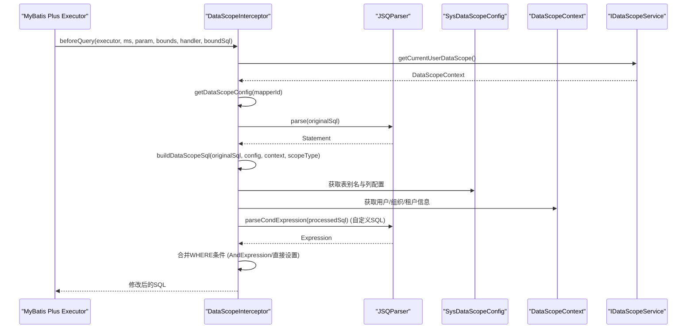
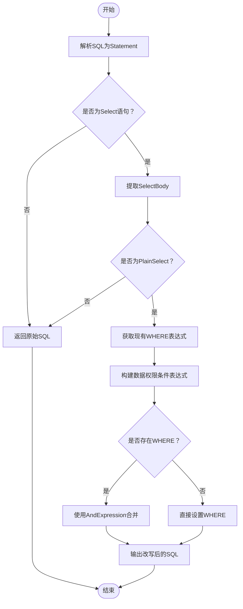
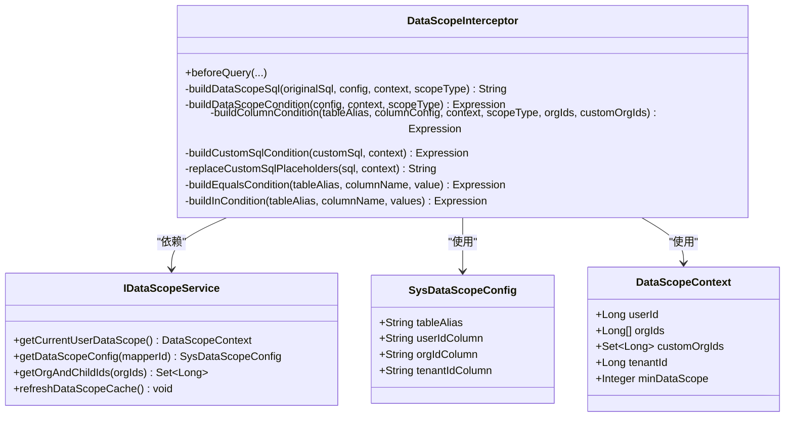
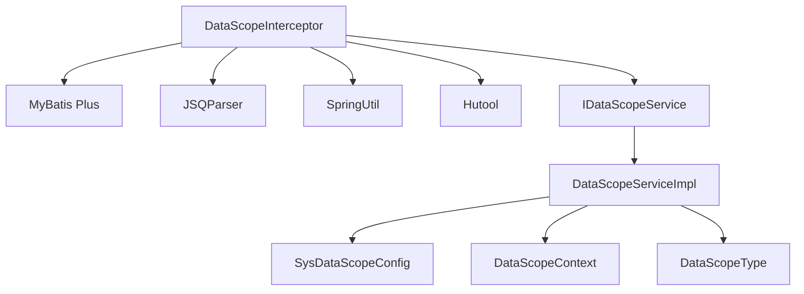

# SQL解析引擎

<cite>
**本文档引用的文件**
- [DataScopeInterceptor.java](file://forge/forge-framework/forge-starter-parent/forge-starter-datascope/src/main/java/com/mdframe/forge/starter/datascope/handler/DataScopeInterceptor.java)
- [SysDataScopeConfig.java](file://forge/forge-framework/forge-starter-parent/forge-starter-datascope/src/main/java/com/mdframe/forge/starter/datascope/entity/SysDataScopeConfig.java)
- [DataScopeContext.java](file://forge/forge-framework/forge-starter-parent/forge-starter-datascope/src/main/java/com/mdframe/forge/starter/datascope/context/DataScopeContext.java)
- [DataScopeContextHolder.java](file://forge/forge-framework/forge-starter-parent/forge-starter-datascope/src/main/java/com/mdframe/forge/starter/datascope/context/DataScopeContextHolder.java)
- [IDataScopeService.java](file://forge/forge-framework/forge-starter-parent/forge-starter-datascope/src/main/java/com/mdframe/forge/starter/datascope/service/IDataScopeService.java)
- [DataScopeServiceImpl.java](file://forge/forge-framework/forge-starter-parent/forge-starter-datascope/src/main/java/com/mdframe/forge/starter/datascope/service/impl/DataScopeServiceImpl.java)
- [DataScopeType.java](file://forge/forge-framework/forge-starter-parent/forge-starter-datascope/src/main/java/com/mdframe/forge/starter/datascope/enums/DataScopeType.java)
- [datascope_tables.sql](file://forge/forge-framework/forge-starter-parent/forge-starter-datascope/sql/datascope_tables.sql)
</cite>

## 目录
1. [简介](#简介)
2. [项目结构](#项目结构)
3. [核心组件](#核心组件)
4. [架构概览](#架构概览)
5. [详细组件分析](#详细组件分析)
6. [依赖分析](#依赖分析)
7. [性能考虑](#性能考虑)
8. [故障排除指南](#故障排除指南)
9. [结论](#结论)

## 简介
本文档深入解析Forge框架数据权限拦截器中的SQL解析引擎，重点阐述DataScopeInterceptor如何使用JSQParser库对SQL语句进行解析与改写。文档涵盖以下关键主题：
- SELECT语句的解析流程与PlainSelect结构处理
- WHERE条件的提取与重建机制
- SQL解析的核心步骤：Statement解析、Select语句识别、PlainSelect节点处理、Expression表达式构建
- 复杂SQL结构的处理：嵌套查询、子查询、JOIN操作
- 异常处理机制与错误恢复策略
- 完整的解析流程示例：从原始SQL到AST（抽象语法树）再到改写后的SQL

## 项目结构
数据权限拦截器位于Forge框架的starter模块中，采用MyBatis Plus的InnerInterceptor扩展点，在SQL执行前进行拦截与改写。核心文件包括拦截器实现、数据权限配置实体、上下文管理、服务接口与实现、以及权限类型枚举。

**图表来源**
- [DataScopeInterceptor.java](file://forge/forge-framework/forge-starter-parent/forge-starter-datascope/src/main/java/com/mdframe/forge/starter/datascope/handler/DataScopeInterceptor.java#L35-L117)
- [SysDataScopeConfig.java](file://forge/forge-framework/forge-starter-parent/forge-starter-datascope/src/main/java/com/mdframe/forge/starter/datascope/entity/SysDataScopeConfig.java#L10-L84)
- [DataScopeContext.java](file://forge/forge-framework/forge-starter-parent/forge-starter-datascope/src/main/java/com/mdframe/forge/starter/datascope/context/DataScopeContext.java#L10-L47)
- [DataScopeContextHolder.java](file://forge/forge-framework/forge-starter-parent/forge-starter-datascope/src/main/java/com/mdframe/forge/starter/datascope/context/DataScopeContextHolder.java#L7-L61)
- [IDataScopeService.java](file://forge/forge-framework/forge-starter-parent/forge-starter-datascope/src/main/java/com/mdframe/forge/starter/datascope/service/IDataScopeService.java#L9-L41)
- [DataScopeServiceImpl.java](file://forge/forge-framework/forge-starter-parent/forge-starter-datascope/src/main/java/com/mdframe/forge/starter/datascope/service/impl/DataScopeServiceImpl.java#L21-L176)
- [DataScopeType.java](file://forge/forge-framework/forge-starter-parent/forge-starter-datascope/src/main/java/com/mdframe/forge/starter/datascope/enums/DataScopeType.java#L6-L60)

**章节来源**
- [DataScopeInterceptor.java](file://forge/forge-framework/forge-starter-parent/forge-starter-datascope/src/main/java/com/mdframe/forge/starter/datascope/handler/DataScopeInterceptor.java#L35-L117)
- [SysDataScopeConfig.java](file://forge/forge-framework/forge-starter-parent/forge-starter-datascope/src/main/java/com/mdframe/forge/starter/datascope/entity/SysDataScopeConfig.java#L10-L84)

## 核心组件
本节聚焦SQL解析引擎的关键组件与职责：
- DataScopeInterceptor：实现MyBatis Plus的InnerInterceptor，负责在SQL执行前拦截并改写WHERE条件
- JSQParser：通过CCJSqlParserUtil解析SQL为AST，支持Select语句与PlainSelect节点
- Expression构建器：基于权限上下文动态构建EqualsTo、InExpression等表达式
- 权限配置与上下文：SysDataScopeConfig与DataScopeContext提供权限规则与运行时参数

**章节来源**
- [DataScopeInterceptor.java](file://forge/forge-framework/forge-starter-parent/forge-starter-datascope/src/main/java/com/mdframe/forge/starter/datascope/handler/DataScopeInterceptor.java#L14-L28)
- [SysDataScopeConfig.java](file://forge/forge-framework/forge-starter-parent/forge-starter-datascope/src/main/java/com/mdframe/forge/starter/datascope/entity/SysDataScopeConfig.java#L54-L72)
- [DataScopeContext.java](file://forge/forge-framework/forge-starter-parent/forge-starter-datascope/src/main/java/com/mdframe/forge/starter/datascope/context/DataScopeContext.java#L18-L46)

## 架构概览
下图展示了数据权限拦截器的调用序列：拦截器从BoundSql获取原始SQL，解析为AST，根据权限上下文构建表达式，并将新条件合并到WHERE子句中。

**图表来源**
- [DataScopeInterceptor.java](file://forge/forge-framework/forge-starter-parent/forge-starter-datascope/src/main/java/com/mdframe/forge/starter/datascope/handler/DataScopeInterceptor.java#L41-L117)
- [DataScopeInterceptor.java](file://forge/forge-framework/forge-starter-parent/forge-starter-datascope/src/main/java/com/mdframe/forge/starter/datascope/handler/DataScopeInterceptor.java#L122-L156)
- [DataScopeInterceptor.java](file://forge/forge-framework/forge-starter-parent/forge-starter-datascope/src/main/java/com/mdframe/forge/starter/datascope/handler/DataScopeInterceptor.java#L265-L281)

## 详细组件分析

### SQL解析与改写流程
DataScopeInterceptor的buildDataScopeSql方法实现了完整的解析与改写流程：
1. 使用CCJSqlParserUtil.parse将原始SQL解析为Statement
2. 仅处理Select语句；若非Select或非PlainSelect，直接返回原SQL
3. 提取PlainSelect的where表达式
4. 根据权限类型与上下文构建数据权限条件表达式
5. 将新条件与原有WHERE进行AND连接或直接替换
6. 返回改写后的SQL字符串

**图表来源**
- [DataScopeInterceptor.java](file://forge/forge-framework/forge-starter-parent/forge-starter-datascope/src/main/java/com/mdframe/forge/starter/datascope/handler/DataScopeInterceptor.java#L125-L155)

**章节来源**
- [DataScopeInterceptor.java](file://forge/forge-framework/forge-starter-parent/forge-starter-datascope/src/main/java/com/mdframe/forge/starter/datascope/handler/DataScopeInterceptor.java#L122-L156)

### 权限条件表达式构建
根据权限类型与上下文，拦截器构建不同类型的表达式：
- SELF/TENANT_ALL：构建等值条件（EqualsTo）
- ORG/ORG_AND_CHILD/CUSTOM：构建IN条件（InExpression）
- 自定义SQL：支持占位符替换与条件表达式解析

**图表来源**
- [DataScopeInterceptor.java](file://forge/forge-framework/forge-starter-parent/forge-starter-datascope/src/main/java/com/mdframe/forge/starter/datascope/handler/DataScopeInterceptor.java#L161-L260)
- [SysDataScopeConfig.java](file://forge/forge-framework/forge-starter-parent/forge-starter-datascope/src/main/java/com/mdframe/forge/starter/datascope/entity/SysDataScopeConfig.java#L47-L73)
- [DataScopeContext.java](file://forge/forge-framework/forge-starter-parent/forge-starter-datascope/src/main/java/com/mdframe/forge/starter/datascope/context/DataScopeContext.java#L16-L47)
- [IDataScopeService.java](file://forge/forge-framework/forge-starter-parent/forge-starter-datascope/src/main/java/com/mdframe/forge/starter/datascope/service/IDataScopeService.java#L12-L41)

**章节来源**
- [DataScopeInterceptor.java](file://forge/forge-framework/forge-starter-parent/forge-starter-datascope/src/main/java/com/mdframe/forge/starter/datascope/handler/DataScopeInterceptor.java#L161-L260)
- [DataScopeInterceptor.java](file://forge/forge-framework/forge-starter-parent/forge-starter-datascope/src/main/java/com/mdframe/forge/starter/datascope/handler/DataScopeInterceptor.java#L319-L348)

### 复杂SQL结构处理
- 嵌套查询与子查询：拦截器仅处理PlainSelect，对于复杂SelectBody（如With、SetOperation等）将直接返回原SQL，避免误改写
- JOIN操作：拦截器通过PlainSelect.getWhere()获取WHERE表达式，不直接解析JOIN子句，确保改写的安全性
- 自定义SQL表达式：支持以<sql>标签包裹的复杂表达式，内部通过占位符替换与parseCondExpression进行解析

**章节来源**
- [DataScopeInterceptor.java](file://forge/forge-framework/forge-starter-parent/forge-starter-datascope/src/main/java/com/mdframe/forge/starter/datascope/handler/DataScopeInterceptor.java#L134-L136)
- [DataScopeInterceptor.java](file://forge/forge-framework/forge-starter-parent/forge-starter-datascope/src/main/java/com/mdframe/forge/starter/datascope/handler/DataScopeInterceptor.java#L227-L232)
- [DataScopeInterceptor.java](file://forge/forge-framework/forge-starter-parent/forge-starter-datascope/src/main/java/com/mdframe/forge/starter/datascope/handler/DataScopeInterceptor.java#L265-L281)

### 异常处理与错误恢复
- 解析失败：当JSQParser无法解析自定义SQL条件时，记录错误日志并返回null，拦截器将跳过权限改写，保证SQL执行不受影响
- 上下文缺失：当无法获取用户上下文或配置为空时，直接返回原SQL
- 分页count查询：自动识别并处理以_mpCount或_COUNT结尾的方法名，确保分页统计正确

**章节来源**
- [DataScopeInterceptor.java](file://forge/forge-framework/forge-starter-parent/forge-starter-datascope/src/main/java/com/mdframe/forge/starter/datascope/handler/DataScopeInterceptor.java#L114-L116)
- [DataScopeInterceptor.java](file://forge/forge-framework/forge-starter-parent/forge-starter-datascope/src/main/java/com/mdframe/forge/starter/datascope/handler/DataScopeInterceptor.java#L277-L280)
- [DataScopeInterceptor.java](file://forge/forge-framework/forge-starter-parent/forge-starter-datascope/src/main/java/com/mdframe/forge/starter/datascope/handler/DataScopeInterceptor.java#L75-L80)

### 完整示例：从原始SQL到AST再到改写SQL
以下示例展示典型流程（以路径代替具体代码）：
1. 原始SQL：SELECT * FROM user u WHERE u.status = 1
2. 解析：CCJSqlParserUtil.parse得到Statement，再强转为Select与PlainSelect
3. 权限条件：根据上下文构建u.dept_id IN (1001,1002,1003)
4. 合并：将权限条件与原WHERE使用AND连接，得到新的WHERE
5. 输出：select.toString()生成最终SQL

参考实现位置：
- [DataScopeInterceptor.java](file://forge/forge-framework/forge-starter-parent/forge-starter-datascope/src/main/java/com/mdframe/forge/starter/datascope/handler/DataScopeInterceptor.java#L125-L155)
- [DataScopeInterceptor.java](file://forge/forge-framework/forge-starter-parent/forge-starter-datascope/src/main/java/com/mdframe/forge/starter/datascope/handler/DataScopeInterceptor.java#L330-L348)

**章节来源**
- [DataScopeInterceptor.java](file://forge/forge-framework/forge-starter-parent/forge-starter-datascope/src/main/java/com/mdframe/forge/starter/datascope/handler/DataScopeInterceptor.java#L125-L155)
- [DataScopeInterceptor.java](file://forge/forge-framework/forge-starter-parent/forge-starter-datascope/src/main/java/com/mdframe/forge/starter/datascope/handler/DataScopeInterceptor.java#L330-L348)

## 依赖分析
数据权限拦截器依赖的关键组件与外部库：
- MyBatis Plus：通过InnerInterceptor扩展点接入SQL生命周期
- JSQParser：提供SQL解析能力，支持Statement、Select、PlainSelect与Expression
- Spring：通过SpringUtil获取服务Bean，实现依赖注入
- Hutool：提供字符串工具与Spring工具类

**图表来源**
- [DataScopeInterceptor.java](file://forge/forge-framework/forge-starter-parent/forge-starter-datascope/src/main/java/com/mdframe/forge/starter/datascope/handler/DataScopeInterceptor.java#L3-L28)
- [DataScopeServiceImpl.java](file://forge/forge-framework/forge-starter-parent/forge-starter-datascope/src/main/java/com/mdframe/forge/starter/datascope/service/impl/DataScopeServiceImpl.java#L24-L27)

**章节来源**
- [DataScopeInterceptor.java](file://forge/forge-framework/forge-starter-parent/forge-starter-datascope/src/main/java/com/mdframe/forge/starter/datascope/handler/DataScopeInterceptor.java#L3-L28)
- [DataScopeServiceImpl.java](file://forge/forge-framework/forge-starter-parent/forge-starter-datascope/src/main/java/com/mdframe/forge/starter/datascope/service/impl/DataScopeServiceImpl.java#L24-L27)

## 性能考虑
- 缓存策略：DataScopeServiceImpl使用Caffeine缓存权限配置与组织子节点，减少数据库访问
- 解析成本：JSQParser解析开销与SQL复杂度相关，建议尽量保持SQL简洁
- 反射修改：通过PluginUtils.MPBoundSql反射修改SQL，避免重复构造对象

优化建议：
- 对频繁访问的Mapper方法配置进行预热，提升缓存命中率
- 在业务层尽量避免过于复杂的子查询与多重JOIN，降低解析与执行成本
- 合理使用自定义SQL表达式，避免过度复杂的条件导致解析失败

**章节来源**
- [DataScopeServiceImpl.java](file://forge/forge-framework/forge-starter-parent/forge-starter-datascope/src/main/java/com/mdframe/forge/starter/datascope/service/impl/DataScopeServiceImpl.java#L37-L48)
- [DataScopeServiceImpl.java](file://forge/forge-framework/forge-starter-parent/forge-starter-datascope/src/main/java/com/mdframe/forge/starter/datascope/service/impl/DataScopeServiceImpl.java#L141-L167)

## 故障排除指南
常见问题与解决方案：
- 解析自定义SQL失败：检查<sql>标签内的表达式是否符合JSQParser语法，确认占位符替换是否正确
- 权限条件未生效：确认Mapper方法ID与配置匹配，检查DataScopeContext中的用户/组织/租户信息
- 分页count查询异常：确保方法名以_mpCount或_COUNT结尾，拦截器会自动处理后缀
- 跳过权限控制：通过DataScopeContextHolder.skipDataScope()设置标记，适用于后台任务场景

排查步骤：
1. 查看拦截器日志，确认是否进入buildDataScopeSql流程
2. 检查JSQParser解析结果，验证Statement与PlainSelect结构
3. 核对权限配置与上下文数据，确保字段映射正确
4. 如遇异常，查看异常栈并定位到具体的解析或表达式构建环节

**章节来源**
- [DataScopeInterceptor.java](file://forge/forge-framework/forge-starter-parent/forge-starter-datascope/src/main/java/com/mdframe/forge/starter/datascope/handler/DataScopeInterceptor.java#L114-L116)
- [DataScopeInterceptor.java](file://forge/forge-framework/forge-starter-parent/forge-starter-datascope/src/main/java/com/mdframe/forge/starter/datascope/handler/DataScopeInterceptor.java#L277-L280)
- [DataScopeContextHolder.java](file://forge/forge-framework/forge-starter-parent/forge-starter-datascope/src/main/java/com/mdframe/forge/starter/datascope/context/DataScopeContextHolder.java#L13-L31)

## 结论
Forge框架的数据权限拦截器通过JSQParser实现了对SQL的精准解析与安全改写。其核心优势在于：
- 明确的解析流程与严格的类型检查，确保仅对PlainSelect进行改写
- 灵活的表达式构建机制，支持等值、IN与复杂自定义SQL
- 完善的异常处理与缓存策略，保障系统稳定性与性能
- 与MyBatis Plus无缝集成，提供透明的数据权限控制

通过合理配置权限规则与上下文信息，开发者可以快速实现细粒度的数据权限控制，满足复杂业务场景下的数据安全需求。