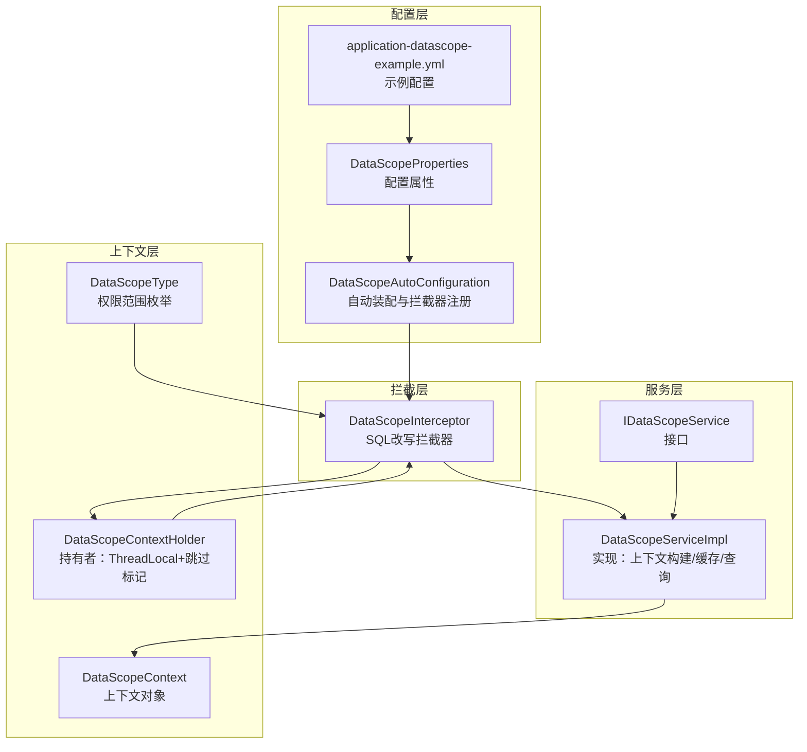
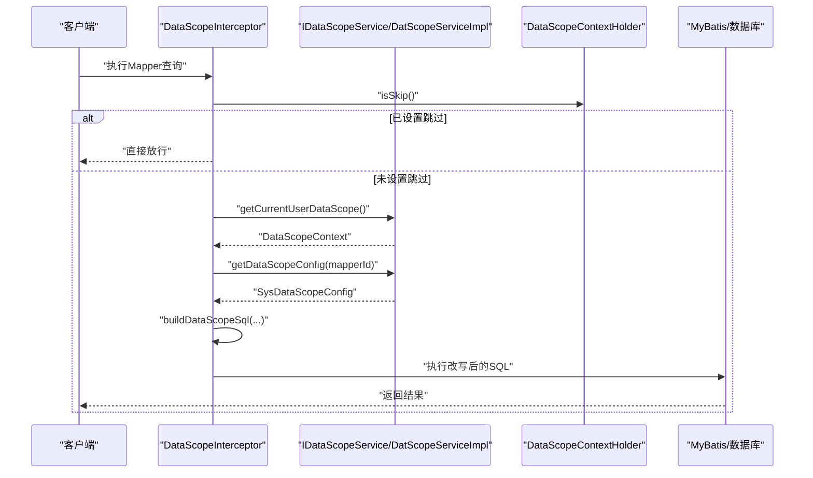
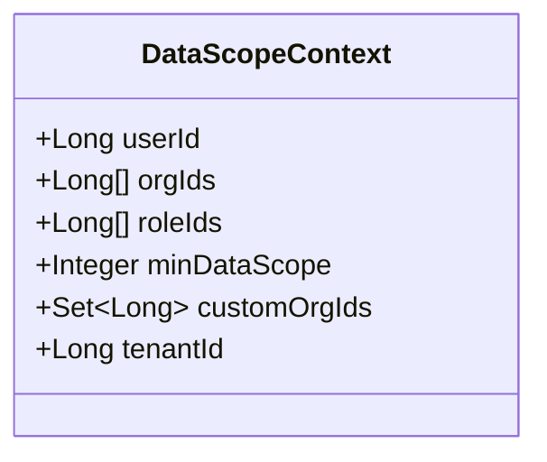
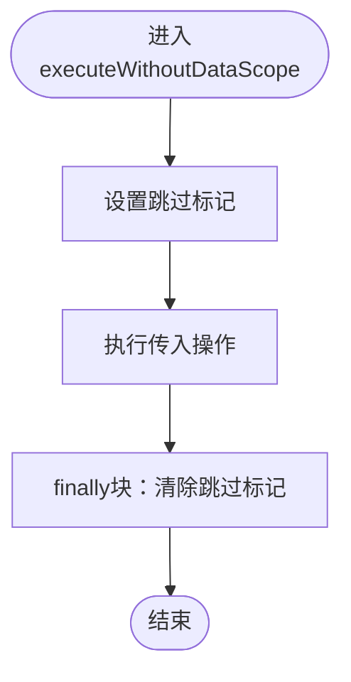
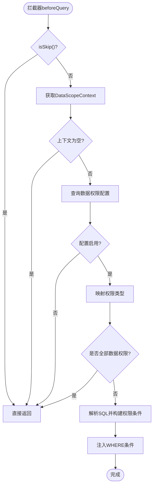
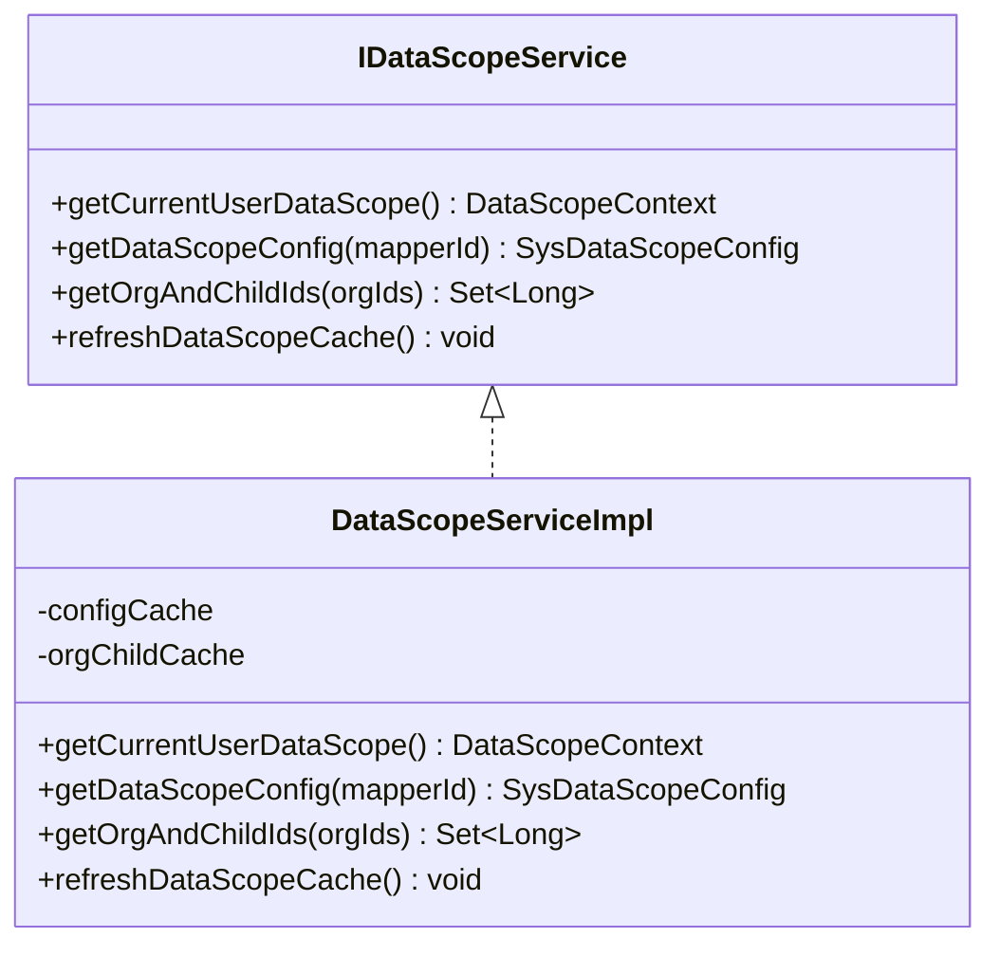
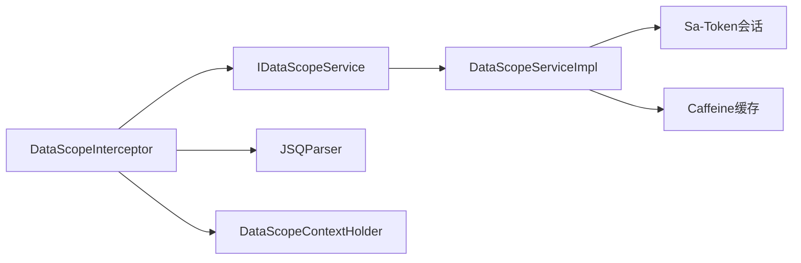

# 上下文管理机制

<cite>
**本文引用的文件**
- [DataScopeContext.java](file://forge/forge-framework/forge-starter-parent/forge-starter-datascope/src/main/java/com/mdframe/forge/starter/datascope/context/DataScopeContext.java)
- [DataScopeContextHolder.java](file://forge/forge-framework/forge-starter-parent/forge-starter-datascope/src/main/java/com/mdframe/forge/starter/datascope/context/DataScopeContextHolder.java)
- [DataScopeInterceptor.java](file://forge/forge-framework/forge-starter-parent/forge-starter-datascope/src/main/java/com/mdframe/forge/starter/datascope/handler/DataScopeInterceptor.java)
- [DataScopeAutoConfiguration.java](file://forge/forge-framework/forge-starter-parent/forge-starter-datascope/src/main/java/com/mdframe/forge/starter/datascope/config/DataScopeAutoConfiguration.java)
- [DataScopeProperties.java](file://forge/forge-framework/forge-starter-parent/forge-starter-datascope/src/main/java/com/mdframe/forge/starter/datascope/config/DataScopeProperties.java)
- [IDataScopeService.java](file://forge/forge-framework/forge-starter-parent/forge-starter-datascope/src/main/java/com/mdframe/forge/starter/datascope/service/IDataScopeService.java)
- [DataScopeServiceImpl.java](file://forge/forge-framework/forge-starter-parent/forge-starter-datascope/src/main/java/com/mdframe/forge/starter/datascope/service/impl/DataScopeServiceImpl.java)
- [DataScopeType.java](file://forge/forge-framework/forge-starter-parent/forge-starter-datascope/src/main/java/com/mdframe/forge/starter/datascope/enums/DataScopeType.java)
- [application-datascope-example.yml](file://forge/forge-framework/forge-starter-parent/forge-starter-datascope/src/main/resources/application-datascope-example.yml)
- [org.springframework.boot.autoconfigure.AutoConfiguration.imports](file://forge/forge-framework/forge-starter-parent/forge-starter-datascope/src/main/resources/META-INF/spring/org.springframework.boot.autoconfigure.AutoConfiguration.imports)
</cite>

## 目录
1. [引言](#引言)
2. [项目结构](#项目结构)
3. [核心组件](#核心组件)
4. [架构总览](#架构总览)
5. [详细组件分析](#详细组件分析)
6. [依赖关系分析](#依赖关系分析)
7. [性能考量](#性能考量)
8. [故障排查指南](#故障排查指南)
9. [结论](#结论)
10. [附录](#附录)

## 引言
本文件聚焦Forge框架的数据权限上下文管理机制，系统性解析DataScopeContext与DataScopeContextHolder的设计理念与实现细节，涵盖上下文对象结构、数据权限信息的存储与传递、生命周期管理（创建、设置、获取、清理）、线程安全的上下文传递策略（ThreadLocal）与内存泄漏防护、以及在普通请求、异步任务、定时任务等场景下的上下文处理策略。同时提供上下文数据的验证机制与异常处理方案，确保系统稳定性与安全性。

## 项目结构
数据权限模块位于forge-starter-datascope，主要由以下层次构成：
- 配置层：自动装配与属性配置，负责拦截器注册与开关控制
- 服务层：数据权限上下文构建与配置查询，含缓存与角色/组织映射
- 拦截层：基于MyBatis-Plus的SQL改写拦截器，按上下文动态注入WHERE条件
- 上下文层：上下文对象与持有者，提供跳过标记与执行器

图表来源
- [DataScopeAutoConfiguration.java](file://forge/forge-framework/forge-starter-parent/forge-starter-datascope/src/main/java/com/mdframe/forge/starter/datascope/config/DataScopeAutoConfiguration.java#L1-L39)
- [DataScopeProperties.java](file://forge/forge-framework/forge-starter-parent/forge-starter-datascope/src/main/java/com/mdframe/forge/starter/datascope/config/DataScopeProperties.java#L1-L23)
- [application-datascope-example.yml](file://forge/forge-framework/forge-starter-parent/forge-starter-datascope/src/main/resources/application-datascope-example.yml#L1-L10)
- [IDataScopeService.java](file://forge/forge-framework/forge-starter-parent/forge-starter-datascope/src/main/java/com/mdframe/forge/starter/datascope/service/IDataScopeService.java#L1-L42)
- [DataScopeServiceImpl.java](file://forge/forge-framework/forge-starter-parent/forge-starter-datascope/src/main/java/com/mdframe/forge/starter/datascope/service/impl/DataScopeServiceImpl.java#L1-L177)
- [DataScopeInterceptor.java](file://forge/forge-framework/forge-starter-parent/forge-starter-datascope/src/main/java/com/mdframe/forge/starter/datascope/handler/DataScopeInterceptor.java#L1-L350)
- [DataScopeContext.java](file://forge/forge-framework/forge-starter-parent/forge-starter-datascope/src/main/java/com/mdframe/forge/starter/datascope/context/DataScopeContext.java#L1-L48)
- [DataScopeContextHolder.java](file://forge/forge-framework/forge-starter-parent/forge-starter-datascope/src/main/java/com/mdframe/forge/starter/datascope/context/DataScopeContextHolder.java#L1-L62)
- [DataScopeType.java](file://forge/forge-framework/forge-starter-parent/forge-starter-datascope/src/main/java/com/mdframe/forge/starter/datascope/enums/DataScopeType.java#L1-L61)

章节来源
- [DataScopeAutoConfiguration.java](file://forge/forge-framework/forge-starter-parent/forge-starter-datascope/src/main/java/com/mdframe/forge/starter/datascope/config/DataScopeAutoConfiguration.java#L1-L39)
- [DataScopeProperties.java](file://forge/forge-framework/forge-starter-parent/forge-starter-datascope/src/main/java/com/mdframe/forge/starter/datascope/config/DataScopeProperties.java#L1-L23)
- [application-datascope-example.yml](file://forge/forge-framework/forge-starter-parent/forge-starter-datascope/src/main/resources/application-datascope-example.yml#L1-L10)

## 核心组件
- DataScopeContext：承载当前用户的权限上下文，包含用户标识、组织列表、角色列表、最小权限范围、自定义组织集合与租户标识等字段，用于驱动SQL改写与权限判定。
- DataScopeContextHolder：提供ThreadLocal实现的“跳过数据权限控制”标记，支持在特定场景（如后台任务、定时任务）临时关闭权限过滤；提供带finally的执行器，确保清理逻辑可靠。

章节来源
- [DataScopeContext.java](file://forge/forge-framework/forge-starter-parent/forge-starter-datascope/src/main/java/com/mdframe/forge/starter/datascope/context/DataScopeContext.java#L1-L48)
- [DataScopeContextHolder.java](file://forge/forge-framework/forge-starter-parent/forge-starter-datascope/src/main/java/com/mdframe/forge/starter/datascope/context/DataScopeContextHolder.java#L1-L62)

## 架构总览
数据权限在请求生命周期内的工作流如下：
- 请求进入拦截器，先检查是否“跳过数据权限控制”
- 若不跳过，则通过服务层获取当前用户上下文
- 根据Mapper方法ID查询数据权限配置
- 基于上下文与权限范围类型，动态改写SQL的WHERE条件
- 将改写后的SQL交由MyBatis执行

图表来源
- [DataScopeInterceptor.java](file://forge/forge-framework/forge-starter-parent/forge-starter-datascope/src/main/java/com/mdframe/forge/starter/datascope/handler/DataScopeInterceptor.java#L41-L117)
- [IDataScopeService.java](file://forge/forge-framework/forge-starter-parent/forge-starter-datascope/src/main/java/com/mdframe/forge/starter/datascope/service/IDataScopeService.java#L1-L42)
- [DataScopeServiceImpl.java](file://forge/forge-framework/forge-starter-parent/forge-starter-datascope/src/main/java/com/mdframe/forge/starter/datascope/service/impl/DataScopeServiceImpl.java#L50-L115)
- [DataScopeContextHolder.java](file://forge/forge-framework/forge-starter-parent/forge-starter-datascope/src/main/java/com/mdframe/forge/starter/datascope/context/DataScopeContextHolder.java#L25-L31)

## 详细组件分析

### DataScopeContext：上下文对象结构与语义
- 字段设计
  - 用户ID：用于SELF权限范围
  - 组织ID列表：用于ORG/ORG_AND_CHILD权限范围
  - 角色ID列表：用于查询最小权限范围
  - 最小数据权限范围：取所有角色中权限范围数值最小者（权限越大）
  - 自定义组织ID集合：用于CUSTOM权限范围
  - 租户ID：用于TENANT_ALL权限范围
- 设计要点
  - 以“最小权限范围”为核心决策依据，简化权限判定分支
  - 将多源信息（角色、组织、自定义权限）聚合到单一上下文对象，便于拦截器统一处理

图表来源
- [DataScopeContext.java](file://forge/forge-framework/forge-starter-parent/forge-starter-datascope/src/main/java/com/mdframe/forge/starter/datascope/context/DataScopeContext.java#L10-L47)

章节来源
- [DataScopeContext.java](file://forge/forge-framework/forge-starter-parent/forge-starter-datascope/src/main/java/com/mdframe/forge/starter/datascope/context/DataScopeContext.java#L1-L48)

### DataScopeContextHolder：线程安全的上下文持有与生命周期
- ThreadLocal策略
  - 使用ThreadLocal<Boolean>保存“跳过标记”，默认null表示不跳过
  - 提供skipDataScope/clearSkip/isSkip三元操作，保证每个线程独立状态
- 生命周期管理
  - 创建：首次调用skipDataScope时在线程本地初始化
  - 设置：在需要临时关闭权限过滤的场景调用skipDataScope
  - 获取：isSkip用于拦截器快速判断
  - 清理：executeWithoutDataScope(Runnable/Supplier)内部通过try/finally确保clearSkip被调用
- 内存泄漏防护
  - 显式remove()清理ThreadLocal，避免线程复用导致的内存泄漏
  - 在finally块中清理，确保异常场景也能释放资源

图表来源
- [DataScopeContextHolder.java](file://forge/forge-framework/forge-starter-parent/forge-starter-datascope/src/main/java/com/mdframe/forge/starter/datascope/context/DataScopeContextHolder.java#L38-L60)

章节来源
- [DataScopeContextHolder.java](file://forge/forge-framework/forge-starter-parent/forge-starter-datascope/src/main/java/com/mdframe/forge/starter/datascope/context/DataScopeContextHolder.java#L1-L62)

### DataScopeInterceptor：SQL改写与权限注入
- 关键流程
  - 跳过检查：若isSkip()为true，直接放行
  - 上下文获取：调用服务层获取DataScopeContext
  - 配置查询：按Mapper方法ID查询SysDataScopeConfig
  - 权限类型判定：根据minDataScope映射到DataScopeType
  - SQL改写：解析原SQL，构造权限条件并注入WHERE
- 条件构建策略
  - SELF：userId列等值匹配
  - ORG/ORG_AND_CHILD：orgId列IN匹配（支持展开子组织）
  - CUSTOM：自定义组织集合IN匹配
  - TENANT_ALL：tenantId列等值匹配
  - 全部数据权限：直接放行
- 分页兼容
  - 对以“_mpCount/_COUNT”结尾的方法名进行还原，确保配置命中正确Mapper

图表来源
- [DataScopeInterceptor.java](file://forge/forge-framework/forge-starter-parent/forge-starter-datascope/src/main/java/com/mdframe/forge/starter/datascope/handler/DataScopeInterceptor.java#L41-L117)
- [DataScopeType.java](file://forge/forge-framework/forge-starter-parent/forge-starter-datascope/src/main/java/com/mdframe/forge/starter/datascope/enums/DataScopeType.java#L11-L41)

章节来源
- [DataScopeInterceptor.java](file://forge/forge-framework/forge-starter-parent/forge-starter-datascope/src/main/java/com/mdframe/forge/starter/datascope/handler/DataScopeInterceptor.java#L1-L350)
- [DataScopeType.java](file://forge/forge-framework/forge-starter-parent/forge-starter-datascope/src/main/java/com/mdframe/forge/starter/datascope/enums/DataScopeType.java#L1-L61)

### IDataScopeService / DataScopeServiceImpl：上下文构建与缓存
- 上下文构建规则
  - 超级管理员：ALL权限，返回userId与tenantId
  - 租户管理员：TENANT_ALL权限
  - 普通用户：取角色最小权限范围，补充orgIds、roleIds、customOrgIds等
- 缓存策略
  - 配置缓存：按mapperId缓存SysDataScopeConfig，最大500，30分钟过期
  - 子组织缓存：按排序后的orgIds字符串作为key，10分钟过期
- 异常与降级
  - 当无法获取登录用户或上下文为空时，拦截器选择跳过（避免后台任务报错）

图表来源
- [IDataScopeService.java](file://forge/forge-framework/forge-starter-parent/forge-starter-datascope/src/main/java/com/mdframe/forge/starter/datascope/service/IDataScopeService.java#L1-L42)
- [DataScopeServiceImpl.java](file://forge/forge-framework/forge-starter-parent/forge-starter-datascope/src/main/java/com/mdframe/forge/starter/datascope/service/impl/DataScopeServiceImpl.java#L24-L177)

章节来源
- [IDataScopeService.java](file://forge/forge-framework/forge-starter-parent/forge-starter-datascope/src/main/java/com/mdframe/forge/starter/datascope/service/IDataScopeService.java#L1-L42)
- [DataScopeServiceImpl.java](file://forge/forge-framework/forge-starter-parent/forge-starter-datascope/src/main/java/com/mdframe/forge/starter/datascope/service/impl/DataScopeServiceImpl.java#L1-L177)

### 自动装配与配置
- 自动装配
  - 通过AutoConfiguration注册DataScopeInterceptor Bean，等待MyBatis-Plus统一注入
  - 组件扫描与Mapper扫描限定在datascope包内
- 属性配置
  - enabled：是否启用数据权限控制
  - print-sql：是否打印SQL改写日志
  - enable-api：示例配置中包含API开关（具体API模块相关）

章节来源
- [DataScopeAutoConfiguration.java](file://forge/forge-framework/forge-starter-parent/forge-starter-datascope/src/main/java/com/mdframe/forge/starter/datascope/config/DataScopeAutoConfiguration.java#L1-L39)
- [DataScopeProperties.java](file://forge/forge-framework/forge-starter-parent/forge-starter-datascope/src/main/java/com/mdframe/forge/starter/datascope/config/DataScopeProperties.java#L1-L23)
- [application-datascope-example.yml](file://forge/forge-framework/forge-starter-parent/forge-starter-datascope/src/main/resources/application-datascope-example.yml#L1-L10)
- [org.springframework.boot.autoconfigure.AutoConfiguration.imports](file://forge/forge-framework/forge-starter-parent/forge-starter-datascope/src/main/resources/META-INF/spring/org.springframework.boot.autoconfigure.AutoConfiguration.imports#L1-L2)

## 依赖关系分析
- 组件耦合
  - DataScopeInterceptor依赖IDataScopeService获取上下文与配置
  - DataScopeServiceImpl依赖Sa-Token会话与角色/组织映射表
  - DataScopeContextHolder独立于业务，仅提供ThreadLocal标记
- 外部依赖
  - MyBatis-Plus InnerInterceptor接口
  - JSQParser用于SQL解析与表达式构建
  - Sa-Token用于登录态校验与用户信息获取
  - Caffeine用于配置与组织树缓存

图表来源
- [DataScopeInterceptor.java](file://forge/forge-framework/forge-starter-parent/forge-starter-datascope/src/main/java/com/mdframe/forge/starter/datascope/handler/DataScopeInterceptor.java#L1-L350)
- [DataScopeServiceImpl.java](file://forge/forge-framework/forge-starter-parent/forge-starter-datascope/src/main/java/com/mdframe/forge/starter/datascope/service/impl/DataScopeServiceImpl.java#L1-L177)

章节来源
- [DataScopeInterceptor.java](file://forge/forge-framework/forge-starter-parent/forge-starter-datascope/src/main/java/com/mdframe/forge/starter/datascope/handler/DataScopeInterceptor.java#L1-L350)
- [DataScopeServiceImpl.java](file://forge/forge-framework/forge-starter-parent/forge-starter-datascope/src/main/java/com/mdframe/forge/starter/datascope/service/impl/DataScopeServiceImpl.java#L1-L177)

## 性能考量
- 缓存优化
  - 配置缓存：按mapperId缓存，减少数据库查询
  - 子组织缓存：对组织树展开结果缓存，降低递归查询成本
- SQL解析成本
  - 仅在需要时解析SQL并改写，且对非SELECT/非PlainSelect直接放行
- 线程安全
  - ThreadLocal避免共享状态竞争，但需确保finally清理，防止线程池复用引发内存泄漏

## 故障排查指南
- 现象：后台任务无权限控制
  - 排查：确认是否调用了DataScopeContextHolder.skipDataScope并在finally中调用clearSkip
  - 参考：[DataScopeContextHolder.java](file://forge/forge-framework/forge-starter-parent/forge-starter-datascope/src/main/java/com/mdframe/forge/starter/datascope/context/DataScopeContextHolder.java#L38-L60)
- 现象：SQL未注入权限条件
  - 排查：确认SysDataScopeConfig配置是否启用；确认mapperId是否正确；确认上下文是否为空
  - 参考：[DataScopeInterceptor.java](file://forge/forge-framework/forge-starter-parent/forge-starter-datascope/src/main/java/com/mdframe/forge/starter/datascope/handler/DataScopeInterceptor.java#L82-L100)
- 现象：权限范围异常
  - 排查：核对角色最小权限范围计算逻辑；确认DataScopeType映射是否正确
  - 参考：[DataScopeServiceImpl.java](file://forge/forge-framework/forge-starter-parent/forge-starter-datascope/src/main/java/com/mdframe/forge/starter/datascope/service/impl/DataScopeServiceImpl.java#L90-L94)，[DataScopeType.java](file://forge/forge-framework/forge-starter-parent/forge-starter-datascope/src/main/java/com/mdframe/forge/starter/datascope/enums/DataScopeType.java#L47-L59)
- 现象：自定义SQL条件解析失败
  - 排查：检查占位符替换逻辑与SQL语法；查看日志输出
  - 参考：[DataScopeInterceptor.java](file://forge/forge-framework/forge-starter-parent/forge-starter-datascope/src/main/java/com/mdframe/forge/starter/datascope/handler/DataScopeInterceptor.java#L264-L281)

章节来源
- [DataScopeContextHolder.java](file://forge/forge-framework/forge-starter-parent/forge-starter-datascope/src/main/java/com/mdframe/forge/starter/datascope/context/DataScopeContextHolder.java#L1-L62)
- [DataScopeInterceptor.java](file://forge/forge-framework/forge-starter-parent/forge-starter-datascope/src/main/java/com/mdframe/forge/starter/datascope/handler/DataScopeInterceptor.java#L1-L350)
- [DataScopeServiceImpl.java](file://forge/forge-framework/forge-starter-parent/forge-starter-datascope/src/main/java/com/mdframe/forge/starter/datascope/service/impl/DataScopeServiceImpl.java#L1-L177)
- [DataScopeType.java](file://forge/forge-framework/forge-starter-parent/forge-starter-datascope/src/main/java/com/mdframe/forge/starter/datascope/enums/DataScopeType.java#L1-L61)

## 结论
Forge的数据权限上下文管理以DataScopeContext为核心载体，结合DataScopeContextHolder的ThreadLocal标记与DataScopeInterceptor的SQL动态改写，实现了细粒度、可配置、可扩展的数据权限控制。通过服务层的缓存与上下文聚合，拦截器能够高效地在运行时注入权限条件。配合自动装配与配置属性，系统具备良好的可运维性与可观察性。在异步与定时任务等特殊场景，通过“跳过标记”与finally清理机制，既保障了灵活性，也避免了内存泄漏风险。

## 附录
- 配置项说明
  - enabled：是否启用数据权限控制
  - print-sql：是否打印SQL改写日志
  - enable-api：示例配置中包含API开关（具体API模块相关）
- 常见使用场景
  - 普通请求：默认启用，拦截器自动注入权限条件
  - 异步任务：在任务入口调用executeWithoutDataScope包裹业务逻辑
  - 定时任务：同异步任务，确保finally清理

章节来源
- [DataScopeProperties.java](file://forge/forge-framework/forge-starter-parent/forge-starter-datascope/src/main/java/com/mdframe/forge/starter/datascope/config/DataScopeProperties.java#L1-L23)
- [application-datascope-example.yml](file://forge/forge-framework/forge-starter-parent/forge-starter-datascope/src/main/resources/application-datascope-example.yml#L1-L10)
- [DataScopeContextHolder.java](file://forge/forge-framework/forge-starter-parent/forge-starter-datascope/src/main/java/com/mdframe/forge/starter/datascope/context/DataScopeContextHolder.java#L38-L60)