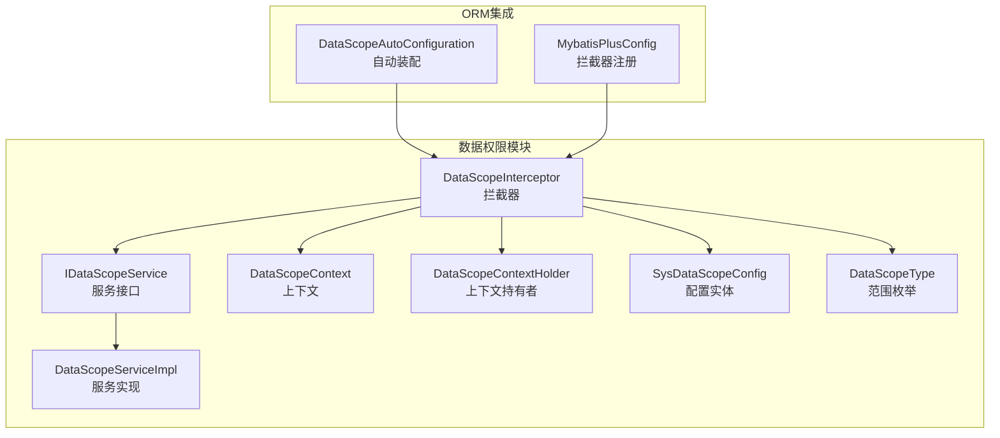
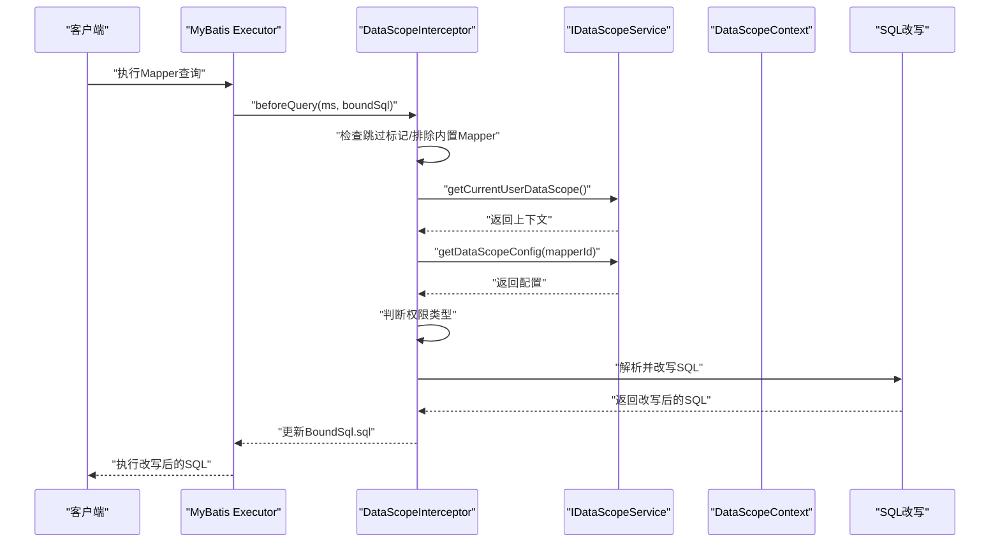
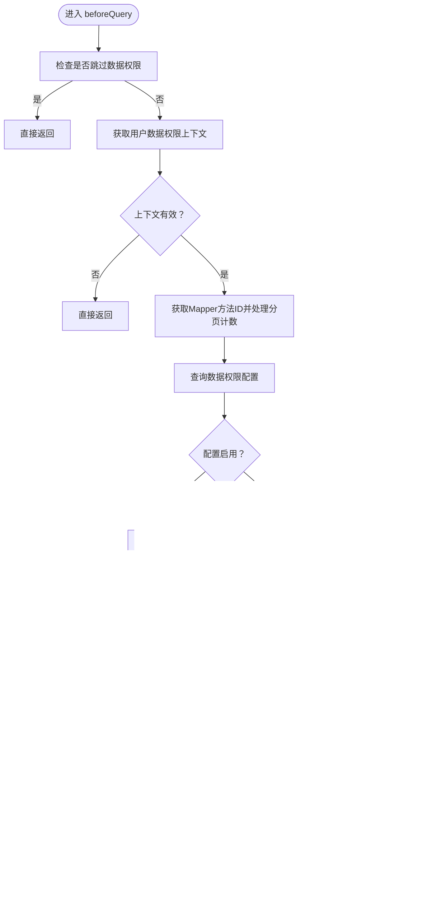
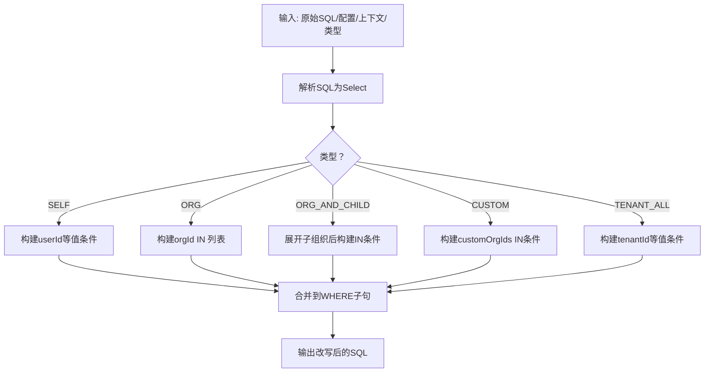
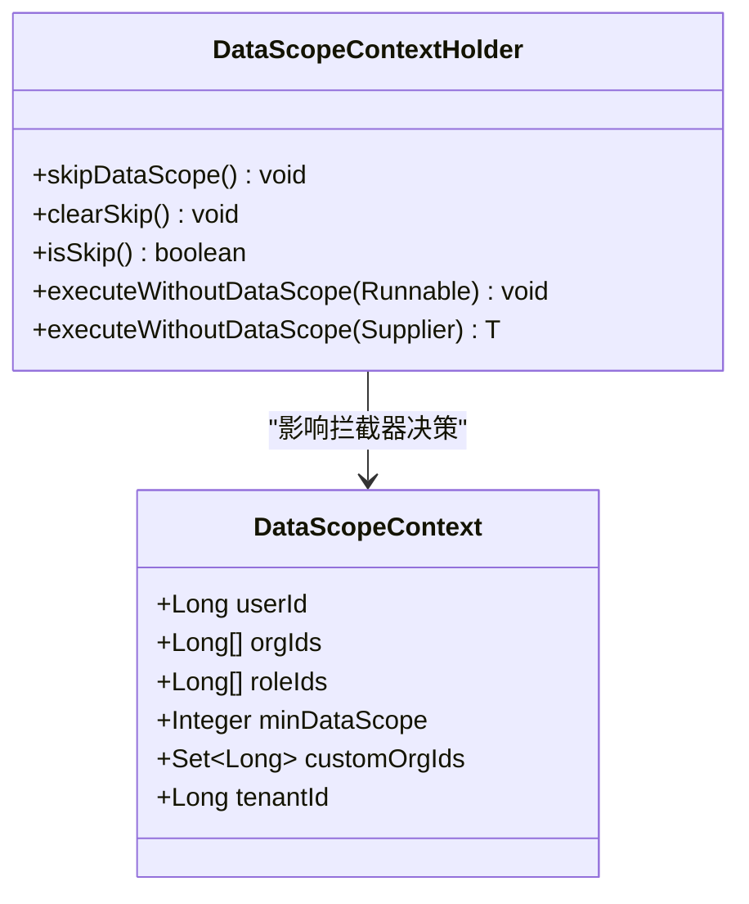
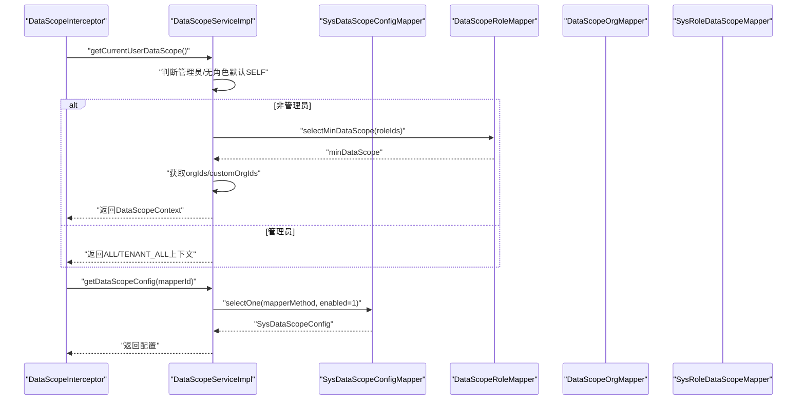
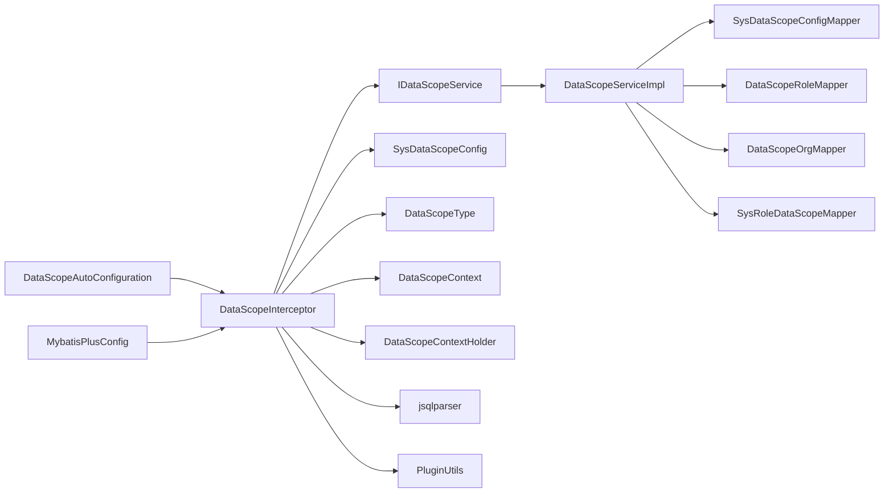

# 权限拦截器处理

<cite>
**本文引用的文件**
- [DataScopeInterceptor.java](file://forge/forge-framework/forge-starter-parent/forge-starter-datascope/src/main/java/com/mdframe/forge/starter/datascope/handler/DataScopeInterceptor.java)
- [DataScopeContext.java](file://forge/forge-framework/forge-starter-parent/forge-starter-datascope/src/main/java/com/mdframe/forge/starter/datascope/context/DataScopeContext.java)
- [DataScopeContextHolder.java](file://forge/forge-framework/forge-starter-parent/forge-starter-datascope/src/main/java/com/mdframe/forge/starter/datascope/context/DataScopeContextHolder.java)
- [IDataScopeService.java](file://forge/forge-framework/forge-starter-parent/forge-starter-datascope/src/main/java/com/mdframe/forge/starter/datascope/service/IDataScopeService.java)
- [DataScopeServiceImpl.java](file://forge/forge-framework/forge-starter-parent/forge-starter-datascope/src/main/java/com/mdframe/forge/starter/datascope/service/impl/DataScopeServiceImpl.java)
- [DataScopeAutoConfiguration.java](file://forge/forge-framework/forge-starter-parent/forge-starter-datascope/src/main/java/com/mdframe/forge/starter/datascope/config/DataScopeAutoConfiguration.java)
- [DataScopeProperties.java](file://forge/forge-framework/forge-starter-parent/forge-starter-datascope/src/main/java/com/mdframe/forge/starter/datascope/config/DataScopeProperties.java)
- [SysDataScopeConfig.java](file://forge/forge-framework/forge-starter-parent/forge-starter-datascope/src/main/java/com/mdframe/forge/starter/datascope/entity/SysDataScopeConfig.java)
- [DataScopeType.java](file://forge/forge-framework/forge-starter-parent/forge-starter-datascope/src/main/java/com/mdframe/forge/starter/datascope/enums/DataScopeType.java)
- [MybatisPlusConfig.java](file://forge/forge-framework/forge-starter-parent/forge-starter-orm/src/main/java/com/mdframe/forge/starter/orm/config/MybatisPlusConfig.java)
</cite>

## 目录
1. [简介](#简介)
2. [项目结构](#项目结构)
3. [核心组件](#核心组件)
4. [架构总览](#架构总览)
5. [详细组件分析](#详细组件分析)
6. [依赖关系分析](#依赖关系分析)
7. [性能考量](#性能考量)
8. [故障排查指南](#故障排查指南)
9. [结论](#结论)
10. [附录](#附录)

## 简介
本文面向Forge框架的数据权限拦截器处理机制，系统性解析DataScopeInterceptor拦截器的工作原理，覆盖SQL解析、权限判断、条件构建与SQL改写等核心流程；详解DataScopeContext与DataScopeContextHolder的上下文创建、传递与清理机制；并给出在分页查询、后台任务、异常处理等场景下的行为差异与策略。文末提供调试技巧与最佳实践，帮助开发者快速掌握拦截器内部工作机制。

## 项目结构
围绕数据权限拦截器的关键模块分布如下：
- handler：拦截器实现与调用链
- context：上下文模型与持有者
- service：权限服务接口与实现
- entity/enums：权限配置与范围枚举
- config：自动装配与属性配置
- orm：MyBatis-Plus拦截器注册入口

图表来源
- [DataScopeInterceptor.java](file://forge/forge-framework/forge-starter-parent/forge-starter-datascope/src/main/java/com/mdframe/forge/starter/datascope/handler/DataScopeInterceptor.java#L39-L117)
- [DataScopeServiceImpl.java](file://forge/forge-framework/forge-starter-parent/forge-starter-datascope/src/main/java/com/mdframe/forge/starter/datascope/service/impl/DataScopeServiceImpl.java#L27-L115)
- [DataScopeContext.java](file://forge/forge-framework/forge-starter-parent/forge-starter-datascope/src/main/java/com/mdframe/forge/starter/datascope/context/DataScopeContext.java#L16-L47)
- [DataScopeContextHolder.java](file://forge/forge-framework/forge-starter-parent/forge-starter-datascope/src/main/java/com/mdframe/forge/starter/datascope/context/DataScopeContextHolder.java#L7-L61)
- [SysDataScopeConfig.java](file://forge/forge-framework/forge-starter-parent/forge-starter-datascope/src/main/java/com/mdframe/forge/starter/datascope/entity/SysDataScopeConfig.java#L16-L84)
- [DataScopeType.java](file://forge/forge-framework/forge-starter-parent/forge-starter-datascope/src/main/java/com/mdframe/forge/starter/datascope/enums/DataScopeType.java#L11-L60)
- [MybatisPlusConfig.java](file://forge/forge-framework/forge-starter-parent/forge-starter-orm/src/main/java/com/mdframe/forge/starter/orm/config/MybatisPlusConfig.java#L38-L59)
- [DataScopeAutoConfiguration.java](file://forge/forge-framework/forge-starter-parent/forge-starter-datascope/src/main/java/com/mdframe/forge/starter/datascope/config/DataScopeAutoConfiguration.java#L27-L37)

章节来源
- [DataScopeInterceptor.java](file://forge/forge-framework/forge-starter-parent/forge-starter-datascope/src/main/java/com/mdframe/forge/starter/datascope/handler/DataScopeInterceptor.java#L39-L117)
- [DataScopeAutoConfiguration.java](file://forge/forge-framework/forge-starter-parent/forge-starter-datascope/src/main/java/com/mdframe/forge/starter/datascope/config/DataScopeAutoConfiguration.java#L27-L37)
- [MybatisPlusConfig.java](file://forge/forge-framework/forge-starter-parent/forge-starter-orm/src/main/java/com/mdframe/forge/starter/orm/config/MybatisPlusConfig.java#L38-L59)

## 核心组件
- DataScopeInterceptor：基于MyBatis-Plus InnerInterceptor的查询前拦截器，负责识别Mapper方法、获取用户数据权限上下文、查询权限配置、判断权限类型，并对SQL进行条件改写。
- DataScopeContext：封装当前用户的权限上下文，包括用户ID、组织ID列表、角色ID列表、最小权限范围、自定义组织集合、租户ID等。
- DataScopeContextHolder：线程本地存储的“跳过标记”，用于后台任务等场景临时关闭数据权限控制。
- IDataScopeService/DataScopeServiceImpl：提供当前用户上下文获取、权限配置查询、组织树展开、缓存管理等能力。
- SysDataScopeConfig：数据权限配置实体，描述Mapper方法、表别名、字段列配置（支持简单字段与复杂SQL表达式）与启用状态。
- DataScopeType：权限范围枚举，涵盖全部、本人、本组织、本组织及子组织、自定义、租户全部等。
- MybatisPlusConfig：统一注册拦截器的入口，将各模块提供的InnerInterceptor按顺序加入MyBatis-Plus拦截器链。

章节来源
- [DataScopeInterceptor.java](file://forge/forge-framework/forge-starter-parent/forge-starter-datascope/src/main/java/com/mdframe/forge/starter/datascope/handler/DataScopeInterceptor.java#L39-L117)
- [DataScopeContext.java](file://forge/forge-framework/forge-starter-parent/forge-starter-datascope/src/main/java/com/mdframe/forge/starter/datascope/context/DataScopeContext.java#L16-L47)
- [DataScopeContextHolder.java](file://forge/forge-framework/forge-starter-parent/forge-starter-datascope/src/main/java/com/mdframe/forge/starter/datascope/context/DataScopeContextHolder.java#L7-L61)
- [IDataScopeService.java](file://forge/forge-framework/forge-starter-parent/forge-starter-datascope/src/main/java/com/mdframe/forge/starter/datascope/service/IDataScopeService.java#L12-L41)
- [DataScopeServiceImpl.java](file://forge/forge-framework/forge-starter-parent/forge-starter-datascope/src/main/java/com/mdframe/forge/starter/datascope/service/impl/DataScopeServiceImpl.java#L27-L115)
- [SysDataScopeConfig.java](file://forge/forge-framework/forge-starter-parent/forge-starter-datascope/src/main/java/com/mdframe/forge/starter/datascope/entity/SysDataScopeConfig.java#L16-L84)
- [DataScopeType.java](file://forge/forge-framework/forge-starter-parent/forge-starter-datascope/src/main/java/com/mdframe/forge/starter/datascope/enums/DataScopeType.java#L11-L60)
- [MybatisPlusConfig.java](file://forge/forge-framework/forge-starter-parent/forge-starter-orm/src/main/java/com/mdframe/forge/starter/orm/config/MybatisPlusConfig.java#L38-L59)

## 架构总览
下图展示数据权限拦截器在ORM执行链中的位置与交互：

图表来源
- [DataScopeInterceptor.java](file://forge/forge-framework/forge-starter-parent/forge-starter-datascope/src/main/java/com/mdframe/forge/starter/datascope/handler/DataScopeInterceptor.java#L41-L117)
- [IDataScopeService.java](file://forge/forge-framework/forge-starter-parent/forge-starter-datascope/src/main/java/com/mdframe/forge/starter/datascope/service/IDataScopeService.java#L12-L41)
- [DataScopeServiceImpl.java](file://forge/forge-framework/forge-starter-parent/forge-starter-datascope/src/main/java/com/mdframe/forge/starter/datascope/service/impl/DataScopeServiceImpl.java#L50-L115)
- [MybatisPlusConfig.java](file://forge/forge-framework/forge-starter-parent/forge-starter-orm/src/main/java/com/mdframe/forge/starter/orm/config/MybatisPlusConfig.java#L38-L59)

## 详细组件分析

### DataScopeInterceptor：拦截器主流程
- 生命周期钩子：实现MyBatis-Plus InnerInterceptor的beforeQuery，在SQL执行前介入。
- 跳过策略：若DataScopeContextHolder.isSkip()为真，则直接放行，适用于后台任务等场景。
- Mapper识别：获取MappedStatement.id，排除内置数据权限Mapper包，避免自引用。
- 上下文获取：通过SpringUtil获取IDataScopeService，调用getCurrentUserDataScope()。
- 分页兼容：对以“_mpCount”或“_COUNT”结尾的方法名，去掉后缀回退到原方法名查询配置。
- 配置查询与启用校验：根据mapperId查询SysDataScopeConfig，仅当enabled为1时生效。
- 权限类型判定：依据DataScopeContext.minDataScope映射到DataScopeType，ALL类型直接放行。
- SQL改写：解析原始SQL为Select语句，构造数据权限条件并合并到WHERE子句，最后通过PluginUtils反射更新BoundSql。

图表来源
- [DataScopeInterceptor.java](file://forge/forge-framework/forge-starter-parent/forge-starter-datascope/src/main/java/com/mdframe/forge/starter/datascope/handler/DataScopeInterceptor.java#L41-L117)

章节来源
- [DataScopeInterceptor.java](file://forge/forge-framework/forge-starter-parent/forge-starter-datascope/src/main/java/com/mdframe/forge/starter/datascope/handler/DataScopeInterceptor.java#L41-L117)

### SQL解析与条件构建
- SQL解析：使用jsqlparser解析原始SQL，仅对Select语句进行处理。
- 条件构建：根据DataScopeType选择不同策略：
  - SELF：userId字段等值匹配。
  - ORG：orgId字段IN列表（用户所在组织）。
  - ORG_AND_CHILD：orgId字段IN列表（用户所在组织+子组织）。
  - CUSTOM：orgId字段IN列表（自定义组织集合）。
  - TENANT_ALL：tenantId字段等值匹配。
- 复杂SQL支持：当配置字段为“<sql>”开头时，替换占位符后解析为条件表达式。
- 合并策略：若原SQL已有WHERE，使用AND连接；否则直接设置。

图表来源
- [DataScopeInterceptor.java](file://forge/forge-framework/forge-starter-parent/forge-starter-datascope/src/main/java/com/mdframe/forge/starter/datascope/handler/DataScopeInterceptor.java#L122-L156)
- [DataScopeInterceptor.java](file://forge/forge-framework/forge-starter-parent/forge-starter-datascope/src/main/java/com/mdframe/forge/starter/datascope/handler/DataScopeInterceptor.java#L161-L209)
- [DataScopeInterceptor.java](file://forge/forge-framework/forge-starter-parent/forge-starter-datascope/src/main/java/com/mdframe/forge/starter/datascope/handler/DataScopeInterceptor.java#L221-L260)
- [DataScopeInterceptor.java](file://forge/forge-framework/forge-starter-parent/forge-starter-datascope/src/main/java/com/mdframe/forge/starter/datascope/handler/DataScopeInterceptor.java#L265-L314)

章节来源
- [DataScopeInterceptor.java](file://forge/forge-framework/forge-starter-parent/forge-starter-datascope/src/main/java/com/mdframe/forge/starter/datascope/handler/DataScopeInterceptor.java#L122-L156)
- [DataScopeInterceptor.java](file://forge/forge-framework/forge-starter-parent/forge-starter-datascope/src/main/java/com/mdframe/forge/starter/datascope/handler/DataScopeInterceptor.java#L161-L209)
- [DataScopeInterceptor.java](file://forge/forge-framework/forge-starter-parent/forge-starter-datascope/src/main/java/com/mdframe/forge/starter/datascope/handler/DataScopeInterceptor.java#L221-L260)
- [DataScopeInterceptor.java](file://forge/forge-framework/forge-starter-parent/forge-starter-datascope/src/main/java/com/mdframe/forge/starter/datascope/handler/DataScopeInterceptor.java#L265-L314)

### DataScopeContext 与 DataScopeContextHolder：上下文机制
- DataScopeContext：承载用户权限上下文，包含userId、orgIds、roleIds、minDataScope、customOrgIds、tenantId等关键字段。
- DataScopeContextHolder：
  - 提供skipDataScope()/clearSkip()/isSkip()用于控制是否跳过数据权限。
  - 提供executeWithoutDataScope()工具方法，确保在Runnable/Supplier执行期间临时开启跳过标记并在finally中清理。

图表来源
- [DataScopeContext.java](file://forge/forge-framework/forge-starter-parent/forge-starter-datascope/src/main/java/com/mdframe/forge/starter/datascope/context/DataScopeContext.java#L16-L47)
- [DataScopeContextHolder.java](file://forge/forge-framework/forge-starter-parent/forge-starter-datascope/src/main/java/com/mdframe/forge/starter/datascope/context/DataScopeContextHolder.java#L7-L61)

章节来源
- [DataScopeContext.java](file://forge/forge-framework/forge-starter-parent/forge-starter-datascope/src/main/java/com/mdframe/forge/starter/datascope/context/DataScopeContext.java#L16-L47)
- [DataScopeContextHolder.java](file://forge/forge-framework/forge-starter-parent/forge-starter-datascope/src/main/java/com/mdframe/forge/starter/datascope/context/DataScopeContextHolder.java#L7-L61)

### IDataScopeService 与 DataScopeServiceImpl：权限服务
- 当前用户上下文：优先判断是否登录，超级管理员返回ALL，租户管理员返回TENANT_ALL；否则查询最小权限范围、组织列表与自定义组织集合。
- 配置缓存：以mapperMethod为key缓存SysDataScopeConfig，提升查询性能。
- 组织树展开：以orgIds为key缓存“自身+子组织”集合，减少重复查询。
- 缓存刷新：提供refreshDataScopeCache()接口，清空配置与组织缓存。

图表来源
- [DataScopeServiceImpl.java](file://forge/forge-framework/forge-starter-parent/forge-starter-datascope/src/main/java/com/mdframe/forge/starter/datascope/service/impl/DataScopeServiceImpl.java#L50-L115)
- [DataScopeServiceImpl.java](file://forge/forge-framework/forge-starter-parent/forge-starter-datascope/src/main/java/com/mdframe/forge/starter/datascope/service/impl/DataScopeServiceImpl.java#L117-L138)
- [DataScopeServiceImpl.java](file://forge/forge-framework/forge-starter-parent/forge-starter-datascope/src/main/java/com/mdframe/forge/starter/datascope/service/impl/DataScopeServiceImpl.java#L140-L168)

章节来源
- [IDataScopeService.java](file://forge/forge-framework/forge-starter-parent/forge-starter-datascope/src/main/java/com/mdframe/forge/starter/datascope/service/IDataScopeService.java#L12-L41)
- [DataScopeServiceImpl.java](file://forge/forge-framework/forge-starter-parent/forge-starter-datascope/src/main/java/com/mdframe/forge/starter/datascope/service/impl/DataScopeServiceImpl.java#L50-L115)
- [DataScopeServiceImpl.java](file://forge/forge-framework/forge-starter-parent/forge-starter-datascope/src/main/java/com/mdframe/forge/starter/datascope/service/impl/DataScopeServiceImpl.java#L117-L138)
- [DataScopeServiceImpl.java](file://forge/forge-framework/forge-starter-parent/forge-starter-datascope/src/main/java/com/mdframe/forge/starter/datascope/service/impl/DataScopeServiceImpl.java#L140-L168)

### 配置与注册：自动装配与ORM集成
- DataScopeAutoConfiguration：条件启用（默认true），扫描数据权限包与Mapper，暴露DataScopeInterceptor Bean。
- MybatisPlusConfig：自动注入List<InnerInterceptor>，将各模块拦截器按顺序注册到MyBatis-Plus拦截器链中，保证数据权限拦截器最高优先级。

章节来源
- [DataScopeAutoConfiguration.java](file://forge/forge-framework/forge-starter-parent/forge-starter-datascope/src/main/java/com/mdframe/forge/starter/datascope/config/DataScopeAutoConfiguration.java#L27-L37)
- [MybatisPlusConfig.java](file://forge/forge-framework/forge-starter-parent/forge-starter-orm/src/main/java/com/mdframe/forge/starter/orm/config/MybatisPlusConfig.java#L38-L59)

## 依赖关系分析
- 拦截器依赖：IDataScopeService（获取上下文与配置）、SysDataScopeConfig（配置模型）、DataScopeType（权限类型）、DataScopeContextHolder（跳过标记）、jsqlparser（SQL解析）、PluginUtils（BoundSql反射改写）。
- 服务实现依赖：多个Mapper（角色、组织、角色数据权限），Caffeine缓存，Sa-Token会话。
- 注册依赖：MyBatis-Plus拦截器链，确保拦截器顺序与ORM生命周期一致。

图表来源
- [DataScopeInterceptor.java](file://forge/forge-framework/forge-starter-parent/forge-starter-datascope/src/main/java/com/mdframe/forge/starter/datascope/handler/DataScopeInterceptor.java#L3-L33)
- [DataScopeServiceImpl.java](file://forge/forge-framework/forge-starter-parent/forge-starter-datascope/src/main/java/com/mdframe/forge/starter/datascope/service/impl/DataScopeServiceImpl.java#L29-L32)
- [DataScopeAutoConfiguration.java](file://forge/forge-framework/forge-starter-parent/forge-starter-datascope/src/main/java/com/mdframe/forge/starter/datascope/config/DataScopeAutoConfiguration.java#L27-L37)
- [MybatisPlusConfig.java](file://forge/forge-framework/forge-starter-parent/forge-starter-orm/src/main/java/com/mdframe/forge/starter/orm/config/MybatisPlusConfig.java#L38-L59)

章节来源
- [DataScopeInterceptor.java](file://forge/forge-framework/forge-starter-parent/forge-starter-datascope/src/main/java/com/mdframe/forge/starter/datascope/handler/DataScopeInterceptor.java#L3-L33)
- [DataScopeServiceImpl.java](file://forge/forge-framework/forge-starter-parent/forge-starter-datascope/src/main/java/com/mdframe/forge/starter/datascope/service/impl/DataScopeServiceImpl.java#L29-L32)
- [DataScopeAutoConfiguration.java](file://forge/forge-framework/forge-starter-parent/forge-starter-datascope/src/main/java/com/mdframe/forge/starter/datascope/config/DataScopeAutoConfiguration.java#L27-L37)
- [MybatisPlusConfig.java](file://forge/forge-framework/forge-starter-parent/forge-starter-orm/src/main/java/com/mdframe/forge/starter/orm/config/MybatisPlusConfig.java#L38-L59)

## 性能考量
- 缓存策略：
  - 配置缓存：以mapperMethod为key，30分钟过期，命中率高。
  - 组织树缓存：以排序后的orgIds字符串为key，10分钟过期，降低重复展开成本。
- SQL解析与反射：
  - 仅对Select语句处理，非Select直接放行。
  - 通过jsqlparser解析与重写，避免正则拼接带来的脆弱性。
- 优先级与注册：
  - 数据权限拦截器最高优先级，确保在分页与乐观锁之前执行，减少重复改写。

章节来源
- [DataScopeServiceImpl.java](file://forge/forge-framework/forge-starter-parent/forge-starter-datascope/src/main/java/com/mdframe/forge/starter/datascope/service/impl/DataScopeServiceImpl.java#L37-L48)
- [DataScopeServiceImpl.java](file://forge/forge-framework/forge-starter-parent/forge-starter-datascope/src/main/java/com/mdframe/forge/starter/datascope/service/impl/DataScopeServiceImpl.java#L140-L168)
- [DataScopeAutoConfiguration.java](file://forge/forge-framework/forge-starter-parent/forge-starter-datascope/src/main/java/com/mdframe/forge/starter/datascope/config/DataScopeAutoConfiguration.java#L21-L21)
- [MybatisPlusConfig.java](file://forge/forge-framework/forge-starter-parent/forge-starter-orm/src/main/java/com/mdframe/forge/starter/orm/config/MybatisPlusConfig.java#L38-L59)

## 故障排查指南
- 未生效场景
  - 检查DataScopeContextHolder是否设置了跳过标记（后台任务场景）。
  - 排除内置Mapper包路径，确认mapperId正确。
  - 确认SysDataScopeConfig.enabled为1且配置存在。
- 权限类型异常
  - minDataScope映射不到DataScopeType时会直接放行，需核对角色最小权限计算逻辑。
- SQL改写失败
  - 拦截器捕获异常并记录错误日志，检查原始SQL与配置字段是否合法。
- 复杂SQL占位符
  - 确保配置字段以“<sql>”开头并正确使用#{userId}、#{tenantId}、#{orgIds}、#{customOrgIds}占位符。
- 缓存问题
  - 变更权限配置后，调用refreshDataScopeCache()刷新缓存。

章节来源
- [DataScopeInterceptor.java](file://forge/forge-framework/forge-starter-parent/forge-starter-datascope/src/main/java/com/mdframe/forge/starter/datascope/handler/DataScopeInterceptor.java#L45-L49)
- [DataScopeInterceptor.java](file://forge/forge-framework/forge-starter-parent/forge-starter-datascope/src/main/java/com/mdframe/forge/starter/datascope/handler/DataScopeInterceptor.java#L82-L87)
- [DataScopeInterceptor.java](file://forge/forge-framework/forge-starter-parent/forge-starter-datascope/src/main/java/com/mdframe/forge/starter/datascope/handler/DataScopeInterceptor.java#L90-L94)
- [DataScopeInterceptor.java](file://forge/forge-framework/forge-starter-parent/forge-starter-datascope/src/main/java/com/mdframe/forge/starter/datascope/handler/DataScopeInterceptor.java#L114-L116)
- [DataScopeServiceImpl.java](file://forge/forge-framework/forge-starter-parent/forge-starter-datascope/src/main/java/com/mdframe/forge/starter/datascope/service/impl/DataScopeServiceImpl.java#L170-L175)

## 结论
DataScopeInterceptor通过“上下文获取—配置查询—类型判定—SQL改写”的闭环流程，实现了对MyBatis-Plus查询的细粒度权限控制。配合DataScopeContextHolder的线程本地跳过机制、IDataScopeService的缓存与组织树展开能力，以及MyBatis-Plus拦截器链的有序注册，形成了稳定、可扩展且高性能的数据权限体系。开发者在配置与调试时应重点关注mapperId命名规范、配置字段合法性与缓存刷新策略。

## 附录
- 配置项
  - forge.datascope.enabled：是否启用数据权限控制（默认true）
  - forge.datascope.printSql：是否打印SQL改写日志（默认false）

章节来源
- [DataScopeProperties.java](file://forge/forge-framework/forge-starter-parent/forge-starter-datascope/src/main/java/com/mdframe/forge/starter/datascope/config/DataScopeProperties.java#L11-L22)