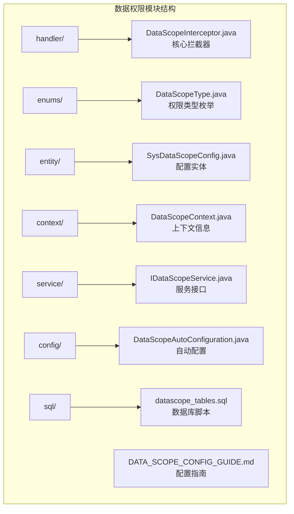
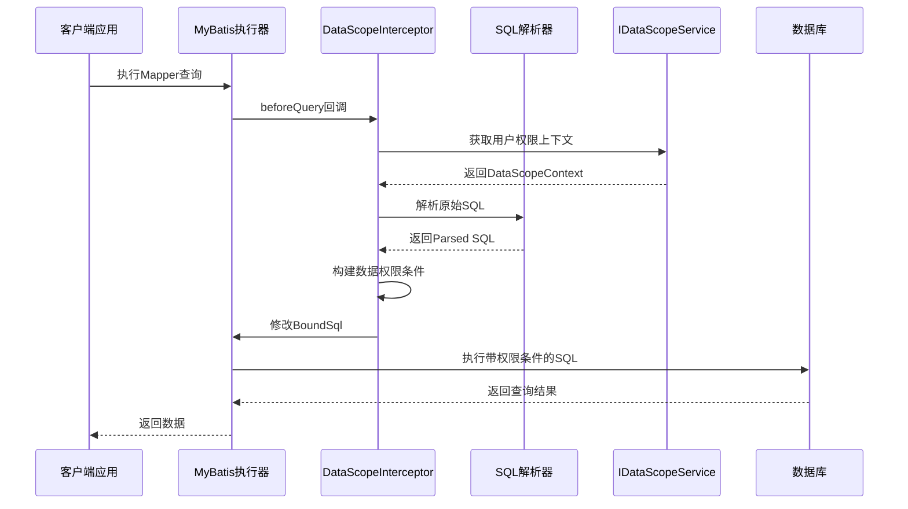
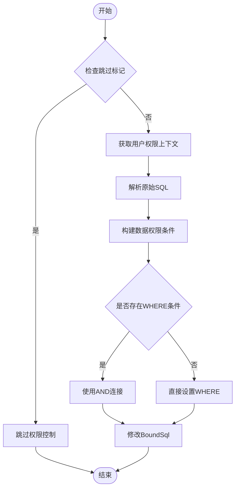
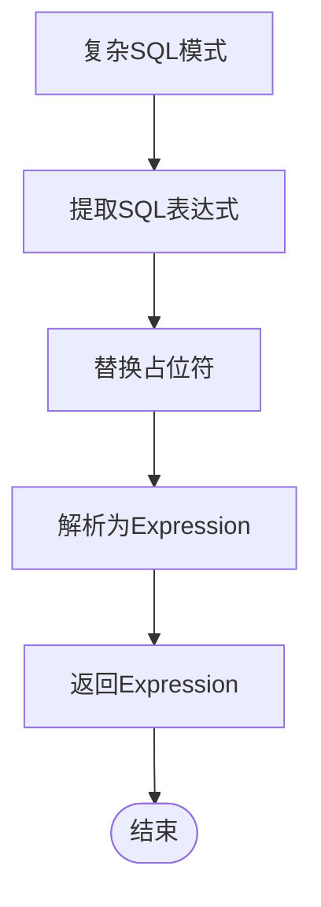
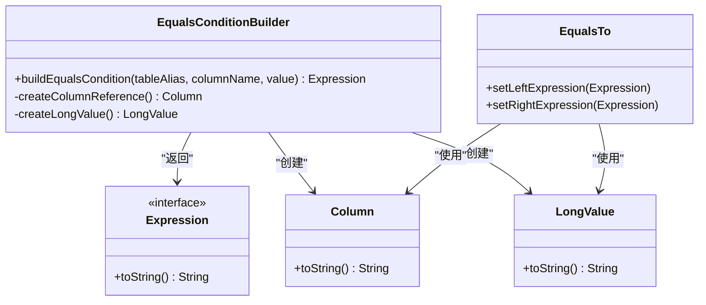
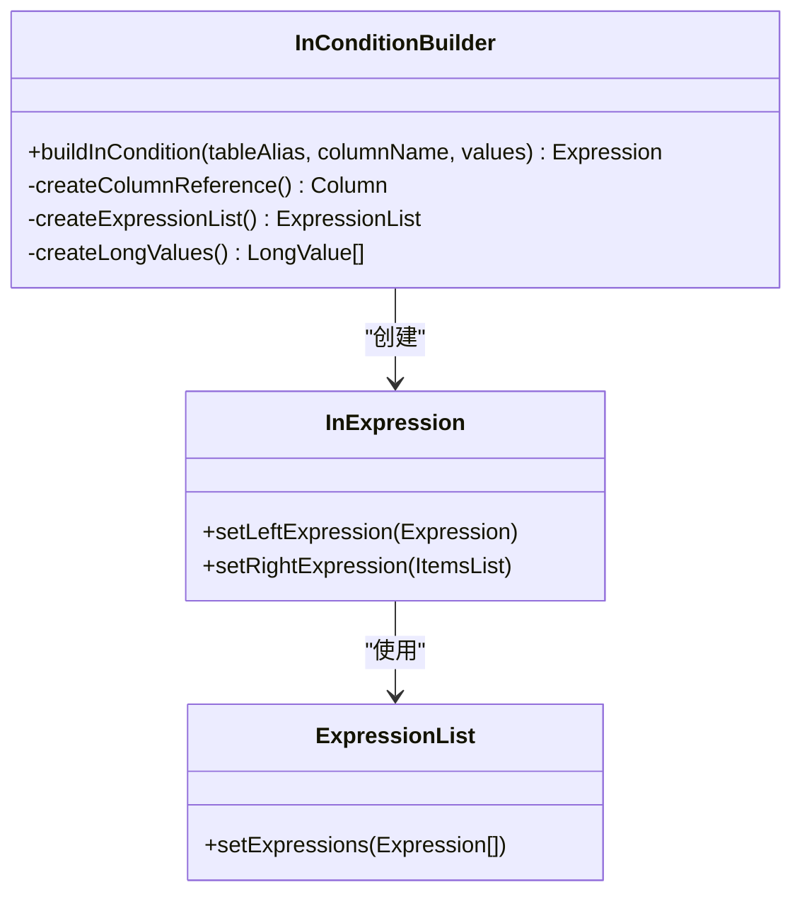
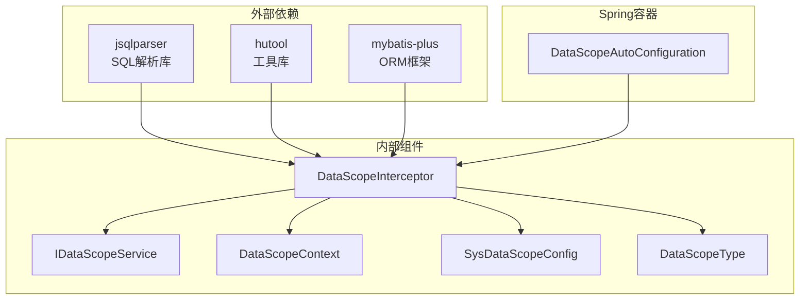

# 权限条件构建器

<cite>
**本文档引用的文件**
- [DataScopeInterceptor.java](file://forge/forge-framework/forge-starter-parent/forge-starter-datascope/src/main/java/com/mdframe/forge/starter/datascope/handler/DataScopeInterceptor.java)
- [DataScopeType.java](file://forge/forge-framework/forge-starter-parent/forge-starter-datascope/src/main/java/com/mdframe/forge/starter/datascope/enums/DataScopeType.java)
- [SysDataScopeConfig.java](file://forge/forge-framework/forge-starter-parent/forge-starter-datascope/src/main/java/com/mdframe/forge/starter/datascope/entity/SysDataScopeConfig.java)
- [DataScopeContext.java](file://forge/forge-framework/forge-starter-parent/forge-starter-datascope/src/main/java/com/mdframe/forge/starter/datascope/context/DataScopeContext.java)
- [IDataScopeService.java](file://forge/forge-framework/forge-starter-parent/forge-starter-datascope/src/main/java/com/mdframe/forge/starter/datascope/service/IDataScopeService.java)
- [DataScopeAutoConfiguration.java](file://forge/forge-framework/forge-starter-parent/forge-starter-datascope/src/main/java/com/mdframe/forge/starter/datascope/config/DataScopeAutoConfiguration.java)
- [datascope_tables.sql](file://forge/forge-framework/forge-starter-parent/forge-starter-datascope/sql/datascope_tables.sql)
- [DATA_SCOPE_CONFIG_GUIDE.md](file://forge/forge-framework/forge-starter-parent/forge-starter-datascope/DATA_SCOPE_CONFIG_GUIDE.md)
</cite>

## 目录
1. [简介](#简介)
2. [项目结构](#项目结构)
3. [核心组件](#核心组件)
4. [架构概览](#架构概览)
5. [详细组件分析](#详细组件分析)
6. [依赖关系分析](#依赖关系分析)
7. [性能考虑](#性能考虑)
8. [故障排除指南](#故障排除指南)
9. [结论](#结论)

## 简介

Forge框架的数据权限条件构建器是一个基于MyBatis Plus的拦截器，专门用于在SQL查询执行前动态构建数据权限条件。该系统支持多种数据权限类型，包括SELF（本人数据）、ORG（本组织）、ORG_AND_CHILD（本组织及子组织）、CUSTOM（自定义组织）、TENANT_ALL（租户全部）等，并提供了灵活的条件构建机制，既支持简单的字段匹配，也支持复杂的SQL表达式。

该拦截器通过解析原始SQL语句，根据用户的数据权限上下文和配置规则，在WHERE子句中动态添加适当的权限过滤条件，确保用户只能访问其有权访问的数据。

## 项目结构

Forge框架的数据权限模块位于`forge/forge-framework/forge-starter-parent/forge-starter-datascope`目录下，主要包含以下关键组件：



**图表来源**
- [DataScopeInterceptor.java](file://forge/forge-framework/forge-starter-parent/forge-starter-datascope/src/main/java/com/mdframe/forge/starter/datascope/handler/DataScopeInterceptor.java#L1-L350)
- [DataScopeType.java](file://forge/forge-framework/forge-starter-parent/forge-starter-datascope/src/main/java/com/mdframe/forge/starter/datascope/enums/DataScopeType.java#L1-L60)

**章节来源**
- [DataScopeInterceptor.java](file://forge/forge-framework/forge-starter-parent/forge-starter-datascope/src/main/java/com/mdframe/forge/starter/datascope/handler/DataScopeInterceptor.java#L1-L350)
- [DataScopeType.java](file://forge/forge-framework/forge-starter-parent/forge-starter-datascope/src/main/java/com/mdframe/forge/starter/datascope/enums/DataScopeType.java#L1-L60)

## 核心组件

### DataScopeInterceptor - 核心拦截器

DataScopeInterceptor是整个数据权限系统的核心组件，实现了MyBatis Plus的InnerInterceptor接口。它负责拦截SQL查询，解析原始SQL，构建数据权限条件，并将这些条件动态添加到WHERE子句中。

**主要职责**：
- 拦截MyBatis查询执行
- 获取用户数据权限上下文
- 解析SQL语句并构建权限条件
- 动态修改BoundSql中的SQL语句

### DataScopeType - 权限类型枚举

定义了所有支持的数据权限类型，每种类型都有对应的数值代码和描述：

| 权限类型 | 数值代码 | 描述 |
|---------|---------|------|
| ALL | 1 | 全部数据权限 |
| SELF | 2 | 本人数据权限 |
| ORG | 3 | 本组织数据权限 |
| ORG_AND_CHILD | 4 | 本组织及子组织数据权限 |
| CUSTOM | 5 | 自定义数据权限 |
| TENANT_ALL | 6 | 租户全部数据权限 |

### SysDataScopeConfig - 配置实体

数据权限配置的核心实体类，存储每个Mapper方法的数据权限规则：

**关键字段**：
- `mapperMethod`: Mapper方法的完整限定名
- `tableAlias`: 主表别名
- `userIdColumn`: 用户ID字段配置（支持简单字段或复杂SQL）
- `orgIdColumn`: 组织ID字段配置
- `tenantIdColumn`: 租户ID字段配置
- `enabled`: 是否启用配置

### DataScopeContext - 上下文信息

封装了当前用户的权限相关信息：

**核心属性**：
- `userId`: 当前用户ID
- `orgIds`: 用户所属组织ID列表
- `customOrgIds`: 自定义数据权限组织ID集合
- `tenantId`: 租户ID
- `minDataScope`: 最小数据权限范围

**章节来源**
- [DataScopeInterceptor.java](file://forge/forge-framework/forge-starter-parent/forge-starter-datascope/src/main/java/com/mdframe/forge/starter/datascope/handler/DataScopeInterceptor.java#L35-L350)
- [DataScopeType.java](file://forge/forge-framework/forge-starter-parent/forge-starter-datascope/src/main/java/com/mdframe/forge/starter/datascope/enums/DataScopeType.java#L1-L60)
- [SysDataScopeConfig.java](file://forge/forge-framework/forge-starter-parent/forge-starter-datascope/src/main/java/com/mdframe/forge/starter/datascope/entity/SysDataScopeConfig.java#L1-L63)
- [DataScopeContext.java](file://forge/forge-framework/forge-starter-parent/forge-starter-datascope/src/main/java/com/mdframe/forge/starter/datascope/context/DataScopeContext.java#L1-L47)

## 架构概览

数据权限条件构建器采用拦截器模式，与MyBatis Plus深度集成：



**图表来源**
- [DataScopeInterceptor.java](file://forge/forge-framework/forge-starter-parent/forge-starter-datascope/src/main/java/com/mdframe/forge/starter/datascope/handler/DataScopeInterceptor.java#L41-L117)
- [IDataScopeService.java](file://forge/forge-framework/forge-starter-parent/forge-starter-datascope/src/main/java/com/mdframe/forge/starter/datascope/service/IDataScopeService.java#L1-L42)

### 条件构建算法流程



**图表来源**
- [DataScopeInterceptor.java](file://forge/forge-framework/forge-starter-parent/forge-starter-datascope/src/main/java/com/mdframe/forge/starter/datascope/handler/DataScopeInterceptor.java#L122-L156)

**章节来源**
- [DataScopeInterceptor.java](file://forge/forge-framework/forge-starter-parent/forge-starter-datascope/src/main/java/com/mdframe/forge/starter/datascope/handler/DataScopeInterceptor.java#L1-L350)

## 详细组件分析

### buildDataScopeCondition 方法详解

这是数据权限条件构建的核心方法，根据不同的权限类型构建相应的WHERE条件表达式：

#### SELF（本人数据）权限类型

当权限类型为SELF时，系统会构建等值条件，将用户ID字段与当前用户ID进行比较：

```mermaid
flowchart TD
SELF[SELF权限类型] --> CheckUserId{检查userIdColumn}
CheckUserId --> |存在| BuildEquals[构建等值条件]
CheckUserId --> |不存在| ReturnNull[返回null]
BuildEquals --> EqualsExpr[userIdColumn = #{userId}]
ReturnNull --> End([结束])
EqualsExpr --> End
```

**图表来源**
- [DataScopeInterceptor.java](file://forge/forge-framework/forge-starter-parent/forge-starter-datascope/src/main/java/com/mdframe/forge/starter/datascope/handler/DataScopeInterceptor.java#L170-L174)

#### ORG（本组织）权限类型

ORG类型会检查用户的组织ID列表，如果存在则构建IN条件：

```mermaid
flowchart TD
ORG[ORG权限类型] --> CheckOrgIds{检查orgIds}
CheckOrgIds --> |为空| ReturnNull[返回null]
CheckOrgIds --> |不为空| BuildIn[构建IN条件]
BuildIn --> InExpr[orgIdColumn IN (#{orgIds})]
InExpr --> End([结束])
ReturnNull --> End
```

**图表来源**
- [DataScopeInterceptor.java](file://forge/forge-framework/forge-starter-parent/forge-starter-datascope/src/main/java/com/mdframe/forge/starter/datascope/handler/DataScopeInterceptor.java#L175-L180)

#### ORG_AND_CHILD（本组织及子组织）权限类型

此类型会调用IDataScopeService获取组织及其所有子组织的ID，然后构建IN条件：

```mermaid
flowchart TD
ORG_AND_CHILD[ORG_AND_CHILD权限类型] --> GetOrgIds[获取用户orgIds]
GetOrgIds --> CheckOrgIds{检查orgIds}
CheckOrgIds --> |为空| ReturnNull[返回null]
CheckOrgIds --> |不为空| CallService[调用getOrgAndChildIds]
CallService --> BuildIn[构建IN条件]
BuildIn --> InExpr[orgIdColumn IN (#{allOrgIds})]
InExpr --> End([结束])
ReturnNull --> End
```

**图表来源**
- [DataScopeInterceptor.java](file://forge/forge-framework/forge-starter-parent/forge-starter-datascope/src/main/java/com/mdframe/forge/starter/datascope/handler/DataScopeInterceptor.java#L182-L188)

#### CUSTOM（自定义组织）权限类型

CUSTOM类型使用用户自定义的组织ID集合：

```mermaid
flowchart TD
CUSTOM[CUSTOM权限类型] --> CheckCustomOrgIds{检查customOrgIds}
CheckCustomOrgIds --> |为空| ReturnNull[返回null]
CheckCustomOrgIds --> |不为空| BuildIn[构建IN条件]
BuildIn --> InExpr[orgIdColumn IN (#{customOrgIds})]
InExpr --> End([结束])
ReturnNull --> End
```

**图表来源**
- [DataScopeInterceptor.java](file://forge/forge-framework/forge-starter-parent/forge-starter-datascope/src/main/java/com/mdframe/forge/starter/datascope/handler/DataScopeInterceptor.java#L190-L195)

#### TENANT_ALL（租户全部）权限类型

TENANT_ALL类型会检查租户ID字段配置：

```mermaid
flowchart TD
TENANT_ALL[TENANT_ALL权限类型] --> CheckTenantIdColumn{检查tenantIdColumn}
CheckTenantIdColumn --> |为空| ReturnNull[返回null]
CheckTenantIdColumn --> |不为空| BuildEquals[构建等值条件]
BuildEquals --> EqualsExpr[tenantIdColumn = #{tenantId}]
EqualsExpr --> End([结束])
ReturnNull --> End
```

**图表来源**
- [DataScopeInterceptor.java](file://forge/forge-framework/forge-starter-parent/forge-starter-datascope/src/main/java/com/mdframe/forge/starter/datascope/handler/DataScopeInterceptor.java#L197-L202)

### buildColumnCondition 方法详解

buildColumnCondition方法负责处理字段条件的构建，支持简单字段和复杂SQL两种模式：

#### 简单字段模式

```mermaid
flowchart TD
SimpleField[简单字段模式] --> CheckConfig{检查columnConfig}
CheckConfig --> |为空| ReturnNull[返回null]
CheckConfig --> |不为空| CheckSqlTag{检查是否以<sql>开头}
CheckSqlTag --> |是| BuildCustomSql[构建自定义SQL条件]
CheckSqlTag --> |否| CheckOrgIds{检查orgIds}
CheckOrgIds --> |存在且非空| BuildIn[构建IN条件]
CheckOrgIds --> |不存在或为空| CheckCustomOrgIds{检查customOrgIds}
CheckCustomOrgIds --> |存在且非空| BuildIn2[构建IN条件]
CheckCustomOrgIds --> |不存在或为空| BuildEquals[构建等值条件]
BuildIn --> End([结束])
BuildIn2 --> End
BuildEquals --> End
BuildCustomSql --> End
ReturnNull --> End
```

当columnConfig不是以`<sql>`开头时，系统会根据传入的参数类型构建相应的条件：



**图表来源**
- [DataScopeInterceptor.java](file://forge/forge-framework/forge-starter-parent/forge-starter-datascope/src/main/java/com/mdframe/forge/starter/datascope/handler/DataScopeInterceptor.java#L221-L260)

#### 复杂SQL表达式模式

当columnConfig以`<sql>`开头时，系统会提取真实的SQL表达式并进行占位符替换：



**图表来源**
- [DataScopeInterceptor.java](file://forge/forge-framework/forge-starter-parent/forge-starter-datascope/src/main/java/com/mdframe/forge/starter/datascope/handler/DataScopeInterceptor.java#L227-L232)

### 占位符替换机制

复杂SQL表达式支持以下占位符：

| 占位符 | 说明 | 示例 |
|-------|------|------|
| `#{userId}` | 当前用户ID | `user_id = 123` |
| `#{tenantId}` | 当前租户ID | `tenant_id = 456` |
| `#{orgIds}` | 组织ID列表 | `org_id IN (1,2,3)` |
| `#{customOrgIds}` | 自定义组织ID集合 | `org_id IN (4,5,6)` |

占位符替换通过`replaceCustomSqlPlaceholders`方法完成，该方法会根据DataScopeContext中的实际值进行字符串替换。

**章节来源**
- [DataScopeInterceptor.java](file://forge/forge-framework/forge-starter-parent/forge-starter-datascope/src/main/java/com/mdframe/forge/starter/datascope/handler/DataScopeInterceptor.java#L161-L350)

### 条件表达式构建算法

系统提供了两个核心的条件表达式构建方法：

#### 等值条件构建（buildEqualsCondition）

等值条件用于SELF和TENANT_ALL权限类型，构建形如`column = value`的条件：



**图表来源**
- [DataScopeInterceptor.java](file://forge/forge-framework/forge-starter-parent/forge-starter-datascope/src/main/java/com/mdframe/forge/starter/datascope/handler/DataScopeInterceptor.java#L319-L325)

#### IN条件构建（buildInCondition）

IN条件用于ORG、ORG_AND_CHILD和CUSTOM权限类型，构建形如`column IN (values...)`的条件：



**图表来源**
- [DataScopeInterceptor.java](file://forge/forge-framework/forge-starter-parent/forge-starter-datascope/src/main/java/com/mdframe/forge/starter/datascope/handler/DataScopeInterceptor.java#L330-L348)

**章节来源**
- [DataScopeInterceptor.java](file://forge/forge-framework/forge-starter-parent/forge-starter-datascope/src/main/java/com/mdframe/forge/starter/datascope/handler/DataScopeInterceptor.java#L319-L348)

## 依赖关系分析

数据权限条件构建器的依赖关系如下：



**图表来源**
- [DataScopeInterceptor.java](file://forge/forge-framework/forge-starter-parent/forge-starter-datascope/src/main/java/com/mdframe/forge/starter/datascope/handler/DataScopeInterceptor.java#L1-L34)
- [DataScopeAutoConfiguration.java](file://forge/forge-framework/forge-starter-parent/forge-starter-datascope/src/main/java/com/mdframe/forge/starter/datascope/config/DataScopeAutoConfiguration.java#L1-L38)

### 关键依赖说明

1. **jsqlparser**: 用于解析和构建SQL表达式，支持复杂的SQL语法分析
2. **hutool**: 提供字符串处理和Spring上下文访问功能
3. **mybatis-plus**: 作为拦截器的基础框架，提供SQL拦截能力
4. **Spring容器**: 管理组件生命周期和依赖注入

**章节来源**
- [DataScopeInterceptor.java](file://forge/forge-framework/forge-starter-parent/forge-starter-datascope/src/main/java/com/mdframe/forge/starter/datascope/handler/DataScopeInterceptor.java#L1-L34)
- [DataScopeAutoConfiguration.java](file://forge/forge-framework/forge-starter-parent/forge-starter-datascope/src/main/java/com/mdframe/forge/starter/datascope/config/DataScopeAutoConfiguration.java#L1-L38)

## 性能考虑

### SQL解析性能

系统使用jsqlparser进行SQL解析，该库具有以下特点：
- 支持标准SQL语法解析
- 解析速度快，适合高频调用场景
- 内存占用相对较小

### 缓存策略

为了提高性能，系统采用了多层缓存机制：

1. **配置缓存**: 数据权限配置信息缓存在内存中
2. **组织树缓存**: 组织层级关系缓存
3. **用户权限缓存**: 用户权限上下文缓存

### 查询优化建议

1. **索引优化**: 确保用户ID、组织ID、租户ID字段上有适当索引
2. **SQL简化**: 尽量使用简单字段模式而非复杂SQL表达式
3. **批量查询**: 对于大量数据的权限过滤，考虑使用JOIN而非多次查询
4. **分页优化**: 结合分页查询，避免一次性加载过多数据

### 内存使用优化

- 使用StringBuilder进行字符串拼接
- 避免创建不必要的临时对象
- 及时释放大对象引用

## 故障排除指南

### 常见问题及解决方案

#### 问题1: 配置后权限控制不生效

**可能原因**:
- 数据权限配置未启用
- Mapper方法路径不正确
- 表别名与XML中定义不一致

**解决步骤**:
1. 检查`enabled`字段是否为1
2. 验证`mapperMethod`路径是否正确
3. 确认表别名与SQL中的别名一致

#### 问题2: 复杂SQL表达式解析失败

**可能原因**:
- SQL语法错误
- 占位符使用不当
- 字段名不存在

**解决步骤**:
1. 使用SQL验证工具检查语法
2. 确认占位符格式正确
3. 验证字段名在表中存在

#### 问题3: 性能问题

**可能原因**:
- 复杂SQL表达式影响查询性能
- 缺少必要的数据库索引
- 权限条件过于复杂

**优化方案**:
1. 简化复杂SQL表达式
2. 添加适当的数据库索引
3. 考虑使用简单字段模式

**章节来源**
- [DATA_SCOPE_CONFIG_GUIDE.md](file://forge/forge-framework/forge-starter-parent/forge-starter-datascope/DATA_SCOPE_CONFIG_GUIDE.md#L237-L244)

## 结论

Forge框架的数据权限条件构建器是一个设计精良、功能强大的权限控制组件。它通过以下特性提供了全面的数据权限解决方案：

### 核心优势

1. **灵活性**: 支持简单字段和复杂SQL两种模式，满足不同场景需求
2. **易用性**: 通过配置文件即可实现复杂的权限控制逻辑
3. **性能**: 采用多层缓存和优化的SQL构建算法
4. **扩展性**: 基于MyBatis Plus插件机制，易于扩展和定制

### 应用场景

- 多租户应用的数据隔离
- 组织架构敏感数据的权限控制
- 复杂业务规则的数据访问限制
- 合规性要求的数据权限管理

### 最佳实践

1. **合理选择权限类型**: 根据业务需求选择合适的权限类型
2. **优化SQL表达式**: 在保证功能的前提下尽量简化SQL
3. **完善索引设计**: 为权限相关字段建立适当的索引
4. **定期性能监控**: 监控权限控制对系统性能的影响

该组件为Forge框架提供了坚实的数据权限基础，能够有效保障系统的数据安全性和合规性。