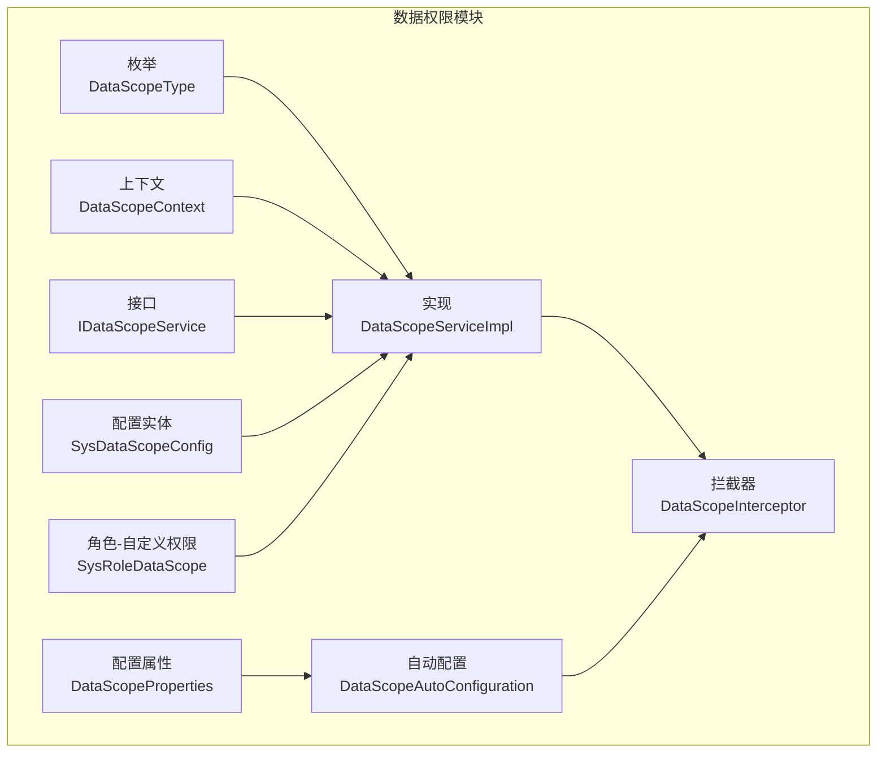
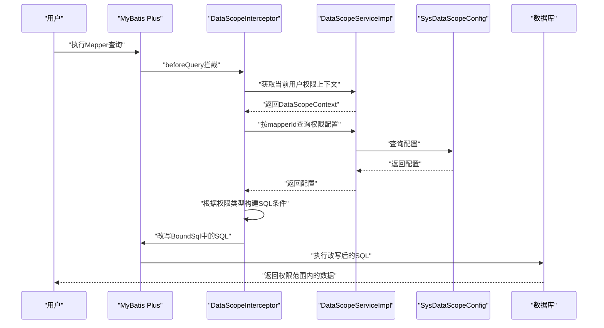
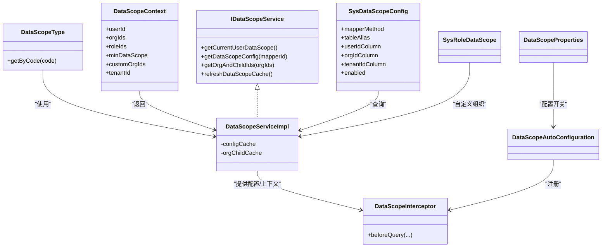

# 权限类型与范围

<cite>
**本文引用的文件**
- [DataScopeType.java](file://forge/forge-framework/forge-starter-parent/forge-starter-datascope/src/main/java/com/mdframe/forge/starter/datascope/enums/DataScopeType.java)
- [IDataScopeService.java](file://forge/forge-framework/forge-starter-parent/forge-starter-datascope/src/main/java/com/mdframe/forge/starter/datascope/service/IDataScopeService.java)
- [DataScopeServiceImpl.java](file://forge/forge-framework/forge-starter-parent/forge-starter-datascope/src/main/java/com/mdframe/forge/starter/datascope/service/impl/DataScopeServiceImpl.java)
- [DataScopeInterceptor.java](file://forge/forge-framework/forge-starter-parent/forge-starter-datascope/src/main/java/com/mdframe/forge/starter/datascope/handler/DataScopeInterceptor.java)
- [DataScopeContext.java](file://forge/forge-framework/forge-starter-parent/forge-starter-datascope/src/main/java/com/mdframe/forge/starter/datascope/context/DataScopeContext.java)
- [SysDataScopeConfig.java](file://forge/forge-framework/forge-starter-parent/forge-starter-datascope/src/main/java/com/mdframe/forge/starter/datascope/entity/SysDataScopeConfig.java)
- [SysRoleDataScope.java](file://forge/forge-framework/forge-starter-parent/forge-starter-datascope/src/main/java/com/mdframe/forge/starter/datascope/entity/SysRoleDataScope.java)
- [DataScopeAutoConfiguration.java](file://forge/forge-framework/forge-starter-parent/forge-starter-datascope/src/main/java/com/mdframe/forge/starter/datascope/config/DataScopeAutoConfiguration.java)
- [DataScopeProperties.java](file://forge/forge-framework/forge-starter-parent/forge-starter-datascope/src/main/java/com/mdframe/forge/starter/datascope/config/DataScopeProperties.java)
- [DATA_SCOPE_CONFIG_GUIDE.md](file://forge/forge-framework/forge-starter-parent/forge-starter-datascope/DATA_SCOPE_CONFIG_GUIDE.md)
- [datascope_tables.sql](file://forge/forge-framework/forge-starter-parent/forge-starter-datascope/sql/datascope_tables.sql)
</cite>

## 目录
1. [简介](#简介)
2. [项目结构](#项目结构)
3. [核心组件](#核心组件)
4. [架构总览](#架构总览)
5. [详细组件分析](#详细组件分析)
6. [依赖关系分析](#依赖关系分析)
7. [性能考量](#性能考量)
8. [故障排查指南](#故障排查指南)
9. [结论](#结论)
10. [附录](#附录)

## 简介
本文件面向Forge框架的数据权限类型与范围控制，系统性阐述DataScopeType枚举所定义的权限类型（全部、本人、本组织、本组织及子组织、自定义、租户全部），并结合拦截器、服务层、上下文与配置实体，完整说明权限计算逻辑、SQL条件生成规则、权限继承与优先级、以及与用户组织架构、岗位设置、角色配置的关联关系。同时提供多种典型业务场景（部门、岗位、角色）的配置示例与最佳实践。

## 项目结构
数据权限模块位于forge/forge-framework/forge-starter-parent/forge-starter-datascope目录，主要由以下层次组成：
- 枚举与上下文：定义权限类型、封装用户权限上下文
- 服务与拦截器：负责权限上下文构建、配置缓存、SQL改写
- 实体与映射：数据权限配置、角色-自定义组织关联
- 自动装配与配置属性：开启/关闭、打印SQL等开关
- 配置指南与初始化SQL：提供配置说明与示例数据

图表来源
- [DataScopeType.java](file://forge/forge-framework/forge-starter-parent/forge-starter-datascope/src/main/java/com/mdframe/forge/starter/datascope/enums/DataScopeType.java#L1-L60)
- [DataScopeContext.java](file://forge/forge-framework/forge-starter-parent/forge-starter-datascope/src/main/java/com/mdframe/forge/starter/datascope/context/DataScopeContext.java#L1-L48)
- [IDataScopeService.java](file://forge/forge-framework/forge-starter-parent/forge-starter-datascope/src/main/java/com/mdframe/forge/starter/datascope/service/IDataScopeService.java#L1-L42)
- [DataScopeServiceImpl.java](file://forge/forge-framework/forge-starter-parent/forge-starter-datascope/src/main/java/com/mdframe/forge/starter/datascope/service/impl/DataScopeServiceImpl.java#L1-L177)
- [DataScopeInterceptor.java](file://forge/forge-framework/forge-starter-parent/forge-starter-datascope/src/main/java/com/mdframe/forge/starter/datascope/handler/DataScopeInterceptor.java#L1-L350)
- [SysDataScopeConfig.java](file://forge/forge-framework/forge-starter-parent/forge-starter-datascope/src/main/java/com/mdframe/forge/starter/datascope/entity/SysDataScopeConfig.java#L1-L85)
- [SysRoleDataScope.java](file://forge/forge-framework/forge-starter-parent/forge-starter-datascope/src/main/java/com/mdframe/forge/starter/datascope/entity/SysRoleDataScope.java#L1-L46)
- [DataScopeAutoConfiguration.java](file://forge/forge-framework/forge-starter-parent/forge-starter-datascope/src/main/java/com/mdframe/forge/starter/datascope/config/DataScopeAutoConfiguration.java#L1-L39)
- [DataScopeProperties.java](file://forge/forge-framework/forge-starter-parent/forge-starter-datascope/src/main/java/com/mdframe/forge/starter/datascope/config/DataScopeProperties.java#L1-L23)

章节来源
- [DataScopeAutoConfiguration.java](file://forge/forge-framework/forge-starter-parent/forge-starter-datascope/src/main/java/com/mdframe/forge/starter/datascope/config/DataScopeAutoConfiguration.java#L1-L39)
- [DATA_SCOPE_CONFIG_GUIDE.md](file://forge/forge-framework/forge-starter-parent/forge-starter-datascope/DATA_SCOPE_CONFIG_GUIDE.md#L1-L291)

## 核心组件
- DataScopeType：定义六种权限类型，提供按code获取枚举的方法
- DataScopeContext：封装当前用户的权限上下文（用户ID、组织ID列表、角色ID列表、最小权限范围、自定义组织ID集合、租户ID）
- IDataScopeService / DataScopeServiceImpl：提供当前用户权限上下文、按Mapper方法ID获取配置、组织及子组织ID集合、缓存刷新
- DataScopeInterceptor：基于MyBatis Plus拦截器，在SQL执行前动态改写WHERE条件，生成数据权限过滤条件
- SysDataScopeConfig：数据权限配置实体，支持简单字段与复杂SQL两种模式
- SysRoleDataScope：角色-自定义数据权限关联实体
- DataScopeAutoConfiguration / DataScopeProperties：自动装配与开关配置

章节来源
- [DataScopeType.java](file://forge/forge-framework/forge-starter-parent/forge-starter-datascope/src/main/java/com/mdframe/forge/starter/datascope/enums/DataScopeType.java#L1-L60)
- [DataScopeContext.java](file://forge/forge-framework/forge-starter-parent/forge-starter-datascope/src/main/java/com/mdframe/forge/starter/datascope/context/DataScopeContext.java#L1-L48)
- [IDataScopeService.java](file://forge/forge-framework/forge-starter-parent/forge-starter-datascope/src/main/java/com/mdframe/forge/starter/datascope/service/IDataScopeService.java#L1-L42)
- [DataScopeServiceImpl.java](file://forge/forge-framework/forge-starter-parent/forge-starter-datascope/src/main/java/com/mdframe/forge/starter/datascope/service/impl/DataScopeServiceImpl.java#L1-L177)
- [DataScopeInterceptor.java](file://forge/forge-framework/forge-starter-parent/forge-starter-datascope/src/main/java/com/mdframe/forge/starter/datascope/handler/DataScopeInterceptor.java#L1-L350)
- [SysDataScopeConfig.java](file://forge/forge-framework/forge-starter-parent/forge-starter-datascope/src/main/java/com/mdframe/forge/starter/datascope/entity/SysDataScopeConfig.java#L1-L85)
- [SysRoleDataScope.java](file://forge/forge-framework/forge-starter-parent/forge-starter-datascope/src/main/java/com/mdframe/forge/starter/datascope/entity/SysRoleDataScope.java#L1-L46)
- [DataScopeAutoConfiguration.java](file://forge/forge-framework/forge-starter-parent/forge-starter-datascope/src/main/java/com/mdframe/forge/starter/datascope/config/DataScopeAutoConfiguration.java#L1-L39)
- [DataScopeProperties.java](file://forge/forge-framework/forge-starter-parent/forge-starter-datascope/src/main/java/com/mdframe/forge/starter/datascope/config/DataScopeProperties.java#L1-L23)

## 架构总览
数据权限控制的整体流程如下：
- 用户发起Mapper查询请求
- 拦截器在beforeQuery阶段获取当前用户权限上下文
- 根据Mapper方法ID查询数据权限配置
- 基于权限类型与上下文构建SQL条件，并改写原SQL的WHERE子句
- 执行改写后的SQL，仅返回用户有权限的数据

图表来源
- [DataScopeInterceptor.java](file://forge/forge-framework/forge-starter-parent/forge-starter-datascope/src/main/java/com/mdframe/forge/starter/datascope/handler/DataScopeInterceptor.java#L41-L117)
- [DataScopeServiceImpl.java](file://forge/forge-framework/forge-starter-parent/forge-starter-datascope/src/main/java/com/mdframe/forge/starter/datascope/service/impl/DataScopeServiceImpl.java#L50-L138)
- [SysDataScopeConfig.java](file://forge/forge-framework/forge-starter-parent/forge-starter-datascope/src/main/java/com/mdframe/forge/starter/datascope/entity/SysDataScopeConfig.java#L1-L85)

## 详细组件分析

### DataScopeType权限类型详解
- 全部（ALL）：拥有系统内全部数据的访问权限，通常授予超级管理员
- 本人（SELF）：仅能访问与自身用户ID相关的数据
- 本组织（ORG）：仅能访问所属组织的直接数据
- 本组织及子组织（ORG_AND_CHILD）：可访问所属组织及其所有子组织的数据
- 自定义（CUSTOM）：由角色与“角色-自定义数据权限”关联表配置的特定组织集合
- 租户全部（TENANT_ALL）：在多租户场景下，可访问当前租户的所有数据（通常授予租户管理员）

权限继承与优先级：
- 服务层通过聚合用户所有角色的最小权限范围作为最终权限（数值越小权限越大）
- 若用户无角色，默认为本人（SELF）
- 超级管理员与租户管理员拥有最高权限，直接覆盖其他规则

章节来源
- [DataScopeType.java](file://forge/forge-framework/forge-starter-parent/forge-starter-datascope/src/main/java/com/mdframe/forge/starter/datascope/enums/DataScopeType.java#L11-L41)
- [DataScopeServiceImpl.java](file://forge/forge-framework/forge-starter-parent/forge-starter-datascope/src/main/java/com/mdframe/forge/starter/datascope/service/impl/DataScopeServiceImpl.java#L90-L94)

### 权限计算与SQL条件生成
拦截器根据权限类型与上下文生成SQL条件：
- 本人（SELF）：对用户ID字段生成等值条件
- 本组织（ORG）：对组织ID字段生成IN条件，值来自用户组织ID列表
- 本组织及子组织（ORG_AND_CHILD）：对组织ID字段生成IN条件，值来自“用户组织ID列表”的组织及子组织集合
- 自定义（CUSTOM）：对组织ID字段生成IN条件，值来自角色-自定义权限关联表的组织集合
- 租户全部（TENANT_ALL）：对租户ID字段生成等值条件
- 全部（ALL）：不改写SQL

复杂SQL模式：
- 配置字段支持以“<sql>”开头的复杂表达式，拦截器会替换占位符并解析为表达式
- 支持占位符：#{userId}、#{tenantId}、#{orgIds}、#{customOrgIds}

章节来源
- [DataScopeInterceptor.java](file://forge/forge-framework/forge-starter-parent/forge-starter-datascope/src/main/java/com/mdframe/forge/starter/datascope/handler/DataScopeInterceptor.java#L161-L209)
- [DataScopeInterceptor.java](file://forge/forge-framework/forge-starter-parent/forge-starter-datascope/src/main/java/com/mdframe/forge/starter/datascope/handler/DataScopeInterceptor.java#L221-L260)
- [DataScopeInterceptor.java](file://forge/forge-framework/forge-starter-parent/forge-starter-datascope/src/main/java/com/mdframe/forge/starter/datascope/handler/DataScopeInterceptor.java#L265-L314)
- [SysDataScopeConfig.java](file://forge/forge-framework/forge-starter-parent/forge-starter-datascope/src/main/java/com/mdframe/forge/starter/datascope/entity/SysDataScopeConfig.java#L54-L72)

### 上下文与缓存策略
- DataScopeContext包含用户ID、组织ID列表、角色ID列表、最小权限范围、自定义组织ID集合、租户ID
- 服务层提供缓存：
  - 配置缓存：按Mapper方法ID缓存权限配置
  - 组织及子组织缓存：按组织ID列表缓存展开集合
- 支持手动刷新缓存，保证配置变更即时生效

章节来源
- [DataScopeContext.java](file://forge/forge-framework/forge-starter-parent/forge-starter-datascope/src/main/java/com/mdframe/forge/starter/datascope/context/DataScopeContext.java#L16-L47)
- [DataScopeServiceImpl.java](file://forge/forge-framework/forge-starter-parent/forge-starter-datascope/src/main/java/com/mdframe/forge/starter/datascope/service/impl/DataScopeServiceImpl.java#L34-L48)
- [DataScopeServiceImpl.java](file://forge/forge-framework/forge-starter-parent/forge-starter-datascope/src/main/java/com/mdframe/forge/starter/datascope/service/impl/DataScopeServiceImpl.java#L170-L176)

### 配置实体与数据库结构
- SysDataScopeConfig：包含资源编码、资源名称、Mapper方法、表别名、用户ID字段、组织ID字段、租户ID字段、启用状态等
- SysRoleDataScope：角色与自定义组织的关联表
- 初始化SQL提供了四种典型配置示例：简单字段、复杂SQL（多角色OR）、复杂SQL（包含子查询）、混合配置

章节来源
- [SysDataScopeConfig.java](file://forge/forge-framework/forge-starter-parent/forge-starter-datascope/src/main/java/com/mdframe/forge/starter/datascope/entity/SysDataScopeConfig.java#L1-L85)
- [SysRoleDataScope.java](file://forge/forge-framework/forge-starter-parent/forge-starter-datascope/src/main/java/com/mdframe/forge/starter/datascope/entity/SysRoleDataScope.java#L1-L46)
- [datascope_tables.sql](file://forge/forge-framework/forge-starter-parent/forge-starter-datascope/sql/datascope_tables.sql#L1-L100)

### 权限类型与用户组织架构、岗位设置、角色配置的关联
- 用户组织架构：用户所属组织ID列表用于“本组织/本组织及子组织/自定义”三类权限
- 岗位设置：通过用户的角色ID列表参与最小权限范围计算
- 角色配置：角色与最小权限范围、角色-自定义组织关联共同决定最终权限

章节来源
- [DataScopeServiceImpl.java](file://forge/forge-framework/forge-starter-parent/forge-starter-datascope/src/main/java/com/mdframe/forge/starter/datascope/service/impl/DataScopeServiceImpl.java#L79-L114)
- [SysRoleDataScope.java](file://forge/forge-framework/forge-starter-parent/forge-starter-datascope/src/main/java/com/mdframe/forge/starter/datascope/entity/SysRoleDataScope.java#L16-L46)

### 配置示例与使用场景

#### 场景一：部门数据权限（本组织）
- 适用：仅允许用户查看所在部门的数据
- 配置要点：组织ID字段使用简单字段，权限类型选择“本组织”，表别名与Mapper XML一致
- 生成条件：组织ID字段 IN (用户组织ID列表)

章节来源
- [DATA_SCOPE_CONFIG_GUIDE.md](file://forge/forge-framework/forge-starter-parent/forge-starter-datascope/DATA_SCOPE_CONFIG_GUIDE.md#L143-L182)
- [SysDataScopeConfig.java](file://forge/forge-framework/forge-starter-parent/forge-starter-datascope/src/main/java/com/mdframe/forge/starter/datascope/entity/SysDataScopeConfig.java#L54-L72)

#### 场景二：岗位数据权限（本人）
- 适用：用户仅能查看与自身相关的数据
- 配置要点：用户ID字段使用简单字段，权限类型选择“本人”
- 生成条件：用户ID字段 = 当前用户ID

章节来源
- [DATA_SCOPE_CONFIG_GUIDE.md](file://forge/forge-framework/forge-starter-parent/forge-starter-datascope/DATA_SCOPE_CONFIG_GUIDE.md#L143-L162)
- [SysDataScopeConfig.java](file://forge/forge-framework/forge-starter-parent/forge-starter-datascope/src/main/java/com/mdframe/forge/starter/datascope/entity/SysDataScopeConfig.java#L54-L72)

#### 场景三：角色数据权限（自定义）
- 适用：用户仅能查看被授权的特定组织的数据
- 配置要点：权限类型选择“自定义”，并在角色-自定义组织表中配置授权组织
- 生成条件：组织ID字段 IN (角色授权的组织集合)

章节来源
- [SysRoleDataScope.java](file://forge/forge-framework/forge-starter-parent/forge-starter-datascope/src/main/java/com/mdframe/forge/starter/datascope/entity/SysRoleDataScope.java#L16-L46)
- [DataScopeServiceImpl.java](file://forge/forge-framework/forge-starter-parent/forge-starter-datascope/src/main/java/com/mdframe/forge/starter/datascope/service/impl/DataScopeServiceImpl.java#L99-L103)

#### 场景四：租户全部（多租户）
- 适用：租户管理员需要查看当前租户的所有数据
- 配置要点：权限类型选择“租户全部”，租户ID字段使用简单字段
- 生成条件：租户ID字段 = 当前租户ID

章节来源
- [DATA_SCOPE_CONFIG_GUIDE.md](file://forge/forge-framework/forge-starter-parent/forge-starter-datascope/DATA_SCOPE_CONFIG_GUIDE.md#L128-L142)
- [SysDataScopeConfig.java](file://forge/forge-framework/forge-starter-parent/forge-starter-datascope/src/main/java/com/mdframe/forge/starter/datascope/entity/SysDataScopeConfig.java#L54-L72)

#### 场景五：复杂权限（多角色OR/子查询）
- 适用：业务逻辑复杂，需要多条件组合或子查询
- 配置要点：用户ID字段/组织ID字段/租户ID字段使用复杂SQL模式，支持占位符
- 示例参考：初始化SQL中的法律案件查询与订单查询示例

章节来源
- [datascope_tables.sql](file://forge/forge-framework/forge-starter-parent/forge-starter-datascope/sql/datascope_tables.sql#L49-L82)
- [DATA_SCOPE_CONFIG_GUIDE.md](file://forge/forge-framework/forge-starter-parent/forge-starter-datascope/DATA_SCOPE_CONFIG_GUIDE.md#L96-L142)

## 依赖关系分析
- 拦截器依赖服务层获取上下文与配置
- 服务层依赖配置实体、角色与组织映射、缓存
- 自动配置类负责注册拦截器Bean，由MyBatis配置统一注入
- 配置属性控制模块开关与日志打印

图表来源
- [DataScopeType.java](file://forge/forge-framework/forge-starter-parent/forge-starter-datascope/src/main/java/com/mdframe/forge/starter/datascope/enums/DataScopeType.java#L1-L60)
- [DataScopeContext.java](file://forge/forge-framework/forge-starter-parent/forge-starter-datascope/src/main/java/com/mdframe/forge/starter/datascope/context/DataScopeContext.java#L1-L48)
- [IDataScopeService.java](file://forge/forge-framework/forge-starter-parent/forge-starter-datascope/src/main/java/com/mdframe/forge/starter/datascope/service/IDataScopeService.java#L1-L42)
- [DataScopeServiceImpl.java](file://forge/forge-framework/forge-starter-parent/forge-starter-datascope/src/main/java/com/mdframe/forge/starter/datascope/service/impl/DataScopeServiceImpl.java#L1-L177)
- [DataScopeInterceptor.java](file://forge/forge-framework/forge-starter-parent/forge-starter-datascope/src/main/java/com/mdframe/forge/starter/datascope/handler/DataScopeInterceptor.java#L1-L350)
- [SysDataScopeConfig.java](file://forge/forge-framework/forge-starter-parent/forge-starter-datascope/src/main/java/com/mdframe/forge/starter/datascope/entity/SysDataScopeConfig.java#L1-L85)
- [SysRoleDataScope.java](file://forge/forge-framework/forge-starter-parent/forge-starter-datascope/src/main/java/com/mdframe/forge/starter/datascope/entity/SysRoleDataScope.java#L1-L46)
- [DataScopeAutoConfiguration.java](file://forge/forge-framework/forge-starter-parent/forge-starter-datascope/src/main/java/com/mdframe/forge/starter/datascope/config/DataScopeAutoConfiguration.java#L1-L39)
- [DataScopeProperties.java](file://forge/forge-framework/forge-starter-parent/forge-starter-datascope/src/main/java/com/mdframe/forge/starter/datascope/config/DataScopeProperties.java#L1-L23)

## 性能考量
- 缓存策略：配置缓存与组织展开缓存减少数据库查询与重复计算
- SQL改写：仅在拦截阶段进行，避免在业务层重复构造条件
- 复杂SQL：谨慎使用复杂SQL模式，注意执行计划与索引优化
- 日志控制：可通过配置属性控制SQL改写日志输出，避免生产环境过多日志开销

章节来源
- [DataScopeServiceImpl.java](file://forge/forge-framework/forge-starter-parent/forge-starter-datascope/src/main/java/com/mdframe/forge/starter/datascope/service/impl/DataScopeServiceImpl.java#L34-L48)
- [DataScopeProperties.java](file://forge/forge-framework/forge-starter-parent/forge-starter-datascope/src/main/java/com/mdframe/forge/starter/datascope/config/DataScopeProperties.java#L16-L21)

## 故障排查指南
- 配置未生效
  - 检查配置是否启用、Mapper方法路径是否正确、表别名是否与XML一致
  - 参考配置指南中的常见问题与检查清单
- SQL语法错误
  - 复杂SQL需以“<sql>”开头，占位符格式正确，SQL语法合法
- 查询结果为空
  - 检查字段名与表别名、当前用户是否具备符合条件的数据
- 临时禁用配置
  - 将“是否启用”改为“禁用”即可快速恢复

章节来源
- [DATA_SCOPE_CONFIG_GUIDE.md](file://forge/forge-framework/forge-starter-parent/forge-starter-datascope/DATA_SCOPE_CONFIG_GUIDE.md#L237-L259)

## 结论
Forge框架的数据权限模块通过清晰的权限类型定义、完善的上下文与缓存机制、以及强大的SQL改写能力，实现了对用户、组织、租户三个维度的细粒度数据访问控制。结合配置指南与初始化SQL示例，开发者可在不侵入业务代码的前提下，灵活配置各类权限场景，满足多样化的数据安全需求。

## 附录
- 配置指南与安装步骤、使用示例、扩展开发与版本历史详见配置文档
- 数据库初始化脚本包含四种典型配置示例，可直接导入使用

章节来源
- [DATA_SCOPE_CONFIG_GUIDE.md](file://forge/forge-framework/forge-starter-parent/forge-starter-datascope/DATA_SCOPE_CONFIG_GUIDE.md#L1-L291)
- [datascope_tables.sql](file://forge/forge-framework/forge-starter-parent/forge-starter-datascope/sql/datascope_tables.sql#L1-L100)