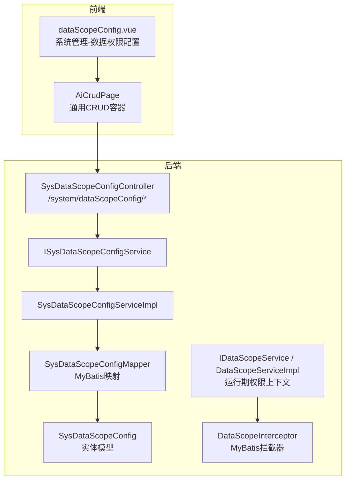
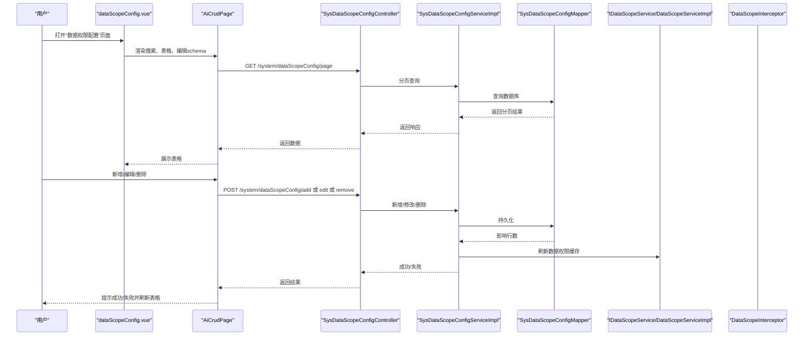
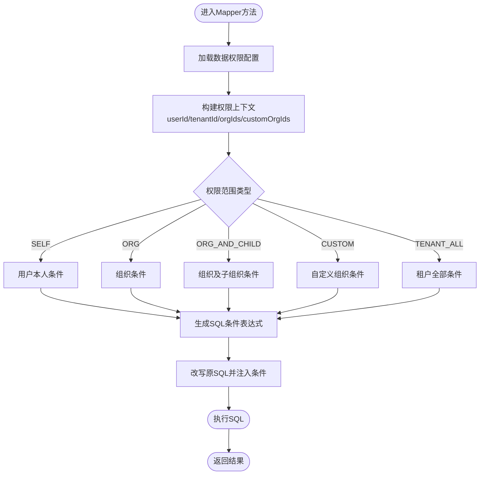
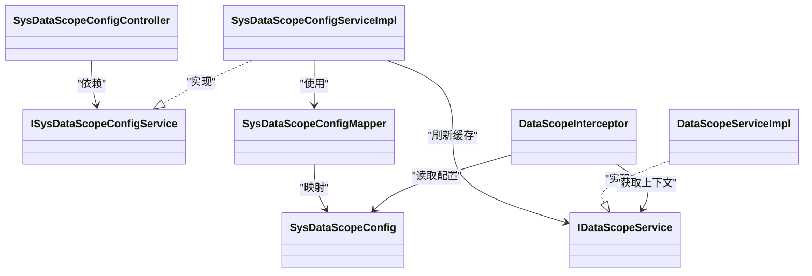

# 权限配置界面

<cite>
**本文引用的文件**
- [dataScopeConfig.vue](file://forge-admin-ui/src/views/system/dataScopeConfig.vue)
- [SysDataScopeConfigController.java](file://forge/forge-framework/forge-plugin-parent/forge-plugin-system/src/main/java/com/mdframe/forge/plugin/system/controller/SysDataScopeConfigController.java)
- [ISysDataScopeConfigService.java](file://forge/forge-framework/forge-plugin-parent/forge-plugin-system/src/main/java/com/mdframe/forge/plugin/system/service/ISysDataScopeConfigService.java)
- [SysDataScopeConfigServiceImpl.java](file://forge/forge-framework/forge-plugin-parent/forge-plugin-system/src/main/java/com/mdframe/forge/plugin/system/service/impl/SysDataScopeConfigServiceImpl.java)
- [DATA_SCOPE_CONFIG_GUIDE.md](file://forge/forge-framework/forge-starter-parent/forge-starter-datascope/DATA_SCOPE_CONFIG_GUIDE.md)
- [datascope_tables.sql](file://forge/forge-framework/forge-starter-parent/forge-starter-datascope/sql/datascope_tables.sql)
- [SysDataScopeConfig.java](file://forge/forge-framework/forge-starter-parent/forge-starter-datascope/src/main/java/com/mdframe/forge/starter/datascope/entity/SysDataScopeConfig.java)
- [DataScopeInterceptor.java](file://forge/forge-framework/forge-starter-parent/forge-starter-datascope/src/main/java/com/mdframe/forge/starter/datascope/handler/DataScopeInterceptor.java)
- [IDataScopeService.java](file://forge/forge-framework/forge-starter-parent/forge-starter-datascope/src/main/java/com/mdframe/forge/starter/datascope/service/IDataScopeService.java)
- [DataScopeServiceImpl.java](file://forge/forge-framework/forge-starter-parent/forge-starter-datascope/src/main/java/com/mdframe/forge/starter/datascope/service/impl/DataScopeServiceImpl.java)
</cite>

## 目录
1. [简介](#简介)
2. [项目结构](#项目结构)
3. [核心组件](#核心组件)
4. [架构总览](#架构总览)
5. [详细组件分析](#详细组件分析)
6. [依赖关系分析](#依赖关系分析)
7. [性能考量](#性能考量)
8. [故障排查指南](#故障排查指南)
9. [结论](#结论)
10. [附录](#附录)

## 简介
本文件面向Forge框架的数据权限配置界面，围绕dataScopeConfig.vue组件进行全面的用户文档说明。内容涵盖：
- 数据权限配置的增删改查操作流程
- 配置项的可视化编辑与字段含义
- 权限范围的选择与设置（用户ID、组织ID、租户ID）
- 界面与后端API的交互机制（数据提交、验证反馈、错误处理）
- 常见问题解决方案与最佳实践

## 项目结构
dataScopeConfig.vue位于前端系统管理视图中，通过统一的CRUD页面组件展示与操作数据权限配置。后端由系统插件提供REST接口，配合数据权限拦截器在运行期生效。

图表来源
- [dataScopeConfig.vue](file://forge-admin-ui/src/views/system/dataScopeConfig.vue#L1-L40)
- [SysDataScopeConfigController.java](file://forge/forge-framework/forge-plugin-parent/forge-plugin-system/src/main/java/com/mdframe/forge/plugin/system/controller/SysDataScopeConfigController.java#L21-L96)
- [SysDataScopeConfigServiceImpl.java](file://forge/forge-framework/forge-plugin-parent/forge-plugin-system/src/main/java/com/mdframe/forge/plugin/system/service/impl/SysDataScopeConfigServiceImpl.java#L22-L117)
- [SysDataScopeConfig.java](file://forge/forge-framework/forge-starter-parent/forge-starter-datascope/src/main/java/com/mdframe/forge/starter/datascope/entity/SysDataScopeConfig.java#L13-L85)
- [DataScopeInterceptor.java](file://forge/forge-framework/forge-starter-parent/forge-starter-datascope/src/main/java/com/mdframe/forge/starter/datascope/handler/DataScopeInterceptor.java#L92-L309)

章节来源
- [dataScopeConfig.vue](file://forge-admin-ui/src/views/system/dataScopeConfig.vue#L1-L40)
- [SysDataScopeConfigController.java](file://forge/forge-framework/forge-plugin-parent/forge-plugin-system/src/main/java/com/mdframe/forge/plugin/system/controller/SysDataScopeConfigController.java#L21-L96)

## 核心组件
- dataScopeConfig.vue：提供数据权限配置的增删改查界面，内置搜索、表格列与编辑表单schema，调用统一CRUD容器完成数据交互。
- SysDataScopeConfigController：后端REST控制器，提供分页查询、详情、新增、修改、删除等接口。
- SysDataScopeConfigServiceImpl：服务实现，封装分页查询、新增/修改/删除逻辑，并在变更后刷新数据权限缓存。
- SysDataScopeConfig：数据权限配置实体，对应数据库表sys_data_scope_config。
- DataScopeInterceptor：MyBatis拦截器，运行期根据配置动态改写SQL，实现数据权限控制。

章节来源
- [dataScopeConfig.vue](file://forge-admin-ui/src/views/system/dataScopeConfig.vue#L42-L319)
- [SysDataScopeConfigController.java](file://forge/forge-framework/forge-plugin-parent/forge-plugin-system/src/main/java/com/mdframe/forge/plugin/system/controller/SysDataScopeConfigController.java#L21-L96)
- [SysDataScopeConfigServiceImpl.java](file://forge/forge-framework/forge-plugin-parent/forge-plugin-system/src/main/java/com/mdframe/forge/plugin/system/service/impl/SysDataScopeConfigServiceImpl.java#L22-L117)
- [SysDataScopeConfig.java](file://forge/forge-framework/forge-starter-parent/forge-starter-datascope/src/main/java/com/mdframe/forge/starter/datascope/entity/SysDataScopeConfig.java#L13-L85)
- [DataScopeInterceptor.java](file://forge/forge-framework/forge-starter-parent/forge-starter-datascope/src/main/java/com/mdframe/forge/starter/datascope/handler/DataScopeInterceptor.java#L92-L309)

## 架构总览
从前端到后端再到运行期拦截器的整体流程如下：

图表来源
- [dataScopeConfig.vue](file://forge-admin-ui/src/views/system/dataScopeConfig.vue#L3-L19)
- [SysDataScopeConfigController.java](file://forge/forge-framework/forge-plugin-parent/forge-plugin-system/src/main/java/com/mdframe/forge/plugin/system/controller/SysDataScopeConfigController.java#L34-L94)
- [SysDataScopeConfigServiceImpl.java](file://forge/forge-framework/forge-plugin-parent/forge-plugin-system/src/main/java/com/mdframe/forge/plugin/system/service/impl/SysDataScopeConfigServiceImpl.java#L47-L88)
- [IDataScopeService.java](file://forge/forge-framework/forge-starter-parent/forge-starter-datascope/src/main/java/com/mdframe/forge/starter/datascope/service/IDataScopeService.java#L12-L41)
- [DataScopeServiceImpl.java](file://forge/forge-framework/forge-starter-parent/forge-starter-datascope/src/main/java/com/mdframe/forge/starter/datascope/service/impl/DataScopeServiceImpl.java#L24-L63)

## 详细组件分析

### 页面与交互概览
- 页面入口：系统管理 → 数据权限配置
- 主要功能：
  - 列表分页展示：资源编码、资源名称、Mapper方法、表别名、用户/组织/租户字段、状态、备注、创建时间
  - 搜索：按资源编码、资源名称、是否启用筛选
  - 操作：编辑、删除（删除带二次确认）
  - 新增/编辑：基础信息、字段配置、其他信息三段式表单

章节来源
- [dataScopeConfig.vue](file://forge-admin-ui/src/views/system/dataScopeConfig.vue#L58-L157)
- [dataScopeConfig.vue](file://forge-admin-ui/src/views/system/dataScopeConfig.vue#L159-L283)
- [dataScopeConfig.vue](file://forge-admin-ui/src/views/system/dataScopeConfig.vue#L285-L311)

### 字段说明与输入规则
- 基础信息
  - 资源编码：必填，建议采用“模块:功能:操作”的唯一标识，如system:user:list
  - 资源名称：必填
  - Mapper方法：必填，形如com.example.mapper.XxxMapper.methodName
- 字段配置
  - 主表别名：默认t，建议与Mapper XML中一致
  - 是否启用：必选，启用/禁用
  - 用户ID字段：必填
    - 简单模式：直接填写字段名，如user_id、create_by
    - 复杂模式：以<sql>开头，支持占位符#{userId}、#{tenantId}、#{orgIds}、#{customOrgIds}
  - 组织ID字段：必填
    - 简单模式：字段名，如org_id、dept_id
    - 复杂模式：<sql>开头，支持占位符
  - 租户ID字段：必填
    - 简单模式：字段名，如tenant_id
    - 复杂模式：<sql>开头，支持占位符
- 其他信息
  - 备注：可选

章节来源
- [dataScopeConfig.vue](file://forge-admin-ui/src/views/system/dataScopeConfig.vue#L160-L283)
- [DATA_SCOPE_CONFIG_GUIDE.md](file://forge/forge-framework/forge-starter-parent/forge-starter-datascope/DATA_SCOPE_CONFIG_GUIDE.md#L58-L142)
- [SysDataScopeConfig.java](file://forge/forge-framework/forge-starter-parent/forge-starter-datascope/src/main/java/com/mdframe/forge/starter/datascope/entity/SysDataScopeConfig.java#L32-L73)

### 操作流程指南

#### 创建新的数据权限配置
- 步骤
  - 点击“新增配置”
  - 填写基础信息与字段配置
  - 点击保存，后端持久化并刷新缓存
- 关键点
  - Mapper方法需与实际Mapper一致
  - 表别名需与Mapper XML中一致
  - 复杂模式需以<sql>开头且占位符正确

章节来源
- [dataScopeConfig.vue](file://forge-admin-ui/src/views/system/dataScopeConfig.vue#L159-L283)
- [SysDataScopeConfigController.java](file://forge/forge-framework/forge-plugin-parent/forge-plugin-system/src/main/java/com/mdframe/forge/plugin/system/controller/SysDataScopeConfigController.java#L63-L67)
- [SysDataScopeConfigServiceImpl.java](file://forge/forge-framework/forge-plugin-parent/forge-plugin-system/src/main/java/com/mdframe/forge/plugin/system/service/impl/SysDataScopeConfigServiceImpl.java#L47-L55)

#### 修改现有配置
- 步骤
  - 在表格中点击“编辑”，加载详情
  - 修改字段后保存
  - 后端更新并刷新缓存
- 关键点
  - 修改后立即生效（缓存自动刷新）

章节来源
- [dataScopeConfig.vue](file://forge-admin-ui/src/views/system/dataScopeConfig.vue#L285-L288)
- [SysDataScopeConfigController.java](file://forge/forge-framework/forge-plugin-parent/forge-plugin-system/src/main/java/com/mdframe/forge/plugin/system/controller/SysDataScopeConfigController.java#L72-L76)
- [SysDataScopeConfigServiceImpl.java](file://forge/forge-framework/forge-plugin-parent/forge-plugin-system/src/main/java/com/mdframe/forge/plugin/system/service/impl/SysDataScopeConfigServiceImpl.java#L58-L66)

#### 启用或禁用权限控制
- 步骤
  - 在编辑表单中选择“是否启用”
  - 保存后立即生效
- 关键点
  - 禁用即不参与权限控制

章节来源
- [dataScopeConfig.vue](file://forge-admin-ui/src/views/system/dataScopeConfig.vue#L217-L225)
- [DATA_SCOPE_CONFIG_GUIDE.md](file://forge/forge-framework/forge-starter-parent/forge-starter-datascope/DATA_SCOPE_CONFIG_GUIDE.md#L228-L236)

#### 删除配置
- 步骤
  - 在表格中点击“删除”，弹出确认对话框
  - 确认后发送删除请求，成功后提示并刷新
- 关键点
  - 删除后立即生效（缓存自动刷新）

章节来源
- [dataScopeConfig.vue](file://forge-admin-ui/src/views/system/dataScopeConfig.vue#L290-L311)
- [SysDataScopeConfigController.java](file://forge/forge-framework/forge-plugin-parent/forge-plugin-system/src/main/java/com/mdframe/forge/plugin/system/controller/SysDataScopeConfigController.java#L81-L85)
- [SysDataScopeConfigServiceImpl.java](file://forge/forge-framework/forge-plugin-parent/forge-plugin-system/src/main/java/com/mdframe/forge/plugin/system/service/impl/SysDataScopeConfigServiceImpl.java#L70-L88)

### 界面与后端API交互机制
- 接口映射
  - 列表分页：GET /system/dataScopeConfig/page
  - 详情：POST /system/dataScopeConfig/getById
  - 新增：POST /system/dataScopeConfig/add
  - 修改：POST /system/dataScopeConfig/edit
  - 删除：POST /system/dataScopeConfig/remove
- 数据提交与验证
  - 前端基于schema进行必填校验
  - 提交时携带完整配置对象
  - 后端返回统一响应结构，前端根据code提示成功/失败
- 错误处理
  - 删除失败时弹出错误提示
  - 建议在新增/修改失败时也统一提示并保留编辑态以便修正

章节来源
- [dataScopeConfig.vue](file://forge-admin-ui/src/views/system/dataScopeConfig.vue#L3-L19)
- [SysDataScopeConfigController.java](file://forge/forge-framework/forge-plugin-parent/forge-plugin-system/src/main/java/com/mdframe/forge/plugin/system/controller/SysDataScopeConfigController.java#L34-L94)

### 运行期权限控制机制
- 工作流程
  - 配置读取：系统启动或缓存刷新后加载启用的配置
  - 拦截器：MyBatis拦截器拦截Mapper方法执行
  - SQL拼接：根据配置规则动态拼接WHERE条件
  - 权限生效：最终SQL只返回用户有权限访问的数据
- 占位符支持
  - #{userId}、#{tenantId}、#{orgIds}、#{customOrgIds}
- 生效时机
  - 新增/修改/删除/启用/禁用均会触发缓存刷新，立即生效

图表来源
- [DATA_SCOPE_CONFIG_GUIDE.md](file://forge/forge-framework/forge-starter-parent/forge-starter-datascope/DATA_SCOPE_CONFIG_GUIDE.md#L202-L227)
- [DataScopeInterceptor.java](file://forge/forge-framework/forge-starter-parent/forge-starter-datascope/src/main/java/com/mdframe/forge/starter/datascope/handler/DataScopeInterceptor.java#L122-L309)
- [IDataScopeService.java](file://forge/forge-framework/forge-starter-parent/forge-starter-datascope/src/main/java/com/mdframe/forge/starter/datascope/service/IDataScopeService.java#L12-L41)
- [DataScopeServiceImpl.java](file://forge/forge-framework/forge-starter-parent/forge-starter-datascope/src/main/java/com/mdframe/forge/starter/datascope/service/impl/DataScopeServiceImpl.java#L50-L63)

## 依赖关系分析
- 前端
  - dataScopeConfig.vue依赖AiCrudPage组件，通过api-config声明REST接口映射
  - 编辑schema依赖Naive UI组件与表单校验
- 后端
  - SysDataScopeConfigController依赖ISysDataScopeConfigService
  - SysDataScopeConfigServiceImpl依赖SysDataScopeConfigMapper与IDataScopeService
  - IDataScopeService/DataScopeServiceImpl负责运行期权限上下文与缓存
- 运行期
  - DataScopeInterceptor依赖IDataScopeService与SysDataScopeConfig配置，动态改写SQL

图表来源
- [SysDataScopeConfigController.java](file://forge/forge-framework/forge-plugin-parent/forge-plugin-system/src/main/java/com/mdframe/forge/plugin/system/controller/SysDataScopeConfigController.java#L21-L96)
- [ISysDataScopeConfigService.java](file://forge/forge-framework/forge-plugin-parent/forge-plugin-system/src/main/java/com/mdframe/forge/plugin/system/service/ISysDataScopeConfigService.java#L11-L48)
- [SysDataScopeConfigServiceImpl.java](file://forge/forge-framework/forge-plugin-parent/forge-plugin-system/src/main/java/com/mdframe/forge/plugin/system/service/impl/SysDataScopeConfigServiceImpl.java#L22-L117)
- [SysDataScopeConfig.java](file://forge/forge-framework/forge-starter-parent/forge-starter-datascope/src/main/java/com/mdframe/forge/starter/datascope/entity/SysDataScopeConfig.java#L13-L85)
- [IDataScopeService.java](file://forge/forge-framework/forge-starter-parent/forge-starter-datascope/src/main/java/com/mdframe/forge/starter/datascope/service/IDataScopeService.java#L12-L41)
- [DataScopeServiceImpl.java](file://forge/forge-framework/forge-starter-parent/forge-starter-datascope/src/main/java/com/mdframe/forge/starter/datascope/service/impl/DataScopeServiceImpl.java#L24-L63)
- [DataScopeInterceptor.java](file://forge/forge-framework/forge-starter-parent/forge-starter-datascope/src/main/java/com/mdframe/forge/starter/datascope/handler/DataScopeInterceptor.java#L92-L309)

章节来源
- [SysDataScopeConfigController.java](file://forge/forge-framework/forge-plugin-parent/forge-plugin-system/src/main/java/com/mdframe/forge/plugin/system/controller/SysDataScopeConfigController.java#L21-L96)
- [SysDataScopeConfigServiceImpl.java](file://forge/forge-framework/forge-plugin-parent/forge-plugin-system/src/main/java/com/mdframe/forge/plugin/system/service/impl/SysDataScopeConfigServiceImpl.java#L22-L117)
- [SysDataScopeConfig.java](file://forge/forge-framework/forge-starter-parent/forge-starter-datascope/src/main/java/com/mdframe/forge/starter/datascope/entity/SysDataScopeConfig.java#L13-L85)
- [DataScopeInterceptor.java](file://forge/forge-framework/forge-starter-parent/forge-starter-datascope/src/main/java/com/mdframe/forge/starter/datascope/handler/DataScopeInterceptor.java#L92-L309)

## 性能考量
- 缓存策略
  - 配置缓存：Caffeine缓存，最大500条，默认30分钟过期
  - 组织子孙缓存：Caffeine缓存，最大1000条，默认10分钟过期
- 性能建议
  - 复杂SQL可能影响查询性能，建议使用EXPLAIN分析
  - 合理使用简单字段模式，避免过度复杂的<sql>表达式
  - 配置完成后进行充分的权限测试

章节来源
- [DATA_SCOPE_CONFIG_GUIDE.md](file://forge/forge-framework/forge-starter-parent/forge-starter-datascope/DATA_SCOPE_CONFIG_GUIDE.md#L228-L236)
- [DataScopeServiceImpl.java](file://forge/forge-framework/forge-starter-parent/forge-starter-datascope/src/main/java/com/mdframe/forge/starter/datascope/service/impl/DataScopeServiceImpl.java#L34-L48)

## 故障排查指南
- 配置后没有生效
  - 检查是否启用(enabled=1)
  - 检查Mapper方法路径是否正确
  - 检查表别名是否与XML中一致
  - 检查是否刷新了缓存（修改配置会自动刷新）
- SQL语法错误
  - 复杂模式的SQL需以<sql>开头
  - 占位符格式需正确（#{userId}、#{tenantId}、#{orgIds}、#{customOrgIds}）
  - 确保SQL语法合法
- 查询结果为空
  - 检查字段名是否正确
  - 检查表别名是否正确
  - 检查当前用户是否有符合条件的数据
- 如何临时禁用某个配置
  - 在数据权限配置页面，将“是否启用”改为“禁用”

章节来源
- [DATA_SCOPE_CONFIG_GUIDE.md](file://forge/forge-framework/forge-starter-parent/forge-starter-datascope/DATA_SCOPE_CONFIG_GUIDE.md#L237-L260)

## 结论
dataScopeConfig.vue提供了直观易用的数据权限配置界面，结合后端REST接口与运行期拦截器，实现了对多维数据权限（用户、组织、租户）的灵活控制。通过合理的字段配置与占位符使用，可在不改动代码的情况下实现细粒度的数据访问控制。建议在生产环境中遵循最佳实践，做好权限测试与性能评估。

## 附录

### 数据库表结构参考
- sys_data_scope_config：包含资源编码、资源名称、Mapper方法、表别名、用户/组织/租户字段、启用状态、备注等字段

章节来源
- [datascope_tables.sql](file://forge/forge-framework/forge-starter-parent/forge-starter-datascope/sql/datascope_tables.sql#L1-L99)
- [DATA_SCOPE_CONFIG_GUIDE.md](file://forge/forge-framework/forge-starter-parent/forge-starter-datascope/DATA_SCOPE_CONFIG_GUIDE.md#L7-L28)