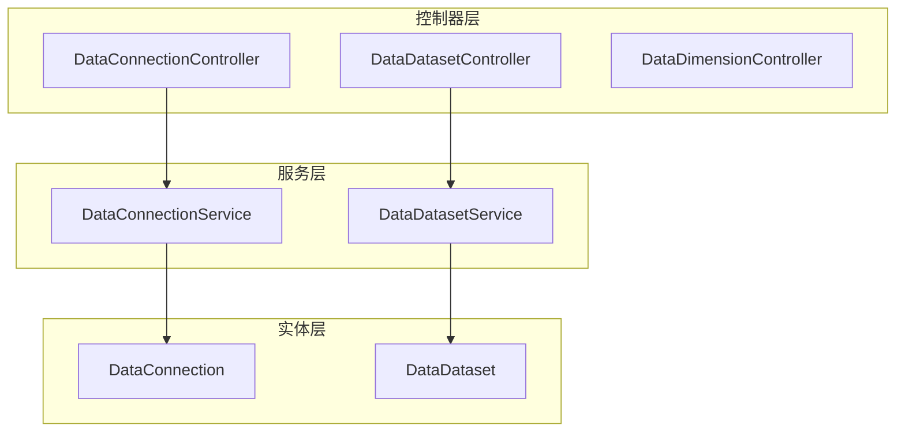
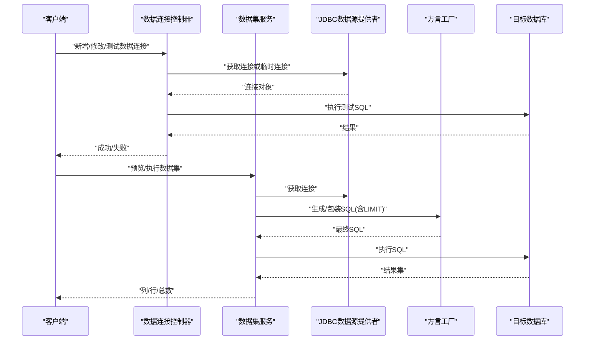
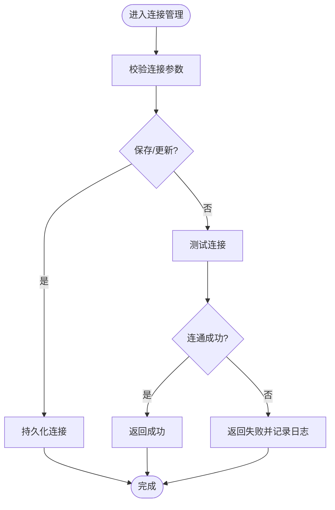
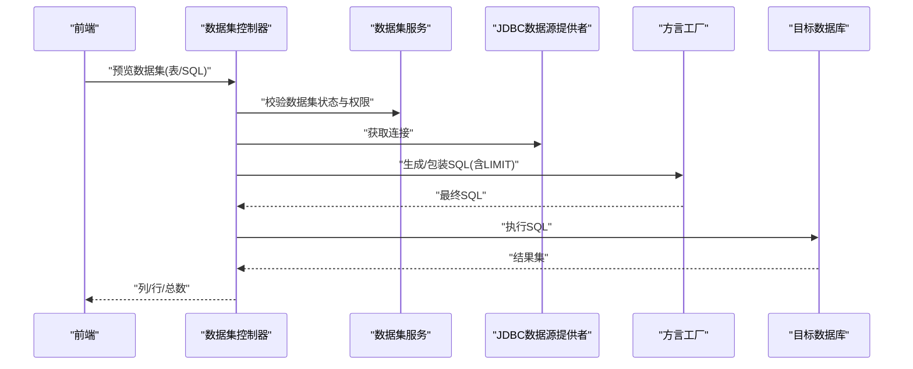
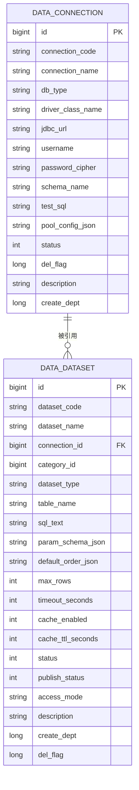
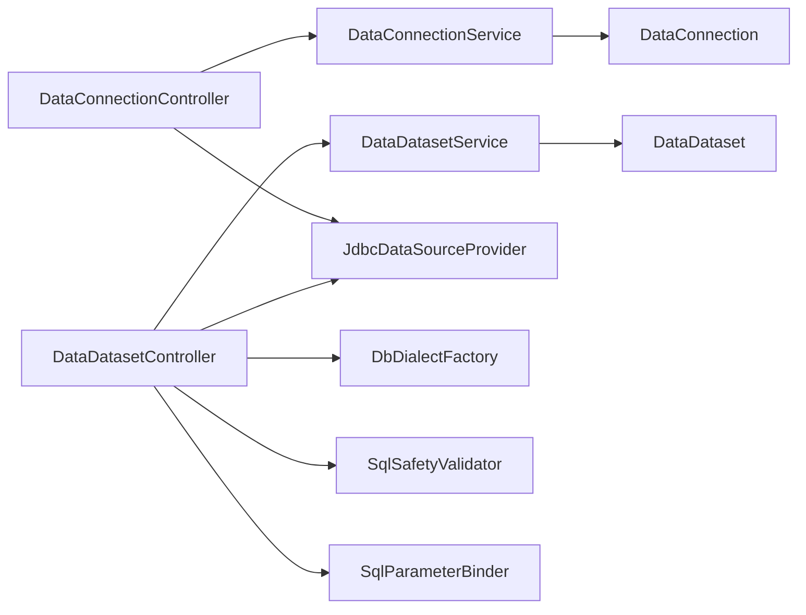

# 数据管理

<cite>
**本文引用的文件**
- [DataConnectionController.java](file://forge-server/forge-framework/forge-plugin-parent/forge-plugin-data/src/main/java/com/mdframe/forge/plugin/data/controller/DataConnectionController.java)
- [DataDatasetController.java](file://forge-server/forge-framework/forge-plugin-parent/forge-plugin-data/src/main/java/com/mdframe/forge/plugin/data/controller/DataDatasetController.java)
- [DataDimensionController.java](file://forge-server/forge-framework/forge-plugin-parent/forge-plugin-data/src/main/java/com/mdframe/forge/plugin/data/controller/DataDimensionController.java)
- [DataConnectionService.java](file://forge-server/forge-framework/forge-plugin-parent/forge-plugin-data/src/main/java/com/mdframe/forge/plugin/data/service/DataConnectionService.java)
- [DataDatasetService.java](file://forge-server/forge-framework/forge-plugin-parent/forge-plugin-data/src/main/java/com/mdframe/forge/plugin/data/service/DataDatasetService.java)
- [DataConnection.java](file://forge-server/forge-framework/forge-plugin-parent/forge-plugin-data/src/main/java/com/mdframe/forge/plugin/data/entity/DataConnection.java)
- [DataDataset.java](file://forge-server/forge-framework/forge-plugin-parent/forge-plugin-data/src/main/java/com/mdframe/forge/plugin/data/entity/DataDataset.java)
</cite>

## 目录
1. [简介](#简介)
2. [项目结构](#项目结构)
3. [核心组件](#核心组件)
4. [架构总览](#架构总览)
5. [详细组件分析](#详细组件分析)
6. [依赖关系分析](#依赖关系分析)
7. [性能考虑](#性能考虑)
8. [故障排查指南](#故障排查指南)
9. [结论](#结论)
10. [附录](#附录)

## 简介
本章节面向Forge Admin的数据管理模块，聚焦业务数据管理、数据连接配置、数据集管理与维度管理等核心能力。文档从系统架构、组件关系、数据流与处理逻辑、集成点、错误处理与性能特性等维度展开，帮助读者快速理解并高效使用数据管理能力。

## 项目结构
数据管理模块位于插件工程 forge-plugin-data，采用“控制器-服务-实体”的分层组织方式：
- 控制器层：暴露REST接口，负责参数校验、权限检查、日志记录与响应封装
- 服务层：定义业务能力边界（如连接管理、数据集生命周期、维度管理）
- 实体层：映射数据库表结构，承载数据模型与元信息

图表来源
- [DataConnectionController.java:31-41](file://forge-server/forge-framework/forge-plugin-parent/forge-plugin-data/src/main/java/com/mdframe/forge/plugin/data/controller/DataConnectionController.java#L31-L41)
- [DataDatasetController.java:53-72](file://forge-server/forge-framework/forge-plugin-parent/forge-plugin-data/src/main/java/com/mdframe/forge/plugin/data/controller/DataDatasetController.java#L53-L72)
- [DataDimensionController.java:19-26](file://forge-server/forge-framework/forge-plugin-parent/forge-plugin-data/src/main/java/com/mdframe/forge/plugin/data/controller/DataDimensionController.java#L19-L26)
- [DataConnectionService.java:10-23](file://forge-server/forge-framework/forge-plugin-parent/forge-plugin-data/src/main/java/com/mdframe/forge/plugin/data/service/DataConnectionService.java#L10-L23)
- [DataDatasetService.java:9-19](file://forge-server/forge-framework/forge-plugin-parent/forge-plugin-data/src/main/java/com/mdframe/forge/plugin/data/service/DataDatasetService.java#L9-L19)
- [DataConnection.java:8-46](file://forge-server/forge-framework/forge-plugin-parent/forge-plugin-data/src/main/java/com/mdframe/forge/plugin/data/entity/DataConnection.java#L8-L46)
- [DataDataset.java:8-68](file://forge-server/forge-framework/forge-plugin-parent/forge-plugin-data/src/main/java/com/mdframe/forge/plugin/data/entity/DataDataset.java#L8-L68)

章节来源
- [DataConnectionController.java:31-41](file://forge-server/forge-framework/forge-plugin-parent/forge-plugin-data/src/main/java/com/mdframe/forge/plugin/data/controller/DataConnectionController.java#L31-L41)
- [DataDatasetController.java:53-72](file://forge-server/forge-framework/forge-plugin-parent/forge-plugin-data/src/main/java/com/mdframe/forge/plugin/data/controller/DataDatasetController.java#L53-L72)
- [DataDimensionController.java:19-26](file://forge-server/forge-framework/forge-plugin-parent/forge-plugin-data/src/main/java/com/mdframe/forge/plugin/data/controller/DataDimensionController.java#L19-L26)

## 核心组件
- 数据连接管理：提供连接的增删改查、连通性测试、表与字段元数据查询、敏感信息脱敏返回
- 数据集管理：支持表型与SQL型数据集的创建、发布/下架、字段同步、预览执行、访问控制与行级范围
- 维度管理：维度的增删改查、维度值维护与同步
- 安全与合规：API加解密注解、操作日志、SQL安全检查、参数绑定与防注入
- 可观测性：关键路径日志记录、异常捕获与友好提示

章节来源
- [DataConnectionController.java:43-158](file://forge-server/forge-framework/forge-plugin-parent/forge-plugin-data/src/main/java/com/mdframe/forge/plugin/data/controller/DataConnectionController.java#L43-L158)
- [DataDatasetController.java:74-249](file://forge-server/forge-framework/forge-plugin-parent/forge-plugin-data/src/main/java/com/mdframe/forge/plugin/data/controller/DataDatasetController.java#L74-L249)
- [DataDimensionController.java:28-83](file://forge-server/forge-framework/forge-plugin-parent/forge-plugin-data/src/main/java/com/mdframe/forge/plugin/data/controller/DataDimensionController.java#L28-L83)

## 架构总览
数据管理模块通过控制器接收请求，调用服务完成业务编排；在需要访问外部数据库时，通过JDBC数据源提供者与方言工厂构建SQL并执行；同时结合SQL安全校验器与参数绑定器保障执行安全。

图表来源
- [DataConnectionController.java:214-267](file://forge-server/forge-framework/forge-plugin-parent/forge-plugin-data/src/main/java/com/mdframe/forge/plugin/data/controller/DataConnectionController.java#L214-L267)
- [DataDatasetController.java:502-615](file://forge-server/forge-framework/forge-plugin-parent/forge-plugin-data/src/main/java/com/mdframe/forge/plugin/data/controller/DataDatasetController.java#L502-L615)

## 详细组件分析

### 数据连接管理
- 功能要点
  - 分页与列表查询，返回列表时对敏感信息进行脱敏
  - 新增/修改连接，保存前进行必填项校验
  - 删除连接时检查是否被数据集引用
  - 测试已保存连接与临时连接连通性
  - 查询连接下的表与字段元数据
- 安全与健壮性
  - 统一加解密注解保护传输安全
  - 对JDBC URL中的密码参数进行脱敏展示
  - 异常捕获并记录警告日志，避免影响主流程

图表来源
- [DataConnectionController.java:71-126](file://forge-server/forge-framework/forge-plugin-parent/forge-plugin-data/src/main/java/com/mdframe/forge/plugin/data/controller/DataConnectionController.java#L71-L126)
- [DataConnectionController.java:160-179](file://forge-server/forge-framework/forge-plugin-parent/forge-plugin-data/src/main/java/com/mdframe/forge/plugin/data/controller/DataConnectionController.java#L160-L179)
- [DataConnectionController.java:214-267](file://forge-server/forge-framework/forge-plugin-parent/forge-plugin-data/src/main/java/com/mdframe/forge/plugin/data/controller/DataConnectionController.java#L214-L267)

章节来源
- [DataConnectionController.java:43-158](file://forge-server/forge-framework/forge-plugin-parent/forge-plugin-data/src/main/java/com/mdframe/forge/plugin/data/controller/DataConnectionController.java#L43-L158)
- [DataConnectionController.java:160-179](file://forge-server/forge-framework/forge-plugin-parent/forge-plugin-data/src/main/java/com/mdframe/forge/plugin/data/controller/DataConnectionController.java#L160-L179)
- [DataConnectionController.java:214-267](file://forge-server/forge-framework/forge-plugin-parent/forge-plugin-data/src/main/java/com/mdframe/forge/plugin/data/controller/DataConnectionController.java#L214-L267)

### 数据集管理
- 功能要点
  - 支持表型与SQL型数据集的创建、编辑、删除
  - 发布/下架控制，未发布不可执行
  - 字段自动同步（表型从元数据提取，SQL型从首行推断）
  - 预览执行：限制最大行数、包装SQL并应用方言LIMIT
  - 访问控制：按数据集访问模式与ACL进行鉴权
- 安全与健壮性
  - SQL安全检查与参数绑定，防止注入
  - 参数Schema解析与校验
  - 异常捕获与友好提示

图表来源
- [DataDatasetController.java:222-249](file://forge-server/forge-framework/forge-plugin-parent/forge-plugin-data/src/main/java/com/mdframe/forge/plugin/data/controller/DataDatasetController.java#L222-L249)
- [DataDatasetController.java:502-615](file://forge-server/forge-framework/forge-plugin-parent/forge-plugin-data/src/main/java/com/mdframe/forge/plugin/data/controller/DataDatasetController.java#L502-L615)

章节来源
- [DataDatasetController.java:74-249](file://forge-server/forge-framework/forge-plugin-parent/forge-plugin-data/src/main/java/com/mdframe/forge/plugin/data/controller/DataDatasetController.java#L74-L249)
- [DataDatasetController.java:251-359](file://forge-server/forge-framework/forge-plugin-parent/forge-plugin-data/src/main/java/com/mdframe/forge/plugin/data/controller/DataDatasetController.java#L251-L359)
- [DataDatasetController.java:424-500](file://forge-server/forge-framework/forge-plugin-parent/forge-plugin-data/src/main/java/com/mdframe/forge/plugin/data/controller/DataDatasetController.java#L424-L500)
- [DataDatasetController.java:502-615](file://forge-server/forge-framework/forge-plugin-parent/forge-plugin-data/src/main/java/com/mdframe/forge/plugin/data/controller/DataDatasetController.java#L502-L615)

### 维度管理
- 功能要点
  - 维度分页与列表查询
  - 维度值的保存与同步
  - 维度项的批量维护
- 适用场景
  - 为数据集字段提供统一的维度值映射与展示规则

章节来源
- [DataDimensionController.java:28-83](file://forge-server/forge-framework/forge-plugin-parent/forge-plugin-data/src/main/java/com/mdframe/forge/plugin/data/controller/DataDimensionController.java#L28-L83)

### 数据模型设计
- 数据连接
  - 标识与名称、数据库类型、驱动类名、JDBC URL、用户名、加密后的密码、Schema、测试SQL、连接池配置JSON、状态、描述、部门、逻辑删除标记
- 数据集
  - 编码与名称、关联连接ID、分类ID、类型（表/SQL）、表名或SQL文本、参数Schema、默认排序、最大行数、超时时间、缓存开关与TTL、状态、发布状态、访问模式、描述、部门、逻辑删除标记

图表来源
- [DataConnection.java:8-46](file://forge-server/forge-framework/forge-plugin-parent/forge-plugin-data/src/main/java/com/mdframe/forge/plugin/data/entity/DataConnection.java#L8-L46)
- [DataDataset.java:8-68](file://forge-server/forge-framework/forge-plugin-parent/forge-plugin-data/src/main/java/com/mdframe/forge/plugin/data/entity/DataDataset.java#L8-L68)

章节来源
- [DataConnection.java:8-46](file://forge-server/forge-framework/forge-plugin-parent/forge-plugin-data/src/main/java/com/mdframe/forge/plugin/data/entity/DataConnection.java#L8-L46)
- [DataDataset.java:8-68](file://forge-server/forge-framework/forge-plugin-parent/forge-plugin-data/src/main/java/com/mdframe/forge/plugin/data/entity/DataDataset.java#L8-L68)

## 依赖关系分析
- 控制器依赖服务接口，服务实现由框架装配
- 数据连接与数据集控制器均依赖JDBC数据源提供者与方言工厂以执行SQL
- 数据集控制器额外依赖SQL安全校验器与参数绑定器，确保执行安全
- 实体通过MyBatis-Plus注解映射到数据库表

图表来源
- [DataConnectionController.java:31-41](file://forge-server/forge-framework/forge-plugin-parent/forge-plugin-data/src/main/java/com/mdframe/forge/plugin/data/controller/DataConnectionController.java#L31-L41)
- [DataDatasetController.java:53-72](file://forge-server/forge-framework/forge-plugin-parent/forge-plugin-data/src/main/java/com/mdframe/forge/plugin/data/controller/DataDatasetController.java#L53-L72)
- [DataConnectionService.java:10-23](file://forge-server/forge-framework/forge-plugin-parent/forge-plugin-data/src/main/java/com/mdframe/forge/plugin/data/service/DataConnectionService.java#L10-L23)
- [DataDatasetService.java:9-19](file://forge-server/forge-framework/forge-plugin-parent/forge-plugin-data/src/main/java/com/mdframe/forge/plugin/data/service/DataDatasetService.java#L9-L19)
- [DataConnection.java:8-46](file://forge-server/forge-framework/forge-plugin-parent/forge-plugin-data/src/main/java/com/mdframe/forge/plugin/data/entity/DataConnection.java#L8-L46)
- [DataDataset.java:8-68](file://forge-server/forge-framework/forge-plugin-parent/forge-plugin-data/src/main/java/com/mdframe/forge/plugin/data/entity/DataDataset.java#L8-L68)

章节来源
- [DataConnectionController.java:31-41](file://forge-server/forge-framework/forge-plugin-parent/forge-plugin-data/src/main/java/com/mdframe/forge/plugin/data/controller/DataConnectionController.java#L31-L41)
- [DataDatasetController.java:53-72](file://forge-server/forge-framework/forge-plugin-parent/forge-plugin-data/src/main/java/com/mdframe/forge/plugin/data/controller/DataDatasetController.java#L53-L72)

## 性能考虑
- 查询限制
  - 预览与执行时通过方言构建LIMIT语句，避免全表扫描
- 连接复用
  - 使用数据源提供者管理连接，减少频繁创建销毁开销
- 资源释放
  - 严格关闭PreparedStatement与ResultSet，避免连接泄漏
- 超时与缓存
  - 数据集支持超时时间与缓存开关/TTL，合理配置可降低重复查询压力
- 元数据查询优化
  - 表与字段元数据查询基于方言适配，提升跨库兼容性

[本节为通用指导，不直接分析具体文件]

## 故障排查指南
- 连接测试失败
  - 检查JDBC URL、驱动类名、用户名与密码是否正确
  - 查看控制台日志中“测试连接失败”的详细信息
- 数据集预览失败
  - 确认数据集已发布且启用
  - 检查SQL语法与安全校验是否通过
  - 关注“预览SQL失败”的异常信息与堆栈
- 删除连接失败
  - 若提示已被数据集引用，需先解除引用再删除
- 字段同步失败
  - 确认数据连接可用且具备读取元数据的权限
  - 检查表名或SQL返回的列是否与预期一致

章节来源
- [DataConnectionController.java:214-267](file://forge-server/forge-framework/forge-plugin-parent/forge-plugin-data/src/main/java/com/mdframe/forge/plugin/data/controller/DataConnectionController.java#L214-L267)
- [DataDatasetController.java:551-615](file://forge-server/forge-framework/forge-plugin-parent/forge-plugin-data/src/main/java/com/mdframe/forge/plugin/data/controller/DataDatasetController.java#L551-L615)

## 结论
本模块围绕数据连接、数据集与维度三大核心能力，提供了安全的SQL执行环境、完善的元数据管理与灵活的访问控制机制。通过方言适配、参数绑定与SQL安全检查，兼顾了多数据库兼容性与执行安全性。建议在生产环境中合理配置超时、缓存与最大行数，并结合审计日志与监控指标持续优化性能与稳定性。

## 附录

### API接口说明（摘要）
- 数据连接
  - 分页查询：GET /data/connection/page
  - 列表查询：GET /data/connection/list
  - 详情查询：GET /data/connection/{id}
  - 新增连接：POST /data/connection
  - 修改连接：PUT /data/connection
  - 删除连接：DELETE /data/connection/{id}
  - 测试连接：POST /data/connection/{id}/test
  - 临时测试：POST /data/connection/test
  - 查询表：GET /data/connection/{id}/tables
  - 查询字段：GET /data/connection/{id}/tables/{tableName}/fields
- 数据集
  - 分页查询：GET /data/dataset/page
  - 列表查询：GET /data/dataset/list
  - 详情查询：GET /data/dataset/{id}
  - 新增数据集：POST /data/dataset
  - 修改数据集：PUT /data/dataset
  - 删除数据集：DELETE /data/dataset/{id}
  - 发布：POST /data/dataset/{id}/publish
  - 下架：POST /data/dataset/{id}/offline
  - 同步字段：POST /data/dataset/{id}/sync-fields
  - 保存字段：PUT /data/dataset/{id}/fields
  - 预览：POST /data/dataset/{id}/preview
  - 预览SQL：POST /data/dataset/preview-sql
- 维度
  - 分页查询：GET /data/dimension/page
  - 列表查询：GET /data/dimension/list
  - 详情查询：GET /data/dimension/{id}
  - 新增维度：POST /data/dimension
  - 修改维度：PUT /data/dimension
  - 删除维度：DELETE /data/dimension/{id}
  - 维度值列表：GET /data/dimension/{id}/items
  - 保存维度值：PUT /data/dimension/{id}/items
  - 同步维度值：POST /data/dimension/{id}/sync

章节来源
- [DataConnectionController.java:43-158](file://forge-server/forge-framework/forge-plugin-parent/forge-plugin-data/src/main/java/com/mdframe/forge/plugin/data/controller/DataConnectionController.java#L43-L158)
- [DataDatasetController.java:74-249](file://forge-server/forge-framework/forge-plugin-parent/forge-plugin-data/src/main/java/com/mdframe/forge/plugin/data/controller/DataDatasetController.java#L74-L249)
- [DataDimensionController.java:28-83](file://forge-server/forge-framework/forge-plugin-parent/forge-plugin-data/src/main/java/com/mdframe/forge/plugin/data/controller/DataDimensionController.java#L28-L83)

### 数据安全与备份建议
- 数据传输安全：接口统一启用加解密注解，避免明文传输敏感信息
- 存储安全：密码字段以密文形式存储，返回时进行脱敏处理
- 执行安全：SQL安全检查与参数绑定，防止注入攻击
- 备份策略：建议定期导出数据库结构与种子数据，结合脚本工具进行全量/增量备份
- 审计与追踪：关键操作均记录操作日志，便于事后追溯

[本节为通用指导，不直接分析具体文件]