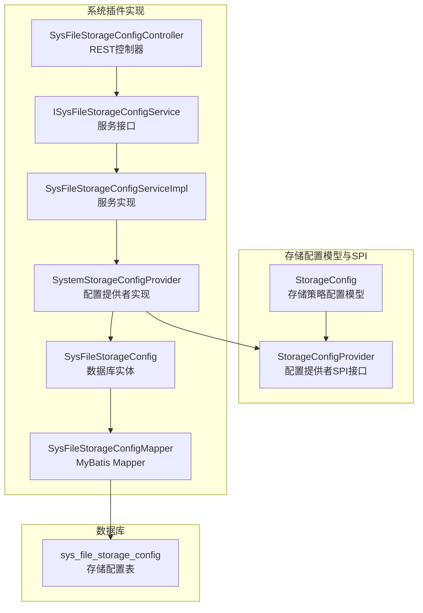
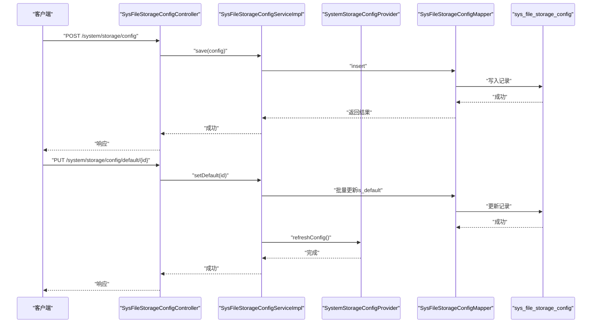
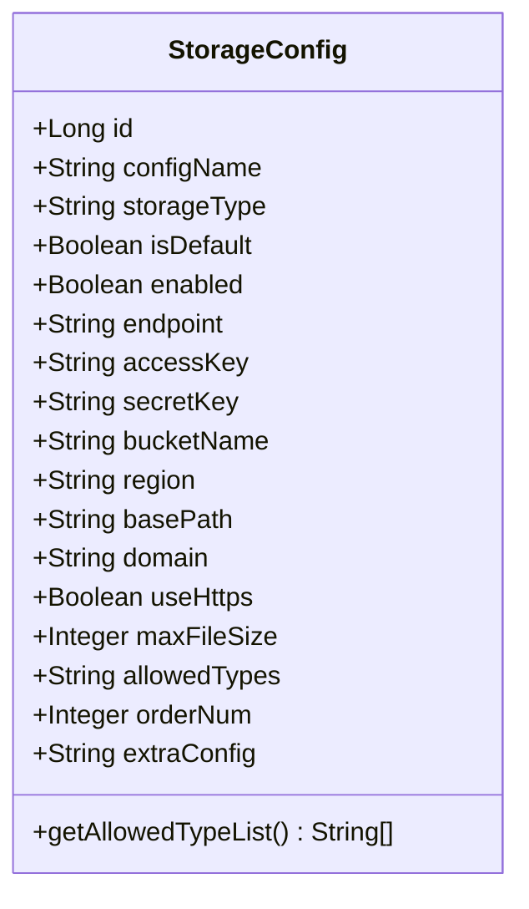
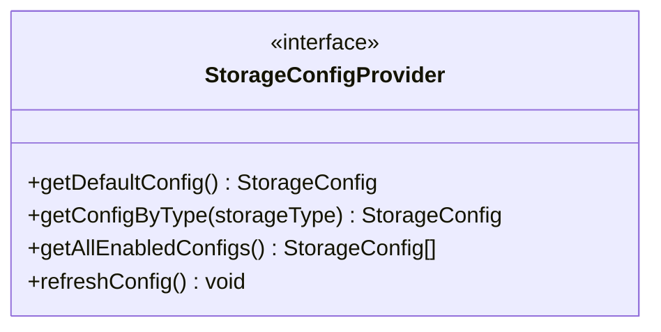
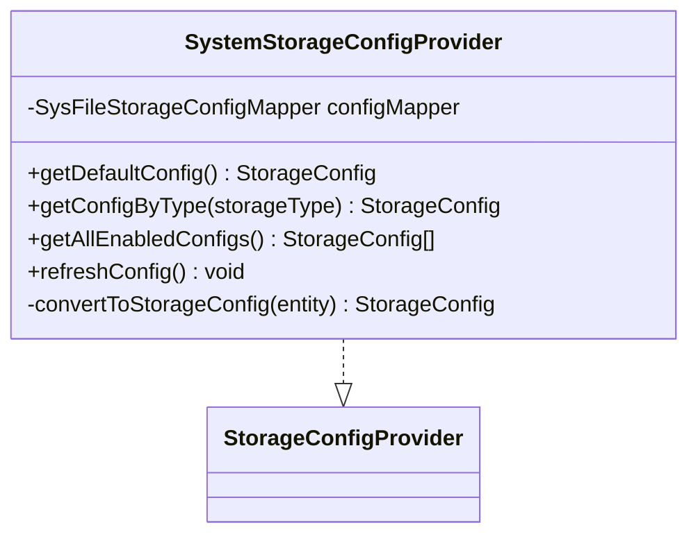
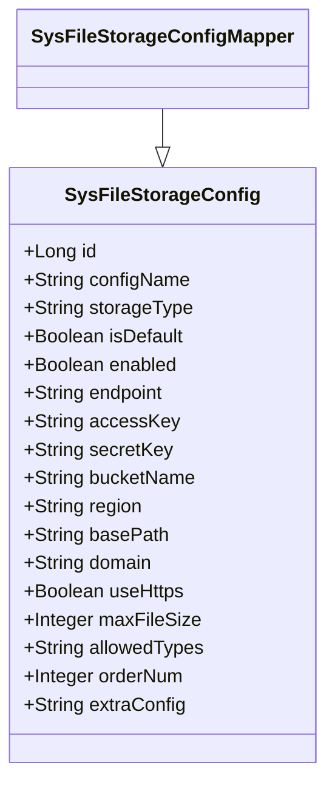
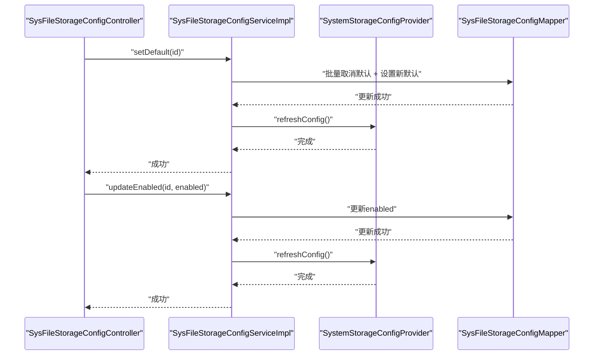
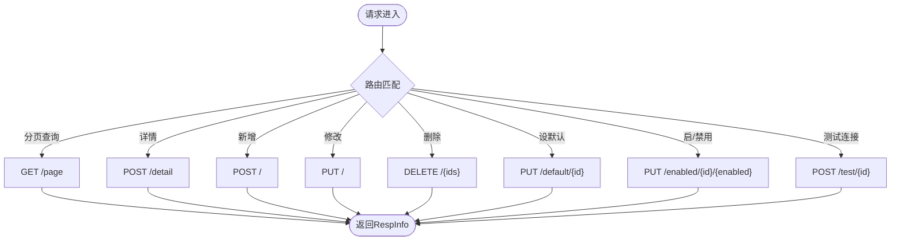
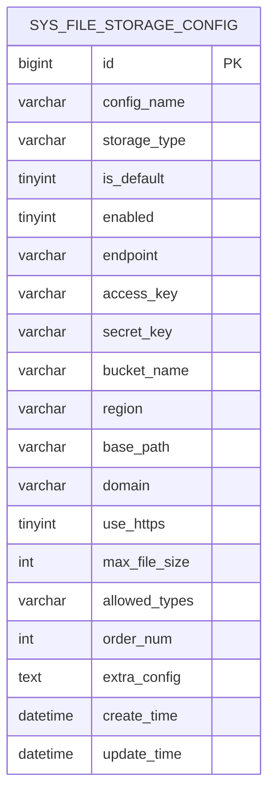
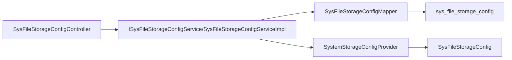

# 存储配置管理

<cite>
**本文档引用的文件**
- [StorageConfig.java](file://forge/forge-framework/forge-starter-parent/forge-starter-file/src/main/java/com/mdframe/forge/starter/file/model/StorageConfig.java)
- [SysFileStorageConfig.java](file://forge/forge-framework/forge-plugin-parent/forge-plugin-system/src/main/java/com/mdframe/forge/plugin/system/entity/SysFileStorageConfig.java)
- [SysFileStorageConfigMapper.java](file://forge/forge-framework/forge-plugin-parent/forge-plugin-system/src/main/java/com/mdframe/forge/plugin/system/mapper/SysFileStorageConfigMapper.java)
- [SystemStorageConfigProvider.java](file://forge/forge-framework/forge-plugin-parent/forge-plugin-system/src/main/java/com/mdframe/forge/plugin/system/service/impl/SystemStorageConfigProvider.java)
- [StorageConfigProvider.java](file://forge/forge-framework/forge-starter-parent/forge-starter-file/src/main/java/com/mdframe/forge/starter/file/spi/StorageConfigProvider.java)
- [SysFileStorageConfigController.java](file://forge/forge-framework/forge-plugin-parent/forge-plugin-system/src/main/java/com/mdframe/forge/plugin/system/controller/SysFileStorageConfigController.java)
- [ISysFileStorageConfigService.java](file://forge/forge-framework/forge-plugin-parent/forge-plugin-system/src/main/java/com/mdframe/forge/plugin/system/service/ISysFileStorageConfigService.java)
- [SysFileStorageConfigServiceImpl.java](file://forge/forge-framework/forge-plugin-parent/forge-plugin-system/src/main/java/com/mdframe/forge/plugin/system/service/impl/SysFileStorageConfigServiceImpl.java)
- [file_storage.sql](file://forge/forge-framework/forge-starter-parent/forge-starter-file/sql/file_storage.sql)
</cite>

## 目录
1. [简介](#简介)
2. [项目结构](#项目结构)
3. [核心组件](#核心组件)
4. [架构总览](#架构总览)
5. [详细组件分析](#详细组件分析)
6. [依赖关系分析](#依赖关系分析)
7. [性能考虑](#性能考虑)
8. [故障排查指南](#故障排查指南)
9. [结论](#结论)
10. [附录](#附录)

## 简介
本指南面向运维与开发人员，系统性讲解Forge框架的存储配置管理模块。内容涵盖存储配置的创建、修改、删除、查询与默认配置设置；深入解析StorageConfig存储配置模型与StorageConfigProvider配置提供者接口的设计与实现；并结合本地存储与云存储（如MinIO）场景，给出配置项详解、参数校验规则、配置模板示例、迁移方案与故障诊断方法，帮助您安全高效地完成文件存储系统的配置与维护。

## 项目结构
存储配置管理模块主要分布在以下位置：
- 模型与SPI接口：forge-starter-file模块中的model与spi包
- 系统插件实现：forge-plugin-system模块中的entity、mapper、service、controller包
- 数据库脚本：forge-starter-file模块中的sql目录

图表来源
- [StorageConfig.java](file://forge/forge-framework/forge-starter-parent/forge-starter-file/src/main/java/com/mdframe/forge/starter/file/model/StorageConfig.java#L1-L109)
- [StorageConfigProvider.java](file://forge/forge-framework/forge-starter-parent/forge-starter-file/src/main/java/com/mdframe/forge/starter/file/spi/StorageConfigProvider.java#L1-L32)
- [SysFileStorageConfig.java](file://forge/forge-framework/forge-plugin-parent/forge-plugin-system/src/main/java/com/mdframe/forge/plugin/system/entity/SysFileStorageConfig.java#L1-L102)
- [SysFileStorageConfigMapper.java](file://forge/forge-framework/forge-plugin-parent/forge-plugin-system/src/main/java/com/mdframe/forge/plugin/system/mapper/SysFileStorageConfigMapper.java#L1-L13)
- [SystemStorageConfigProvider.java](file://forge/forge-framework/forge-plugin-parent/forge-plugin-system/src/main/java/com/mdframe/forge/plugin/system/service/impl/SystemStorageConfigProvider.java#L1-L94)
- [ISysFileStorageConfigService.java](file://forge/forge-framework/forge-plugin-parent/forge-plugin-system/src/main/java/com/mdframe/forge/plugin/system/service/ISysFileStorageConfigService.java#L1-L33)
- [SysFileStorageConfigServiceImpl.java](file://forge/forge-framework/forge-plugin-parent/forge-plugin-system/src/main/java/com/mdframe/forge/plugin/system/service/impl/SysFileStorageConfigServiceImpl.java#L1-L108)
- [file_storage.sql](file://forge/forge-framework/forge-starter-parent/forge-starter-file/sql/file_storage.sql#L1-L74)

章节来源
- [SysFileStorageConfigController.java](file://forge/forge-framework/forge-plugin-parent/forge-plugin-system/src/main/java/com/mdframe/forge/plugin/system/controller/SysFileStorageConfigController.java#L1-L98)
- [file_storage.sql](file://forge/forge-framework/forge-starter-parent/forge-starter-file/sql/file_storage.sql#L1-L74)

## 核心组件
- StorageConfig：存储策略配置模型，定义了配置ID、名称、类型、默认标记、启用状态、访问端点、密钥信息、存储桶、区域、基础路径、访问域名、HTTPS开关、最大文件大小、允许的文件类型、排序、扩展配置等字段，并提供将逗号分隔的类型字符串转换为列表的方法。
- StorageConfigProvider：配置提供者SPI接口，定义获取默认配置、按类型获取配置、获取所有启用配置以及刷新缓存的方法。
- SystemStorageConfigProvider：系统插件实现，基于MyBatis从sys_file_storage_config表读取配置，支持按默认标记与启用状态查询，并提供转换为StorageConfig对象的能力。
- SysFileStorageConfig：数据库实体，映射sys_file_storage_config表，包含与StorageConfig一致的字段。
- SysFileStorageConfigMapper：MyBatis Mapper接口，继承BaseMapper以获得通用CRUD能力。
- ISysFileStorageConfigService/SysFileStorageConfigServiceImpl：服务层接口与实现，提供分页查询、设置默认配置、启用/禁用、连接测试等业务逻辑，并在变更时调用Provider刷新缓存。
- SysFileStorageConfigController：REST控制器，提供分页查询、详情、新增、修改、删除、设置默认、启用/禁用、连接测试等接口。
- sys_file_storage_config：存储配置表，包含索引与初始化数据，支持本地与MinIO等存储类型的配置。

章节来源
- [StorageConfig.java](file://forge/forge-framework/forge-starter-parent/forge-starter-file/src/main/java/com/mdframe/forge/starter/file/model/StorageConfig.java#L1-L109)
- [StorageConfigProvider.java](file://forge/forge-framework/forge-starter-parent/forge-starter-file/src/main/java/com/mdframe/forge/starter/file/spi/StorageConfigProvider.java#L1-L32)
- [SystemStorageConfigProvider.java](file://forge/forge-framework/forge-plugin-parent/forge-plugin-system/src/main/java/com/mdframe/forge/plugin/system/service/impl/SystemStorageConfigProvider.java#L1-L94)
- [SysFileStorageConfig.java](file://forge/forge-framework/forge-plugin-parent/forge-plugin-system/src/main/java/com/mdframe/forge/plugin/system/entity/SysFileStorageConfig.java#L1-L102)
- [SysFileStorageConfigMapper.java](file://forge/forge-framework/forge-plugin-parent/forge-plugin-system/src/main/java/com/mdframe/forge/plugin/system/mapper/SysFileStorageConfigMapper.java#L1-L13)
- [ISysFileStorageConfigService.java](file://forge/forge-framework/forge-plugin-parent/forge-plugin-system/src/main/java/com/mdframe/forge/plugin/system/service/ISysFileStorageConfigService.java#L1-L33)
- [SysFileStorageConfigServiceImpl.java](file://forge/forge-framework/forge-plugin-parent/forge-plugin-system/src/main/java/com/mdframe/forge/plugin/system/service/impl/SysFileStorageConfigServiceImpl.java#L1-L108)
- [SysFileStorageConfigController.java](file://forge/forge-framework/forge-plugin-parent/forge-plugin-system/src/main/java/com/mdframe/forge/plugin/system/controller/SysFileStorageConfigController.java#L1-L98)
- [file_storage.sql](file://forge/forge-framework/forge-starter-parent/forge-starter-file/sql/file_storage.sql#L1-L74)

## 架构总览
存储配置管理采用“模型-提供者-服务-控制器-数据库”的分层架构：
- 控制器接收请求，调用服务层处理业务。
- 服务层负责事务与业务规则，必要时通过Provider读取或刷新配置。
- Provider实现从数据库读取配置，转换为StorageConfig供上层使用。
- 数据库表sys_file_storage_config持久化配置，包含索引优化与初始化数据。

图表来源
- [SysFileStorageConfigController.java](file://forge/forge-framework/forge-plugin-parent/forge-plugin-system/src/main/java/com/mdframe/forge/plugin/system/controller/SysFileStorageConfigController.java#L46-L79)
- [SysFileStorageConfigServiceImpl.java](file://forge/forge-framework/forge-plugin-parent/forge-plugin-system/src/main/java/com/mdframe/forge/plugin/system/service/impl/SysFileStorageConfigServiceImpl.java#L55-L71)
- [SystemStorageConfigProvider.java](file://forge/forge-framework/forge-plugin-parent/forge-plugin-system/src/main/java/com/mdframe/forge/plugin/system/service/impl/SystemStorageConfigProvider.java#L78-L82)
- [SysFileStorageConfigMapper.java](file://forge/forge-framework/forge-plugin-parent/forge-plugin-system/src/main/java/com/mdframe/forge/plugin/system/mapper/SysFileStorageConfigMapper.java#L1-L13)
- [file_storage.sql](file://forge/forge-framework/forge-starter-parent/forge-starter-file/sql/file_storage.sql#L4-L26)

## 详细组件分析

### StorageConfig 存储配置模型
- 字段覆盖范围广，包括基础信息（ID、名称、类型）、访问凭证（端点、密钥、桶名、区域）、路径与域名（基础路径、访问域名、HTTPS）、容量与类型限制（最大文件大小、允许类型）、排序与扩展配置等。
- 提供将逗号分隔的类型字符串转换为列表的便捷方法，便于后续校验与匹配。

图表来源
- [StorageConfig.java](file://forge/forge-framework/forge-starter-parent/forge-starter-file/src/main/java/com/mdframe/forge/starter/file/model/StorageConfig.java#L11-L108)

章节来源
- [StorageConfig.java](file://forge/forge-framework/forge-starter-parent/forge-starter-file/src/main/java/com/mdframe/forge/starter/file/model/StorageConfig.java#L1-L109)

### StorageConfigProvider 配置提供者接口
- 定义四类核心能力：获取默认配置、按类型获取配置、获取所有启用配置、刷新缓存。
- 该接口作为SPI，由具体业务模块实现，确保配置读取与缓存策略可插拔。

图表来源
- [StorageConfigProvider.java](file://forge/forge-framework/forge-starter-parent/forge-starter-file/src/main/java/com/mdframe/forge/starter/file/spi/StorageConfigProvider.java#L11-L32)

章节来源
- [StorageConfigProvider.java](file://forge/forge-framework/forge-starter-parent/forge-starter-file/src/main/java/com/mdframe/forge/starter/file/spi/StorageConfigProvider.java#L1-L32)

### SystemStorageConfigProvider 配置提供者实现
- 使用LambdaQueryWrapper按默认标记与启用状态查询，默认取第一条记录；按类型查询同样要求启用状态。
- 将数据库实体转换为StorageConfig对象，便于上层统一使用。
- 提供刷新缓存入口，日志提示刷新动作。

图表来源
- [SystemStorageConfigProvider.java](file://forge/forge-framework/forge-plugin-parent/forge-plugin-system/src/main/java/com/mdframe/forge/plugin/system/service/impl/SystemStorageConfigProvider.java#L24-L94)
- [SysFileStorageConfigMapper.java](file://forge/forge-framework/forge-plugin-parent/forge-plugin-system/src/main/java/com/mdframe/forge/plugin/system/mapper/SysFileStorageConfigMapper.java#L1-L13)

章节来源
- [SystemStorageConfigProvider.java](file://forge/forge-framework/forge-plugin-parent/forge-plugin-system/src/main/java/com/mdframe/forge/plugin/system/service/impl/SystemStorageConfigProvider.java#L1-L94)

### SysFileStorageConfig 实体与 Mapper
- 实体映射sys_file_storage_config表，字段与StorageConfig保持一致，便于直接转换。
- Mapper继承BaseMapper，提供通用CRUD能力。

图表来源
- [SysFileStorageConfig.java](file://forge/forge-framework/forge-plugin-parent/forge-plugin-system/src/main/java/com/mdframe/forge/plugin/system/entity/SysFileStorageConfig.java#L16-L101)
- [SysFileStorageConfigMapper.java](file://forge/forge-framework/forge-plugin-parent/forge-plugin-system/src/main/java/com/mdframe/forge/plugin/system/mapper/SysFileStorageConfigMapper.java#L10-L12)

章节来源
- [SysFileStorageConfig.java](file://forge/forge-framework/forge-plugin-parent/forge-plugin-system/src/main/java/com/mdframe/forge/plugin/system/entity/SysFileStorageConfig.java#L1-L102)
- [SysFileStorageConfigMapper.java](file://forge/forge-framework/forge-plugin-parent/forge-plugin-system/src/main/java/com/mdframe/forge/plugin/system/mapper/SysFileStorageConfigMapper.java#L1-L13)

### 服务层：ISysFileStorageConfigService 与 SysFileStorageConfigServiceImpl
- 分页查询支持按配置名称、存储类型、启用状态过滤，并优先展示默认配置，再按排序字段升序排列。
- 设置默认配置与启用/禁用均使用事务更新，完成后调用Provider刷新缓存。
- 连接测试通过Provider按类型获取配置后进行连通性判断（当前实现返回成功，实际可扩展具体测试逻辑）。

图表来源
- [SysFileStorageConfigController.java](file://forge/forge-framework/forge-plugin-parent/forge-plugin-system/src/main/java/com/mdframe/forge/plugin/system/controller/SysFileStorageConfigController.java#L75-L88)
- [SysFileStorageConfigServiceImpl.java](file://forge/forge-framework/forge-plugin-parent/forge-plugin-system/src/main/java/com/mdframe/forge/plugin/system/service/impl/SysFileStorageConfigServiceImpl.java#L55-L83)
- [SystemStorageConfigProvider.java](file://forge/forge-framework/forge-plugin-parent/forge-plugin-system/src/main/java/com/mdframe/forge/plugin/system/service/impl/SystemStorageConfigProvider.java#L78-L82)

章节来源
- [ISysFileStorageConfigService.java](file://forge/forge-framework/forge-plugin-parent/forge-plugin-system/src/main/java/com/mdframe/forge/plugin/system/service/ISysFileStorageConfigService.java#L1-L33)
- [SysFileStorageConfigServiceImpl.java](file://forge/forge-framework/forge-plugin-parent/forge-plugin-system/src/main/java/com/mdframe/forge/plugin/system/service/impl/SysFileStorageConfigServiceImpl.java#L1-L108)

### 控制器：SysFileStorageConfigController
- 提供分页查询、详情、新增、修改、删除、设置默认、启用/禁用、连接测试等REST接口。
- 统一使用RespInfo响应包装，接口注解支持加解密与权限忽略。

图表来源
- [SysFileStorageConfigController.java](file://forge/forge-framework/forge-plugin-parent/forge-plugin-system/src/main/java/com/mdframe/forge/plugin/system/controller/SysFileStorageConfigController.java#L27-L96)

章节来源
- [SysFileStorageConfigController.java](file://forge/forge-framework/forge-plugin-parent/forge-plugin-system/src/main/java/com/mdframe/forge/plugin/system/controller/SysFileStorageConfigController.java#L1-L98)

### 数据模型：sys_file_storage_config 表
- 字段覆盖全面，包含索引优化（存储类型、默认标记），并提供初始化数据示例（本地存储与MinIO）。
- 支持多存储类型扩展，便于接入不同云厂商或本地文件系统。

图表来源
- [file_storage.sql](file://forge/forge-framework/forge-starter-parent/forge-starter-file/sql/file_storage.sql#L4-L26)

章节来源
- [file_storage.sql](file://forge/forge-framework/forge-starter-parent/forge-starter-file/sql/file_storage.sql#L1-L74)

## 依赖关系分析
- 控制器依赖服务接口，服务实现依赖Mapper与Provider，Provider依赖Mapper与数据库实体。
- 服务层在关键变更（设置默认、启用/禁用）后调用Provider刷新缓存，保证配置一致性。
- 数据库表包含索引，提升查询效率。

图表来源
- [SysFileStorageConfigController.java](file://forge/forge-framework/forge-plugin-parent/forge-plugin-system/src/main/java/com/mdframe/forge/plugin/system/controller/SysFileStorageConfigController.java#L25-L26)
- [SysFileStorageConfigServiceImpl.java](file://forge/forge-framework/forge-plugin-parent/forge-plugin-system/src/main/java/com/mdframe/forge/plugin/system/service/impl/SysFileStorageConfigServiceImpl.java#L31-L32)
- [SystemStorageConfigProvider.java](file://forge/forge-framework/forge-plugin-parent/forge-plugin-system/src/main/java/com/mdframe/forge/plugin/system/service/impl/SystemStorageConfigProvider.java#L26)
- [SysFileStorageConfigMapper.java](file://forge/forge-framework/forge-plugin-parent/forge-plugin-system/src/main/java/com/mdframe/forge/plugin/system/mapper/SysFileStorageConfigMapper.java#L10-L12)
- [file_storage.sql](file://forge/forge-framework/forge-starter-parent/forge-starter-file/sql/file_storage.sql#L24-L25)

章节来源
- [SysFileStorageConfigServiceImpl.java](file://forge/forge-framework/forge-plugin-parent/forge-plugin-system/src/main/java/com/mdframe/forge/plugin/system/service/impl/SysFileStorageConfigServiceImpl.java#L1-L108)
- [SystemStorageConfigProvider.java](file://forge/forge-framework/forge-plugin-parent/forge-plugin-system/src/main/java/com/mdframe/forge/plugin/system/service/impl/SystemStorageConfigProvider.java#L1-L94)

## 性能考虑
- 查询优化：表对存储类型与默认标记建立索引，Provider按条件查询时可利用索引提升性能。
- 缓存策略：Provider预留缓存注解（被注释），可在高并发场景下启用缓存以减少数据库压力；变更配置后及时刷新。
- 分页与排序：服务层分页查询按默认优先与排序字段升序排列，避免全表扫描。
- 连接测试：当前实现返回成功，建议在生产环境扩展具体测试逻辑（如列举桶、上传小文件等）以降低误判风险。

## 故障排查指南
- 未找到默认配置：当未设置默认或默认配置未启用时，Provider会记录告警并返回空值。请检查sys_file_storage_config中is_default与enabled字段。
- 未找到指定类型配置：按storage_type查询不到启用配置时会记录告警。请确认storage_type拼写与启用状态。
- 设置默认失败：若同时存在多个默认标记，应先取消其他默认再设置新默认。服务层已实现批量取消逻辑。
- 启用/禁用异常：检查对应记录是否存在，以及数据库事务是否回滚导致状态未更新。
- 连接测试失败：当前实现返回成功，若集成具体存储实现，请在服务层补充相应测试逻辑并捕获异常以便定位问题。

章节来源
- [SystemStorageConfigProvider.java](file://forge/forge-framework/forge-plugin-parent/forge-plugin-system/src/main/java/com/mdframe/forge/plugin/system/service/impl/SystemStorageConfigProvider.java#L38-L43)
- [SysFileStorageConfigServiceImpl.java](file://forge/forge-framework/forge-plugin-parent/forge-plugin-system/src/main/java/com/mdframe/forge/plugin/system/service/impl/SysFileStorageConfigServiceImpl.java#L86-L106)

## 结论
Forge框架的存储配置管理模块通过清晰的分层设计与SPI接口，实现了配置的灵活读取与统一管理。配合数据库表的索引与初始化数据，能够快速支撑本地与云存储场景。建议在生产环境中启用Provider缓存并在关键变更后刷新，同时完善连接测试逻辑以提升可靠性。

## 附录

### 配置项详解与参数校验规则
- 基础信息
  - 配置名称：必填，长度限制见数据库定义。
  - 存储类型：必填，如local、minio等，用于区分存储实现。
  - 是否默认策略：布尔值，同一时刻仅允许一个默认配置。
  - 是否启用：布尔值，禁用后不参与选择。
- 访问凭证
  - 访问端点：访问地址，如云厂商API端点或本地HTTP地址。
  - 访问密钥ID/密钥Secret：访问凭证，建议加密存储。
  - 存储桶名称：云存储桶名或本地根目录标识。
  - 区域：云存储区域信息。
- 路径与域名
  - 基础路径：本地存储的基础目录。
  - 访问域名：对外访问域名，用于生成公开URL。
  - 是否使用HTTPS：布尔值，影响URL协议与安全性。
- 容量与类型限制
  - 最大文件大小（MB）：整数，建议结合业务设定合理上限。
  - 允许的文件类型：逗号分隔的扩展名列表，便于前端与后端校验。
- 排序与扩展配置
  - 排序：整数，用于多配置时的优先级。
  - 扩展配置：JSON格式字符串，用于承载特定实现所需的额外参数。

章节来源
- [StorageConfig.java](file://forge/forge-framework/forge-starter-parent/forge-starter-file/src/main/java/com/mdframe/forge/starter/file/model/StorageConfig.java#L14-L97)
- [SysFileStorageConfig.java](file://forge/forge-framework/forge-plugin-parent/forge-plugin-system/src/main/java/com/mdframe/forge/plugin/system/entity/SysFileStorageConfig.java#L22-L100)

### 配置模板示例
- 本地存储示例
  - 配置名称：本地存储
  - 存储类型：local
  - 是否默认策略：是
  - 是否启用：是
  - 基础路径：/data/files/
  - 最大文件大小：100 MB
  - 允许的文件类型：jpg,jpeg,png,gif,pdf,doc,docx,xls,xlsx,zip,rar
  - 排序：1
- MinIO存储示例
  - 配置名称：MinIO存储
  - 存储类型：minio
  - 是否默认策略：否
  - 是否启用：否
  - 访问端点：http://localhost:9000
  - 访问密钥ID/密钥：minioadmin/minioadmin
  - 存储桶名称：forge-files
  - 是否使用HTTPS：否
  - 最大文件大小：500 MB
  - 允许的文件类型：jpg,jpeg,png,gif,pdf,doc,docx,xls,xlsx,zip,rar,mp4,mp3
  - 排序：2

章节来源
- [file_storage.sql](file://forge/forge-framework/forge-starter-parent/forge-starter-file/sql/file_storage.sql#L65-L74)

### 配置迁移方案
- 新增存储类型：在数据库表中插入新记录，设置合适的storage_type与启用状态；如需默认配置，先取消既有默认再设置新默认。
- 参数调整：通过修改对应字段（如最大文件大小、允许类型、基础路径等）实现；变更后调用刷新缓存接口。
- 多环境迁移：导出目标环境的sys_file_storage_config数据，导入到其他环境；注意密钥与端点的差异。

章节来源
- [SysFileStorageConfigServiceImpl.java](file://forge/forge-framework/forge-plugin-parent/forge-plugin-system/src/main/java/com/mdframe/forge/plugin/system/service/impl/SysFileStorageConfigServiceImpl.java#L55-L83)
- [SystemStorageConfigProvider.java](file://forge/forge-framework/forge-plugin-parent/forge-plugin-system/src/main/java/com/mdframe/forge/plugin/system/service/impl/SystemStorageConfigProvider.java#L78-L82)