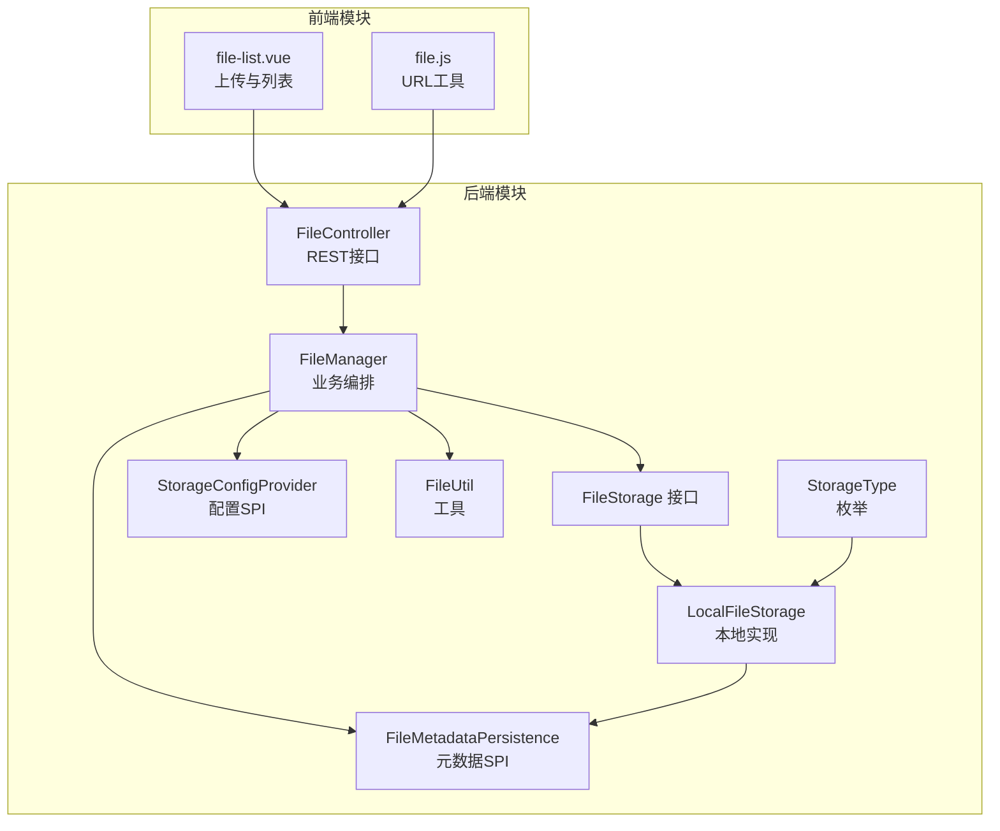
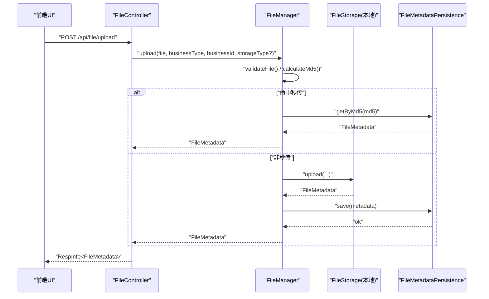
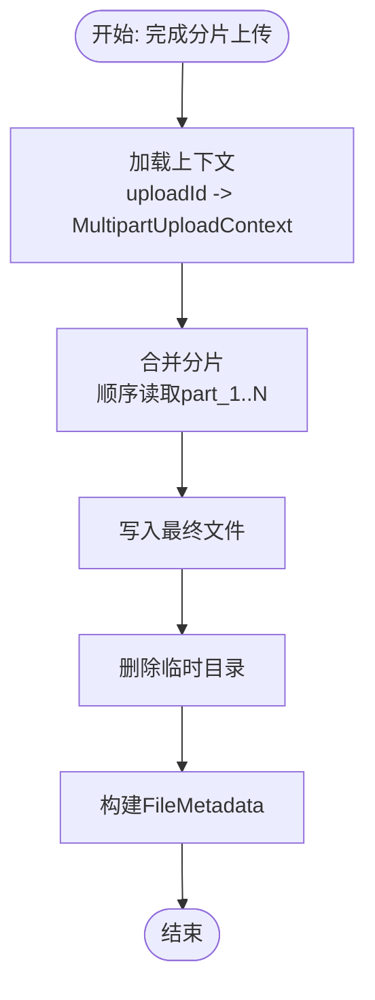
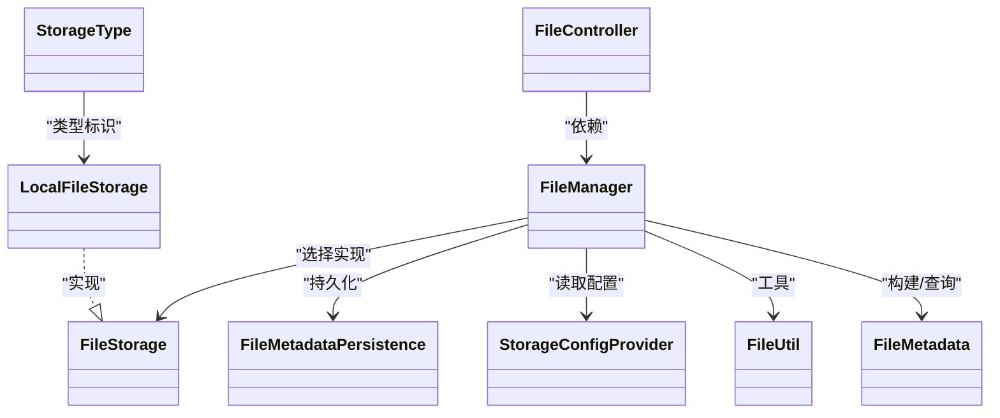

# 文件上传机制

<cite>
**本文引用的文件**
- [FileController.java](file://forge/forge-framework/forge-starter-parent/forge-starter-file/src/main/java/com/mdframe/forge/starter/file/controller/FileController.java)
- [FileManager.java](file://forge/forge-framework/forge-starter-parent/forge-starter-file/src/main/java/com/mdframe/forge/starter/file/core/FileManager.java)
- [FileMetadata.java](file://forge/forge-framework/forge-starter-parent/forge-starter-file/src/main/java/com/mdframe/forge/starter/file/model/FileMetadata.java)
- [LocalFileStorage.java](file://forge/forge-framework/forge-starter-parent/forge-starter-file/src/main/java/com/mdframe/forge/starter/file/storage/impl/LocalFileStorage.java)
- [FileStorage.java](file://forge/forge-framework/forge-starter-parent/forge-starter-file/src/main/java/com/mdframe/forge/starter/file/storage/FileStorage.java)
- [FileMetadataPersistence.java](file://forge/forge-framework/forge-starter-parent/forge-starter-file/src/main/java/com/mdframe/forge/starter/file/spi/FileMetadataPersistence.java)
- [StorageConfigProvider.java](file://forge/forge-framework/forge-starter-parent/forge-starter-file/src/main/java/com/mdframe/forge/starter/file/spi/StorageConfigProvider.java)
- [FileStorageProperties.java](file://forge/forge-framework/forge-starter-parent/forge-starter-file/src/main/java/com/mdframe/forge/starter/file/config/FileStorageProperties.java)
- [StorageType.java](file://forge/forge-framework/forge-starter-parent/forge-starter-file/src/main/java/com/mdframe/forge/starter/file/enums/StorageType.java)
- [FileUtil.java](file://forge/forge-framework/forge-starter-parent/forge-starter-file/src/main/java/com/mdframe/forge/starter/file/util/FileUtil.java)
- [file_storage.sql](file://forge/forge-framework/forge-starter-parent/forge-starter-file/sql/file_storage.sql)
- [file.js](file://forge-admin-ui/src/utils/file.js)
- [file-list.vue](file://forge-admin-ui/src/views/system/file-list.vue)
</cite>

## 目录
1. [引言](#引言)
2. [项目结构](#项目结构)
3. [核心组件](#核心组件)
4. [架构总览](#架构总览)
5. [详细组件分析](#详细组件分析)
6. [依赖关系分析](#依赖关系分析)
7. [性能考虑](#性能考虑)
8. [故障排查指南](#故障排查指南)
9. [结论](#结论)
10. [附录](#附录)

## 引言
本文件面向Forge框架的文件上传能力，系统性梳理单文件上传、分片上传与断点续传的完整实现流程与技术细节，深入解析控制器、文件管理器、元数据模型与存储策略接口之间的协作关系，并给出API说明、参数配置、并发控制策略、性能优化建议与安全防护要点，帮助开发者快速构建稳定高效的文件上传功能。

## 项目结构
围绕文件上传的关键代码位于“forge-starter-file”模块中，采用“控制器-管理器-存储策略-元数据”的分层设计；前端在“forge-admin-ui”中提供上传入口与文件列表展示。

图表来源
- [FileController.java](file://forge/forge-framework/forge-starter-parent/forge-starter-file/src/main/java/com/mdframe/forge/starter/file/controller/FileController.java#L1-L117)
- [FileManager.java](file://forge/forge-framework/forge-starter-parent/forge-starter-file/src/main/java/com/mdframe/forge/starter/file/core/FileManager.java#L1-L255)
- [FileStorage.java](file://forge/forge-framework/forge-starter-parent/forge-starter-file/src/main/java/com/mdframe/forge/starter/file/storage/FileStorage.java#L1-L110)
- [LocalFileStorage.java](file://forge/forge-framework/forge-starter-parent/forge-starter-file/src/main/java/com/mdframe/forge/starter/file/storage/impl/LocalFileStorage.java#L1-L439)
- [FileMetadataPersistence.java](file://forge/forge-framework/forge-starter-parent/forge-starter-file/src/main/java/com/mdframe/forge/starter/file/spi/FileMetadataPersistence.java#L1-L41)
- [StorageConfigProvider.java](file://forge/forge-framework/forge-starter-parent/forge-starter-file/src/main/java/com/mdframe/forge/starter/file/spi/StorageConfigProvider.java#L1-L33)
- [FileUtil.java](file://forge/forge-framework/forge-starter-parent/forge-starter-file/src/main/java/com/mdframe/forge/starter/file/util/FileUtil.java#L1-L130)
- [StorageType.java](file://forge/forge-framework/forge-starter-parent/forge-starter-file/src/main/java/com/mdframe/forge/starter/file/enums/StorageType.java#L1-L50)
- [file-list.vue](file://forge-admin-ui/src/views/system/file-list.vue#L1-L800)
- [file.js](file://forge-admin-ui/src/utils/file.js#L1-L92)

章节来源
- [FileController.java](file://forge/forge-framework/forge-starter-parent/forge-starter-file/src/main/java/com/mdframe/forge/starter/file/controller/FileController.java#L1-L117)
- [FileManager.java](file://forge/forge-framework/forge-starter-parent/forge-starter-file/src/main/java/com/mdframe/forge/starter/file/core/FileManager.java#L1-L255)
- [LocalFileStorage.java](file://forge/forge-framework/forge-starter-parent/forge-starter-file/src/main/java/com/mdframe/forge/starter/file/storage/impl/LocalFileStorage.java#L1-L439)
- [file-list.vue](file://forge-admin-ui/src/views/system/file-list.vue#L1-L800)
- [file.js](file://forge-admin-ui/src/utils/file.js#L1-L92)

## 核心组件
- 控制器层：提供统一REST接口，封装上传、下载、获取访问URL、删除以及分片上传的初始化/上传/完成三个步骤。
- 管理器层：负责业务编排、文件校验、秒传检测、存储策略选择、元数据持久化与下载计数更新。
- 存储策略层：抽象统一接口，当前提供本地文件系统实现，可扩展MinIO、OSS等云端存储。
- 元数据层：描述文件的元信息，包括业务标识、存储位置、访问URL、下载计数等。
- SPI接口：元数据持久化与存储配置提供者，便于业务模块按需实现。

章节来源
- [FileController.java](file://forge/forge-framework/forge-starter-parent/forge-starter-file/src/main/java/com/mdframe/forge/starter/file/controller/FileController.java#L16-L117)
- [FileManager.java](file://forge/forge-framework/forge-starter-parent/forge-starter-file/src/main/java/com/mdframe/forge/starter/file/core/FileManager.java#L23-L255)
- [FileStorage.java](file://forge/forge-framework/forge-starter-parent/forge-starter-file/src/main/java/com/mdframe/forge/starter/file/storage/FileStorage.java#L9-L110)
- [FileMetadata.java](file://forge/forge-framework/forge-starter-parent/forge-starter-file/src/main/java/com/mdframe/forge/starter/file/model/FileMetadata.java#L8-L110)
- [FileMetadataPersistence.java](file://forge/forge-framework/forge-starter-parent/forge-starter-file/src/main/java/com/mdframe/forge/starter/file/spi/FileMetadataPersistence.java#L5-L41)
- [StorageConfigProvider.java](file://forge/forge-framework/forge-starter-parent/forge-starter-file/src/main/java/com/mdframe/forge/starter/file/spi/StorageConfigProvider.java#L7-L33)

## 架构总览
文件上传在后端以“控制器-管理器-存储策略-元数据”的链路运行，前端通过统一上传入口调用后端接口，下载与访问URL通过后端路由转发到具体存储策略实现。

图表来源
- [FileController.java](file://forge/forge-framework/forge-starter-parent/forge-starter-file/src/main/java/com/mdframe/forge/starter/file/controller/FileController.java#L28-L43)
- [FileManager.java](file://forge/forge-framework/forge-starter-parent/forge-starter-file/src/main/java/com/mdframe/forge/starter/file/core/FileManager.java#L58-L99)
- [LocalFileStorage.java](file://forge/forge-framework/forge-starter-parent/forge-starter-file/src/main/java/com/mdframe/forge/starter/file/storage/impl/LocalFileStorage.java#L72-L134)
- [FileMetadataPersistence.java](file://forge/forge-framework/forge-starter-parent/forge-starter-file/src/main/java/com/mdframe/forge/starter/file/spi/FileMetadataPersistence.java#L11-L14)

## 详细组件分析

### 控制器：FileController
- 单文件上传：接收multipart文件，支持业务类型、业务ID、存储类型参数，调用管理器执行上传。
- 下载：根据文件ID输出文件流，设置正确的响应头。
- 获取访问URL：基于存储策略返回可访问地址（本地策略返回后端下载路由）。
- 删除：删除物理文件与元数据。
- 分片上传：提供初始化、上传分片、完成合并三步接口，支持指定存储类型。

章节来源
- [FileController.java](file://forge/forge-framework/forge-starter-parent/forge-starter-file/src/main/java/com/mdframe/forge/starter/file/controller/FileController.java#L28-L117)

### 管理器：FileManager
- 存储注册与选择：维护存储策略映射，按存储类型选择对应实现。
- 单文件上传：校验文件、计算MD5、尝试秒传、调用存储策略上传、持久化元数据。
- 下载：查询元数据、选择存储策略、输出流、更新下载次数。
- 访问URL：查询元数据、选择存储策略、生成URL。
- 删除：删除物理文件与元数据。
- 分片上传：委派给存储策略，完成后持久化元数据。

章节来源
- [FileManager.java](file://forge/forge-framework/forge-starter-parent/forge-starter-file/src/main/java/com/mdframe/forge/starter/file/core/FileManager.java#L30-L255)

### 存储策略接口：FileStorage 与本地实现：LocalFileStorage
- 接口职责：统一上传、分片上传、下载、访问URL、删除、存在性检查。
- 本地实现要点：
  - 初始化：读取配置，确保基础目录存在。
  - 单文件上传：生成存储名与相对路径，写入文件，构建元数据。
  - 分片上传：生成uploadId与临时目录，保存分片文件，按顺序合并，清理临时目录。
  - 下载/删除/存在性：基于文件路径操作。
  - 访问URL：本地策略返回后端下载路由（可结合域名配置）。

图表来源
- [LocalFileStorage.java](file://forge/forge-framework/forge-starter-parent/forge-starter-file/src/main/java/com/mdframe/forge/starter/file/storage/impl/LocalFileStorage.java#L188-L255)

章节来源
- [FileStorage.java](file://forge/forge-framework/forge-starter-parent/forge-starter-file/src/main/java/com/mdframe/forge/starter/file/storage/FileStorage.java#L9-L110)
- [LocalFileStorage.java](file://forge/forge-framework/forge-starter-parent/forge-starter-file/src/main/java/com/mdframe/forge/starter/file/storage/impl/LocalFileStorage.java#L24-L439)

### 元数据模型：FileMetadata
- 字段覆盖：文件ID、原始名、存储名、路径、大小、MIME、扩展名、MD5、存储类型、桶/命名空间、访问URL、缩略图URL、业务类型/ID、上传者ID、上传时间、过期时间、私有标记、下载次数。
- 用途：贯穿上传、下载、访问URL生成、删除等流程，作为跨模块的数据契约。

章节来源
- [FileMetadata.java](file://forge/forge-framework/forge-starter-parent/forge-starter-file/src/main/java/com/mdframe/forge/starter/file/model/FileMetadata.java#L8-L110)

### SPI与配置
- FileMetadataPersistence：业务模块实现，负责元数据的保存、查询、按MD5查询、下载次数递增、删除与权限检查。
- StorageConfigProvider：业务模块实现，提供默认配置、按类型配置、启用配置列表与刷新缓存。
- FileStorageProperties：启用通用API开关与默认存储类型。

章节来源
- [FileMetadataPersistence.java](file://forge/forge-framework/forge-starter-parent/forge-starter-file/src/main/java/com/mdframe/forge/starter/file/spi/FileMetadataPersistence.java#L5-L41)
- [StorageConfigProvider.java](file://forge/forge-framework/forge-starter-parent/forge-starter-file/src/main/java/com/mdframe/forge/starter/file/spi/StorageConfigProvider.java#L7-L33)
- [FileStorageProperties.java](file://forge/forge-framework/forge-starter-parent/forge-starter-file/src/main/java/com/mdframe/forge/starter/file/config/FileStorageProperties.java#L7-L25)

### 工具与枚举
- FileUtil：扩展名提取、存储名生成、路径生成、MD5计算、文件大小格式化、MIME检测。
- StorageType：存储类型枚举，支持本地与多家云存储。

章节来源
- [FileUtil.java](file://forge/forge-framework/forge-starter-parent/forge-starter-file/src/main/java/com/mdframe/forge/starter/file/util/FileUtil.java#L12-L130)
- [StorageType.java](file://forge/forge-framework/forge-starter-parent/forge-starter-file/src/main/java/com/mdframe/forge/starter/file/enums/StorageType.java#L6-L50)

### 数据库脚本
- sys_file_storage_config：存储配置表，包含存储类型、端点、密钥、桶、域名、大小限制、允许类型等。
- sys_file_metadata：文件元数据表，包含文件ID、原始名、存储名、路径、大小、MIME、扩展名、MD5、存储类型、业务标识、上传时间、下载次数等。

章节来源
- [file_storage.sql](file://forge/forge-framework/forge-starter-parent/forge-starter-file/sql/file_storage.sql#L1-L75)

### 前端集成
- file-list.vue：提供上传按钮、文件列表、网格视图、预览、下载、复制链接、删除等能力；上传目标指向后端统一上传接口。
- file.js：提供文件URL构建、下载URL生成、图片预览URL拼装等工具。

章节来源
- [file-list.vue](file://forge-admin-ui/src/views/system/file-list.vue#L110-L127)
- [file.js](file://forge-admin-ui/src/utils/file.js#L12-L92)

## 依赖关系分析
- 控制器依赖管理器；管理器依赖存储策略接口与SPI；本地存储实现依赖元数据持久化SPI。
- 配置提供者与存储配置联动，决定文件大小与类型限制、默认存储类型等。
- 前端通过统一上传接口与下载接口对接后端。

图表来源
- [FileController.java](file://forge/forge-framework/forge-starter-parent/forge-starter-file/src/main/java/com/mdframe/forge/starter/file/controller/FileController.java#L1-L117)
- [FileManager.java](file://forge/forge-framework/forge-starter-parent/forge-starter-file/src/main/java/com/mdframe/forge/starter/file/core/FileManager.java#L1-L255)
- [FileStorage.java](file://forge/forge-framework/forge-starter-parent/forge-starter-file/src/main/java/com/mdframe/forge/starter/file/storage/FileStorage.java#L1-L110)
- [LocalFileStorage.java](file://forge/forge-framework/forge-starter-parent/forge-starter-file/src/main/java/com/mdframe/forge/starter/file/storage/impl/LocalFileStorage.java#L1-L439)
- [FileMetadataPersistence.java](file://forge/forge-framework/forge-starter-parent/forge-starter-file/src/main/java/com/mdframe/forge/starter/file/spi/FileMetadataPersistence.java#L1-L41)
- [StorageConfigProvider.java](file://forge/forge-framework/forge-starter-parent/forge-starter-file/src/main/java/com/mdframe/forge/starter/file/spi/StorageConfigProvider.java#L1-L33)
- [FileMetadata.java](file://forge/forge-framework/forge-starter-parent/forge-starter-file/src/main/java/com/mdframe/forge/starter/file/model/FileMetadata.java#L1-L110)
- [FileUtil.java](file://forge/forge-framework/forge-starter-parent/forge-starter-file/src/main/java/com/mdframe/forge/starter/file/util/FileUtil.java#L1-L130)
- [StorageType.java](file://forge/forge-framework/forge-starter-parent/forge-starter-file/src/main/java/com/mdframe/forge/starter/file/enums/StorageType.java#L1-L50)

## 性能考虑
- 秒传优化：通过MD5去重避免重复存储与网络传输，显著降低大文件重复上传成本。
- 流式处理：下载与分片合并采用流式读写，减少内存占用。
- 并发控制：管理器内部使用并发Map管理存储策略，存储实现内部使用并发Map管理分片上下文；建议在高并发场景下：
  - 对外限流与队列缓冲；
  - 合理设置分片大小（如5~200MB）；
  - 使用异步任务处理大文件合并与缩略图生成。
- I/O优化：本地存储建议部署在高性能磁盘或挂载高吞吐NAS；必要时引入CDN加速访问URL。
- 元数据索引：数据库层面已建立常用索引（文件ID、MD5、业务标识、上传时间等），保障查询性能。

[本节为通用性能建议，无需列出章节来源]

## 故障排查指南
- 上传失败
  - 检查文件大小与类型是否超出配置限制；参考存储配置提供者的返回值与文件验证逻辑。
  - 确认存储目录可写，路径层级正确。
- 下载异常
  - 核对元数据是否存在与文件物理路径是否匹配；检查存储策略实现的下载逻辑。
- 访问URL为空
  - 本地策略返回后端下载路由，需确保域名配置或前端前缀正确拼接。
- 分片上传失败
  - 检查uploadId是否有效、分片序号是否连续、临时目录是否可写；关注合并阶段的顺序读取与异常处理。
- 权限与安全
  - 若实现权限检查SPI，请确保在下载与访问URL生成时进行鉴权；对公开/私有文件区分处理。

章节来源
- [FileManager.java](file://forge/forge-framework/forge-starter-parent/forge-starter-file/src/main/java/com/mdframe/forge/starter/file/core/FileManager.java#L223-L253)
- [LocalFileStorage.java](file://forge/forge-framework/forge-starter-parent/forge-starter-file/src/main/java/com/mdframe/forge/starter/file/storage/impl/LocalFileStorage.java#L137-L163)
- [FileMetadataPersistence.java](file://forge/forge-framework/forge-starter-parent/forge-starter-file/src/main/java/com/mdframe/forge/starter/file/spi/FileMetadataPersistence.java#L37-L40)

## 结论
Forge框架的文件上传机制以清晰的分层设计与SPI扩展能力为核心，既满足单文件上传的即开即用，又提供分片上传与断点续传的高可靠能力。通过元数据持久化与存储策略解耦，可在本地与多种云存储间灵活切换。配合前端统一上传入口与URL工具，可快速搭建稳定高效的文件管理平台。

[本节为总结性内容，无需列出章节来源]

## 附录

### API接口说明
- 上传文件
  - 方法：POST
  - 路径：/api/file/upload
  - 参数：
    - file：multipart文件
    - businessType：业务类型（可选，默认common）
    - businessId：业务ID（可选）
    - storageType：存储类型（可选，默认来自配置）
  - 返回：文件元数据
- 下载文件
  - 方法：GET
  - 路径：/api/file/download/{fileId}
  - 返回：文件流（设置正确的Content-Type与Content-Disposition）
- 获取访问URL
  - 方法：GET
  - 路径：/api/file/url/{fileId}
  - 参数：expires（过期秒数，默认3600）
  - 返回：访问URL
- 删除文件
  - 方法：DELETE
  - 路径：/api/file/{fileId}
  - 返回：布尔结果
- 分片上传
  - 初始化
    - 方法：POST
    - 路径：/api/file/multipart/init
    - 参数：fileName、businessType、businessId、storageType（默认local）
    - 返回：uploadId
  - 上传分片
    - 方法：POST
    - 路径：/api/file/multipart/upload
    - 参数：uploadId、partNumber、file、storageType（默认local）
    - 返回：分片ETag
  - 完成分片
    - 方法：POST
    - 路径：/api/file/multipart/complete
    - 参数：uploadId、partETags（JSON数组）、storageType（默认local）
    - 返回：文件元数据

章节来源
- [FileController.java](file://forge/forge-framework/forge-starter-parent/forge-starter-file/src/main/java/com/mdframe/forge/starter/file/controller/FileController.java#L28-L117)

### 参数配置指南
- 启用通用API与默认存储类型
  - forge.file.enableGenericApi：是否启用通用文件API（默认true）
  - forge.file.defaultStorageType：默认存储类型（默认local）
- 存储配置（sys_file_storage_config）
  - storage_type：存储类型（local/minio/aliyun_oss等）
  - base_path：本地基础路径
  - domain：访问域名
  - max_file_size：最大文件大小（MB）
  - allowed_types：允许的文件扩展名列表（逗号分隔）

章节来源
- [FileStorageProperties.java](file://forge/forge-framework/forge-starter-parent/forge-starter-file/src/main/java/com/mdframe/forge/starter/file/config/FileStorageProperties.java#L15-L24)
- [file_storage.sql](file://forge/forge-framework/forge-starter-parent/forge-starter-file/sql/file_storage.sql#L4-L26)

### 常见问题与解决方案
- 上传报错“文件大小超过限制”
  - 检查配置提供者返回的最大文件大小，或在请求中使用更小的分片。
- “不支持的文件类型”
  - 校验allowed_types配置，或在前端限制文件类型。
- “文件不存在”
  - 确认fileId正确且元数据存在；检查存储路径与文件是否被清理。
- “分片上传失败”
  - 确认分片序号连续、uploadId有效、临时目录可写；关注合并阶段的异常日志。

章节来源
- [FileManager.java](file://forge/forge-framework/forge-starter-parent/forge-starter-file/src/main/java/com/mdframe/forge/starter/file/core/FileManager.java#L237-L252)
- [LocalFileStorage.java](file://forge/forge-framework/forge-starter-parent/forge-starter-file/src/main/java/com/mdframe/forge/starter/file/storage/impl/LocalFileStorage.java#L166-L185)