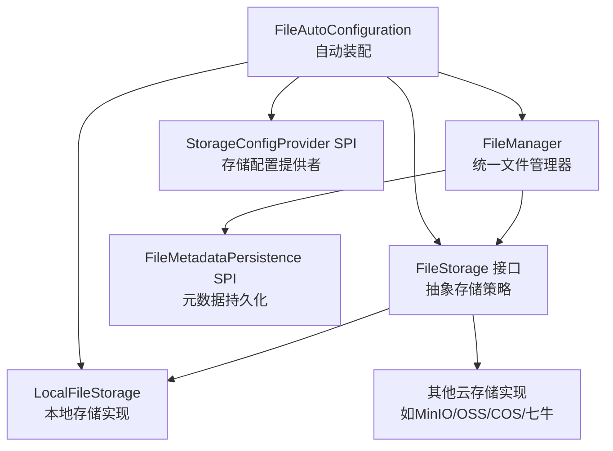
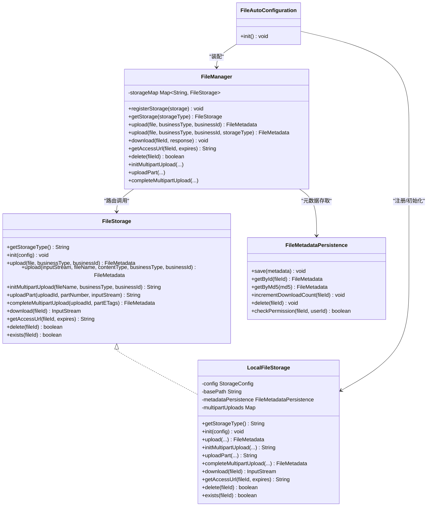
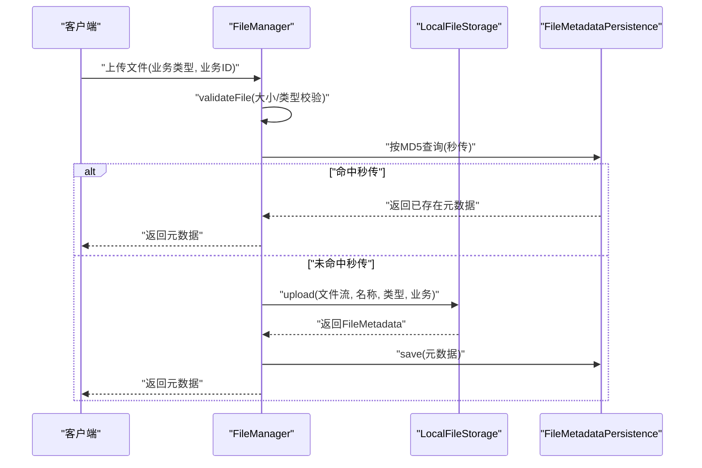
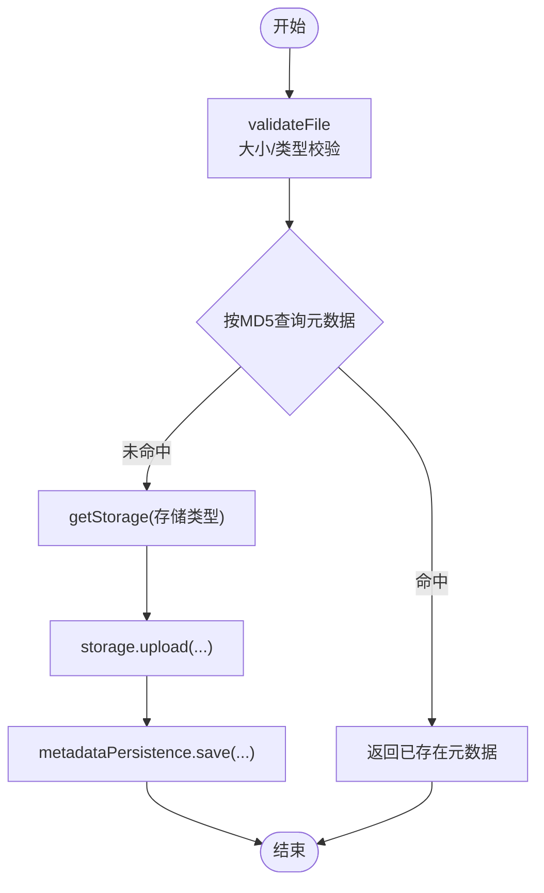
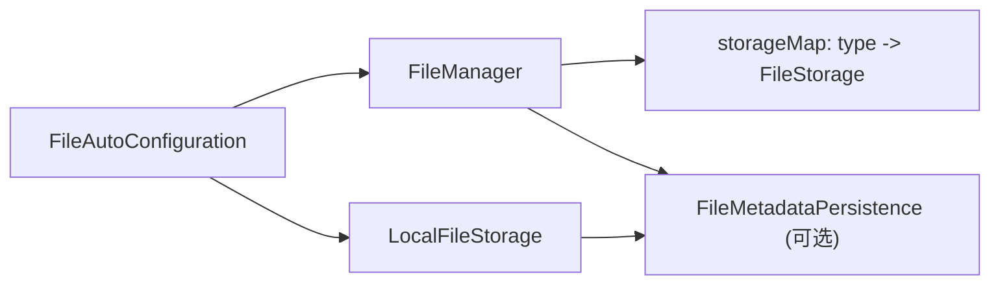

# 文件存储策略

<cite>
**本文引用的文件**
- [FileStorage.java](file://forge/forge-framework/forge-starter-parent/forge-starter-file/src/main/java/com/mdframe/forge/starter/file/storage/FileStorage.java)
- [LocalFileStorage.java](file://forge/forge-framework/forge-starter-parent/forge-starter-file/src/main/java/com/mdframe/forge/starter/file/storage/impl/LocalFileStorage.java)
- [StorageType.java](file://forge/forge-framework/forge-starter-parent/forge-starter-file/src/main/java/com/mdframe/forge/starter/file/enums/StorageType.java)
- [FileMetadata.java](file://forge/forge-framework/forge-starter-parent/forge-starter-file/src/main/java/com/mdframe/forge/starter/file/model/FileMetadata.java)
- [StorageConfig.java](file://forge/forge-framework/forge-starter-parent/forge-starter-file/src/main/java/com/mdframe/forge/starter/file/model/StorageConfig.java)
- [FileMetadataPersistence.java](file://forge/forge-framework/forge-starter-parent/forge-starter-file/src/main/java/com/mdframe/forge/starter/file/spi/FileMetadataPersistence.java)
- [FileAutoConfiguration.java](file://forge/forge-framework/forge-starter-parent/forge-starter-file/src/main/java/com/mdframe/forge/starter/file/config/FileAutoConfiguration.java)
- [FileManager.java](file://forge/forge-framework/forge-starter-parent/forge-starter-file/src/main/java/com/mdframe/forge/starter/file/core/FileManager.java)
</cite>

## 目录
1. [简介](#简介)
2. [项目结构](#项目结构)
3. [核心组件](#核心组件)
4. [架构总览](#架构总览)
5. [组件详解](#组件详解)
6. [依赖关系分析](#依赖关系分析)
7. [性能与安全](#性能与安全)
8. [配置与最佳实践](#配置与最佳实践)
9. [故障排查指南](#故障排查指南)
10. [结论](#结论)

## 简介
本技术文档围绕Forge框架的文件存储策略模块展开，重点覆盖本地存储与云存储的实现原理、接口设计、配置方式与使用场景。文档将深入解析FileStorage接口的设计理念、LocalFileStorage本地存储实现、存储类型枚举定义、以及与元数据持久化、自动装配、统一文件管理器的协作关系，并提供存储策略选择原则、性能对比、安全性考虑、扩展性设计、完整配置示例、最佳实践与故障排查建议。

## 项目结构
文件存储策略相关代码位于forge-starter-file模块中，采用“接口 + SPI + 自动装配 + 统一管理器”的分层设计：
- 接口与模型：定义存储策略接口、元数据模型、存储配置模型、元数据持久化SPI
- 实现：本地存储实现类
- 自动装配：自动注册存储策略、加载配置并初始化
- 统一管理：FileManager集中编排上传、下载、删除、分片上传等流程

图表来源
- [FileManager.java](file://forge/forge-framework/forge-starter-parent/forge-starter-file/src/main/java/com/mdframe/forge/starter/file/core/FileManager.java#L30-L53)
- [FileStorage.java](file://forge/forge-framework/forge-starter-parent/forge-starter-file/src/main/java/com/mdframe/forge/starter/file/storage/FileStorage.java#L13-L110)
- [LocalFileStorage.java](file://forge/forge-framework/forge-starter-parent/forge-starter-file/src/main/java/com/mdframe/forge/starter/file/storage/impl/LocalFileStorage.java#L29-L69)
- [FileAutoConfiguration.java](file://forge/forge-framework/forge-starter-parent/forge-starter-file/src/main/java/com/mdframe/forge/starter/file/config/FileAutoConfiguration.java#L26-L76)

章节来源
- [FileAutoConfiguration.java](file://forge/forge-framework/forge-starter-parent/forge-starter-file/src/main/java/com/mdframe/forge/starter/file/config/FileAutoConfiguration.java#L26-L76)
- [FileManager.java](file://forge/forge-framework/forge-starter-parent/forge-starter-file/src/main/java/com/mdframe/forge/starter/file/core/FileManager.java#L30-L53)

## 核心组件
- FileStorage接口：定义统一的文件存储能力，包括上传、分片上传、下载、访问URL、删除、存在性检查等
- LocalFileStorage：本地文件系统存储的具体实现，支持分片上传、基于业务类型与日期的目录组织、可选的元数据持久化集成
- StorageType枚举：定义可用的存储策略类型（本地、MinIO、阿里云OSS、腾讯云COS、七牛云），并提供从编码到类型的转换
- FileMetadata：文件元数据模型，承载文件ID、原始名、存储名、路径、大小、MIME、扩展名、存储类型、业务信息、上传时间、是否私有、下载计数等
- StorageConfig：存储策略配置模型，包含类型、默认策略、启用状态、端点、密钥、桶、区域、基础路径、域名、HTTPS、最大文件大小、允许类型、排序、扩展配置等
- FileMetadataPersistence SPI：文件元数据持久化接口，支持保存、查询、按MD5秒传、更新下载计数、删除、权限校验
- FileManager：统一文件管理器，负责注册存储策略、路由到具体存储、执行上传/下载/删除/分片上传、文件验证、调用元数据持久化
- FileAutoConfiguration：自动装配配置，扫描并注册存储策略，按配置初始化存储实例

章节来源
- [FileStorage.java](file://forge/forge-framework/forge-starter-parent/forge-starter-file/src/main/java/com/mdframe/forge/starter/file/storage/FileStorage.java#L13-L110)
- [LocalFileStorage.java](file://forge/forge-framework/forge-starter-parent/forge-starter-file/src/main/java/com/mdframe/forge/starter/file/storage/impl/LocalFileStorage.java#L29-L69)
- [StorageType.java](file://forge/forge-framework/forge-starter-parent/forge-starter-file/src/main/java/com/mdframe/forge/starter/file/enums/StorageType.java#L11-L49)
- [FileMetadata.java](file://forge/forge-framework/forge-starter-parent/forge-starter-file/src/main/java/com/mdframe/forge/starter/file/model/FileMetadata.java#L13-L110)
- [StorageConfig.java](file://forge/forge-framework/forge-starter-parent/forge-starter-file/src/main/java/com/mdframe/forge/starter/file/model/StorageConfig.java#L12-L108)
- [FileMetadataPersistence.java](file://forge/forge-framework/forge-starter-parent/forge-starter-file/src/main/java/com/mdframe/forge/starter/file/spi/FileMetadataPersistence.java#L9-L40)
- [FileManager.java](file://forge/forge-framework/forge-starter-parent/forge-starter-file/src/main/java/com/mdframe/forge/starter/file/core/FileManager.java#L30-L255)
- [FileAutoConfiguration.java](file://forge/forge-framework/forge-starter-parent/forge-starter-file/src/main/java/com/mdframe/forge/starter/file/config/FileAutoConfiguration.java#L26-L76)

## 架构总览
下图展示文件存储策略在系统中的交互关系：FileManager作为入口，依据配置选择具体存储实现；存储实现依赖可选的元数据持久化SPI进行元数据存取；自动装配负责注册与初始化。

图表来源
- [FileStorage.java](file://forge/forge-framework/forge-starter-parent/forge-starter-file/src/main/java/com/mdframe/forge/starter/file/storage/FileStorage.java#L13-L110)
- [LocalFileStorage.java](file://forge/forge-framework/forge-starter-parent/forge-starter-file/src/main/java/com/mdframe/forge/starter/file/storage/impl/LocalFileStorage.java#L29-L69)
- [FileManager.java](file://forge/forge-framework/forge-starter-parent/forge-starter-file/src/main/java/com/mdframe/forge/starter/file/core/FileManager.java#L30-L255)
- [FileMetadataPersistence.java](file://forge/forge-framework/forge-starter-parent/forge-starter-file/src/main/java/com/mdframe/forge/starter/file/spi/FileMetadataPersistence.java#L9-L40)
- [FileAutoConfiguration.java](file://forge/forge-framework/forge-starter-parent/forge-starter-file/src/main/java/com/mdframe/forge/starter/file/config/FileAutoConfiguration.java#L26-L76)

## 组件详解

### FileStorage接口设计
- 设计目标：以统一接口屏蔽不同存储后端差异，便于替换与扩展
- 关键能力：
  - 初始化与类型标识
  - 两种上传方式（MultipartFile与InputStream）
  - 分片上传全流程（初始化、上传分片、完成合并）
  - 下载、访问URL、删除、存在性检查
- 适用场景：本地文件系统、MinIO、阿里云OSS、腾讯云COS、七牛云等

章节来源
- [FileStorage.java](file://forge/forge-framework/forge-starter-parent/forge-starter-file/src/main/java/com/mdframe/forge/starter/file/storage/FileStorage.java#L13-L110)

### LocalFileStorage本地存储实现
- 初始化与基础路径
  - 支持通过配置设置基础路径，未配置时回退到用户主目录下的默认路径
  - 确保基础目录存在，不存在则自动创建
- 上传流程
  - 自动生成存储文件名（UUID+扩展名），避免冲突
  - 按业务类型与日期生成相对路径，便于归档与清理
  - 将输入流复制到目标文件，构建FileMetadata
- 分片上传
  - 为每次分片上传分配唯一uploadId，创建临时目录
  - 按分片编号保存分片文件，完成后顺序合并到最终文件并清理临时目录
- 下载与访问
  - 下载时根据元数据定位物理文件并返回输入流
  - 访问URL在本地模式下返回相对路径或拼接域名后的下载地址
- 删除与存在性检查
  - 删除时先查元数据再删除物理文件
  - 存在性检查基于物理文件是否存在
- 元数据持久化集成
  - 可选依赖FileMetadataPersistence SPI，用于保存/查询/按MD5秒传/更新下载计数/删除/权限校验

图表来源
- [FileManager.java](file://forge/forge-framework/forge-starter-parent/forge-starter-file/src/main/java/com/mdframe/forge/starter/file/core/FileManager.java#L58-L99)
- [LocalFileStorage.java](file://forge/forge-framework/forge-starter-parent/forge-starter-file/src/main/java/com/mdframe/forge/starter/file/storage/impl/LocalFileStorage.java#L72-L134)
- [FileMetadataPersistence.java](file://forge/forge-framework/forge-starter-parent/forge-starter-file/src/main/java/com/mdframe/forge/starter/file/spi/FileMetadataPersistence.java#L14-L14)

章节来源
- [LocalFileStorage.java](file://forge/forge-framework/forge-starter-parent/forge-starter-file/src/main/java/com/mdframe/forge/starter/file/storage/impl/LocalFileStorage.java#L50-L328)

### 存储类型枚举StorageType
- 定义了本地存储与多家云存储的类型编码与描述
- 提供fromCode方法，便于根据配置中的编码解析存储类型

章节来源
- [StorageType.java](file://forge/forge-framework/forge-starter-parent/forge-starter-file/src/main/java/com/mdframe/forge/starter/file/enums/StorageType.java#L11-L49)

### FileMetadata与StorageConfig模型
- FileMetadata：承载文件元数据，包括业务字段、存储字段、访问字段、统计字段等
- StorageConfig：承载存储策略配置，包括类型、默认策略、启用状态、端点、密钥、桶、区域、基础路径、域名、HTTPS、大小与类型限制、排序、扩展配置等

章节来源
- [FileMetadata.java](file://forge/forge-framework/forge-starter-parent/forge-starter-file/src/main/java/com/mdframe/forge/starter/file/model/FileMetadata.java#L13-L110)
- [StorageConfig.java](file://forge/forge-framework/forge-starter-parent/forge-starter-file/src/main/java/com/mdframe/forge/starter/file/model/StorageConfig.java#L12-L108)

### FileManager统一管理器
- 注册与获取存储策略
- 上传：文件验证、秒传、调用存储实现、持久化元数据
- 下载：根据元数据选择存储实现、输出到响应、更新下载计数
- URL：根据元数据选择存储实现生成访问URL
- 删除：删除物理文件并清理元数据
- 分片上传：委托存储实现完成初始化、上传分片、合并
- 文件验证：基于配置校验大小与类型

图表来源
- [FileManager.java](file://forge/forge-framework/forge-starter-parent/forge-starter-file/src/main/java/com/mdframe/forge/starter/file/core/FileManager.java#L58-L99)

章节来源
- [FileManager.java](file://forge/forge-framework/forge-starter-parent/forge-starter-file/src/main/java/com/mdframe/forge/starter/file/core/FileManager.java#L58-L255)

### FileAutoConfiguration自动装配
- 注册FileManager与LocalFileStorage Bean
- 扫描所有FileStorage实现并注册到FileManager
- 通过StorageConfigProvider获取启用的配置，逐个初始化对应存储策略

章节来源
- [FileAutoConfiguration.java](file://forge/forge-framework/forge-starter-parent/forge-starter-file/src/main/java/com/mdframe/forge/starter/file/config/FileAutoConfiguration.java#L36-L76)

## 依赖关系分析
- FileManager对FileStorage的依赖是运行时动态选择，通过Map映射存储类型到具体实现
- LocalFileStorage对FileMetadataPersistence为可选依赖，用于元数据存取
- FileAutoConfiguration在启动阶段完成存储策略注册与初始化
- FileManager在上传/下载/删除/分片上传等流程中，按元数据中的存储类型路由到对应实现

图表来源
- [FileAutoConfiguration.java](file://forge/forge-framework/forge-starter-parent/forge-starter-file/src/main/java/com/mdframe/forge/starter/file/config/FileAutoConfiguration.java#L48-L76)
- [FileManager.java](file://forge/forge-framework/forge-starter-parent/forge-starter-file/src/main/java/com/mdframe/forge/starter/file/core/FileManager.java#L43-L53)
- [LocalFileStorage.java](file://forge/forge-framework/forge-starter-parent/forge-starter-file/src/main/java/com/mdframe/forge/starter/file/storage/impl/LocalFileStorage.java#L37-L38)

章节来源
- [FileAutoConfiguration.java](file://forge/forge-framework/forge-starter-parent/forge-starter-file/src/main/java/com/mdframe/forge/starter/file/config/FileAutoConfiguration.java#L48-L76)
- [FileManager.java](file://forge/forge-framework/forge-starter-parent/forge-starter-file/src/main/java/com/mdframe/forge/starter/file/core/FileManager.java#L43-L53)

## 性能与安全
- 性能对比
  - 本地存储：适合小规模、低并发、对延迟敏感的场景；I/O受限于磁盘吞吐与目录层级
  - 云存储：具备高可用、高扩展、CDN加速能力，适合大规模并发与跨地域访问
- 安全性考虑
  - 本地存储：注意文件系统权限、路径遍历风险、敏感文件隔离；可通过配置域名与HTTPS提升访问安全
  - 云存储：通过密钥管理、桶策略、访问控制、签名URL等方式保障安全
- 扩展性设计
  - 通过FileStorage接口与FileManager路由机制，新增云存储实现无需改动上层逻辑
  - 通过FileMetadataPersistence SPI解耦元数据存储，便于对接数据库或缓存

[本节为通用指导，不直接分析具体文件]

## 配置与最佳实践
- 存储类型选择原则
  - 开发/测试：本地存储，简单易部署
  - 生产环境：优先云存储，结合CDN与跨域配置
  - 大文件/高并发：云存储更稳定
- 配置要点
  - StorageConfig中设置storageType、endpoint、accessKey、secretKey、bucketName、region、basePath、domain、useHttps、maxFileSize、allowedTypes等
  - 若使用本地存储，确保basePath目录具备写权限且容量充足
  - 若启用元数据持久化，需提供FileMetadataPersistence实现并正确配置
- 最佳实践
  - 使用FileManager统一入口，避免直接操作存储实现
  - 对上传文件进行大小与类型校验，防止异常流量
  - 启用分片上传处理大文件，提升稳定性
  - 对热点文件可结合CDN与签名URL，降低源站压力

[本节为通用指导，不直接分析具体文件]

## 故障排查指南
- 上传失败
  - 检查本地存储基础路径是否存在且可写
  - 校验文件大小与类型是否超出配置限制
- 下载失败
  - 确认元数据是否存在，存储类型是否匹配
  - 检查物理文件是否被意外删除
- 分片上传异常
  - 确认uploadId有效，临时目录是否创建成功
  - 检查分片合并过程是否出现IO错误
- 元数据缺失
  - 确认FileMetadataPersistence是否注入，保存流程是否执行

章节来源
- [LocalFileStorage.java](file://forge/forge-framework/forge-starter-parent/forge-starter-file/src/main/java/com/mdframe/forge/starter/file/storage/impl/LocalFileStorage.java#L55-L68)
- [FileManager.java](file://forge/forge-framework/forge-starter-parent/forge-starter-file/src/main/java/com/mdframe/forge/starter/file/core/FileManager.java#L223-L253)

## 结论
Forge框架的文件存储策略模块通过FileStorage接口与FileManager统一编排，实现了对本地与云存储的统一抽象与灵活扩展。LocalFileStorage提供了开箱即用的本地存储能力，结合分片上传、元数据持久化与自动装配机制，满足从开发到生产的多样化需求。通过合理选择存储类型、规范配置与遵循最佳实践，可在性能、安全与扩展性之间取得平衡。