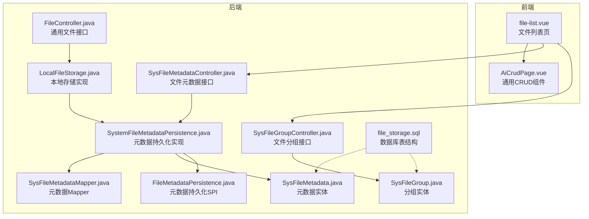
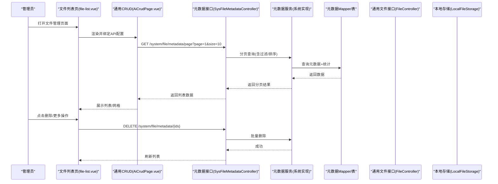
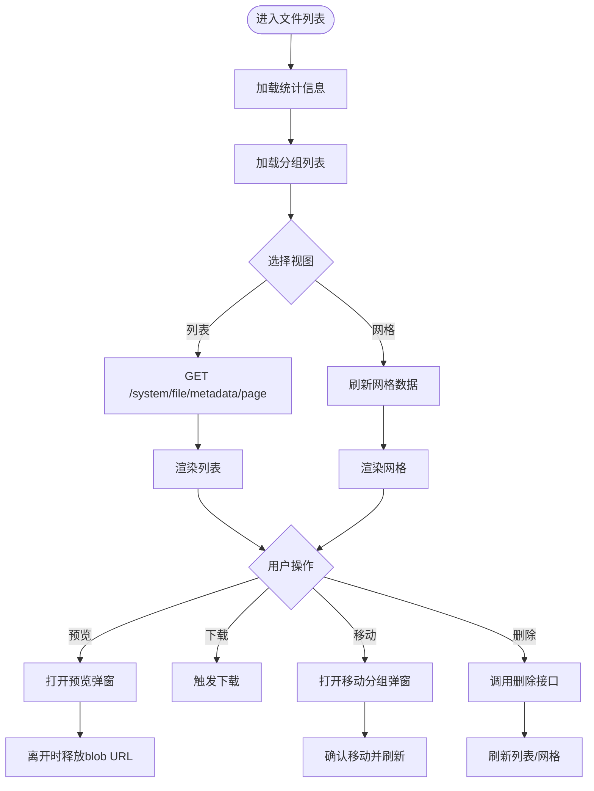
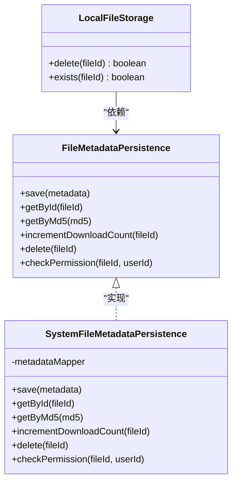
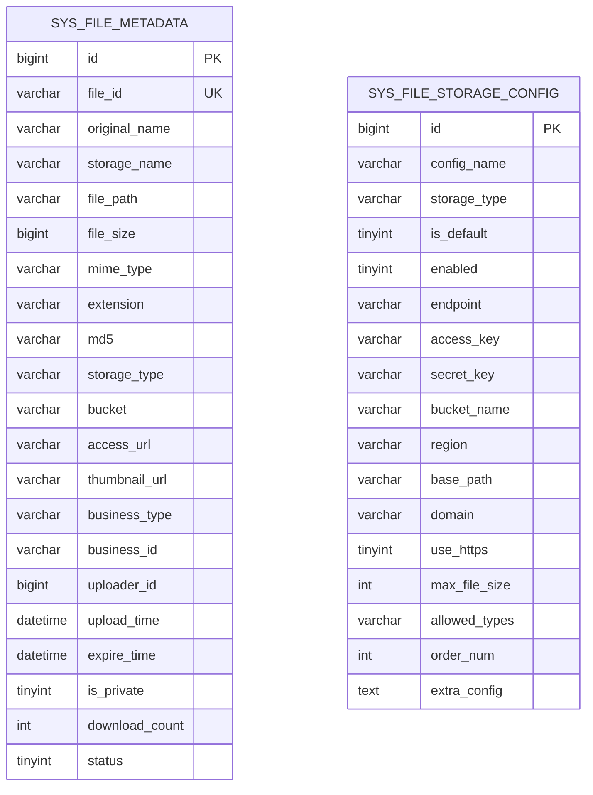
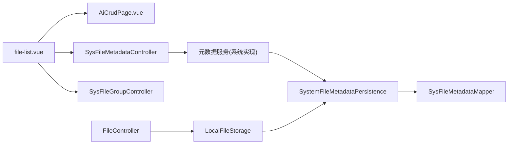

# 文件管理操作

<cite>
**本文引用的文件**   
- [file-list.vue](file://forge-admin-ui/src/views/system/file-list.vue)
- [AiCrudPage.vue](file://forge-admin-ui/src/components/ai-form/AiCrudPage.vue)
- [FileController.java](file://forge/forge-framework/forge-starter-parent/forge-starter-file/src/main/java/com/mdframe/forge/starter/file/controller/FileController.java)
- [SysFileMetadataController.java](file://forge/forge-framework/forge-plugin-parent/forge-plugin-system/src/main/java/com/mdframe/forge/plugin/system/controller/SysFileMetadataController.java)
- [SysFileGroupController.java](file://forge/forge-framework/forge-plugin-parent/forge-plugin-system/src/main/java/com/mdframe/forge/plugin/system/controller/SysFileGroupController.java)
- [SysFileMetadata.java](file://forge/forge-framework/forge-plugin-parent/forge-plugin-system/src/main/java/com/mdframe/forge/plugin/system/entity/SysFileMetadata.java)
- [SysFileGroup.java](file://forge/forge-framework/forge-plugin-parent/forge-plugin-system/src/main/java/com/mdframe/forge/plugin/system/entity/SysFileGroup.java)
- [SysFileMetadataMapper.java](file://forge/forge-framework/forge-plugin-parent/forge-plugin-system/src/main/java/com/mdframe/forge/plugin/system/mapper/SysFileMetadataMapper.java)
- [SystemFileMetadataPersistence.java](file://forge/forge-framework/forge-plugin-parent/forge-plugin-system/src/main/java/com/mdframe/forge/plugin/system/service/impl/SystemFileMetadataPersistence.java)
- [FileMetadataPersistence.java](file://forge/forge-framework/forge-starter-parent/forge-starter-file/src/main/java/com/mdframe/forge/starter/file/spi/FileMetadataPersistence.java)
- [LocalFileStorage.java](file://forge/forge-framework/forge-starter-parent/forge-starter-file/src/main/java/com/mdframe/forge/starter/file/storage/impl/LocalFileStorage.java)
- [file_storage.sql](file://forge/forge-framework/forge-starter-parent/forge-starter-file/sql/file_storage.sql)
</cite>

## 目录
1. [简介](#简介)
2. [项目结构](#项目结构)
3. [核心组件](#核心组件)
4. [架构总览](#架构总览)
5. [详细组件分析](#详细组件分析)
6. [依赖关系分析](#依赖关系分析)
7. [性能考量](#性能考量)
8. [故障排查指南](#故障排查指南)
9. [结论](#结论)
10. [附录](#附录)

## 简介
本文件面向Forge框架的“文件管理操作”模块，系统性阐述文件列表查询、文件删除、文件预览、批量操作、文件分组与搜索过滤、分页加载、排序、权限控制等能力的前后端实现与使用方法。文档同时提供前端文件列表组件的配置与定制建议、后端文件元数据服务的业务逻辑说明、数据库文件元数据表结构设计要点，并给出操作流程演示、界面示意与最佳实践，帮助管理员高效管理平台文件资源。

## 项目结构
文件管理模块由前端页面与后端接口两部分组成：
- 前端：文件列表页面与通用CRUD组件
- 后端：文件通用接口、系统文件元数据与分组接口、文件元数据持久化与本地存储实现、数据库表结构

图表来源
- [file-list.vue](file://forge-admin-ui/src/views/system/file-list.vue#L1-L120)
- [AiCrudPage.vue](file://forge-admin-ui/src/components/ai-form/AiCrudPage.vue#L1-L120)
- [FileController.java](file://forge/forge-framework/forge-starter-parent/forge-starter-file/src/main/java/com/mdframe/forge/starter/file/controller/FileController.java#L1-L117)
- [SysFileMetadataController.java](file://forge/forge-framework/forge-plugin-parent/forge-plugin-system/src/main/java/com/mdframe/forge/plugin/system/controller/SysFileMetadataController.java#L1-L75)
- [SysFileGroupController.java](file://forge/forge-framework/forge-plugin-parent/forge-plugin-system/src/main/java/com/mdframe/forge/plugin/system/controller/SysFileGroupController.java#L1-L71)
- [SystemFileMetadataPersistence.java](file://forge/forge-framework/forge-plugin-parent/forge-plugin-system/src/main/java/com/mdframe/forge/plugin/system/service/impl/SystemFileMetadataPersistence.java#L1-L63)
- [SysFileMetadataMapper.java](file://forge/forge-framework/forge-plugin-parent/forge-plugin-system/src/main/java/com/mdframe/forge/plugin/system/mapper/SysFileMetadataMapper.java#L1-L19)
- [SysFileMetadata.java](file://forge/forge-framework/forge-plugin-parent/forge-plugin-system/src/main/java/com/mdframe/forge/plugin/system/entity/SysFileMetadata.java#L1-L130)
- [SysFileGroup.java](file://forge/forge-framework/forge-plugin-parent/forge-plugin-system/src/main/java/com/mdframe/forge/plugin/system/entity/SysFileGroup.java#L1-L67)
- [LocalFileStorage.java](file://forge/forge-framework/forge-starter-parent/forge-starter-file/src/main/java/com/mdframe/forge/starter/file/storage/impl/LocalFileStorage.java#L300-L328)
- [FileMetadataPersistence.java](file://forge/forge-framework/forge-starter-parent/forge-starter-file/src/main/java/com/mdframe/forge/starter/file/spi/FileMetadataPersistence.java#L1-L40)
- [file_storage.sql](file://forge/forge-framework/forge-starter-parent/forge-starter-file/sql/file_storage.sql#L1-L75)

章节来源
- [file-list.vue](file://forge-admin-ui/src/views/system/file-list.vue#L1-L120)
- [AiCrudPage.vue](file://forge-admin-ui/src/components/ai-form/AiCrudPage.vue#L1-L120)
- [SysFileMetadataController.java](file://forge/forge-framework/forge-plugin-parent/forge-plugin-system/src/main/java/com/mdframe/forge/plugin/system/controller/SysFileMetadataController.java#L1-L75)
- [SysFileGroupController.java](file://forge/forge-framework/forge-plugin-parent/forge-plugin-system/src/main/java/com/mdframe/forge/plugin/system/controller/SysFileGroupController.java#L1-L71)
- [FileController.java](file://forge/forge-framework/forge-starter-parent/forge-starter-file/src/main/java/com/mdframe/forge/starter/file/controller/FileController.java#L1-L117)
- [file_storage.sql](file://forge/forge-framework/forge-starter-parent/forge-starter-file/sql/file_storage.sql#L1-L75)

## 核心组件
- 前端文件列表页：提供分组导航、列表/网格双视图、上传、搜索过滤、预览、下载、移动到分组、删除、分页与排序等能力。
- 通用CRUD组件：封装搜索、表格、分页、批量操作等通用能力，供文件列表页复用。
- 后端文件通用接口：提供上传、下载、删除、分片上传等通用能力。
- 后端文件元数据接口：提供分页查询、详情、业务关联查询、统计、批量删除等能力。
- 后端文件分组接口：提供分组列表、详情、创建、更新、删除等能力。
- 元数据持久化与存储：通过SPI抽象元数据持久化，系统实现对接数据库；本地存储实现文件物理删除与存在性检查。
- 数据库表：sys_file_metadata与sys_file_storage_config两张核心表，支撑文件元数据与存储配置。

章节来源
- [file-list.vue](file://forge-admin-ui/src/views/system/file-list.vue#L120-L270)
- [AiCrudPage.vue](file://forge-admin-ui/src/components/ai-form/AiCrudPage.vue#L1-L200)
- [FileController.java](file://forge/forge-framework/forge-starter-parent/forge-starter-file/src/main/java/com/mdframe/forge/starter/file/controller/FileController.java#L24-L117)
- [SysFileMetadataController.java](file://forge/forge-framework/forge-plugin-parent/forge-plugin-system/src/main/java/com/mdframe/forge/plugin/system/controller/SysFileMetadataController.java#L21-L75)
- [SysFileGroupController.java](file://forge/forge-framework/forge-plugin-parent/forge-plugin-system/src/main/java/com/mdframe/forge/plugin/system/controller/SysFileGroupController.java#L16-L71)
- [SystemFileMetadataPersistence.java](file://forge/forge-framework/forge-plugin-parent/forge-plugin-system/src/main/java/com/mdframe/forge/plugin/system/service/impl/SystemFileMetadataPersistence.java#L18-L63)
- [LocalFileStorage.java](file://forge/forge-framework/forge-starter-parent/forge-starter-file/src/main/java/com/mdframe/forge/starter/file/storage/impl/LocalFileStorage.java#L300-L328)
- [file_storage.sql](file://forge/forge-framework/forge-starter-parent/forge-starter-file/sql/file_storage.sql#L31-L60)

## 架构总览
文件管理的前后端交互遵循“前端页面 -> 后端接口 -> 业务服务/持久化 -> 存储”的链路。前端通过通用CRUD组件发起分页查询与删除请求，后端通过元数据服务与持久化SPI完成数据读写，存储层可为本地或对象存储。

图表来源
- [file-list.vue](file://forge-admin-ui/src/views/system/file-list.vue#L140-L184)
- [AiCrudPage.vue](file://forge-admin-ui/src/components/ai-form/AiCrudPage.vue#L40-L125)
- [SysFileMetadataController.java](file://forge/forge-framework/forge-plugin-parent/forge-plugin-system/src/main/java/com/mdframe/forge/plugin/system/controller/SysFileMetadataController.java#L35-L73)
- [SysFileMetadataMapper.java](file://forge/forge-framework/forge-plugin-parent/forge-plugin-system/src/main/java/com/mdframe/forge/plugin/system/mapper/SysFileMetadataMapper.java#L11-L19)
- [SysFileMetadata.java](file://forge/forge-framework/forge-plugin-parent/forge-plugin-system/src/main/java/com/mdframe/forge/plugin/system/entity/SysFileMetadata.java#L18-L130)

## 详细组件分析

### 前端文件列表组件（file-list.vue）
- 功能概览
  - 分组导航：全部文件、最近上传、图片、文档、自定义分组
  - 视图切换：列表/网格双视图，网格支持缩略图与文件图标
  - 上传：统一上传入口，自动携带业务类型、分组等参数
  - 搜索过滤：按文件名、存储类型、业务类型、MIME类型过滤
  - 操作：预览（图片）、下载、复制链接、移动到分组、删除
  - 统计：总文件数、图片数、文档数
  - 权限：上传头信息携带认证令牌
- 关键实现要点
  - API配置：列表与删除分别指向后端接口，参数通过listParams动态注入
  - 分组参数：根据选中分组设置mimeType、sort、groupId等过滤条件
  - 网格渲染：基于mimeType决定缩略图或文件图标，点击下载或预览
  - 移动到分组：弹窗选择目标分组，调用PUT更新元数据分组字段
  - 预览弹窗：图片预览，注意释放blob URL避免内存泄漏
- 最佳实践
  - 使用AiCrudPage统一处理分页与搜索，减少重复代码
  - 在网格模式下，分组切换时主动刷新数据源
  - 对大文件下载建议采用临时链接或断点续传策略

图表来源
- [file-list.vue](file://forge-admin-ui/src/views/system/file-list.vue#L480-L516)
- [file-list.vue](file://forge-admin-ui/src/views/system/file-list.vue#L780-L800)
- [file-list.vue](file://forge-admin-ui/src/views/system/file-list.vue#L924-L943)
- [file-list.vue](file://forge-admin-ui/src/views/system/file-list.vue#L952-L971)

章节来源
- [file-list.vue](file://forge-admin-ui/src/views/system/file-list.vue#L1-L120)
- [file-list.vue](file://forge-admin-ui/src/views/system/file-list.vue#L140-L184)
- [file-list.vue](file://forge-admin-ui/src/views/system/file-list.vue#L480-L516)
- [file-list.vue](file://forge-admin-ui/src/views/system/file-list.vue#L780-L800)
- [file-list.vue](file://forge-admin-ui/src/views/system/file-list.vue#L924-L971)

### 通用CRUD组件（AiCrudPage.vue）
- 能力概述
  - 搜索表单：支持折叠、栅格布局、重置回调
  - 表格：分页、排序、行选择、工具栏、列渲染插槽
  - 新增/编辑/删除：Modal/Drawer两种形态，统一生命周期
  - 批量导入/导出：预留扩展点
- 与文件列表的集成
  - 通过api-config绑定后端接口，search-schema与columns定义查询与展示
  - 支持分页变更、页大小变更、刷新等事件驱动

章节来源
- [AiCrudPage.vue](file://forge-admin-ui/src/components/ai-form/AiCrudPage.vue#L1-L200)

### 后端文件通用接口（FileController.java）
- 能力概述
  - 上传：支持业务类型、业务ID、存储类型参数
  - 下载：根据fileId输出文件流
  - 访问URL：生成带过期时间的访问链接
  - 删除：根据fileId删除文件
  - 分片上传：初始化、上传分片、完成合并
- 关键点
  - 上传支持指定存储类型，默认本地存储
  - 下载直接输出到响应流，适合浏览器下载
  - 访问URL用于外部分享或嵌入场景

章节来源
- [FileController.java](file://forge/forge-framework/forge-starter-parent/forge-starter-file/src/main/java/com/mdframe/forge/starter/file/controller/FileController.java#L24-L117)

### 后端文件元数据接口（SysFileMetadataController.java）
- 能力概述
  - 分页查询：PageQuery + 条件过滤
  - 详情：按ID查询
  - 业务关联查询：按businessType与businessId查询
  - 统计：文件总数、图片数、文档数
  - 批量删除：按fileIds数组删除
- 关键点
  - 统一返回RespInfo包装
  - 业务查询与分页查询分离，便于不同场景使用

章节来源
- [SysFileMetadataController.java](file://forge/forge-framework/forge-plugin-parent/forge-plugin-system/src/main/java/com/mdframe/forge/plugin/system/controller/SysFileMetadataController.java#L21-L75)

### 后端文件分组接口（SysFileGroupController.java）
- 能力概述
  - 列表（带文件数量）：用于前端分组导航展示
  - 统计：分组维度统计
  - 详情、创建、更新、删除：分组全生命周期管理
- 关键点
  - 与元数据实体的分组字段关联，支持将文件移动到分组

章节来源
- [SysFileGroupController.java](file://forge/forge-framework/forge-plugin-parent/forge-plugin-system/src/main/java/com/mdframe/forge/plugin/system/controller/SysFileGroupController.java#L16-L71)

### 元数据持久化与存储实现
- 元数据持久化SPI：定义保存、查询、MD5秒传、下载次数递增、删除、权限校验等接口
- 系统实现：将FileMetadata转换为SysFileMetadata实体，使用MyBatis-Plus进行数据库存取
- 本地存储：根据fileId定位物理文件并删除，支持存在性检查

图表来源
- [FileMetadataPersistence.java](file://forge/forge-framework/forge-starter-parent/forge-starter-file/src/main/java/com/mdframe/forge/starter/file/spi/FileMetadataPersistence.java#L1-L40)
- [SystemFileMetadataPersistence.java](file://forge/forge-framework/forge-plugin-parent/forge-plugin-system/src/main/java/com/mdframe/forge/plugin/system/service/impl/SystemFileMetadataPersistence.java#L18-L63)
- [LocalFileStorage.java](file://forge/forge-framework/forge-starter-parent/forge-starter-file/src/main/java/com/mdframe/forge/starter/file/storage/impl/LocalFileStorage.java#L300-L328)

章节来源
- [SystemFileMetadataPersistence.java](file://forge/forge-framework/forge-plugin-parent/forge-plugin-system/src/main/java/com/mdframe/forge/plugin/system/service/impl/SystemFileMetadataPersistence.java#L18-L63)
- [FileMetadataPersistence.java](file://forge/forge-framework/forge-starter-parent/forge-starter-file/src/main/java/com/mdframe/forge/starter/file/spi/FileMetadataPersistence.java#L1-L40)
- [LocalFileStorage.java](file://forge/forge-framework/forge-starter-parent/forge-starter-file/src/main/java/com/mdframe/forge/starter/file/storage/impl/LocalFileStorage.java#L300-L328)

### 数据库文件元数据表结构（file_storage.sql）
- sys_file_metadata：文件元数据主表，包含文件唯一ID、原始名、存储名、路径、大小、MIME、扩展名、MD5、存储策略、业务标识、上传者、上传时间、过期时间、私有标志、下载次数、状态等
- sys_file_storage_config：存储配置表，包含存储类型、是否默认、端点、密钥、桶、域名、最大文件大小、允许类型等
- 索引：针对file_id、md5、业务组合、上传者、上传时间建立索引，提升查询性能

图表来源
- [file_storage.sql](file://forge/forge-framework/forge-starter-parent/forge-starter-file/sql/file_storage.sql#L31-L60)
- [file_storage.sql](file://forge/forge-framework/forge-starter-parent/forge-starter-file/sql/file_storage.sql#L4-L26)

章节来源
- [file_storage.sql](file://forge/forge-framework/forge-starter-parent/forge-starter-file/sql/file_storage.sql#L1-L75)

## 依赖关系分析
- 前端依赖
  - 文件列表页依赖通用CRUD组件，统一处理分页与搜索
  - 上传、下载、删除等操作通过请求封装与鉴权头传递
- 后端依赖
  - 文件元数据接口依赖元数据服务与持久化SPI
  - 本地存储实现依赖元数据持久化以定位物理文件
  - 数据库层面依赖sys_file_metadata与sys_file_storage_config

图表来源
- [file-list.vue](file://forge-admin-ui/src/views/system/file-list.vue#L140-L184)
- [AiCrudPage.vue](file://forge-admin-ui/src/components/ai-form/AiCrudPage.vue#L40-L125)
- [SysFileMetadataController.java](file://forge/forge-framework/forge-plugin-parent/forge-plugin-system/src/main/java/com/mdframe/forge/plugin/system/controller/SysFileMetadataController.java#L21-L75)
- [SysFileGroupController.java](file://forge/forge-framework/forge-plugin-parent/forge-plugin-system/src/main/java/com/mdframe/forge/plugin/system/controller/SysFileGroupController.java#L16-L71)
- [SystemFileMetadataPersistence.java](file://forge/forge-framework/forge-plugin-parent/forge-plugin-system/src/main/java/com/mdframe/forge/plugin/system/service/impl/SystemFileMetadataPersistence.java#L18-L63)
- [SysFileMetadataMapper.java](file://forge/forge-framework/forge-plugin-parent/forge-plugin-system/src/main/java/com/mdframe/forge/plugin/system/mapper/SysFileMetadataMapper.java#L11-L19)
- [FileController.java](file://forge/forge-framework/forge-starter-parent/forge-starter-file/src/main/java/com/mdframe/forge/starter/file/controller/FileController.java#L24-L117)
- [LocalFileStorage.java](file://forge/forge-framework/forge-starter-parent/forge-starter-file/src/main/java/com/mdframe/forge/starter/file/storage/impl/LocalFileStorage.java#L300-L328)

章节来源
- [file-list.vue](file://forge-admin-ui/src/views/system/file-list.vue#L140-L184)
- [SysFileMetadataController.java](file://forge/forge-framework/forge-plugin-parent/forge-plugin-system/src/main/java/com/mdframe/forge/plugin/system/controller/SysFileMetadataController.java#L21-L75)
- [SysFileGroupController.java](file://forge/forge-framework/forge-plugin-parent/forge-plugin-system/src/main/java/com/mdframe/forge/plugin/system/controller/SysFileGroupController.java#L16-L71)
- [FileController.java](file://forge/forge-framework/forge-starter-parent/forge-starter-file/src/main/java/com/mdframe/forge/starter/file/controller/FileController.java#L24-L117)
- [SystemFileMetadataPersistence.java](file://forge/forge-framework/forge-plugin-parent/forge-plugin-system/src/main/java/com/mdframe/forge/plugin/system/service/impl/SystemFileMetadataPersistence.java#L18-L63)
- [LocalFileStorage.java](file://forge/forge-framework/forge-starter-parent/forge-starter-file/src/main/java/com/mdframe/forge/starter/file/storage/impl/LocalFileStorage.java#L300-L328)

## 性能考量
- 分页与排序
  - 后端分页查询应结合索引字段（如上传时间、业务组合）进行排序，避免全表扫描
  - 前端分页参数与后端PageQuery保持一致，避免超大数据集一次性传输
- 搜索过滤
  - MIME类型、存储类型、业务类型等过滤应配合索引，减少无效扫描
- 下载与预览
  - 图片预览优先使用缩略图URL，降低带宽与渲染压力
  - 大文件下载建议使用临时链接或分片下载
- 存储策略
  - 本地存储建议配置合理的目录层级与磁盘配额，避免单目录文件过多
  - 对象存储建议开启CDN与缓存策略，优化访问延迟

## 故障排查指南
- 上传失败
  - 检查上传头Authorization是否正确传递
  - 确认存储类型与存储配置是否启用，路径与桶是否正确
- 下载异常
  - 确认fileId有效且文件存在；若使用临时链接，检查过期时间
  - 检查访问URL是否正确拼接域名与路径
- 删除失败
  - 确认文件是否存在；本地存储删除后需同步清理元数据
  - 检查权限校验与状态字段
- 预览空白
  - 确认缩略图URL或原图URL可用；关闭预览时及时释放blob URL
- 分组移动无效
  - 确认目标分组ID有效，后端更新成功后再刷新列表

章节来源
- [file-list.vue](file://forge-admin-ui/src/views/system/file-list.vue#L518-L542)
- [FileController.java](file://forge/forge-framework/forge-starter-parent/forge-starter-file/src/main/java/com/mdframe/forge/starter/file/controller/FileController.java#L48-L72)
- [LocalFileStorage.java](file://forge/forge-framework/forge-starter-parent/forge-starter-file/src/main/java/com/mdframe/forge/starter/file/storage/impl/LocalFileStorage.java#L300-L328)
- [SystemFileMetadataPersistence.java](file://forge/forge-framework/forge-plugin-parent/forge-plugin-system/src/main/java/com/mdframe/forge/plugin/system/service/impl/SystemFileMetadataPersistence.java#L18-L63)

## 结论
Forge框架的文件管理模块通过前后端清晰的职责划分与可扩展的SPI机制，实现了从文件上传、元数据管理到存储与权限控制的完整闭环。前端以通用CRUD组件为核心，后端以元数据服务与本地存储实现为基础，辅以完善的数据库表结构与索引设计，能够满足大多数文件管理场景的需求。建议在生产环境中结合业务特性进一步完善权限控制、分片上传与CDN加速等能力。

## 附录
- 操作流程示例
  - 文件列表查询：选择分组 → 设置过滤条件 → 分页加载 → 查看文件详情
  - 文件删除：勾选文件 → 批量删除 → 确认提示 → 刷新列表
  - 文件预览：点击预览 → 弹窗查看 → 关闭时释放资源
  - 文件移动：点击更多 → 移动到分组 → 选择目标分组 → 确认 → 刷新
- 最佳实践
  - 使用AiCrudPage统一处理分页与搜索，减少重复代码
  - 对大文件采用分片上传与断点续传
  - 合理配置存储策略与CDN，优化访问性能
  - 定期清理过期文件与无用分组，保持系统整洁