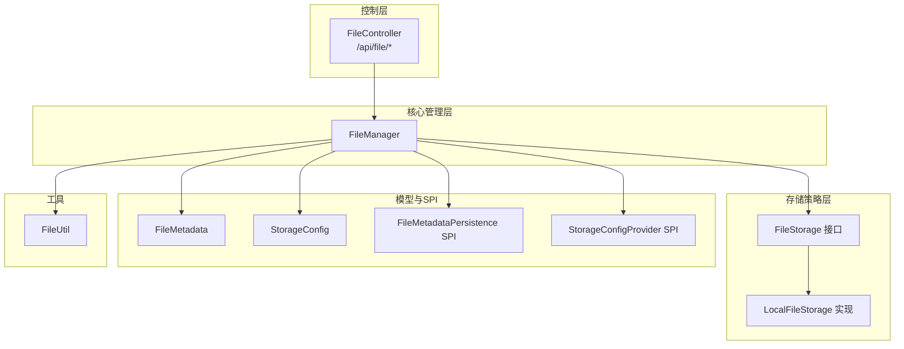
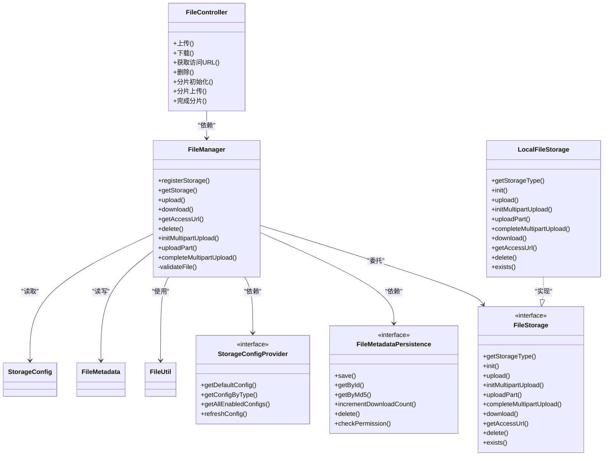
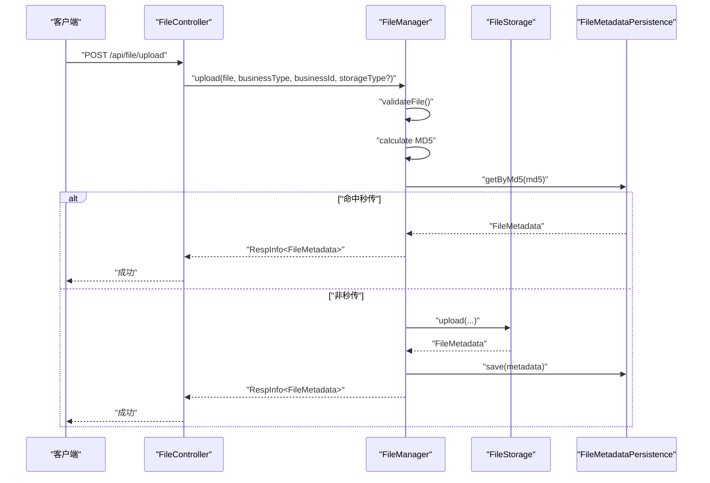
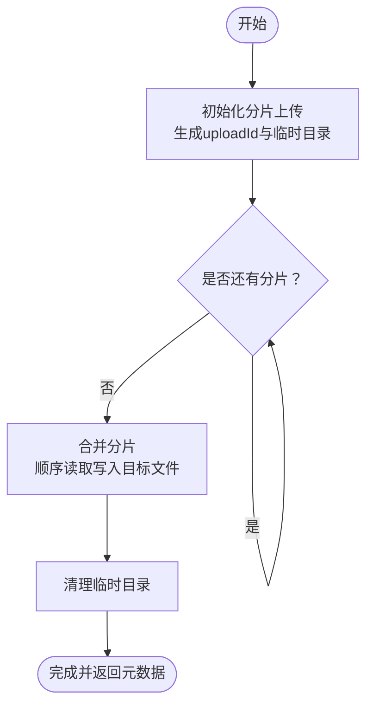
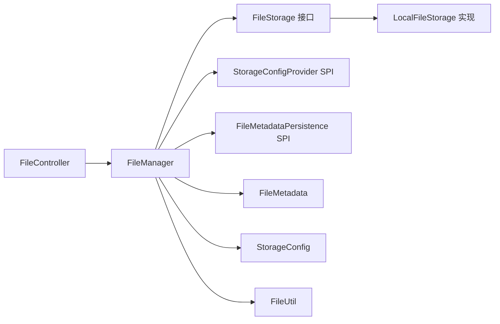

# 文件管理系统

<cite>
**本文引用的文件**
- [FileStorageProperties.java](file://forge/forge-framework/forge-starter-parent/forge-starter-file/src/main/java/com/mdframe/forge/starter/file/config/FileStorageProperties.java)
- [FileController.java](file://forge/forge-framework/forge-starter-parent/forge-starter-file/src/main/java/com/mdframe/forge/starter/file/controller/FileController.java)
- [FileManager.java](file://forge/forge-framework/forge-starter-parent/forge-starter-file/src/main/java/com/mdframe/forge/starter/file/core/FileManager.java)
- [FileMetadata.java](file://forge/forge-framework/forge-starter-parent/forge-starter-file/src/main/java/com/mdframe/forge/starter/file/model/FileMetadata.java)
- [StorageConfig.java](file://forge/forge-framework/forge-starter-parent/forge-starter-file/src/main/java/com/mdframe/forge/starter/file/model/StorageConfig.java)
- [StorageType.java](file://forge/forge-framework/forge-starter-parent/forge-starter-file/src/main/java/com/mdframe/forge/starter/file/enums/StorageType.java)
- [FileMetadataPersistence.java](file://forge/forge-framework/forge-starter-parent/forge-starter-file/src/main/java/com/mdframe/forge/starter/file/spi/FileMetadataPersistence.java)
- [StorageConfigProvider.java](file://forge/forge-framework/forge-starter-parent/forge-starter-file/src/main/java/com/mdframe/forge/starter/file/spi/StorageConfigProvider.java)
- [FileStorage.java](file://forge/forge-framework/forge-starter-parent/forge-starter-file/src/main/java/com/mdframe/forge/starter/file/storage/FileStorage.java)
- [LocalFileStorage.java](file://forge/forge-framework/forge-starter-parent/forge-starter-file/src/main/java/com/mdframe/forge/starter/file/storage/impl/LocalFileStorage.java)
- [FileUtil.java](file://forge/forge-framework/forge-starter-parent/forge-starter-file/src/main/java/com/mdframe/forge/starter/file/util/FileUtil.java)
</cite>

## 目录
1. [简介](#简介)
2. [项目结构](#项目结构)
3. [核心组件](#核心组件)
4. [架构总览](#架构总览)
5. [详细组件分析](#详细组件分析)
6. [依赖关系分析](#依赖关系分析)
7. [性能考虑](#性能考虑)
8. [故障排查指南](#故障排查指南)
9. [结论](#结论)
10. [附录](#附录)

## 简介
本文件管理系统基于Forge框架的“文件”启动器模块，提供统一的文件上传、存储、下载、删除与访问控制能力。系统支持本地文件系统与多种云存储策略的插拔式扩展，并内置分片上传、断点续传、秒传（基于MD5）、文件元数据管理、访问URL生成与权限校验等关键能力。通过清晰的SPI接口与配置体系，开发者可快速集成并定制文件管理功能。

## 项目结构
文件管理模块位于Forge框架的“文件启动器”子模块中，采用分层与职责分离的设计：
- 控制层：对外暴露REST接口，处理上传、下载、删除、分片上传等请求
- 核心管理层：封装上传、下载、删除、分片流程与策略选择逻辑
- 存储策略层：抽象存储接口，提供本地存储实现，支持扩展云存储
- 模型与SPI：定义文件元数据、存储配置、元数据持久化与配置提供者接口
- 工具类：提供文件工具方法（如MD5计算）

图表来源
- [FileController.java](file://forge/forge-framework/forge-starter-parent/forge-starter-file/src/main/java/com/mdframe/forge/starter/file/controller/FileController.java#L1-L117)
- [FileManager.java](file://forge/forge-framework/forge-starter-parent/forge-starter-file/src/main/java/com/mdframe/forge/starter/file/core/FileManager.java#L1-L255)
- [FileStorage.java](file://forge/forge-framework/forge-starter-parent/forge-starter-file/src/main/java/com/mdframe/forge/starter/file/storage/FileStorage.java#L1-L110)
- [LocalFileStorage.java](file://forge/forge-framework/forge-starter-parent/forge-starter-file/src/main/java/com/mdframe/forge/starter/file/storage/impl/LocalFileStorage.java#L1-L439)
- [FileMetadata.java](file://forge/forge-framework/forge-starter-parent/forge-starter-file/src/main/java/com/mdframe/forge/starter/file/model/FileMetadata.java#L1-L110)
- [StorageConfig.java](file://forge/forge-framework/forge-starter-parent/forge-starter-file/src/main/java/com/mdframe/forge/starter/file/model/StorageConfig.java#L1-L109)
- [FileMetadataPersistence.java](file://forge/forge-framework/forge-starter-parent/forge-starter-file/src/main/java/com/mdframe/forge/starter/file/spi/FileMetadataPersistence.java#L1-L41)
- [StorageConfigProvider.java](file://forge/forge-framework/forge-starter-parent/forge-starter-file/src/main/java/com/mdframe/forge/starter/file/spi/StorageConfigProvider.java#L1-L33)
- [FileUtil.java](file://forge/forge-framework/forge-starter-parent/forge-starter-file/src/main/java/com/mdframe/forge/starter/file/util/FileUtil.java)

章节来源
- [FileController.java](file://forge/forge-framework/forge-starter-parent/forge-starter-file/src/main/java/com/mdframe/forge/starter/file/controller/FileController.java#L1-L117)
- [FileManager.java](file://forge/forge-framework/forge-starter-parent/forge-starter-file/src/main/java/com/mdframe/forge/starter/file/core/FileManager.java#L1-L255)

## 核心组件
- 文件控制器：提供统一的REST接口，包括单文件上传、下载、获取访问URL、删除、分片上传初始化/上传/完成等
- 文件管理器：协调存储策略、元数据持久化、权限校验、文件验证与秒传逻辑
- 存储策略接口与本地实现：抽象存储行为，提供本地文件系统存储的具体实现
- 元数据与配置模型：描述文件元信息与存储策略配置
- SPI接口：元数据持久化与存储配置提供者，便于业务模块实现数据库驱动的配置与元数据管理
- 工具类：提供文件MD5计算等辅助能力

章节来源
- [FileController.java](file://forge/forge-framework/forge-starter-parent/forge-starter-file/src/main/java/com/mdframe/forge/starter/file/controller/FileController.java#L1-L117)
- [FileManager.java](file://forge/forge-framework/forge-starter-parent/forge-starter-file/src/main/java/com/mdframe/forge/starter/file/core/FileManager.java#L1-L255)
- [FileStorage.java](file://forge/forge-framework/forge-starter-parent/forge-starter-file/src/main/java/com/mdframe/forge/starter/file/storage/FileStorage.java#L1-L110)
- [LocalFileStorage.java](file://forge/forge-framework/forge-starter-parent/forge-starter-file/src/main/java/com/mdframe/forge/starter/file/storage/impl/LocalFileStorage.java#L1-L439)
- [FileMetadata.java](file://forge/forge-framework/forge-starter-parent/forge-starter-file/src/main/java/com/mdframe/forge/starter/file/model/FileMetadata.java#L1-L110)
- [StorageConfig.java](file://forge/forge-framework/forge-starter-parent/forge-starter-file/src/main/java/com/mdframe/forge/starter/file/model/StorageConfig.java#L1-L109)
- [FileMetadataPersistence.java](file://forge/forge-framework/forge-starter-parent/forge-starter-file/src/main/java/com/mdframe/forge/starter/file/spi/FileMetadataPersistence.java#L1-L41)
- [StorageConfigProvider.java](file://forge/forge-framework/forge-starter-parent/forge-starter-file/src/main/java/com/mdframe/forge/starter/file/spi/StorageConfigProvider.java#L1-L33)
- [FileUtil.java](file://forge/forge-framework/forge-starter-parent/forge-starter-file/src/main/java/com/mdframe/forge/starter/file/util/FileUtil.java)

## 架构总览
系统采用“控制器-管理器-存储策略-持久化”的分层架构，通过SPI解耦配置与元数据持久化，支持多存储后端的动态切换。

图表来源
- [FileController.java](file://forge/forge-framework/forge-starter-parent/forge-starter-file/src/main/java/com/mdframe/forge/starter/file/controller/FileController.java#L1-L117)
- [FileManager.java](file://forge/forge-framework/forge-starter-parent/forge-starter-file/src/main/java/com/mdframe/forge/starter/file/core/FileManager.java#L1-L255)
- [FileStorage.java](file://forge/forge-framework/forge-starter-parent/forge-starter-file/src/main/java/com/mdframe/forge/starter/file/storage/FileStorage.java#L1-L110)
- [LocalFileStorage.java](file://forge/forge-framework/forge-starter-parent/forge-starter-file/src/main/java/com/mdframe/forge/starter/file/storage/impl/LocalFileStorage.java#L1-L439)
- [FileMetadataPersistence.java](file://forge/forge-framework/forge-starter-parent/forge-starter-file/src/main/java/com/mdframe/forge/starter/file/spi/FileMetadataPersistence.java#L1-L41)
- [StorageConfigProvider.java](file://forge/forge-framework/forge-starter-parent/forge-starter-file/src/main/java/com/mdframe/forge/starter/file/spi/StorageConfigProvider.java#L1-L33)
- [FileMetadata.java](file://forge/forge-framework/forge-starter-parent/forge-starter-file/src/main/java/com/mdframe/forge/starter/file/model/FileMetadata.java#L1-L110)
- [StorageConfig.java](file://forge/forge-framework/forge-starter-parent/forge-starter-file/src/main/java/com/mdframe/forge/starter/file/model/StorageConfig.java#L1-L109)
- [FileUtil.java](file://forge/forge-framework/forge-starter-parent/forge-starter-file/src/main/java/com/mdframe/forge/starter/file/util/FileUtil.java)

## 详细组件分析

### 控制器：FileController
- 功能覆盖
  - 单文件上传：支持业务类型、业务ID、存储类型参数
  - 下载：根据文件ID输出文件流
  - 获取访问URL：支持设置过期时间
  - 删除：根据文件ID删除
  - 分片上传：初始化、上传分片、完成合并
- 关键点
  - 通过条件注解控制通用API开关
  - 将请求参数映射到FileManager执行
  - 返回统一响应包装

章节来源
- [FileController.java](file://forge/forge-framework/forge-starter-parent/forge-starter-file/src/main/java/com/mdframe/forge/starter/file/controller/FileController.java#L1-L117)

### 管理器：FileManager
- 职责
  - 存储策略注册与选择
  - 文件上传（含秒传、MD5去重）
  - 下载、URL生成、删除
  - 分片上传全流程编排
  - 文件大小与类型校验
- 秒传机制
  - 上传前计算MD5，若已存在则直接返回元数据
- 权限与计数
  - 下载后更新下载次数
  - 可扩展权限校验（通过SPI）

图表来源
- [FileController.java](file://forge/forge-framework/forge-starter-parent/forge-starter-file/src/main/java/com/mdframe/forge/starter/file/controller/FileController.java#L24-L43)
- [FileManager.java](file://forge/forge-framework/forge-starter-parent/forge-starter-file/src/main/java/com/mdframe/forge/starter/file/core/FileManager.java#L58-L99)
- [FileMetadataPersistence.java](file://forge/forge-framework/forge-starter-parent/forge-starter-file/src/main/java/com/mdframe/forge/starter/file/spi/FileMetadataPersistence.java#L22-L24)

章节来源
- [FileManager.java](file://forge/forge-framework/forge-starter-parent/forge-starter-file/src/main/java/com/mdframe/forge/starter/file/core/FileManager.java#L1-L255)

### 存储策略接口与本地实现：FileStorage 与 LocalFileStorage
- FileStorage接口定义了统一的存储能力：初始化、上传、分片、下载、URL生成、删除、存在性检查
- LocalFileStorage实现
  - 本地文件系统存储：自动创建目录、生成存储名、按日期+业务类型分组
  - 分片上传：在本地临时目录保存分片，完成后顺序合并并清理临时目录
  - URL生成：返回相对路径或拼接域名后的下载地址
  - 删除与存在性检查：基于文件系统操作

图表来源
- [LocalFileStorage.java](file://forge/forge-framework/forge-starter-parent/forge-starter-file/src/main/java/com/mdframe/forge/starter/file/storage/impl/LocalFileStorage.java#L137-L255)

章节来源
- [FileStorage.java](file://forge/forge-framework/forge-starter-parent/forge-starter-file/src/main/java/com/mdframe/forge/starter/file/storage/FileStorage.java#L1-L110)
- [LocalFileStorage.java](file://forge/forge-framework/forge-starter-parent/forge-starter-file/src/main/java/com/mdframe/forge/starter/file/storage/impl/LocalFileStorage.java#L1-L439)

### 元数据与配置模型：FileMetadata、StorageConfig
- FileMetadata：包含文件ID、原始名、存储名、路径、大小、MIME、扩展名、MD5、存储类型、桶、访问URL、缩略图URL、业务类型/ID、上传者、上传时间、过期时间、私有标志、下载次数等
- StorageConfig：包含配置ID、名称、类型、是否默认/启用、端点、密钥、桶、区域、基础路径、域名、是否HTTPS、最大文件大小、允许类型、排序、扩展配置等；并提供允许类型的解析方法

章节来源
- [FileMetadata.java](file://forge/forge-framework/forge-starter-parent/forge-starter-file/src/main/java/com/mdframe/forge/starter/file/model/FileMetadata.java#L1-L110)
- [StorageConfig.java](file://forge/forge-framework/forge-starter-parent/forge-starter-file/src/main/java/com/mdframe/forge/starter/file/model/StorageConfig.java#L1-L109)

### SPI接口：FileMetadataPersistence、StorageConfigProvider
- FileMetadataPersistence：定义元数据的保存、查询、按MD5查询、下载次数递增、删除、权限校验等
- StorageConfigProvider：定义默认配置、按类型获取配置、获取全部启用配置、刷新配置等

章节来源
- [FileMetadataPersistence.java](file://forge/forge-framework/forge-starter-parent/forge-starter-file/src/main/java/com/mdframe/forge/starter/file/spi/FileMetadataPersistence.java#L1-L41)
- [StorageConfigProvider.java](file://forge/forge-framework/forge-starter-parent/forge-starter-file/src/main/java/com/mdframe/forge/starter/file/spi/StorageConfigProvider.java#L1-L33)

### 配置属性：FileStorageProperties
- 支持启用通用文件API与默认存储类型

章节来源
- [FileStorageProperties.java](file://forge/forge-framework/forge-starter-parent/forge-starter-file/src/main/java/com/mdframe/forge/starter/file/config/FileStorageProperties.java#L1-L25)

### 工具类：FileUtil
- 提供文件相关工具方法（例如MD5计算），用于秒传与扩展

章节来源
- [FileUtil.java](file://forge/forge-framework/forge-starter-parent/forge-starter-file/src/main/java/com/mdframe/forge/starter/file/util/FileUtil.java)

## 依赖关系分析
- 控制器依赖管理器
- 管理器依赖存储策略接口、配置提供者SPI、元数据持久化SPI、工具类
- 本地存储实现实现存储策略接口
- 模型与枚举作为数据契约被广泛使用

图表来源
- [FileController.java](file://forge/forge-framework/forge-starter-parent/forge-starter-file/src/main/java/com/mdframe/forge/starter/file/controller/FileController.java#L1-L117)
- [FileManager.java](file://forge/forge-framework/forge-starter-parent/forge-starter-file/src/main/java/com/mdframe/forge/starter/file/core/FileManager.java#L1-L255)
- [FileStorage.java](file://forge/forge-framework/forge-starter-parent/forge-starter-file/src/main/java/com/mdframe/forge/starter/file/storage/FileStorage.java#L1-L110)
- [LocalFileStorage.java](file://forge/forge-framework/forge-starter-parent/forge-starter-file/src/main/java/com/mdframe/forge/starter/file/storage/impl/LocalFileStorage.java#L1-L439)
- [FileMetadata.java](file://forge/forge-framework/forge-starter-parent/forge-starter-file/src/main/java/com/mdframe/forge/starter/file/model/FileMetadata.java#L1-L110)
- [StorageConfig.java](file://forge/forge-framework/forge-starter-parent/forge-starter-file/src/main/java/com/mdframe/forge/starter/file/model/StorageConfig.java#L1-L109)
- [FileMetadataPersistence.java](file://forge/forge-framework/forge-starter-parent/forge-starter-file/src/main/java/com/mdframe/forge/starter/file/spi/FileMetadataPersistence.java#L1-L41)
- [StorageConfigProvider.java](file://forge/forge-framework/forge-starter-parent/forge-starter-file/src/main/java/com/mdframe/forge/starter/file/spi/StorageConfigProvider.java#L1-L33)
- [FileUtil.java](file://forge/forge-framework/forge-starter-parent/forge-starter-file/src/main/java/com/mdframe/forge/starter/file/util/FileUtil.java)

## 性能考虑
- 秒传优化：通过MD5去重避免重复存储与网络传输
- 本地分片合并：顺序读写，减少内存占用；建议在高并发场景下结合磁盘I/O与网络带宽评估
- 下载计数：每次下载更新计数，建议在高并发时考虑异步更新或批量更新策略
- 文件大小与类型校验：在上传入口进行限制，降低后续处理开销
- URL生成：本地存储返回相对路径，建议在网关或反向代理层统一域名与缓存策略

## 故障排查指南
- 未配置元数据持久化或存储配置提供者
  - 现象：上传/下载/删除时报错或返回空值
  - 处理：实现并注册相应的SPI实现
- 不支持的存储类型
  - 现象：抛出异常提示存储类型不受支持
  - 处理：确保对应存储策略已注册或配置正确
- 文件不存在
  - 现象：下载/删除/URL生成时找不到文件
  - 处理：确认文件ID与存储路径一致，检查物理文件是否存在
- 文件大小/类型超限
  - 现象：上传被拒绝
  - 处理：调整StorageConfig中的限制或允许类型
- 分片上传异常
  - 现象：初始化/上传分片/完成合并失败
  - 处理：检查临时目录权限、磁盘空间、分片顺序与数量

章节来源
- [FileManager.java](file://forge/forge-framework/forge-starter-parent/forge-starter-file/src/main/java/com/mdframe/forge/starter/file/core/FileManager.java#L104-L135)
- [LocalFileStorage.java](file://forge/forge-framework/forge-starter-parent/forge-starter-file/src/main/java/com/mdframe/forge/starter/file/storage/impl/LocalFileStorage.java#L137-L255)

## 结论
该文件管理系统以清晰的分层与SPI设计实现了统一的文件管理能力，具备良好的扩展性与可维护性。通过本地存储与分片上传等特性，满足中小规模到中等规模的文件管理需求。对于更高并发与复杂场景，可在保持接口不变的前提下引入云存储实现与更完善的元数据持久化策略。

## 附录

### API接口说明
- 上传文件
  - 方法与路径：POST /api/file/upload
  - 参数：file（必填）、businessType（可选，默认common）、businessId（可选）、storageType（可选）
  - 返回：文件元数据
- 下载文件
  - 方法与路径：GET /api/file/download/{fileId}
  - 返回：文件流
- 获取访问URL
  - 方法与路径：GET /api/file/url/{fileId}
  - 参数：expires（可选，默认3600秒）
  - 返回：访问URL字符串
- 删除文件
  - 方法与路径：DELETE /api/file/{fileId}
  - 返回：布尔结果
- 分片上传
  - 初始化：POST /api/file/multipart/init（fileName、businessType、businessId、storageType）
  - 上传分片：POST /api/file/multipart/upload（uploadId、partNumber、file、storageType）
  - 完成：POST /api/file/multipart/complete（uploadId、partETags、storageType）

章节来源
- [FileController.java](file://forge/forge-framework/forge-starter-parent/forge-starter-file/src/main/java/com/mdframe/forge/starter/file/controller/FileController.java#L28-L115)

### 配置与使用指南
- 启用通用文件API与默认存储类型
  - 属性：forge.file.enable-generic-api、forge.file.default-storage-type
- 存储配置
  - 通过实现StorageConfigProvider SPI，从数据库加载StorageConfig列表
  - StorageConfig包含最大文件大小、允许类型、基础路径、域名等
- 元数据持久化
  - 通过实现FileMetadataPersistence SPI，对接业务数据库
- 本地存储
  - LocalFileStorage会自动创建基础路径与按日期+业务类型分组的目录
  - 分片上传在本地临时目录保存并合并
- 云存储扩展
  - 参考StorageType枚举，新增云存储类型代码与对应实现类，实现FileStorage接口并注册

章节来源
- [FileStorageProperties.java](file://forge/forge-framework/forge-starter-parent/forge-starter-file/src/main/java/com/mdframe/forge/starter/file/config/FileStorageProperties.java#L1-L25)
- [StorageConfig.java](file://forge/forge-framework/forge-starter-parent/forge-starter-file/src/main/java/com/mdframe/forge/starter/file/model/StorageConfig.java#L1-L109)
- [StorageType.java](file://forge/forge-framework/forge-starter-parent/forge-starter-file/src/main/java/com/mdframe/forge/starter/file/enums/StorageType.java#L1-L50)
- [StorageConfigProvider.java](file://forge/forge-framework/forge-starter-parent/forge-starter-file/src/main/java/com/mdframe/forge/starter/file/spi/StorageConfigProvider.java#L1-L33)
- [FileMetadataPersistence.java](file://forge/forge-framework/forge-starter-parent/forge-starter-file/src/main/java/com/mdframe/forge/starter/file/spi/FileMetadataPersistence.java#L1-L41)
- [LocalFileStorage.java](file://forge/forge-framework/forge-starter-parent/forge-starter-file/src/main/java/com/mdframe/forge/starter/file/storage/impl/LocalFileStorage.java#L50-L69)

### 前端组件使用建议
- 文件上传组件：基于浏览器原生表单上传或使用现代库（如XHR/FormData）实现拖拽、进度条与断点续传
- 预览组件：根据MIME类型决定图片/视频/文档等预览方式
- 批量操作：在UI层实现多文件选择与批量上传/删除，后端接口已支持单文件操作，批量可通过循环调用实现
- 权限控制：结合后端权限校验与前端路由守卫，确保用户仅能访问授权资源

[本节为概念性指导，无需列出具体文件来源]