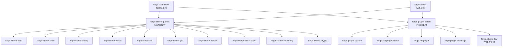
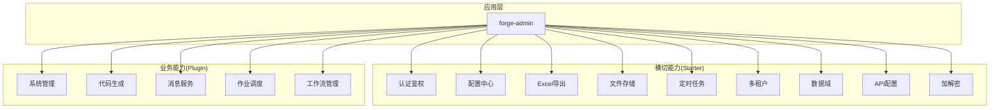
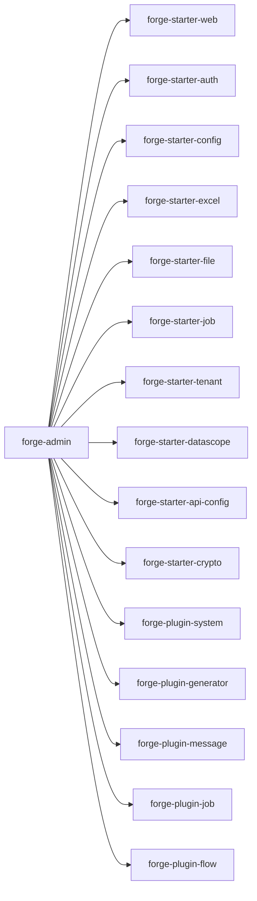

# 核心功能模块

<cite>
**本文引用的文件**
- [forge/forge-admin/src/main/resources/application.yml](file://forge/forge-admin/src/main/resources/application.yml)
- [forge/forge-admin/pom.xml](file://forge/forge-admin/pom.xml)
- [forge/forge-framework/pom.xml](file://forge/forge-framework/pom.xml)
- [forge/forge-framework/forge-starter-parent/forge-starter-api-config/API_CONFIG_USAGE.md](file://forge/forge-framework/forge-starter-parent/forge-starter-api-config/API_CONFIG_USAGE.md)
- [forge/forge-framework/forge-starter-parent/forge-starter-datascope/DATA_SCOPE_CONFIG_GUIDE.md](file://forge/forge-framework/forge-starter-parent/forge-starter-datascope/DATA_SCOPE_CONFIG_GUIDE.md)
- [forge/forge-framework/forge-starter-parent/forge-starter-tenant/TENANT_USAGE.md](file://forge/forge-framework/forge-starter-parent/forge-starter-tenant/TENANT_USAGE.md)
- [forge/forge-framework/forge-starter-parent/forge-starter-job/API.md](file://forge/forge-framework/forge-starter-parent/forge-starter-job/API.md)
- [forge/forge-framework/forge-starter-parent/forge-starter-excel/README.md](file://forge/forge-framework/forge-starter-parent/forge-starter-excel/README.md)
- [forge/forge-framework/forge-starter-parent/forge-starter-file/pom.xml](file://forge/forge-framework/forge-starter-parent/forge-starter-file/pom.xml)
- [forge/forge-framework/forge-starter-parent/forge-starter-config/USAGE_EXAMPLE.md](file://forge/forge-framework/forge-starter-parent/forge-starter-config/USAGE_EXAMPLE.md)
- [forge/forge-framework/forge-starter-parent/forge-starter-auth/sql/auth_lock_config.sql](file://forge/forge-framework/forge-starter-parent/forge-starter-auth/sql/auth_lock_config.sql)
- [forge/forge-framework/forge-starter-parent/forge-starter-auth/sql/auth_online_user.sql](file://forge/forge-framework/forge-starter-parent/forge-starter-auth/sql/auth_online_user.sql)
- [forge/forge-framework/forge-starter-parent/forge-starter-auth/sql/online_user_menu.sql](file://forge/forge-framework/forge-starter-parent/forge-starter-auth/sql/online_user_menu.sql)
- [forge/forge-framework/forge-starter-parent/forge-starter-datascope/sql/datascope_tables.sql](file://forge/forge-framework/forge-starter-parent/forge-starter-datascope/sql/datascope_tables.sql)
- [forge/forge-framework/forge-starter-parent/forge-starter-tenant/sql/tenant_tables.sql](file://forge/forge-framework/forge-starter-parent/forge-starter-tenant/sql/tenant_tables.sql)
- [forge/forge-framework/forge-starter-parent/forge-starter-job/sql/job_tables.sql](file://forge/forge-framework/forge-starter-parent/forge-starter-job/sql/job_tables.sql)
- [forge/forge-framework/forge-starter-parent/forge-starter-excel/sql/excel_export_config.sql](file://forge/forge-framework/forge-starter-parent/forge-starter-excel/sql/excel_export_config.sql)
- [forge/forge-framework/forge-starter-parent/forge-starter-file/sql/file_storage.sql](file://forge/forge-framework/forge-starter-parent/forge-starter-file/sql/file_storage.sql)
- [forge/forge-framework/forge-starter-parent/forge-starter-config/sql/config_properties.sql](file://forge/forge-framework/forge-starter-parent/forge-starter-config/sql/config_properties.sql)
- [forge/forge-framework/forge-starter-parent/forge-starter-id/sql/id_tables.sql](file://forge/forge-framework/forge-starter-parent/forge-starter-id/sql/id_tables.sql)
- [forge/forge-framework/forge-starter-parent/forge-starter-id/sql/init_data.sql](file://forge/forge-framework/forge-starter-parent/forge-starter-id/sql/init_data.sql)
- [forge/forge-framework/forge-starter-parent/forge-starter-crypto/src/main/java/com/mdframe/forge/starter/crypto/CryptoAutoConfiguration.java](file://forge/forge-framework/forge-starter-parent/forge-starter-crypto/src/main/java/com/mdframe/forge/starter/crypto/CryptoAutoConfiguration.java)
- [forge/forge-framework/forge-starter-parent/forge-starter-crypto/src/main/java/com/mdframe/forge/starter/crypto/CryptoProperties.java](file://forge/forge-framework/forge-starter-parent/forge-starter-crypto/src/main/java/com/mdframe/forge/starter/crypto/CryptoProperties.java)
- [forge/forge-framework/forge-starter-parent/forge-starter-crypto/src/main/java/com/mdframe/forge/starter/crypto/CryptoService.java](file://forge/forge-framework/forge-starter-parent/forge-starter-crypto/src/main/java/com/mdframe/forge/starter/crypto/CryptoService.java)
- [forge/forge-framework/forge-starter-parent/forge-starter-crypto/src/main/java/com/mdframe/forge/starter/crypto/EncryptRequest.java](file://forge/forge-framework/forge-starter-parent/forge-starter-crypto/src/main/java/com/mdframe/forge/starter/crypto/EncryptRequest.java)
- [forge/forge-framework/forge-starter-parent/forge-starter-crypto/src/main/java/com/mdframe/forge/starter/crypto/EncryptResponse.java](file://forge/forge-framework/forge-starter-parent/forge-starter-crypto/src/main/java/com/mdframe/forge/starter/crypto/EncryptResponse.java)
- [forge/forge-framework/forge-starter-parent/forge-starter-crypto/src/main/java/com/mdframe/forge/starter/crypto/EncryptStrategy.java](file://forge/forge-framework/forge-starter-parent/forge-starter-crypto/src/main/java/com/mdframe/forge/starter/crypto/EncryptStrategy.java)
- [forge/forge-framework/forge-starter-parent/forge-starter-crypto/src/main/java/com/mdframe/forge/starter/crypto/Encryptor.java](file://forge/forge-framework/forge-starter-parent/forge-starter-crypto/src/main/java/com/mdframe/forge/starter/crypto/Encryptor.java)
- [forge/forge-framework/forge-starter-parent/forge-starter-crypto/src/main/java/com/mdframe/forge/starter/crypto/Decryptor.java](file://forge/forge-framework/forge-starter-parent/forge-starter-crypto/src/main/java/com/mdframe/forge/starter/crypto/Decryptor.java)
- [forge/forge-framework/forge-starter-parent/forge-starter-crypto/src/main/java/com/mdframe/forge/starter/crypto/strategy/AesEncryptStrategy.java](file://forge/forge-framework/forge-starter-parent/forge-starter-crypto/src/main/java/com/mdframe/forge/starter/crypto/strategy/AesEncryptStrategy.java)
- [forge/forge-framework/forge-starter-parent/forge-starter-crypto/src/main/java/com/mdframe/forge/starter/crypto/strategy/RsaEncryptStrategy.java](file://forge/forge-framework/forge-starter-parent/forge-starter-crypto/src/main/java/com/mdframe/forge/starter/crypto/strategy/RsaEncryptStrategy.java)
- [forge/forge-framework/forge-starter-parent/forge-starter-crypto/src/main/java/com/mdframe/forge/starter/crypto/strategy/Sm4EncryptStrategy.java](file://forge/forge-framework/forge-starter-parent/forge-starter-crypto/src/main/java/com/mdframe/forge/starter/crypto/strategy/Sm4EncryptStrategy.java)
- [forge/forge-framework/forge-starter-parent/forge-starter-crypto/src/main/java/com/mdframe/forge/starter/crypto/utils/CryptoUtils.java](file://forge/forge-framework/forge-starter-parent/forge-starter-crypto/src/main/java/com/mdframe/forge/starter/crypto/utils/CryptoUtils.java)
- [forge/forge-framework/forge-starter-parent/forge-starter-crypto/src/main/java/com/mdframe/forge/starter/crypto/utils/KeyExchange.java](file://forge/forge-framework/forge-starter-parent/forge-starter-crypto/src/main/java/com/mdframe/forge/starter/crypto/utils/KeyExchange.java)
- [forge/forge-framework/forge-starter-parent/forge-starter-crypto/src/main/java/com/mdframe/forge/starter/crypto/utils/KeyPair.java](file://forge/forge-framework/forge-starter-parent/forge-starter-crypto/src/main/java/com/mdframe/forge/starter/crypto/utils/KeyPair.java)
- [forge/forge-framework/forge-starter-parent/forge-starter-crypto/src/main/java/com/mdframe/forge/starter/crypto/utils/RSAKeyPair.java](file://forge/forge-framework/forge-starter-parent/forge-starter-crypto/src/main/java/com/mdframe/forge/starter/crypto/utils/RSAKeyPair.java)
- [forge/forge-framework/forge-starter-parent/forge-starter-crypto/src/main/java/com/mdframe/forge/starter/crypto/utils/SM4KeyPair.java](file://forge/forge-framework/forge-starter-parent/forge-starter-crypto/src/main/java/com/mdframe/forge/starter/crypto/utils/SM4KeyPair.java)
- [forge/forge-framework/forge-starter-parent/forge-starter-crypto/src/main/java/com/mdframe/forge/starter/crypto/utils/AESKeyPair.java](file://forge/forge-framework/forge-starter-parent/forge-starter-crypto/src/main/java/com/mdframe/forge/starter/crypto/utils/AESKeyPair.java)
- [forge/forge-framework/forge-starter-parent/forge-starter-crypto/src/main/java/com/mdframe/forge/starter/crypto/interceptor/CryptoInterceptor.java](file://forge/forge-framework/forge-starter-parent/forge-starter-crypto/src/main/java/com/mdframe/forge/starter/crypto/interceptor/CryptoInterceptor.java)
- [forge/forge-framework/forge-starter-parent/forge-starter-crypto/src/main/java/com/mdframe/forge/starter/crypto/interceptor/EncryptRequestInterceptor.java](file://forge/forge-framework/forge-starter-parent/forge-starter-crypto/src/main/java/com/mdframe/forge/starter/crypto/interceptor/EncryptRequestInterceptor.java)
- [forge/forge-framework/forge-starter-parent/forge-starter-crypto/src/main/java/com/mdframe/forge/starter/crypto/interceptor/DecryptResponseInterceptor.java](file://forge/forge-framework/forge-starter-parent/forge-starter-crypto/src/main/java/com/mdframe/forge/starter/crypto/interceptor/DecryptResponseInterceptor.java)
- [forge/forge-framework/forge-starter-parent/forge-starter-crypto/src/main/java/com/mdframe/forge/starter/crypto/interceptor/EncryptResponseInterceptor.java](file://forge/forge-framework/forge-starter-parent/forge-starter-crypto/src/main/java/com/mdframe/forge/starter/crypto/interceptor/EncryptResponseInterceptor.java)
- [forge/forge-framework/forge-starter-parent/forge-starter-crypto/src/main/java/com/mdframe/forge/starter/crypto/interceptor/DecryptRequestInterceptor.java](file://forge/forge-framework/forge-starter-parent/forge-starter-crypto/src/main/java/com/mdframe/forge/starter/crypto/interceptor/DecryptRequestInterceptor.java)
- [forge/forge-framework/forge-starter-parent/forge-starter-crypto/src/main/java/com/mdframe/forge/starter/crypto/interceptor/GlobalCryptoInterceptor.java](file://forge/forge-framework/forge-starter-parent/forge-starter-crypto/src/main/java/com/mdframe/forge/starter/crypto/interceptor/GlobalCryptoInterceptor.java)
- [forge/forge-framework/forge-starter-parent/forge-starter-crypto/src/main/java/com/mdframe/forge/starter/crypto/interceptor/RequestCryptoInterceptor.java](file://forge/forge-framework/forge-starter-parent/forge-starter-crypto/src/main/java/com/mdframe/forge/starter/crypto/interceptor/RequestCryptoInterceptor.java)
- [forge/forge-framework/forge-starter-parent/forge-starter-crypto/src/main/java/com/mdframe/forge/starter/crypto/interceptor/ResponseCryptoInterceptor.java](file://forge/forge-framework/forge-starter-parent/forge-starter-crypto/src/main/java/com/mdframe/forge/starter/crypto/interceptor/ResponseCryptoInterceptor.java)
- [forge/forge-framework/forge-starter-parent/forge-starter-crypto/src/main/java/com/mdframe/forge/starter/crypto/interceptor/strategy/EncryptStrategyResolver.java](file://forge/forge-framework/forge-starter-parent/forge-starter-crypto/src/main/java/com/mdframe/forge/starter/crypto/interceptor/strategy/EncryptStrategyResolver.java)
- [forge/forge-framework/forge-starter-parent/forge-starter-crypto/src/main/java/com/mdframe/forge/starter/crypto/interceptor/strategy/DecryptStrategyResolver.java](file://forge/forge-framework/forge-starter-parent/forge-starter-crypto/src/main/java/com/mdframe/forge/starter/crypto/interceptor/strategy/DecryptStrategyResolver.java)
- [forge/forge-framework/forge-starter-parent/forge-starter-crypto/src/main/java/com/mdframe/forge/starter/crypto/interceptor/strategy/DefaultEncryptStrategyResolver.java](file://forge/forge-framework/forge-starter-parent/forge-starter-crypto/src/main/java/com/mdframe/forge/starter/crypto/interceptor/strategy/DefaultEncryptStrategyResolver.java)
- [forge/forge-framework/forge-starter-parent/forge-starter-crypto/src/main/java/com/mdframe/forge/starter/crypto/interceptor/strategy/DefaultDecryptStrategyResolver.java](file://forge/forge-framework/forge-starter-parent/forge-starter-crypto/src/main/java/com/mdframe/forge/starter/crypto/interceptor/strategy/DefaultDecryptStrategyResolver.java)
- [forge/forge-framework/forge-starter-parent/forge-starter-crypto/src/main/java/com/mdframe/forge/starter/crypto/interceptor/strategy/CompositeEncryptStrategyResolver.java](file://forge/forge-framework/forge-starter-parent/forge-starter-crypto/src/main/java/com/mdframe/forge/starter/crypto/interceptor/strategy/CompositeEncryptStrategyResolver.java)
- [forge/forge-framework/forge-starter-parent/forge-starter-crypto/src/main/java/com/mdframe/forge/starter/crypto/interceptor/strategy/CompositeDecryptStrategyResolver.java](file://forge/forge-framework/forge-starter-parent/forge-starter-crypto/src/main/java/com/mdframe/forge/starter/crypto/interceptor/strategy/CompositeDecryptStrategyResolver.java)
- [forge/forge-framework/forge-starter-parent/forge-starter-crypto/src/main/java/com/mdframe/forge/starter/crypto/interceptor/strategy/SingleEncryptStrategyResolver.java](file://forge/forge-framework/forge-starter-parent/forge-starter-crypto/src/main/java/com/mdframe/forge/starter/crypto/interceptor/strategy/SingleEncryptStrategyResolver.java)
- [forge/forge-framework/forge-starter-parent/forge-starter-crypto/src/main/java/com/mdframe/forge/starter/crypto/interceptor/strategy/SingleDecryptStrategyResolver.java](file://forge/forge-framework/forge-starter-parent/forge-starter-crypto/src/main/java/com/mdframe/forge/starter/crypto/interceptor/strategy/SingleDecryptStrategyResolver.java)
- [forge/forge-framework/forge-starter-parent/forge-starter-crypto/src/main/java/com/mdframe/forge/starter/crypto/interceptor/strategy/NullEncryptStrategyResolver.java](file://forge/forge-framework/forge-starter-parent/forge-starter-crypto/src/main/java/com/mdframe/forge/starter/crypto/interceptor/strategy/NullEncryptStrategyResolver.java)
- [forge/forge-framework/forge-starter-parent/forge-starter-crypto/src/main/java/com/mdframe/forge/starter/crypto/interceptor/strategy/NullDecryptStrategyResolver.java](file://forge/forge-framework/forge-starter-parent/forge-starter-crypto/src/main/java/com/mdframe/forge/starter/crypto/interceptor/strategy/NullDecryptStrategyResolver.java)
- [forge/forge-framework/forge-starter-parent/forge-starter-crypto/src/main/java/com/mdframe/forge/starter/crypto/interceptor/strategy/StrategyChain.java](file://forge/forge-framework/forge-starter-parent/forge-starter-crypto/src/main/java/com/mdframe/forge/starter/crypto/interceptor/strategy/StrategyChain.java)
- [forge/forge-framework/forge-starter-parent/forge-starter-crypto/src/main/java/com/mdframe/forge/starter/crypto/interceptor/strategy/StrategyContext.java](file://forge/forge-framework/forge-starter-parent/forge-starter-crypto/src/main/java/com/mdframe/forge/starter/crypto/interceptor/strategy/StrategyContext.java)
- [forge/forge-framework/forge-starter-parent/forge-starter-crypto/src/main/java/com/mdframe/forge/starter/crypto/interceptor/strategy/StrategySelector.java](file://forge/forge-framework/forge-starter-parent/forge-starter-crypto/src/main/java/com/mdframe/forge/starter/crypto/interceptor/strategy/StrategySelector.java)
- [forge/forge-framework/forge-starter-parent/forge-starter-crypto/src/main/java/com/mdframe/forge/starter/crypto/interceptor/strategy/StrategySelectorBuilder.java](file://forge/forge-framework/forge-starter-parent/forge-starter-crypto/src/main/java/com/mdframe/forge/starter/crypto/interceptor/strategy/StrategySelectorBuilder.java)
- [forge/forge-framework/forge-starter-parent/forge-starter-crypto/src/main/java/com/mdframe/forge/starter/crypto/interceptor/strategy/StrategySelectorBuilderImpl.java](file://forge/forge-framework/forge-starter-parent/forge-starter-crypto/src/main/java/com/mdframe/forge/starter/crypto/interceptor/strategy/StrategySelectorBuilderImpl.java)
- [forge/forge-framework/forge-starter-parent/forge-starter-crypto/src/main/java/com/mdframe/forge/starter/crypto/utils/CryptoUtils.java](file://forge/forge-framework/forge-starter-parent/forge-starter-crypto/src/main/java/com/mdframe/forge/starter/crypto/utils/CryptoUtils.java)
- [forge/forge-framework/forge-starter-parent/forge-starter-crypto/src/main/java/com/mdframe/forge/starter/crypto/utils/KeyExchange.java](file://forge/forge-framework/forge-starter-parent/forge-starter-crypto/src/main/java/com/mdframe/forge/starter/crypto/utils/KeyExchange.java)
- [forge/forge-framework/forge-starter-parent/forge-starter-crypto/src/main/java/com/mdframe/forge/starter/crypto/utils/KeyPair.java](file://forge/forge-framework/forge-starter-parent/forge-starter-crypto/src/main/java/com/mdframe/forge/starter/crypto/utils/KeyPair.java)
- [forge/forge-framework/forge-starter-parent/forge-starter-crypto/src/main/java/com/mdframe/forge/starter/crypto/utils/RSAKeyPair.java](file://forge/forge-framework/forge-starter-parent/forge-starter-crypto/src/main/java/com/mdframe/forge/starter/crypto/utils/RSAKeyPair.java)
- [forge/forge-framework/forge-starter-parent/forge-starter-crypto/src/main/java/com/mdframe/forge/starter/crypto/utils/SM4KeyPair.java](file://forge/forge-framework/forge-starter-parent/forge-starter-crypto/src/main/java/com/mdframe/forge/starter/crypto/utils/SM4KeyPair.java)
- [forge/forge-framework/forge-starter-parent/forge-starter-crypto/src/main/java/com/mdframe/forge/starter/crypto/utils/AESKeyPair.java](file://forge/forge-framework/forge-starter-parent/forge-starter-crypto/src/main/java/com/mdframe/forge/starter/crypto/utils/AESKeyPair.java)
- [forge/forge-framework/forge-plugin-parent/forge-plugin-flow/sql/flow_tables.sql](file://forge/forge-framework/forge-plugin-parent/forge-plugin-flow/sql/flow_tables.sql)
- [forge/forge-framework/forge-plugin-parent/forge-plugin-flow/src/main/java/com/mdframe/forge/starter/flow/config/FlowAutoConfiguration.java](file://forge/forge-framework/forge-plugin-parent/forge-plugin-flow/src/main/java/com/mdframe/forge/starter/flow/config/FlowAutoConfiguration.java)
- [forge/forge-framework/forge-plugin-parent/forge-plugin-flow/src/main/java/com/mdframe/forge/starter/flow/config/FlowProperties.java](file://forge/forge-framework/forge-plugin-parent/forge-plugin-flow/src/main/java/com/mdframe/forge/starter/flow/config/FlowProperties.java)
- [forge/forge-framework/forge-plugin-parent/forge-plugin-flow/src/main/java/com/mdframe/forge/starter/flow/entity/FlowBusiness.java](file://forge/forge-framework/forge-plugin-parent/forge-plugin-flow/src/main/java/com/mdframe/forge/starter/flow/entity/FlowBusiness.java)
- [forge/forge-framework/forge-plugin-parent/forge-plugin-flow/src/main/java/com/mdframe/forge/starter/flow/entity/FlowModel.java](file://forge/forge-framework/forge-plugin-parent/forge-plugin-flow/src/main/java/com/mdframe/forge/starter/flow/entity/FlowModel.java)
- [forge/forge-framework/forge-plugin-parent/forge-plugin-flow/src/main/java/com/mdframe/forge/starter/flow/entity/FlowTask.java](file://forge/forge-framework/forge-plugin-parent/forge-plugin-flow/src/main/java/com/mdframe/forge/starter/flow/entity/FlowTask.java)
- [forge/forge-framework/forge-plugin-parent/forge-plugin-flow/src/main/java/com/mdframe/forge/starter/flow/controller/FlowTemplateController.java](file://forge/forge-framework/forge-plugin-parent/forge-plugin-flow/src/main/java/com/mdframe/forge/starter/flow/controller/FlowTemplateController.java)
- [forge/forge-framework/forge-plugin-parent/forge-plugin-flow/src/main/java/com/mdframe/forge/starter/flow/controller/FlowTaskController.java](file://forge/forge-framework/forge-plugin-parent/forge-plugin-flow/src/main/java/com/mdframe/forge/starter/flow/controller/FlowTaskController.java)
- [forge/forge-framework/forge-plugin-parent/forge-plugin-flow/src/main/java/com/mdframe/forge/starter/flow/service/FlowInstanceService.java](file://forge/forge-framework/forge-plugin-parent/forge-plugin-flow/src/main/java/com/mdframe/forge/starter/flow/service/FlowInstanceService.java)
- [forge/forge-framework/forge-plugin-parent/forge-plugin-flow/src/main/java/com/mdframe/forge/starter/flow/service/FlowTaskService.java](file://forge/forge-framework/forge-plugin-parent/forge-plugin-flow/src/main/java/com/mdframe/forge/starter/flow/service/FlowTaskService.java)
- [forge/forge-framework/forge-plugin-parent/forge-plugin-flow/src/main/java/com/mdframe/forge/starter/flow/template/FlowTemplate.java](file://forge/forge-framework/forge-plugin-parent/forge-plugin-flow/src/main/java/com/mdframe/forge/starter/flow/template/FlowTemplate.java)
- [forge/forge-framework/forge-plugin-parent/forge-plugin-flow/src/main/java/com/mdframe/forge/starter/flow/template/FlowTemplateFactory.java](file://forge/forge-framework/forge-plugin-parent/forge-plugin-flow/src/main/java/com/mdframe/forge/starter/flow/template/FlowTemplateFactory.java)
- [forge/forge-framework/forge-plugin-parent/forge-plugin-flow/src/main/resources/META-INF/spring/org.springframework.boot.autoconfigure.AutoConfiguration.imports](file://forge/forge-framework/forge-plugin-parent/forge-plugin-flow/src/main/resources/META-INF/spring/org.springframework.boot.autoconfigure.AutoConfiguration.imports)
</cite>

## 更新摘要
**所做更改**
- 新增工作流管理功能章节，详细介绍基于Flowable的业务流程自动化框架
- 添加流程模板系统、流程实例管理、流程任务处理等核心功能
- 更新项目结构图，加入工作流插件模块
- 新增工作流配置参数和最佳实践指南

## 目录
1. [简介](#简介)
2. [项目结构](#项目结构)
3. [核心组件](#核心组件)
4. [架构总览](#架构总览)
5. [详细组件分析](#详细组件分析)
6. [依赖分析](#依赖分析)
7. [性能考虑](#性能考虑)
8. [故障排查指南](#故障排查指南)
9. [结论](#结论)
10. [附录](#附录)

## 简介
本文件面向Forge框架的核心功能模块，围绕系统管理、代码生成、文件管理、定时任务、多租户、**工作流管理**等关键业务能力进行系统化梳理。文档从架构与模块关系入手，逐步深入到数据模型、API设计、配置参数、扩展开发与最佳实践，帮助开发者快速掌握模块使用方法与集成方式。

## 项目结构
Forge采用多模块Maven工程组织，核心由"框架父工程"和"应用工程"构成：
- 框架父工程：统一版本与插件管理，聚合starter与plugin子模块，形成可复用的基础能力层。
- 应用工程：forge-admin作为上层业务应用，按需引入starter与plugin模块，实现系统管理、代码生成、文件管理、定时任务、多租户、**工作流管理**等功能。

**图表来源**
- [forge/forge-framework/pom.xml:26-30](file://forge/forge-framework/pom.xml#L26-L30)
- [forge/forge-admin/pom.xml:13-76](file://forge/forge-admin/pom.xml#L13-L76)

**章节来源**
- [forge/forge-framework/pom.xml:1-117](file://forge/forge-framework/pom.xml#L1-L117)
- [forge/forge-admin/pom.xml:1-111](file://forge/forge-admin/pom.xml#L1-L111)

## 核心组件
本节聚焦于六大核心业务模块及其支撑能力：
- 系统管理：用户、角色、菜单、字典、通知、登录日志、操作日志等基础能力，通过System Plugin与相关Starter提供。
- 代码生成：基于模板与数据源的自动化代码生成，支持多表、多模板组合。
- 文件管理：文件上传、存储、分组、URL管理，支持多种存储策略。
- 定时任务：基于注解与调度器的分布式任务编排，支持失败重试与日志记录。
- 多租户：租户隔离、路由与数据域控制，保障多租户场景下的安全与一致性。
- **工作流管理**：基于Flowable的业务流程自动化框架，支持请假申请、费用报销、通用审批等流程类型。

**章节来源**
- [forge/forge-framework/forge-starter-parent/forge-starter-tenant/TENANT_USAGE.md](file://forge/forge-framework/forge-starter-parent/forge-starter-tenant/TENANT_USAGE.md)
- [forge/forge-framework/forge-starter-parent/forge-starter-job/API.md](file://forge/forge-framework/forge-starter-parent/forge-starter-job/API.md)
- [forge/forge-framework/forge-starter-parent/forge-starter-excel/README.md](file://forge/forge-framework/forge-starter-parent/forge-starter-excel/README.md)

## 架构总览
Forge在应用层通过Spring Boot启动，Starter提供横切能力（认证、缓存、配置中心、Excel、文件、定时任务、租户、数据域、API配置、加解密），Plugin提供业务能力（系统、生成器、消息、作业、**工作流**）。应用工程按需装配，形成"横切能力+业务插件"的组合式架构。

**图表来源**
- [forge/forge-admin/pom.xml:13-76](file://forge/forge-admin/pom.xml#L13-L76)

## 详细组件分析

### 系统管理（System）
- 能力范围：用户、角色、菜单、部门、岗位、字典、通知公告、登录日志、操作日志等。
- 数据模型：以Sys前缀命名的表结构，涵盖用户、角色、菜单、字典、通知等核心实体。
- 集成方式：通过System Plugin与相关Starter（如认证、Excel、文件）协同工作。
- 最佳实践：统一使用雪花ID，结合数据域与API配置实现细粒度权限控制；日志与审计贯穿全链路。

**章节来源**
- [forge/forge-framework/forge-starter-parent/forge-starter-auth/sql/auth_lock_config.sql](file://forge/forge-framework/forge-starter-parent/forge-starter-auth/sql/auth_lock_config.sql)
- [forge/forge-framework/forge-starter-parent/forge-starter-auth/sql/auth_online_user.sql](file://forge/forge-framework/forge-starter-parent/forge-starter-auth/sql/auth_online_user.sql)
- [forge/forge-framework/forge-starter-parent/forge-starter-auth/sql/online_user_menu.sql](file://forge/forge-framework/forge-starter-parent/forge-starter-auth/sql/online_user_menu.sql)

### 代码生成（Generator）
- 能力范围：根据数据源与模板生成后端代码、前端页面或前后端一体化产物。
- 配置要点：数据源配置、模板选择、生成目录与命名规范。
- 扩展指南：新增模板引擎、自定义生成规则、批量生成策略。
- 最佳实践：先建模再生成，保持模板版本管理与差异对比。

**章节来源**
- [forge/forge-framework/forge-starter-parent/forge-starter-config/USAGE_EXAMPLE.md](file://forge/forge-framework/forge-starter-parent/forge-starter-config/USAGE_EXAMPLE.md)

### 文件管理（File Storage）
- 能力范围：文件上传、分组、URL管理、存储策略切换。
- 数据模型：file_storage表记录文件元数据与存储路径。
- 集成方式：配合Starter-File与存储后端（本地/MinIO/OSS等）。
- 最佳实践：统一文件命名与分桶策略，开启CDN加速与安全校验。

**章节来源**
- [forge/forge-framework/forge-starter-parent/forge-starter-file/sql/file_storage.sql](file://forge/forge-framework/forge-starter-parent/forge-starter-file/sql/file_storage.sql)

### 定时任务（Job）
- 能力范围：基于注解的定时任务注册、调度、失败重试、日志记录。
- API参考：详见Starter-Job的API说明文档。
- 最佳实践：任务幂等、超时控制、异常隔离与告警联动。

**章节来源**
- [forge/forge-framework/forge-starter-parent/forge-starter-job/API.md](file://forge/forge-framework/forge-starter-parent/forge-starter-job/API.md)
- [forge/forge-framework/forge-starter-parent/forge-starter-job/sql/job_tables.sql](file://forge/forge-framework/forge-starter-parent/forge-starter-job/sql/job_tables.sql)

### 多租户（Tenant）
- 能力范围：租户隔离、路由与数据域控制，支持多租户共享与独立部署。
- 使用指南：详见TENANT_USAGE文档。
- 最佳实践：租户维度的资源配额、审计日志与数据备份策略。

**章节来源**
- [forge/forge-framework/forge-starter-parent/forge-starter-tenant/TENANT_USAGE.md](file://forge/forge-framework/forge-starter-parent/forge-starter-tenant/TENANT_USAGE.md)
- [forge/forge-framework/forge-starter-parent/forge-starter-tenant/sql/tenant_tables.sql](file://forge/forge-framework/forge-starter-parent/forge-starter-tenant/sql/tenant_tables.sql)

### 工作流管理（Flow）
- **新增** 完整的业务流程自动化框架，基于Flowable 6.8.0实现
- 能力范围：流程模板管理、流程实例发起、任务审批、流程监控
- 支持流程类型：请假流程、费用报销流程、通用审批流程、合同流程、采购流程
- 核心组件：
  - FlowTemplateFactory：内置流程模板工厂，提供预定义流程模板
  - FlowInstanceService：流程实例生命周期管理
  - FlowTaskService：流程任务处理与审批
  - FlowBusiness：流程业务关联实体
  - FlowTask：流程任务实体
  - FlowModel：流程模型实体
- 数据模型：包含流程模型、业务关联、任务、抄送、意见、分类、模板等表结构
- 集成方式：通过FlowAutoConfiguration自动装配Flowable引擎及相关服务
- 最佳实践：合理设计流程模板、设置审批节点、配置任务超时与提醒机制

**章节来源**
- [forge/forge-framework/forge-plugin-parent/forge-plugin-flow/sql/flow_tables.sql](file://forge/forge-framework/forge-plugin-parent/forge-plugin-flow/sql/flow_tables.sql)
- [forge/forge-framework/forge-plugin-parent/forge-plugin-flow/src/main/java/com/mdframe/forge/starter/flow/config/FlowAutoConfiguration.java](file://forge/forge-framework/forge-plugin-parent/forge-plugin-flow/src/main/java/com/mdframe/forge/starter/flow/config/FlowAutoConfiguration.java)
- [forge/forge-framework/forge-plugin-parent/forge-plugin-flow/src/main/java/com/mdframe/forge/starter/flow/config/FlowProperties.java](file://forge/forge-framework/forge-plugin-parent/forge-plugin-flow/src/main/java/com/mdframe/forge/starter/flow/config/FlowProperties.java)
- [forge/forge-framework/forge-plugin-parent/forge-plugin-flow/src/main/java/com/mdframe/forge/starter/flow/entity/FlowBusiness.java](file://forge/forge-framework/forge-plugin-parent/forge-plugin-flow/src/main/java/com/mdframe/forge/starter/flow/entity/FlowBusiness.java)
- [forge/forge-framework/forge-plugin-parent/forge-plugin-flow/src/main/java/com/mdframe/forge/starter/flow/entity/FlowModel.java](file://forge/forge-framework/forge-plugin-parent/forge-plugin-flow/src/main/java/com/mdframe/forge/starter/flow/entity/FlowModel.java)
- [forge/forge-framework/forge-plugin-parent/forge-plugin-flow/src/main/java/com/mdframe/forge/starter/flow/entity/FlowTask.java](file://forge/forge-framework/forge-plugin-parent/forge-plugin-flow/src/main/java/com/mdframe/forge/starter/flow/entity/FlowTask.java)
- [forge/forge-framework/forge-plugin-parent/forge-plugin-flow/src/main/java/com/mdframe/forge/starter/flow/controller/FlowTemplateController.java](file://forge/forge-framework/forge-plugin-parent/forge-plugin-flow/src/main/java/com/mdframe/forge/starter/flow/controller/FlowTemplateController.java)
- [forge/forge-framework/forge-plugin-parent/forge-plugin-flow/src/main/java/com/mdframe/forge/starter/flow/controller/FlowTaskController.java](file://forge/forge-framework/forge-plugin-parent/forge-plugin-flow/src/main/java/com/mdframe/forge/starter/flow/controller/FlowTaskController.java)
- [forge/forge-framework/forge-plugin-parent/forge-plugin-flow/src/main/java/com/mdframe/forge/starter/flow/service/FlowInstanceService.java](file://forge/forge-framework/forge-plugin-parent/forge-plugin-flow/src/main/java/com/mdframe/forge/starter/flow/service/FlowInstanceService.java)
- [forge/forge-framework/forge-plugin-parent/forge-plugin-flow/src/main/java/com/mdframe/forge/starter/flow/service/FlowTaskService.java](file://forge/forge-framework/forge-plugin-parent/forge-plugin-flow/src/main/java/com/mdframe/forge/starter/flow/service/FlowTaskService.java)
- [forge/forge-framework/forge-plugin-parent/forge-plugin-flow/src/main/java/com/mdframe/forge/starter/flow/template/FlowTemplate.java](file://forge/forge-framework/forge-plugin-parent/forge-plugin-flow/src/main/java/com/mdframe/forge/starter/flow/template/FlowTemplate.java)
- [forge/forge-framework/forge-plugin-parent/forge-plugin-flow/src/main/java/com/mdframe/forge/starter/flow/template/FlowTemplateFactory.java](file://forge/forge-framework/forge-plugin-parent/forge-plugin-flow/src/main/java/com/mdframe/forge/starter/flow/template/FlowTemplateFactory.java)

### 加解密（Crypto）
- 能力范围：请求/响应加解密、密钥交换、多种加密算法（AES/RSA/SM4）。
- 关键组件：
  - CryptoAutoConfiguration：自动装配加解密组件。
  - EncryptRequest/EncryptResponse：加解密拦截器。
  - EncryptStrategy/Decryptor/Encryptor：策略与工具类。
  - interceptor包：全局与局部拦截器链路。
  - strategy包：策略解析器与选择器。
  - utils包：密钥对与工具类。
- 集成方式：在Starter-Crypto基础上，通过拦截器链路自动生效。
- 最佳实践：生产环境启用HTTPS与强随机密钥，定期轮换密钥与审计日志。

```mermaid
classDiagram
class CryptoAutoConfiguration
class CryptoProperties
class CryptoService
class EncryptRequest
class EncryptResponse
class EncryptStrategy
class Encryptor
class Decryptor
class AesEncryptStrategy
class RsaEncryptStrategy
class Sm4EncryptStrategy
class CryptoInterceptor
class EncryptRequestInterceptor
class DecryptResponseInterceptor
class EncryptResponseInterceptor
class DecryptRequestInterceptor
class GlobalCryptoInterceptor
class RequestCryptoInterceptor
class ResponseCryptoInterceptor
class EncryptStrategyResolver
class DecryptStrategyResolver
class DefaultEncryptStrategyResolver
class DefaultDecryptStrategyResolver
class CompositeEncryptStrategyResolver
class CompositeDecryptStrategyResolver
class SingleEncryptStrategyResolver
class SingleDecryptStrategyResolver
class NullEncryptStrategyResolver
class NullDecryptStrategyResolver
class StrategyChain
class StrategyContext
class StrategySelector
class StrategySelectorBuilder
class StrategySelectorBuilderImpl
class CryptoUtils
class KeyExchange
class KeyPair
class RSAKeyPair
class SM4KeyPair
class AESKeyPair
CryptoAutoConfiguration --> CryptoProperties : "读取配置"
CryptoAutoConfiguration --> CryptoService : "装配服务"
CryptoService --> Encryptor : "使用"
CryptoService --> Decryptor : "使用"
Encryptor --> AesEncryptStrategy : "策略"
Encryptor --> RsaEncryptStrategy : "策略"
Encryptor --> Sm4EncryptStrategy : "策略"
Decryptor --> AesEncryptStrategy : "策略"
Decryptor --> RsaEncryptStrategy : "策略"
Decryptor --> Sm4EncryptStrategy : "策略"
CryptoInterceptor --> EncryptRequestInterceptor : "委托"
CryptoInterceptor --> DecryptResponseInterceptor : "委托"
CryptoInterceptor --> EncryptResponseInterceptor : "委托"
CryptoInterceptor --> DecryptRequestInterceptor : "委托"
GlobalCryptoInterceptor --> RequestCryptoInterceptor : "委托"
GlobalCryptoInterceptor --> ResponseCryptoInterceptor : "委托"
StrategySelectorBuilder --> StrategySelectorBuilderImpl : "构建"
StrategySelector --> StrategySelectorBuilder : "使用"
StrategyChain --> StrategyContext : "上下文"
StrategyContext --> StrategySelector : "选择"
```

**图表来源**
- [forge/forge-framework/forge-starter-parent/forge-starter-crypto/src/main/java/com/mdframe/forge/starter/crypto/CryptoAutoConfiguration.java](file://forge/forge-framework/forge-starter-parent/forge-starter-crypto/src/main/java/com/mdframe/forge/starter/crypto/CryptoAutoConfiguration.java)
- [forge/forge-framework/forge-starter-parent/forge-starter-crypto/src/main/java/com/mdframe/forge/starter/crypto/CryptoProperties.java](file://forge/forge-framework/forge-starter-parent/forge-starter-crypto/src/main/java/com/mdframe/forge/starter/crypto/CryptoProperties.java)
- [forge/forge-framework/forge-starter-parent/forge-starter-crypto/src/main/java/com/mdframe/forge/starter/crypto/CryptoService.java](file://forge/forge-framework/forge-starter-parent/forge-starter-crypto/src/main/java/com/mdframe/forge/starter/crypto/CryptoService.java)
- [forge/forge-framework/forge-starter-parent/forge-starter-crypto/src/main/java/com/mdframe/forge/starter/crypto/EncryptRequest.java](file://forge/forge-framework/forge-starter-parent/forge-starter-crypto/src/main/java/com/mdframe/forge/starter/crypto/EncryptRequest.java)
- [forge/forge-framework/forge-starter-parent/forge-starter-crypto/src/main/java/com/mdframe/forge/starter/crypto/EncryptResponse.java](file://forge/forge-framework/forge-starter-parent/forge-starter-crypto/src/main/java/com/mdframe/forge/starter/crypto/EncryptResponse.java)
- [forge/forge-framework/forge-starter-parent/forge-starter-crypto/src/main/java/com/mdframe/forge/starter/crypto/EncryptStrategy.java](file://forge/forge-framework/forge-starter-parent/forge-starter-crypto/src/main/java/com/mdframe/forge/starter/crypto/EncryptStrategy.java)
- [forge/forge-framework/forge-starter-parent/forge-starter-crypto/src/main/java/com/mdframe/forge/starter/crypto/Encryptor.java](file://forge/forge-framework/forge-starter-parent/forge-starter-crypto/src/main/java/com/mdframe/forge/starter/crypto/Encryptor.java)
- [forge/forge-framework/forge-starter-parent/forge-starter-crypto/src/main/java/com/mdframe/forge/starter/crypto/Decryptor.java](file://forge/forge-framework/forge-starter-parent/forge-starter-crypto/src/main/java/com/mdframe/forge/starter/crypto/Decryptor.java)
- [forge/forge-framework/forge-starter-parent/forge-starter-crypto/src/main/java/com/mdframe/forge/starter/crypto/strategy/AesEncryptStrategy.java](file://forge/forge-framework/forge-starter-parent/forge-starter-crypto/src/main/java/com/mdframe/forge/starter/crypto/strategy/AesEncryptStrategy.java)
- [forge/forge-framework/forge-starter-parent/forge-starter-crypto/src/main/java/com/mdframe/forge/starter/crypto/strategy/RsaEncryptStrategy.java](file://forge/forge-framework/forge-starter-parent/forge-starter-crypto/src/main/java/com/mdframe/forge/starter/crypto/strategy/RsaEncryptStrategy.java)
- [forge/forge-framework/forge-starter-parent/forge-starter-crypto/src/main/java/com/mdframe/forge/starter/crypto/strategy/Sm4EncryptStrategy.java](file://forge/forge-framework/forge-starter-parent/forge-starter-crypto/src/main/java/com/mdframe/forge/starter/crypto/strategy/Sm4EncryptStrategy.java)
- [forge/forge-framework/forge-starter-parent/forge-starter-crypto/src/main/java/com/mdframe/forge/starter/crypto/interceptor/CryptoInterceptor.java](file://forge/forge-framework/forge-starter-parent/forge-starter-crypto/src/main/java/com/mdframe/forge/starter/crypto/interceptor/CryptoInterceptor.java)
- [forge/forge-framework/forge-starter-parent/forge-starter-crypto/src/main/java/com/mdframe/forge/starter/crypto/interceptor/EncryptRequestInterceptor.java](file://forge/forge-framework/forge-starter-parent/forge-starter-crypto/src/main/java/com/mdframe/forge/starter/crypto/interceptor/EncryptRequestInterceptor.java)
- [forge/forge-framework/forge-starter-parent/forge-starter-crypto/src/main/java/com/mdframe/forge/starter/crypto/interceptor/DecryptResponseInterceptor.java](file://forge/forge-framework/forge-starter-parent/forge-starter-crypto/src/main/java/com/mdframe/forge/starter/crypto/interceptor/DecryptResponseInterceptor.java)
- [forge/forge-framework/forge-starter-parent/forge-starter-crypto/src/main/java/com/mdframe/forge/starter/crypto/interceptor/EncryptResponseInterceptor.java](file://forge/forge-framework/forge-starter-parent/forge-starter-crypto/src/main/java/com/mdframe/forge/starter/crypto/interceptor/EncryptResponseInterceptor.java)
- [forge/forge-framework/forge-starter-parent/forge-starter-crypto/src/main/java/com/mdframe/forge/starter/crypto/interceptor/DecryptRequestInterceptor.java](file://forge/forge-framework/forge-starter-parent/forge-starter-crypto/src/main/java/com/mdframe/forge/starter/crypto/interceptor/DecryptRequestInterceptor.java)
- [forge/forge-framework/forge-starter-parent/forge-starter-crypto/src/main/java/com/mdframe/forge/starter/crypto/interceptor/GlobalCryptoInterceptor.java](file://forge/forge-framework/forge-starter-parent/forge-starter-crypto/src/main/java/com/mdframe/forge/starter/crypto/interceptor/GlobalCryptoInterceptor.java)
- [forge/forge-framework/forge-starter-parent/forge-starter-crypto/src/main/java/com/mdframe/forge/starter/crypto/interceptor/RequestCryptoInterceptor.java](file://forge/forge-framework/forge-starter-parent/forge-starter-crypto/src/main/java/com/mdframe/forge/starter/crypto/interceptor/RequestCryptoInterceptor.java)
- [forge/forge-framework/forge-starter-parent/forge-starter-crypto/src/main/java/com/mdframe/forge/starter/crypto/interceptor/ResponseCryptoInterceptor.java](file://forge/forge-framework/forge-starter-parent/forge-starter-crypto/src/main/java/com/mdframe/forge/starter/crypto/interceptor/ResponseCryptoInterceptor.java)
- [forge/forge-framework/forge-starter-parent/forge-starter-crypto/src/main/java/com/mdframe/forge/starter/crypto/interceptor/strategy/EncryptStrategyResolver.java](file://forge/forge-framework/forge-starter-parent/forge-starter-crypto/src/main/java/com/mdframe/forge/starter/crypto/interceptor/strategy/EncryptStrategyResolver.java)
- [forge/forge-framework/forge-starter-parent/forge-starter-crypto/src/main/java/com/mdframe/forge/starter/crypto/interceptor/strategy/DecryptStrategyResolver.java](file://forge/forge-framework/forge-starter-parent/forge-starter-crypto/src/main/java/com/mdframe/forge/starter/crypto/interceptor/strategy/DecryptStrategyResolver.java)
- [forge/forge-framework/forge-starter-parent/forge-starter-crypto/src/main/java/com/mdframe/forge/starter/crypto/interceptor/strategy/DefaultEncryptStrategyResolver.java](file://forge/forge-framework/forge-starter-parent/forge-starter-crypto/src/main/java/com/mdframe/forge/starter/crypto/interceptor/strategy/DefaultEncryptStrategyResolver.java)
- [forge/forge-framework/forge-starter-parent/forge-starter-crypto/src/main/java/com/mdframe/forge/starter/crypto/interceptor/strategy/DefaultDecryptStrategyResolver.java](file://forge/forge-framework/forge-starter-parent/forge-starter-crypto/src/main/java/com/mdframe/forge/starter/crypto/interceptor/strategy/DefaultDecryptStrategyResolver.java)
- [forge/forge-framework/forge-starter-parent/forge-starter-crypto/src/main/java/com/mdframe/forge/starter/crypto/interceptor/strategy/CompositeEncryptStrategyResolver.java](file://forge/forge-framework/forge-starter-parent/forge-starter-crypto/src/main/java/com/mdframe/forge/starter/crypto/interceptor/strategy/CompositeEncryptStrategyResolver.java)
- [forge/forge-framework/forge-starter-parent/forge-starter-crypto/src/main/java/com/mdframe/forge/starter/crypto/interceptor/strategy/CompositeDecryptStrategyResolver.java](file://forge/forge-framework/forge-starter-parent/forge-starter-crypto/src/main/java/com/mdframe/forge/starter/crypto/interceptor/strategy/CompositeDecryptStrategyResolver.java)
- [forge/forge-framework/forge-starter-parent/forge-starter-crypto/src/main/java/com/mdframe/forge/starter/crypto/interceptor/strategy/SingleEncryptStrategyResolver.java](file://forge/forge-framework/forge-starter-parent/forge-starter-crypto/src/main/java/com/mdframe/forge/starter/crypto/interceptor/strategy/SingleEncryptStrategyResolver.java)
- [forge/forge-framework/forge-starter-parent/forge-starter-crypto/src/main/java/com/mdframe/forge/starter/crypto/interceptor/strategy/SingleDecryptStrategyResolver.java](file://forge/forge-framework/forge-starter-parent/forge-starter-crypto/src/main/java/com/mdframe/forge/starter/crypto/interceptor/strategy/SingleDecryptStrategyResolver.java)
- [forge/forge-framework/forge-starter-parent/forge-starter-crypto/src/main/java/com/mdframe/forge/starter/crypto/interceptor/strategy/NullEncryptStrategyResolver.java](file://forge/forge-framework/forge-starter-parent/forge-starter-crypto/src/main/java/com/mdframe/forge/starter/crypto/interceptor/strategy/NullEncryptStrategyResolver.java)
- [forge/forge-framework/forge-starter-parent/forge-starter-crypto/src/main/java/com/mdframe/forge/starter/crypto/interceptor/strategy/NullDecryptStrategyResolver.java](file://forge/forge-framework/forge-starter-parent/forge-starter-crypto/src/main/java/com/mdframe/forge/starter/crypto/interceptor/strategy/NullDecryptStrategyResolver.java)
- [forge/forge-framework/forge-starter-parent/forge-starter-crypto/src/main/java/com/mdframe/forge/starter/crypto/interceptor/strategy/StrategyChain.java](file://forge/forge-framework/forge-starter-parent/forge-starter-crypto/src/main/java/com/mdframe/forge/starter/crypto/interceptor/strategy/StrategyChain.java)
- [forge/forge-framework/forge-starter-parent/forge-starter-crypto/src/main/java/com/mdframe/forge/starter/crypto/interceptor/strategy/StrategyContext.java](file://forge/forge-framework/forge-starter-parent/forge-starter-crypto/src/main/java/com/mdframe/forge/starter/crypto/interceptor/strategy/StrategyContext.java)
- [forge/forge-framework/forge-starter-parent/forge-starter-crypto/src/main/java/com/mdframe/forge/starter/crypto/interceptor/strategy/StrategySelector.java](file://forge/forge-framework/forge-starter-parent/forge-starter-crypto/src/main/java/com/mdframe/forge/starter/crypto/interceptor/strategy/StrategySelector.java)
- [forge/forge-framework/forge-starter-parent/forge-starter-crypto/src/main/java/com/mdframe/forge/starter/crypto/interceptor/strategy/StrategySelectorBuilder.java](file://forge/forge-framework/forge-starter-parent/forge-starter-crypto/src/main/java/com/mdframe/forge/starter/crypto/interceptor/strategy/StrategySelectorBuilder.java)
- [forge/forge-framework/forge-starter-parent/forge-starter-crypto/src/main/java/com/mdframe/forge/starter/crypto/interceptor/strategy/StrategySelectorBuilderImpl.java](file://forge/forge-framework/forge-starter-parent/forge-starter-crypto/src/main/java/com/mdframe/forge/starter/crypto/interceptor/strategy/StrategySelectorBuilderImpl.java)
- [forge/forge-framework/forge-starter-parent/forge-starter-crypto/src/main/java/com/mdframe/forge/starter/crypto/utils/CryptoUtils.java](file://forge/forge-framework/forge-starter-parent/forge-starter-crypto/src/main/java/com/mdframe/forge/starter/crypto/utils/CryptoUtils.java)
- [forge/forge-framework/forge-starter-parent/forge-starter-crypto/src/main/java/com/mdframe/forge/starter/crypto/utils/KeyExchange.java](file://forge/forge-framework/forge-starter-parent/forge-starter-crypto/src/main/java/com/mdframe/forge/starter/crypto/utils/KeyExchange.java)
- [forge/forge-framework/forge-starter-parent/forge-starter-crypto/src/main/java/com/mdframe/forge/starter/crypto/utils/KeyPair.java](file://forge/forge-framework/forge-starter-parent/forge-starter-crypto/src/main/java/com/mdframe/forge/starter/crypto/utils/KeyPair.java)
- [forge/forge-framework/forge-starter-parent/forge-starter-crypto/src/main/java/com/mdframe/forge/starter/crypto/utils/RSAKeyPair.java](file://forge/forge-framework/forge-starter-parent/forge-starter-crypto/src/main/java/com/mdframe/forge/starter/crypto/utils/RSAKeyPair.java)
- [forge/forge-framework/forge-starter-parent/forge-starter-crypto/src/main/java/com/mdframe/forge/starter/crypto/utils/SM4KeyPair.java](file://forge/forge-framework/forge-starter-parent/forge-starter-crypto/src/main/java/com/mdframe/forge/starter/crypto/utils/SM4KeyPair.java)
- [forge/forge-framework/forge-starter-parent/forge-starter-crypto/src/main/java/com/mdframe/forge/starter/crypto/utils/AESKeyPair.java](file://forge/forge-framework/forge-starter-parent/forge-starter-crypto/src/main/java/com/mdframe/forge/starter/crypto/utils/AESKeyPair.java)

### API配置（API Config）
- 能力范围：API资源的集中配置与权限控制，支持白名单、限流、熔断等策略。
- 使用说明：详见API_CONFIG_USAGE文档。
- 最佳实践：将API配置与认证鉴权结合，动态下发与热更新。

**章节来源**
- [forge/forge-framework/forge-starter-parent/forge-starter-api-config/API_CONFIG_USAGE.md](file://forge/forge-framework/forge-starter-parent/forge-starter-api-config/API_CONFIG_USAGE.md)

### Excel导出（Excel Starter）
- 能力范围：表格数据导出、列配置、样式与模板渲染。
- 使用说明：详见README文档。
- 最佳实践：大表分页导出、列宽自适应、模板版本化管理。

**章节来源**
- [forge/forge-framework/forge-starter-parent/forge-starter-excel/README.md](file://forge/forge-framework/forge-starter-parent/forge-starter-excel/README.md)
- [forge/forge-framework/forge-starter-parent/forge-starter-excel/sql/excel_export_config.sql](file://forge/forge-framework/forge-starter-parent/forge-starter-excel/sql/excel_export_config.sql)

### 数据域（DataScope）
- 能力范围：按用户/角色/组织/自定义维度限制数据访问范围。
- 使用指南：详见DATA_SCOPE_CONFIG_GUIDE文档。
- 最佳实践：与系统管理中的角色与菜单联动，确保最小权限原则。

**章节来源**
- [forge/forge-framework/forge-starter-parent/forge-starter-datascope/DATA_SCOPE_CONFIG_GUIDE.md](file://forge/forge-framework/forge-starter-parent/forge-starter-datascope/DATA_SCOPE_CONFIG_GUIDE.md)
- [forge/forge-framework/forge-starter-parent/forge-starter-datascope/sql/datascope_tables.sql](file://forge/forge-framework/forge-starter-parent/forge-starter-datascope/sql/datascope_tables.sql)

### 配置中心（Config）
- 能力范围：运行时配置管理、动态刷新、持久化存储。
- 使用示例：详见USAGE_EXAMPLE文档。
- 最佳实践：敏感配置加密存储、灰度发布与回滚策略。

**章节来源**
- [forge/forge-framework/forge-starter-parent/forge-starter-config/USAGE_EXAMPLE.md](file://forge/forge-framework/forge-starter-parent/forge-starter-config/USAGE_EXAMPLE.md)
- [forge/forge-framework/forge-starter-parent/forge-starter-config/sql/config_properties.sql](file://forge/forge-framework/forge-starter-parent/forge-starter-config/sql/config_properties.sql)

### ID生成（ID Starter）
- 能力范围：全局唯一ID生成，支持雪花算法等策略。
- 初始化数据：包含初始化表与种子数据。
- 最佳实践：ID生成器与数据库主键策略一致，避免跨库冲突。

**章节来源**
- [forge/forge-framework/forge-starter-parent/forge-starter-id/sql/id_tables.sql](file://forge/forge-framework/forge-starter-parent/forge-starter-id/sql/id_tables.sql)
- [forge/forge-framework/forge-starter-parent/forge-starter-id/sql/init_data.sql](file://forge/forge-framework/forge-starter-parent/forge-starter-id/sql/init_data.sql)

## 依赖分析
Forge通过Maven模块化管理依赖，应用工程按需引入Starter与Plugin，降低耦合度并提升可维护性。

**图表来源**
- [forge/forge-admin/pom.xml:13-76](file://forge/forge-admin/pom.xml#L13-L76)

**章节来源**
- [forge/forge-admin/pom.xml:1-111](file://forge/forge-admin/pom.xml#L1-L111)

## 性能考虑
- 启动与线程：应用层采用Undertow，合理配置IO线程与worker线程，平衡高并发与内存占用。
- 序列化：Jackson关闭空对象序列化异常，统一日期格式与时区处理。
- ORM与缓存：MyBatis-Plus启用驼峰映射与缓存，结合Redis缓存热点数据。
- 文件与网络：文件上传大小与请求总量限制，CDN与直传策略优化下载性能。
- 任务与锁：定时任务超时与失败重试策略，避免长时间阻塞与死锁。
- **工作流性能**：Flowable异步执行器配置合理的线程池容量，数据库表自动更新策略，历史级别设置为full以满足审计需求。

**章节来源**
- [forge/forge-admin/src/main/resources/application.yml:1-100](file://forge/forge-admin/src/main/resources/application.yml#L1-L100)

## 故障排查指南
- 认证与会话：检查Sa-Token与Redis配置，确认数据库索引与连接参数。
- 文件存储：核对存储路径、权限与CDN配置，验证文件分组与URL生成。
- 定时任务：查看任务表状态与日志，确认调度器线程池与触发器配置。
- 多租户：核对租户路由与数据域策略，确保隔离与可见性符合预期。
- 加解密：确认密钥对生成与交换流程，检查拦截器链路与策略解析器。
- **工作流故障**：检查Flowable引擎配置、流程部署状态、任务超时设置，验证数据库连接与表结构完整性。

**章节来源**
- [forge/forge-framework/forge-starter-parent/forge-starter-auth/sql/auth_lock_config.sql](file://forge/forge-framework/forge-starter-parent/forge-starter-auth/sql/auth_lock_config.sql)
- [forge/forge-framework/forge-starter-parent/forge-starter-auth/sql/auth_online_user.sql](file://forge/forge-framework/forge-starter-parent/forge-starter-auth/sql/auth_online_user.sql)
- [forge/forge-framework/forge-starter-parent/forge-starter-auth/sql/online_user_menu.sql](file://forge/forge-framework/forge-starter-parent/forge-starter-auth/sql/online_user_menu.sql)
- [forge/forge-framework/forge-starter-parent/forge-starter-file/sql/file_storage.sql](file://forge/forge-framework/forge-starter-parent/forge-starter-file/sql/file_storage.sql)
- [forge/forge-framework/forge-starter-parent/forge-starter-job/sql/job_tables.sql](file://forge/forge-framework/forge-starter-parent/forge-starter-job/sql/job_tables.sql)
- [forge/forge-framework/forge-starter-parent/forge-starter-tenant/sql/tenant_tables.sql](file://forge/forge-framework/forge-starter-parent/forge-starter-tenant/sql/tenant_tables.sql)

## 结论
Forge通过"Starter+Plugin"的模块化架构，将通用横切能力与业务能力解耦，使系统管理、代码生成、文件管理、定时任务、多租户、**工作流管理**等核心功能具备良好的可扩展性与可维护性。建议在生产环境中结合加解密、数据域与API配置，完善安全与治理体系，并遵循最佳实践进行性能调优与故障排查。新增的工作流管理功能为企业数字化转型提供了强大的业务流程自动化支撑。

## 附录
- 配置参数速览（摘自应用配置）：
  - 服务器端口与上下文路径
  - Undertow线程与缓冲区配置
  - 日志级别与输出格式
  - Spring资源国际化与静态资源路径
  - 文件上传大小限制
  - Jackson日期格式与序列化行为
  - MyBatis-Plus映射与ID策略
  - Sa-Token Redis会话配置
- **工作流配置参数**：
  - forge.flow.enabled：是否启用流程模块
  - forge.flow.processEngineName：流程引擎名称
  - forge.flow.deploymentResources：部署资源位置
  - forge.flow.asyncExecutorActivate：异步执行器开关
  - forge.flow.databaseSchemaUpdate：数据库表自动更新策略
  - forge.flow.historyLevel：历史级别
  - forge.flow.defaultTaskDueDays：任务超时天数
  - forge.flow.defaultProcessTimeoutHours：流程实例超时小时数

**章节来源**
- [forge/forge-admin/src/main/resources/application.yml:1-100](file://forge/forge-admin/src/main/resources/application.yml#L1-L100)
- [forge/forge-framework/forge-plugin-parent/forge-plugin-flow/src/main/java/com/mdframe/forge/starter/flow/config/FlowProperties.java](file://forge/forge-framework/forge-plugin-parent/forge-plugin-flow/src/main/java/com/mdframe/forge/starter/flow/config/FlowProperties.java)