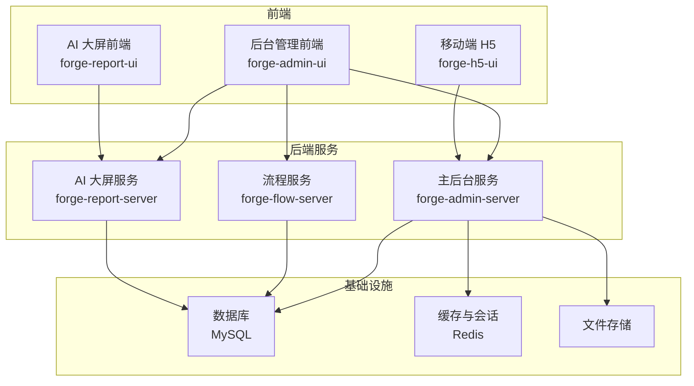
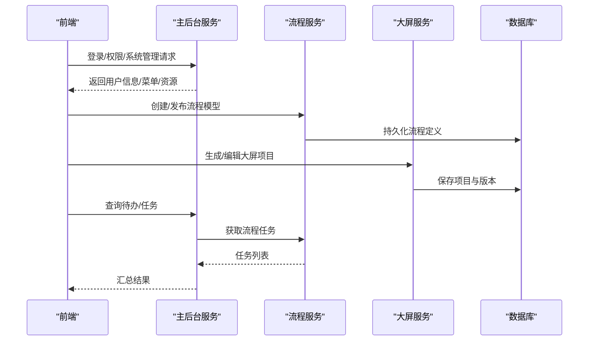
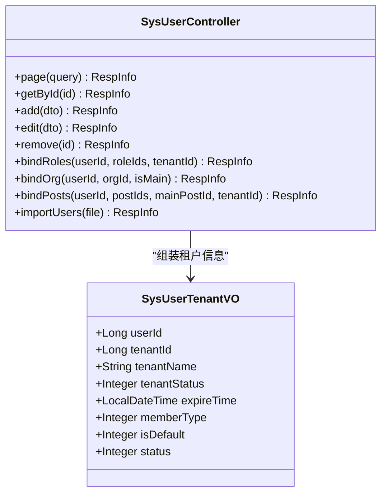
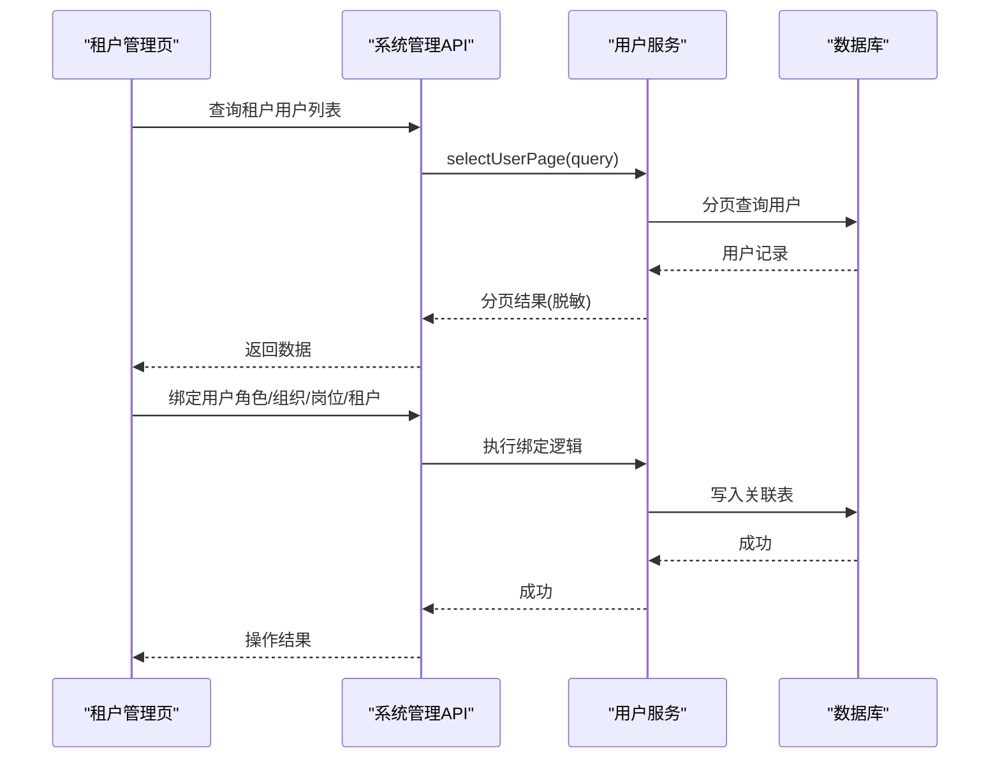
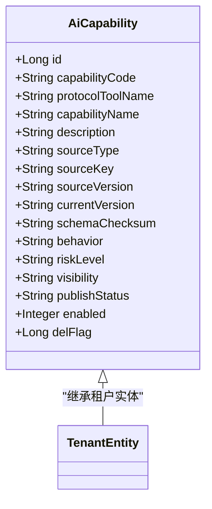
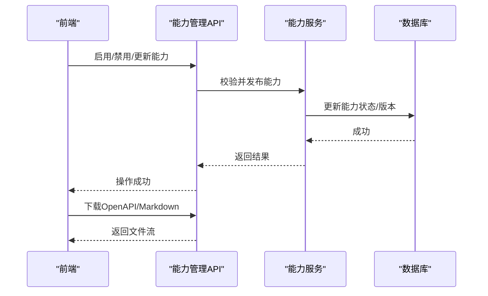
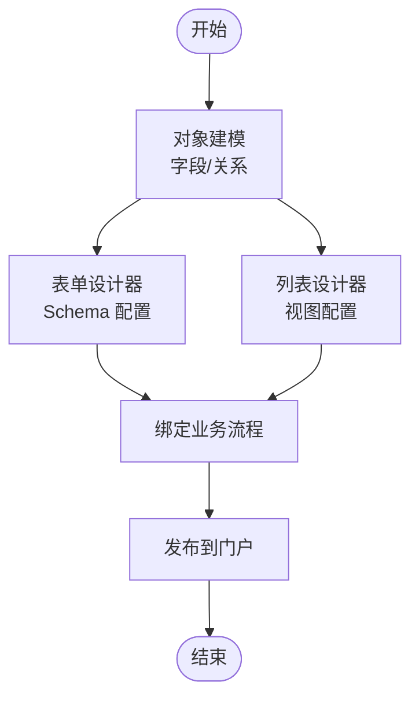
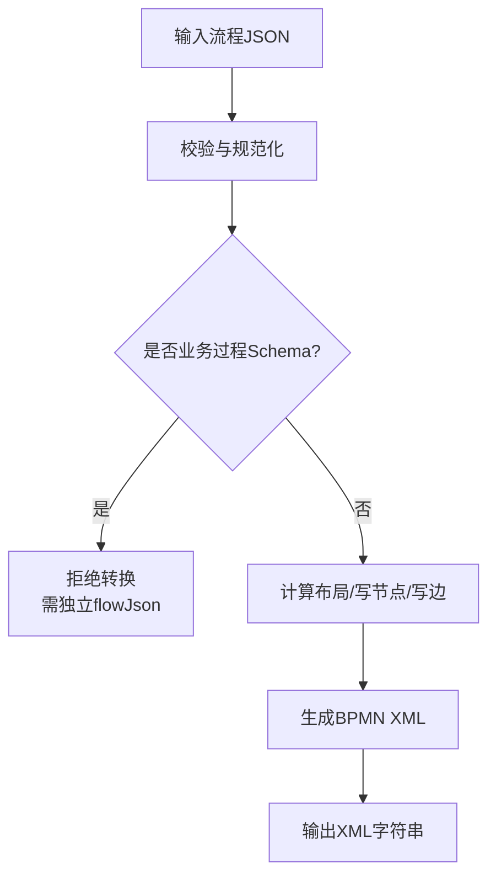
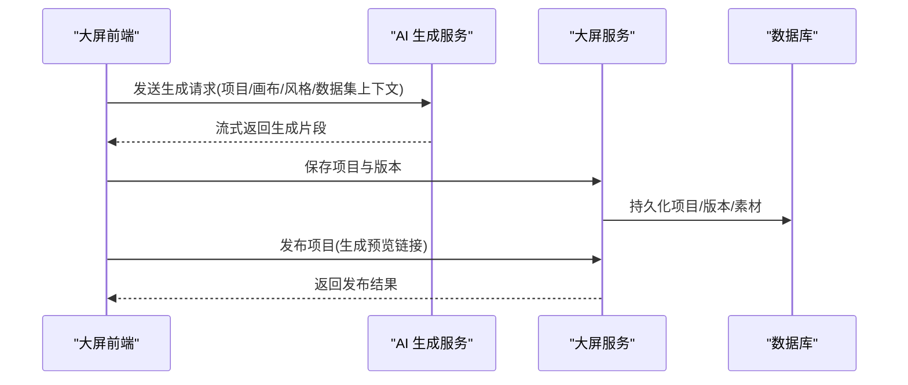
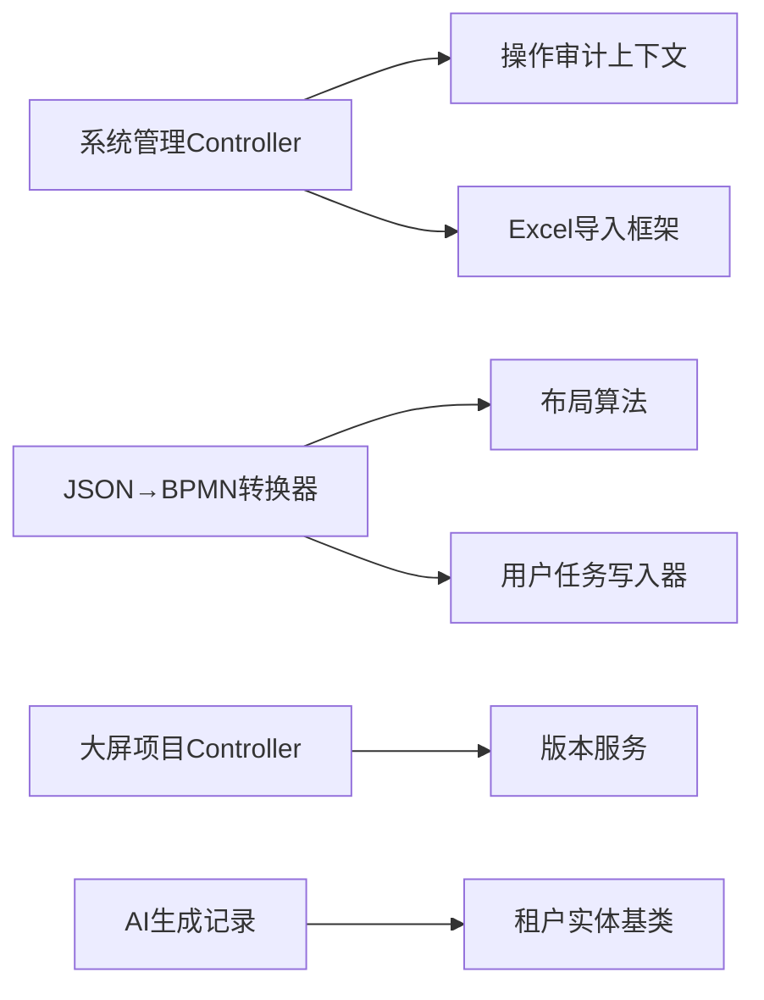

# 核心功能模块

<cite>
**本文引用的文件**
- [README.md](file://README.md)
- [SysUserController.java](file://forge-server/forge-framework/forge-plugin-parent/forge-plugin-system/src/main/java/com/mdframe/forge/plugin/system/controller/SysUserController.java)
- [SysUserTenantVO.java](file://forge-server/forge-framework/forge-plugin-parent/forge-plugin-system/src/main/java/com/mdframe/forge/plugin/system/vo/SysUserTenantVO.java)
- [tenant.vue](file://forge-admin-ui/src/views/system/tenant.vue)
- [json-to-bpmn.js](file://forge-admin-ui/src/components/flow-designer/converter/json-to-bpmn.js)
- [ReportProjectController.java](file://forge-server/forge-report-server/src/main/java/com/mdframe/forge/report/project/controller/ReportProjectController.java)
- [AiDashboardGenerateRecord.java](file://forge-server/forge-framework/forge-plugin-parent/forge-plugin-ai/src/main/java/com/mdframe/forge/plugin/ai/dashboard/domain/AiDashboardGenerateRecord.java)
- [capability.js](file://forge-admin-ui/src/api/ai/capability.js)
- [V1.0.21__add_ai_capability_control_plane.sql](file://forge-server/db/migration/V1.0.21__add_ai_capability_control_plane.sql)
- [report-init.sql](file://forge-server/forge-report-server/sql/report-init.sql)
</cite>

## 目录
1. [简介](#简介)
2. [项目结构](#项目结构)
3. [核心组件](#核心组件)
4. [架构总览](#架构总览)
5. [详细组件分析](#详细组件分析)
6. [依赖关系分析](#依赖关系分析)
7. [性能与扩展性](#性能与扩展性)
8. [故障排查指南](#故障排查指南)
9. [结论](#结论)
10. [附录：配置与使用示例](#附录配置与使用示例)

## 简介
本文件面向 Forge Admin 的核心功能模块，覆盖系统管理、AI 能力中心、低代码平台、工作流引擎、AI 数据大屏等模块。文档从功能概述、核心特性、使用场景、技术实现、模块间依赖与数据流转、配置选项与使用示例等方面展开，并辅以架构图、时序图、流程图和类图，帮助开发者快速理解各模块的作用与集成方式。

## 项目结构
Forge Admin 采用“微内核 + 插件化”的分层架构：
- 后端分层：forge-framework（Starter 基础能力）+ forge-plugin-parent（业务插件）+ 应用服务（聚合插件对外暴露接口）。
- 前端工程：后台管理前端 forge-admin-ui、AI 大屏前端 forge-report-ui、移动端 H5 forge-h5-ui。
- 报告服务：独立的 AI 大屏报表服务 forge-report-server，提供大屏项目、模板、素材等能力。
- 流程服务：独立流程服务 forge-flow（Flowable 编排），通过客户端与服务端协作完成建模与执行。

```mermaid
graph TB
subgraph "前端"
UI["后台管理前端<br/>forge-admin-ui"]
ReportUI["AI 大屏前端<br/>forge-report-ui"]
H5["移动端 H5<br/>forge-h5-ui"]
end
subgraph "后端服务"
AdminServer["主后台服务<br/>forge-admin-server"]
FlowServer["流程服务<br/>forge-flow-server"]
ReportServer["AI 大屏服务<br/>forge-report-server"]
end
subgraph "基础设施"
DB["数据库<br/>MySQL"]
Cache["缓存与会话<br/>Redis"]
Storage["文件存储"]
end
UI --> AdminServer
UI --> FlowServer
UI --> ReportServer
ReportUI --> ReportServer
H5 --> AdminServer
AdminServer --> DB
AdminServer --> Cache
FlowServer --> DB
ReportServer --> DB
AdminServer --> Storage
```

图表来源
- [README.md:241-259](file://README.md#L241-L259)

章节来源
- [README.md:241-259](file://README.md#L241-L259)

## 核心组件
- 系统管理：用户、角色、菜单、部门、岗位、租户、字典、日志、任务、文件、通知等基础管理能力，支持多租户隔离与 RBAC。
- AI 能力中心：智能体管理、供应商管理、会话管理、提示词模板库、能力开放平台（能力目录、客户端、授权与安全调用）。
- 低代码平台：对象设计器、表单/列表设计器、页面构建、业务流程编排、一键发布到门户。
- 工作流引擎：基于 Flowable 的流程建模、发起、审批、时间轴追踪；JSON→BPMN 转换与可视化编辑。
- AI 数据大屏：自然语言生成大屏、组件拖拽、主题定制、数据接入、事件交互、一键发布。

章节来源
- [README.md:431-486](file://README.md#L431-L486)

## 架构总览
整体采用前后端分离与多服务协同：
- 后台管理前端通过统一网关访问主后台服务、流程服务与大屏服务。
- 主后台服务承载系统管理与通用能力，并通过插件体系扩展。
- 流程服务独立部署，提供 BPMN 建模与执行能力。
- 大屏服务提供项目、版本、模板、素材等能力，并与 AI 能力中心联动生成大屏。

```mermaid
sequenceDiagram
participant FE as "前端"
participant Admin as "主后台服务"
participant Flow as "流程服务"
participant Report as "大屏服务"
participant DB as "数据库"
FE->>Admin : 登录/权限/系统管理请求
Admin-->>FE : 返回用户信息/菜单/资源
FE->>Flow : 创建/发布流程模型
Flow->>DB : 持久化流程定义
FE->>Report : 生成/编辑大屏项目
Report->>DB : 保存项目与版本
FE->>Admin : 查询待办/任务
Admin->>Flow : 获取流程任务
Flow-->>Admin : 任务列表
Admin-->>FE : 汇总结果
```

图表来源
- [README.md:241-259](file://README.md#L241-L259)
- [ReportProjectController.java:17-109](file://forge-server/forge-report-server/src/main/java/com/mdframe/forge/report/project/controller/ReportProjectController.java#L17-L109)

## 详细组件分析

### 系统管理模块
- 功能概述：提供用户、角色、菜单、组织、岗位、租户等基础管理能力，支持批量导入导出、操作审计、敏感字段脱敏。
- 核心特性：
  - 用户全生命周期管理：分页查询、详情、新增、修改、删除、状态管理、密码重置、资料更新。
  - 多维绑定：用户-角色、用户-组织、用户-岗位、用户-租户的灵活绑定与解绑。
  - 审计与脱敏：操作日志记录、前后快照对比、手机号/邮箱/身份证脱敏。
  - 多租户上下文：根据登录用户类型与租户上下文返回可访问租户集合。
- 使用场景：企业后台的用户与权限治理、SaaS 租户隔离、RBAC 资源控制。
- 技术实现要点：
  - Controller 层提供 RESTful 接口，结合 Service 层完成业务逻辑。
  - 通过 OperationAuditContext 记录操作前后数据差异，便于审计追溯。
  - 对敏感字段进行统一脱敏处理，避免泄露。
  - 租户维度数据隔离与可见性控制。

```mermaid
classDiagram
class SysUserController {
+page(query) RespInfo
+getById(id) RespInfo
+add(dto) RespInfo
+edit(dto) RespInfo
+remove(id) RespInfo
+bindRoles(userId, roleIds, tenantId) RespInfo
+bindOrg(userId, orgId, isMain) RespInfo
+bindPosts(userId, postIds, mainPostId, tenantId) RespInfo
+importUsers(file) RespInfo
}
class SysUserTenantVO {
+Long userId
+Long tenantId
+String tenantName
+Integer tenantStatus
+LocalDateTime expireTime
+Integer memberType
+Integer isDefault
+Integer status
}
SysUserController --> SysUserTenantVO : "组装租户信息"
```

图表来源
- [SysUserController.java:47-667](file://forge-server/forge-framework/forge-plugin-parent/forge-plugin-system/src/main/java/com/mdframe/forge/plugin/system/controller/SysUserController.java#L47-L667)
- [SysUserTenantVO.java:1-33](file://forge-server/forge-framework/forge-plugin-parent/forge-plugin-system/src/main/java/com/mdframe/forge/plugin/system/vo/SysUserTenantVO.java#L1-L33)

```mermaid
sequenceDiagram
participant UI as "租户管理页"
participant API as "系统管理API"
participant SVC as "用户服务"
participant DB as "数据库"
UI->>API : 查询租户用户列表
API->>SVC : selectUserPage(query)
SVC->>DB : 分页查询用户
DB-->>SVC : 用户记录
SVC-->>API : 分页结果(脱敏)
API-->>UI : 返回数据
UI->>API : 绑定用户角色/组织/岗位/租户
API->>SVC : 执行绑定逻辑
SVC->>DB : 写入关联表
DB-->>SVC : 成功
SVC-->>API : 成功
API-->>UI : 操作结果
```

图表来源
- [SysUserController.java:66-357](file://forge-server/forge-framework/forge-plugin-parent/forge-plugin-system/src/main/java/com/mdframe/forge/plugin/system/controller/SysUserController.java#L66-L357)
- [tenant.vue:1121-1175](file://forge-admin-ui/src/views/system/tenant.vue#L1121-L1175)

章节来源
- [SysUserController.java:47-667](file://forge-server/forge-framework/forge-plugin-parent/forge-plugin-system/src/main/java/com/mdframe/forge/plugin/system/controller/SysUserController.java#L47-L667)
- [SysUserTenantVO.java:1-33](file://forge-server/forge-framework/forge-plugin-parent/forge-plugin-system/src/main/java/com/mdframe/forge/plugin/system/vo/SysUserTenantVO.java#L1-L33)
- [tenant.vue:1121-1175](file://forge-admin-ui/src/views/system/tenant.vue#L1121-L1175)

### AI 能力中心
- 功能概述：统一管理 AI 能力目录、客户端、授权与安全调用，支撑智能体、流程动作、高风险审批等能力的开放与治理。
- 核心特性：
  - 能力目录：能力编码、协议工具名、名称、描述、来源、版本、行为、风险等级、可见性、发布状态等。
  - 客户端管理：机器客户端注册、密钥轮换、签名密钥轮换、撤销、用户断言映射。
  - 安全与审计：能力调用日志、授权校验、高风险审批策略。
- 使用场景：将 AI 能力以标准化方式对外暴露，供流程动作、低代码平台、外部系统集成调用。
- 技术实现要点：
  - 控制面表结构与迁移脚本维护能力元数据与索引。
  - 前端通过能力 API 进行启用/禁用、更新、下载 OpenAPI/Markdown、客户端管理等。

```mermaid
classDiagram
class AiCapability {
+Long id
+String capabilityCode
+String protocolToolName
+String capabilityName
+String description
+String sourceType
+String sourceKey
+String sourceVersion
+String currentVersion
+String schemaChecksum
+String behavior
+String riskLevel
+String visibility
+String publishStatus
+Integer enabled
+Long delFlag
}
AiCapability <|-- TenantEntity : "继承租户实体"
```

图表来源
- [V1.0.21__add_ai_capability_control_plane.sql:1-32](file://forge-server/db/migration/V1.0.21__add_ai_capability_control_plane.sql#L1-L32)

```mermaid
sequenceDiagram
participant FE as "前端"
participant API as "能力管理API"
participant CAP as "能力服务"
participant DB as "数据库"
FE->>API : 启用/禁用/更新能力
API->>CAP : 校验并发布能力
CAP->>DB : 更新能力状态/版本
DB-->>CAP : 成功
CAP-->>API : 返回结果
API-->>FE : 操作成功
FE->>API : 下载OpenAPI/Markdown
API-->>FE : 返回文件流
```

图表来源
- [capability.js:45-143](file://forge-admin-ui/src/api/ai/capability.js#L45-L143)
- [V1.0.21__add_ai_capability_control_plane.sql:1-32](file://forge-server/db/migration/V1.0.21__add_ai_capability_control_plane.sql#L1-L32)

章节来源
- [capability.js:45-143](file://forge-admin-ui/src/api/ai/capability.js#L45-L143)
- [V1.0.21__add_ai_capability_control_plane.sql:1-32](file://forge-server/db/migration/V1.0.21__add_ai_capability_control_plane.sql#L1-L32)

### 低代码平台
- 功能概述：通过对象设计器、表单/列表设计器、页面构建器，实现低代码应用快速搭建与发布。
- 核心特性：
  - 对象建模：领域划分、数据模型、字段与关系设计。
  - 页面构建：表单与列表可视化设计、联动规则、视图配置。
  - 业务流程编排：将低代码对象与流程模型绑定，实现审批与自动化。
  - 一键发布：将应用发布到独立门户，支持预览与分享。
- 使用场景：企业内部管理系统、审批流业务、数据录入与展示。
- 技术实现要点：
  - 前端通过对象设计器与表单/列表设计器维护页面 Schema。
  - 后端通过业务应用服务构建页面资产，支持表单设计器 Schema 与视图 Schema 的统一管理。

```mermaid
flowchart TD
Start(["开始"]) --> Model["对象建模<br/>字段/关系"]
Model --> FormDesign["表单设计器<br/>Schema 配置"]
Model --> ListDesign["列表设计器<br/>视图配置"]
FormDesign --> BindFlow["绑定业务流程"]
ListDesign --> BindFlow
BindFlow --> Publish["发布到门户"]
Publish --> End(["结束"])
```

图表来源
- [application-runtime.[applicationCode].vue:2893-2931](file://forge-admin-ui/src/views/app-center/application-runtime.[applicationCode].vue#L2893-L2931)
- [BusinessFlowService.java:573-593](file://forge-server/forge-framework/forge-plugin-parent/forge-plugin-generator/src/main/java/com/mdframe/forge/plugin/generator/service/businessapp/BusinessFlowService.java#L573-L593)

章节来源
- [application-runtime.[applicationCode].vue:2893-2931](file://forge-admin-ui/src/views/app-center/application-runtime.[applicationCode].vue#L2893-L2931)
- [BusinessFlowService.java:573-593](file://forge-server/forge-framework/forge-plugin-parent/forge-plugin-generator/src/main/java/com/mdframe/forge/plugin/generator/service/businessapp/BusinessFlowService.java#L573-L593)

### 工作流引擎
- 功能概述：基于 Flowable 的流程建模与执行，支持 JSON→BPMN 转换、可视化编辑、节点配置、变量与权限控制。
- 核心特性：
  - JSON→BPMN 转换器：将前端流程 JSON 转换为标准 BPMN XML，包含流程属性、节点与连线、图形布局。
  - 节点配置：用户任务、条件分支、抄送、自动审批模式等。
  - 可视化编辑器：拖拽式画布、实时预览、版本管理。
- 使用场景：请假、采购、合同、报销、工单等需要流程编排的业务。
- 技术实现要点：
  - 前端转换器负责生成 BPMN XML，确保 process id 与 diagram 元素正确指向。
  - 后端 Flowable 引擎负责流程部署、启动、任务流转与时间轴追踪。

```mermaid
flowchart TD
A["输入流程JSON"] --> B["校验与规范化"]
B --> C{"是否业务过程Schema?"}
C -- 是 --> E["拒绝转换<br/>需独立flowJson"]
C -- 否 --> D["计算布局/写节点/写边"]
D --> F["生成BPMN XML"]
F --> G["输出XML字符串"]
```

图表来源
- [json-to-bpmn.js:29-61](file://forge-admin-ui/src/components/flow-designer/converter/json-to-bpmn.js#L29-L61)
- [json-to-bpmn.js:250-292](file://forge-admin-ui/src/components/flow-designer/converter/json-to-bpmn.js#L250-L292)

章节来源
- [json-to-bpmn.js:29-61](file://forge-admin-ui/src/components/flow-designer/converter/json-to-bpmn.js#L29-L61)
- [json-to-bpmn.js:250-292](file://forge-admin-ui/src/components/flow-designer/converter/json-to-bpmn.js#L250-L292)

### AI 数据大屏
- 功能概述：通过自然语言生成大屏草稿，再经可视化编辑器调整组件、数据源、主题与交互，最终发布为可访问页面。
- 核心特性：
  - AI 智能生成：对话式生成大屏结构、组件布局与基础配置。
  - 组件素材库：图表、文字、图片、视频、滚动表格、装饰边框、数字翻牌等。
  - 主题定制：深浅主题、背景、全局滤镜、画布尺寸与自适应方式。
  - 数据接入：静态数据、动态 HTTP 请求、数据池。
  - 事件交互：点击、双击、鼠标进入/移出、生命周期事件与自定义 JavaScript。
  - 一键发布：生成预览链接，便于分享、嵌入与交付。
- 使用场景：数据驾驶舱、运营监控大屏、营销看板。
- 技术实现要点：
  - 后端记录 AI 生成明细（项目、供应商、模型、画布尺寸、提示词、响应、统计指标等）。
  - 前端提供 AI 生成接口与流式生成能力，支持 SSE 推送。
  - 大屏项目控制器提供项目 CRUD、版本管理、发布与回滚。

```mermaid
sequenceDiagram
participant FE as "大屏前端"
participant AI as "AI 生成服务"
participant RPT as "大屏服务"
participant DB as "数据库"
FE->>AI : 发送生成请求(项目/画布/风格/数据集上下文)
AI-->>FE : 流式返回生成片段
FE->>RPT : 保存项目与版本
RPT->>DB : 持久化项目/版本/素材
FE->>RPT : 发布项目(生成预览链接)
RPT-->>FE : 返回发布结果
```

图表来源
- [AiDashboardGenerateRecord.java:1-75](file://forge-server/forge-framework/forge-plugin-parent/forge-plugin-ai/src/main/java/com/mdframe/forge/plugin/ai/dashboard/domain/AiDashboardGenerateRecord.java#L1-L75)
- [ReportProjectController.java:17-109](file://forge-server/forge-report-server/src/main/java/com/mdframe/forge/report/project/controller/ReportProjectController.java#L17-L109)

章节来源
- [AiDashboardGenerateRecord.java:1-75](file://forge-server/forge-framework/forge-plugin-parent/forge-plugin-ai/src/main/java/com/mdframe/forge/plugin/ai/dashboard/domain/AiDashboardGenerateRecord.java#L1-L75)
- [ReportProjectController.java:17-109](file://forge-server/forge-report-server/src/main/java/com/mdframe/forge/report/project/controller/ReportProjectController.java#L17-L109)

## 依赖关系分析
- 系统管理依赖：
  - 用户管理依赖租户上下文、角色/组织/岗位绑定、Excel 导入框架、操作审计上下文。
  - 前端租户管理页通过统一请求封装调用后端接口，加载租户用户列表与分页。
- 工作流依赖：
  - 前端 JSON→BPMN 转换器依赖节点类型常量、布局算法、用户任务写入器与 XML 转义工具。
- 大屏依赖：
  - 大屏服务依赖项目与版本服务，提供分页、详情、创建、更新、删除、发布与回滚。
  - AI 生成记录依赖租户实体，记录生成过程的上下文与统计指标。

```mermaid
graph LR
SysCtrl["系统管理Controller"] --> Audit["操作审计上下文"]
SysCtrl --> Excel["Excel导入框架"]
FlowConv["JSON→BPMN转换器"] --> Layout["布局算法"]
FlowConv --> Writer["用户任务写入器"]
ReportCtrl["大屏项目Controller"] --> VersionSvc["版本服务"]
AISvc["AI生成记录"] --> TenantBase["租户实体基类"]
```

图表来源
- [SysUserController.java:47-667](file://forge-server/forge-framework/forge-plugin-parent/forge-plugin-system/src/main/java/com/mdframe/forge/plugin/system/controller/SysUserController.java#L47-L667)
- [json-to-bpmn.js:29-61](file://forge-admin-ui/src/components/flow-designer/converter/json-to-bpmn.js#L29-L61)
- [ReportProjectController.java:17-109](file://forge-server/forge-report-server/src/main/java/com/mdframe/forge/report/project/controller/ReportProjectController.java#L17-L109)
- [AiDashboardGenerateRecord.java:1-75](file://forge-server/forge-framework/forge-plugin-parent/forge-plugin-ai/src/main/java/com/mdframe/forge/plugin/ai/dashboard/domain/AiDashboardGenerateRecord.java#L1-L75)

章节来源
- [SysUserController.java:47-667](file://forge-server/forge-framework/forge-plugin-parent/forge-plugin-system/src/main/java/com/mdframe/forge/plugin/system/controller/SysUserController.java#L47-L667)
- [json-to-bpmn.js:29-61](file://forge-admin-ui/src/components/flow-designer/converter/json-to-bpmn.js#L29-L61)
- [ReportProjectController.java:17-109](file://forge-server/forge-report-server/src/main/java/com/mdframe/forge/report/project/controller/ReportProjectController.java#L17-L109)
- [AiDashboardGenerateRecord.java:1-75](file://forge-server/forge-framework/forge-plugin-parent/forge-plugin-ai/src/main/java/com/mdframe/forge/plugin/ai/dashboard/domain/AiDashboardGenerateRecord.java#L1-L75)

## 性能与扩展性
- 性能考虑：
  - 分页查询与敏感字段脱敏在用户列表与详情中统一处理，减少不必要的数据传输。
  - 流程 JSON→BPMN 转换在前端进行，降低后端解析压力，同时保证 XML 结构正确性。
  - 大屏项目版本管理支持历史回滚，便于快速恢复与迭代。
- 扩展性：
  - 插件化架构允许按需启用系统、生成器、任务、消息、流程、AI 等能力。
  - 能力开放平台提供标准化接口，便于第三方系统与内部流程动作集成。
  - 前端组件化与原子化样式提升界面复用与维护效率。

[本节为通用指导，不直接分析具体文件]

## 故障排查指南
- 首次启动报数据库或 Redis 连接错误：
  - 检查 application-dev.yml 是否正确复制并配置 MySQL、Redis 连接信息。
- 前端请求后端失败：
  - 确认后端端口已启动，检查 .env.development 中的代理目标地址是否指向本地服务。
- 新增配置项注意事项：
  - 本地敏感配置不要提交；通用配置请同步到 example 文件并使用占位符。
- 不小心提交敏感配置：
  - 立即更换相关密码或密钥，清理仓库历史与当前索引中的敏感文件，补充 .gitignore 规则。

章节来源
- [README.md:502-519](file://README.md#L502-L519)

## 结论
Forge Admin 通过微内核与插件化架构，将系统管理、AI 能力中心、低代码平台、工作流引擎与 AI 数据大屏有机整合，形成开箱即用的企业级中后台解决方案。各模块职责清晰、依赖明确，既满足快速交付与稳定承载的需求，又具备良好的扩展性与可维护性。

[本节为总结，不直接分析具体文件]

## 附录：配置与使用示例
- 环境要求与快速开始：
  - JDK 17+、Node.js 20.19+、pnpm 8+、MySQL 8.0+、Redis 6.0+。
  - 克隆项目后初始化数据库，复制配置文件并修改本地连接信息，分别启动主后台服务、大屏服务与流程服务。
- 数据库迁移：
  - Flyway 启动时执行迁移脚本，可通过 SQL 查看执行状态。
- 前端开发：
  - 后台管理前端与大屏前端分别安装依赖并启动开发服务器。
- 生产构建：
  - 前端构建静态资源，后端全量构建 Maven 包，参考 Nginx 配置部署。

章节来源
- [README.md:263-427](file://README.md#L263-L427)