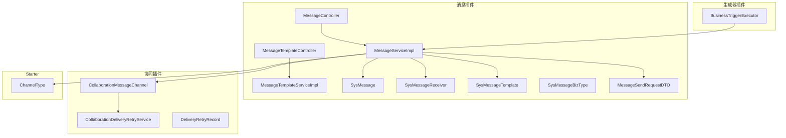
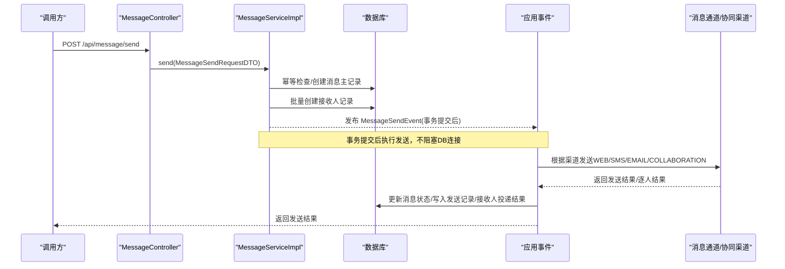
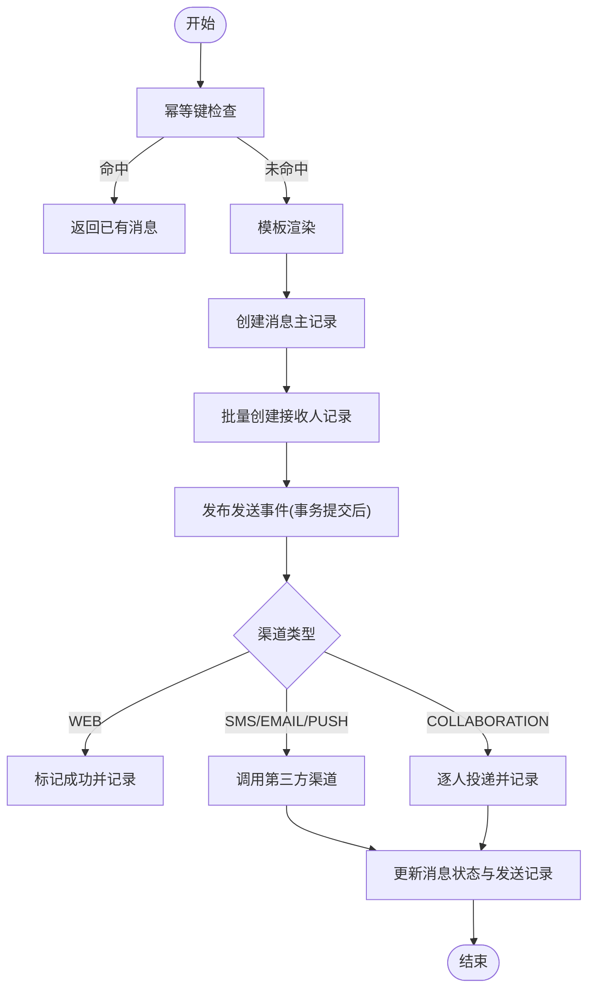
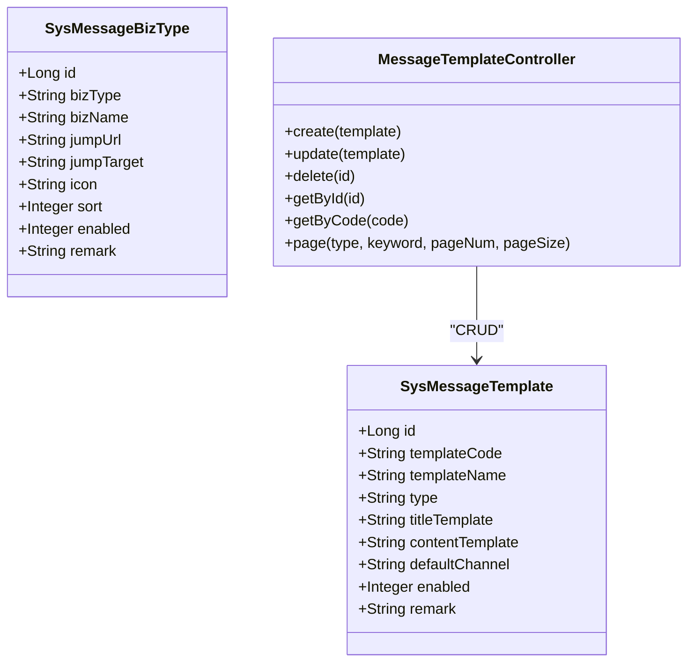
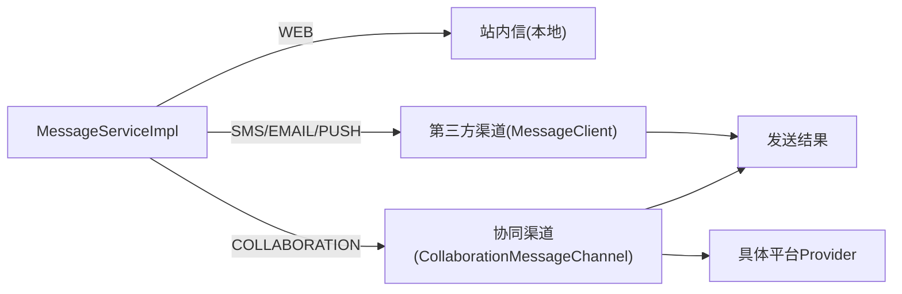
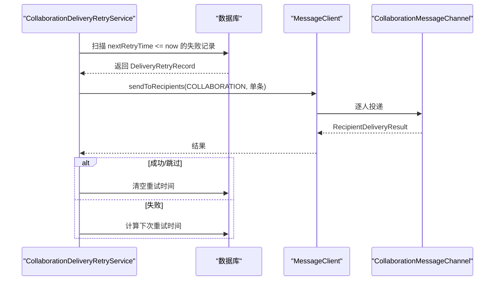
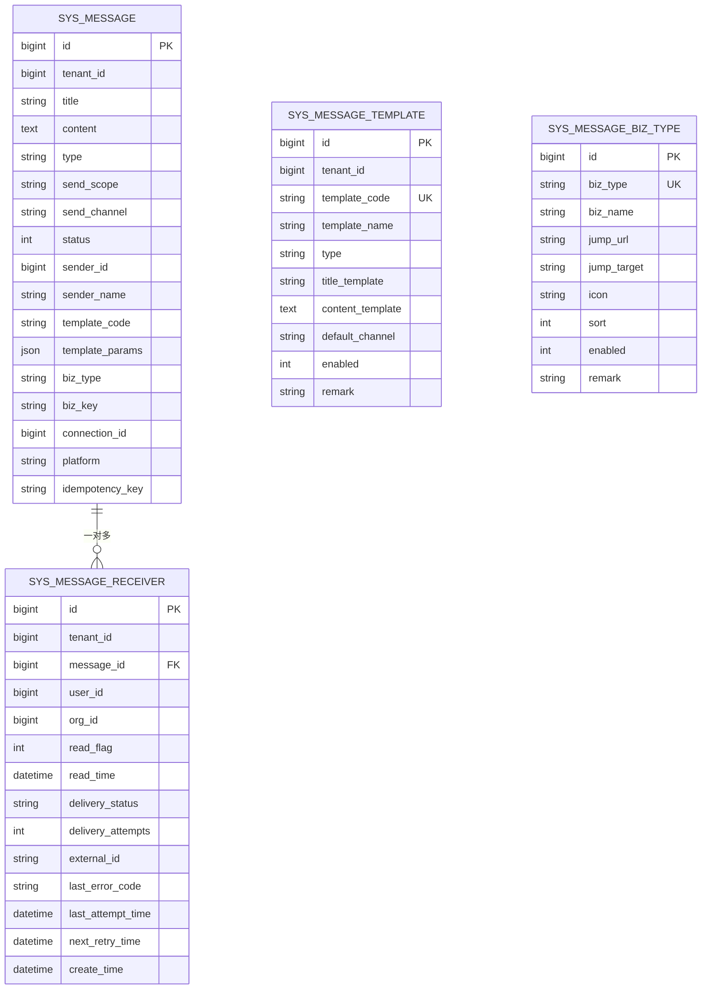
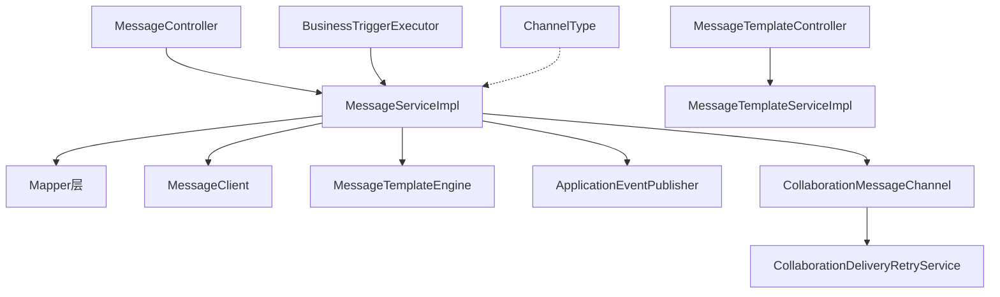

# 消息通知

<cite>
**本文引用的文件**
- [MessageServiceImpl.java](file://forge-server/forge-framework/forge-plugin-parent/forge-plugin-message/src/main/java/com/mdframe/forge/plugin/message/service/impl/MessageServiceImpl.java)
- [MessageTemplateServiceImpl.java](file://forge-server/forge-framework/forge-plugin-parent/forge-plugin-message/src/main/java/com/mdframe/forge/plugin/message/service/impl/MessageTemplateServiceImpl.java)
- [SysMessage.java](file://forge-server/forge-framework/forge-plugin-parent/forge-plugin-message/src/main/java/com/mdframe/forge/plugin/message/domain/entity/SysMessage.java)
- [SysMessageReceiver.java](file://forge-server/forge-framework/forge-plugin-parent/forge-plugin-message/src/main/java/com/mdframe/forge/plugin/message/domain/entity/SysMessageReceiver.java)
- [SysMessageTemplate.java](file://forge-server/forge-framework/forge-plugin-parent/forge-plugin-message/src/main/java/com/mdframe/forge/plugin/message/domain/entity/SysMessageTemplate.java)
- [SysMessageBizType.java](file://forge-server/forge-framework/forge-plugin-parent/forge-plugin-message/src/main/java/com/mdframe/forge/plugin/message/domain/entity/SysMessageBizType.java)
- [MessageSendRequestDTO.java](file://forge-server/forge-framework/forge-plugin-parent/forge-plugin-message/src/main/java/com/mdframe/forge/plugin/message/domain/dto/MessageSendRequestDTO.java)
- [MessageController.java](file://forge-server/forge-framework/forge-plugin-parent/forge-plugin-message/src/main/java/com/mdframe/forge/plugin/message/controller/MessageController.java)
- [MessageTemplateController.java](file://forge-server/forge-framework/forge-plugin-parent/forge-plugin-message/src/main/java/com/mdframe/forge/plugin/message/controller/MessageTemplateController.java)
- [CollaborationMessageChannel.java](file://forge-server/forge-framework/forge-plugin-parent/forge-plugin-collaboration/src/main/java/com/mdframe/forge/plugin/collaboration/message/CollaborationMessageChannel.java)
- [CollaborationDeliveryRetryService.java](file://forge-server/forge-framework/forge-plugin-parent/forge-plugin-collaboration/src/main/java/com/mdframe/forge/plugin/collaboration/service/CollaborationDeliveryRetryService.java)
- [DeliveryRetryRecord.java](file://forge-server/forge-framework/forge-plugin-parent/forge-plugin-collaboration/src/main/java/com/mdframe/forge/plugin/collaboration/domain/model/DeliveryRetryRecord.java)
- [BusinessTriggerExecutor.java](file://forge-server/forge-framework/forge-plugin-parent/forge-plugin-generator/src/main/java/com/mdframe/forge/plugin/generator/service/businessapp/BusinessTriggerExecutor.java)
- [V1.0.46__add_business_trigger_and_message_channel.sql](file://forge-server/db/backup/V1.0.46__add_business_trigger_and_message_channel.sql)
- [V1.0.51__seed_crm_opportunity_document_flow.sql](file://forge-server/db/backup/V1.0.51__seed_crm_opportunity_document_flow.sql)
- [ChannelType.java](file://forge-server/forge-framework/forge-starter-parent/forge-starter-message/src/main/java/com/mdframe/forge/starter/message/channel/ChannelType.java)
</cite>

## 目录
1. [简介](#简介)
2. [项目结构](#项目结构)
3. [核心组件](#核心组件)
4. [架构总览](#架构总览)
5. [详细组件分析](#详细组件分析)
6. [依赖关系分析](#依赖关系分析)
7. [性能考虑](#性能考虑)
8. [故障排查指南](#故障排查指南)
9. [结论](#结论)
10. [附录](#附录)

## 简介
本模块为 Forge Admin 提供统一的消息通知能力，覆盖模板管理、业务类型配置、消息发送与记录、多渠道集成（站内信、短信、邮件、企业协同）、模板渲染、异步发送与重试、状态跟踪与失败处理等。通过事件驱动与批量写入优化，保证高吞吐下的稳定性与可观测性；同时提供完善的运维重试与补偿机制，确保企业级可靠性。

## 项目结构
消息通知相关代码主要分布在以下模块：
- 消息插件：消息发送、模板、接收人、业务类型、控制器与实体
- 协同插件：企业协同渠道的逐人投递、校验、重试
- 生成器插件：业务触发器调用消息服务进行站内信发送
- Starter 层：通道类型枚举、消息客户端抽象
- 数据库脚本：内置通道初始化、示例模板数据

**图表来源**
- [MessageController.java:1-110](file://forge-server/forge-framework/forge-plugin-parent/forge-plugin-message/src/main/java/com/mdframe/forge/plugin/message/controller/MessageController.java#L1-L110)
- [MessageTemplateController.java:1-81](file://forge-server/forge-framework/forge-plugin-parent/forge-plugin-message/src/main/java/com/mdframe/forge/plugin/message/controller/MessageTemplateController.java#L1-L81)
- [MessageServiceImpl.java:93-166](file://forge-server/forge-framework/forge-plugin-parent/forge-plugin-message/src/main/java/com/mdframe/forge/plugin/message/service/impl/MessageServiceImpl.java#L93-L166)
- [MessageTemplateServiceImpl.java:27-104](file://forge-server/forge-framework/forge-plugin-parent/forge-plugin-message/src/main/java/com/mdframe/forge/plugin/message/service/impl/MessageTemplateServiceImpl.java#L27-L104)
- [SysMessage.java:1-101](file://forge-server/forge-framework/forge-plugin-parent/forge-plugin-message/src/main/java/com/mdframe/forge/plugin/message/domain/entity/SysMessage.java#L1-L101)
- [SysMessageReceiver.java:1-93](file://forge-server/forge-framework/forge-plugin-parent/forge-plugin-message/src/main/java/com/mdframe/forge/plugin/message/domain/entity/SysMessageReceiver.java#L1-L93)
- [SysMessageTemplate.java:1-78](file://forge-server/forge-framework/forge-plugin-parent/forge-plugin-message/src/main/java/com/mdframe/forge/plugin/message/domain/entity/SysMessageTemplate.java#L1-L78)
- [SysMessageBizType.java:1-73](file://forge-server/forge-framework/forge-plugin-parent/forge-plugin-message/src/main/java/com/mdframe/forge/plugin/message/domain/entity/SysMessageBizType.java#L1-L73)
- [MessageSendRequestDTO.java:1-84](file://forge-server/forge-framework/forge-plugin-parent/forge-plugin-message/src/main/java/com/mdframe/forge/plugin/message/domain/dto/MessageSendRequestDTO.java#L1-L84)
- [CollaborationMessageChannel.java:108-137](file://forge-server/forge-framework/forge-plugin-parent/forge-plugin-collaboration/src/main/java/com/mdframe/forge/plugin/collaboration/message/CollaborationMessageChannel.java#L108-L137)
- [CollaborationDeliveryRetryService.java:1-101](file://forge-server/forge-framework/forge-plugin-parent/forge-plugin-collaboration/src/main/java/com/mdframe/forge/plugin/collaboration/service/CollaborationDeliveryRetryService.java#L1-L101)
- [DeliveryRetryRecord.java:1-40](file://forge-server/forge-framework/forge-plugin-parent/forge-plugin-collaboration/src/main/java/com/mdframe/forge/plugin/collaboration/domain/model/DeliveryRetryRecord.java#L1-L40)
- [BusinessTriggerExecutor.java:547-582](file://forge-server/forge-framework/forge-plugin-parent/forge-plugin-generator/src/main/java/com/mdframe/forge/plugin/generator/service/businessapp/BusinessTriggerExecutor.java#L547-L582)
- [ChannelType.java:1-13](file://forge-server/forge-framework/forge-starter-parent/forge-starter-message/src/main/java/com/mdframe/forge/starter/message/channel/ChannelType.java#L1-L13)

**章节来源**
- [MessageController.java:1-110](file://forge-server/forge-framework/forge-plugin-parent/forge-plugin-message/src/main/java/com/mdframe/forge/plugin/message/controller/MessageController.java#L1-L110)
- [MessageTemplateController.java:1-81](file://forge-server/forge-framework/forge-plugin-parent/forge-plugin-message/src/main/java/com/mdframe/forge/plugin/message/controller/MessageTemplateController.java#L1-L81)
- [MessageServiceImpl.java:93-166](file://forge-server/forge-framework/forge-plugin-parent/forge-plugin-message/src/main/java/com/mdframe/forge/plugin/message/service/impl/MessageServiceImpl.java#L93-L166)
- [MessageTemplateServiceImpl.java:27-104](file://forge-server/forge-framework/forge-plugin-parent/forge-plugin-message/src/main/java/com/mdframe/forge/plugin/message/service/impl/MessageTemplateServiceImpl.java#L27-L104)
- [SysMessage.java:1-101](file://forge-server/forge-framework/forge-plugin-parent/forge-plugin-message/src/main/java/com/mdframe/forge/plugin/message/domain/entity/SysMessage.java#L1-L101)
- [SysMessageReceiver.java:1-93](file://forge-server/forge-framework/forge-plugin-parent/forge-plugin-message/src/main/java/com/mdframe/forge/plugin/message/domain/entity/SysMessageReceiver.java#L1-L93)
- [SysMessageTemplate.java:1-78](file://forge-server/forge-framework/forge-plugin-parent/forge-plugin-message/src/main/java/com/mdframe/forge/plugin/message/domain/entity/SysMessageTemplate.java#L1-L78)
- [SysMessageBizType.java:1-73](file://forge-server/forge-framework/forge-plugin-parent/forge-plugin-message/src/main/java/com/mdframe/forge/plugin/message/domain/entity/SysMessageBizType.java#L1-L73)
- [MessageSendRequestDTO.java:1-84](file://forge-server/forge-framework/forge-plugin-parent/forge-plugin-message/src/main/java/com/mdframe/forge/plugin/message/domain/dto/MessageSendRequestDTO.java#L1-L84)
- [CollaborationMessageChannel.java:108-137](file://forge-server/forge-framework/forge-plugin-parent/forge-plugin-collaboration/src/main/java/com/mdframe/forge/plugin/collaboration/message/CollaborationMessageChannel.java#L108-L137)
- [CollaborationDeliveryRetryService.java:1-101](file://forge-server/forge-framework/forge-plugin-parent/forge-plugin-collaboration/src/main/java/com/mdframe/forge/plugin/collaboration/service/CollaborationDeliveryRetryService.java#L1-L101)
- [DeliveryRetryRecord.java:1-40](file://forge-server/forge-framework/forge-plugin-parent/forge-plugin-collaboration/src/main/java/com/mdframe/forge/plugin/collaboration/domain/model/DeliveryRetryRecord.java#L1-L40)
- [BusinessTriggerExecutor.java:547-582](file://forge-server/forge-framework/forge-plugin-parent/forge-plugin-generator/src/main/java/com/mdframe/forge/plugin/generator/service/businessapp/BusinessTriggerExecutor.java#L547-L582)
- [ChannelType.java:1-13](file://forge-server/forge-framework/forge-starter-parent/forge-starter-message/src/main/java/com/mdframe/forge/starter/message/channel/ChannelType.java#L1-L13)

## 核心组件
- 消息发送服务：负责幂等创建、模板渲染、接收人解析、批量落库、事件发布与异步发送、状态回写与记录。
- 模板管理服务：提供模板的增删改查与分页查询，支持按类型与关键字检索。
- 业务类型配置：维护业务类型元信息（名称、跳转、图标、排序、启用状态）。
- 企业协同渠道：对第三方平台进行逐人投递、模板校验、接收人映射与失败重试。
- 业务触发器：在业务流程中调用消息服务发送站内信，并返回发送结果。
- 通道类型：定义 EMAIL、SMS、WEB、COLLABORATION 等通道。

**章节来源**
- [MessageServiceImpl.java:93-166](file://forge-server/forge-framework/forge-plugin-parent/forge-plugin-message/src/main/java/com/mdframe/forge/plugin/message/service/impl/MessageServiceImpl.java#L93-L166)
- [MessageTemplateServiceImpl.java:27-104](file://forge-server/forge-framework/forge-plugin-parent/forge-plugin-message/src/main/java/com/mdframe/forge/plugin/message/service/impl/MessageTemplateServiceImpl.java#L27-L104)
- [SysMessageBizType.java:1-73](file://forge-server/forge-framework/forge-plugin-parent/forge-plugin-message/src/main/java/com/mdframe/forge/plugin/message/domain/entity/SysMessageBizType.java#L1-L73)
- [CollaborationMessageChannel.java:108-137](file://forge-server/forge-framework/forge-plugin-parent/forge-plugin-collaboration/src/main/java/com/mdframe/forge/plugin/collaboration/message/CollaborationMessageChannel.java#L108-L137)
- [BusinessTriggerExecutor.java:547-582](file://forge-server/forge-framework/forge-plugin-parent/forge-plugin-generator/src/main/java/com/mdframe/forge/plugin/generator/service/businessapp/BusinessTriggerExecutor.java#L547-L582)
- [ChannelType.java:1-13](file://forge-server/forge-framework/forge-starter-parent/forge-starter-message/src/main/java/com/mdframe/forge/starter/message/channel/ChannelType.java#L1-L13)

## 架构总览
消息发送采用“事务内落库 + 事务外异步发送”的事件驱动架构，避免长事务占用数据库连接，提升吞吐与稳定性。

**图表来源**
- [MessageController.java:32-38](file://forge-server/forge-framework/forge-plugin-parent/forge-plugin-message/src/main/java/com/mdframe/forge/plugin/message/controller/MessageController.java#L32-L38)
- [MessageServiceImpl.java:93-166](file://forge-server/forge-framework/forge-plugin-parent/forge-plugin-message/src/main/java/com/mdframe/forge/plugin/message/service/impl/MessageServiceImpl.java#L93-L166)
- [MessageServiceImpl.java:287-329](file://forge-server/forge-framework/forge-plugin-parent/forge-plugin-message/src/main/java/com/mdframe/forge/plugin/message/service/impl/MessageServiceImpl.java#L287-L329)
- [MessageServiceImpl.java:331-412](file://forge-server/forge-framework/forge-plugin-parent/forge-plugin-message/src/main/java/com/mdframe/forge/plugin/message/service/impl/MessageServiceImpl.java#L331-L412)

## 详细组件分析

### 消息发送流程与模板渲染
- 幂等控制：通过 idempotencyKey 防止重复发送，并发时仅创建一份逻辑消息。
- 模板渲染：若请求包含 templateCode，则从模板表读取标题/内容模板并使用模板引擎渲染；未指定 channel 时使用模板默认渠道。
- 接收人解析：基于 sendScope、userIds、orgIds、tenantIds 解析最终接收人，分批写入接收人表，避免内存溢出。
- 异步发送：事务提交后发布事件，监听器根据渠道执行发送；WEB 站内信无需外部调用，直接成功；其他渠道通过 MessageClient 发送。
- 状态回写：根据发送结果更新消息状态与发送记录；协同渠道逐人投递，失败设置 nextRetryTime 供补偿任务重试。

**图表来源**
- [MessageServiceImpl.java:93-166](file://forge-server/forge-framework/forge-plugin-parent/forge-plugin-message/src/main/java/com/mdframe/forge/plugin/message/service/impl/MessageServiceImpl.java#L93-L166)
- [MessageServiceImpl.java:187-215](file://forge-server/forge-framework/forge-plugin-parent/forge-plugin-message/src/main/java/com/mdframe/forge/plugin/message/service/impl/MessageServiceImpl.java#L187-L215)
- [MessageServiceImpl.java:217-285](file://forge-server/forge-framework/forge-plugin-parent/forge-plugin-message/src/main/java/com/mdframe/forge/plugin/message/service/impl/MessageServiceImpl.java#L217-L285)
- [MessageServiceImpl.java:287-329](file://forge-server/forge-framework/forge-plugin-parent/forge-plugin-message/src/main/java/com/mdframe/forge/plugin/message/service/impl/MessageServiceImpl.java#L287-L329)
- [MessageServiceImpl.java:331-412](file://forge-server/forge-framework/forge-plugin-parent/forge-plugin-message/src/main/java/com/mdframe/forge/plugin/message/service/impl/MessageServiceImpl.java#L331-L412)

**章节来源**
- [MessageServiceImpl.java:93-166](file://forge-server/forge-framework/forge-plugin-parent/forge-plugin-message/src/main/java/com/mdframe/forge/plugin/message/service/impl/MessageServiceImpl.java#L93-L166)
- [MessageServiceImpl.java:187-215](file://forge-server/forge-framework/forge-plugin-parent/forge-plugin-message/src/main/java/com/mdframe/forge/plugin/message/service/impl/MessageServiceImpl.java#L187-L215)
- [MessageServiceImpl.java:217-285](file://forge-server/forge-framework/forge-plugin-parent/forge-plugin-message/src/main/java/com/mdframe/forge/plugin/message/service/impl/MessageServiceImpl.java#L217-L285)
- [MessageServiceImpl.java:287-329](file://forge-server/forge-framework/forge-plugin-parent/forge-plugin-message/src/main/java/com/mdframe/forge/plugin/message/service/impl/MessageServiceImpl.java#L287-L329)
- [MessageServiceImpl.java:331-412](file://forge-server/forge-framework/forge-plugin-parent/forge-plugin-message/src/main/java/com/mdframe/forge/plugin/message/service/impl/MessageServiceImpl.java#L331-L412)

### 模板管理与业务类型配置
- 模板管理：提供模板的创建、更新、删除、按ID或编码查询、分页列表；支持类型过滤与关键字搜索。
- 业务类型：维护 bizType、bizName、jumpUrl、jumpTarget、icon、sort、enabled 等字段，用于前端展示与跳转。
- 数据初始化：脚本中包含示例模板数据，便于快速体验。

**图表来源**
- [MessageTemplateController.java:27-79](file://forge-server/forge-framework/forge-plugin-parent/forge-plugin-message/src/main/java/com/mdframe/forge/plugin/message/controller/MessageTemplateController.java#L27-L79)
- [SysMessageTemplate.java:1-78](file://forge-server/forge-framework/forge-plugin-parent/forge-plugin-message/src/main/java/com/mdframe/forge/plugin/message/domain/entity/SysMessageTemplate.java#L1-L78)
- [SysMessageBizType.java:1-73](file://forge-server/forge-framework/forge-plugin-parent/forge-plugin-message/src/main/java/com/mdframe/forge/plugin/message/domain/entity/SysMessageBizType.java#L1-L73)

**章节来源**
- [MessageTemplateServiceImpl.java:27-104](file://forge-server/forge-framework/forge-plugin-parent/forge-plugin-message/src/main/java/com/mdframe/forge/plugin/message/service/impl/MessageTemplateServiceImpl.java#L27-L104)
- [MessageTemplateController.java:27-79](file://forge-server/forge-framework/forge-plugin-parent/forge-plugin-message/src/main/java/com/mdframe/forge/plugin/message/controller/MessageTemplateController.java#L27-L79)
- [SysMessageTemplate.java:1-78](file://forge-server/forge-framework/forge-plugin-parent/forge-plugin-message/src/main/java/com/mdframe/forge/plugin/message/domain/entity/SysMessageTemplate.java#L1-L78)
- [SysMessageBizType.java:1-73](file://forge-server/forge-framework/forge-plugin-parent/forge-plugin-message/src/main/java/com/mdframe/forge/plugin/message/domain/entity/SysMessageBizType.java#L1-L73)
- [V1.0.51__seed_crm_opportunity_document_flow.sql:176-188](file://forge-server/db/backup/V1.0.51__seed_crm_opportunity_document_flow.sql#L176-L188)

### 多渠道消息发送与通道集成
- WEB 站内信：无需外部调用，直接成功并记录。
- SMS/EMAIL/PUSH：通过 MessageClient 发送，自动收集用户手机号与邮箱列表。
- COLLABORATION 企业协同：逐人投递，支持模板校验、接收人映射、失败重试与平台标识回写。
- 通道类型：通过 ChannelType 枚举统一管理通道种类。

**图表来源**
- [MessageServiceImpl.java:287-329](file://forge-server/forge-framework/forge-plugin-parent/forge-plugin-message/src/main/java/com/mdframe/forge/plugin/message/service/impl/MessageServiceImpl.java#L287-L329)
- [MessageServiceImpl.java:331-412](file://forge-server/forge-framework/forge-plugin-parent/forge-plugin-message/src/main/java/com/mdframe/forge/plugin/message/service/impl/MessageServiceImpl.java#L331-L412)
- [CollaborationMessageChannel.java:108-137](file://forge-server/forge-framework/forge-plugin-parent/forge-plugin-collaboration/src/main/java/com/mdframe/forge/plugin/collaboration/message/CollaborationMessageChannel.java#L108-L137)
- [ChannelType.java:1-13](file://forge-server/forge-framework/forge-starter-parent/forge-starter-message/src/main/java/com/mdframe/forge/starter/message/channel/ChannelType.java#L1-L13)

**章节来源**
- [MessageServiceImpl.java:287-329](file://forge-server/forge-framework/forge-plugin-parent/forge-plugin-message/src/main/java/com/mdframe/forge/plugin/message/service/impl/MessageServiceImpl.java#L287-L329)
- [MessageServiceImpl.java:331-412](file://forge-server/forge-framework/forge-plugin-parent/forge-plugin-message/src/main/java/com/mdframe/forge/plugin/message/service/impl/MessageServiceImpl.java#L331-L412)
- [CollaborationMessageChannel.java:108-137](file://forge-server/forge-framework/forge-plugin-parent/forge-plugin-collaboration/src/main/java/com/mdframe/forge/plugin/collaboration/message/CollaborationMessageChannel.java#L108-L137)
- [ChannelType.java:1-13](file://forge-server/forge-framework/forge-starter-parent/forge-starter-message/src/main/java/com/mdframe/forge/starter/message/channel/ChannelType.java#L1-L13)

### 异步发送队列与重试策略
- 异步发送：使用 Spring 事件监听器在事务提交后执行发送，避免长事务占用数据库连接。
- 重试策略：协同渠道失败时设置 nextRetryTime，由 CollaborationDeliveryRetryService 扫描到期记录并重试；重试使用已渲染的标题与正文，幂等键绑定接收人与轮次，避免重复投递。
- 补偿机制：未返回投递结果视为跳过并停止自动重试；失败按策略计算下次重试时间。

**图表来源**
- [CollaborationDeliveryRetryService.java:1-101](file://forge-server/forge-framework/forge-plugin-parent/forge-plugin-collaboration/src/main/java/com/mdframe/forge/plugin/collaboration/service/CollaborationDeliveryRetryService.java#L1-L101)
- [DeliveryRetryRecord.java:1-40](file://forge-server/forge-framework/forge-plugin-parent/forge-plugin-collaboration/src/main/java/com/mdframe/forge/plugin/collaboration/domain/model/DeliveryRetryRecord.java#L1-L40)
- [MessageServiceImpl.java:331-412](file://forge-server/forge-framework/forge-plugin-parent/forge-plugin-message/src/main/java/com/mdframe/forge/plugin/message/service/impl/MessageServiceImpl.java#L331-L412)

**章节来源**
- [CollaborationDeliveryRetryService.java:1-101](file://forge-server/forge-framework/forge-plugin-parent/forge-plugin-collaboration/src/main/java/com/mdframe/forge/plugin/collaboration/service/CollaborationDeliveryRetryService.java#L1-L101)
- [DeliveryRetryRecord.java:1-40](file://forge-server/forge-framework/forge-plugin-parent/forge-plugin-collaboration/src/main/java/com/mdframe/forge/plugin/collaboration/domain/model/DeliveryRetryRecord.java#L1-L40)
- [MessageServiceImpl.java:331-412](file://forge-server/forge-framework/forge-plugin-parent/forge-plugin-message/src/main/java/com/mdframe/forge/plugin/message/service/impl/MessageServiceImpl.java#L331-L412)

### 业务触发器与站内信发送
- 业务触发器在执行过程中解析接收人规则，调用消息服务发送站内信，并返回发送状态、模板编码、通道与消息ID。
- 失败时抛出异常并记录错误日志，便于定位问题。

**章节来源**
- [BusinessTriggerExecutor.java:547-582](file://forge-server/forge-framework/forge-plugin-parent/forge-plugin-generator/src/main/java/com/mdframe/forge/plugin/generator/service/businessapp/BusinessTriggerExecutor.java#L547-L582)

### 数据模型与关系

**图表来源**
- [SysMessage.java:1-101](file://forge-server/forge-framework/forge-plugin-parent/forge-plugin-message/src/main/java/com/mdframe/forge/plugin/message/domain/entity/SysMessage.java#L1-L101)
- [SysMessageReceiver.java:1-93](file://forge-server/forge-framework/forge-plugin-parent/forge-plugin-message/src/main/java/com/mdframe/forge/plugin/message/domain/entity/SysMessageReceiver.java#L1-L93)
- [SysMessageTemplate.java:1-78](file://forge-server/forge-framework/forge-plugin-parent/forge-plugin-message/src/main/java/com/mdframe/forge/plugin/message/domain/entity/SysMessageTemplate.java#L1-L78)
- [SysMessageBizType.java:1-73](file://forge-server/forge-framework/forge-plugin-parent/forge-plugin-message/src/main/java/com/mdframe/forge/plugin/message/domain/entity/SysMessageBizType.java#L1-L73)

## 依赖关系分析
- 控制器依赖服务接口，服务实现依赖 Mapper、MessageClient、模板引擎、事件发布器等。
- 协同渠道依赖 MessageClient 与协同通道实现，重试服务依赖交付记录与策略。
- 生成器插件依赖消息服务进行站内信发送。
- 通道类型由 Starter 层统一枚举，屏蔽具体实现差异。

**图表来源**
- [MessageController.java:1-110](file://forge-server/forge-framework/forge-plugin-parent/forge-plugin-message/src/main/java/com/mdframe/forge/plugin/message/controller/MessageController.java#L1-L110)
- [MessageTemplateController.java:1-81](file://forge-server/forge-framework/forge-plugin-parent/forge-plugin-message/src/main/java/com/mdframe/forge/plugin/message/controller/MessageTemplateController.java#L1-L81)
- [MessageServiceImpl.java:93-166](file://forge-server/forge-framework/forge-plugin-parent/forge-plugin-message/src/main/java/com/mdframe/forge/plugin/message/service/impl/MessageServiceImpl.java#L93-L166)
- [MessageTemplateServiceImpl.java:27-104](file://forge-server/forge-framework/forge-plugin-parent/forge-plugin-message/src/main/java/com/mdframe/forge/plugin/message/service/impl/MessageTemplateServiceImpl.java#L27-L104)
- [CollaborationMessageChannel.java:108-137](file://forge-server/forge-framework/forge-plugin-parent/forge-plugin-collaboration/src/main/java/com/mdframe/forge/plugin/collaboration/message/CollaborationMessageChannel.java#L108-L137)
- [CollaborationDeliveryRetryService.java:1-101](file://forge-server/forge-framework/forge-plugin-parent/forge-plugin-collaboration/src/main/java/com/mdframe/forge/plugin/collaboration/service/CollaborationDeliveryRetryService.java#L1-L101)
- [BusinessTriggerExecutor.java:547-582](file://forge-server/forge-framework/forge-plugin-parent/forge-plugin-generator/src/main/java/com/mdframe/forge/plugin/generator/service/businessapp/BusinessTriggerExecutor.java#L547-L582)
- [ChannelType.java:1-13](file://forge-server/forge-framework/forge-starter-parent/forge-starter-message/src/main/java/com/mdframe/forge/starter/message/channel/ChannelType.java#L1-L13)

**章节来源**
- [MessageController.java:1-110](file://forge-server/forge-framework/forge-plugin-parent/forge-plugin-message/src/main/java/com/mdframe/forge/plugin/message/controller/MessageController.java#L1-L110)
- [MessageTemplateController.java:1-81](file://forge-server/forge-framework/forge-plugin-parent/forge-plugin-message/src/main/java/com/mdframe/forge/plugin/message/controller/MessageTemplateController.java#L1-L81)
- [MessageServiceImpl.java:93-166](file://forge-server/forge-framework/forge-plugin-parent/forge-plugin-message/src/main/java/com/mdframe/forge/plugin/message/service/impl/MessageServiceImpl.java#L93-L166)
- [MessageTemplateServiceImpl.java:27-104](file://forge-server/forge-framework/forge-plugin-parent/forge-plugin-message/src/main/java/com/mdframe/forge/plugin/message/service/impl/MessageTemplateServiceImpl.java#L27-L104)
- [CollaborationMessageChannel.java:108-137](file://forge-server/forge-framework/forge-plugin-parent/forge-plugin-collaboration/src/main/java/com/mdframe/forge/plugin/collaboration/message/CollaborationMessageChannel.java#L108-L137)
- [CollaborationDeliveryRetryService.java:1-101](file://forge-server/forge-framework/forge-plugin-parent/forge-plugin-collaboration/src/main/java/com/mdframe/forge/plugin/collaboration/service/CollaborationDeliveryRetryService.java#L1-L101)
- [BusinessTriggerExecutor.java:547-582](file://forge-server/forge-framework/forge-plugin-parent/forge-plugin-generator/src/main/java/com/mdframe/forge/plugin/generator/service/businessapp/BusinessTriggerExecutor.java#L547-L582)
- [ChannelType.java:1-13](file://forge-server/forge-framework/forge-starter-parent/forge-starter-message/src/main/java/com/mdframe/forge/starter/message/channel/ChannelType.java#L1-L13)

## 性能考虑
- 幂等与并发安全：idempotencyKey 唯一索引兜底，避免重复创建消息。
- 批量写入：接收人记录按批次插入，减少数据库往返。
- 事务边界：发送逻辑移出事务，避免长事务占用连接。
- 内存优化：接收人解析与写入采用回调分批处理，避免一次性加载全部数据。
- 渠道选择：WEB 站内信本地完成，降低外部依赖开销。

[本节为通用性能建议，不直接分析具体文件]

## 故障排查指南
- 发送失败：查看消息状态与发送记录中的错误信息；协同渠道失败会设置 nextRetryTime 供补偿任务重试。
- 模板无效：协同渠道会在发送前校验模板，非法或超长将整批拒绝并记录原因。
- 接收人未绑定：未映射或停用的外部账号会被跳过，需检查用户绑定关系。
- 重试停滞：检查重试策略与 nextRetryTime；未返回投递结果视为跳过并停止自动重试。
- 业务触发失败：查看触发器日志与异常堆栈，确认接收人规则与消息服务可用性。

**章节来源**
- [MessageServiceImpl.java:143-166](file://forge-server/forge-framework/forge-plugin-parent/forge-plugin-message/src/main/java/com/mdframe/forge/plugin/message/service/impl/MessageServiceImpl.java#L143-L166)
- [MessageServiceImpl.java:331-412](file://forge-server/forge-framework/forge-plugin-parent/forge-plugin-message/src/main/java/com/mdframe/forge/plugin/message/service/impl/MessageServiceImpl.java#L331-L412)
- [CollaborationMessageChannel.java:108-137](file://forge-server/forge-framework/forge-plugin-parent/forge-plugin-collaboration/src/main/java/com/mdframe/forge/plugin/collaboration/message/CollaborationMessageChannel.java#L108-L137)
- [CollaborationDeliveryRetryService.java:1-101](file://forge-server/forge-framework/forge-plugin-parent/forge-plugin-collaboration/src/main/java/com/mdframe/forge/plugin/collaboration/service/CollaborationDeliveryRetryService.java#L1-L101)
- [BusinessTriggerExecutor.java:547-582](file://forge-server/forge-framework/forge-plugin-parent/forge-plugin-generator/src/main/java/com/mdframe/forge/plugin/generator/service/businessapp/BusinessTriggerExecutor.java#L547-L582)

## 结论
该消息通知模块以事件驱动与批量写入为核心，结合幂等控制、模板渲染、多渠道集成与重试补偿，提供了稳定可靠的企业级通知能力。通过清晰的职责划分与可扩展的通道抽象，便于后续接入更多渠道与自定义扩展。

[本节为总结性内容，不直接分析具体文件]

## 附录
- 通知配置指南：
  - 模板管理：通过模板控制器进行增删改查与分页；使用模板编码与参数进行渲染。
  - 业务类型：配置 bizType、bizName、跳转地址与图标，便于前端展示与导航。
  - 通道初始化：脚本中包含内置站内信通道与第三方通道占位，可按需启用。
- 自定义通道开发：
  - 遵循 ChannelType 枚举定义通道种类。
  - 通过 MessageClient 实现发送逻辑，或在协同渠道中实现逐人投递与重试策略。
- 监控告警方案：
  - 关注发送失败日志与状态回写；协同渠道失败记录 nextRetryTime 与错误码。
  - 对重试任务进行监控，确保到期记录被及时处理。

**章节来源**
- [MessageTemplateController.java:27-79](file://forge-server/forge-framework/forge-plugin-parent/forge-plugin-message/src/main/java/com/mdframe/forge/plugin/message/controller/MessageTemplateController.java#L27-L79)
- [SysMessageBizType.java:1-73](file://forge-server/forge-framework/forge-plugin-parent/forge-plugin-message/src/main/java/com/mdframe/forge/plugin/message/domain/entity/SysMessageBizType.java#L1-L73)
- [V1.0.46__add_business_trigger_and_message_channel.sql:80-100](file://forge-server/db/backup/V1.0.46__add_business_trigger_and_message_channel.sql#L80-L100)
- [ChannelType.java:1-13](file://forge-server/forge-framework/forge-starter-parent/forge-starter-message/src/main/java/com/mdframe/forge/starter/message/channel/ChannelType.java#L1-L13)
- [MessageServiceImpl.java:143-166](file://forge-server/forge-framework/forge-plugin-parent/forge-plugin-message/src/main/java/com/mdframe/forge/plugin/message/service/impl/MessageServiceImpl.java#L143-L166)
- [CollaborationDeliveryRetryService.java:1-101](file://forge-server/forge-framework/forge-plugin-parent/forge-plugin-collaboration/src/main/java/com/mdframe/forge/plugin/collaboration/service/CollaborationDeliveryRetryService.java#L1-L101)