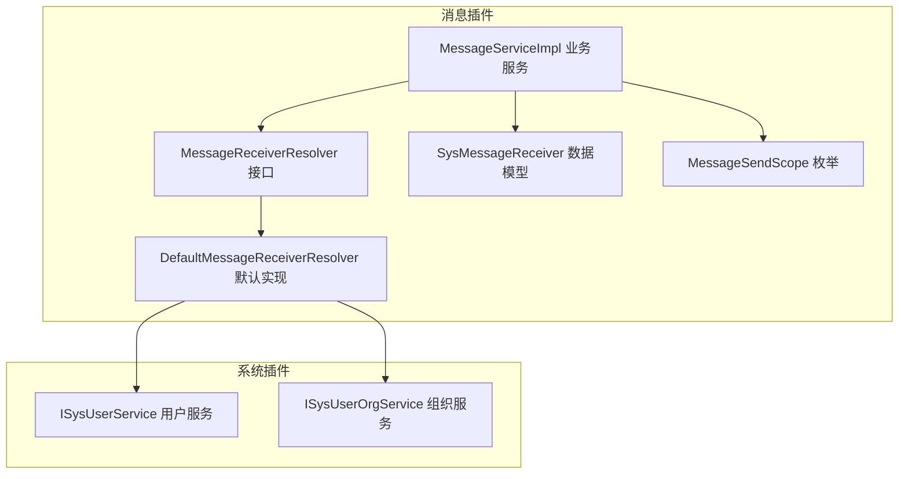
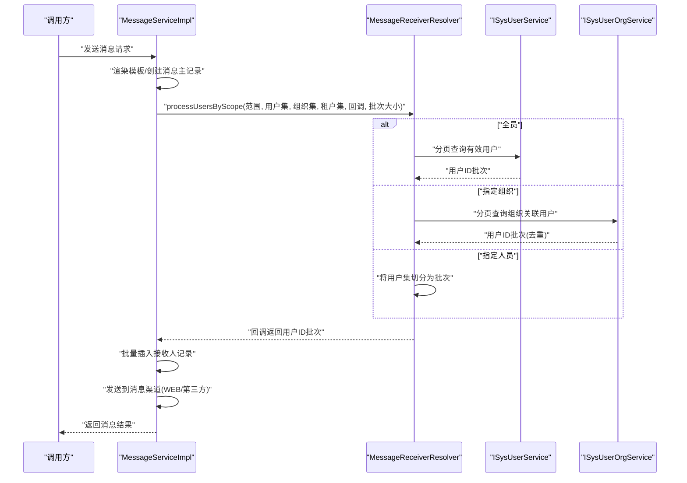
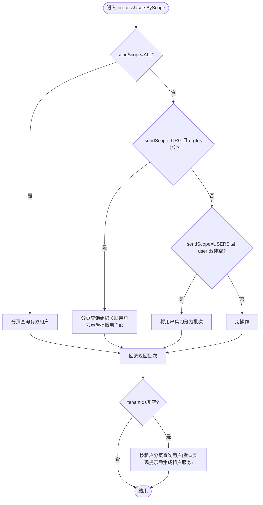
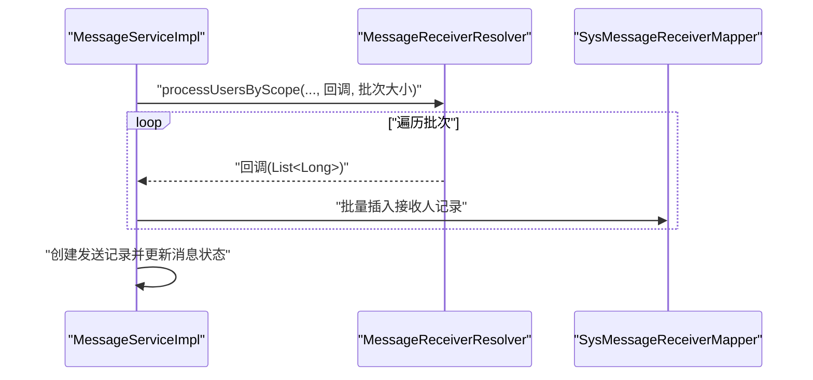
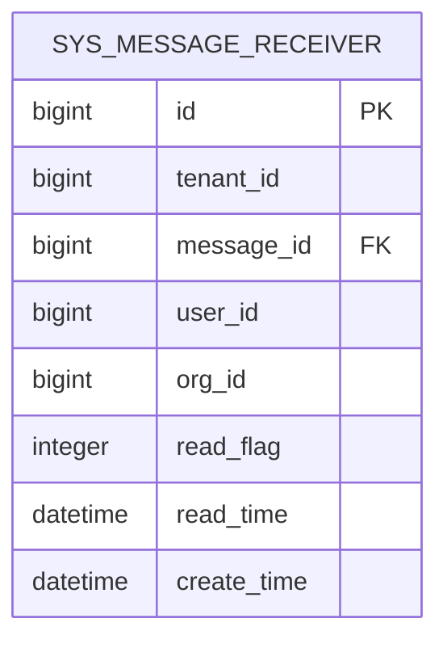
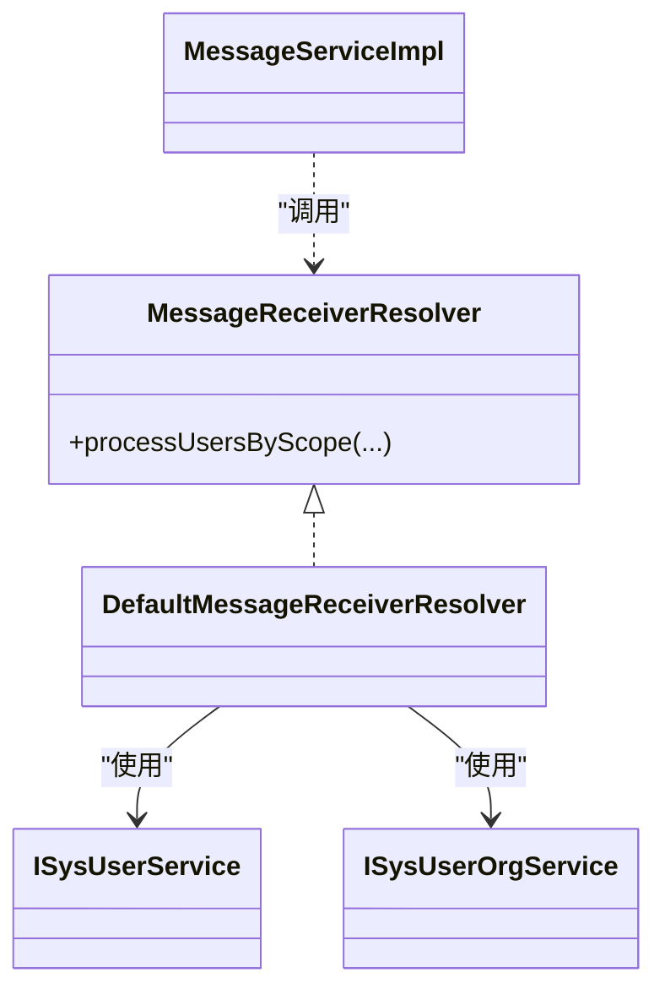

# 接收者解析机制

<cite>
**本文引用的文件**
- [MessageReceiverResolver.java](file://forge/forge-framework/forge-plugin-parent/forge-plugin-message/src/main/java/com/mdframe/forge/plugin/message/service/MessageReceiverResolver.java)
- [DefaultMessageReceiverResolver.java](file://forge/forge-framework/forge-plugin-parent/forge-plugin-message/src/main/java/com/mdframe/forge/plugin/message/service/impl/DefaultMessageReceiverResolver.java)
- [MessageServiceImpl.java](file://forge/forge-framework/forge-plugin-parent/forge-plugin-message/src/main/java/com/mdframe/forge/plugin/message/service/impl/MessageServiceImpl.java)
- [SysMessageReceiver.java](file://forge/forge-framework/forge-plugin-parent/forge-plugin-message/src/main/java/com/mdframe/forge/plugin/message/domain/entity/SysMessageReceiver.java)
- [MessageSendScope.java](file://forge/forge-framework/forge-plugin-parent/forge-plugin-message/src/main/java/com/mdframe/forge/plugin/message/domain/MessageSendScope.java)
- [ISysUserService.java](file://forge/forge-framework/forge-plugin-parent/forge-plugin-system/src/main/java/com/mdframe/forge/plugin/system/service/ISysUserService.java)
- [ISysUserOrgService.java](file://forge/forge-framework/forge-plugin-parent/forge-plugin-system/src/main/java/com/mdframe/forge/plugin/system/service/ISysUserOrgService.java)
</cite>

## 目录
1. [引言](#引言)
2. [项目结构](#项目结构)
3. [核心组件](#核心组件)
4. [架构总览](#架构总览)
5. [详细组件分析](#详细组件分析)
6. [依赖关系分析](#依赖关系分析)
7. [性能考虑](#性能考虑)
8. [故障排查指南](#故障排查指南)
9. [结论](#结论)
10. [附录](#附录)

## 引言
本文件面向Forge框架的消息接收者解析机制，系统性阐述接收者解析器的设计架构、解析流程与扩展机制。重点覆盖默认解析器的实现原理、解析规则、多维解析策略（用户ID、组织、租户）、批量处理与去重合并算法、性能优化与错误处理，并提供自定义解析器的开发指南。

## 项目结构
消息接收者解析位于消息插件模块中，围绕“解析接口 + 默认实现 + 业务服务”三层展开；同时依赖系统模块的用户与组织服务能力完成具体的数据筛选。

图表来源
- [MessageReceiverResolver.java](file://forge/forge-framework/forge-plugin-parent/forge-plugin-message/src/main/java/com/mdframe/forge/plugin/message/service/MessageReceiverResolver.java#L1-L33)
- [DefaultMessageReceiverResolver.java](file://forge/forge-framework/forge-plugin-parent/forge-plugin-message/src/main/java/com/mdframe/forge/plugin/message/service/impl/DefaultMessageReceiverResolver.java#L1-L151)
- [MessageServiceImpl.java](file://forge/forge-framework/forge-plugin-parent/forge-plugin-message/src/main/java/com/mdframe/forge/plugin/message/service/impl/MessageServiceImpl.java#L1-L388)
- [SysMessageReceiver.java](file://forge/forge-framework/forge-plugin-parent/forge-plugin-message/src/main/java/com/mdframe/forge/plugin/message/domain/entity/SysMessageReceiver.java#L1-L63)
- [MessageSendScope.java](file://forge/forge-framework/forge-plugin-parent/forge-plugin-message/src/main/java/com/mdframe/forge/plugin/message/domain/MessageSendScope.java#L1-L33)
- [ISysUserService.java](file://forge/forge-framework/forge-plugin-parent/forge-plugin-system/src/main/java/com/mdframe/forge/plugin/system/service/ISysUserService.java)
- [ISysUserOrgService.java](file://forge/forge-framework/forge-plugin-parent/forge-plugin-system/src/main/java/com/mdframe/forge/plugin/system/service/ISysUserOrgService.java)

章节来源
- [MessageReceiverResolver.java](file://forge/forge-framework/forge-plugin-parent/forge-plugin-message/src/main/java/com/mdframe/forge/plugin/message/service/MessageReceiverResolver.java#L1-L33)
- [DefaultMessageReceiverResolver.java](file://forge/forge-framework/forge-plugin-parent/forge-plugin-message/src/main/java/com/mdframe/forge/plugin/message/service/impl/DefaultMessageReceiverResolver.java#L1-L151)
- [MessageServiceImpl.java](file://forge/forge-framework/forge-plugin-parent/forge-plugin-message/src/main/java/com/mdframe/forge/plugin/message/service/impl/MessageServiceImpl.java#L1-L388)
- [SysMessageReceiver.java](file://forge/forge-framework/forge-plugin-parent/forge-plugin-message/src/main/java/com/mdframe/forge/plugin/message/domain/entity/SysMessageReceiver.java#L1-L63)
- [MessageSendScope.java](file://forge/forge-framework/forge-plugin-parent/forge-plugin-message/src/main/java/com/mdframe/forge/plugin/message/domain/MessageSendScope.java#L1-L33)
- [ISysUserService.java](file://forge/forge-framework/forge-plugin-parent/forge-plugin-system/src/main/java/com/mdframe/forge/plugin/system/service/ISysUserService.java)
- [ISysUserOrgService.java](file://forge/forge-framework/forge-plugin-parent/forge-plugin-system/src/main/java/com/mdframe/forge/plugin/system/service/ISysUserOrgService.java)

## 核心组件
- 解析接口：定义统一的按范围批量处理用户ID的SPI扩展点，支持回调式批量消费，避免内存溢出。
- 默认解析器：基于用户服务与组织服务，实现全员、指定组织、指定人员三种发送范围的分页/分批解析，并可叠加租户维度。
- 业务服务：在消息发送流程中调用解析器生成接收人列表，批量写入接收人记录并发送至消息渠道。
- 数据模型：接收人实体包含租户、消息、用户、组织、已读标记等字段，支撑多维筛选与状态管理。
- 发送范围枚举：统一ALL/ORG/USERS三类发送范围，便于上层配置与解析器分支判断。

章节来源
- [MessageReceiverResolver.java](file://forge/forge-framework/forge-plugin-parent/forge-plugin-message/src/main/java/com/mdframe/forge/plugin/message/service/MessageReceiverResolver.java#L10-L32)
- [DefaultMessageReceiverResolver.java](file://forge/forge-framework/forge-plugin-parent/forge-plugin-message/src/main/java/com/mdframe/forge/plugin/message/service/impl/DefaultMessageReceiverResolver.java#L24-L62)
- [MessageServiceImpl.java](file://forge/forge-framework/forge-plugin-parent/forge-plugin-message/src/main/java/com/mdframe/forge/plugin/message/service/impl/MessageServiceImpl.java#L142-L176)
- [SysMessageReceiver.java](file://forge/forge-framework/forge-plugin-parent/forge-plugin-message/src/main/java/com/mdframe/forge/plugin/message/domain/entity/SysMessageReceiver.java#L12-L62)
- [MessageSendScope.java](file://forge/forge-framework/forge-plugin-parent/forge-plugin-message/src/main/java/com/mdframe/forge/plugin/message/domain/MessageSendScope.java#L8-L33)

## 架构总览
消息发送的解析链路如下：业务服务接收发送请求后，通过解析器按范围批量产出用户ID批次，再批量写入接收人记录，最后发送到指定渠道。

图表来源
- [MessageServiceImpl.java](file://forge/forge-framework/forge-plugin-parent/forge-plugin-message/src/main/java/com/mdframe/forge/plugin/message/service/impl/MessageServiceImpl.java#L70-L202)
- [DefaultMessageReceiverResolver.java](file://forge/forge-framework/forge-plugin-parent/forge-plugin-message/src/main/java/com/mdframe/forge/plugin/message/service/impl/DefaultMessageReceiverResolver.java#L39-L62)
- [ISysUserService.java](file://forge/forge-framework/forge-plugin-parent/forge-plugin-system/src/main/java/com/mdframe/forge/plugin/system/service/ISysUserService.java)
- [ISysUserOrgService.java](file://forge/forge-framework/forge-plugin-parent/forge-plugin-system/src/main/java/com/mdframe/forge/plugin/system/service/ISysUserOrgService.java)

## 详细组件分析

### 解析接口与默认实现
- 接口职责：定义按发送范围批量处理用户ID的SPI，要求实现回调式分批处理，避免一次性加载全部用户ID导致内存压力。
- 默认实现策略：
  - 全员：分页查询有效用户，逐页提取ID作为批次。
  - 指定组织：分页查询组织关联关系，去重后提取用户ID作为批次。
  - 指定人员：将用户集合切分为固定批次。
  - 租户维度：在上述基础上，额外按租户过滤（默认实现提示需集成租户服务以分批获取）。

图表来源
- [MessageReceiverResolver.java](file://forge/forge-framework/forge-plugin-parent/forge-plugin-message/src/main/java/com/mdframe/forge/plugin/message/service/MessageReceiverResolver.java#L16-L31)
- [DefaultMessageReceiverResolver.java](file://forge/forge-framework/forge-plugin-parent/forge-plugin-message/src/main/java/com/mdframe/forge/plugin/message/service/impl/DefaultMessageReceiverResolver.java#L39-L149)

章节来源
- [MessageReceiverResolver.java](file://forge/forge-framework/forge-plugin-parent/forge-plugin-message/src/main/java/com/mdframe/forge/plugin/message/service/MessageReceiverResolver.java#L10-L32)
- [DefaultMessageReceiverResolver.java](file://forge/forge-framework/forge-plugin-parent/forge-plugin-message/src/main/java/com/mdframe/forge/plugin/message/service/impl/DefaultMessageReceiverResolver.java#L24-L149)

### 业务服务中的解析调用
- 在发送流程中，业务服务通过解析器回调的方式批量产出用户ID批次，避免一次性构建超大列表。
- 批量插入接收人记录时，按批次构造实体并逐一入库，统计接收人总数。
- 对于WEB站内信通道，直接返回成功；对于短信/邮件/PUSH等通道，委托消息客户端按消息ID查询接收人并发送。

图表来源
- [MessageServiceImpl.java](file://forge/forge-framework/forge-plugin-parent/forge-plugin-message/src/main/java/com/mdframe/forge/plugin/message/service/impl/MessageServiceImpl.java#L142-L176)
- [SysMessageReceiver.java](file://forge/forge-framework/forge-plugin-parent/forge-plugin-message/src/main/java/com/mdframe/forge/plugin/message/domain/entity/SysMessageReceiver.java#L12-L62)

章节来源
- [MessageServiceImpl.java](file://forge/forge-framework/forge-plugin-parent/forge-plugin-message/src/main/java/com/mdframe/forge/plugin/message/service/impl/MessageServiceImpl.java#L70-L225)

### 数据模型与字段语义
- 接收人实体包含租户、消息、用户、组织、已读标记、阅读时间、创建时间等字段，支持按租户/组织/用户多维筛选与状态追踪。

图表来源
- [SysMessageReceiver.java](file://forge/forge-framework/forge-plugin-parent/forge-plugin-message/src/main/java/com/mdframe/forge/plugin/message/domain/entity/SysMessageReceiver.java#L12-L62)

章节来源
- [SysMessageReceiver.java](file://forge/forge-framework/forge-plugin-parent/forge-plugin-message/src/main/java/com/mdframe/forge/plugin/message/domain/entity/SysMessageReceiver.java#L12-L62)

### 发送范围与表达式
- 发送范围枚举提供ALL/ORG/USERS三类范围，分别对应全员、指定组织、指定人员。
- 当前解析器未内置“表达式解析”能力，而是通过范围参数与集合参数进行筛选；如需表达式解析，可在自定义解析器中扩展。

章节来源
- [MessageSendScope.java](file://forge/forge-framework/forge-plugin-parent/forge-plugin-message/src/main/java/com/mdframe/forge/plugin/message/domain/MessageSendScope.java#L8-L33)

## 依赖关系分析
- 解析器依赖系统模块的用户与组织服务，以实现按组织/租户/用户维度的筛选。
- 业务服务依赖解析器、模板引擎、消息客户端与接收人映射器，形成“解析-持久化-发送”的闭环。
- 解析器与业务服务之间通过回调接口解耦，降低内存占用与耦合度。

图表来源
- [MessageReceiverResolver.java](file://forge/forge-framework/forge-plugin-parent/forge-plugin-message/src/main/java/com/mdframe/forge/plugin/message/service/MessageReceiverResolver.java#L10-L32)
- [DefaultMessageReceiverResolver.java](file://forge/forge-framework/forge-plugin-parent/forge-plugin-message/src/main/java/com/mdframe/forge/plugin/message/service/impl/DefaultMessageReceiverResolver.java#L30-L36)
- [MessageServiceImpl.java](file://forge/forge-framework/forge-plugin-parent/forge-plugin-message/src/main/java/com/mdframe/forge/plugin/message/service/impl/MessageServiceImpl.java#L48-L67)
- [ISysUserService.java](file://forge/forge-framework/forge-plugin-parent/forge-plugin-system/src/main/java/com/mdframe/forge/plugin/system/service/ISysUserService.java)
- [ISysUserOrgService.java](file://forge/forge-framework/forge-plugin-parent/forge-plugin-system/src/main/java/com/mdframe/forge/plugin/system/service/ISysUserOrgService.java)

章节来源
- [MessageReceiverResolver.java](file://forge/forge-framework/forge-plugin-parent/forge-plugin-message/src/main/java/com/mdframe/forge/plugin/message/service/MessageReceiverResolver.java#L10-L32)
- [DefaultMessageReceiverResolver.java](file://forge/forge-framework/forge-plugin-parent/forge-plugin-message/src/main/java/com/mdframe/forge/plugin/message/service/impl/DefaultMessageReceiverResolver.java#L30-L36)
- [MessageServiceImpl.java](file://forge/forge-framework/forge-plugin-parent/forge-plugin-message/src/main/java/com/mdframe/forge/plugin/message/service/impl/MessageServiceImpl.java#L48-L67)

## 性能考虑
- 分批处理：解析器与业务服务均采用回调式分批处理，避免一次性加载大量用户ID造成内存峰值。
- 去重合并：组织解析阶段对用户ID进行去重，减少重复接收人记录的生成。
- 分页查询：针对全员与租户解析，采用分页查询策略，结合数据库索引提升查询效率。
- 批量插入：接收人记录按批次批量插入，降低数据库往返次数。
- 通道选择：WEB站内信无需第三方通道，直接返回成功，减少外部依赖与延迟。

章节来源
- [DefaultMessageReceiverResolver.java](file://forge/forge-framework/forge-plugin-parent/forge-plugin-message/src/main/java/com/mdframe/forge/plugin/message/service/impl/DefaultMessageReceiverResolver.java#L67-L149)
- [MessageServiceImpl.java](file://forge/forge-framework/forge-plugin-parent/forge-plugin-message/src/main/java/com/mdframe/forge/plugin/message/service/impl/MessageServiceImpl.java#L142-L176)

## 故障排查指南
- 全员解析无结果：检查用户状态字段与分页参数，确认有效用户是否存在。
- 组织解析为空：确认组织ID是否正确、用户-组织关联是否存在。
- 指定人员解析异常：核对用户ID集合是否为空或包含无效ID。
- 租户解析提示需集成租户服务：默认实现仅给出日志提示，需在实际项目中集成租户服务以实现按租户分页查询。
- 内存溢出风险：确保使用回调式分批处理，不要一次性收集全部用户ID。
- 未读统计异常：确认接收人记录与消息类型字段是否正确写入。

章节来源
- [DefaultMessageReceiverResolver.java](file://forge/forge-framework/forge-plugin-parent/forge-plugin-message/src/main/java/com/mdframe/forge/plugin/message/service/impl/DefaultMessageReceiverResolver.java#L128-L149)
- [MessageServiceImpl.java](file://forge/forge-framework/forge-plugin-parent/forge-plugin-message/src/main/java/com/mdframe/forge/plugin/message/service/impl/MessageServiceImpl.java#L334-L362)

## 结论
Forge框架的消息接收者解析机制通过“接口 + 默认实现 + 业务服务”的分层设计，提供了可扩展、可扩展、低内存占用的多维解析能力。默认解析器覆盖全员、组织、人员三大场景，并支持租户维度扩展；业务服务通过回调式分批处理与批量插入，保障了高并发下的稳定性与性能。若需更复杂的表达式解析或自定义筛选逻辑，可在自定义解析器中扩展实现。

## 附录

### 自定义解析器开发指南
- 实现接口：实现解析接口的processUsersByScope方法，按sendScope与集合参数进行筛选。
- 批量回调：通过Consumer<List<Long>>回调返回用户ID批次，避免内存溢出。
- 多维扩展：可在默认实现基础上增加角色、部门、岗位等维度的解析策略。
- 错误处理：对空集合、无效ID、服务异常等情况进行健壮性处理与日志记录。
- 性能优化：采用分页查询、去重合并、批量插入等策略，结合数据库索引优化查询。

章节来源
- [MessageReceiverResolver.java](file://forge/forge-framework/forge-plugin-parent/forge-plugin-message/src/main/java/com/mdframe/forge/plugin/message/service/MessageReceiverResolver.java#L10-L32)
- [DefaultMessageReceiverResolver.java](file://forge/forge-framework/forge-plugin-parent/forge-plugin-message/src/main/java/com/mdframe/forge/plugin/message/service/impl/DefaultMessageReceiverResolver.java#L24-L62)