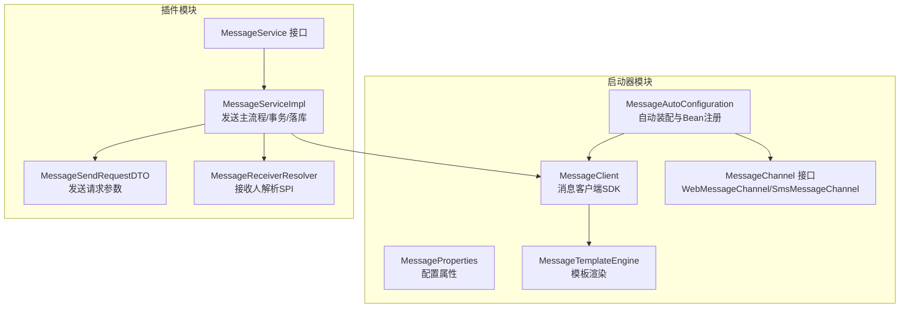
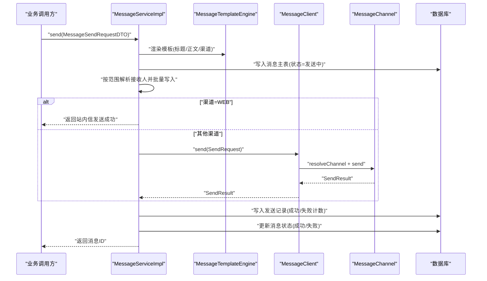
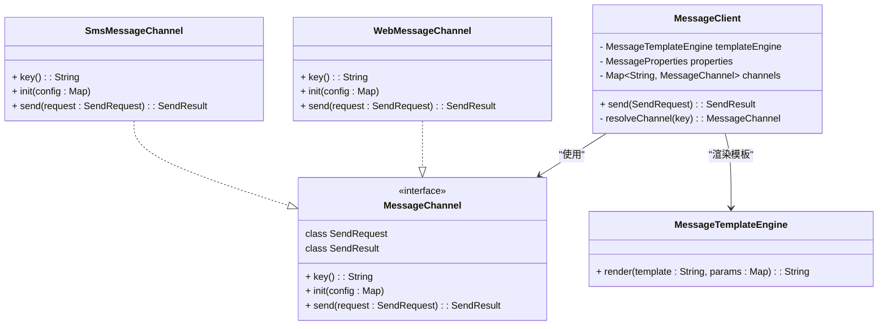
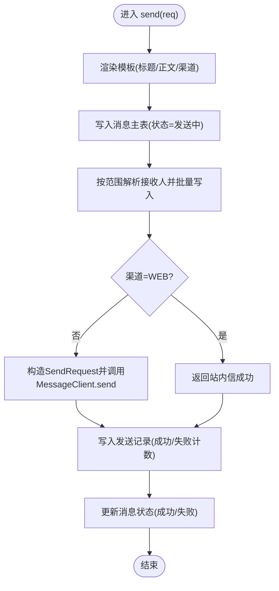
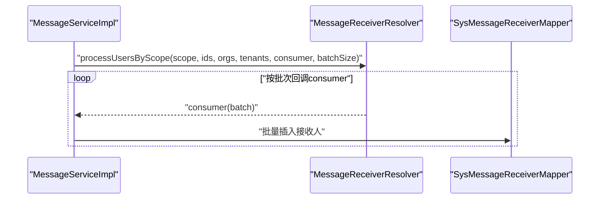
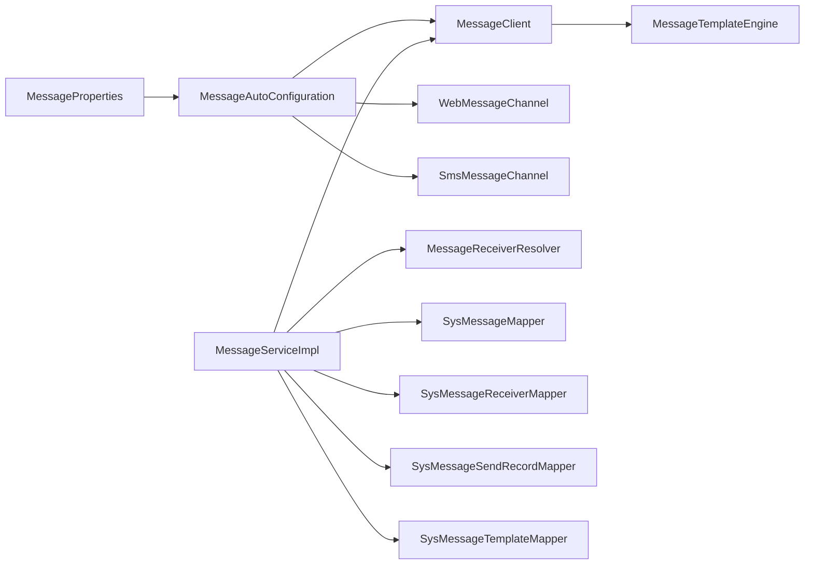

# 消息发送服务

<cite>
**本文引用的文件**
- [MessageAutoConfiguration.java](file://forge/forge-framework/forge-starter-parent/forge-starter-message/src/main/java/com/mdframe/forge/starter/message/config/MessageAutoConfiguration.java)
- [MessageProperties.java](file://forge/forge-framework/forge-starter-parent/forge-starter-message/src/main/java/com/mdframe/forge/starter/message/config/MessageProperties.java)
- [MessageClient.java](file://forge/forge-framework/forge-starter-parent/forge-starter-message/src/main/java/com/mdframe/forge/starter/message/sdk/MessageClient.java)
- [MessageChannel.java](file://forge/forge-framework/forge-starter-parent/forge-starter-message/src/main/java/com/mdframe/forge/starter/message/channel/MessageChannel.java)
- [WebMessageChannel.java](file://forge/forge-framework/forge-starter-parent/forge-starter-message/src/main/java/com/mdframe/forge/starter/message/channel/WebMessageChannel.java)
- [SmsMessageChannel.java](file://forge/forge-framework/forge-starter-parent/forge-starter-message/src/main/java/com/mdframe/forge/starter/message/channel/SmsMessageChannel.java)
- [MessageTemplateEngine.java](file://forge/forge-framework/forge-starter-parent/forge-starter-message/src/main/java/com/mdframe/forge/starter/message/service/MessageTemplateEngine.java)
- [MessageService.java](file://forge/forge-framework/forge-plugin-parent/forge-plugin-message/src/main/java/com/mdframe/forge/plugin/message/service/MessageService.java)
- [MessageServiceImpl.java](file://forge/forge-framework/forge-plugin-parent/forge-plugin-message/src/main/java/com/mdframe/forge/plugin/message/service/impl/MessageServiceImpl.java)
- [MessageSendRequestDTO.java](file://forge/forge-framework/forge-plugin-parent/forge-plugin-message/src/main/java/com/mdframe/forge/plugin/message/domain/dto/MessageSendRequestDTO.java)
- [MessageReceiverResolver.java](file://forge/forge-framework/forge-plugin-parent/forge-plugin-message/src/main/java/com/mdframe/forge/plugin/message/service/MessageReceiverResolver.java)
</cite>

## 目录
1. [简介](#简介)
2. [项目结构](#项目结构)
3. [核心组件](#核心组件)
4. [架构总览](#架构总览)
5. [详细组件分析](#详细组件分析)
6. [依赖关系分析](#依赖关系分析)
7. [性能考虑](#性能考虑)
8. [故障排查指南](#故障排查指南)
9. [结论](#结论)
10. [附录](#附录)

## 简介
本文件面向Forge框架的消息发送服务，系统性阐述消息发送的端到端流程、异步处理机制与可靠性保障；深入解析消息发送接口设计理念、参数校验与异常处理；覆盖批量发送、定时发送、条件触发等高级策略；并提供消息客户端SDK的使用方法、回调处理与重试机制建议，以及发送性能优化、监控告警与故障恢复的最佳实践。

## 项目结构
消息发送能力由“启动器(starter)”与“插件(plugin)”两部分协同实现：
- 启动器负责消息通道抽象、模板引擎、自动装配与客户端SDK；
- 插件负责消息域业务（模板解析、发送记录、接收人解析与落库、事务一致性）。

图表来源
- [MessageAutoConfiguration.java](file://forge/forge-framework/forge-starter-parent/forge-starter-message/src/main/java/com/mdframe/forge/starter/message/config/MessageAutoConfiguration.java#L17-L46)
- [MessageClient.java](file://forge/forge-framework/forge-starter-parent/forge-starter-message/src/main/java/com/mdframe/forge/starter/message/sdk/MessageClient.java#L10-L55)
- [MessageChannel.java](file://forge/forge-framework/forge-starter-parent/forge-starter-message/src/main/java/com/mdframe/forge/starter/message/channel/MessageChannel.java#L5-L40)
- [MessageTemplateEngine.java](file://forge/forge-framework/forge-starter-parent/forge-starter-message/src/main/java/com/mdframe/forge/starter/message/service/MessageTemplateEngine.java#L5-L22)
- [MessageService.java](file://forge/forge-framework/forge-plugin-parent/forge-plugin-message/src/main/java/com/mdframe/forge/plugin/message/service/MessageService.java#L14-L50)
- [MessageServiceImpl.java](file://forge/forge-framework/forge-plugin-parent/forge-plugin-message/src/main/java/com/mdframe/forge/plugin/message/service/impl/MessageServiceImpl.java#L41-L89)
- [MessageSendRequestDTO.java](file://forge/forge-framework/forge-plugin-parent/forge-plugin-message/src/main/java/com/mdframe/forge/plugin/message/domain/dto/MessageSendRequestDTO.java#L12-L63)
- [MessageReceiverResolver.java](file://forge/forge-framework/forge-plugin-parent/forge-plugin-message/src/main/java/com/mdframe/forge/plugin/message/service/MessageReceiverResolver.java#L14-L32)

章节来源
- [MessageAutoConfiguration.java](file://forge/forge-framework/forge-starter-parent/forge-starter-message/src/main/java/com/mdframe/forge/starter/message/config/MessageAutoConfiguration.java#L17-L46)
- [MessageService.java](file://forge/forge-framework/forge-plugin-parent/forge-plugin-message/src/main/java/com/mdframe/forge/plugin/message/service/MessageService.java#L14-L50)

## 核心组件
- 配置与自动装配：通过自动配置类注册模板引擎、通道Bean与消息客户端。
- 客户端SDK：统一入口，负责模板渲染、渠道选择与发送结果封装。
- 通道抽象：定义渠道键、初始化与发送协议，内置Web与短信通道示例。
- 模板引擎：简单占位符渲染，支持空安全与空参数保护。
- 插件服务：实现消息发送主流程，含模板解析、接收人批量落库、发送记录与状态更新。

章节来源
- [MessageProperties.java](file://forge/forge-framework/forge-starter-parent/forge-starter-message/src/main/java/com/mdframe/forge/starter/message/config/MessageProperties.java#L8-L33)
- [MessageClient.java](file://forge/forge-framework/forge-starter-parent/forge-starter-message/src/main/java/com/mdframe/forge/starter/message/sdk/MessageClient.java#L10-L55)
- [MessageChannel.java](file://forge/forge-framework/forge-starter-parent/forge-starter-message/src/main/java/com/mdframe/forge/starter/message/channel/MessageChannel.java#L5-L40)
- [MessageTemplateEngine.java](file://forge/forge-framework/forge-starter-parent/forge-starter-message/src/main/java/com/mdframe/forge/starter/message/service/MessageTemplateEngine.java#L5-L22)
- [MessageService.java](file://forge/forge-framework/forge-plugin-parent/forge-plugin-message/src/main/java/com/mdframe/forge/plugin/message/service/MessageService.java#L14-L50)

## 架构总览
消息发送采用“插件驱动+启动器扩展”的分层架构：
- 上层：业务侧通过插件接口发起发送；
- 中层：插件实现负责事务、模板渲染、接收人解析与落库；
- 下层：启动器提供通道抽象与客户端SDK，屏蔽具体渠道差异。

图表来源
- [MessageServiceImpl.java](file://forge/forge-framework/forge-plugin-parent/forge-plugin-message/src/main/java/com/mdframe/forge/plugin/message/service/impl/MessageServiceImpl.java#L70-L89)
- [MessageClient.java](file://forge/forge-framework/forge-starter-parent/forge-starter-message/src/main/java/com/mdframe/forge/starter/message/sdk/MessageClient.java#L34-L45)
- [MessageChannel.java](file://forge/forge-framework/forge-starter-parent/forge-starter-message/src/main/java/com/mdframe/forge/starter/message/channel/MessageChannel.java#L22-L39)
- [MessageTemplateEngine.java](file://forge/forge-framework/forge-starter-parent/forge-starter-message/src/main/java/com/mdframe/forge/starter/message/service/MessageTemplateEngine.java#L10-L21)

## 详细组件分析

### 客户端SDK与通道抽象
- MessageClient：负责模板渲染、渠道解析与发送；支持按配置初始化各通道。
- MessageChannel接口：统一渠道键、初始化与发送协议；WebMessageChannel/SmsMessageChannel为内置实现。
- MessageTemplateEngine：对模板进行简单占位符替换，空安全处理。

图表来源
- [MessageClient.java](file://forge/forge-framework/forge-starter-parent/forge-starter-message/src/main/java/com/mdframe/forge/starter/message/sdk/MessageClient.java#L10-L55)
- [MessageChannel.java](file://forge/forge-framework/forge-starter-parent/forge-starter-message/src/main/java/com/mdframe/forge/starter/message/channel/MessageChannel.java#L5-L40)
- [WebMessageChannel.java](file://forge/forge-framework/forge-starter-parent/forge-starter-message/src/main/java/com/mdframe/forge/starter/message/channel/WebMessageChannel.java#L5-L15)
- [SmsMessageChannel.java](file://forge/forge-framework/forge-starter-parent/forge-starter-message/src/main/java/com/mdframe/forge/starter/message/channel/SmsMessageChannel.java#L5-L15)
- [MessageTemplateEngine.java](file://forge/forge-framework/forge-starter-parent/forge-starter-message/src/main/java/com/mdframe/forge/starter/message/service/MessageTemplateEngine.java#L5-L22)

章节来源
- [MessageClient.java](file://forge/forge-framework/forge-starter-parent/forge-starter-message/src/main/java/com/mdframe/forge/starter/message/sdk/MessageClient.java#L10-L55)
- [MessageChannel.java](file://forge/forge-framework/forge-starter-parent/forge-starter-message/src/main/java/com/mdframe/forge/starter/message/channel/MessageChannel.java#L5-L40)
- [WebMessageChannel.java](file://forge/forge-framework/forge-starter-parent/forge-starter-message/src/main/java/com/mdframe/forge/starter/message/channel/WebMessageChannel.java#L5-L15)
- [SmsMessageChannel.java](file://forge/forge-framework/forge-starter-parent/forge-starter-message/src/main/java/com/mdframe/forge/starter/message/channel/SmsMessageChannel.java#L5-L15)
- [MessageTemplateEngine.java](file://forge/forge-framework/forge-starter-parent/forge-starter-message/src/main/java/com/mdframe/forge/starter/message/service/MessageTemplateEngine.java#L5-L22)

### 插件服务：发送主流程与可靠性
- 流程拆分：模板渲染 → 写入消息主表 → 批量写入接收人 → 渠道发送 → 写入发送记录 → 更新消息状态。
- 事务边界：整个发送过程置于单事务中，确保状态一致性。
- 可靠性：
  - 发送记录包含成功/失败计数、外部ID与错误信息，便于追踪与重试。
  - WEB站内信无需第三方调用，直接返回成功，降低外部依赖风险。
  - 接收人解析采用回调式批量处理，避免一次性加载全部用户导致内存溢出。

图表来源
- [MessageServiceImpl.java](file://forge/forge-framework/forge-plugin-parent/forge-plugin-message/src/main/java/com/mdframe/forge/plugin/message/service/impl/MessageServiceImpl.java#L70-L89)
- [MessageServiceImpl.java](file://forge/forge-framework/forge-plugin-parent/forge-plugin-message/src/main/java/com/mdframe/forge/plugin/message/service/impl/MessageServiceImpl.java#L181-L202)
- [MessageServiceImpl.java](file://forge/forge-framework/forge-plugin-parent/forge-plugin-message/src/main/java/com/mdframe/forge/plugin/message/service/impl/MessageServiceImpl.java#L207-L225)

章节来源
- [MessageServiceImpl.java](file://forge/forge-framework/forge-plugin-parent/forge-plugin-message/src/main/java/com/mdframe/forge/plugin/message/service/impl/MessageServiceImpl.java#L70-L89)
- [MessageServiceImpl.java](file://forge/forge-framework/forge-plugin-parent/forge-plugin-message/src/main/java/com/mdframe/forge/plugin/message/service/impl/MessageServiceImpl.java#L181-L202)
- [MessageServiceImpl.java](file://forge/forge-framework/forge-plugin-parent/forge-plugin-message/src/main/java/com/mdframe/forge/plugin/message/service/impl/MessageServiceImpl.java#L207-L225)

### 接收人解析SPI与批量策略
- MessageReceiverResolver定义SPI，支持按ALL/ORG/USERS等范围解析用户ID，并以回调方式批量输出，避免内存压力。
- 插件在写入接收人时，使用该SPI进行分批处理，每批固定大小，逐批插入。

图表来源
- [MessageReceiverResolver.java](file://forge/forge-framework/forge-plugin-parent/forge-plugin-message/src/main/java/com/mdframe/forge/plugin/message/service/MessageReceiverResolver.java#L26-L31)
- [MessageServiceImpl.java](file://forge/forge-framework/forge-plugin-parent/forge-plugin-message/src/main/java/com/mdframe/forge/plugin/message/service/impl/MessageServiceImpl.java#L142-L176)

章节来源
- [MessageReceiverResolver.java](file://forge/forge-framework/forge-plugin-parent/forge-plugin-message/src/main/java/com/mdframe/forge/plugin/message/service/MessageReceiverResolver.java#L14-L32)
- [MessageServiceImpl.java](file://forge/forge-framework/forge-plugin-parent/forge-plugin-message/src/main/java/com/mdframe/forge/plugin/message/service/impl/MessageServiceImpl.java#L142-L176)

### 发送接口设计与参数校验
- 请求DTO包含标题、内容、模板编码、模板参数、接收人范围与ID集合、渠道与类型等字段，满足多场景发送需求。
- 参数校验建议：
  - 必填项：模板编码或标题+内容至少一项可用。
  - 范围与ID互斥：ALL/ORG/USERS三者择一，且对应ID集合需有效。
  - 渠道与类型：默认WEB，其他渠道需正确配置。
  - 模板参数：非空时进行占位符替换，注意空值转字符串的兼容性。

章节来源
- [MessageSendRequestDTO.java](file://forge/forge-framework/forge-plugin-parent/forge-plugin-message/src/main/java/com/mdframe/forge/plugin/message/domain/dto/MessageSendRequestDTO.java#L12-L63)

### 异常处理与重试机制
- 事务回滚：发送主流程置于事务中，任一步骤失败将回滚，保证状态一致。
- 发送记录：无论成功与否均写入发送记录，便于后续重试与审计。
- 建议的重试策略：
  - 失败计数与错误信息可用于触发补偿任务。
  - 对于第三方渠道，可在发送记录基础上按失败阈值触发定时重试。
  - WEB站内信失败通常为内部异常，建议记录日志并报警。

章节来源
- [MessageServiceImpl.java](file://forge/forge-framework/forge-plugin-parent/forge-plugin-message/src/main/java/com/mdframe/forge/plugin/message/service/impl/MessageServiceImpl.java#L70-L89)
- [MessageServiceImpl.java](file://forge/forge-framework/forge-plugin-parent/forge-plugin-message/src/main/java/com/mdframe/forge/plugin/message/service/impl/MessageServiceImpl.java#L207-L225)

### 高级发送策略
- 批量发送：通过接收人解析SPI的回调式批量处理，避免内存溢出；同时批量插入接收人与发送记录。
- 定时发送：结合定时任务调度器，基于发送时间字段触发发送流程。
- 条件触发：根据模板或业务规则动态决定渠道与类型，再调用客户端SDK发送。

章节来源
- [MessageReceiverResolver.java](file://forge/forge-framework/forge-plugin-parent/forge-plugin-message/src/main/java/com/mdframe/forge/plugin/message/service/MessageReceiverResolver.java#L26-L31)
- [MessageServiceImpl.java](file://forge/forge-framework/forge-plugin-parent/forge-plugin-message/src/main/java/com/mdframe/forge/plugin/message/service/impl/MessageServiceImpl.java#L142-L176)

## 依赖关系分析
- 启动器依赖：MessageAutoConfiguration装配MessageClient与MessageChannel；MessageClient依赖MessageTemplateEngine与MessageProperties。
- 插件依赖：MessageServiceImpl依赖MessageClient、MessageTemplateEngine、MessageReceiverResolver与多个Mapper；通过事务保证一致性。
- 配置依赖：MessageProperties提供默认渠道与各渠道开关与配置，影响MessageClient与通道初始化。

图表来源
- [MessageAutoConfiguration.java](file://forge/forge-framework/forge-starter-parent/forge-starter-message/src/main/java/com/mdframe/forge/starter/message/config/MessageAutoConfiguration.java#L17-L46)
- [MessageClient.java](file://forge/forge-framework/forge-starter-parent/forge-starter-message/src/main/java/com/mdframe/forge/starter/message/sdk/MessageClient.java#L10-L55)
- [MessageTemplateEngine.java](file://forge/forge-framework/forge-starter-parent/forge-starter-message/src/main/java/com/mdframe/forge/starter/message/service/MessageTemplateEngine.java#L5-L22)
- [MessageServiceImpl.java](file://forge/forge-framework/forge-plugin-parent/forge-plugin-message/src/main/java/com/mdframe/forge/plugin/message/service/impl/MessageServiceImpl.java#L41-L68)

章节来源
- [MessageAutoConfiguration.java](file://forge/forge-framework/forge-starter-parent/forge-starter-message/src/main/java/com/mdframe/forge/starter/message/config/MessageAutoConfiguration.java#L17-L46)
- [MessageServiceImpl.java](file://forge/forge-framework/forge-plugin-parent/forge-plugin-message/src/main/java/com/mdframe/forge/plugin/message/service/impl/MessageServiceImpl.java#L41-L68)

## 性能考虑
- 批量写入：接收人与发送记录采用批量插入，减少IO次数。
- 回调式解析：接收人解析通过回调分批输出，避免大集合内存占用。
- 模板渲染：简单占位符替换，复杂模板建议在上游预处理或缓存渲染结果。
- 渠道选择：WEB站内信无需第三方调用，直接返回成功，降低延迟与外部依赖。
- 数据库索引：建议在消息接收表按用户ID与创建时间建立索引，提升分页与统计性能。

## 故障排查指南
- 发送失败但记录存在：检查发送记录中的错误信息与外部ID，定位第三方渠道问题。
- 接收人缺失：确认发送范围与ID集合是否正确，核查接收人解析SPI实现。
- WEB站内信异常：若出现异常，建议查看服务端日志并报警；必要时回滚事务并重试。
- 渠道不可用：确认MessageProperties中对应渠道开关与配置，以及MessageClient的渠道解析逻辑。

章节来源
- [MessageServiceImpl.java](file://forge/forge-framework/forge-plugin-parent/forge-plugin-message/src/main/java/com/mdframe/forge/plugin/message/service/impl/MessageServiceImpl.java#L207-L225)
- [MessageClient.java](file://forge/forge-framework/forge-starter-parent/forge-starter-message/src/main/java/com/mdframe/forge/starter/message/sdk/MessageClient.java#L47-L54)

## 结论
Forge消息发送服务通过“启动器+插件”的分层设计，实现了跨渠道、可扩展、高可靠的消息发送能力。插件侧提供完整的发送主流程与事务保障，启动器侧提供通道抽象与客户端SDK，配合模板引擎与配置化管理，满足从基础WEB站内信到第三方短信等多场景需求。结合批量策略、定时与条件触发，可进一步提升发送效率与灵活性。

## 附录
- 使用建议
  - 在业务侧优先使用模板编码+参数的方式，减少重复内容拼接。
  - 对于大规模广播，务必使用接收人解析SPI的回调式批量处理。
  - 对第三方渠道失败的场景，建议结合发送记录与定时任务进行重试与补偿。
- 配置要点
  - 设置默认渠道与各渠道开关，确保MessageClient能正确解析渠道。
  - 对短信等渠道，预留配置项以便后续接入第三方网关。