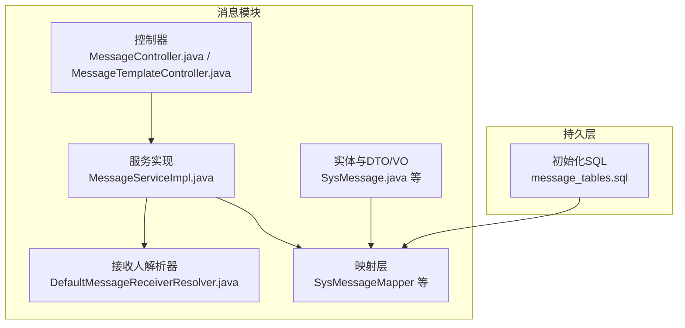
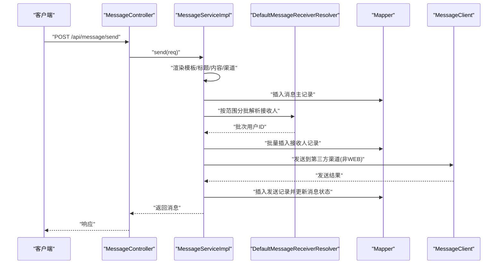
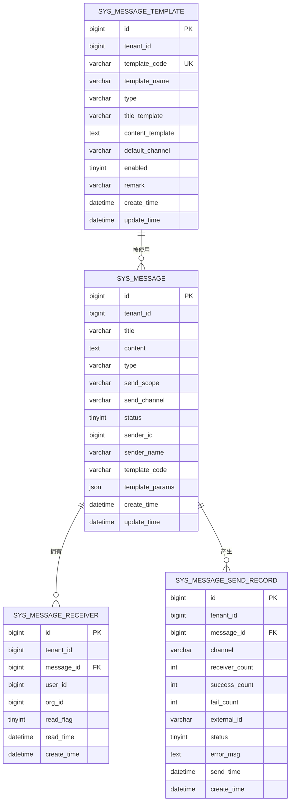
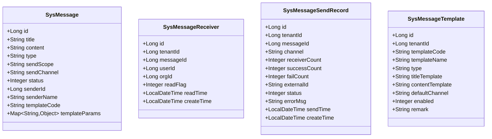
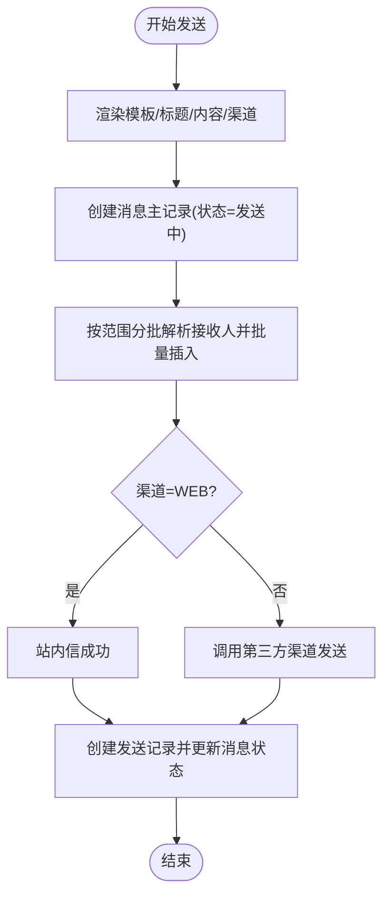
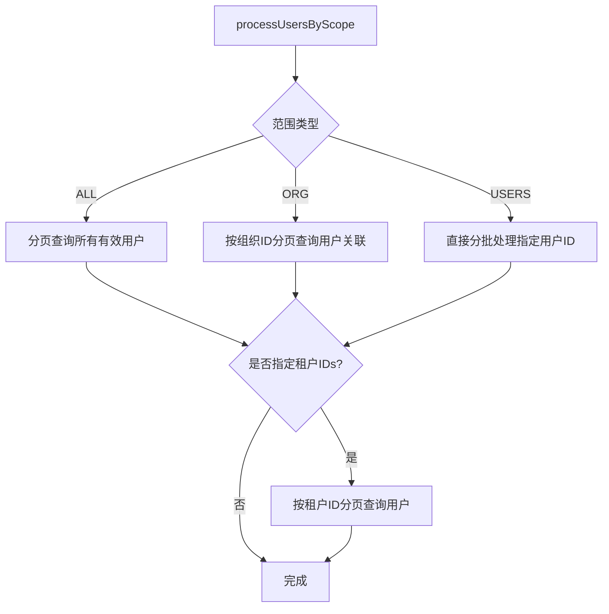
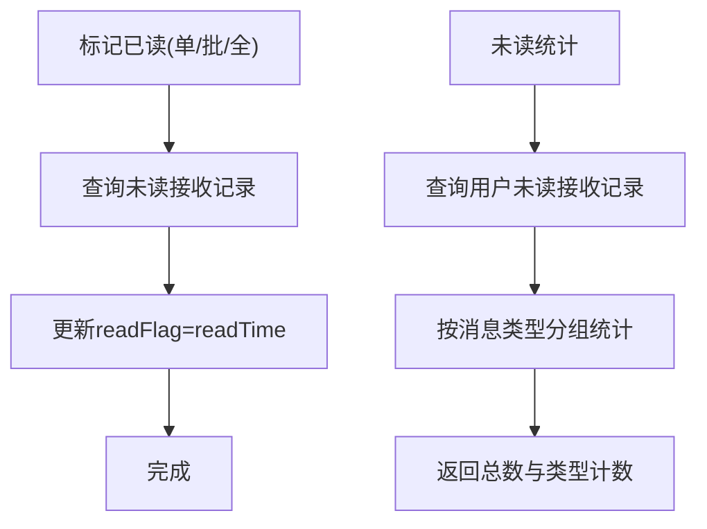
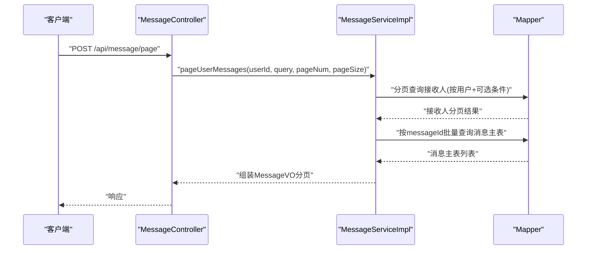
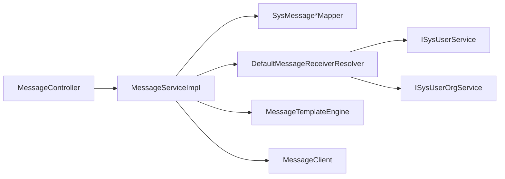

# 消息存储与追踪

<cite>
**本文引用的文件**
- [message_tables.sql](file://forge/forge-framework/forge-plugin-parent/forge-plugin-message/src/main/resources/sql/message_tables.sql)
- [MessageServiceImpl.java](file://forge/forge-framework/forge-plugin-parent/forge-plugin-message/src/main/java/com/mdframe/forge/plugin/message/service/impl/MessageServiceImpl.java)
- [DefaultMessageReceiverResolver.java](file://forge/forge-framework/forge-plugin-parent/forge-plugin-message/src/main/java/com/mdframe/forge/plugin/message/service/impl/DefaultMessageReceiverResolver.java)
- [MessageController.java](file://forge/forge-framework/forge-plugin-parent/forge-plugin-message/src/main/java/com/mdframe/forge/plugin/message/controller/MessageController.java)
- [MessageTemplateController.java](file://forge/forge-framework/forge-plugin-parent/forge-plugin-message/src/main/java/com/mdframe/forge/plugin/message/controller/MessageTemplateController.java)
- [SysMessage.java](file://forge/forge-framework/forge-plugin-parent/forge-plugin-message/src/main/java/com/mdframe/forge/plugin/message/domain/entity/SysMessage.java)
- [SysMessageReceiver.java](file://forge/forge-framework/forge-plugin-parent/forge-plugin-message/src/main/java/com/mdframe/forge/plugin/message/domain/entity/SysMessageReceiver.java)
- [SysMessageSendRecord.java](file://forge/forge-framework/forge-plugin-parent/forge-plugin-message/src/main/java/com/mdframe/forge/plugin/message/domain/entity/SysMessageSendRecord.java)
- [SysMessageTemplate.java](file://forge/forge-framework/forge-plugin-parent/forge-plugin-message/src/main/java/com/mdframe/forge/plugin/message/domain/entity/SysMessageTemplate.java)
- [MessageQueryDTO.java](file://forge/forge-framework/forge-plugin-parent/forge-plugin-message/src/main/java/com/mdframe/forge/plugin/message/domain/dto/MessageQueryDTO.java)
- [MessageSendRequestDTO.java](file://forge/forge-framework/forge-plugin-parent/forge-plugin-message/src/main/java/com/mdframe/forge/plugin/message/domain/dto/MessageSendRequestDTO.java)
- [MessageVO.java](file://forge/forge-framework/forge-plugin-parent/forge-plugin-message/src/main/java/com/mdframe/forge/plugin/message/domain/vo/MessageVO.java)
- [UnreadCountVO.java](file://forge/forge-framework/forge-plugin-parent/forge-plugin-message/src/main/java/com/mdframe/forge/plugin/message/domain/vo/UnreadCountVO.java)
</cite>

## 目录
1. [简介](#简介)
2. [项目结构](#项目结构)
3. [核心组件](#核心组件)
4. [架构总览](#架构总览)
5. [详细组件分析](#详细组件分析)
6. [依赖关系分析](#依赖关系分析)
7. [性能考量](#性能考量)
8. [故障排查指南](#故障排查指南)
9. [结论](#结论)
10. [附录](#附录)

## 简介
本文件面向Forge框架的消息存储与追踪能力，系统性阐述消息数据模型、存储策略、状态管理、发送轨迹追踪与阅读统计，并给出查询接口、分页检索与条件过滤等数据访问模式。同时覆盖数据一致性保障、性能优化与大数据量处理方案，帮助开发者在高并发与海量消息场景下稳定运行。

## 项目结构
消息模块位于“forge-plugin-message”，采用按领域分层的目录组织：
- domain：实体、DTO、VO与枚举常量
- mapper：MyBatis-Plus映射层
- service：业务服务与实现
- controller：REST接口
- resources/sql：数据库初始化脚本

图表来源
- [MessageController.java](file://forge/forge-framework/forge-plugin-parent/forge-plugin-message/src/main/java/com/mdframe/forge/plugin/message/controller/MessageController.java#L1-L94)
- [MessageTemplateController.java](file://forge/forge-framework/forge-plugin-parent/forge-plugin-message/src/main/java/com/mdframe/forge/plugin/message/controller/MessageTemplateController.java#L1-L83)
- [MessageServiceImpl.java](file://forge/forge-framework/forge-plugin-parent/forge-plugin-message/src/main/java/com/mdframe/forge/plugin/message/service/impl/MessageServiceImpl.java#L1-L388)
- [DefaultMessageReceiverResolver.java](file://forge/forge-framework/forge-plugin-parent/forge-plugin-message/src/main/java/com/mdframe/forge/plugin/message/service/impl/DefaultMessageReceiverResolver.java#L1-L151)
- [message_tables.sql](file://forge/forge-framework/forge-plugin-parent/forge-plugin-message/src/main/resources/sql/message_tables.sql#L1-L90)

章节来源
- [MessageController.java](file://forge/forge-framework/forge-plugin-parent/forge-plugin-message/src/main/java/com/mdframe/forge/plugin/message/controller/MessageController.java#L1-L94)
- [MessageTemplateController.java](file://forge/forge-framework/forge-plugin-parent/forge-plugin-message/src/main/java/com/mdframe/forge/plugin/message/controller/MessageTemplateController.java#L1-L83)
- [MessageServiceImpl.java](file://forge/forge-framework/forge-plugin-parent/forge-plugin-message/src/main/java/com/mdframe/forge/plugin/message/service/impl/MessageServiceImpl.java#L1-L388)
- [DefaultMessageReceiverResolver.java](file://forge/forge-framework/forge-plugin-parent/forge-plugin-message/src/main/java/com/mdframe/forge/plugin/message/service/impl/DefaultMessageReceiverResolver.java#L1-L151)
- [message_tables.sql](file://forge/forge-framework/forge-plugin-parent/forge-plugin-message/src/main/resources/sql/message_tables.sql#L1-L90)

## 核心组件
- 数据模型与表结构：消息主表、接收人表、发送记录表、模板表
- 业务服务：消息发送、状态管理、阅读标记、统计查询
- 控制器：对外API接口
- 接收人解析器：按范围分批解析接收人
- DTO/VO：请求与响应数据结构

章节来源
- [SysMessage.java](file://forge/forge-framework/forge-plugin-parent/forge-plugin-message/src/main/java/com/mdframe/forge/plugin/message/domain/entity/SysMessage.java#L1-L76)
- [SysMessageReceiver.java](file://forge/forge-framework/forge-plugin-parent/forge-plugin-message/src/main/java/com/mdframe/forge/plugin/message/domain/entity/SysMessageReceiver.java#L1-L63)
- [SysMessageSendRecord.java](file://forge/forge-framework/forge-plugin-parent/forge-plugin-message/src/main/java/com/mdframe/forge/plugin/message/domain/entity/SysMessageSendRecord.java#L1-L83)
- [SysMessageTemplate.java](file://forge/forge-framework/forge-plugin-parent/forge-plugin-message/src/main/java/com/mdframe/forge/plugin/message/domain/entity/SysMessageTemplate.java#L1-L71)
- [MessageServiceImpl.java](file://forge/forge-framework/forge-plugin-parent/forge-plugin-message/src/main/java/com/mdframe/forge/plugin/message/service/impl/MessageServiceImpl.java#L1-L388)
- [MessageController.java](file://forge/forge-framework/forge-plugin-parent/forge-plugin-message/src/main/java/com/mdframe/forge/plugin/message/controller/MessageController.java#L1-L94)
- [DefaultMessageReceiverResolver.java](file://forge/forge-framework/forge-plugin-parent/forge-plugin-message/src/main/java/com/mdframe/forge/plugin/message/service/impl/DefaultMessageReceiverResolver.java#L1-L151)

## 架构总览
消息从“发送”到“接收”的全链路包括：模板渲染、主记录创建、接收人批量写入、渠道发送、发送记录落库与状态回写。阅读状态与统计通过接收人表维护。

图表来源
- [MessageController.java](file://forge/forge-framework/forge-plugin-parent/forge-plugin-message/src/main/java/com/mdframe/forge/plugin/message/controller/MessageController.java#L33-L39)
- [MessageServiceImpl.java](file://forge/forge-framework/forge-plugin-parent/forge-plugin-message/src/main/java/com/mdframe/forge/plugin/message/service/impl/MessageServiceImpl.java#L70-L89)
- [DefaultMessageReceiverResolver.java](file://forge/forge-framework/forge-plugin-parent/forge-plugin-message/src/main/java/com/mdframe/forge/plugin/message/service/impl/DefaultMessageReceiverResolver.java#L39-L62)

## 详细组件分析

### 数据模型与存储策略
- 消息主表：保存消息元信息、类型、发送范围、渠道、状态、模板与参数等
- 接收人表：按用户维度记录消息接收与阅读状态，支持唯一约束(message_id, user_id)
- 发送记录表：记录每次发送的渠道、总量、成功/失败数、外部ID、状态与错误信息
- 模板表：保存模板编码、名称、类型、标题/内容模板、默认渠道与启用状态

图表来源
- [message_tables.sql](file://forge/forge-framework/forge-plugin-parent/forge-plugin-message/src/main/resources/sql/message_tables.sql#L4-L82)

章节来源
- [message_tables.sql](file://forge/forge-framework/forge-plugin-parent/forge-plugin-message/src/main/resources/sql/message_tables.sql#L1-L90)

### 消息实体类
- SysMessage：消息主记录，含标题、内容、类型、发送范围、渠道、状态、模板与参数等字段
- SysMessageReceiver：接收人记录，含用户ID、组织ID、阅读标记与时间
- SysMessageSendRecord：发送记录，含渠道、接收/成功/失败数、外部ID、状态与错误信息、发送时间
- SysMessageTemplate：模板记录，含模板编码、名称、类型、标题/内容模板、默认渠道与启用状态

图表来源
- [SysMessage.java](file://forge/forge-framework/forge-plugin-parent/forge-plugin-message/src/main/java/com/mdframe/forge/plugin/message/domain/entity/SysMessage.java#L1-L76)
- [SysMessageReceiver.java](file://forge/forge-framework/forge-plugin-parent/forge-plugin-message/src/main/java/com/mdframe/forge/plugin/message/domain/entity/SysMessageReceiver.java#L1-L63)
- [SysMessageSendRecord.java](file://forge/forge-framework/forge-plugin-parent/forge-plugin-message/src/main/java/com/mdframe/forge/plugin/message/domain/entity/SysMessageSendRecord.java#L1-L83)
- [SysMessageTemplate.java](file://forge/forge-framework/forge-plugin-parent/forge-plugin-message/src/main/java/com/mdframe/forge/plugin/message/domain/entity/SysMessageTemplate.java#L1-L71)

章节来源
- [SysMessage.java](file://forge/forge-framework/forge-plugin-parent/forge-plugin-message/src/main/java/com/mdframe/forge/plugin/message/domain/entity/SysMessage.java#L1-L76)
- [SysMessageReceiver.java](file://forge/forge-framework/forge-plugin-parent/forge-plugin-message/src/main/java/com/mdframe/forge/plugin/message/domain/entity/SysMessageReceiver.java#L1-L63)
- [SysMessageSendRecord.java](file://forge/forge-framework/forge-plugin-parent/forge-plugin-message/src/main/java/com/mdframe/forge/plugin/message/domain/entity/SysMessageSendRecord.java#L1-L83)
- [SysMessageTemplate.java](file://forge/forge-framework/forge-plugin-parent/forge-plugin-message/src/main/java/com/mdframe/forge/plugin/message/domain/entity/SysMessageTemplate.java#L1-L71)

### 发送流程与状态管理
- 模板渲染：若提供模板编码且启用，则按模板渲染标题/内容，默认渠道取模板默认值
- 主记录创建：初始状态为发送中
- 接收人批量写入：按范围分批解析用户ID，避免内存溢出
- 渠道发送：WEB站内信无需第三方；其他渠道通过MessageClient发送
- 发送记录与状态回写：根据发送结果更新发送记录与消息状态

图表来源
- [MessageServiceImpl.java](file://forge/forge-framework/forge-plugin-parent/forge-plugin-message/src/main/java/com/mdframe/forge/plugin/message/service/impl/MessageServiceImpl.java#L70-L89)
- [MessageServiceImpl.java](file://forge/forge-framework/forge-plugin-parent/forge-plugin-message/src/main/java/com/mdframe/forge/plugin/message/service/impl/MessageServiceImpl.java#L94-L119)
- [MessageServiceImpl.java](file://forge/forge-framework/forge-plugin-parent/forge-plugin-message/src/main/java/com/mdframe/forge/plugin/message/service/impl/MessageServiceImpl.java#L124-L136)
- [MessageServiceImpl.java](file://forge/forge-framework/forge-plugin-parent/forge-plugin-message/src/main/java/com/mdframe/forge/plugin/message/service/impl/MessageServiceImpl.java#L142-L176)
- [MessageServiceImpl.java](file://forge/forge-framework/forge-plugin-parent/forge-plugin-message/src/main/java/com/mdframe/forge/plugin/message/service/impl/MessageServiceImpl.java#L181-L202)
- [MessageServiceImpl.java](file://forge/forge-framework/forge-plugin-parent/forge-plugin-message/src/main/java/com/mdframe/forge/plugin/message/service/impl/MessageServiceImpl.java#L207-L225)

章节来源
- [MessageServiceImpl.java](file://forge/forge-framework/forge-plugin-parent/forge-plugin-message/src/main/java/com/mdframe/forge/plugin/message/service/impl/MessageServiceImpl.java#L70-L225)

### 接收人解析与范围处理
- 支持三种发送范围：全员、组织、指定人员；可叠加租户维度
- 分页/分批拉取用户ID，避免一次性加载过多数据
- 提供回调consumer进行批量处理，降低内存占用

图表来源
- [DefaultMessageReceiverResolver.java](file://forge/forge-framework/forge-plugin-parent/forge-plugin-message/src/main/java/com/mdframe/forge/plugin/message/service/impl/DefaultMessageReceiverResolver.java#L39-L62)
- [DefaultMessageReceiverResolver.java](file://forge/forge-framework/forge-plugin-parent/forge-plugin-message/src/main/java/com/mdframe/forge/plugin/message/service/impl/DefaultMessageReceiverResolver.java#L67-L84)
- [DefaultMessageReceiverResolver.java](file://forge/forge-framework/forge-plugin-parent/forge-plugin-message/src/main/java/com/mdframe/forge/plugin/message/service/impl/DefaultMessageReceiverResolver.java#L89-L109)
- [DefaultMessageReceiverResolver.java](file://forge/forge-framework/forge-plugin-parent/forge-plugin-message/src/main/java/com/mdframe/forge/plugin/message/service/impl/DefaultMessageReceiverResolver.java#L114-L123)
- [DefaultMessageReceiverResolver.java](file://forge/forge-framework/forge-plugin-parent/forge-plugin-message/src/main/java/com/mdframe/forge/plugin/message/service/impl/DefaultMessageReceiverResolver.java#L128-L149)

章节来源
- [DefaultMessageReceiverResolver.java](file://forge/forge-framework/forge-plugin-parent/forge-plugin-message/src/main/java/com/mdframe/forge/plugin/message/service/impl/DefaultMessageReceiverResolver.java#L1-L151)

### 阅读状态与统计
- 单条/批量/全部标记已读：仅对未读记录进行更新
- 未读统计：按类型聚合统计未读数

图表来源
- [MessageServiceImpl.java](file://forge/forge-framework/forge-plugin-parent/forge-plugin-message/src/main/java/com/mdframe/forge/plugin/message/service/impl/MessageServiceImpl.java#L242-L294)
- [MessageServiceImpl.java](file://forge/forge-framework/forge-plugin-parent/forge-plugin-message/src/main/java/com/mdframe/forge/plugin/message/service/impl/MessageServiceImpl.java#L334-L362)

章节来源
- [MessageServiceImpl.java](file://forge/forge-framework/forge-plugin-parent/forge-plugin-message/src/main/java/com/mdframe/forge/plugin/message/service/impl/MessageServiceImpl.java#L242-L362)

### 查询接口与数据访问模式
- 分页查询用户消息列表：基于接收人表分页，再关联消息主表填充字段
- 条件过滤：类型、已读标志、关键词、时间区间
- 详情查询：结合接收人记录返回阅读状态

图表来源
- [MessageController.java](file://forge/forge-framework/forge-plugin-parent/forge-plugin-message/src/main/java/com/mdframe/forge/plugin/message/controller/MessageController.java#L44-L49)
- [MessageServiceImpl.java](file://forge/forge-framework/forge-plugin-parent/forge-plugin-message/src/main/java/com/mdframe/forge/plugin/message/service/impl/MessageServiceImpl.java#L296-L332)

章节来源
- [MessageController.java](file://forge/forge-framework/forge-plugin-parent/forge-plugin-message/src/main/java/com/mdframe/forge/plugin/message/controller/MessageController.java#L1-L94)
- [MessageServiceImpl.java](file://forge/forge-framework/forge-plugin-parent/forge-plugin-message/src/main/java/com/mdframe/forge/plugin/message/service/impl/MessageServiceImpl.java#L296-L332)
- [MessageQueryDTO.java](file://forge/forge-framework/forge-plugin-parent/forge-plugin-message/src/main/java/com/mdframe/forge/plugin/message/domain/dto/MessageQueryDTO.java#L1-L36)

### 模板管理与API
- 模板增删改查与分页查询
- 模板启用/禁用与默认渠道配置

章节来源
- [MessageTemplateController.java](file://forge/forge-framework/forge-plugin-parent/forge-plugin-message/src/main/java/com/mdframe/forge/plugin/message/controller/MessageTemplateController.java#L1-L83)
- [SysMessageTemplate.java](file://forge/forge-framework/forge-plugin-parent/forge-plugin-message/src/main/java/com/mdframe/forge/plugin/message/domain/entity/SysMessageTemplate.java#L1-L71)

## 依赖关系分析
- 控制器依赖服务接口
- 服务实现依赖映射层、模板引擎、消息客户端与接收人解析器
- 实体与映射层通过MyBatis-Plus注解绑定
- 接收人解析器依赖用户与组织服务进行分页查询

图表来源
- [MessageController.java](file://forge/forge-framework/forge-plugin-parent/forge-plugin-message/src/main/java/com/mdframe/forge/plugin/message/controller/MessageController.java#L27-L31)
- [MessageServiceImpl.java](file://forge/forge-framework/forge-plugin-parent/forge-plugin-message/src/main/java/com/mdframe/forge/plugin/message/service/impl/MessageServiceImpl.java#L52-L68)
- [DefaultMessageReceiverResolver.java](file://forge/forge-framework/forge-plugin-parent/forge-plugin-message/src/main/java/com/mdframe/forge/plugin/message/service/impl/DefaultMessageReceiverResolver.java#L32-L36)

章节来源
- [MessageController.java](file://forge/forge-framework/forge-plugin-parent/forge-plugin-message/src/main/java/com/mdframe/forge/plugin/message/controller/MessageController.java#L1-L94)
- [MessageServiceImpl.java](file://forge/forge-framework/forge-plugin-parent/forge-plugin-message/src/main/java/com/mdframe/forge/plugin/message/service/impl/MessageServiceImpl.java#L1-L388)
- [DefaultMessageReceiverResolver.java](file://forge/forge-framework/forge-plugin-parent/forge-plugin-message/src/main/java/com/mdframe/forge/plugin/message/service/impl/DefaultMessageReceiverResolver.java#L1-L151)

## 性能考量
- 批量写入优化：接收人写入采用回调分批插入，批次大小固定，避免内存峰值
- 分页扫描：接收人解析器与分页查询均采用分页方式，减少单次查询数据量
- 索引设计：主表与接收人表的关键查询字段建立复合/单列索引，提升筛选与排序效率
- 事务边界：发送流程整体在事务中执行，确保一致性；阅读标记与统计查询独立事务
- 渠道调用：WEB站内信无需第三方调用，其他渠道通过客户端异步处理，避免阻塞主线程

章节来源
- [MessageServiceImpl.java](file://forge/forge-framework/forge-plugin-parent/forge-plugin-message/src/main/java/com/mdframe/forge/plugin/message/service/impl/MessageServiceImpl.java#L142-L176)
- [DefaultMessageReceiverResolver.java](file://forge/forge-framework/forge-plugin-parent/forge-plugin-message/src/main/java/com/mdframe/forge/plugin/message/service/impl/DefaultMessageReceiverResolver.java#L67-L84)
- [message_tables.sql](file://forge/forge-framework/forge-plugin-parent/forge-plugin-message/src/main/resources/sql/message_tables.sql#L22-L41)

## 故障排查指南
- 发送失败：检查发送记录表中的状态与错误信息，定位第三方渠道异常
- 未读统计异常：确认接收人表的阅读标记与时间是否正确更新
- 查询性能差：核对查询条件是否命中索引，必要时增加复合索引或调整查询参数
- 大数据量堆积：优先优化分页与批量处理策略，避免一次性加载

章节来源
- [SysMessageSendRecord.java](file://forge/forge-framework/forge-plugin-parent/forge-plugin-message/src/main/java/com/mdframe/forge/plugin/message/domain/entity/SysMessageSendRecord.java#L1-L83)
- [MessageServiceImpl.java](file://forge/forge-framework/forge-plugin-parent/forge-plugin-message/src/main/java/com/mdframe/forge/plugin/message/service/impl/MessageServiceImpl.java#L207-L225)
- [message_tables.sql](file://forge/forge-framework/forge-plugin-parent/forge-plugin-message/src/main/resources/sql/message_tables.sql#L22-L41)

## 结论
Forge消息模块通过清晰的数据模型与分层架构，实现了模板驱动、范围可控、可观测的发送与追踪能力。借助批量与分页策略、合理的索引设计与事务控制，在保证数据一致性的前提下，满足高并发与大规模消息场景的性能需求。建议在生产环境持续监控发送记录与未读统计，结合业务增长趋势迭代索引与分页参数。

## 附录
- API概览
  - 发送消息：POST /api/message/send
  - 分页查询消息：POST /api/message/page
  - 获取消息详情：GET /api/message/{messageId}
  - 标记单条已读：POST /api/message/{messageId}/read
  - 批量标记已读：POST /api/message/read/batch
  - 全部标记已读：POST /api/message/read/all
  - 未读统计：GET /api/message/unread/count
  - 模板管理：/api/message/template（增删改查与分页）

章节来源
- [MessageController.java](file://forge/forge-framework/forge-plugin-parent/forge-plugin-message/src/main/java/com/mdframe/forge/plugin/message/controller/MessageController.java#L33-L92)
- [MessageTemplateController.java](file://forge/forge-framework/forge-plugin-parent/forge-plugin-message/src/main/java/com/mdframe/forge/plugin/message/controller/MessageTemplateController.java#L29-L81)