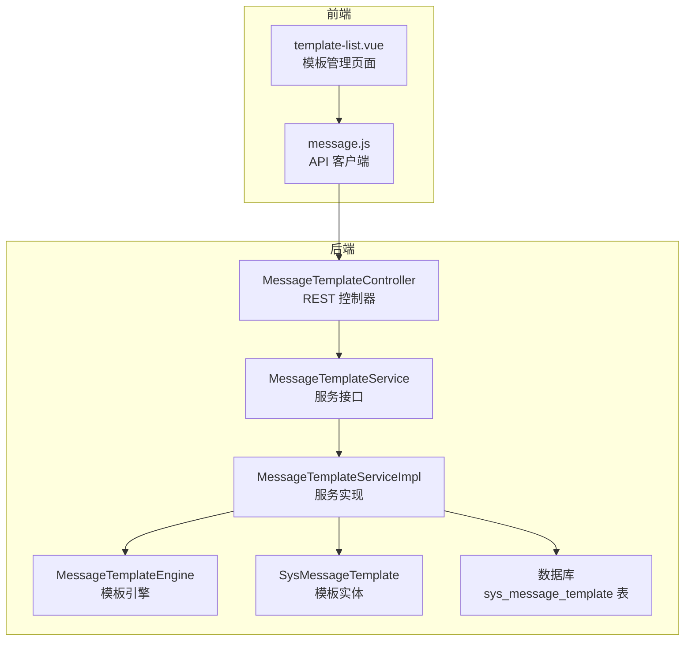
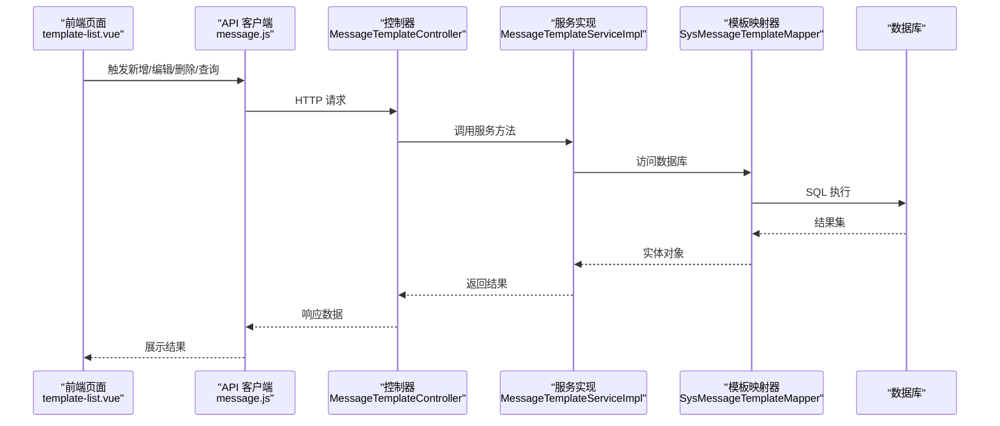
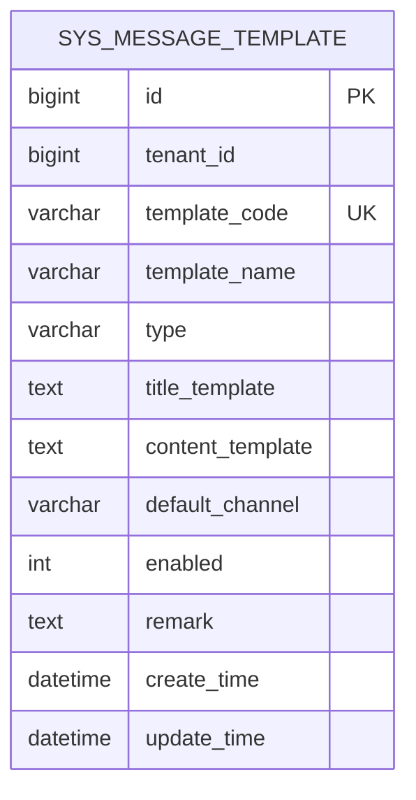
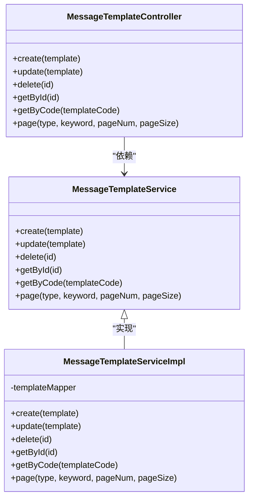
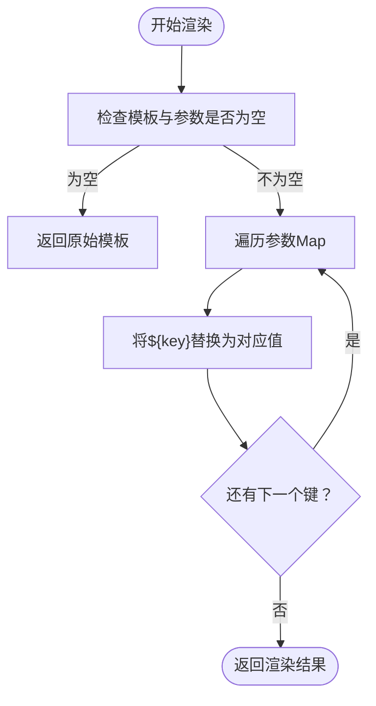
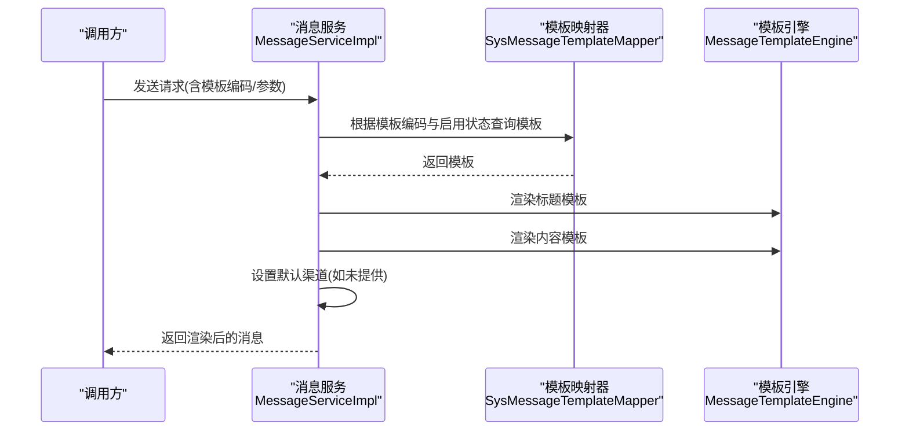
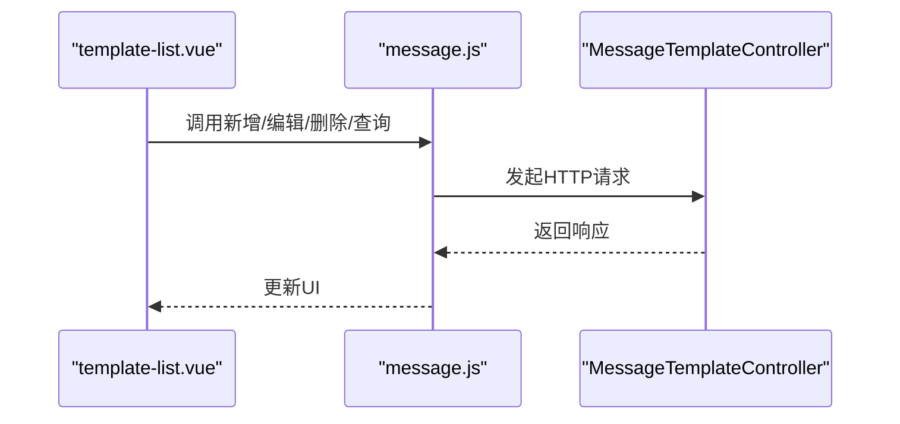
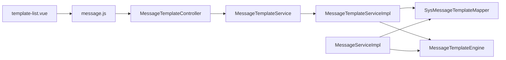

# 消息模板管理

<cite>
**本文引用的文件**
- [SysMessageTemplate.java](file://forge/forge-framework/forge-plugin-parent/forge-plugin-message/src/main/java/com/mdframe/forge/plugin/message/domain/entity/SysMessageTemplate.java)
- [MessageTemplateService.java](file://forge/forge-framework/forge-plugin-parent/forge-plugin-message/src/main/java/com/mdframe/forge/plugin/message/service/MessageTemplateService.java)
- [MessageTemplateServiceImpl.java](file://forge/forge-framework/forge-plugin-parent/forge-plugin-message/src/main/java/com/mdframe/forge/plugin/message/service/impl/MessageTemplateServiceImpl.java)
- [MessageTemplateController.java](file://forge/forge-framework/forge-plugin-parent/forge-plugin-message/src/main/java/com/mdframe/forge/plugin/message/controller/MessageTemplateController.java)
- [MessageTemplateEngine.java](file://forge/forge-framework/forge-starter-parent/forge-starter-message/src/main/java/com/mdframe/forge/starter/message/service/MessageTemplateEngine.java)
- [MessageServiceImpl.java](file://forge/forge-framework/forge-plugin-parent/forge-plugin-message/src/main/java/com/mdframe/forge/plugin/message/service/impl/MessageServiceImpl.java)
- [template-list.vue](file://forge-admin-ui/src/views/message/template-list.vue)
- [message.js](file://forge-admin-ui/src/api/message.js)
- [message_tables.sql](file://forge/forge-framework/forge-plugin-parent/forge-plugin-message/src/main/resources/sql/message_tables.sql)
</cite>

## 目录
1. [简介](#简介)
2. [项目结构](#项目结构)
3. [核心组件](#核心组件)
4. [架构总览](#架构总览)
5. [详细组件分析](#详细组件分析)
6. [依赖关系分析](#依赖关系分析)
7. [性能考虑](#性能考虑)
8. [故障排查指南](#故障排查指南)
9. [结论](#结论)
10. [附录](#附录)

## 简介
本文件面向Forge框架的消息模板管理功能，系统性阐述模板设计理念、存储结构、管理机制与渲染流程。重点覆盖模板语法规范、变量替换机制、模板渲染过程、生命周期管理（创建、编辑、删除、启用/禁用），并提供模板变量定义、占位符使用、条件判断等高级特性说明。同时给出模板验证规则、性能优化策略与最佳实践建议，帮助开发者高效构建与维护消息模板体系。

## 项目结构
消息模板管理涉及后端插件模块与前端管理界面两大层面：
- 后端插件模块（forge-plugin-message）：提供模板实体、服务接口与实现、控制器、以及模板渲染引擎。
- 前端管理界面（forge-admin-ui）：提供模板列表、搜索、编辑、删除等管理能力。
- 数据库脚本（message_tables.sql）：定义模板表结构及索引。

**图表来源**
- [MessageTemplateController.java](file://forge/forge-framework/forge-plugin-parent/forge-plugin-message/src/main/java/com/mdframe/forge/plugin/message/controller/MessageTemplateController.java#L1-L83)
- [MessageTemplateService.java](file://forge/forge-framework/forge-plugin-parent/forge-plugin-message/src/main/java/com/mdframe/forge/plugin/message/service/MessageTemplateService.java#L1-L41)
- [MessageTemplateServiceImpl.java](file://forge/forge-framework/forge-plugin-parent/forge-plugin-message/src/main/java/com/mdframe/forge/plugin/message/service/impl/MessageTemplateServiceImpl.java#L1-L106)
- [MessageTemplateEngine.java](file://forge/forge-framework/forge-starter-parent/forge-starter-message/src/main/java/com/mdframe/forge/starter/message/service/MessageTemplateEngine.java#L1-L23)
- [SysMessageTemplate.java](file://forge/forge-framework/forge-plugin-parent/forge-plugin-message/src/main/java/com/mdframe/forge/plugin/message/domain/entity/SysMessageTemplate.java#L1-L71)
- [template-list.vue](file://forge-admin-ui/src/views/message/template-list.vue#L1-L267)
- [message.js](file://forge-admin-ui/src/api/message.js#L58-L85)

**章节来源**
- [MessageTemplateController.java](file://forge/forge-framework/forge-plugin-parent/forge-plugin-message/src/main/java/com/mdframe/forge/plugin/message/controller/MessageTemplateController.java#L1-L83)
- [MessageTemplateService.java](file://forge/forge-framework/forge-plugin-parent/forge-plugin-message/src/main/java/com/mdframe/forge/plugin/message/service/MessageTemplateService.java#L1-L41)
- [MessageTemplateServiceImpl.java](file://forge/forge-framework/forge-plugin-parent/forge-plugin-message/src/main/java/com/mdframe/forge/plugin/message/service/impl/MessageTemplateServiceImpl.java#L1-L106)
- [MessageTemplateEngine.java](file://forge/forge-framework/forge-starter-parent/forge-starter-message/src/main/java/com/mdframe/forge/starter/message/service/MessageTemplateEngine.java#L1-L23)
- [SysMessageTemplate.java](file://forge/forge-framework/forge-plugin-parent/forge-plugin-message/src/main/java/com/mdframe/forge/plugin/message/domain/entity/SysMessageTemplate.java#L1-L71)
- [template-list.vue](file://forge-admin-ui/src/views/message/template-list.vue#L1-L267)
- [message.js](file://forge-admin-ui/src/api/message.js#L58-L85)

## 核心组件
- 模板实体（SysMessageTemplate）：定义模板的字段结构，包括模板编码、名称、类型、标题/内容模板、默认渠道、启用状态等。
- 模板服务接口与实现（MessageTemplateService/MessageTemplateServiceImpl）：提供模板的增删改查、分页查询、唯一性校验等能力。
- 模板控制器（MessageTemplateController）：暴露REST接口，负责模板的创建、更新、删除、按ID/编码查询、分页查询。
- 模板渲染引擎（MessageTemplateEngine）：提供简单的字符串占位符替换能力，将模板中的${key}替换为参数值。
- 消息服务（MessageServiceImpl）：在发送消息时根据模板编码查找启用的模板，进行标题与内容的渲染，并设置默认渠道。
- 前端管理界面（template-list.vue + message.js）：提供模板列表展示、搜索、编辑、删除等交互能力。

**章节来源**
- [SysMessageTemplate.java](file://forge/forge-framework/forge-plugin-parent/forge-plugin-message/src/main/java/com/mdframe/forge/plugin/message/domain/entity/SysMessageTemplate.java#L1-L71)
- [MessageTemplateService.java](file://forge/forge-framework/forge-plugin-parent/forge-plugin-message/src/main/java/com/mdframe/forge/plugin/message/service/MessageTemplateService.java#L1-L41)
- [MessageTemplateServiceImpl.java](file://forge/forge-framework/forge-plugin-parent/forge-plugin-message/src/main/java/com/mdframe/forge/plugin/message/service/impl/MessageTemplateServiceImpl.java#L1-L106)
- [MessageTemplateController.java](file://forge/forge-framework/forge-plugin-parent/forge-plugin-message/src/main/java/com/mdframe/forge/plugin/message/controller/MessageTemplateController.java#L1-L83)
- [MessageTemplateEngine.java](file://forge/forge-framework/forge-starter-parent/forge-starter-message/src/main/java/com/mdframe/forge/starter/message/service/MessageTemplateEngine.java#L1-L23)
- [MessageServiceImpl.java](file://forge/forge-framework/forge-plugin-parent/forge-plugin-message/src/main/java/com/mdframe/forge/plugin/message/service/impl/MessageServiceImpl.java#L94-L119)
- [template-list.vue](file://forge-admin-ui/src/views/message/template-list.vue#L1-L267)
- [message.js](file://forge-admin-ui/src/api/message.js#L58-L85)

## 架构总览
消息模板管理采用“前后端分离 + 插件化”的架构设计：
- 前端通过API客户端调用后端REST接口，完成模板的增删改查与分页展示。
- 后端通过MyBatis-Plus访问数据库，模板服务实现负责业务逻辑与数据一致性校验。
- 模板渲染引擎独立于业务流程，便于扩展更复杂的模板语法（当前版本为简单占位符替换）。

**图表来源**
- [template-list.vue](file://forge-admin-ui/src/views/message/template-list.vue#L1-L38)
- [message.js](file://forge-admin-ui/src/api/message.js#L58-L85)
- [MessageTemplateController.java](file://forge/forge-framework/forge-plugin-parent/forge-plugin-message/src/main/java/com/mdframe/forge/plugin/message/controller/MessageTemplateController.java#L29-L81)
- [MessageTemplateServiceImpl.java](file://forge/forge-framework/forge-plugin-parent/forge-plugin-message/src/main/java/com/mdframe/forge/plugin/message/service/impl/MessageTemplateServiceImpl.java#L27-L104)

## 详细组件分析

### 模板实体与存储结构
- 表名：sys_message_template
- 关键字段：
  - 模板编码（唯一约束）：用于标识模板，消息发送时通过该编码匹配启用模板。
  - 模板名称：用于展示与检索。
  - 消息类型：SYSTEM/SMS/EMAIL/CUSTOM。
  - 标题模板与内容模板：支持${变量}占位符。
  - 默认发送渠道：WEB/SMS/EMAIL/PUSH。
  - 启用状态：0-禁用/1-启用。
  - 备注说明：可选描述信息。
- 约束与索引：模板编码唯一；按创建时间倒序排序用于分页展示。

**图表来源**
- [SysMessageTemplate.java](file://forge/forge-framework/forge-plugin-parent/forge-plugin-message/src/main/java/com/mdframe/forge/plugin/message/domain/entity/SysMessageTemplate.java#L10-L71)
- [message_tables.sql](file://forge/forge-framework/forge-plugin-parent/forge-plugin-message/src/main/resources/sql/message_tables.sql)

**章节来源**
- [SysMessageTemplate.java](file://forge/forge-framework/forge-plugin-parent/forge-plugin-message/src/main/java/com/mdframe/forge/plugin/message/domain/entity/SysMessageTemplate.java#L1-L71)
- [message_tables.sql](file://forge/forge-framework/forge-plugin-parent/forge-plugin-message/src/main/resources/sql/message_tables.sql)

### 模板服务与控制器
- 服务接口职责：
  - 创建模板：校验模板编码唯一性后持久化。
  - 更新模板：校验模板存在性，若修改编码需确保新编码唯一。
  - 删除模板：按ID删除。
  - 查询：按ID与按编码查询。
  - 分页查询：支持按类型与关键词（模板编码/名称）过滤。
- 控制器暴露REST接口：
  - POST /api/message/template：创建模板
  - PUT /api/message/template：更新模板
  - DELETE /api/message/template/{id}：删除模板
  - GET /api/message/template/{id}：按ID查询
  - GET /api/message/template/code/{templateCode}：按编码查询
  - GET /api/message/template/page：分页查询

**图表来源**
- [MessageTemplateController.java](file://forge/forge-framework/forge-plugin-parent/forge-plugin-message/src/main/java/com/mdframe/forge/plugin/message/controller/MessageTemplateController.java#L1-L83)
- [MessageTemplateService.java](file://forge/forge-framework/forge-plugin-parent/forge-plugin-message/src/main/java/com/mdframe/forge/plugin/message/service/MessageTemplateService.java#L1-L41)
- [MessageTemplateServiceImpl.java](file://forge/forge-framework/forge-plugin-parent/forge-plugin-message/src/main/java/com/mdframe/forge/plugin/message/service/impl/MessageTemplateServiceImpl.java#L1-L106)

**章节来源**
- [MessageTemplateController.java](file://forge/forge-framework/forge-plugin-parent/forge-plugin-message/src/main/java/com/mdframe/forge/plugin/message/controller/MessageTemplateController.java#L1-L83)
- [MessageTemplateService.java](file://forge/forge-framework/forge-plugin-parent/forge-plugin-message/src/main/java/com/mdframe/forge/plugin/message/service/MessageTemplateService.java#L1-L41)
- [MessageTemplateServiceImpl.java](file://forge/forge-framework/forge-plugin-parent/forge-plugin-message/src/main/java/com/mdframe/forge/plugin/message/service/impl/MessageTemplateServiceImpl.java#L27-L104)

### 模板语法规范与变量替换机制
- 占位符格式：${变量名}
- 替换规则：
  - 引擎遍历参数Map，将每个键对应的值替换到模板中。
  - 若参数值为null，则替换为空字符串。
  - 模板或参数为空时直接返回原模板。
- 使用场景：
  - 标题模板与内容模板均支持占位符。
  - 在消息发送前，根据模板编码与启用状态查找模板，对标题与内容进行渲染。

**图表来源**
- [MessageTemplateEngine.java](file://forge/forge-framework/forge-starter-parent/forge-starter-message/src/main/java/com/mdframe/forge/starter/message/service/MessageTemplateEngine.java#L7-L21)

**章节来源**
- [MessageTemplateEngine.java](file://forge/forge-framework/forge-starter-parent/forge-starter-message/src/main/java/com/mdframe/forge/starter/message/service/MessageTemplateEngine.java#L1-L23)
- [MessageServiceImpl.java](file://forge/forge-framework/forge-plugin-parent/forge-plugin-message/src/main/java/com/mdframe/forge/plugin/message/service/impl/MessageServiceImpl.java#L94-L119)

### 模板渲染流程与生命周期管理
- 生命周期：
  - 创建：输入模板编码（唯一）、名称、类型、标题/内容模板、默认渠道、启用状态等，保存至数据库。
  - 编辑：支持修改模板名称、类型、模板内容、默认渠道与启用状态。
  - 启用/禁用：通过修改enabled字段控制模板是否参与消息渲染。
  - 删除：按ID删除模板。
- 渲染流程：
  - 发送消息时，若传入模板编码且模板处于启用状态，则使用模板的标题模板与内容模板进行变量替换。
  - 若未显式提供标题/内容/渠道，则从模板中继承默认值。
  - WEB渠道的消息无需调用第三方通道，直接标记为成功。

**图表来源**
- [MessageServiceImpl.java](file://forge/forge-framework/forge-plugin-parent/forge-plugin-message/src/main/java/com/mdframe/forge/plugin/message/service/impl/MessageServiceImpl.java#L94-L119)
- [MessageTemplateEngine.java](file://forge/forge-framework/forge-starter-parent/forge-starter-message/src/main/java/com/mdframe/forge/starter/message/service/MessageTemplateEngine.java#L7-L21)

**章节来源**
- [MessageServiceImpl.java](file://forge/forge-framework/forge-plugin-parent/forge-plugin-message/src/main/java/com/mdframe/forge/plugin/message/service/impl/MessageServiceImpl.java#L94-L119)
- [MessageTemplateServiceImpl.java](file://forge/forge-framework/forge-plugin-parent/forge-plugin-message/src/main/java/com/mdframe/forge/plugin/message/service/impl/MessageTemplateServiceImpl.java#L27-L62)

### 高级特性与使用示例
- 模板变量定义与占位符使用：
  - 在标题模板与内容模板中使用${变量名}占位符。
  - 参数Map中提供对应键值，渲染时自动替换。
- 条件判断：
  - 当前版本的模板引擎为简单字符串替换，不支持复杂条件判断。
  - 如需条件判断，可在业务侧预处理参数Map或扩展模板引擎以支持表达式语法。
- 渠道选择：
  - 默认渠道可设置为WEB/SMS/EMAIL/PUSH。
  - 若未显式提供渠道，将使用模板的默认渠道。

**章节来源**
- [MessageTemplateEngine.java](file://forge/forge-framework/forge-starter-parent/forge-starter-message/src/main/java/com/mdframe/forge/starter/message/service/MessageTemplateEngine.java#L7-L21)
- [MessageServiceImpl.java](file://forge/forge-framework/forge-plugin-parent/forge-plugin-message/src/main/java/com/mdframe/forge/plugin/message/service/impl/MessageServiceImpl.java#L112-L114)

### 前端管理界面与API对接
- 页面功能：
  - 模板列表展示：支持按消息类型筛选与关键词搜索（模板编码/名称）。
  - 编辑与删除：支持行内操作按钮进行编辑与删除。
  - 表单字段：模板编码（唯一）、模板名称、消息类型、默认渠道、标题模板、内容模板、启用状态、备注说明。
- API对接：
  - 新增模板：POST /api/message/template
  - 更新模板：PUT /api/message/template
  - 删除模板：DELETE /api/message/template/{id}
  - 按ID查询：GET /api/message/template/{id}
  - 按编码查询：GET /api/message/template/code/{templateCode}
  - 分页查询：GET /api/message/template/page

**图表来源**
- [template-list.vue](file://forge-admin-ui/src/views/message/template-list.vue#L1-L38)
- [message.js](file://forge-admin-ui/src/api/message.js#L58-L85)
- [MessageTemplateController.java](file://forge/forge-framework/forge-plugin-parent/forge-plugin-message/src/main/java/com/mdframe/forge/plugin/message/controller/MessageTemplateController.java#L29-L81)

**章节来源**
- [template-list.vue](file://forge-admin-ui/src/views/message/template-list.vue#L1-L267)
- [message.js](file://forge-admin-ui/src/api/message.js#L58-L85)

## 依赖关系分析
- 控制器依赖服务接口，服务实现依赖模板映射器与模板引擎。
- 消息服务在发送流程中依赖模板映射器与模板引擎，用于模板查找与渲染。
- 前端通过API客户端与控制器交互，控制器与服务层解耦，便于扩展与测试。

**图表来源**
- [MessageTemplateController.java](file://forge/forge-framework/forge-plugin-parent/forge-plugin-message/src/main/java/com/mdframe/forge/plugin/message/controller/MessageTemplateController.java#L23-L27)
- [MessageTemplateServiceImpl.java](file://forge/forge-framework/forge-plugin-parent/forge-plugin-message/src/main/java/com/mdframe/forge/plugin/message/service/impl/MessageTemplateServiceImpl.java#L21-L25)
- [MessageTemplateEngine.java](file://forge/forge-framework/forge-starter-parent/forge-starter-message/src/main/java/com/mdframe/forge/starter/message/service/MessageTemplateEngine.java#L5-L22)
- [MessageServiceImpl.java](file://forge/forge-framework/forge-plugin-parent/forge-plugin-message/src/main/java/com/mdframe/forge/plugin/message/service/impl/MessageServiceImpl.java#L42-L68)
- [template-list.vue](file://forge-admin-ui/src/views/message/template-list.vue#L1-L38)
- [message.js](file://forge-admin-ui/src/api/message.js#L58-L85)

**章节来源**
- [MessageTemplateController.java](file://forge/forge-framework/forge-plugin-parent/forge-plugin-message/src/main/java/com/mdframe/forge/plugin/message/controller/MessageTemplateController.java#L1-L83)
- [MessageTemplateServiceImpl.java](file://forge/forge-framework/forge-plugin-parent/forge-plugin-message/src/main/java/com/mdframe/forge/plugin/message/service/impl/MessageTemplateServiceImpl.java#L1-L106)
- [MessageTemplateEngine.java](file://forge/forge-framework/forge-starter-parent/forge-starter-message/src/main/java/com/mdframe/forge/starter/message/service/MessageTemplateEngine.java#L1-L23)
- [MessageServiceImpl.java](file://forge/forge-framework/forge-plugin-parent/forge-plugin-message/src/main/java/com/mdframe/forge/plugin/message/service/impl/MessageServiceImpl.java#L1-L388)
- [template-list.vue](file://forge-admin-ui/src/views/message/template-list.vue#L1-L267)
- [message.js](file://forge-admin-ui/src/api/message.js#L58-L85)

## 性能考虑
- 批量插入优化：在消息接收人记录创建时采用回调分批处理，避免一次性加载大量用户ID导致内存溢出。
- 模板渲染：当前为简单字符串替换，复杂模板建议在业务侧预处理或扩展模板引擎以减少重复计算。
- 查询优化：分页查询支持按类型与关键词过滤，建议在模板编码与名称上建立合适索引以提升检索效率。
- 并发控制：模板编码唯一性校验在事务中执行，避免并发场景下的重复写入。

**章节来源**
- [MessageServiceImpl.java](file://forge/forge-framework/forge-plugin-parent/forge-plugin-message/src/main/java/com/mdframe/forge/plugin/message/service/impl/MessageServiceImpl.java#L142-L176)
- [MessageTemplateServiceImpl.java](file://forge/forge-framework/forge-plugin-parent/forge-plugin-message/src/main/java/com/mdframe/forge/plugin/message/service/impl/MessageTemplateServiceImpl.java#L27-L62)

## 故障排查指南
- 模板编码冲突：
  - 现象：创建/更新模板时报模板编码已存在。
  - 处理：确保模板编码全局唯一；更新时若变更编码需保证新编码未被占用。
- 模板未启用：
  - 现象：发送消息时模板未生效。
  - 处理：确认模板enabled字段为启用状态。
- 渲染结果为空：
  - 现象：标题或内容为空。
  - 处理：检查模板中占位符是否与参数Map键一致；确认参数值非空。
- 渠道异常：
  - 现象：WEB渠道外的消息发送失败。
  - 处理：检查渠道服务配置与第三方通道可用性。

**章节来源**
- [MessageTemplateServiceImpl.java](file://forge/forge-framework/forge-plugin-parent/forge-plugin-message/src/main/java/com/mdframe/forge/plugin/message/service/impl/MessageTemplateServiceImpl.java#L30-L38)
- [MessageTemplateServiceImpl.java](file://forge/forge-framework/forge-plugin-parent/forge-plugin-message/src/main/java/com/mdframe/forge/plugin/message/service/impl/MessageTemplateServiceImpl.java#L48-L59)
- [MessageServiceImpl.java](file://forge/forge-framework/forge-plugin-parent/forge-plugin-message/src/main/java/com/mdframe/forge/plugin/message/service/impl/MessageServiceImpl.java#L106-L114)

## 结论
Forge框架的消息模板管理功能以简洁的占位符语法与清晰的生命周期管理为核心，结合前后端分离的架构实现了高效的模板创建、编辑、删除与启用/禁用。通过模板渲染引擎与消息服务的协作，系统能够在发送阶段自动完成标题与内容的变量替换，并支持默认渠道的继承。建议在实际应用中遵循模板编码唯一性、参数键值一致性与渠道配置正确性的最佳实践，并根据业务需求扩展模板引擎以支持更复杂的语法与条件判断。

## 附录
- 模板验证规则
  - 模板编码必须唯一且不可重复。
  - 标题模板与内容模板支持占位符，参数键需与模板一致。
  - 启用状态为1时模板才参与渲染。
- 最佳实践
  - 统一管理模板变量命名，避免歧义。
  - 在业务侧对模板参数进行校验与预处理。
  - 对高频使用的模板进行缓存以降低渲染开销。
  - 定期清理未启用模板，保持模板库整洁。