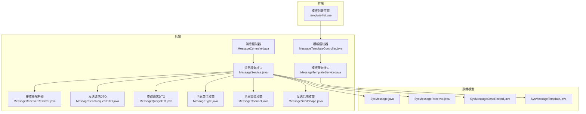
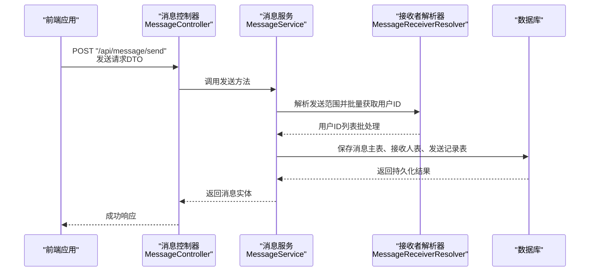
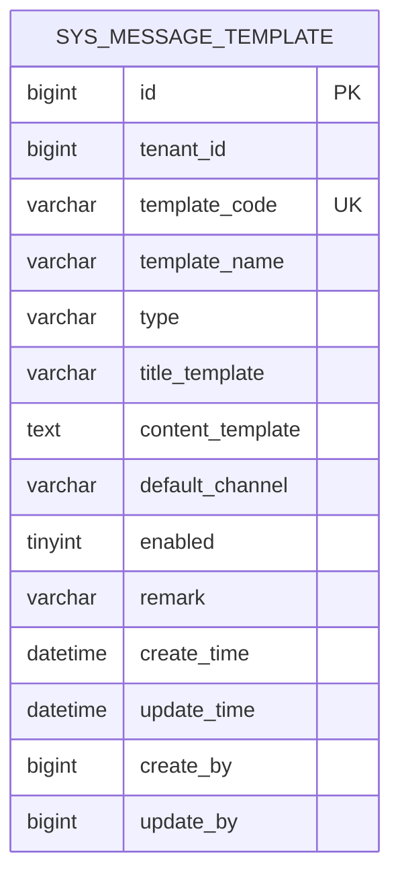
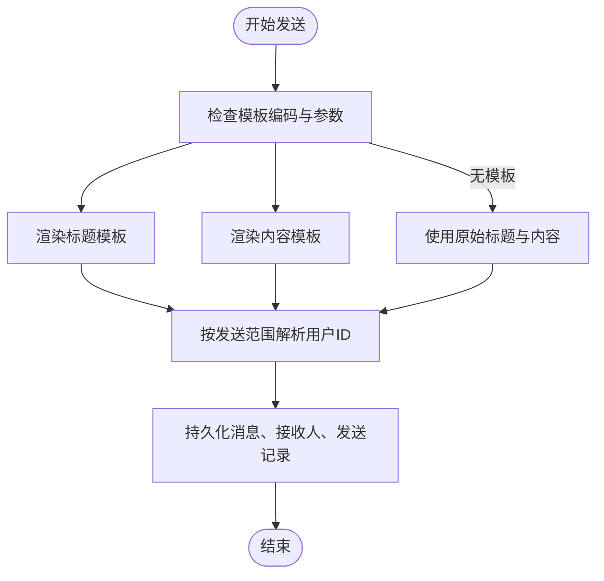
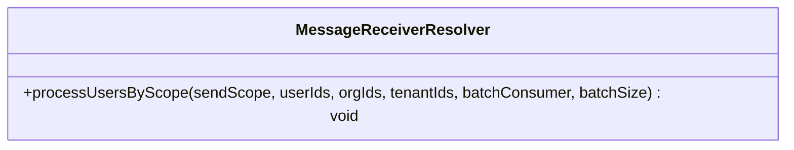
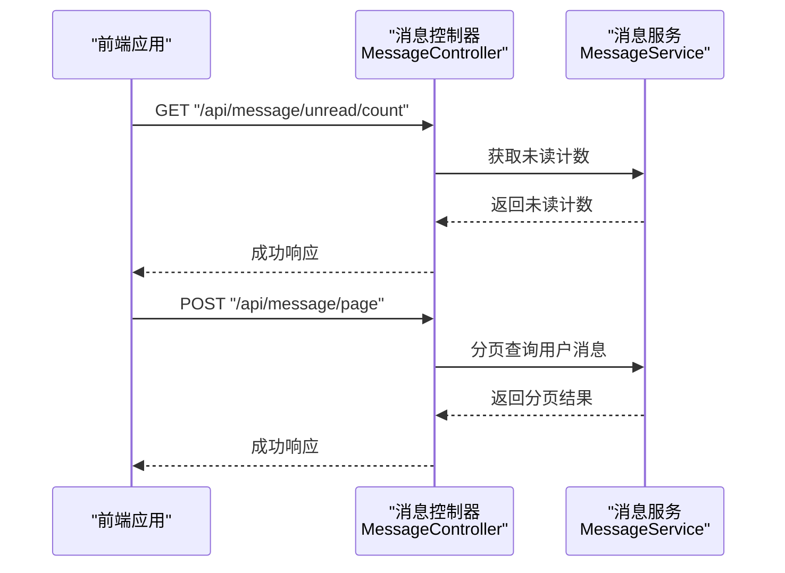
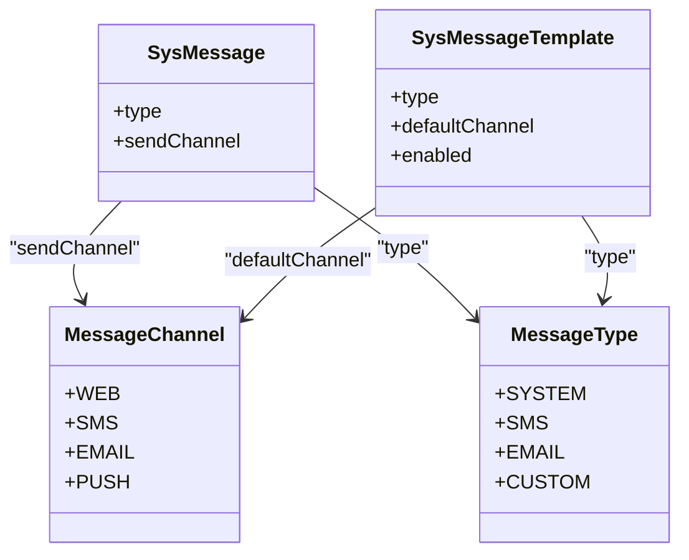
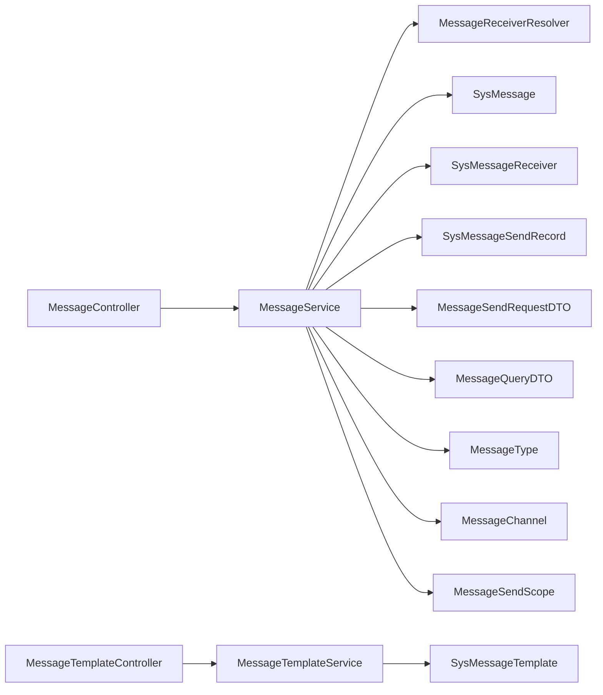

# 消息通知系统

<cite>
**本文档引用的文件**
- [SysMessageTemplate.java](file://forge/forge-framework/forge-plugin-parent/forge-plugin-message/src/main/java/com/mdframe/forge/plugin/message/domain/entity/SysMessageTemplate.java)
- [SysMessage.java](file://forge/forge-framework/forge-plugin-parent/forge-plugin-message/src/main/java/com/mdframe/forge/plugin/message/domain/entity/SysMessage.java)
- [SysMessageReceiver.java](file://forge/forge-framework/forge-plugin-parent/forge-plugin-message/src/main/java/com/mdframe/forge/plugin/message/domain/entity/SysMessageReceiver.java)
- [SysMessageSendRecord.java](file://forge/forge-framework/forge-plugin-parent/forge-plugin-message/src/main/java/com/mdframe/forge/plugin/message/domain/entity/SysMessageSendRecord.java)
- [MessageService.java](file://forge/forge-framework/forge-plugin-parent/forge-plugin-message/src/main/java/com/mdframe/forge/plugin/message/service/MessageService.java)
- [MessageTemplateService.java](file://forge/forge-framework/forge-plugin-parent/forge-plugin-message/src/main/java/com/mdframe/forge/plugin/message/service/MessageTemplateService.java)
- [MessageReceiverResolver.java](file://forge/forge-framework/forge-plugin-parent/forge-plugin-message/src/main/java/com/mdframe/forge/plugin/message/service/MessageReceiverResolver.java)
- [MessageController.java](file://forge/forge-framework/forge-plugin-parent/forge-plugin-message/src/main/java/com/mdframe/forge/plugin/message/controller/MessageController.java)
- [MessageTemplateController.java](file://forge/forge-framework/forge-plugin-parent/forge-plugin-message/src/main/java/com/mdframe/forge/plugin/message/controller/MessageTemplateController.java)
- [MessageSendRequestDTO.java](file://forge/forge-framework/forge-plugin-parent/forge-plugin-message/src/main/java/com/mdframe/forge/plugin/message/domain/dto/MessageSendRequestDTO.java)
- [MessageQueryDTO.java](file://forge/forge-framework/forge-plugin-parent/forge-plugin-message/src/main/java/com/mdframe/forge/plugin/message/domain/dto/MessageQueryDTO.java)
- [MessageType.java](file://forge/forge-framework/forge-plugin-parent/forge-plugin-message/src/main/java/com/mdframe/forge/plugin/message/domain/MessageType.java)
- [MessageChannel.java](file://forge/forge-framework/forge-plugin-parent/forge-plugin-message/src/main/java/com/mdframe/forge/plugin/message/domain/MessageChannel.java)
- [MessageSendScope.java](file://forge/forge-framework/forge-plugin-parent/forge-plugin-message/src/main/java/com/mdframe/forge/plugin/message/domain/MessageSendScope.java)
- [message_tables.sql](file://forge/forge-framework/forge-plugin-parent/forge-plugin-message/src/main/resources/sql/message_tables.sql)
- [template-list.vue](file://forge-admin-ui/src/views/message/template-list.vue)
</cite>

## 目录
1. [简介](#简介)
2. [项目结构](#项目结构)
3. [核心组件](#核心组件)
4. [架构总览](#架构总览)
5. [详细组件分析](#详细组件分析)
6. [依赖关系分析](#依赖关系分析)
7. [性能考虑](#性能考虑)
8. [故障排查指南](#故障排查指南)
9. [结论](#结论)
10. [附录](#附录)

## 简介
本文件面向Forge框架的消息通知系统，提供从模板管理到多渠道发送、接收者解析与消息追踪的完整功能文档。系统支持站内消息、短信、邮件、推送等多种消息类型，并提供模板语法、发送接口、接收者解析策略以及消息统计与追踪能力，帮助开发者快速构建完善的用户通知体系。

## 项目结构
消息通知系统主要由以下层次构成：
- 数据模型层：消息主表、接收人表、发送记录表、模板表
- 业务服务层：消息服务、模板服务、接收者解析器（SPI）
- 控制器层：消息管理接口、模板管理接口
- 前端展示：模板列表页面，展示消息类型与默认渠道映射

图表来源
- [MessageController.java](file://forge/forge-framework/forge-plugin-parent/forge-plugin-message/src/main/java/com/mdframe/forge/plugin/message/controller/MessageController.java#L1-L94)
- [MessageTemplateController.java](file://forge/forge-framework/forge-plugin-parent/forge-plugin-message/src/main/java/com/mdframe/forge/plugin/message/controller/MessageTemplateController.java#L1-L83)
- [MessageService.java](file://forge/forge-framework/forge-plugin-parent/forge-plugin-message/src/main/java/com/mdframe/forge/plugin/message/service/MessageService.java#L1-L51)
- [MessageTemplateService.java](file://forge/forge-framework/forge-plugin-parent/forge-plugin-message/src/main/java/com/mdframe/forge/plugin/message/service/MessageTemplateService.java#L1-L41)
- [MessageReceiverResolver.java](file://forge/forge-framework/forge-plugin-parent/forge-plugin-message/src/main/java/com/mdframe/forge/plugin/message/service/MessageReceiverResolver.java#L1-L33)
- [MessageSendRequestDTO.java](file://forge/forge-framework/forge-plugin-parent/forge-plugin-message/src/main/java/com/mdframe/forge/plugin/message/domain/dto/MessageSendRequestDTO.java#L1-L64)
- [MessageQueryDTO.java](file://forge/forge-framework/forge-plugin-parent/forge-plugin-message/src/main/java/com/mdframe/forge/plugin/message/domain/dto/MessageQueryDTO.java#L1-L36)
- [MessageType.java](file://forge/forge-framework/forge-plugin-parent/forge-plugin-message/src/main/java/com/mdframe/forge/plugin/message/domain/MessageType.java#L1-L39)
- [MessageChannel.java](file://forge/forge-framework/forge-plugin-parent/forge-plugin-message/src/main/java/com/mdframe/forge/plugin/message/domain/MessageChannel.java#L1-L39)
- [MessageSendScope.java](file://forge/forge-framework/forge-plugin-parent/forge-plugin-message/src/main/java/com/mdframe/forge/plugin/message/domain/MessageSendScope.java#L1-L34)
- [SysMessage.java](file://forge/forge-framework/forge-plugin-parent/forge-plugin-message/src/main/java/com/mdframe/forge/plugin/message/domain/entity/SysMessage.java#L1-L76)
- [SysMessageReceiver.java](file://forge/forge-framework/forge-plugin-parent/forge-plugin-message/src/main/java/com/mdframe/forge/plugin/message/domain/entity/SysMessageReceiver.java#L1-L63)
- [SysMessageSendRecord.java](file://forge/forge-framework/forge-plugin-parent/forge-plugin-message/src/main/java/com/mdframe/forge/plugin/message/domain/entity/SysMessageSendRecord.java)
- [SysMessageTemplate.java](file://forge/forge-framework/forge-plugin-parent/forge-plugin-message/src/main/java/com/mdframe/forge/plugin/message/domain/entity/SysMessageTemplate.java#L1-L71)

章节来源
- [MessageController.java](file://forge/forge-framework/forge-plugin-parent/forge-plugin-message/src/main/java/com/mdframe/forge/plugin/message/controller/MessageController.java#L1-L94)
- [MessageTemplateController.java](file://forge/forge-framework/forge-plugin-parent/forge-plugin-message/src/main/java/com/mdframe/forge/plugin/message/controller/MessageTemplateController.java#L1-L83)
- [message_tables.sql](file://forge/forge-framework/forge-plugin-parent/forge-plugin-message/src/main/resources/sql/message_tables.sql#L1-L90)

## 核心组件
- 消息模板管理：支持创建、更新、删除、分页查询；模板包含标题模板与内容模板，支持${变量}占位符渲染；默认渠道与启用状态管理。
- 消息发送：支持按模板编码与参数渲染消息；支持指定接收人、组织、租户的发送范围；支持多种消息类型与发送渠道。
- 接收者解析：通过SPI扩展点，按发送范围批量解析用户ID，支持大范围场景下的批处理与内存友好策略。
- 消息查询与统计：支持按类型、已读状态、关键词、时间范围查询；提供未读计数与消息详情。
- 多渠道支持：站内信、短信、邮件、推送四种渠道，分别对应不同的发送策略与记录追踪。

章节来源
- [SysMessageTemplate.java](file://forge/forge-framework/forge-plugin-parent/forge-plugin-message/src/main/java/com/mdframe/forge/plugin/message/domain/entity/SysMessageTemplate.java#L1-L71)
- [MessageTemplateService.java](file://forge/forge-framework/forge-plugin-parent/forge-plugin-message/src/main/java/com/mdframe/forge/plugin/message/service/MessageTemplateService.java#L1-L41)
- [MessageService.java](file://forge/forge-framework/forge-plugin-parent/forge-plugin-message/src/main/java/com/mdframe/forge/plugin/message/service/MessageService.java#L1-L51)
- [MessageReceiverResolver.java](file://forge/forge-framework/forge-plugin-parent/forge-plugin-message/src/main/java/com/mdframe/forge/plugin/message/service/MessageReceiverResolver.java#L1-L33)
- [MessageSendRequestDTO.java](file://forge/forge-framework/forge-plugin-parent/forge-plugin-message/src/main/java/com/mdframe/forge/plugin/message/domain/dto/MessageSendRequestDTO.java#L1-L64)
- [MessageQueryDTO.java](file://forge/forge-framework/forge-plugin-parent/forge-plugin-message/src/main/java/com/mdframe/forge/plugin/message/domain/dto/MessageQueryDTO.java#L1-L36)
- [MessageType.java](file://forge/forge-framework/forge-plugin-parent/forge-plugin-message/src/main/java/com/mdframe/forge/plugin/message/domain/MessageType.java#L1-L39)
- [MessageChannel.java](file://forge/forge-framework/forge-plugin-parent/forge-plugin-message/src/main/java/com/mdframe/forge/plugin/message/domain/MessageChannel.java#L1-L39)
- [MessageSendScope.java](file://forge/forge-framework/forge-plugin-parent/forge-plugin-message/src/main/java/com/mdframe/forge/plugin/message/domain/MessageSendScope.java#L1-L34)

## 架构总览
消息通知系统采用清晰的分层架构：前端通过REST接口与后端交互，后端控制器负责参数校验与鉴权，服务层负责业务编排与领域模型操作，数据模型层负责持久化与索引优化。

图表来源
- [MessageController.java](file://forge/forge-framework/forge-plugin-parent/forge-plugin-message/src/main/java/com/mdframe/forge/plugin/message/controller/MessageController.java#L36-L39)
- [MessageService.java](file://forge/forge-framework/forge-plugin-parent/forge-plugin-message/src/main/java/com/mdframe/forge/plugin/message/service/MessageService.java#L19-L19)
- [MessageReceiverResolver.java](file://forge/forge-framework/forge-plugin-parent/forge-plugin-message/src/main/java/com/mdframe/forge/plugin/message/service/MessageReceiverResolver.java#L26-L31)
- [SysMessage.java](file://forge/forge-framework/forge-plugin-parent/forge-plugin-message/src/main/java/com/mdframe/forge/plugin/message/domain/entity/SysMessage.java#L1-L76)
- [SysMessageReceiver.java](file://forge/forge-framework/forge-plugin-parent/forge-plugin-message/src/main/java/com/mdframe/forge/plugin/message/domain/entity/SysMessageReceiver.java#L1-L63)
- [SysMessageSendRecord.java](file://forge/forge-framework/forge-plugin-parent/forge-plugin-message/src/main/java/com/mdframe/forge/plugin/message/domain/entity/SysMessageSendRecord.java)

## 详细组件分析

### 消息模板管理
- 模板字段：模板编码（唯一）、模板名称、消息类型、标题模板、内容模板、默认渠道、启用状态、备注、创建/更新时间与操作人。
- 模板语法：标题与内容均支持${变量}占位符，渲染时需提供参数Map。
- 默认渠道：模板可设置默认发送渠道，实际发送时可覆盖。
- 生命周期：支持创建、更新、删除、按条件分页查询。

图表来源
- [SysMessageTemplate.java](file://forge/forge-framework/forge-plugin-parent/forge-plugin-message/src/main/java/com/mdframe/forge/plugin/message/domain/entity/SysMessageTemplate.java#L16-L70)
- [message_tables.sql](file://forge/forge-framework/forge-plugin-parent/forge-plugin-message/src/main/resources/sql/message_tables.sql#L63-L82)

章节来源
- [SysMessageTemplate.java](file://forge/forge-framework/forge-plugin-parent/forge-plugin-message/src/main/java/com/mdframe/forge/plugin/message/domain/entity/SysMessageTemplate.java#L1-L71)
- [MessageTemplateService.java](file://forge/forge-framework/forge-plugin-parent/forge-plugin-message/src/main/java/com/mdframe/forge/plugin/message/service/MessageTemplateService.java#L1-L41)
- [MessageTemplateController.java](file://forge/forge-framework/forge-plugin-parent/forge-plugin-message/src/main/java/com/mdframe/forge/plugin/message/controller/MessageTemplateController.java#L1-L83)
- [message_tables.sql](file://forge/forge-framework/forge-plugin-parent/forge-plugin-message/src/main/resources/sql/message_tables.sql#L84-L89)

### 消息发送流程
- 发送入口：POST "/api/message/send"，请求体为发送请求DTO。
- 渲染逻辑：若提供模板编码与参数，则优先使用模板渲染标题与内容；否则直接使用请求中的标题与内容。
- 接收者解析：根据发送范围（全员/组织/指定人员）与指定ID集合，通过SPI解析器批量获取用户ID。
- 持久化：保存消息主表、接收人表、发送记录表，并记录发送状态与第三方外部ID（如适用）。
- 渠道策略：不同渠道由具体实现负责，系统提供WEB、SMS、EMAIL、PUSH四种渠道枚举。

图表来源
- [MessageSendRequestDTO.java](file://forge/forge-framework/forge-plugin-parent/forge-plugin-message/src/main/java/com/mdframe/forge/plugin/message/domain/dto/MessageSendRequestDTO.java#L12-L63)
- [MessageReceiverResolver.java](file://forge/forge-framework/forge-plugin-parent/forge-plugin-message/src/main/java/com/mdframe/forge/plugin/message/service/MessageReceiverResolver.java#L26-L31)
- [SysMessage.java](file://forge/forge-framework/forge-plugin-parent/forge-plugin-message/src/main/java/com/mdframe/forge/plugin/message/domain/entity/SysMessage.java#L1-L76)
- [SysMessageReceiver.java](file://forge/forge-framework/forge-plugin-parent/forge-plugin-message/src/main/java/com/mdframe/forge/plugin/message/domain/entity/SysMessageReceiver.java#L1-L63)
- [SysMessageSendRecord.java](file://forge/forge-framework/forge-plugin-parent/forge-plugin-message/src/main/java/com/mdframe/forge/plugin/message/domain/entity/SysMessageSendRecord.java)

章节来源
- [MessageController.java](file://forge/forge-framework/forge-plugin-parent/forge-plugin-message/src/main/java/com/mdframe/forge/plugin/message/controller/MessageController.java#L36-L39)
- [MessageService.java](file://forge/forge-framework/forge-plugin-parent/forge-plugin-message/src/main/java/com/mdframe/forge/plugin/message/service/MessageService.java#L19-L19)
- [MessageSendRequestDTO.java](file://forge/forge-framework/forge-plugin-parent/forge-plugin-message/src/main/java/com/mdframe/forge/plugin/message/domain/dto/MessageSendRequestDTO.java#L1-L64)

### 接收者解析策略
- 发送范围：ALL（全员）、ORG（指定组织）、USERS（指定人员）。
- 批处理接口：提供按范围批量处理用户ID的能力，支持回调与批次大小控制，避免内存溢出。
- 扩展点：通过SPI机制允许不同业务场景自定义解析逻辑（如跨租户、跨组织规则）。

图表来源
- [MessageReceiverResolver.java](file://forge/forge-framework/forge-plugin-parent/forge-plugin-message/src/main/java/com/mdframe/forge/plugin/message/service/MessageReceiverResolver.java#L14-L32)

章节来源
- [MessageReceiverResolver.java](file://forge/forge-framework/forge-plugin-parent/forge-plugin-message/src/main/java/com/mdframe/forge/plugin/message/service/MessageReceiverResolver.java#L1-L33)
- [MessageSendScope.java](file://forge/forge-framework/forge-plugin-parent/forge-plugin-message/src/main/java/com/mdframe/forge/plugin/message/domain/MessageSendScope.java#L1-L34)

### 消息查询与统计
- 查询接口：POST "/api/message/page" 支持按类型、已读状态、关键词、时间范围分页查询当前用户消息。
- 统计接口：GET "/api/message/unread/count" 返回未读消息计数。
- 详情接口：GET "/api/message/{messageId}" 返回消息详情（需当前用户为接收人之一）。
- 已读标记：支持单条、批量、全部标记为已读。

图表来源
- [MessageController.java](file://forge/forge-framework/forge-plugin-parent/forge-plugin-message/src/main/java/com/mdframe/forge/plugin/message/controller/MessageController.java#L89-L92)
- [MessageController.java](file://forge/forge-framework/forge-plugin-parent/forge-plugin-message/src/main/java/com/mdframe/forge/plugin/message/controller/MessageController.java#L44-L49)
- [MessageService.java](file://forge/forge-framework/forge-plugin-parent/forge-plugin-message/src/main/java/com/mdframe/forge/plugin/message/service/MessageService.java#L44-L49)

章节来源
- [MessageController.java](file://forge/forge-framework/forge-plugin-parent/forge-plugin-message/src/main/java/com/mdframe/forge/plugin/message/controller/MessageController.java#L1-L94)
- [MessageService.java](file://forge/forge-framework/forge-plugin-parent/forge-plugin-message/src/main/java/com/mdframe/forge/plugin/message/service/MessageService.java#L1-L51)
- [MessageQueryDTO.java](file://forge/forge-framework/forge-plugin-parent/forge-plugin-message/src/main/java/com/mdframe/forge/plugin/message/domain/dto/MessageQueryDTO.java#L1-L36)

### 多渠道发送机制
- 渠道枚举：WEB（站内信）、SMS（短信）、EMAIL（邮件）、PUSH（推送）。
- 默认渠道：模板可设置默认渠道，实际发送时可覆盖。
- 发送记录：每次发送在发送记录表中生成一条记录，包含渠道、成功/失败计数、第三方外部ID与错误信息。

图表来源
- [MessageChannel.java](file://forge/forge-framework/forge-plugin-parent/forge-plugin-message/src/main/java/com/mdframe/forge/plugin/message/domain/MessageChannel.java#L9-L38)
- [MessageType.java](file://forge/forge-framework/forge-plugin-parent/forge-plugin-message/src/main/java/com/mdframe/forge/plugin/message/domain/MessageType.java#L9-L38)
- [SysMessage.java](file://forge/forge-framework/forge-plugin-parent/forge-plugin-message/src/main/java/com/mdframe/forge/plugin/message/domain/entity/SysMessage.java#L38-L48)
- [SysMessageTemplate.java](file://forge/forge-framework/forge-plugin-parent/forge-plugin-message/src/main/java/com/mdframe/forge/plugin/message/domain/entity/SysMessageTemplate.java#L44-L59)

章节来源
- [MessageChannel.java](file://forge/forge-framework/forge-plugin-parent/forge-plugin-message/src/main/java/com/mdframe/forge/plugin/message/domain/MessageChannel.java#L1-L39)
- [MessageType.java](file://forge/forge-framework/forge-plugin-parent/forge-plugin-message/src/main/java/com/mdframe/forge/plugin/message/domain/MessageType.java#L1-L39)
- [SysMessageSendRecord.java](file://forge/forge-framework/forge-plugin-parent/forge-plugin-message/src/main/java/com/mdframe/forge/plugin/message/domain/entity/SysMessageSendRecord.java)

### 前端模板展示
- 模板列表页面展示了模板编码、名称、类型、默认渠道、状态与创建时间等字段。
- 类型映射：SYSTEM（系统消息）、SMS（短信）、EMAIL（邮件）、CUSTOM（自定义）。
- 渠道映射：WEB（站内信）、SMS（短信）、EMAIL（邮件）、PUSH（推送）。

章节来源
- [template-list.vue](file://forge-admin-ui/src/views/message/template-list.vue#L86-L155)

## 依赖关系分析
- 控制器依赖服务接口，服务接口依赖数据模型与SPI解析器。
- 模板服务依赖模板实体；消息服务依赖消息实体、接收人实体、发送记录实体与解析器。
- 枚举类型贯穿于消息类型、渠道与发送范围，确保一致性与可维护性。

图表来源
- [MessageController.java](file://forge/forge-framework/forge-plugin-parent/forge-plugin-message/src/main/java/com/mdframe/forge/plugin/message/controller/MessageController.java#L27-L31)
- [MessageTemplateController.java](file://forge/forge-framework/forge-plugin-parent/forge-plugin-message/src/main/java/com/mdframe/forge/plugin/message/controller/MessageTemplateController.java#L23-L27)
- [MessageService.java](file://forge/forge-framework/forge-plugin-parent/forge-plugin-message/src/main/java/com/mdframe/forge/plugin/message/service/MessageService.java#L14-L14)
- [MessageTemplateService.java](file://forge/forge-framework/forge-plugin-parent/forge-plugin-message/src/main/java/com/mdframe/forge/plugin/message/service/MessageTemplateService.java#L9-L9)
- [MessageReceiverResolver.java](file://forge/forge-framework/forge-plugin-parent/forge-plugin-message/src/main/java/com/mdframe/forge/plugin/message/service/MessageReceiverResolver.java#L14-L14)
- [SysMessageTemplate.java](file://forge/forge-framework/forge-plugin-parent/forge-plugin-message/src/main/java/com/mdframe/forge/plugin/message/domain/entity/SysMessageTemplate.java#L16-L16)
- [SysMessage.java](file://forge/forge-framework/forge-plugin-parent/forge-plugin-message/src/main/java/com/mdframe/forge/plugin/message/domain/entity/SysMessage.java#L14-L14)
- [SysMessageReceiver.java](file://forge/forge-framework/forge-plugin-parent/forge-plugin-message/src/main/java/com/mdframe/forge/plugin/message/domain/entity/SysMessageReceiver.java#L16-L16)
- [SysMessageSendRecord.java](file://forge/forge-framework/forge-plugin-parent/forge-plugin-message/src/main/java/com/mdframe/forge/plugin/message/domain/entity/SysMessageSendRecord.java)
- [MessageSendRequestDTO.java](file://forge/forge-framework/forge-plugin-parent/forge-plugin-message/src/main/java/com/mdframe/forge/plugin/message/domain/dto/MessageSendRequestDTO.java#L12-L12)
- [MessageQueryDTO.java](file://forge/forge-framework/forge-plugin-parent/forge-plugin-message/src/main/java/com/mdframe/forge/plugin/message/domain/dto/MessageQueryDTO.java#L8-L8)
- [MessageType.java](file://forge/forge-framework/forge-plugin-parent/forge-plugin-message/src/main/java/com/mdframe/forge/plugin/message/domain/MessageType.java#L9-L9)
- [MessageChannel.java](file://forge/forge-framework/forge-plugin-parent/forge-plugin-message/src/main/java/com/mdframe/forge/plugin/message/domain/MessageChannel.java#L9-L9)
- [MessageSendScope.java](file://forge/forge-framework/forge-plugin-parent/forge-plugin-message/src/main/java/com/mdframe/forge/plugin/message/domain/MessageSendScope.java#L9-L9)

章节来源
- [MessageController.java](file://forge/forge-framework/forge-plugin-parent/forge-plugin-message/src/main/java/com/mdframe/forge/plugin/message/controller/MessageController.java#L1-L94)
- [MessageTemplateController.java](file://forge/forge-framework/forge-plugin-parent/forge-plugin-message/src/main/java/com/mdframe/forge/plugin/message/controller/MessageTemplateController.java#L1-L83)
- [message_tables.sql](file://forge/forge-framework/forge-plugin-parent/forge-plugin-message/src/main/resources/sql/message_tables.sql#L1-L90)

## 性能考虑
- 批量解析用户ID：通过SPI提供的批处理接口，避免一次性加载大量用户ID导致内存压力。
- 分页查询：消息查询与模板查询均支持分页，降低单次查询负载。
- 索引设计：消息主表按租户+类型、状态、创建时间建立索引；接收人表按用户+已读状态、租户+用户建立索引；发送记录表按消息ID、发送时间建立索引，提升查询效率。
- 渠道解耦：不同渠道的发送逻辑由具体实现承担，系统层仅负责调度与记录，便于横向扩展。

## 故障排查指南
- 发送失败排查：检查发送记录表中的状态与错误信息字段，定位第三方渠道返回的异常；核对模板参数是否正确渲染。
- 接收者为空：确认发送范围与指定ID集合是否正确；检查解析器实现是否按范围正确返回用户ID。
- 查询无数据：确认当前用户是否为目标消息的接收人；检查查询条件（类型、已读状态、时间范围）是否过严。
- 模板未生效：确认模板编码与启用状态；检查模板参数Map是否包含渲染所需变量。

章节来源
- [SysMessageSendRecord.java](file://forge/forge-framework/forge-plugin-parent/forge-plugin-message/src/main/java/com/mdframe/forge/plugin/message/domain/entity/SysMessageSendRecord.java)
- [MessageReceiverResolver.java](file://forge/forge-framework/forge-plugin-parent/forge-plugin-message/src/main/java/com/mdframe/forge/plugin/message/service/MessageReceiverResolver.java#L26-L31)
- [MessageQueryDTO.java](file://forge/forge-framework/forge-plugin-parent/forge-plugin-message/src/main/java/com/mdframe/forge/plugin/message/domain/dto/MessageQueryDTO.java#L1-L36)

## 结论
Forge框架的消息通知系统提供了完整的模板管理、多渠道发送、接收者解析与消息追踪能力。通过清晰的分层设计与SPI扩展点，系统既满足通用场景，又具备良好的可扩展性。建议在生产环境中结合索引优化与批处理策略，确保大规模消息场景下的稳定性与性能。

## 附录

### 数据库表结构概览
- 消息主表：存储消息标题、内容、类型、发送范围、渠道、状态、发送人与模板信息。
- 消息接收人表：存储每条消息的接收人、组织、已读标记与阅读时间。
- 消息发送记录表：存储每次发送的渠道、成功/失败计数、第三方外部ID与错误信息。
- 消息模板表：存储模板编码、名称、类型、标题/内容模板、默认渠道与启用状态。

章节来源
- [message_tables.sql](file://forge/forge-framework/forge-plugin-parent/forge-plugin-message/src/main/resources/sql/message_tables.sql#L3-L89)