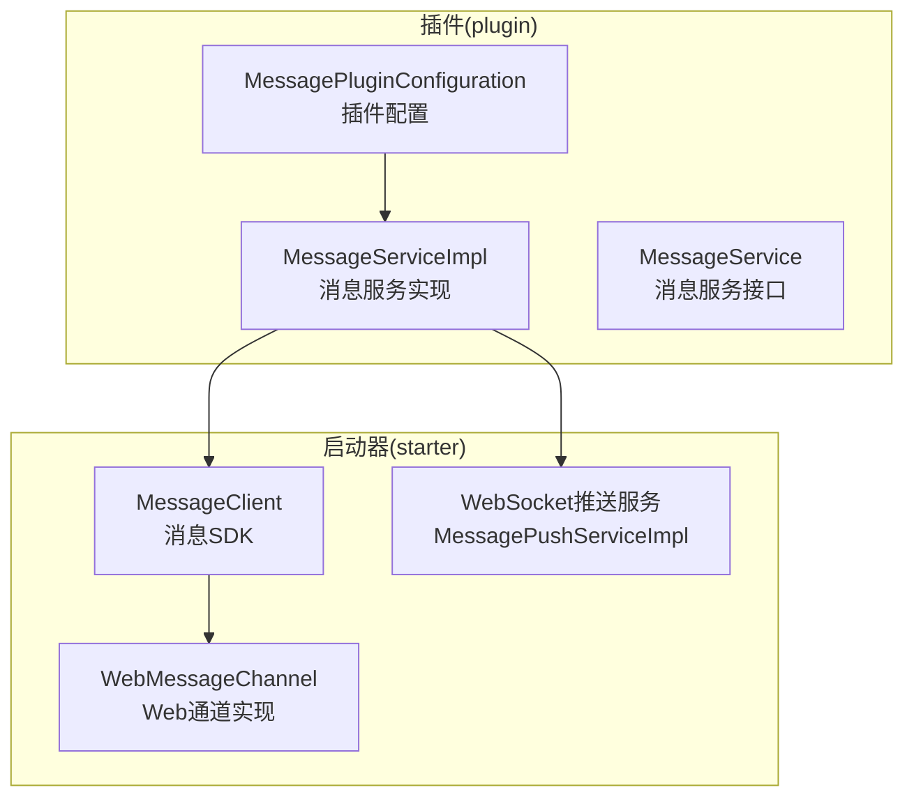
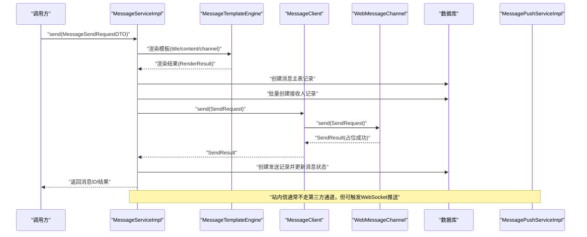
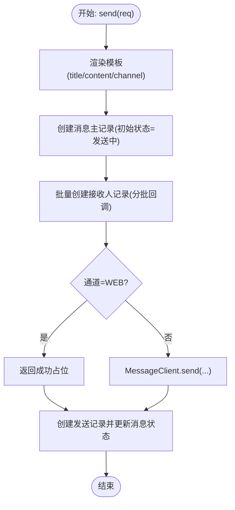
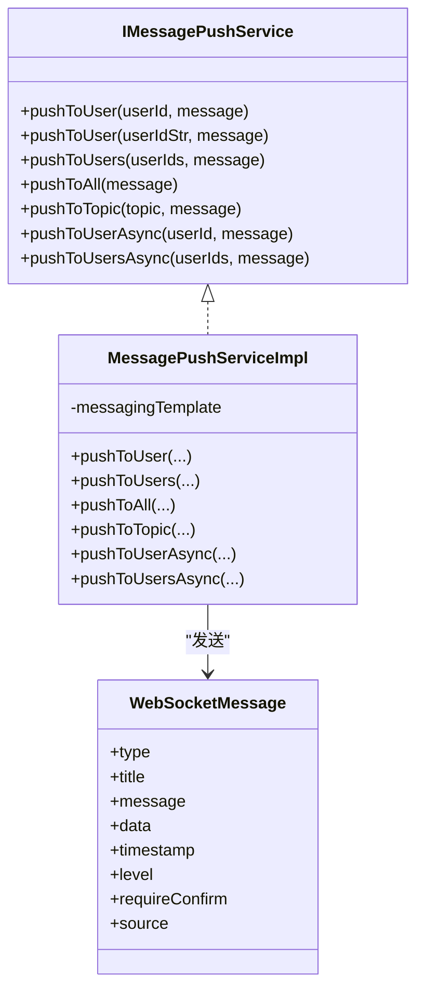
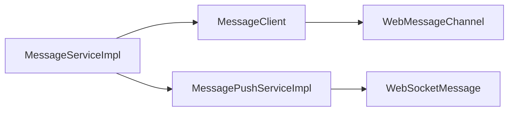

# Web消息通道

<cite>
**本文引用的文件**
- [WebMessageChannel.java](file://forge/forge-framework/forge-starter-parent/forge-starter-message/src/main/java/com/mdframe/forge/starter/message/channel/WebMessageChannel.java)
- [MessageClient.java](file://forge/forge-framework/forge-starter-parent/forge-starter-message/src/main/java/com/mdframe/forge/starter/message/sdk/MessageClient.java)
- [MessagePushServiceImpl.java](file://forge/forge-framework/forge-starter-parent/forge-starter-websocket/src/main/java/com/mdframe/forge/starter/websocket/service/impl/MessagePushServiceImpl.java)
- [IMessagePushService.java](file://forge/forge-framework/forge-starter-parent/forge-starter-websocket/src/main/java/com/mdframe/forge/starter/websocket/service/IMessagePushService.java)
- [WebSocketMessage.java](file://forge/forge-framework/forge-starter-parent/forge-starter-websocket/src/main/java/com/mdframe/forge/starter/websocket/domain/WebSocketMessage.java)
- [MessageServiceImpl.java](file://forge/forge-framework/forge-plugin-parent/forge-plugin-message/src/main/java/com/mdframe/forge/plugin/message/service/impl/MessageServiceImpl.java)
- [MessageService.java](file://forge/forge-framework/forge-plugin-parent/forge-plugin-message/src/main/java/com/mdframe/forge/plugin/message/service/MessageService.java)
- [MessagePluginConfiguration.java](file://forge/forge-framework/forge-plugin-parent/forge-plugin-message/src/main/java/com/mdframe/forge/plugin/message/config/MessagePluginConfiguration.java)
</cite>

## 目录
1. [引言](#引言)
2. [项目结构](#项目结构)
3. [核心组件](#核心组件)
4. [架构总览](#架构总览)
5. [组件详解](#组件详解)
6. [依赖关系分析](#依赖关系分析)
7. [性能考量](#性能考量)
8. [故障排查指南](#故障排查指南)
9. [结论](#结论)
10. [附录](#附录)

## 引言
本文件围绕Forge框架中的“Web消息通道”展开，系统性阐述站内消息通道的实现原理、工作机制与集成路径。重点覆盖以下方面：
- 站内消息的发送流程与落库策略
- 模板渲染与消息分类管理
- 消息状态跟踪与已读处理
- WebSocket推送链路与实时性保障
- 去重与异常处理策略
- 配置参数、性能优化建议与使用示例

## 项目结构
Web消息通道涉及两个层面：
- 启动器层（starter）：定义消息通道抽象、消息SDK与模板引擎接入点
- 插件层（plugin）：实现消息业务逻辑、模板解析、接收人分发与状态管理，并通过消息SDK路由至具体通道

图表来源
- [MessageClient.java](file://forge/forge-framework/forge-starter-parent/forge-starter-message/src/main/java/com/mdframe/forge/starter/message/sdk/MessageClient.java#L1-L56)
- [WebMessageChannel.java](file://forge/forge-framework/forge-starter-parent/forge-starter-message/src/main/java/com/mdframe/forge/starter/message/channel/WebMessageChannel.java#L1-L16)
- [MessagePushServiceImpl.java](file://forge/forge-framework/forge-starter-parent/forge-starter-websocket/src/main/java/com/mdframe/forge/starter/websocket/service/impl/MessagePushServiceImpl.java#L1-L111)
- [MessageServiceImpl.java](file://forge/forge-framework/forge-plugin-parent/forge-plugin-message/src/main/java/com/mdframe/forge/plugin/message/service/impl/MessageServiceImpl.java#L1-L388)
- [MessageService.java](file://forge/forge-framework/forge-plugin-parent/forge-plugin-message/src/main/java/com/mdframe/forge/plugin/message/service/MessageService.java#L1-L51)
- [MessagePluginConfiguration.java](file://forge/forge-framework/forge-plugin-parent/forge-plugin-message/src/main/java/com/mdframe/forge/plugin/message/config/MessagePluginConfiguration.java#L1-L23)

章节来源
- [MessageClient.java](file://forge/forge-framework/forge-starter-parent/forge-starter-message/src/main/java/com/mdframe/forge/starter/message/sdk/MessageClient.java#L1-L56)
- [WebMessageChannel.java](file://forge/forge-framework/forge-starter-parent/forge-starter-message/src/main/java/com/mdframe/forge/starter/message/channel/WebMessageChannel.java#L1-L16)
- [MessagePushServiceImpl.java](file://forge/forge-framework/forge-starter-parent/forge-starter-websocket/src/main/java/com/mdframe/forge/starter/websocket/service/impl/MessagePushServiceImpl.java#L1-L111)
- [MessageServiceImpl.java](file://forge/forge-framework/forge-plugin-parent/forge-plugin-message/src/main/java/com/mdframe/forge/plugin/message/service/impl/MessageServiceImpl.java#L1-L388)
- [MessageService.java](file://forge/forge-framework/forge-plugin-parent/forge-plugin-message/src/main/java/com/mdframe/forge/plugin/message/service/MessageService.java#L1-L51)
- [MessagePluginConfiguration.java](file://forge/forge-framework/forge-plugin-parent/forge-plugin-message/src/main/java/com/mdframe/forge/plugin/message/config/MessagePluginConfiguration.java#L1-L23)

## 核心组件
- WebMessageChannel：Web站内信通道实现，负责将站内消息标记为“已发送”，并返回占位式外部ID，以满足上层发送记录一致性要求。
- MessageClient：消息SDK，负责模板渲染、通道解析与调用，支持多通道配置初始化。
- MessageServiceImpl：消息服务实现，负责模板渲染、消息落库、接收人批量写入、通道发送与发送记录生成。
- MessagePushServiceImpl：WebSocket推送服务实现，提供按用户、按主题、广播等推送能力，并具备异步推送选项。
- WebSocketMessage：WebSocket统一消息载体，包含类型、标题、内容、数据、时间戳、级别、是否需确认、来源等字段。

章节来源
- [WebMessageChannel.java](file://forge/forge-framework/forge-starter-parent/forge-starter-message/src/main/java/com/mdframe/forge/starter/message/channel/WebMessageChannel.java#L1-L16)
- [MessageClient.java](file://forge/forge-framework/forge-starter-parent/forge-starter-message/src/main/java/com/mdframe/forge/starter/message/sdk/MessageClient.java#L1-L56)
- [MessageServiceImpl.java](file://forge/forge-framework/forge-plugin-parent/forge-plugin-message/src/main/java/com/mdframe/forge/plugin/message/service/impl/MessageServiceImpl.java#L1-L388)
- [MessagePushServiceImpl.java](file://forge/forge-framework/forge-starter-parent/forge-starter-websocket/src/main/java/com/mdframe/forge/starter/websocket/service/impl/MessagePushServiceImpl.java#L1-L111)
- [WebSocketMessage.java](file://forge/forge-framework/forge-starter-parent/forge-starter-websocket/src/main/java/com/mdframe/forge/starter/websocket/domain/WebSocketMessage.java#L1-L99)

## 架构总览
下图展示从“消息发送请求”到“站内消息落库与推送”的端到端流程，以及模板渲染与通道选择的关键节点。

图表来源
- [MessageServiceImpl.java](file://forge/forge-framework/forge-plugin-parent/forge-plugin-message/src/main/java/com/mdframe/forge/plugin/message/service/impl/MessageServiceImpl.java#L70-L202)
- [MessageClient.java](file://forge/forge-framework/forge-starter-parent/forge-starter-message/src/main/java/com/mdframe/forge/starter/message/sdk/MessageClient.java#L34-L45)
- [WebMessageChannel.java](file://forge/forge-framework/forge-starter-parent/forge-starter-message/src/main/java/com/mdframe/forge/starter/message/channel/WebMessageChannel.java#L11-L14)
- [MessagePushServiceImpl.java](file://forge/forge-framework/forge-starter-parent/forge-starter-websocket/src/main/java/com/mdframe/forge/starter/websocket/service/impl/MessagePushServiceImpl.java#L26-L97)

## 组件详解

### WebMessageChannel：站内消息通道
- 关键职责
  - 提供通道标识“web”
  - 初始化：当前为空操作
  - 发送：对Web站内信直接返回成功占位结果，确保发送记录与状态流转一致
- 设计要点
  - 将“站内信”与“第三方通道”解耦，避免重复推送与状态错配
  - 返回的外部ID具有唯一性前缀，便于后续追踪与审计

章节来源
- [WebMessageChannel.java](file://forge/forge-framework/forge-starter-parent/forge-starter-message/src/main/java/com/mdframe/forge/starter/message/channel/WebMessageChannel.java#L5-L15)

### MessageClient：消息SDK与通道调度
- 关键职责
  - 模板渲染：当请求携带模板与参数时，先进行内容渲染
  - 通道解析：依据请求或默认通道解析对应通道Bean
  - 调用执行：将请求转发至具体通道实现
- 初始化行为
  - 读取全局通道配置，按Bean名“xxxMessageChannel”初始化各通道
- 容错策略
  - 通道不可用时返回失败结果，避免静默失败

章节来源
- [MessageClient.java](file://forge/forge-framework/forge-starter-parent/forge-starter-message/src/main/java/com/mdframe/forge/starter/message/sdk/MessageClient.java#L10-L55)

### MessageServiceImpl：消息服务实现
- 发送流程
  - 模板渲染：优先使用模板代码渲染标题/内容/默认通道
  - 创建消息主记录：设置初始状态为“发送中”
  - 批量创建接收人记录：采用回调分批写入，避免内存压力
  - 通道发送：Web站内信直接返回成功；其他通道通过MessageClient调用
  - 创建发送记录并更新消息状态：成功/失败分别映射不同状态码
- 已读处理
  - 单条、批量、全部标记已读，均基于接收人表更新状态与时间
- 分页与统计
  - 支持按用户分页查询消息列表，统计未读数量并按类型聚合

图表来源
- [MessageServiceImpl.java](file://forge/forge-framework/forge-plugin-parent/forge-plugin-message/src/main/java/com/mdframe/forge/plugin/message/service/impl/MessageServiceImpl.java#L70-L225)

章节来源
- [MessageServiceImpl.java](file://forge/forge-framework/forge-plugin-parent/forge-plugin-message/src/main/java/com/mdframe/forge/plugin/message/service/impl/MessageServiceImpl.java#L70-L388)

### WebSocket推送：MessagePushServiceImpl
- 能力矩阵
  - 按用户推送：支持Long/String两种userId
  - 多用户推送：遍历逐个推送
  - 广播推送：向/topic/broadcast广播
  - 主题推送：向/topic/{topic}推送
  - 异步推送：标注@Async，降低同步阻塞
- 实时性保障
  - 使用Spring Messaging的SimpMessagingTemplate进行消息投递
  - 自动补全时间戳，确保前端排序与展示一致性
- 错误处理
  - 包裹try-catch，记录错误日志，避免异常传播影响主流程

图表来源
- [IMessagePushService.java](file://forge/forge-framework/forge-starter-parent/forge-starter-websocket/src/main/java/com/mdframe/forge/starter/websocket/service/IMessagePushService.java#L1-L67)
- [MessagePushServiceImpl.java](file://forge/forge-framework/forge-starter-parent/forge-starter-websocket/src/main/java/com/mdframe/forge/starter/websocket/service/impl/MessagePushServiceImpl.java#L19-L111)
- [WebSocketMessage.java](file://forge/forge-framework/forge-starter-parent/forge-starter-websocket/src/main/java/com/mdframe/forge/starter/websocket/domain/WebSocketMessage.java#L17-L98)

章节来源
- [IMessagePushService.java](file://forge/forge-framework/forge-starter-parent/forge-starter-websocket/src/main/java/com/mdframe/forge/starter/websocket/service/IMessagePushService.java#L1-L67)
- [MessagePushServiceImpl.java](file://forge/forge-framework/forge-starter-parent/forge-starter-websocket/src/main/java/com/mdframe/forge/starter/websocket/service/impl/MessagePushServiceImpl.java#L1-L111)
- [WebSocketMessage.java](file://forge/forge-framework/forge-starter-parent/forge-starter-websocket/src/main/java/com/mdframe/forge/starter/websocket/domain/WebSocketMessage.java#L1-L99)

### 消息模板与分类管理
- 模板渲染
  - 当请求携带模板代码时，优先从模板表加载启用模板，按参数渲染标题与内容，并可回填默认通道
- 消息分类
  - 类型字段用于前端分类与统计，如系统通知、短信、邮件等
- 模板参数
  - 通过MessageTemplateEngine进行变量替换，支持复杂动态内容

章节来源
- [MessageServiceImpl.java](file://forge/forge-framework/forge-plugin-parent/forge-plugin-message/src/main/java/com/mdframe/forge/plugin/message/service/impl/MessageServiceImpl.java#L94-L119)
- [WebSocketMessage.java](file://forge/forge-framework/forge-starter-parent/forge-starter-websocket/src/main/java/com/mdframe/forge/starter/websocket/domain/WebSocketMessage.java#L22-L58)

### 消息状态跟踪与已读处理
- 状态流转
  - 初始：发送中；成功后置为已发送；失败置为发送失败
  - 发送记录包含成功/失败计数、外部ID与错误信息
- 已读标记
  - 单条、批量、全部标记，均写入接收人表的已读标志与时间
- 未读统计
  - 按用户统计总数及按类型细分（如SYSTEM/SMS/EMAIL）

章节来源
- [MessageServiceImpl.java](file://forge/forge-framework/forge-plugin-parent/forge-plugin-message/src/main/java/com/mdframe/forge/plugin/message/service/impl/MessageServiceImpl.java#L207-L225)
- [MessageServiceImpl.java](file://forge/forge-framework/forge-plugin-parent/forge-plugin-message/src/main/java/com/mdframe/forge/plugin/message/service/impl/MessageServiceImpl.java#L242-L294)
- [MessageServiceImpl.java](file://forge/forge-framework/forge-plugin-parent/forge-plugin-message/src/main/java/com/mdframe/forge/plugin/message/service/impl/MessageServiceImpl.java#L334-L362)

## 依赖关系分析
- 插件层依赖启动器层的MessageClient与通道抽象，实现“模板渲染+通道调度”的统一入口
- 启动器层的WebMessageChannel作为内置通道之一，负责站内信的占位式发送
- WebSocket推送服务独立于消息通道，通过消息服务在需要时触发推送

图表来源
- [MessageServiceImpl.java](file://forge/forge-framework/forge-plugin-parent/forge-plugin-message/src/main/java/com/mdframe/forge/plugin/message/service/impl/MessageServiceImpl.java#L47-L67)
- [MessageClient.java](file://forge/forge-framework/forge-starter-parent/forge-starter-message/src/main/java/com/mdframe/forge/starter/message/sdk/MessageClient.java#L18-L32)
- [WebMessageChannel.java](file://forge/forge-framework/forge-starter-parent/forge-starter-message/src/main/java/com/mdframe/forge/starter/message/channel/WebMessageChannel.java#L5-L15)
- [MessagePushServiceImpl.java](file://forge/forge-framework/forge-starter-parent/forge-starter-websocket/src/main/java/com/mdframe/forge/starter/websocket/service/impl/MessagePushServiceImpl.java#L21-L21)
- [WebSocketMessage.java](file://forge/forge-framework/forge-starter-parent/forge-starter-websocket/src/main/java/com/mdframe/forge/starter/websocket/domain/WebSocketMessage.java#L17-L43)

章节来源
- [MessageServiceImpl.java](file://forge/forge-framework/forge-plugin-parent/forge-plugin-message/src/main/java/com/mdframe/forge/plugin/message/service/impl/MessageServiceImpl.java#L1-L388)
- [MessageClient.java](file://forge/forge-framework/forge-starter-parent/forge-starter-message/src/main/java/com/mdframe/forge/starter/message/sdk/MessageClient.java#L1-L56)
- [WebMessageChannel.java](file://forge/forge-framework/forge-starter-parent/forge-starter-message/src/main/java/com/mdframe/forge/starter/message/channel/WebMessageChannel.java#L1-L16)
- [MessagePushServiceImpl.java](file://forge/forge-framework/forge-starter-parent/forge-starter-websocket/src/main/java/com/mdframe/forge/starter/websocket/service/impl/MessagePushServiceImpl.java#L1-L111)
- [WebSocketMessage.java](file://forge/forge-framework/forge-starter-parent/forge-starter-websocket/src/main/java/com/mdframe/forge/starter/websocket/domain/WebSocketMessage.java#L1-L99)

## 性能考量
- 批量写入优化
  - 接收人记录采用回调分批写入，批次大小固定，避免一次性加载导致内存压力
- 异步推送
  - 提供异步推送接口，降低同步阻塞，提升高并发场景下的响应性
- 模板渲染
  - 仅在需要时进行模板渲染，减少不必要的计算开销
- 数据库索引与查询
  - 按用户分页查询与未读统计建议在接收人表建立合理索引（如用户ID、已读标志、创建时间）
- WebSocket推送
  - 广播与主题推送建议结合前端订阅粒度，避免过度推送造成带宽与CPU压力

章节来源
- [MessageServiceImpl.java](file://forge/forge-framework/forge-plugin-parent/forge-plugin-message/src/main/java/com/mdframe/forge/plugin/message/service/impl/MessageServiceImpl.java#L142-L176)
- [MessagePushServiceImpl.java](file://forge/forge-framework/forge-starter-parent/forge-starter-websocket/src/main/java/com/mdframe/forge/starter/websocket/service/impl/MessagePushServiceImpl.java#L99-L110)

## 故障排查指南
- 通道不可用
  - 现象：发送返回失败
  - 排查：确认通道Bean命名规范“xxxMessageChannel”，以及MessageClient初始化配置
- 模板渲染异常
  - 现象：标题/内容为空或渲染报错
  - 排查：检查模板代码是否启用、参数是否完整、模板引擎可用
- 推送失败
  - 现象：日志出现推送失败错误
  - 排查：检查WebSocket服务是否正常、目标用户是否在线、目的地是否正确
- 已读状态不更新
  - 现象：前端显示未读
  - 排查：确认调用的是单条/批量/全部标记接口，核对接收人记录是否存在且未读标志更新

章节来源
- [MessageClient.java](file://forge/forge-framework/forge-starter-parent/forge-starter-message/src/main/java/com/mdframe/forge/starter/message/sdk/MessageClient.java#L41-L44)
- [MessagePushServiceImpl.java](file://forge/forge-framework/forge-starter-parent/forge-starter-websocket/src/main/java/com/mdframe/forge/starter/websocket/service/impl/MessagePushServiceImpl.java#L47-L49)
- [MessageServiceImpl.java](file://forge/forge-framework/forge-plugin-parent/forge-plugin-message/src/main/java/com/mdframe/forge/plugin/message/service/impl/MessageServiceImpl.java#L242-L294)

## 结论
Forge的Web消息通道通过“模板渲染—消息落库—通道调度—状态跟踪”的闭环设计，实现了站内消息的高效、可靠与可扩展。WebMessageChannel以占位式成功返回确保状态一致性，MessageClient承担通道解析与模板渲染，MessageServiceImpl完成业务编排与数据持久化，MessagePushServiceImpl提供灵活的实时推送能力。整体架构清晰、职责分离，便于横向扩展新的消息通道与推送方式。

## 附录

### 配置参数与使用示例
- 通道配置
  - 在启动器层通过MessageProperties注册通道，MessageClient会按“xxxMessageChannel”自动初始化
- 模板参数
  - 通过MessageSendRequestDTO传入模板代码与参数，服务端按模板渲染标题/内容/默认通道
- 发送示例
  - 调用MessageService.send，传入消息类型、发送范围、模板代码与参数，即可完成站内信发送与落库
- 推送示例
  - 若需要实时推送，可在业务侧调用MessagePushServiceImpl进行按用户/主题/广播推送

章节来源
- [MessageClient.java](file://forge/forge-framework/forge-starter-parent/forge-starter-message/src/main/java/com/mdframe/forge/starter/message/sdk/MessageClient.java#L24-L32)
- [MessageServiceImpl.java](file://forge/forge-framework/forge-plugin-parent/forge-plugin-message/src/main/java/com/mdframe/forge/plugin/message/service/impl/MessageServiceImpl.java#L70-L89)
- [MessagePushServiceImpl.java](file://forge/forge-framework/forge-starter-parent/forge-starter-websocket/src/main/java/com/mdframe/forge/starter/websocket/service/impl/MessagePushServiceImpl.java#L26-L97)