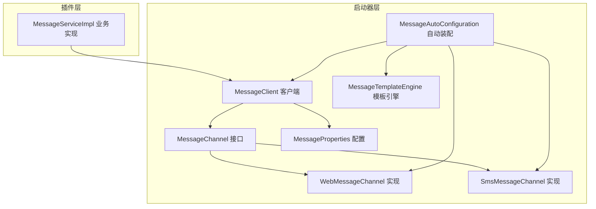
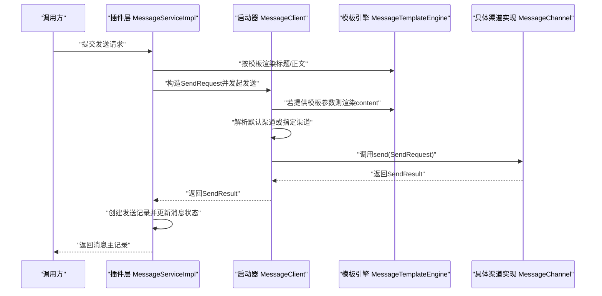
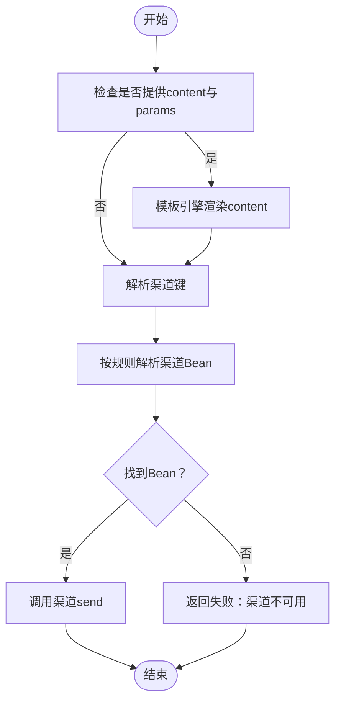
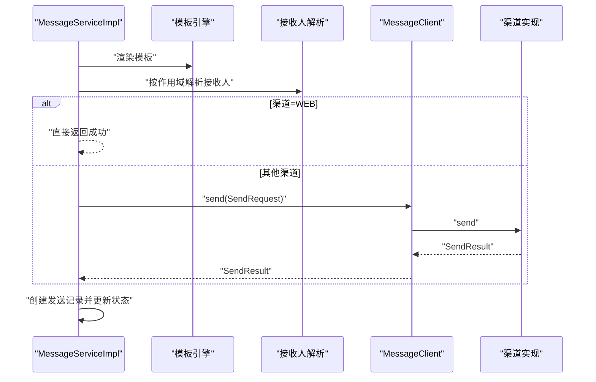
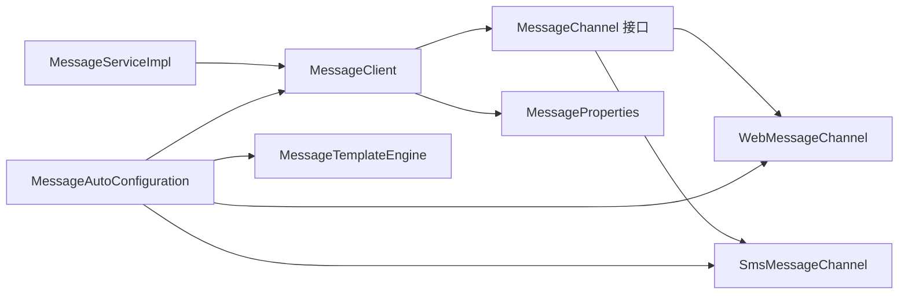

# 消息通道接口规范

<cite>
**本文引用的文件**
- [MessageChannel.java](file://forge/forge-framework/forge-starter-parent/forge-starter-message/src/main/java/com/mdframe/forge/starter/message/channel/MessageChannel.java)
- [WebMessageChannel.java](file://forge/forge-framework/forge-starter-parent/forge-starter-message/src/main/java/com/mdframe/forge/starter/message/channel/WebMessageChannel.java)
- [SmsMessageChannel.java](file://forge/forge-framework/forge-starter-parent/forge-starter-message/src/main/java/com/mdframe/forge/starter/message/channel/SmsMessageChannel.java)
- [MessageClient.java](file://forge/forge-framework/forge-starter-parent/forge-starter-message/src/main/java/com/mdframe/forge/starter/message/sdk/MessageClient.java)
- [MessageProperties.java](file://forge/forge-framework/forge-starter-parent/forge-starter-message/src/main/java/com/mdframe/forge/starter/message/config/MessageProperties.java)
- [MessageAutoConfiguration.java](file://forge/forge-framework/forge-starter-parent/forge-starter-message/src/main/java/com/mdframe/forge/starter/message/config/MessageAutoConfiguration.java)
- [MessageTemplateEngine.java](file://forge/forge-framework/forge-starter-parent/forge-starter-message/src/main/java/com/mdframe/forge/starter/message/service/MessageTemplateEngine.java)
- [MessageChannel 枚举（插件层）.java](file://forge/forge-framework/forge-plugin-parent/forge-plugin-message/src/main/java/com/mdframe/forge/plugin/message/domain/MessageChannel.java)
- [MessageServiceImpl.java](file://forge/forge-framework/forge-plugin-parent/forge-plugin-message/src/main/java/com/mdframe/forge/plugin/message/service/impl/MessageServiceImpl.java)
</cite>

## 目录
1. [引言](#引言)
2. [项目结构](#项目结构)
3. [核心组件](#核心组件)
4. [架构总览](#架构总览)
5. [详细组件分析](#详细组件分析)
6. [依赖关系分析](#依赖关系分析)
7. [性能考量](#性能考量)
8. [故障排查指南](#故障排查指南)
9. [结论](#结论)
10. [附录](#附录)

## 引言
本文件面向Forge框架的消息通道接口规范，系统化阐述MessageChannel接口的设计理念与标准化规范，明确接口方法的语义、参数与返回值约定、异常处理策略，并对SendRequest与SendResult进行结构化说明与扩展性设计建议。同时提供接口实现最佳实践、性能优化建议、兼容性策略以及新通道类型的接入指南与版本管理建议。

## 项目结构
消息通道能力主要分布在“启动器”与“插件”两个层次：
- 启动器层（starter）：定义通用接口、默认实现、客户端封装、自动装配与配置属性。
- 插件层（plugin）：提供业务侧消息服务实现，负责模板渲染、接收人解析与发送记录维护。

图表来源
- [MessageChannel.java](file://forge/forge-framework/forge-starter-parent/forge-starter-message/src/main/java/com/mdframe/forge/starter/message/channel/MessageChannel.java#L1-L41)
- [WebMessageChannel.java](file://forge/forge-framework/forge-starter-parent/forge-starter-message/src/main/java/com/mdframe/forge/starter/message/channel/WebMessageChannel.java#L1-L16)
- [SmsMessageChannel.java](file://forge/forge-framework/forge-starter-parent/forge-starter-message/src/main/java/com/mdframe/forge/starter/message/channel/SmsMessageChannel.java#L1-L16)
- [MessageClient.java](file://forge/forge-framework/forge-starter-parent/forge-starter-message/src/main/java/com/mdframe/forge/starter/message/sdk/MessageClient.java#L1-L56)
- [MessageProperties.java](file://forge/forge-framework/forge-starter-parent/forge-starter-message/src/main/java/com/mdframe/forge/starter/message/config/MessageProperties.java#L1-L34)
- [MessageAutoConfiguration.java](file://forge/forge-framework/forge-starter-parent/forge-starter-message/src/main/java/com/mdframe/forge/starter/message/config/MessageAutoConfiguration.java#L1-L47)
- [MessageTemplateEngine.java](file://forge/forge-framework/forge-starter-parent/forge-starter-message/src/main/java/com/mdframe/forge/starter/message/service/MessageTemplateEngine.java#L1-L22)
- [MessageServiceImpl.java](file://forge/forge-framework/forge-plugin-parent/forge-plugin-message/src/main/java/com/mdframe/forge/plugin/message/service/impl/MessageServiceImpl.java#L1-L388)

章节来源
- [MessageChannel.java](file://forge/forge-framework/forge-starter-parent/forge-starter-message/src/main/java/com/mdframe/forge/starter/message/channel/MessageChannel.java#L1-L41)
- [MessageAutoConfiguration.java](file://forge/forge-framework/forge-starter-parent/forge-starter-message/src/main/java/com/mdframe/forge/starter/message/config/MessageAutoConfiguration.java#L1-L47)

## 核心组件
- MessageChannel 接口：定义渠道标识、初始化与发送三类能力，统一抽象不同消息通道的实现差异。
- SendRequest 请求参数：承载标题、正文、模板编码、参数、目标受众集合、指定渠道与消息类型等。
- SendResult 结果对象：统一返回发送是否成功、错误信息与第三方外部ID，提供便捷工厂方法。
- MessageClient 客户端：负责模板渲染、渠道解析与转发调用。
- MessageProperties 配置：提供默认渠道与各渠道开关及配置映射。
- MessageAutoConfiguration 自动装配：注册默认模板引擎、渠道Bean与MessageClient。
- MessageTemplateEngine 模板引擎：提供简单占位符替换能力。
- 插件层 MessageServiceImpl：负责模板渲染、消息记录、接收人批量写入、渠道发送与发送记录落库。

章节来源
- [MessageChannel.java](file://forge/forge-framework/forge-starter-parent/forge-starter-message/src/main/java/com/mdframe/forge/starter/message/channel/MessageChannel.java#L1-L41)
- [MessageClient.java](file://forge/forge-framework/forge-starter-parent/forge-starter-message/src/main/java/com/mdframe/forge/starter/message/sdk/MessageClient.java#L1-L56)
- [MessageProperties.java](file://forge/forge-framework/forge-starter-parent/forge-starter-message/src/main/java/com/mdframe/forge/starter/message/config/MessageProperties.java#L1-L34)
- [MessageAutoConfiguration.java](file://forge/forge-framework/forge-starter-parent/forge-starter-message/src/main/java/com/mdframe/forge/starter/message/config/MessageAutoConfiguration.java#L1-L47)
- [MessageTemplateEngine.java](file://forge/forge-framework/forge-starter-parent/forge-starter-message/src/main/java/com/mdframe/forge/starter/message/service/MessageTemplateEngine.java#L1-L22)
- [MessageServiceImpl.java](file://forge/forge-framework/forge-plugin-parent/forge-plugin-message/src/main/java/com/mdframe/forge/plugin/message/service/impl/MessageServiceImpl.java#L1-L388)

## 架构总览
消息从上层请求到多渠道分发的整体流程如下：

图表来源
- [MessageServiceImpl.java](file://forge/forge-framework/forge-plugin-parent/forge-plugin-message/src/main/java/com/mdframe/forge/plugin/message/service/impl/MessageServiceImpl.java#L70-L89)
- [MessageClient.java](file://forge/forge-framework/forge-starter-parent/forge-starter-message/src/main/java/com/mdframe/forge/starter/message/sdk/MessageClient.java#L34-L45)
- [MessageTemplateEngine.java](file://forge/forge-framework/forge-starter-parent/forge-starter-message/src/main/java/com/mdframe/forge/starter/message/service/MessageTemplateEngine.java#L10-L21)
- [MessageChannel.java](file://forge/forge-framework/forge-starter-parent/forge-starter-message/src/main/java/com/mdframe/forge/starter/message/channel/MessageChannel.java#L22-L40)

## 详细组件分析

### MessageChannel 接口与语义规范
- key(): 返回渠道唯一标识字符串，如“web”、“sms”。该值用于配置解析与Bean命名约定。
- init(Map<String,String> config): 初始化渠道配置，支持按需注入凭证、网关地址等。
- send(SendRequest request): 执行发送逻辑，返回SendResult。

SendRequest 字段语义
- title: 消息标题
- content: 消息正文
- templateCode: 模板编码（可选）
- params: 模板渲染参数（可选）
- userIds/orgIds/tenantIds: 目标受众集合（可选）。注意：插件层在非WEB渠道发送时不会直接透传userIds，以避免大列表带来的性能与安全问题。
- channel: 指定渠道键（可选），优先级高于默认渠道
- type: 消息类型（如SYSTEM、SMS、EMAIL等）

SendResult 字段语义
- success: 是否发送成功
- msg: 失败原因或补充信息
- externalId: 第三方返回的外部ID（便于对账与追踪）

工厂方法
- ok(id): 快速构造成功结果
- fail(m): 快速构造失败结果

章节来源
- [MessageChannel.java](file://forge/forge-framework/forge-starter-parent/forge-starter-message/src/main/java/com/mdframe/forge/starter/message/channel/MessageChannel.java#L5-L40)

### SendRequest 参数规范与扩展性
- 基础字段：title、content、templateCode、params
- 受众集合：userIds、orgIds、tenantIds。插件层在非WEB渠道发送时会基于messageId回查接收人，避免直接透传大量用户ID。
- 渠道与类型：channel、type。channel可覆盖默认渠道；type用于区分消息类型。
- 扩展性建议：
  - 新增字段时建议通过params携带，保持SendRequest稳定
  - 对于受众集合，优先使用scope表达式，减少字段膨胀
  - 对于第三方扩展，建议通过init注入的config扩展能力

章节来源
- [MessageChannel.java](file://forge/forge-framework/forge-starter-parent/forge-starter-message/src/main/java/com/mdframe/forge/starter/message/channel/MessageChannel.java#L22-L32)
- [MessageServiceImpl.java](file://forge/forge-framework/forge-plugin-parent/forge-plugin-message/src/main/java/com/mdframe/forge/plugin/message/service/impl/MessageServiceImpl.java#L192-L201)

### SendResult 结果对象设计与异常处理
- 成功/失败：success字段统一标识
- 错误信息：msg用于记录失败原因
- 外部ID：externalId用于与第三方对账
- 工厂方法：ok/fail简化调用端构造
- 异常处理策略：
  - 渠道不可用：MessageClient返回fail并提示渠道不可用
  - 渲染失败：模板引擎为空或参数缺失时按原样返回
  - 发送异常：由具体渠道实现捕获并返回fail，确保上层可感知

章节来源
- [MessageChannel.java](file://forge/forge-framework/forge-starter-parent/forge-starter-message/src/main/java/com/mdframe/forge/starter/message/channel/MessageChannel.java#L33-L39)
- [MessageClient.java](file://forge/forge-framework/forge-starter-parent/forge-starter-message/src/main/java/com/mdframe/forge/starter/message/sdk/MessageClient.java#L41-L43)

### 默认实现：WebMessageChannel 与 SmsMessageChannel
- WebMessageChannel
  - key(): 返回“web”
  - init(): 无操作（站内信无需第三方配置）
  - send(): 返回成功占位，实际入库与推送由插件层完成
- SmsMessageChannel
  - key(): 返回“sms”
  - init(): 占位，预留第三方短信网关集成点
  - send(): 返回成功占位，实际对接由实现扩展

章节来源
- [WebMessageChannel.java](file://forge/forge-framework/forge-starter-parent/forge-starter-message/src/main/java/com/mdframe/forge/starter/message/channel/WebMessageChannel.java#L1-L16)
- [SmsMessageChannel.java](file://forge/forge-framework/forge-starter-parent/forge-starter-message/src/main/java/com/mdframe/forge/starter/message/channel/SmsMessageChannel.java#L1-L16)

### MessageClient 客户端工作流
- 模板渲染：若请求提供content与params，则通过MessageTemplateEngine渲染
- 渠道解析：优先使用request.channel，否则使用MessageProperties.defaultChannel
- Bean解析：按“key + MessageChannel”命名解析Bean，兜底使用key
- 发送执行：调用具体渠道send并返回结果

图表来源
- [MessageClient.java](file://forge/forge-framework/forge-starter-parent/forge-starter-message/src/main/java/com/mdframe/forge/starter/message/sdk/MessageClient.java#L34-L54)
- [MessageTemplateEngine.java](file://forge/forge-framework/forge-starter-parent/forge-starter-message/src/main/java/com/mdframe/forge/starter/message/service/MessageTemplateEngine.java#L10-L21)

章节来源
- [MessageClient.java](file://forge/forge-framework/forge-starter-parent/forge-starter-message/src/main/java/com/mdframe/forge/starter/message/sdk/MessageClient.java#L1-L56)

### 插件层消息发送流程
- 渲染：根据模板编码与参数渲染标题与正文，必要时填充默认渠道
- 记录：创建消息主记录与接收人记录（批量回调，避免内存溢出）
- 发送：WEB渠道直接返回成功；其他渠道通过MessageClient转发
- 录库：根据SendResult创建发送记录并更新消息状态

图表来源
- [MessageServiceImpl.java](file://forge/forge-framework/forge-plugin-parent/forge-plugin-message/src/main/java/com/mdframe/forge/plugin/message/service/impl/MessageServiceImpl.java#L70-L89)
- [MessageServiceImpl.java](file://forge/forge-framework/forge-plugin-parent/forge-plugin-message/src/main/java/com/mdframe/forge/plugin/message/service/impl/MessageServiceImpl.java#L181-L202)
- [MessageClient.java](file://forge/forge-framework/forge-starter-parent/forge-starter-message/src/main/java/com/mdframe/forge/starter/message/sdk/MessageClient.java#L34-L45)

章节来源
- [MessageServiceImpl.java](file://forge/forge-framework/forge-plugin-parent/forge-plugin-message/src/main/java/com/mdframe/forge/plugin/message/service/impl/MessageServiceImpl.java#L70-L225)

### 配置与自动装配
- MessageProperties
  - defaultChannel：默认渠道键
  - channel：渠道配置映射，含enabled与config
- MessageAutoConfiguration
  - 注册MessageTemplateEngine
  - 条件注册webMessageChannel与smsMessageChannel
  - 注册MessageClient并收集所有MessageChannel Bean

章节来源
- [MessageProperties.java](file://forge/forge-framework/forge-starter-parent/forge-starter-message/src/main/java/com/mdframe/forge/starter/message/config/MessageProperties.java#L7-L34)
- [MessageAutoConfiguration.java](file://forge/forge-framework/forge-starter-parent/forge-starter-message/src/main/java/com/mdframe/forge/starter/message/config/MessageAutoConfiguration.java#L17-L47)

### 插件层渠道枚举（扩展参考）
插件层提供消息渠道枚举，作为业务侧的统一标识参考，便于与启动器层的key形成映射关系。

章节来源
- [MessageChannel 枚举（插件层）.java](file://forge/forge-framework/forge-plugin-parent/forge-plugin-message/src/main/java/com/mdframe/forge/plugin/message/domain/MessageChannel.java#L1-L39)

## 依赖关系分析
- 插件层依赖启动器层的MessageClient与MessageChannel接口
- 启动器层通过自动装配注册渠道Bean与MessageClient
- 模板引擎在启动器层提供，插件层通过MessageServiceImpl间接使用
- 渠道实现通过Spring Bean命名约定被MessageClient解析

图表来源
- [MessageServiceImpl.java](file://forge/forge-framework/forge-plugin-parent/forge-plugin-message/src/main/java/com/mdframe/forge/plugin/message/service/impl/MessageServiceImpl.java#L47-L67)
- [MessageClient.java](file://forge/forge-framework/forge-starter-parent/forge-starter-message/src/main/java/com/mdframe/forge/starter/message/sdk/MessageClient.java#L18-L32)
- [MessageAutoConfiguration.java](file://forge/forge-framework/forge-starter-parent/forge-starter-message/src/main/java/com/mdframe/forge/starter/message/config/MessageAutoConfiguration.java#L27-L45)

章节来源
- [MessageServiceImpl.java](file://forge/forge-framework/forge-plugin-parent/forge-plugin-message/src/main/java/com/mdframe/forge/plugin/message/service/impl/MessageServiceImpl.java#L1-L388)
- [MessageClient.java](file://forge/forge-framework/forge-starter-parent/forge-starter-message/src/main/java/com/mdframe/forge/starter/message/sdk/MessageClient.java#L1-L56)
- [MessageAutoConfiguration.java](file://forge/forge-framework/forge-starter-parent/forge-starter-message/src/main/java/com/mdframe/forge/starter/message/config/MessageAutoConfiguration.java#L1-L47)

## 性能考量
- 批量接收人写入：插件层采用回调式批量处理，避免一次性加载全部接收人导致内存压力
- 不透传大用户集：非WEB渠道发送时不直接透传userIds，改由渠道实现按messageId回查，降低网络与内存开销
- 模板渲染：简单占位符替换，复杂模板建议在插件层集中处理
- 渠道Bean解析：MessageClient按“key + MessageChannel”命名解析，避免重复实例化

章节来源
- [MessageServiceImpl.java](file://forge/forge-framework/forge-plugin-parent/forge-plugin-message/src/main/java/com/mdframe/forge/plugin/message/service/impl/MessageServiceImpl.java#L142-L176)
- [MessageServiceImpl.java](file://forge/forge-framework/forge-plugin-parent/forge-plugin-message/src/main/java/com/mdframe/forge/plugin/message/service/impl/MessageServiceImpl.java#L192-L201)
- [MessageClient.java](file://forge/forge-framework/forge-starter-parent/forge-starter-message/src/main/java/com/mdframe/forge/starter/message/sdk/MessageClient.java#L47-L54)

## 故障排查指南
- 渠道不可用
  - 现象：返回SendResult.fail且msg包含渠道不可用提示
  - 排查：确认MessageProperties中对应渠道是否启用，Bean名称是否符合“key + MessageChannel”
- 渲染异常
  - 现象：content未按预期替换
  - 排查：确认模板与params是否匹配，模板引擎是否正确初始化
- WEB渠道发送
  - 现象：WEB渠道直接返回成功，不涉及第三方
  - 排查：确认渠道键为“web”，并检查插件层是否正确识别
- 外部ID缺失
  - 现象：externalId为空
  - 排查：确认第三方返回与渠道实现是否正确设置externalId

章节来源
- [MessageClient.java](file://forge/forge-framework/forge-starter-parent/forge-starter-message/src/main/java/com/mdframe/forge/starter/message/sdk/MessageClient.java#L41-L43)
- [MessageTemplateEngine.java](file://forge/forge-framework/forge-starter-parent/forge-starter-message/src/main/java/com/mdframe/forge/starter/message/service/MessageTemplateEngine.java#L10-L21)
- [WebMessageChannel.java](file://forge/forge-framework/forge-starter-parent/forge-starter-message/src/main/java/com/mdframe/forge/starter/message/channel/WebMessageChannel.java#L11-L14)

## 结论
Forge框架的消息通道接口通过清晰的接口边界、可扩展的请求/结果模型与完善的自动装配机制，实现了从模板渲染、消息记录、受众解析到多渠道分发的全链路解耦。遵循本文规范与最佳实践，可在保证向后兼容的前提下快速接入新渠道并持续演进。

## 附录

### 接入新通道类型的步骤
- 实现MessageChannel接口，提供唯一key与send逻辑
- 在自动装配层注册Bean（建议使用“key + MessageChannel”命名）
- 在配置中启用对应渠道并提供必要配置
- 若涉及第三方网关，建议在init中完成初始化并在send中处理异常与外部ID

章节来源
- [MessageChannel.java](file://forge/forge-framework/forge-starter-parent/forge-starter-message/src/main/java/com/mdframe/forge/starter/message/channel/MessageChannel.java#L5-L20)
- [MessageAutoConfiguration.java](file://forge/forge-framework/forge-starter-parent/forge-starter-message/src/main/java/com/mdframe/forge/starter/message/config/MessageAutoConfiguration.java#L27-L37)
- [MessageProperties.java](file://forge/forge-framework/forge-starter-parent/forge-starter-message/src/main/java/com/mdframe/forge/starter/message/config/MessageProperties.java#L17-L27)

### 版本管理与向后兼容策略
- 接口稳定性：保持MessageChannel核心方法签名不变，新增能力通过扩展字段（如params）与配置项实现
- 渠道扩展：新增渠道通过Bean命名与配置开关实现，不影响既有渠道
- 模板与参数：模板引擎与params保持向后兼容，避免破坏性变更
- 发送记录：SendResult字段扩展需确保历史数据可解析

章节来源
- [MessageChannel.java](file://forge/forge-framework/forge-starter-parent/forge-starter-message/src/main/java/com/mdframe/forge/starter/message/channel/MessageChannel.java#L22-L39)
- [MessageProperties.java](file://forge/forge-framework/forge-starter-parent/forge-starter-message/src/main/java/com/mdframe/forge/starter/message/config/MessageProperties.java#L17-L34)