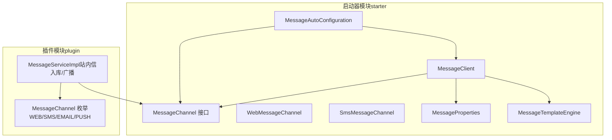
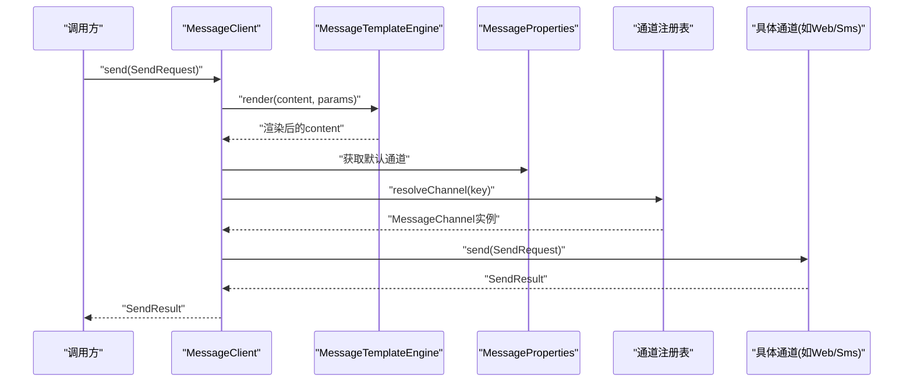
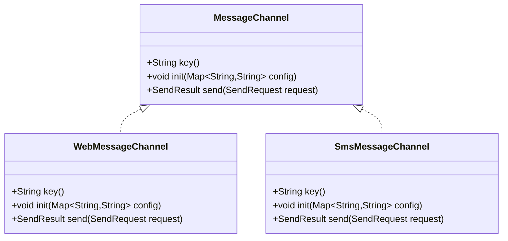
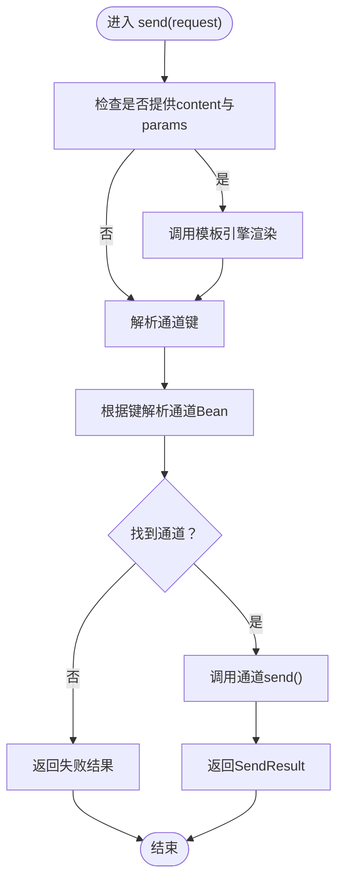
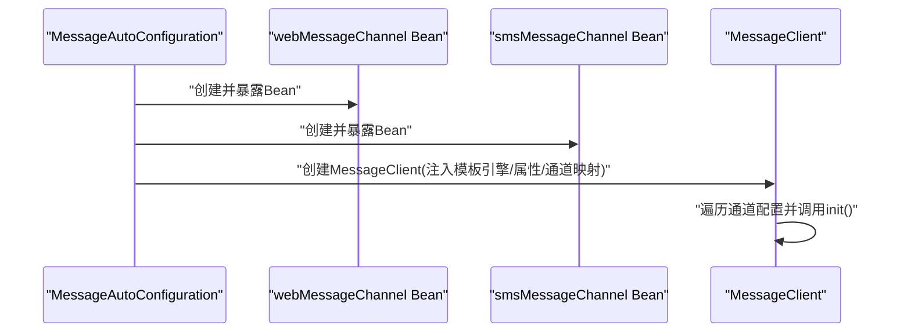
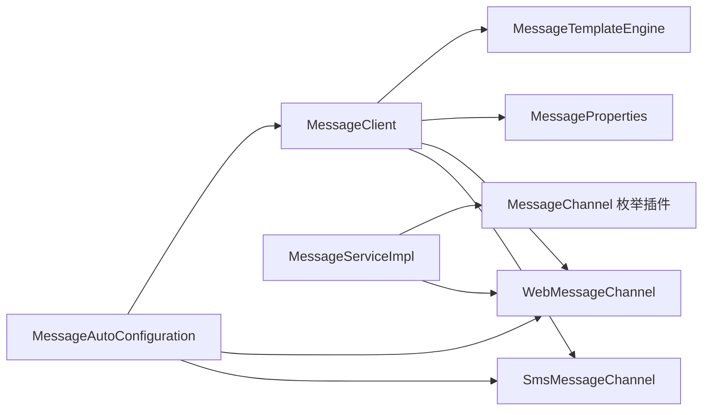

# 消息通道系统

<cite>
**本文引用的文件**
- [MessageChannel.java](file://forge/forge-framework/forge-starter-parent/forge-starter-message/src/main/java/com/mdframe/forge/starter/message/channel/MessageChannel.java)
- [WebMessageChannel.java](file://forge/forge-framework/forge-starter-parent/forge-starter-message/src/main/java/com/mdframe/forge/starter/message/channel/WebMessageChannel.java)
- [SmsMessageChannel.java](file://forge/forge-framework/forge-starter-parent/forge-starter-message/src/main/java/com/mdframe/forge/starter/message/channel/SmsMessageChannel.java)
- [MessageAutoConfiguration.java](file://forge/forge-framework/forge-starter-parent/forge-starter-message/src/main/java/com/mdframe/forge/starter/message/config/MessageAutoConfiguration.java)
- [MessageProperties.java](file://forge/forge-framework/forge-starter-parent/forge-starter-message/src/main/java/com/mdframe/forge/starter/message/config/MessageProperties.java)
- [MessageClient.java](file://forge/forge-framework/forge-starter-parent/forge-starter-message/src/main/java/com/mdframe/forge/starter/message/sdk/MessageClient.java)
- [MessageTemplateEngine.java](file://forge/forge-framework/forge-starter-parent/forge-starter-message/src/main/java/com/mdframe/forge/starter/message/service/MessageTemplateEngine.java)
- [MessageChannel 枚举（插件）.java](file://forge/forge-framework/forge-plugin-parent/forge-plugin-message/src/main/java/com/mdframe/forge/plugin/message/domain/MessageChannel.java)
- [MessageServiceImpl.java](file://forge/forge-framework/forge-plugin-parent/forge-plugin-message/src/main/java/com/mdframe/forge/plugin/message/service/impl/MessageServiceImpl.java)
- [org.springframework.boot.autoconfigure.AutoConfiguration.imports](file://forge/forge-framework/forge-starter-parent/forge-starter-message/src/main/resources/META-INF/spring/org.springframework.boot.autoconfigure.AutoConfiguration.imports)
- [spring-configuration-metadata.json](file://forge/forge-framework/forge-starter-parent/forge-starter-message/target/classes/META-INF/spring-configuration-metadata.json)
</cite>

## 目录
1. [简介](#简介)
2. [项目结构](#项目结构)
3. [核心组件](#核心组件)
4. [架构总览](#架构总览)
5. [详细组件分析](#详细组件分析)
6. [依赖关系分析](#依赖关系分析)
7. [性能考虑](#性能考虑)
8. [故障排查指南](#故障排查指南)
9. [结论](#结论)
10. [附录](#附录)

## 简介
本文件面向Forge框架的消息通道系统，系统采用“接口抽象 + Spring Boot自动装配 + 可插拔通道”的架构设计，支持多通道消息发送（如站内信、短信等）。通过统一的MessageClient对外提供发送能力，内部以MessageChannel接口抽象不同通道，并由MessageTemplateEngine提供模板渲染能力。系统具备通道注册、按需启用、模板渲染、默认通道选择等特性；同时预留扩展点以支持高可用（如负载均衡、故障转移）。

## 项目结构
消息通道相关代码主要位于两个模块：
- starter模块：提供通道接口、自动装配、客户端与模板引擎等通用能力
- plugin模块：提供业务侧消息发送实现与领域模型（如站内信持久化）

图表来源
- [MessageAutoConfiguration.java](file://forge/forge-framework/forge-starter-parent/forge-starter-message/src/main/java/com/mdframe/forge/starter/message/config/MessageAutoConfiguration.java#L17-L46)
- [MessageClient.java](file://forge/forge-framework/forge-starter-parent/forge-starter-message/src/main/java/com/mdframe/forge/starter/message/sdk/MessageClient.java#L10-L56)
- [MessageProperties.java](file://forge/forge-framework/forge-starter-parent/forge-starter-message/src/main/java/com/mdframe/forge/starter/message/config/MessageProperties.java#L7-L34)
- [MessageChannel.java](file://forge/forge-framework/forge-starter-parent/forge-starter-message/src/main/java/com/mdframe/forge/starter/message/channel/MessageChannel.java#L5-L40)
- [WebMessageChannel.java](file://forge/forge-framework/forge-starter-parent/forge-starter-message/src/main/java/com/mdframe/forge/starter/message/channel/WebMessageChannel.java#L5-L15)
- [SmsMessageChannel.java](file://forge/forge-framework/forge-starter-parent/forge-starter-message/src/main/java/com/mdframe/forge/starter/message/channel/SmsMessageChannel.java#L5-L15)
- [MessageTemplateEngine.java](file://forge/forge-framework/forge-starter-parent/forge-starter-message/src/main/java/com/mdframe/forge/starter/message/service/MessageTemplateEngine.java#L5-L23)
- [MessageChannel 枚举（插件）.java](file://forge/forge-framework/forge-plugin-parent/forge-plugin-message/src/main/java/com/mdframe/forge/plugin/message/domain/MessageChannel.java#L9-L38)
- [MessageServiceImpl.java](file://forge/forge-framework/forge-plugin-parent/forge-plugin-message/src/main/java/com/mdframe/forge/plugin/message/service/impl/MessageServiceImpl.java#L181-L197)

章节来源
- [MessageAutoConfiguration.java](file://forge/forge-framework/forge-starter-parent/forge-starter-message/src/main/java/com/mdframe/forge/starter/message/config/MessageAutoConfiguration.java#L17-L46)
- [MessageClient.java](file://forge/forge-framework/forge-starter-parent/forge-starter-message/src/main/java/com/mdframe/forge/starter/message/sdk/MessageClient.java#L10-L56)
- [MessageProperties.java](file://forge/forge-framework/forge-starter-parent/forge-starter-message/src/main/java/com/mdframe/forge/starter/message/config/MessageProperties.java#L7-L34)
- [MessageChannel.java](file://forge/forge-framework/forge-starter-parent/forge-starter-message/src/main/java/com/mdframe/forge/starter/message/channel/MessageChannel.java#L5-L40)
- [WebMessageChannel.java](file://forge/forge-framework/forge-starter-parent/forge-starter-message/src/main/java/com/mdframe/forge/starter/message/channel/WebMessageChannel.java#L5-L15)
- [SmsMessageChannel.java](file://forge/forge-framework/forge-starter-parent/forge-starter-message/src/main/java/com/mdframe/forge/starter/message/channel/SmsMessageChannel.java#L5-L15)
- [MessageTemplateEngine.java](file://forge/forge-framework/forge-starter-parent/forge-starter-message/src/main/java/com/mdframe/forge/starter/message/service/MessageTemplateEngine.java#L5-L23)
- [MessageChannel 枚举（插件）.java](file://forge/forge-framework/forge-plugin-parent/forge-plugin-message/src/main/java/com/mdframe/forge/plugin/message/domain/MessageChannel.java#L9-L38)
- [MessageServiceImpl.java](file://forge/forge-framework/forge-plugin-parent/forge-plugin-message/src/main/java/com/mdframe/forge/plugin/message/service/impl/MessageServiceImpl.java#L181-L197)

## 核心组件
- MessageChannel 接口：定义通道唯一键、初始化配置、发送消息的统一规范
- WebMessageChannel：站内信通道实现，负责系统内通知的落库/广播（占位返回成功）
- SmsMessageChannel：短信通道实现，预留第三方短信网关接入点
- MessageProperties：消息通道配置属性，支持默认通道与各通道开关及配置
- MessageAutoConfiguration：自动装配，注册通道Bean并创建MessageClient
- MessageClient：对外发送入口，负责模板渲染、通道解析与路由
- MessageTemplateEngine：简单模板渲染引擎，支持${key}变量替换

章节来源
- [MessageChannel.java](file://forge/forge-framework/forge-starter-parent/forge-starter-message/src/main/java/com/mdframe/forge/starter/message/channel/MessageChannel.java#L5-L40)
- [WebMessageChannel.java](file://forge/forge-framework/forge-starter-parent/forge-starter-message/src/main/java/com/mdframe/forge/starter/message/channel/WebMessageChannel.java#L5-L15)
- [SmsMessageChannel.java](file://forge/forge-framework/forge-starter-parent/forge-starter-message/src/main/java/com/mdframe/forge/starter/message/channel/SmsMessageChannel.java#L5-L15)
- [MessageProperties.java](file://forge/forge-framework/forge-starter-parent/forge-starter-message/src/main/java/com/mdframe/forge/starter/message/config/MessageProperties.java#L7-L34)
- [MessageAutoConfiguration.java](file://forge/forge-framework/forge-starter-parent/forge-starter-message/src/main/java/com/mdframe/forge/starter/message/config/MessageAutoConfiguration.java#L17-L46)
- [MessageClient.java](file://forge/forge-framework/forge-starter-parent/forge-starter-message/src/main/java/com/mdframe/forge/starter/message/sdk/MessageClient.java#L10-L56)
- [MessageTemplateEngine.java](file://forge/forge-framework/forge-starter-parent/forge-starter-message/src/main/java/com/mdframe/forge/starter/message/service/MessageTemplateEngine.java#L5-L23)

## 架构总览
系统通过Spring Boot自动装配加载通道Bean，MessageClient在构造时读取MessageProperties中的通道配置并逐个调用对应通道的init方法进行初始化，随后根据请求中的channel字段或默认通道选择具体通道执行发送。

图表来源
- [MessageClient.java](file://forge/forge-framework/forge-starter-parent/forge-starter-message/src/main/java/com/mdframe/forge/starter/message/sdk/MessageClient.java#L34-L54)
- [MessageTemplateEngine.java](file://forge/forge-framework/forge-starter-parent/forge-starter-message/src/main/java/com/mdframe/forge/starter/message/service/MessageTemplateEngine.java#L10-L21)
- [MessageProperties.java](file://forge/forge-framework/forge-starter-parent/forge-starter-message/src/main/java/com/mdframe/forge/starter/message/config/MessageProperties.java#L29-L32)
- [MessageAutoConfiguration.java](file://forge/forge-framework/forge-starter-parent/forge-starter-message/src/main/java/com/mdframe/forge/starter/message/config/MessageAutoConfiguration.java#L27-L45)

## 详细组件分析

### 组件A：MessageChannel 接口与通道实现
- 设计要点
  - key()：通道唯一标识（如web、sms）
  - init(config)：按需初始化通道配置（如鉴权、连接串等）
  - send(request)：统一发送入口，返回SendResult
- WebMessageChannel
  - 作为站内信通道，当前实现为占位返回成功，实际落库/推送由插件模块完成
- SmsMessageChannel
  - 作为短信通道，预留第三方短信网关接入点（如阿里云、华为云等）

图表来源
- [MessageChannel.java](file://forge/forge-framework/forge-starter-parent/forge-starter-message/src/main/java/com/mdframe/forge/starter/message/channel/MessageChannel.java#L5-L40)
- [WebMessageChannel.java](file://forge/forge-framework/forge-starter-parent/forge-starter-message/src/main/java/com/mdframe/forge/starter/message/channel/WebMessageChannel.java#L5-L15)
- [SmsMessageChannel.java](file://forge/forge-framework/forge-starter-parent/forge-starter-message/src/main/java/com/mdframe/forge/starter/message/channel/SmsMessageChannel.java#L5-L15)

章节来源
- [MessageChannel.java](file://forge/forge-framework/forge-starter-parent/forge-starter-message/src/main/java/com/mdframe/forge/starter/message/channel/MessageChannel.java#L5-L40)
- [WebMessageChannel.java](file://forge/forge-framework/forge-starter-parent/forge-starter-message/src/main/java/com/mdframe/forge/starter/message/channel/WebMessageChannel.java#L5-L15)
- [SmsMessageChannel.java](file://forge/forge-framework/forge-starter-parent/forge-starter-message/src/main/java/com/mdframe/forge/starter/message/channel/SmsMessageChannel.java#L5-L15)

### 组件B：MessageClient 发送流程
- 模板渲染：若请求包含content与params，则使用MessageTemplateEngine进行渲染
- 通道解析：优先使用请求中的channel字段，否则回退到MessageProperties.defaultChannel
- 通道路由：根据通道键拼接Bean名称（如xxxMessageChannel）查找并调用
- 错误处理：若通道不可用，返回失败结果

图表来源
- [MessageClient.java](file://forge/forge-framework/forge-starter-parent/forge-starter-message/src/main/java/com/mdframe/forge/starter/message/sdk/MessageClient.java#L34-L54)
- [MessageTemplateEngine.java](file://forge/forge-framework/forge-starter-parent/forge-starter-message/src/main/java/com/mdframe/forge/starter/message/service/MessageTemplateEngine.java#L10-L21)
- [MessageProperties.java](file://forge/forge-framework/forge-starter-parent/forge-starter-message/src/main/java/com/mdframe/forge/starter/message/config/MessageProperties.java#L29-L32)

章节来源
- [MessageClient.java](file://forge/forge-framework/forge-starter-parent/forge-starter-message/src/main/java/com/mdframe/forge/starter/message/sdk/MessageClient.java#L10-L56)
- [MessageTemplateEngine.java](file://forge/forge-framework/forge-starter-parent/forge-starter-message/src/main/java/com/mdframe/forge/starter/message/service/MessageTemplateEngine.java#L5-L23)
- [MessageProperties.java](file://forge/forge-framework/forge-starter-parent/forge-starter-message/src/main/java/com/mdframe/forge/starter/message/config/MessageProperties.java#L7-L34)

### 组件C：MessageAutoConfiguration 与通道注册
- 注册策略
  - webMessageChannel：当配置前缀forge.message.channel.web.enabled为true时启用（默认启用）
  - smsMessageChannel：当配置前缀forge.message.channel.sms.enabled为true时启用
  - MessageClient：在缺少Bean时创建，注入模板引擎、属性与通道Bean映射
- 初始化流程：MessageClient在构造时遍历MessageProperties中的通道配置，调用对应通道的init方法传入配置

图表来源
- [MessageAutoConfiguration.java](file://forge/forge-framework/forge-starter-parent/forge-starter-message/src/main/java/com/mdframe/forge/starter/message/config/MessageAutoConfiguration.java#L27-L45)
- [MessageClient.java](file://forge/forge-framework/forge-starter-parent/forge-starter-message/src/main/java/com/mdframe/forge/starter/message/sdk/MessageClient.java#L18-L32)

章节来源
- [MessageAutoConfiguration.java](file://forge/forge-framework/forge-starter-parent/forge-starter-message/src/main/java/com/mdframe/forge/starter/message/config/MessageAutoConfiguration.java#L17-L46)
- [MessageClient.java](file://forge/forge-framework/forge-starter-parent/forge-starter-message/src/main/java/com/mdframe/forge/starter/message/sdk/MessageClient.java#L18-L32)

### 组件D：MessageProperties 配置模型
- defaultChannel：默认通道键（如web、sms等）
- channel：通道配置映射，每项包含enabled与config两部分
- 作用：为MessageClient提供通道启用状态与初始化参数

章节来源
- [MessageProperties.java](file://forge/forge-framework/forge-starter-parent/forge-starter-message/src/main/java/com/mdframe/forge/starter/message/config/MessageProperties.java#L7-L34)
- [spring-configuration-metadata.json](file://forge/forge-framework/forge-starter-parent/forge-starter-message/target/classes/META-INF/spring-configuration-metadata.json#L1-L25)

### 组件E：MessageTemplateEngine 模板引擎
- 功能：对content中的${key}进行替换，支持空值安全
- 使用场景：在MessageClient中对请求内容进行预渲染

章节来源
- [MessageTemplateEngine.java](file://forge/forge-framework/forge-starter-parent/forge-starter-message/src/main/java/com/mdframe/forge/starter/message/service/MessageTemplateEngine.java#L5-L23)
- [MessageClient.java](file://forge/forge-framework/forge-starter-parent/forge-starter-message/src/main/java/com/mdframe/forge/starter/message/sdk/MessageClient.java#L36-L38)

### 组件F：插件模块中的站内信实现
- 插件侧MessageChannel枚举包含WEB/SMS/EMAIL/PUSH四种渠道
- MessageServiceImpl中针对WEB通道直接返回成功（站内信无需第三方通道），其余通道（SMS/EMAIL/PUSH）通过MessageChannel.SendRequest调用第三方服务
- 注意：为避免内存溢出，向第三方通道传递用户列表时采用分批处理

章节来源
- [MessageChannel 枚举（插件）.java](file://forge/forge-framework/forge-plugin-parent/forge-plugin-message/src/main/java/com/mdframe/forge/plugin/message/domain/MessageChannel.java#L9-L38)
- [MessageServiceImpl.java](file://forge/forge-framework/forge-plugin-parent/forge-plugin-message/src/main/java/com/mdframe/forge/plugin/message/service/impl/MessageServiceImpl.java#L181-L197)

## 依赖关系分析
- 自动装配入口：通过META-INF下的自动装配导入文件声明自动配置类
- 组件耦合：
  - MessageClient依赖MessageTemplateEngine、MessageProperties与通道Bean映射
  - 通道实现依赖MessageChannel接口
  - 插件模块依赖通道接口与领域枚举

图表来源
- [org.springframework.boot.autoconfigure.AutoConfiguration.imports](file://forge/forge-framework/forge-starter-parent/forge-starter-message/src/main/resources/META-INF/spring/org.springframework.boot.autoconfigure.AutoConfiguration.imports#L1-L2)
- [MessageAutoConfiguration.java](file://forge/forge-framework/forge-starter-parent/forge-starter-message/src/main/java/com/mdframe/forge/starter/message/config/MessageAutoConfiguration.java#L17-L46)
- [MessageClient.java](file://forge/forge-framework/forge-starter-parent/forge-starter-message/src/main/java/com/mdframe/forge/starter/message/sdk/MessageClient.java#L10-L56)
- [MessageChannel 枚举（插件）.java](file://forge/forge-framework/forge-plugin-parent/forge-plugin-message/src/main/java/com/mdframe/forge/plugin/message/domain/MessageChannel.java#L9-L38)
- [MessageServiceImpl.java](file://forge/forge-framework/forge-plugin-parent/forge-plugin-message/src/main/java/com/mdframe/forge/plugin/message/service/impl/MessageServiceImpl.java#L181-L197)

章节来源
- [org.springframework.boot.autoconfigure.AutoConfiguration.imports](file://forge/forge-framework/forge-starter-parent/forge-starter-message/src/main/resources/META-INF/spring/org.springframework.boot.autoconfigure.AutoConfiguration.imports#L1-L2)
- [MessageAutoConfiguration.java](file://forge/forge-framework/forge-starter-parent/forge-starter-message/src/main/java/com/mdframe/forge/starter/message/config/MessageAutoConfiguration.java#L17-L46)
- [MessageClient.java](file://forge/forge-framework/forge-starter-parent/forge-starter-message/src/main/java/com/mdframe/forge/starter/message/sdk/MessageClient.java#L10-L56)
- [MessageChannel 枚举（插件）.java](file://forge/forge-framework/forge-plugin-parent/forge-plugin-message/src/main/java/com/mdframe/forge/plugin/message/domain/MessageChannel.java#L9-L38)
- [MessageServiceImpl.java](file://forge/forge-framework/forge-plugin-parent/forge-plugin-message/src/main/java/com/mdframe/forge/plugin/message/service/impl/MessageServiceImpl.java#L181-L197)

## 性能考虑
- 模板渲染复杂度：模板替换为字符串遍历替换，时间复杂度近似O(n*m)，其中n为模板长度，m为参数数量；建议控制模板规模与参数数量
- 通道初始化：在MessageClient构造阶段批量初始化，避免运行时逐次初始化开销
- 分批处理：插件侧对用户列表进行分批插入，降低内存占用与数据库压力
- 并发控制：当前通道实现未内置连接池/并发限制，建议在具体通道实现中引入连接池与限流策略（见“高可用与扩展”）

## 故障排查指南
- 通道不可用
  - 现象：返回“channel not available”
  - 排查：确认通道键是否存在、Bean是否正确注册、配置开关是否开启
- 模板渲染异常
  - 现象：content未按预期渲染
  - 排查：确认请求中content与params是否同时提供；检查模板语法是否符合${key}格式
- 默认通道错误
  - 现象：未指定channel时未走预期通道
  - 排查：检查MessageProperties.defaultChannel配置
- 第三方通道集成问题
  - 现象：短信/邮件/推送发送失败
  - 排查：在具体通道实现中补充init与send逻辑，确保凭证与网络连通性

章节来源
- [MessageClient.java](file://forge/forge-framework/forge-starter-parent/forge-starter-message/src/main/java/com/mdframe/forge/starter/message/sdk/MessageClient.java#L40-L44)
- [MessageTemplateEngine.java](file://forge/forge-framework/forge-starter-parent/forge-starter-message/src/main/java/com/mdframe/forge/starter/message/service/MessageTemplateEngine.java#L10-L21)
- [MessageProperties.java](file://forge/forge-framework/forge-starter-parent/forge-starter-message/src/main/java/com/mdframe/forge/starter/message/config/MessageProperties.java#L13-L13)

## 结论
Forge消息通道系统以接口抽象与自动装配为核心，实现了可插拔、可配置的消息发送能力。当前已提供站内信与短信通道的基础骨架，插件模块负责站内信的持久化与广播。系统具备模板渲染、默认通道与通道注册等基础能力，高可用（负载均衡、故障转移）与连接池/并发控制等扩展可通过在具体通道实现中增强。

## 附录

### 配置参数清单
- forge.message.default-channel：默认通道键（如web、sms等）
- forge.message.channel.<key>.enabled：通道开关
- forge.message.channel.<key>.config：通道配置映射（由各通道实现消费）

章节来源
- [MessageProperties.java](file://forge/forge-framework/forge-starter-parent/forge-starter-message/src/main/java/com/mdframe/forge/starter/message/config/MessageProperties.java#L13-L18)
- [spring-configuration-metadata.json](file://forge/forge-framework/forge-starter-parent/forge-starter-message/target/classes/META-INF/spring-configuration-metadata.json#L11-L22)

### 各通道特点与配置方法
- 站内信（web）
  - 特点：系统内通知，当前实现为占位成功，实际落库/推送由插件模块完成
  - 配置：forge.message.channel.web.enabled=true（默认启用）
- 短信（sms）
  - 特点：预留第三方短信网关接入点
  - 配置：forge.message.channel.sms.enabled=true（需配合具体通道实现）

章节来源
- [WebMessageChannel.java](file://forge/forge-framework/forge-starter-parent/forge-starter-message/src/main/java/com/mdframe/forge/starter/message/channel/WebMessageChannel.java#L7-L7)
- [SmsMessageChannel.java](file://forge/forge-framework/forge-starter-parent/forge-starter-message/src/main/java/com/mdframe/forge/starter/message/channel/SmsMessageChannel.java#L7-L7)
- [MessageAutoConfiguration.java](file://forge/forge-framework/forge-starter-parent/forge-starter-message/src/main/java/com/mdframe/forge/starter/message/config/MessageAutoConfiguration.java#L27-L37)

### 通道注册机制与Bean命名约定
- Bean命名：通道Bean名称为“<key>MessageChannel”，例如webMessageChannel、smsMessageChannel
- 解析规则：MessageClient.resolveChannel会优先按“<key>MessageChannel”查找，找不到则回退到“<key>”

章节来源
- [MessageAutoConfiguration.java](file://forge/forge-framework/forge-starter-parent/forge-starter-message/src/main/java/com/mdframe/forge/starter/message/config/MessageAutoConfiguration.java#L27-L37)
- [MessageClient.java](file://forge/forge-framework/forge-starter-parent/forge-starter-message/src/main/java/com/mdframe/forge/starter/message/sdk/MessageClient.java#L47-L54)

### 高可用性设计建议
- 负载均衡：在具体通道实现中引入连接池与多实例轮询策略
- 故障转移：在send失败时重试并切换备用实例，记录外部ID便于追踪
- 监控与告警：采集通道发送耗时、成功率、失败原因等指标

[本节为通用建议，不直接分析具体文件]